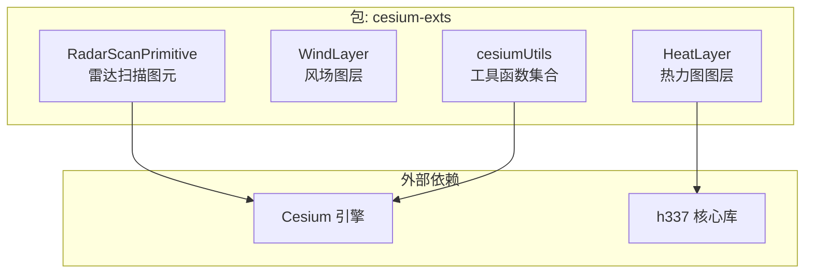
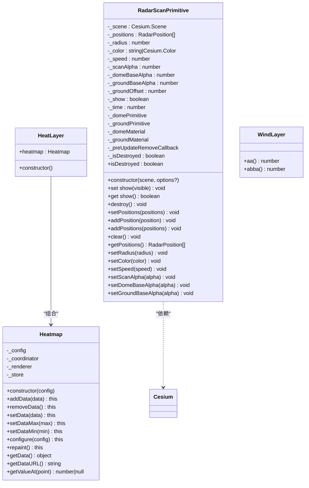
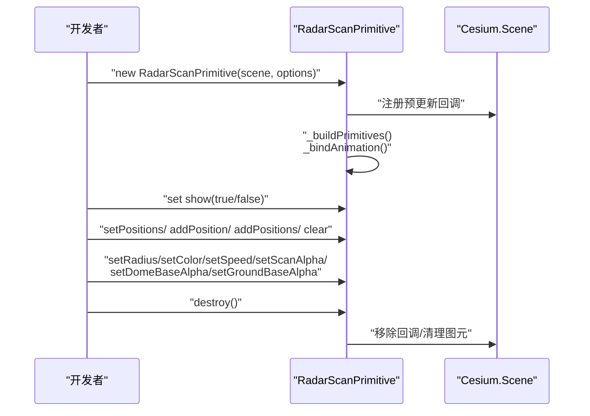
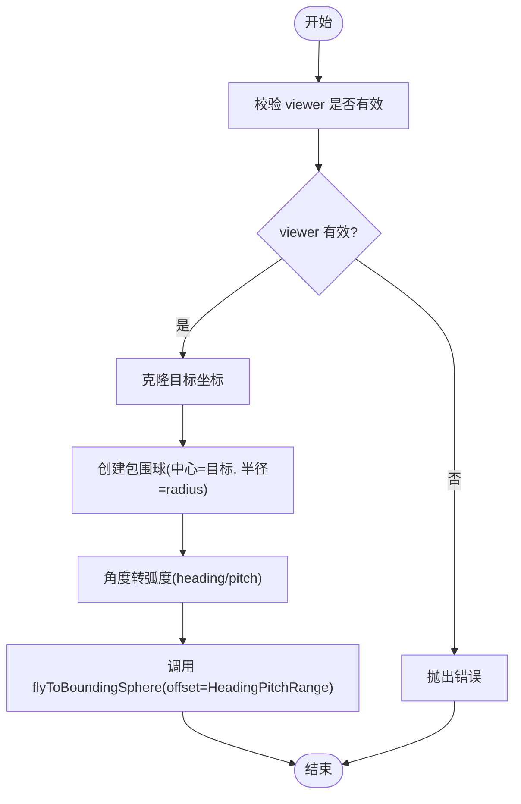
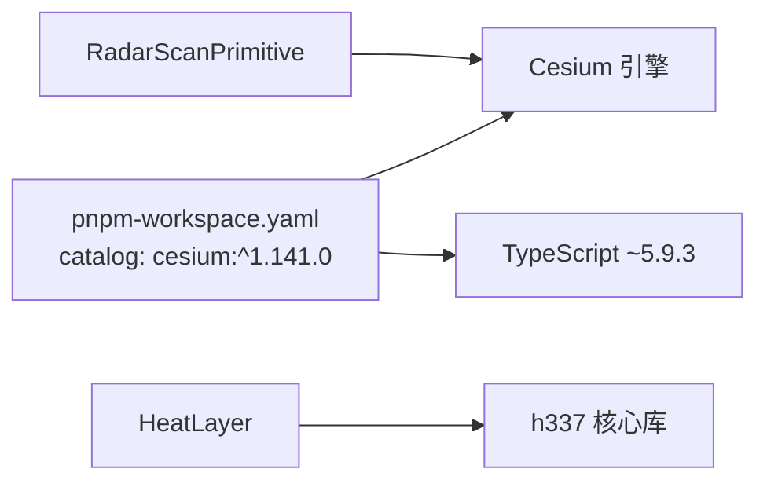

# API 参考

<cite>
**本文档引用的文件**
- [packages/cesium-exts/dist/types/index.d.ts](file://packages/cesium-exts/dist/types/index.d.ts)
- [packages/cesium-exts/src/Utils/cesiumUtils.ts](file://packages/cesium-exts/src/Utils/cesiumUtils.ts)
- [packages/cesium-exts/src/modules/HeatLayer/index.ts](file://packages/cesium-exts/src/modules/HeatLayer/index.ts)
- [packages/cesium-exts/src/modules/HeatLayer/src/config.ts](file://packages/cesium-exts/src/modules/HeatLayer/src/config.ts)
- [package.json](file://package.json)
- [pnpm-workspace.yaml](file://pnpm-workspace.yaml)
</cite>

## 目录

1. [简介](#简介)
2. [项目结构](#项目结构)
3. [核心组件](#核心组件)
4. [架构总览](#架构总览)
5. [详细组件分析](#详细组件分析)
6. [依赖分析](#依赖分析)
7. [性能考量](#性能考量)
8. [故障排除指南](#故障排除指南)
9. [结论](#结论)
10. [附录](#附录)

## 简介

本文件为 cesium-exts 库的完整 API 参考，覆盖以下核心模块与工具：

- 热力图模块：HeatLayer 与 Heatmap（基于 h337 核心）
- 风场模块：WindLayer（占位接口）
- 工具函数：相机视角平滑飞行、版本查询等
- 配置选项：热力图默认配置
- TypeScript 类型定义：完整导出与使用说明
- 版本兼容性与废弃迁移：当前可用信息与建议

本参考严格依据仓库中的类型声明与源码实现整理，确保准确性与权威性。

## 项目结构

- 顶层 monorepo 使用 pnpm 工作区管理，包含应用与包两个层面
- 本 API 参考聚焦于 packages/cesium-exts 包，其对外导出包括：
  - HeatLayer：热力图图层封装
  - WindLayer：风场图层占位
  - Radar（RadarScanPrimitive）：立体雷达扫描图元
  - 工具函数：cesiumVersion、cesiumExtsVersion、flyToTarget
- 类型声明位于 dist/types/index.d.ts，实际实现位于 src/ 目录

**图表来源**

- [packages/cesium-exts/dist/types/index.d.ts:174-343](file://packages/cesium-exts/dist/types/index.d.ts#L174-L343)
- [packages/cesium-exts/src/modules/HeatLayer/index.ts:1-13](file://packages/cesium-exts/src/modules/HeatLayer/index.ts#L1-L13)

**章节来源**

- [packages/cesium-exts/dist/types/index.d.ts:1-346](file://packages/cesium-exts/dist/types/index.d.ts#L1-L346)
- [packages/cesium-exts/src/Utils/cesiumUtils.ts:1-106](file://packages/cesium-exts/src/Utils/cesiumUtils.ts#L1-L106)
- [packages/cesium-exts/src/modules/HeatLayer/index.ts:1-13](file://packages/cesium-exts/src/modules/HeatLayer/index.ts#L1-L13)
- [packages/cesium-exts/src/modules/HeatLayer/src/config.ts:1-31](file://packages/cesium-exts/src/modules/HeatLayer/src/config.ts#L1-L31)

## 核心组件

- HeatLayer：热力图图层封装，内部持有 Heatmap 实例
- Heatmap：热力图核心渲染类，提供数据接入、配置、重绘、取值等能力
- WindLayer：风场图层占位类，当前仅暴露占位方法
- RadarScanPrimitive：立体雷达扫描图元，支持多实例批量渲染与动态参数调整
- 工具函数：cesiumVersion、cesiumExtsVersion、flyToTarget

**章节来源**

- [packages/cesium-exts/dist/types/index.d.ts:88-343](file://packages/cesium-exts/dist/types/index.d.ts#L88-L343)
- [packages/cesium-exts/src/Utils/cesiumUtils.ts:1-106](file://packages/cesium-exts/src/Utils/cesiumUtils.ts#L1-L106)

## 架构总览

下图展示热力图与雷达扫描两类主要功能的架构关系与数据流：

**图表来源**

- [packages/cesium-exts/dist/types/index.d.ts:88-343](file://packages/cesium-exts/dist/types/index.d.ts#L88-L343)

## 详细组件分析

### 热力图模块（HeatLayer 与 Heatmap）

#### HeatLayer

- 角色：对热力图进行封装，便于在 Cesium 场景中集成与使用
- 关键点：
  - 内部持有 Heatmap 实例
  - 构造时通过 h337 创建默认配置的热力图实例
- 使用场景：需要在 Cesium 中叠加热力图效果的可视化需求

**章节来源**

- [packages/cesium-exts/src/modules/HeatLayer/index.ts:1-13](file://packages/cesium-exts/src/modules/HeatLayer/index.ts#L1-L13)
- [packages/cesium-exts/dist/types/index.d.ts:174-177](file://packages/cesium-exts/dist/types/index.d.ts#L174-L177)

#### Heatmap（核心渲染类）

- 角色：热力图数据接入、配置、渲染与查询的核心类
- 主要方法与职责：
  - addData(data)：添加单个或多个数据点；返回当前实例，支持链式调用
  - removeData()：移除数据（声明为待实现）
  - setData(data)：设置完整数据集（包含 min、max、data）
  - setDataMax(max)/setDataMin(min)：设置数据最大/最小值
  - configure(config)：动态重配置
  - repaint()：强制重新绘制
  - getData()：获取当前数据集
  - getDataURL()：获取热力图 DataURL（base64）
  - getValueAt(point)：查询指定坐标的数值，可能返回 null
- 参数与返回值：
  - addData：接收 DataPoint 或 DataPoint[]，返回 this
  - setData：接收包含 min、max、data 的对象，返回 this
  - setDataMax/setDataMin：接收 number，返回 this
  - configure：接收任意配置对象，返回 this
  - repaint：无参数，返回 this
  - getData：返回包含 min、max、data 的对象
  - getDataURL：返回 string（base64）
  - getValueAt：接收包含 x、y 的对象，返回 number 或 null
- 异常处理：
  - 未在类型声明中显式抛出异常；具体错误行为取决于底层 h337 实现
- 使用示例：
  - 参考 HeatLayer 的构造方式，结合 addData、setData、configure 等方法进行数据与样式配置

**章节来源**

- [packages/cesium-exts/dist/types/index.d.ts:88-172](file://packages/cesium-exts/dist/types/index.d.ts#L88-L172)

#### 热力图配置（HeatmapConfig）

- 作用：提供热力图默认配置项，便于统一管理与扩展
- 关键默认值（来自类型声明与实现）：
  - defaultRadius: 40
  - defaultRenderer: "webgl"
  - defaultGradient: 以阈值映射的颜色表
  - defaultMaxOpacity: 1
  - defaultMinOpacity: 0
  - defaultBlur: 0.85
  - defaultXField: "x"
  - defaultYField: "y"
  - defaultValueField: "value"
  - plugins: {}
- 适用场景：在业务中统一热力图样式与渲染策略，减少重复配置

**章节来源**

- [packages/cesium-exts/src/modules/HeatLayer/src/config.ts:1-31](file://packages/cesium-exts/src/modules/HeatLayer/src/config.ts#L1-L31)

#### 热力图数据点接口（DataPoint）

- 字段说明：
  - x: number（必填）
  - y: number（必填）
  - value: number（必填）
  - radius?: number（可选）
- 用途：作为热力图数据输入的标准结构

**章节来源**

- [packages/cesium-exts/dist/types/index.d.ts:78-86](file://packages/cesium-exts/dist/types/index.d.ts#L78-L86)

### 风场模块（WindLayer）

- 角色：风场图层占位类，当前仅暴露占位方法（aa、abba）
- 注意事项：
  - 当前实现为占位，不提供实际功能
  - 建议在后续版本完善 API 定义与实现

**章节来源**

- [packages/cesium-exts/dist/types/index.d.ts:340-343](file://packages/cesium-exts/dist/types/index.d.ts#L340-L343)

### 雷达扫描模块（RadarScanPrimitive）

- 角色：高性能立体雷达扫描图元，支持多实例批量渲染与动态参数调整
- 关键属性与方法概览：
  - 构造函数：接收 Cesium.Scene 与可选配置对象
  - show 属性：getter/setter 控制显示/隐藏
  - destroy()：彻底销毁组件，释放 GPU 显存与事件绑定
  - isDestroyed：只读属性，检查实例是否已销毁
  - setPositions/addPosition/addPositions/clear：管理雷达点位
  - getPositions：获取当前点位克隆副本
  - setRadius/setColor/setSpeed/setScanAlpha/setDomeBaseAlpha/setGroundBaseAlpha：动态修改渲染参数
- 配置项（RadarScanOptions）：
  - positions?: RadarPosition[]（默认 []）
  - radius?: number（默认 1500）
  - color?: string | Cesium.Color（默认 "#99ff00"）
  - speed?: number（默认 1.0）
  - scanAlpha?: number（默认 0.8）
  - domeBaseAlpha?: number（默认 0.2）
  - groundBaseAlpha?: number（默认 0.15）
  - groundOffset?: number（默认 5.0）
  - show?: boolean（默认 true）
- 使用场景：需要在三维场景中展示雷达扫描效果的可视化需求
- 性能提示：
  - 多数参数修改为纯 GPU 级运算，即时生效
  - setRadius 会触发几何体重建，频繁调用需在业务层增加防抖

**图表来源**

- [packages/cesium-exts/dist/types/index.d.ts:219-338](file://packages/cesium-exts/dist/types/index.d.ts#L219-L338)

**章节来源**

- [packages/cesium-exts/dist/types/index.d.ts:180-338](file://packages/cesium-exts/dist/types/index.d.ts#L180-L338)

### 工具函数

#### cesiumVersion()

- 功能：返回当前 Cesium 库的版本号字符串
- 返回：string
- 示例：参见类型声明中的示例片段路径
- 适用场景：运行时检测 Cesium 版本，用于兼容性判断

**章节来源**

- [packages/cesium-exts/dist/types/index.d.ts:3-26](file://packages/cesium-exts/dist/types/index.d.ts#L3-L26)
- [packages/cesium-exts/src/Utils/cesiumUtils.ts:5-18](file://packages/cesium-exts/src/Utils/cesiumUtils.ts#L5-L18)

#### cesiumExtsVersion()

- 功能：返回当前 cesium-exts 库的版本号
- 返回：string
- 示例：参见类型声明中的示例片段路径
- 适用场景：运行时检测扩展库版本，辅助诊断与升级

**章节来源**

- [packages/cesium-exts/dist/types/index.d.ts:16-33](file://packages/cesium-exts/dist/types/index.d.ts#L16-L33)
- [packages/cesium-exts/src/Utils/cesiumUtils.ts:20-33](file://packages/cesium-exts/src/Utils/cesiumUtils.ts#L20-L33)

#### flyToTarget(viewer, options)

- 功能：平滑飞行到指定目标的相机视角（基于包围球）
- 参数：
  - viewer: Cesium.Viewer（必填）
  - options:
    - targetPosition: Cesium.Cartesian3（必填）
    - radius?: number（默认 10）
    - heading?: number（默认 0，单位度）
    - pitch?: number（默认 -45，单位度）
    - range?: number（默认 15000，单位米）
    - duration?: number（默认 1.5，单位秒）
- 返回：void
- 异常：当 viewer 为 null 或 undefined 时抛出错误
- 使用场景：快速将相机移动到目标区域并设置合适视角
- 重要提示：该方法基于 flyToBoundingSphere 实现，目标点作为包围球中心定位；如需直接设置视角而不动画，可使用 viewer.camera.setView

**图表来源**

- [packages/cesium-exts/src/Utils/cesiumUtils.ts:71-103](file://packages/cesium-exts/src/Utils/cesiumUtils.ts#L71-L103)

**章节来源**

- [packages/cesium-exts/dist/types/index.d.ts:28-70](file://packages/cesium-exts/dist/types/index.d.ts#L28-L70)
- [packages/cesium-exts/src/Utils/cesiumUtils.ts:35-103](file://packages/cesium-exts/src/Utils/cesiumUtils.ts#L35-L103)

## 依赖分析

- 外部依赖：
  - Cesium：版本由工作区 catalog 指定为 ^1.141.0
  - h337：热力图核心库，通过 HeatLayer 的入口导入
- 内部依赖：
  - HeatLayer 依赖 h337 的 create 方法
  - RadarScanPrimitive 依赖 Cesium.Scene 与 Cesium 相关类型
- 版本约束：
  - Node 引擎要求 >= 22.18.0
  - TypeScript 版本 ~5.9.3

**图表来源**

- [pnpm-workspace.yaml:4-12](file://pnpm-workspace.yaml#L4-L12)
- [packages/cesium-exts/src/modules/HeatLayer/index.ts](file://packages/cesium-exts/src/modules/HeatLayer/index.ts#L1)

**章节来源**

- [pnpm-workspace.yaml:1-12](file://pnpm-workspace.yaml#L1-L12)
- [package.json:28-33](file://package.json#L28-L33)

## 性能考量

- RadarScanPrimitive：
  - 多数参数修改为 GPU 级运算，即时生效，无额外 CPU 开销
  - setRadius 会重建几何体，频繁调用需在业务层增加防抖
  - 采用 GeometryInstance 合并与自定义 Shader 技术，支持海量实例同屏渲染
- HeatLayer/Heatmap：
  - 依赖 h337 的 WebGL 渲染器，性能表现取决于数据规模与配置
  - 建议合理设置 radius、blur、gradient 等参数以平衡视觉与性能
- 工具函数 flyToTarget：
  - 基于 Cesium 内置动画接口，性能稳定；避免在动画过程中频繁调用

[本节为通用性能指导，无需特定文件来源]

## 故障排除指南

- flyToTarget 抛出“无效 Viewer”错误
  - 现象：传入 null 或 undefined 的 viewer 导致抛错
  - 处理：确保传入有效的 Cesium.Viewer 实例后再调用
- RadarScanPrimitive 销毁后继续调用方法
  - 现象：调用 destroy() 后继续修改参数或访问属性可能导致异常
  - 处理：在销毁后不再使用实例；通过 isDestroyed 属性进行状态检查
- 热力图数据未显示或显示异常
  - 现象：数据点坐标或数值不符合预期
  - 处理：确认 DataPoint 结构与字段名一致；检查 setDataMin/SetDataMax 与 gradient 的匹配关系

**章节来源**

- [packages/cesium-exts/src/Utils/cesiumUtils.ts:84-86](file://packages/cesium-exts/src/Utils/cesiumUtils.ts#L84-L86)
- [packages/cesium-exts/dist/types/index.d.ts:269-276](file://packages/cesium-exts/dist/types/index.d.ts#L269-L276)

## 结论

本 API 参考覆盖了热力图、风场、雷达扫描与工具函数的完整接口定义与使用说明。HeatLayer 与 Heatmap 提供了完整的数据接入与渲染能力；RadarScanPrimitive 在性能与交互上具备优势；工具函数则提供了版本查询与相机视角平滑飞行的能力。对于 WindLayer，当前为占位实现，建议在后续版本完善。

[本节为总结性内容，无需特定文件来源]

## 附录

### TypeScript 类型定义参考

- DataPoint：标准热力图数据点接口
- RadarPosition：雷达点位接口（longitude、latitude、height）
- RadarScanOptions：雷达扫描配置项集合
- Heatmap：热力图核心类（方法与属性详见“热力图模块”）
- HeatLayer：热力图图层封装类
- WindLayer：风场图层占位类
- RadarScanPrimitive：雷达扫描图元类

**章节来源**

- [packages/cesium-exts/dist/types/index.d.ts:78-343](file://packages/cesium-exts/dist/types/index.d.ts#L78-L343)

### 版本兼容性与废弃迁移

- Cesium 版本：^1.141.0（工作区 catalog 指定）
- Node 版本：>= 22.18.0（引擎要求）
- TypeScript 版本：~5.9.3（工作区 catalog 指定）
- 兼容性建议：
  - 在升级 Cesium 版本时，优先验证 flyToTarget 与 RadarScanPrimitive 的行为
  - 如需升级 h337，请同步核对 Heatmap 的配置项与行为变化
- 废弃 API 与迁移：
  - WindLayer 当前为占位实现，不建议在生产环境使用
  - RadarScanPrimitive 的参数修改均为就地更新，不存在废弃 API；如未来新增方法，请关注类型声明变更

**章节来源**

- [pnpm-workspace.yaml:4-12](file://pnpm-workspace.yaml#L4-L12)
- [package.json:28-33](file://package.json#L28-L33)
- [packages/cesium-exts/dist/types/index.d.ts:340-343](file://packages/cesium-exts/dist/types/index.d.ts#L340-L343)
