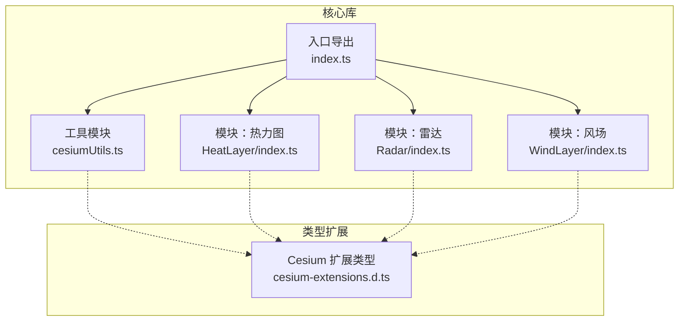
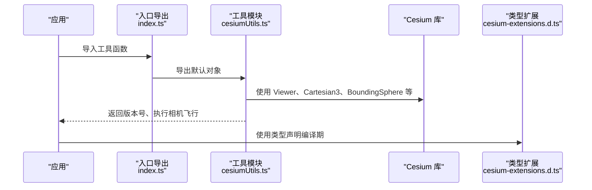
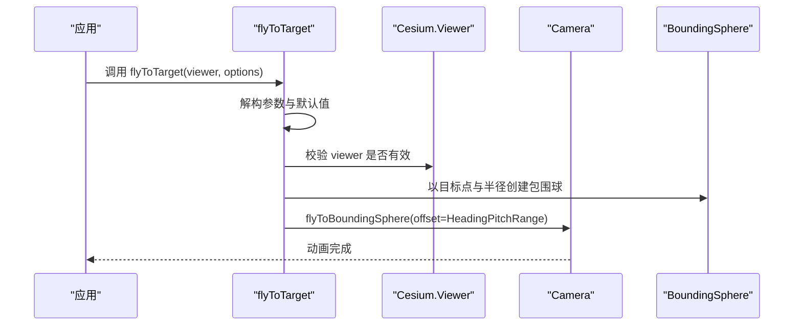
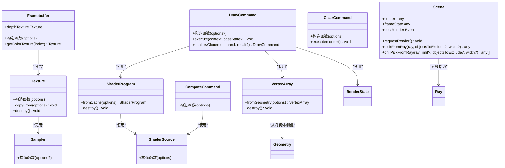
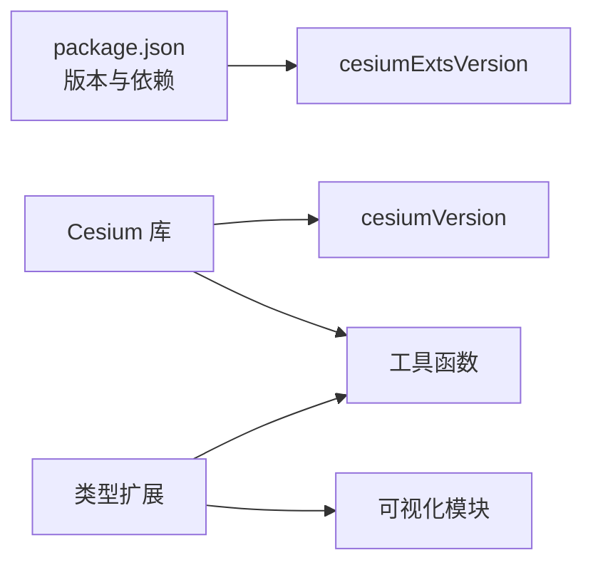

# 工具函数 API

<cite>
**本文引用的文件**
- [packages/cesium-exts/index.ts](file://packages/cesium-exts/index.ts)
- [packages/cesium-exts/src/Utils/cesiumUtils.ts](file://packages/cesium-exts/src/Utils/cesiumUtils.ts)
- [packages/cesium-exts/types/cesium-extensions.d.ts](file://packages/cesium-exts/types/cesium-extensions.d.ts)
- [packages/cesium-exts/package.json](file://packages/cesium-exts/package.json)
- [README.md](file://README.md)
</cite>

## 目录

1. [简介](#简介)
2. [项目结构](#项目结构)
3. [核心组件](#核心组件)
4. [架构总览](#架构总览)
5. [详细组件分析](#详细组件分析)
6. [依赖分析](#依赖分析)
7. [性能考量](#性能考量)
8. [故障排查指南](#故障排查指南)
9. [结论](#结论)
10. [附录](#附录)

## 简介

本文件为 Cesium 扩展工具函数的完整 API 文档，聚焦于核心库“cesium-exts”提供的工具函数与类型扩展。当前仓库中工具函数主要集中在工具模块中，涵盖版本查询与相机平滑飞行等能力；同时，类型扩展文件为 Cesium 底层渲染 API 提供了丰富的 TypeScript 类型声明，便于在复杂渲染场景中进行类型安全编程。

本指南面向不同技术背景的读者，既提供高层概览，也包含代码级细节与最佳实践，帮助开发者在 Cesium 3D 地理可视化项目中高效、稳定地使用工具函数与类型定义。

## 项目结构

- 核心库入口导出工具模块与若干可视化模块（热力图、雷达、风场等）。
- 工具函数集中于工具模块，提供版本查询与相机飞行辅助能力。
- 类型扩展文件为 Cesium 提供底层渲染 API 的类型声明，覆盖着色器、缓冲区、纹理、渲染命令、事件系统等。

图表来源

- [packages/cesium-exts/index.ts:1-4](file://packages/cesium-exts/index.ts#L1-L4)
- [packages/cesium-exts/src/Utils/cesiumUtils.ts:1-106](file://packages/cesium-exts/src/Utils/cesiumUtils.ts#L1-L106)
- [packages/cesium-exts/src/modules/HeatLayer/index.ts:1-13](file://packages/cesium-exts/src/modules/HeatLayer/index.ts#L1-L13)
- [packages/cesium-exts/types/cesium-extensions.d.ts:1-800](file://packages/cesium-exts/types/cesium-extensions.d.ts#L1-L800)

章节来源

- [packages/cesium-exts/index.ts:1-4](file://packages/cesium-exts/index.ts#L1-L4)
- [README.md:90-123](file://README.md#L90-L123)

## 核心组件

- 版本查询工具
  - cesiumVersion：获取当前 Cesium 库版本号字符串。
  - cesiumExtsVersion：获取当前 cesium-exts 库版本号字符串。
- 相机飞行工具
  - flyToTarget：基于包围球计算，平滑飞行到目标点并设置相机视角（航向角、俯仰角、距离、动画时长）。

章节来源

- [packages/cesium-exts/src/Utils/cesiumUtils.ts:16-33](file://packages/cesium-exts/src/Utils/cesiumUtils.ts#L16-L33)
- [packages/cesium-exts/src/Utils/cesiumUtils.ts:71-103](file://packages/cesium-exts/src/Utils/cesiumUtils.ts#L71-L103)

## 架构总览

工具函数与类型扩展之间的关系如下：

图表来源

- [packages/cesium-exts/index.ts:1-4](file://packages/cesium-exts/index.ts#L1-L4)
- [packages/cesium-exts/src/Utils/cesiumUtils.ts:1-106](file://packages/cesium-exts/src/Utils/cesiumUtils.ts#L1-L106)
- [packages/cesium-exts/types/cesium-extensions.d.ts:1-800](file://packages/cesium-exts/types/cesium-extensions.d.ts#L1-L800)

## 详细组件分析

### 版本查询工具

- cesiumVersion
  - 功能：返回当前 Cesium 库版本号字符串。
  - 参数：无。
  - 返回：string。
  - 使用场景：运行时诊断、日志记录、兼容性判断。
  - 注意事项：依赖 Cesium 的全局版本号字段，若环境未正确加载 Cesium，可能返回不可预期值。
  - 示例路径：[示例用法:10-14](file://packages/cesium-exts/src/Utils/cesiumUtils.ts#L10-L14)
- cesiumExtsVersion
  - 功能：返回当前 cesium-exts 库版本号字符串。
  - 参数：无。
  - 返回：string。
  - 使用场景：运行时诊断、日志记录、兼容性判断。
  - 注意事项：来自包配置文件，确保构建产物包含版本信息。
  - 示例路径：[示例用法:25-29](file://packages/cesium-exts/src/Utils/cesiumUtils.ts#L25-L29)

章节来源

- [packages/cesium-exts/src/Utils/cesiumUtils.ts:16-33](file://packages/cesium-exts/src/Utils/cesiumUtils.ts#L16-L33)
- [packages/cesium-exts/package.json:1-48](file://packages/cesium-exts/package.json#L1-L48)

### 相机飞行工具

- flyToTarget
  - 功能：平滑飞行到指定目标的相机视角（基于包围球计算）。
  - 参数
    - viewer: Cesium.Viewer 实例。
    - options:
      - targetPosition: Cesium.Cartesian3 目标点坐标。
      - radius?: number（默认 10）包围球半径（米）。
      - heading?: number（默认 0）航向角（度，0 表示正北）。
      - pitch?: number（默认 -45）俯仰角（度，负值表示向下俯视）。
      - range?: number（默认 15000）相机与目标点的距离（米）。
      - duration?: number（默认 1.5）动画持续时间（秒）。
  - 返回：void。
  - 异常：当 viewer 为空时抛出错误。
  - 使用场景：快速定位目标区域、引导用户视角、演示导航。
  - 注意事项
    - 基于 flyToBoundingSphere 实现，目标点作为包围球中心定位。
    - 若仅需直接设置视角而不需要动画，可考虑使用 viewer.camera.setView。
    - heading/pitch 会转换为弧度参与计算。
  - 示例路径：[示例用法:56-69](file://packages/cesium-exts/src/Utils/cesiumUtils.ts#L56-L69)

图表来源

- [packages/cesium-exts/src/Utils/cesiumUtils.ts:71-103](file://packages/cesium-exts/src/Utils/cesiumUtils.ts#L71-L103)

章节来源

- [packages/cesium-exts/src/Utils/cesiumUtils.ts:71-103](file://packages/cesium-exts/src/Utils/cesiumUtils.ts#L71-L103)

### 类型扩展总览

类型扩展文件为 Cesium 提供了底层渲染 API 的类型声明，涵盖以下方面：

- 版本号与全局常量
- 工具类与 DOM 获取
- 着色器系统（ShaderSource、ShaderProgram）
- 缓冲区与顶点数组（BufferUsage、VertexArray）
- 纹理系统（PixelFormat、PixelDatatype、TextureWrap、TextureMinificationFilter、TextureMagnificationFilter、Sampler、Texture）
- 帧缓冲区（Framebuffer）
- 渲染命令系统（PrimitiveType、Pass、RenderState、DrawCommand、ComputeCommand、ClearCommand）
- 数据类型（ComponentDatatype）
- 事件系统（Event）
- 场景接口（Scene：ray picking、postRender 等）

图表来源

- [packages/cesium-exts/types/cesium-extensions.d.ts:56-565](file://packages/cesium-exts/types/cesium-extensions.d.ts#L56-L565)

章节来源

- [packages/cesium-exts/types/cesium-extensions.d.ts:1-800](file://packages/cesium-exts/types/cesium-extensions.d.ts#L1-L800)

## 依赖分析

- 运行时依赖
  - Cesium：工具函数与类型扩展均依赖 Cesium 的核心类型与运行时 API。
- 构建与打包
  - 入口导出文件负责聚合模块与工具函数，便于外部按需导入。
- 版本来源
  - cesiumVersion 依赖 Cesium 的全局版本号字段。
  - cesiumExtsVersion 依赖包配置文件中的版本字段。

图表来源

- [packages/cesium-exts/package.json:1-48](file://packages/cesium-exts/package.json#L1-L48)
- [packages/cesium-exts/src/Utils/cesiumUtils.ts:16-33](file://packages/cesium-exts/src/Utils/cesiumUtils.ts#L16-L33)
- [packages/cesium-exts/types/cesium-extensions.d.ts:11-19](file://packages/cesium-exts/types/cesium-extensions.d.ts#L11-L19)

章节来源

- [packages/cesium-exts/package.json:1-48](file://packages/cesium-exts/package.json#L1-L48)
- [packages/cesium-exts/src/Utils/cesiumUtils.ts:16-33](file://packages/cesium-exts/src/Utils/cesiumUtils.ts#L16-L33)

## 性能考量

- flyToTarget
  - 动画时长与相机距离影响用户体验与性能，建议根据场景规模调整 duration 与 range。
  - 包围球半径过小可能导致目标点过于靠近相机，建议合理设置 radius。
  - 频繁调用可能引发相机状态抖动，建议在交互场景中节流或去抖。
- 类型扩展与渲染命令
  - 使用 fromCache 系列 API 可减少重复创建带来的开销。
  - 合理设置 BufferUsage 与纹理过滤策略，有助于提升渲染性能。
  - 在大规模批处理中，尽量复用 GeometryInstance 与着色器程序，避免频繁切换状态。

## 故障排查指南

- flyToTarget 抛出“无效的 Viewer 实例”错误
  - 排查：确认传入的 viewer 是否为有效的 Cesium.Viewer 实例，且场景已初始化。
  - 处理：在调用前检查 viewer 的存在性与可用性。
- 版本查询返回异常
  - cesiumVersion：确认 Cesium 已正确加载，且全局版本号字段可用。
  - cesiumExtsVersion：确认构建产物包含版本信息，且包配置文件正确。
- 类型相关报错
  - 若使用类型扩展，请确保 TypeScript 编译器能够解析类型声明文件。
  - 对于渲染命令与纹理等底层 API，注意资源生命周期管理，避免悬挂引用。

章节来源

- [packages/cesium-exts/src/Utils/cesiumUtils.ts:84-86](file://packages/cesium-exts/src/Utils/cesiumUtils.ts#L84-L86)
- [packages/cesium-exts/types/cesium-extensions.d.ts:11-19](file://packages/cesium-exts/types/cesium-extensions.d.ts#L11-L19)

## 结论

本仓库的工具函数与类型扩展为 Cesium 3D 地理可视化提供了简洁而实用的能力：版本查询便于运行时诊断，相机飞行工具简化了视角定位流程；类型扩展则为底层渲染 API 提供了完善的类型保障。建议在实际项目中结合业务场景合理使用这些工具，并遵循性能与资源管理的最佳实践。

## 附录

- 入口导出一览
  - 默认导出：cesiumUtils（包含版本查询与相机飞行工具）
  - 可选导出：HeatLayer、Radar、WindLayer（可视化模块）
- 相关文档与示例
  - 工具函数示例路径：[版本查询示例:10-14](file://packages/cesium-exts/src/Utils/cesiumUtils.ts#L10-L14)、[相机飞行示例:56-69](file://packages/cesium-exts/src/Utils/cesiumUtils.ts#L56-L69)
  - 类型扩展参考：[渲染命令与纹理类型:433-565](file://packages/cesium-exts/types/cesium-extensions.d.ts#L433-L565)

章节来源

- [packages/cesium-exts/index.ts:1-4](file://packages/cesium-exts/index.ts#L1-L4)
- [packages/cesium-exts/src/Utils/cesiumUtils.ts:10-14](file://packages/cesium-exts/src/Utils/cesiumUtils.ts#L10-L14)
- [packages/cesium-exts/src/Utils/cesiumUtils.ts:56-69](file://packages/cesium-exts/src/Utils/cesiumUtils.ts#L56-L69)
- [packages/cesium-exts/types/cesium-extensions.d.ts:433-565](file://packages/cesium-exts/types/cesium-extensions.d.ts#L433-L565)
