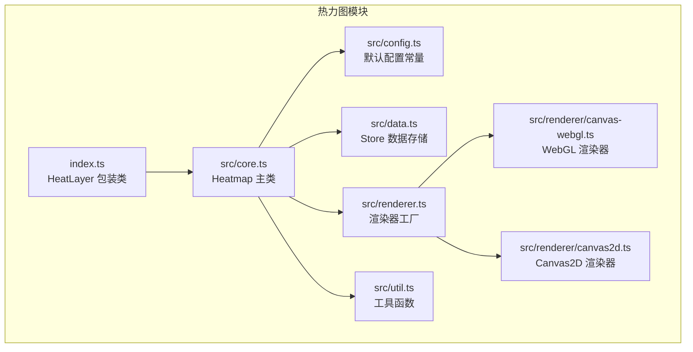
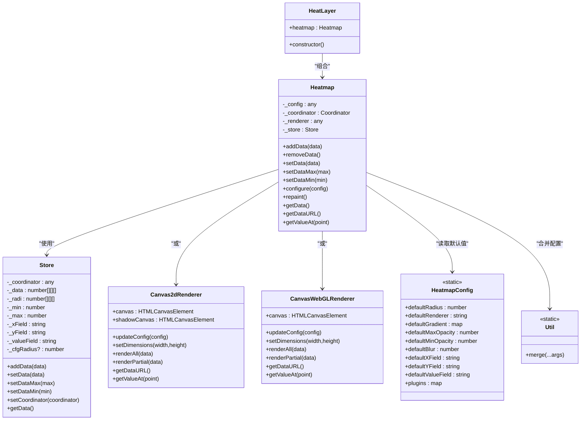
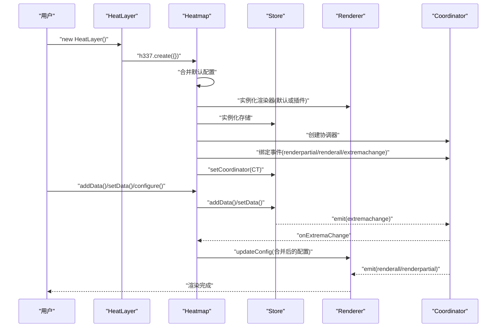
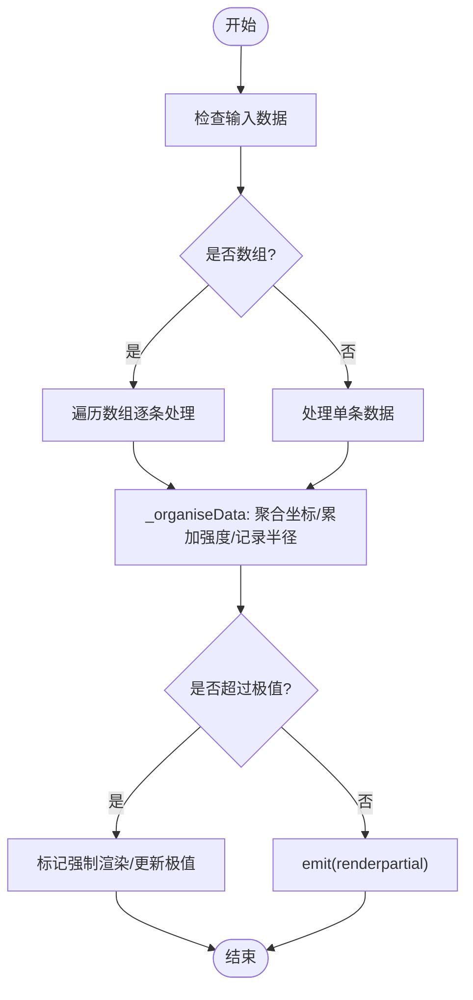
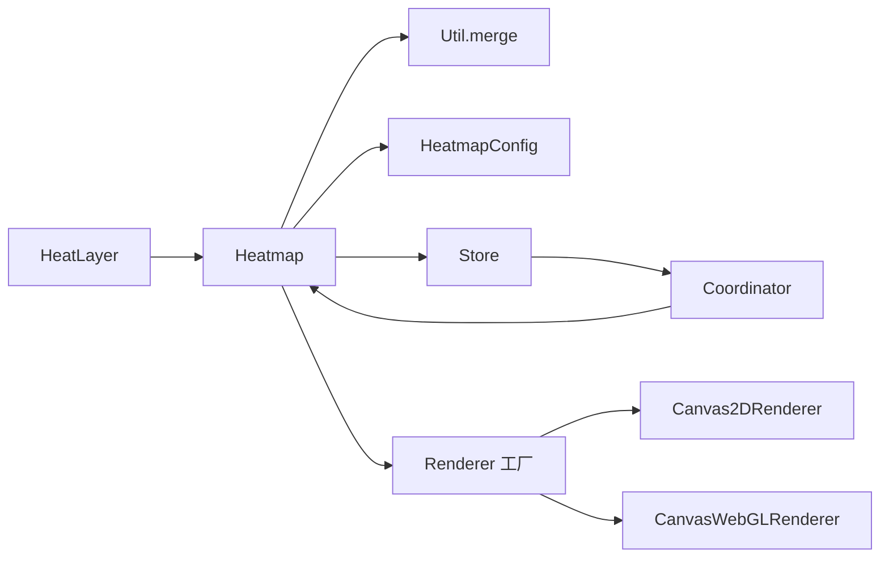

# 热力图 API

<cite>
**本文引用的文件**
- [index.ts](file://packages/cesium-exts/src/modules/HeatLayer/index.ts)
- [core.ts](file://packages/cesium-exts/src/modules/HeatLayer/src/core.ts)
- [config.ts](file://packages/cesium-exts/src/modules/HeatLayer/src/config.ts)
- [data.ts](file://packages/cesium-exts/src/modules/HeatLayer/src/data.ts)
- [renderer.ts](file://packages/cesium-exts/src/modules/HeatLayer/src/renderer.ts)
- [canvas-webgl.ts](file://packages/cesium-exts/src/modules/HeatLayer/src/renderer/canvas-webgl.ts)
- [canvas2d.ts](file://packages/cesium-exts/src/modules/HeatLayer/src/renderer/canvas2d.ts)
- [util.ts](file://packages/cesium-exts/src/modules/HeatLayer/src/util.ts)
- [index.ts（导出）](file://packages/cesium-exts/index.ts)
- [README.md](file://README.md)
</cite>

## 目录

1. [简介](#简介)
2. [项目结构](#项目结构)
3. [核心组件](#核心组件)
4. [架构总览](#架构总览)
5. [详细组件分析](#详细组件分析)
6. [依赖关系分析](#依赖关系分析)
7. [性能考量](#性能考量)
8. [故障排查指南](#故障排查指南)
9. [结论](#结论)
10. [附录](#附录)

## 简介

本文件为热力图（HeatLayer）模块的完整 API 文档，覆盖 HeatLayer 类的公共方法、属性与配置项，说明构造函数参数、初始化流程、渲染与销毁流程、数据格式、颜色映射、透明度与性能参数，并提供 TypeScript 类型定义、参数校验与异常处理机制。同时给出与 Cesium 场景集成的最佳实践与使用示例。

## 项目结构

HeatLayer 模块位于 packages/cesium-exts/src/modules/HeatLayer，核心由以下文件组成：

- 入口与包装：index.ts
- 核心逻辑：src/core.ts
- 配置常量：src/config.ts
- 数据存储：src/data.ts
- 渲染器工厂：src/renderer.ts
- 渲染器实现：src/renderer/canvas-webgl.ts、src/renderer/canvas2d.ts
- 工具：src/util.ts
- 包导出：packages/cesium-exts/index.ts
- 使用示例：README.md

图表来源

- [index.ts:1-13](file://packages/cesium-exts/src/modules/HeatLayer/index.ts#L1-L13)
- [core.ts:1-228](file://packages/cesium-exts/src/modules/HeatLayer/src/core.ts#L1-L228)
- [config.ts:1-31](file://packages/cesium-exts/src/modules/HeatLayer/src/config.ts#L1-L31)
- [data.ts:1-257](file://packages/cesium-exts/src/modules/HeatLayer/src/data.ts#L1-L257)
- [renderer.ts:1-15](file://packages/cesium-exts/src/modules/HeatLayer/src/renderer.ts#L1-L15)
- [canvas-webgl.ts:1-409](file://packages/cesium-exts/src/modules/HeatLayer/src/renderer/canvas-webgl.ts#L1-L409)
- [canvas2d.ts:1-375](file://packages/cesium-exts/src/modules/HeatLayer/src/renderer/canvas2d.ts#L1-L375)
- [util.ts:1-22](file://packages/cesium-exts/src/modules/HeatLayer/src/util.ts#L1-L22)

章节来源

- [index.ts:1-13](file://packages/cesium-exts/src/modules/HeatLayer/index.ts#L1-L13)
- [core.ts:1-228](file://packages/cesium-exts/src/modules/HeatLayer/src/core.ts#L1-L228)
- [config.ts:1-31](file://packages/cesium-exts/src/modules/HeatLayer/src/config.ts#L1-L31)
- [data.ts:1-257](file://packages/cesium-exts/src/modules/HeatLayer/src/data.ts#L1-L257)
- [renderer.ts:1-15](file://packages/cesium-exts/src/modules/HeatLayer/src/renderer.ts#L1-L15)
- [canvas-webgl.ts:1-409](file://packages/cesium-exts/src/modules/HeatLayer/src/renderer/canvas-webgl.ts#L1-L409)
- [canvas2d.ts:1-375](file://packages/cesium-exts/src/modules/HeatLayer/src/renderer/canvas2d.ts#L1-L375)
- [util.ts:1-22](file://packages/cesium-exts/src/modules/HeatLayer/src/util.ts#L1-L22)

## 核心组件

- HeatLayer：对外暴露的包装类，内部持有 Heatmap 实例。
- Heatmap：热力图主类，负责配置合并、组件连接、数据与渲染调度。
- Store：数据存储与极值管理，负责数据聚合、极值计算与事件分发。
- Renderer 工厂：根据配置选择 Canvas2D 或 WebGL 渲染器。
- Canvas2DRenderer/WebGLRenderer：具体渲染实现，分别基于 Canvas 2D 与 WebGL。
- HeatmapConfig：默认配置常量（半径、渐变、模糊、透明度、字段名等）。
- Util：浅合并工具。

章节来源

- [index.ts:1-13](file://packages/cesium-exts/src/modules/HeatLayer/index.ts#L1-L13)
- [core.ts:47-203](file://packages/cesium-exts/src/modules/HeatLayer/src/core.ts#L47-L203)
- [data.ts:30-256](file://packages/cesium-exts/src/modules/HeatLayer/src/data.ts#L30-L256)
- [renderer.ts:8-14](file://packages/cesium-exts/src/modules/HeatLayer/src/renderer.ts#L8-L14)
- [canvas-webgl.ts:7-333](file://packages/cesium-exts/src/modules/HeatLayer/src/renderer/canvas-webgl.ts#L7-L333)
- [canvas2d.ts:27-374](file://packages/cesium-exts/src/modules/HeatLayer/src/renderer/canvas2d.ts#L27-L374)
- [config.ts:4-30](file://packages/cesium-exts/src/modules/HeatLayer/src/config.ts#L4-L30)
- [util.ts:4-21](file://packages/cesium-exts/src/modules/HeatLayer/src/util.ts#L4-L21)

## 架构总览

HeatLayer 通过 Heatmap 组合 Store 与 Renderer，Coordinator 负责事件分发；渲染器根据配置选择 Canvas2D 或 WebGL；Util 提供配置合并；HeatmapConfig 提供默认配置。

图表来源

- [index.ts:3-9](file://packages/cesium-exts/src/modules/HeatLayer/index.ts#L3-L9)
- [core.ts:47-203](file://packages/cesium-exts/src/modules/HeatLayer/src/core.ts#L47-L203)
- [data.ts:30-256](file://packages/cesium-exts/src/modules/HeatLayer/src/data.ts#L30-L256)
- [canvas-webgl.ts:7-333](file://packages/cesium-exts/src/modules/HeatLayer/src/renderer/canvas-webgl.ts#L7-L333)
- [canvas2d.ts:27-374](file://packages/cesium-exts/src/modules/HeatLayer/src/renderer/canvas2d.ts#L27-L374)
- [config.ts:4-30](file://packages/cesium-exts/src/modules/HeatLayer/src/config.ts#L4-L30)
- [util.ts:4-21](file://packages/cesium-exts/src/modules/HeatLayer/src/util.ts#L4-L21)

## 详细组件分析

### HeatLayer 类（对外包装）

- 作用：对外暴露的用户入口，内部持有 Heatmap 实例。
- 构造函数
  - 参数：无显式参数（当前实现中未接收 viewer 或配置）。
  - 行为：创建 Heatmap 实例（使用空配置）。
- 注意：当前实现与 README 示例存在差异，示例中传入了配置对象，但包装类构造函数未接收该参数。建议在实际使用中通过 Heatmap 工厂或直接使用 Heatmap 来传参。

章节来源

- [index.ts:3-9](file://packages/cesium-exts/src/modules/HeatLayer/index.ts#L3-L9)
- [README.md:66-88](file://README.md#L66-L88)

### Heatmap 类（核心）

- 构造函数
  - 参数：config（配置对象）
  - 流程：合并默认配置；按需加载插件或使用默认渲染器与存储；建立事件连接。
- 公共方法
  - addData(data: DataPoint | DataPoint[]): this
    - 说明：添加单个或批量数据点；内部进行极值判断与增量渲染事件触发。
  - removeData(): this
    - 说明：预留接口，当前未实现。
  - setData(data: { min: number; max: number; data: DataPoint[] }): this
    - 说明：设置完整数据集；重置内部存储并触发全量渲染。
  - setDataMax(max: number): this
    - 说明：设置最大值并触发极值变化与全量渲染。
  - setDataMin(min: number): this
    - 说明：设置最小值并触发极值变化与全量渲染。
  - configure(config: any): this
    - 说明：合并配置并更新渲染器；随后触发全量重绘。
  - repaint(): this
    - 说明：触发一次全量重绘。
  - getData(): { min: number; max: number; data: DataPoint[] }
    - 说明：返回扁平化后的数据视图。
  - getDataURL(): string
    - 说明：返回当前画布的 DataURL。
  - getValueAt(point: { x: number; y: number }): number | null
    - 说明：委托 Store 或 Renderer 查询某点数值；若不支持则返回 null。
- 异常处理
  - 插件未注册：当指定 plugin 不存在时抛出错误。

章节来源

- [core.ts:47-203](file://packages/cesium-exts/src/modules/HeatLayer/src/core.ts#L47-L203)

### Store 类（数据存储）

- 字段与职责
  - 内部存储：二维数组结构存储坐标与强度、半径；维护 min/max 极值。
  - 字段映射：xField/yField/valueField 可配置，默认为 "x"/"y"/"value"。
  - 半径：可全局配置或在点上单独指定。
- 公共方法
  - addData(data): this
  - setData(data): this
  - setDataMax(max): this
  - setDataMin(min): this
  - setCoordinator(coordinator): void
  - getData(): { min: number; max: number; data: DataPoint[] }
- 事件
  - extremachange：当极值变化时触发，通知渲染器更新调色板与范围。

章节来源

- [data.ts:30-256](file://packages/cesium-exts/src/modules/HeatLayer/src/data.ts#L30-L256)

### Renderer 工厂与渲染器

- Renderer 工厂
  - 根据 HeatmapConfig.defaultRenderer 返回 Canvas2D 或 WebGL 渲染器。
- Canvas2DRenderer
  - 配置项：container、canvas、width、height、gradient/defaultGradient、blur/defaultBlur、opacity/maxOpacity/minOpacity、useGradientOpacity、backgroundColor。
  - 方法：updateConfig、setDimensions、renderAll、renderPartial、getDataURL、getValueAt。
  - 特性：基于模板圆与 ImageData 上色，支持渐变透明度与边界裁剪。
- CanvasWebGLRenderer
  - 配置项：同上，额外支持 WebGL 上下文参数（preserveDrawingBuffer、antialias）。
  - 方法：updateConfig、setDimensions、renderAll、renderPartial、getDataURL、getValueAt。
  - 特性：双通道渲染（先绘制到 Alpha 纹理，再着色），支持加法混合与调色板纹理。

章节来源

- [renderer.ts:8-14](file://packages/cesium-exts/src/modules/HeatLayer/src/renderer.ts#L8-L14)
- [canvas2d.ts:6-374](file://packages/cesium-exts/src/modules/HeatLayer/src/renderer/canvas2d.ts#L6-L374)
- [canvas-webgl.ts:7-333](file://packages/cesium-exts/src/modules/HeatLayer/src/renderer/canvas-webgl.ts#L7-L333)

### 配置与默认值（HeatmapConfig）

- 默认半径：defaultRadius
- 默认渲染器：defaultRenderer（"webgl" 或 "canvas2d"）
- 默认渐变：defaultGradient（0~1 映射的颜色）
- 默认透明度：defaultMaxOpacity、defaultMinOpacity
- 默认模糊：defaultBlur
- 字段名：defaultXField、defaultYField、defaultValueField
- 插件：plugins（可注册自定义 renderer/store）

章节来源

- [config.ts:4-30](file://packages/cesium-exts/src/modules/HeatLayer/src/config.ts#L4-L30)

### 工具（Util）

- merge(...args): 合并多个对象为新对象（浅拷贝）。

章节来源

- [util.ts:4-21](file://packages/cesium-exts/src/modules/HeatLayer/src/util.ts#L4-L21)

### 数据格式与类型定义

- DataPoint 接口
  - x: number
  - y: number
  - value: number
  - radius?: number
- StoreConfig 接口
  - xField?: string
  - yField?: string
  - valueField?: string
  - radius?: number
  - defaultXField?: string
  - defaultYField?: string
  - defaultValueField?: string
- RendererConfig 接口
  - container: HTMLElement
  - canvas?: HTMLCanvasElement
  - width?: number
  - height?: number
  - gradient?: { [key: number]: string }
  - defaultGradient?: { [key: number]: string }
  - blur?: number
  - defaultBlur?: number
  - opacity?: number
  - maxOpacity?: number
  - defaultMaxOpacity?: number
  - minOpacity?: number
  - defaultMinOpacity?: number
  - useGradientOpacity?: boolean
  - backgroundColor?: string

章节来源

- [data.ts:6-25](file://packages/cesium-exts/src/modules/HeatLayer/src/data.ts#L6-L25)
- [canvas2d.ts:6-22](file://packages/cesium-exts/src/modules/HeatLayer/src/renderer/canvas2d.ts#L6-L22)

### 初始化流程与渲染序列

图表来源

- [core.ts:57-102](file://packages/cesium-exts/src/modules/HeatLayer/src/core.ts#L57-L102)
- [data.ts:139-194](file://packages/cesium-exts/src/modules/HeatLayer/src/data.ts#L139-L194)
- [canvas-webgl.ts:136-153](file://packages/cesium-exts/src/modules/HeatLayer/src/renderer/canvas-webgl.ts#L136-L153)
- [canvas2d.ts:205-210](file://packages/cesium-exts/src/modules/HeatLayer/src/renderer/canvas2d.ts#L205-L210)

### 算法流程（增量渲染与极值更新）

图表来源

- [data.ts:61-108](file://packages/cesium-exts/src/modules/HeatLayer/src/data.ts#L61-L108)
- [data.ts:151-171](file://packages/cesium-exts/src/modules/HeatLayer/src/data.ts#L151-L171)

## 依赖关系分析

- HeatLayer 依赖 Heatmap（通过导出入口）。
- Heatmap 依赖 Util（配置合并）、HeatmapConfig（默认值）、Store（数据）、Renderer 工厂（渲染器）。
- Renderer 工厂根据默认渲染器返回 Canvas2DRenderer 或 CanvasWebGLRenderer。
- Store 通过 Coordinator 与 Heatmap 通信，触发渲染与极值事件。

图表来源

- [index.ts（导出）:1-4](file://packages/cesium-exts/index.ts#L1-L4)
- [core.ts:57-102](file://packages/cesium-exts/src/modules/HeatLayer/src/core.ts#L57-L102)
- [renderer.ts:8-14](file://packages/cesium-exts/src/modules/HeatLayer/src/renderer.ts#L8-L14)
- [util.ts:10-20](file://packages/cesium-exts/src/modules/HeatLayer/src/util.ts#L10-L20)

章节来源

- [index.ts（导出）:1-4](file://packages/cesium-exts/index.ts#L1-L4)
- [core.ts:57-102](file://packages/cesium-exts/src/modules/HeatLayer/src/core.ts#L57-L102)
- [renderer.ts:8-14](file://packages/cesium-exts/src/modules/HeatLayer/src/renderer.ts#L8-L14)
- [util.ts:10-20](file://packages/cesium-exts/src/modules/HeatLayer/src/util.ts#L10-L20)

## 性能考量

- 渲染器选择
  - WebGL：适合大数据量与高刷新场景，使用双缓冲与纹理混合，支持渐进式更新策略。
  - Canvas2D：适合中小规模数据，实现简单，内存占用较低。
- 模糊与透明度
  - blur 控制径向模糊程度；opacity/maxOpacity/minOpacity 控制最终透明度范围。
  - useGradientOpacity 控制是否使用渐变透明度。
- 数据聚合
  - Store 对相同坐标的点进行强度累加，减少重复绘制开销。
- 尺寸与画布
  - setDimensions 与容器尺寸同步，避免频繁重绘。
- 增量渲染
  - renderPartial 仅对新增点进行绘制；WebGL 实现中可通过纹理更新优化（当前简化为重绘，建议结合脏矩形策略）。

[本节为通用性能建议，不直接分析具体文件]

## 故障排查指南

- WebGL 不支持
  - 现象：构造 WebGL 渲染器时报错。
  - 原因：设备不支持 WebGL 或禁用。
  - 处理：降级为 Canvas2D 渲染器（通过配置 defaultRenderer 或插件）。
- 插件未注册
  - 现象：指定 plugin 不存在时抛出错误。
  - 处理：确保通过工厂 register 注册插件后再使用。
- getValueAt 返回 null
  - 现象：查询某点值返回 null。
  - 原因：Store 未实现该方法且渲染器也未实现。
  - 处理：确认渲染器实现或自行实现 getValueAt。
- 数据未显示
  - 现象：addData 后无渲染。
  - 原因：未触发全量渲染或极值未更新。
  - 处理：调用 configure 或 repaint；检查 xField/yField/valueField 映射。

章节来源

- [canvas-webgl.ts:52-54](file://packages/cesium-exts/src/modules/HeatLayer/src/renderer/canvas-webgl.ts#L52-L54)
- [core.ts:61-67](file://packages/cesium-exts/src/modules/HeatLayer/src/core.ts#L61-L67)
- [core.ts:196-202](file://packages/cesium-exts/src/modules/HeatLayer/src/core.ts#L196-L202)

## 结论

HeatLayer 提供了基于 Canvas2D 与 WebGL 的高性能热力图渲染能力，具备清晰的配置体系、事件驱动的数据与渲染分离架构。通过 Store 的数据聚合与 Renderer 的差异化实现，可在不同场景下取得良好性能与视觉效果。建议在大规模数据场景优先使用 WebGL 渲染器，并结合增量渲染与边界裁剪策略进一步优化。

[本节为总结性内容，不直接分析具体文件]

## 附录

### API 一览（HeatLayer）

- 构造函数
  - HeatLayer()
  - 说明：创建 HeatLayer 实例（当前未接收参数）。
- 方法
  - addData(data)
  - removeData()
  - setData(data)
  - setDataMax(max)
  - setDataMin(min)
  - configure(config)
  - repaint()
  - getData()
  - getDataURL()
  - getValueAt(point)

章节来源

- [index.ts:3-9](file://packages/cesium-exts/src/modules/HeatLayer/index.ts#L3-L9)
- [core.ts:109-202](file://packages/cesium-exts/src/modules/HeatLayer/src/core.ts#L109-L202)

### 配置项与默认值

- 渲染器
  - defaultRenderer: "webgl"|"canvas2d"
- 渐变
  - defaultGradient: { [ratio: number]: color }
- 半径
  - defaultRadius: number
- 模糊
  - defaultBlur: number
- 透明度
  - defaultMaxOpacity: number
  - defaultMinOpacity: number
- 字段名
  - defaultXField: string
  - defaultYField: string
  - defaultValueField: string
- 插件
  - plugins: { [key: string]: { renderer, store } }

章节来源

- [config.ts:4-30](file://packages/cesium-exts/src/modules/HeatLayer/src/config.ts#L4-L30)

### 使用示例（基于仓库示例）

- 创建热力图并添加数据
  - 参考路径：[README.md 示例:66-88](file://README.md#L66-L88)
- 与 Cesium 集成
  - 将 HeatLayer 渲染器输出的画布作为叠加层插入 Cesium Viewer 的容器中，保持尺寸一致并同步相机变换。
  - 注意：HeatLayer 当前实现未直接依赖 Cesium，需手动挂载与同步。

章节来源

- [README.md:66-88](file://README.md#L66-L88)
