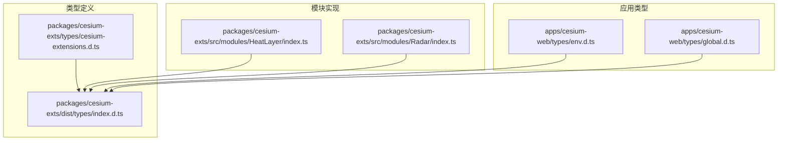
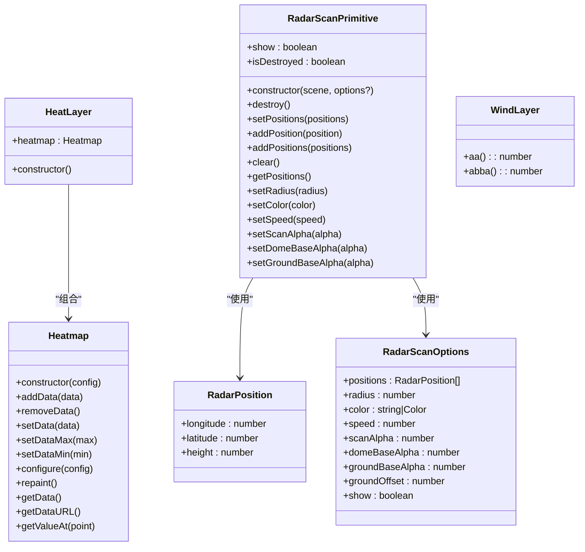
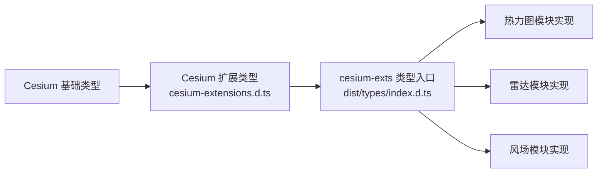

# 类型定义

<cite>
**本文档引用的文件**
- [packages/cesium-exts/types/cesium-extensions.d.ts](file://packages/cesium-exts/types/cesium-extensions.d.ts)
- [packages/cesium-exts/dist/types/index.d.ts](file://packages/cesium-exts/dist/types/index.d.ts)
- [packages/cesium-exts/src/modules/HeatLayer/index.ts](file://packages/cesium-exts/src/modules/HeatLayer/index.ts)
- [packages/cesium-exts/src/modules/Radar/index.ts](file://packages/cesium-exts/src/modules/Radar/index.ts)
- [packages/cesium-exts/package.json](file://packages/cesium-exts/package.json)
- [apps/cesium-web/types/env.d.ts](file://apps/cesium-web/types/env.d.ts)
- [apps/cesium-web/types/global.d.ts](file://apps/cesium-web/types/global.d.ts)
- [README.md](file://README.md)
</cite>

## 目录

1. [简介](#简介)
2. [项目结构](#项目结构)
3. [核心组件](#核心组件)
4. [架构总览](#架构总览)
5. [详细组件分析](#详细组件分析)
6. [依赖分析](#依赖分析)
7. [性能考量](#性能考量)
8. [故障排查指南](#故障排查指南)
9. [结论](#结论)
10. [附录](#附录)

## 简介

本文件是 cesium-exts 扩展库的 TypeScript 类型定义参考文档，覆盖以下方面：

- 导出的接口、类型别名、枚举与泛型定义
- 热力图与风场模块的数据结构、配置接口与回调类型
- 参数对象的属性、可选性与默认值
- 类型继承关系与兼容性说明
- 类型安全与编译时检查机制
- 版本兼容性与迁移指南
- 实际使用示例与最佳实践

## 项目结构

该仓库采用 monorepo 结构，核心类型定义位于 cesium-exts 包的 types 目录与 dist/types 目录中；热力图与雷达模块在 src/modules 下实现并在 dist/types 中导出。

图表来源

- [packages/cesium-exts/types/cesium-extensions.d.ts](file://packages/cesium-exts/types/cesium-extensions.d.ts)
- [packages/cesium-exts/dist/types/index.d.ts](file://packages/cesium-exts/dist/types/index.d.ts)
- [packages/cesium-exts/src/modules/HeatLayer/index.ts](file://packages/cesium-exts/src/modules/HeatLayer/index.ts)
- [packages/cesium-exts/src/modules/Radar/index.ts](file://packages/cesium-exts/src/modules/Radar/index.ts)
- [apps/cesium-web/types/env.d.ts](file://apps/cesium-web/types/env.d.ts)
- [apps/cesium-web/types/global.d.ts](file://apps/cesium-web/types/global.d.ts)

章节来源

- [packages/cesium-exts/package.json](file://packages/cesium-exts/package.json)
- [packages/cesium-exts/types/cesium-extensions.d.ts](file://packages/cesium-exts/types/cesium-extensions.d.ts)
- [packages/cesium-exts/dist/types/index.d.ts](file://packages/cesium-exts/dist/types/index.d.ts)

## 核心组件

本节梳理导出的类型与接口，涵盖热力图、雷达扫描与基础工具函数的类型签名。

- 工具函数
  - cesiumVersion(): string
  - cesiumExtsVersion(): string
  - flyToTarget(viewer, options): void
    - options 包含 targetPosition: Cartesian3、radius?: number、heading?: number、pitch?: number、range?: number、duration?: number

- 热力图相关
  - DataPoint 接口：x: number、y: number、value: number、radius?: number
  - Heatmap 类：构造函数接受任意配置；公开方法包括 addData、removeData、setData、setDataMax、setDataMin、configure、repaint、getData、getDataURL、getValueAt
  - HeatLayer 类：包含 heatmap 属性，构造时内部创建 Heatmap 实例

- 雷达扫描相关
  - RadarPosition 接口：longitude: number、latitude: number、height?: number
  - RadarScanOptions 接口：positions?: RadarPosition[]、radius?: number、color?: string | Cesium.Color、speed?: number、scanAlpha?: number、domeBaseAlpha?: number、groundBaseAlpha?: number、groundOffset?: number、show?: boolean
  - RadarScanPrimitive 类：构造函数接收 scene 与可选 options；公开 getter/setter show；公开 destroy、isDestroyed；公开 setPositions、addPosition、addPositions、clear、getPositions；公开 setRadius、setColor、setSpeed、setScanAlpha、setDomeBaseAlpha、setGroundBaseAlpha

- 风场相关
  - WindLayer 类：aa(): number、abba(): number（当前实现为占位）

章节来源

- [packages/cesium-exts/dist/types/index.d.ts](file://packages/cesium-exts/dist/types/index.d.ts)
- [packages/cesium-exts/src/modules/HeatLayer/index.ts](file://packages/cesium-exts/src/modules/HeatLayer/index.ts)
- [packages/cesium-exts/src/modules/Radar/index.ts](file://packages/cesium-exts/src/modules/Radar/index.ts)

## 架构总览

下图展示了类型定义与模块之间的关系，以及与 Cesium 底层扩展类型的关系。

图表来源

- [packages/cesium-exts/dist/types/index.d.ts](file://packages/cesium-exts/dist/types/index.d.ts)
- [packages/cesium-exts/src/modules/HeatLayer/index.ts](file://packages/cesium-exts/src/modules/HeatLayer/index.ts)
- [packages/cesium-exts/src/modules/Radar/index.ts](file://packages/cesium-exts/src/modules/Radar/index.ts)

## 详细组件分析

### 热力图模块类型定义

- DataPoint 接口
  - 必填字段：x、y、value
  - 可选字段：radius
  - 用途：描述二维平面上的带权重点，用于热力图渲染

- Heatmap 类
  - 构造函数：接受任意配置对象
  - 数据操作：addData、removeData、setData、setDataMax、setDataMin
  - 渲染控制：configure、repaint
  - 查询：getData、getDataURL、getValueAt(point: {x, y})
  - 设计要点：内部持有协调器、渲染器、存储等组件，通过私有连接方法组装

- HeatLayer 类
  - 作用：对 Heatmap 的轻量封装，便于集成到 Cesium 场景中
  - 关键：构造时内部创建 Heatmap 实例

章节来源

- [packages/cesium-exts/dist/types/index.d.ts](file://packages/cesium-exts/dist/types/index.d.ts)
- [packages/cesium-exts/src/modules/HeatLayer/index.ts](file://packages/cesium-exts/src/modules/HeatLayer/index.ts)

### 雷达扫描模块类型定义

- RadarPosition 接口
  - 必填：longitude、latitude
  - 可选：height（默认 0）

- RadarScanOptions 接口
  - positions：初始点位数组，默认 []
  - radius：探测半径（米），默认 1500
  - color：主题颜色，支持 CSS 字符串或 Cesium.Color，默认 '#99ff00'
  - speed：旋转速度乘数，默认 1.0
  - scanAlpha：拖尾最高发光亮度，默认 0.8（推荐范围 0.0~2.0）
  - domeBaseAlpha：顶部半球罩基础透明度，默认 0.2（推荐范围 0.0~1.0）
  - groundBaseAlpha：底部地面底盘基础透明度，默认 0.15（推荐范围 0.0~1.0）
  - groundOffset：底盘离地高度偏移（米），默认 5.0，用于避免 Z-Fighting
  - show：实例化后是否立即显示，默认 true

- RadarScanPrimitive 类
  - 构造：接收 Cesium.Scene 与 RadarScanOptions
  - 生命周期：show getter/setter；destroy()；isDestroyed getter
  - 数据点操作：setPositions、addPosition、addPositions、clear、getPositions
  - 视觉参数：setRadius、setColor、setSpeed、setScanAlpha、setDomeBaseAlpha、setGroundBaseAlpha
  - 设计要点：内部使用 MaterialAppearance 与自定义 GLSL 着色器，通过 preUpdate 事件驱动时间变量以实现 GPU 级动画

章节来源

- [packages/cesium-exts/dist/types/index.d.ts](file://packages/cesium-exts/dist/types/index.d.ts)
- [packages/cesium-exts/src/modules/Radar/index.ts](file://packages/cesium-exts/src/modules/Radar/index.ts)

### Cesium 底层渲染 API 扩展类型

该模块为 Cesium 原型扩展，新增以下类型与接口（节选）：

- 枚举
  - BufferUsage：STATIC_DRAW、DYNAMIC_DRAW
  - PixelFormat：RGBA
  - PixelDatatype：UNSIGNED_BYTE、FLOAT
  - TextureWrap：CLAMP_TO_EDGE、REPEAT、MIRRORED_REPEAT
  - TextureMinificationFilter：NEAREST、LINEAR
  - TextureMagnificationFilter：NEAREST、LINEAR
  - PrimitiveType：POINTS、LINES、TRIANGLES
  - Pass：OPAQUE、TRANSLUCENT、COMPUTE
  - ComponentDatatype：FLOAT
- 类
  - ShaderSource：sources: string[]、defines?: string[]
  - ShaderProgram：fromCache(options)、destroy()
  - VertexArray：fromGeometry(options)、destroy()
  - Sampler：minificationFilter?、magnificationFilter?、wrapS?、wrapT?
  - Texture：构造参数含 context、width、height、pixelFormat、pixelDatatype、source?、sampler?；copyFrom(source)、destroy()
  - Framebuffer：colorTextures: Texture[]、depthTexture: Texture；getColorTexture(index)、depthTexture
  - RenderState：fromCache(options)
  - DrawCommand：构造参数含 boundingVolume?、orientedBoundingBox?、modelMatrix?、primitiveType?、vertexArray?、count?、offset?、instanceCount?、shaderProgram?、uniformMap?、renderState?、framebuffer?、pass?、owner?、cull?、occlude?、executeInClosestFrustum?、debugShowBoundingVolume?、castShadows?、receiveShadows?、pickId?、pickMetadataAllowed?、pickOnly?、depthForTranslucentClassification?
  - ComputeCommand：fragmentShaderSource、uniformMap、outputTexture、persists
  - ClearCommand：color、depth、framebuffer?、pass
  - Event：addEventListener、removeEventListener、raiseEvent
  - Scene 接口：context、frameState、postRender、requestRender()、pickFromRay()、drillPickFromRay()

章节来源

- [packages/cesium-exts/types/cesium-extensions.d.ts](file://packages/cesium-exts/types/cesium-extensions.d.ts)

### 风场模块类型定义

- WindLayer 类：aa()、abba()（当前为占位实现）

章节来源

- [packages/cesium-exts/dist/types/index.d.ts](file://packages/cesium-exts/dist/types/index.d.ts)

## 依赖分析

- 与 Cesium 的依赖
  - 热力图与雷达模块在类型层面依赖 Cesium 的基础类型（如 Cartesian3、Color、Scene 等）
  - Cesium 底层扩展类型通过模块声明的方式增强 Cesium 原型能力
- 构建与打包
  - cesium-exts 包导出 dist/types/index.d.ts 作为公共类型入口
  - 类型定义与实现分离，便于在不同运行时环境（浏览器、Node）中消费

图表来源

- [packages/cesium-exts/types/cesium-extensions.d.ts](file://packages/cesium-exts/types/cesium-extensions.d.ts)
- [packages/cesium-exts/dist/types/index.d.ts](file://packages/cesium-exts/dist/types/index.d.ts)
- [packages/cesium-exts/src/modules/HeatLayer/index.ts](file://packages/cesium-exts/src/modules/HeatLayer/index.ts)
- [packages/cesium-exts/src/modules/Radar/index.ts](file://packages/cesium-exts/src/modules/Radar/index.ts)

## 性能考量

- 雷达扫描
  - 使用 MaterialAppearance 与自定义 GLSL 着色器，通过 uniform 与时间变量驱动动画，纯 GPU 级运算，性能开销低
  - setRadius 等涉及几何体重建的操作建议在业务层做防抖
- 热力图
  - 通过 h337 核心库进行渲染，类型层提供数据点与配置接口，具体性能取决于数据规模与渲染策略
- 通用渲染
  - DrawCommand、RenderState、ShaderProgram 等类型均强调 GPU 资源的复用与缓存，减少重复编译与分配

[本节为通用指导，无需列出章节来源]

## 故障排查指南

- 雷达扫描
  - 若出现闪烁或深度冲突，适当调整 groundOffset 以避免与地形发生 Z-Fighting
  - 若动画卡顿，检查 speed 与 scanAlpha 设置，必要时降低刷新频率
- 热力图
  - 数据点过多导致性能问题时，优先考虑降采样或分块渲染
- 通用
  - 组件销毁时务必调用 destroy() 以释放 GPU 资源，避免内存泄漏

[本节为通用指导，无需列出章节来源]

## 结论

本类型定义文档系统性梳理了 cesium-exts 的接口与数据结构，明确了参数的可选性与默认值，给出了类型关系图与兼容性说明，并提供了实际使用示例与最佳实践建议。通过严格的类型约束与编译时检查，可有效提升代码质量与可维护性。

[本节为总结性内容，无需列出章节来源]

## 附录

### 类型安全与编译时检查机制

- 使用 TypeScript 的严格模式与类型断言，确保传入参数满足接口约束
- 对于 Cesium 扩展类型，通过模块声明增强原型能力，避免运行时错误
- 对于可选参数，提供明确的默认值与边界检查，防止逻辑分支遗漏

[本节为通用指导，无需列出章节来源]

### 版本兼容性与迁移指南

- Cesium 版本
  - 本项目基于 Cesium v1.140.1 开发，类型定义与底层 API 保持一致
  - 升级 Cesium 时需同步验证 dist/types/index.d.ts 与 types/cesium-extensions.d.ts 的兼容性
- cesium-exts 版本
  - 当前包版本为 1.0.0，遵循语义化版本管理
  - 重大变更（如接口删除、参数重命名）将在升级日志中记录，建议在升级前比对 dist/types/index.d.ts 的差异

章节来源

- [packages/cesium-exts/package.json](file://packages/cesium-exts/package.json)

### 实际使用示例

- 热力图
  - 参考示例路径：[README.md](file://README.md)
  - 示例要点：导入 HeatLayer 与 cesiumUtils，创建热力图图层并添加数据点
- 雷达扫描
  - 参考实现路径：[packages/cesium-exts/src/modules/Radar/index.ts](file://packages/cesium-exts/src/modules/Radar/index.ts)
  - 示例要点：创建 RadarScanPrimitive 实例，设置 positions、radius、color、speed 等参数，控制显示与销毁

章节来源

- [README.md](file://README.md)
- [packages/cesium-exts/src/modules/Radar/index.ts](file://packages/cesium-exts/src/modules/Radar/index.ts)

### 应用侧全局类型

- env.d.ts
  - 定义由 Vite define 注入的全局常量：**INNER_ORIGIN**、**OUTER_ORIGIN**、**CESIUM_BASE_URL**
- global.d.ts
  - 声明全局 Window 接口包含 Cesium 字段

章节来源

- [apps/cesium-web/types/env.d.ts](file://apps/cesium-web/types/env.d.ts)
- [apps/cesium-web/types/global.d.ts](file://apps/cesium-web/types/global.d.ts)
