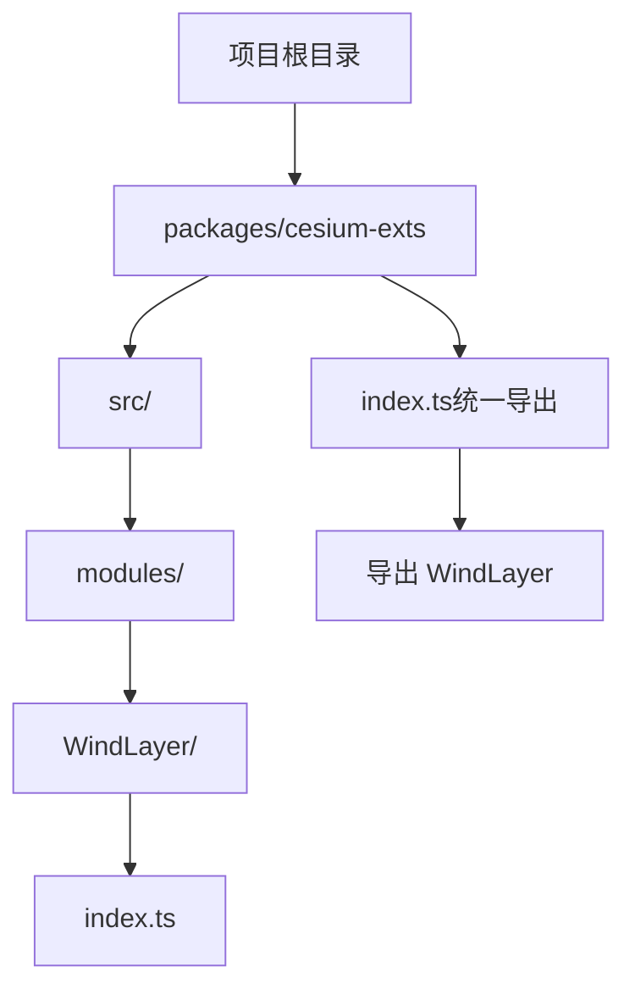
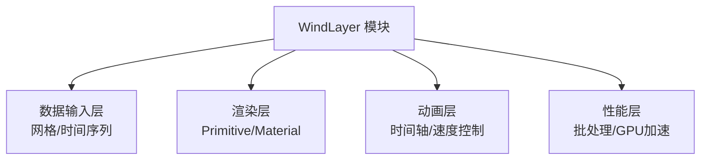
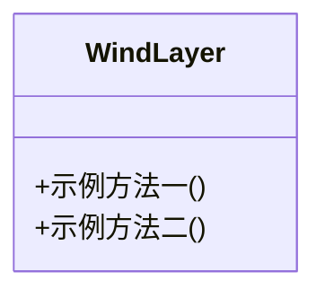
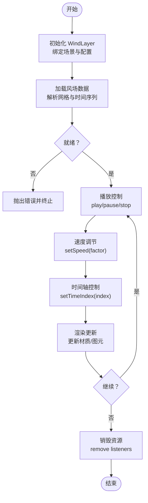
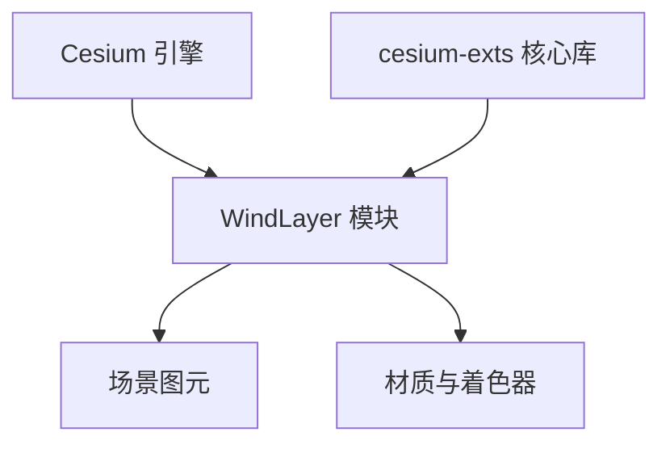

# 风场 API

<cite>
**本文引用的文件**
- [index.ts](file://packages/cesium-exts/src/modules/WindLayer/index.ts)
- [index.ts](file://packages/cesium-exts/index.ts)
- [README.md](file://README.md)
- [package.json](file://packages/cesium-exts/package.json)
</cite>

## 目录

1. [简介](#简介)
2. [项目结构](#项目结构)
3. [核心组件](#核心组件)
4. [架构总览](#架构总览)
5. [详细组件分析](#详细组件分析)
6. [依赖分析](#依赖分析)
7. [性能考虑](#性能考虑)
8. [故障排除指南](#故障排除指南)
9. [结论](#结论)
10. [附录](#附录)

## 简介

本文件为风场（WindLayer）模块的完整 API 文档。根据当前仓库信息，WindLayer 是 Cesium 扩展库中的一个可视化组件，用于在三维地球场景中呈现风场数据。该模块位于核心库 cesium-exts 中，作为导出模块之一对外提供能力。

当前仓库中 WindLayer 的实现非常基础，仅包含两个示例方法。因此，本文将基于现有代码进行结构化说明，并对可能的 API 设计、数据格式、动画控制与渲染配置给出概念性指导，帮助读者理解如何扩展与使用该模块。

## 项目结构

WindLayer 模块位于核心库的 modules 目录下，通过根级入口统一导出。核心库使用 monorepo 架构，结合 Turborepo 与 pnpm workspace 进行管理；构建工具链采用 Rollup 与 Gulp。

图表来源

- [index.ts:1-10](file://packages/cesium-exts/src/modules/WindLayer/index.ts#L1-L10)
- [index.ts:1-4](file://packages/cesium-exts/index.ts#L1-L4)

章节来源

- [index.ts:1-10](file://packages/cesium-exts/src/modules/WindLayer/index.ts#L1-L10)
- [index.ts:1-4](file://packages/cesium-exts/index.ts#L1-L4)
- [README.md:1-88](file://README.md#L1-L88)
- [package.json:1-48](file://packages/cesium-exts/package.json#L1-L48)

## 核心组件

- WindLayer 类：当前版本仅包含两个示例方法，用于演示类的基本结构与导出方式。后续应在此基础上扩展构造函数、数据加载、动画控制与渲染配置等完整接口。

章节来源

- [index.ts:1-10](file://packages/cesium-exts/src/modules/WindLayer/index.ts#L1-L10)

## 架构总览

WindLayer 作为 Cesium 扩展库的一个模块，其职责是将风场数据映射到三维场景中并提供交互式动画效果。当前实现尚未包含具体的数据结构与渲染逻辑，但整体架构应遵循以下思路：

- 数据输入：接收风场网格数据（如经纬度、风速、风向等）
- 渲染管线：基于 Cesium 的 Primitive/Material 系统进行绘制
- 动画控制：通过时间轴与速度参数驱动粒子或流线动画
- 性能优化：按需渲染、批量更新、GPU 加速

（本图为概念性架构示意，不直接对应具体源码）

## 详细组件分析

### WindLayer 类设计（当前实现概览）

- 类型：WindLayer
- 导出：通过根级入口统一导出
- 当前方法：
  - 示例方法一：用于演示类成员结构
  - 示例方法二：用于演示类成员结构

图表来源

- [index.ts:1-10](file://packages/cesium-exts/src/modules/WindLayer/index.ts#L1-L10)

章节来源

- [index.ts:1-10](file://packages/cesium-exts/src/modules/WindLayer/index.ts#L1-L10)
- [index.ts:1-4](file://packages/cesium-exts/index.ts#L1-L4)

### API 接口设计建议（基于概念性实现）

以下为 WindLayer 在完整实现后应具备的典型接口与行为，便于扩展与集成：

- 构造函数
  - 参数：viewer（Cesium 场景）、options（渲染与动画配置）
  - 返回：WindLayer 实例
  - 错误处理：校验 viewer 有效性、初始化失败抛出异常

- 数据加载
  - 方法：loadData(data, timeIndex?)
  - 参数：data（风场网格数据）、timeIndex（时间索引，可选）
  - 行为：解析网格数据、建立内部缓存、触发渲染更新
  - 返回：Promise<void> 或布尔值
  - 错误处理：数据格式不合法、时间索引越界

- 动画控制
  - 方法：play()/pause()/stop()
  - 行为：启动/暂停/停止动画循环
  - 返回：void
  - 错误处理：状态冲突时抛出异常

- 时间轴控制
  - 方法：setTimeIndex(index)/setSpeed(factor)
  - 行为：设置当前时间索引、调整动画速度
  - 返回：void
  - 错误处理：索引越界、速度因子非法

- 渲染配置
  - 方法：setRenderOptions(options)
  - 参数：options（颜色梯度、粒子大小、透明度、采样密度等）
  - 返回：void
  - 错误处理：配置项缺失或类型不匹配

- 风向风速计算
  - 方法：computeWindVector(lat, lon)
  - 行为：根据网格插值得到风向与风速
  - 返回：向量对象（包含方向与强度）
  - 错误处理：坐标超出范围

- 生命周期
  - 方法：destroy()
  - 行为：释放资源、移除监听、清理场景图元
  - 返回：void

（以上为概念性接口设计，非当前实现内容）

### 数据格式与时间维度集成

- 风场数据格式（建议）
  - 结构：二维网格（经度、纬度、高度），每格包含风速与风向
  - 时间维：多时间步长的网格数组，支持离散时间序列
  - 存储：JSON/二进制（如需要高性能可考虑 TypedArray）

- 时间维度服务集成（建议）
  - 与时间轴联动：通过外部时间控制器同步 windLayer 的时间索引
  - 动态切换：支持快进/倒放/循环播放
  - 事件回调：时间变化时触发渲染更新

（本节为概念性说明，不直接对应具体源码）

### 动画播放控制流程

（本图为概念性流程示意，不直接对应具体源码）

## 依赖分析

- 对外依赖
  - Cesium：作为渲染与场景管理的基础库
  - 核心库：cesium-exts 提供统一导出与模块组织
- 内部依赖
  - WindLayer 依赖 Cesium 的 Primitive/Material 系统进行渲染
  - 与时间维度服务通过事件或回调进行解耦集成

图表来源

- [package.json:27-29](file://packages/cesium-exts/package.json#L27-L29)
- [index.ts:1-4](file://packages/cesium-exts/index.ts#L1-L4)

章节来源

- [package.json:1-48](file://packages/cesium-exts/package.json#L1-L48)
- [index.ts:1-4](file://packages/cesium-exts/index.ts#L1-L4)

## 性能考虑

- 渲染优化
  - 使用批量更新减少图元重建频率
  - 材质参数尽量在 CPU 端计算，避免每帧重复昂贵操作
- 动画优化
  - 在暂停或隐藏状态下停止时间累加，降低 GPU 负载
  - 合理设置采样密度与粒子数量，平衡视觉质量与性能
- 数据优化
  - 预处理网格数据，使用连续内存布局提升访问效率
  - 对大时间序列采用分页加载与缓存策略

（本节为通用性能建议，不直接对应具体源码）

## 故障排除指南

- 初始化失败
  - 现象：构造函数抛出异常
  - 排查：确认 viewer 是否有效、Cesium 版本是否满足要求
- 数据加载异常
  - 现象：loadData 返回失败或渲染无响应
  - 排查：检查数据格式、时间索引范围、内存占用
- 动画卡顿
  - 现象：播放时帧率下降
  - 排查：检查是否在暂停状态下仍进行时间累加、是否过度更新材质
- 资源泄漏
  - 现象：多次创建/销毁后内存增长
  - 排查：确保调用 destroy 并移除所有监听与图元

（本节为通用排障建议，不直接对应具体源码）

## 结论

WindLayer 模块目前处于基础阶段，仅提供类结构与示例方法。建议按照本文提供的接口设计与概念性实现思路，逐步完善数据加载、动画控制、渲染配置与时间维度集成等功能。同时，结合 Cesium 的渲染体系与性能优化策略，确保在大规模风场数据下的流畅表现。

## 附录

### API 使用示例（路径指引）

- 基础导入与实例化
  - 参考路径：[index.ts:1-4](file://packages/cesium-exts/index.ts#L1-L4)
- WindLayer 类结构
  - 参考路径：[index.ts:1-10](file://packages/cesium-exts/src/modules/WindLayer/index.ts#L1-L10)
- 项目特性与模块列表
  - 参考路径：[README.md:1-88](file://README.md#L1-L88)

章节来源

- [index.ts:1-4](file://packages/cesium-exts/index.ts#L1-L4)
- [index.ts:1-10](file://packages/cesium-exts/src/modules/WindLayer/index.ts#L1-L10)
- [README.md:1-88](file://README.md#L1-L88)
