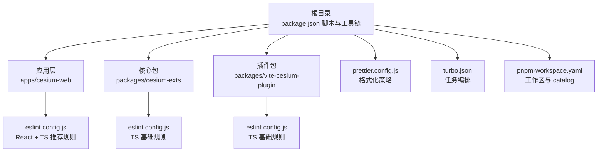
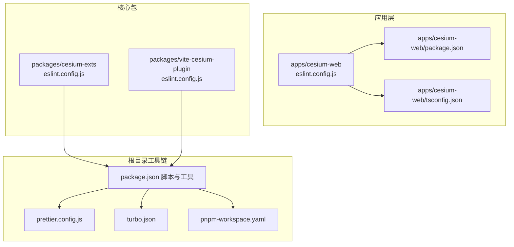
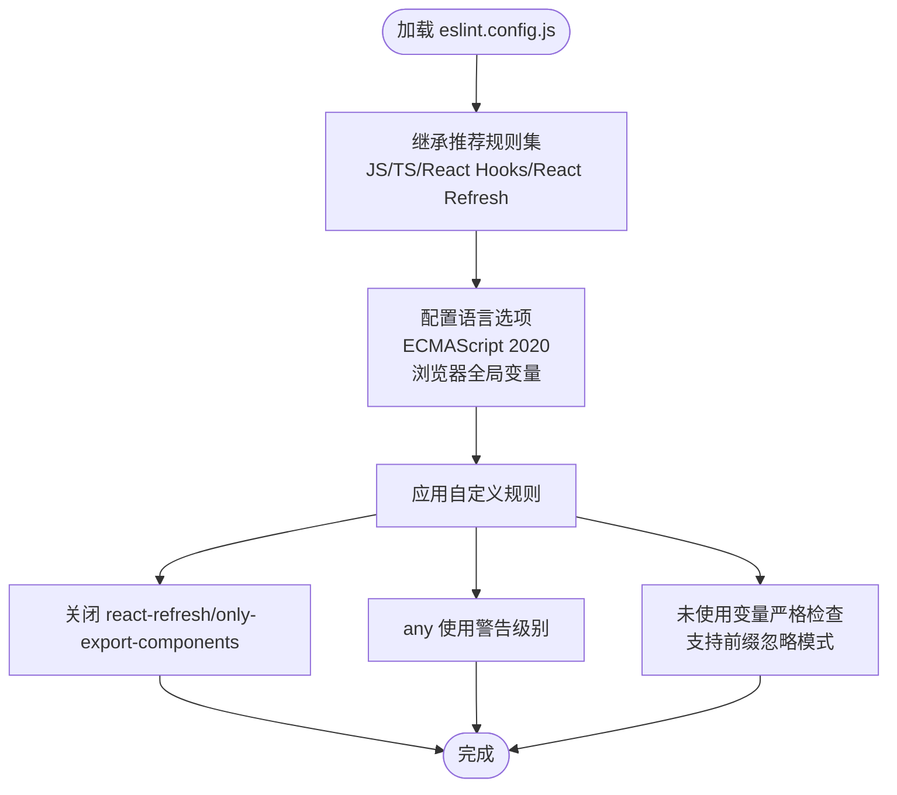
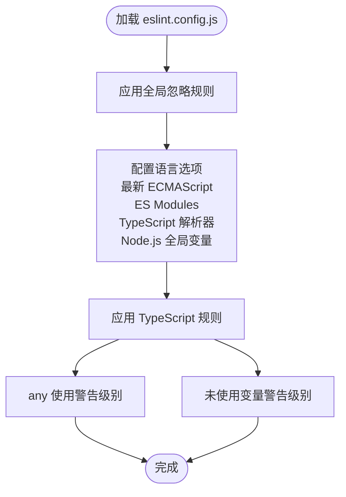
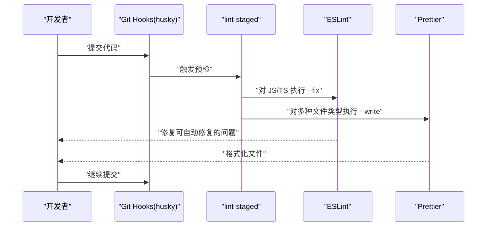
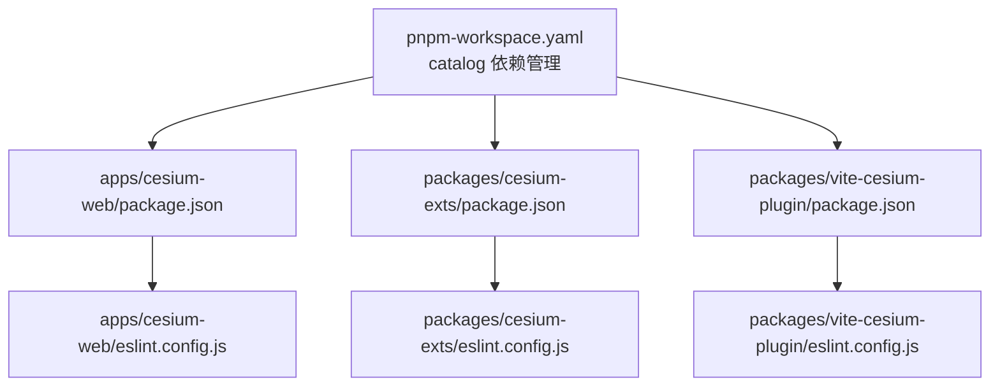

# ESLint 代码规范

<cite>
**本文档引用的文件**
- [apps/cesium-web/eslint.config.js](file://apps/cesium-web/eslint.config.js)
- [apps/cesium-web/package.json](file://apps/cesium-web/package.json)
- [apps/cesium-web/README.md](file://apps/cesium-web/README.md)
- [apps/cesium-web/tsconfig.json](file://apps/cesium-web/tsconfig.json)
- [apps/cesium-web/tsconfig.app.json](file://apps/cesium-web/tsconfig.app.json)
- [apps/cesium-web/tsconfig.node.json](file://apps/cesium-web/tsconfig.node.json)
- [packages/cesium-exts/eslint.config.js](file://packages/cesium-exts/eslint.config.js)
- [packages/vite-cesium-plugin/eslint.config.js](file://packages/vite-cesium-plugin/eslint.config.js)
- [package.json](file://package.json)
- [prettier.config.js](file://prettier.config.js)
- [turbo.json](file://turbo.json)
- [pnpm-workspace.yaml](file://pnpm-workspace.yaml)
</cite>

## 目录

1. [简介](#简介)
2. [项目结构](#项目结构)
3. [核心组件](#核心组件)
4. [架构总览](#架构总览)
5. [详细组件分析](#详细组件分析)
6. [依赖关系分析](#依赖关系分析)
7. [性能考虑](#性能考虑)
8. [故障排除指南](#故障排除指南)
9. [结论](#结论)
10. [附录](#附录)

## 简介

本指南围绕仓库中的 ESLint 配置进行系统化解读，重点覆盖以下方面：

- eslint.config.js 中的规则配置：JavaScript/TypeScript 规则、React 规则与自定义规则
- 代码质量检查规则、格式化规则与最佳实践
- 如何配置规则优先级、禁用特定规则与添加自定义规则
- 团队协作中的统一代码规范制定方法
- 常见代码问题的自动修复与手动处理方案

本项目采用 monorepo 架构，包含多个包，每个包均维护独立的 ESLint 配置，同时根目录通过脚本与工具链统一执行 lint 与格式化。

## 项目结构

- 顶层通过根 package.json 提供统一的 lint 与格式化脚本，并集成 husky、lint-staged 等工具链
- 应用层（apps/cesium-web）提供前端 React + TypeScript 的 ESLint 配置，包含对 React Hooks、React Refresh 的推荐规则
- 核心库与插件包（packages/cesium-exts、packages/vite-cesium-plugin）提供基础 TypeScript 规则配置
- 根目录还包含 Prettier 配置，与 lint-staged 配合实现提交前自动格式化与修复

图表来源

- [package.json:1-35](file://package.json#L1-L35)
- [apps/cesium-web/eslint.config.js:1-37](file://apps/cesium-web/eslint.config.js#L1-L37)
- [packages/cesium-exts/eslint.config.js:1-38](file://packages/cesium-exts/eslint.config.js#L1-L38)
- [packages/vite-cesium-plugin/eslint.config.js:1-38](file://packages/vite-cesium-plugin/eslint.config.js#L1-L38)
- [prettier.config.js:1-44](file://prettier.config.js#L1-L44)
- [turbo.json:1-16](file://turbo.json#L1-L16)
- [pnpm-workspace.yaml:1-12](file://pnpm-workspace.yaml#L1-L12)

章节来源

- [package.json:1-35](file://package.json#L1-L35)
- [apps/cesium-web/eslint.config.js:1-37](file://apps/cesium-web/eslint.config.js#L1-L37)
- [packages/cesium-exts/eslint.config.js:1-38](file://packages/cesium-exts/eslint.config.js#L1-L38)
- [packages/vite-cesium-plugin/eslint.config.js:1-38](file://packages/vite-cesium-plugin/eslint.config.js#L1-L38)
- [prettier.config.js:1-44](file://prettier.config.js#L1-L44)
- [turbo.json:1-16](file://turbo.json#L1-L16)
- [pnpm-workspace.yaml:1-12](file://pnpm-workspace.yaml#L1-L12)

## 核心组件

- 应用层 ESLint 配置（apps/cesium-web）
  - 继承 JS 推荐规则、TypeScript 推荐规则、React Hooks 推荐规则、React Refresh Vite 规则
  - 语言选项设置为 2020 年 ECMAScript 版本，启用浏览器全局变量
  - 自定义规则：关闭 react-refresh/only-export-components；对 any 使用警告级别；对未使用变量进行严格检查并支持忽略以特定前缀命名的参数/变量
- 核心包与插件包 ESLint 配置（packages/cesium-exts、packages/vite-cesium-plugin）
  - 统一忽略构建输出、依赖、点文件、脚本目录、类型声明文件等
  - 语言选项使用最新 ECMAScript 版本、ES Modules、TypeScript 解析器、Node.js 全局变量
  - 自定义规则：对 any 与未使用变量使用警告级别
- 根目录工具链
  - 顶层 package.json 提供 lint 与 format 脚本，集成 husky、lint-staged
  - lint-staged 对 JS/TS 文件执行 eslint --fix，对多种文件类型执行 prettier --write
  - turbo.json 作为任务编排工具，配合 lint 任务

章节来源

- [apps/cesium-web/eslint.config.js:8-36](file://apps/cesium-web/eslint.config.js#L8-L36)
- [packages/cesium-exts/eslint.config.js:16-36](file://packages/cesium-exts/eslint.config.js#L16-L36)
- [packages/vite-cesium-plugin/eslint.config.js:16-36](file://packages/vite-cesium-plugin/eslint.config.js#L16-L36)
- [package.json:5-27](file://package.json#L5-L27)
- [turbo.json:1-16](file://turbo.json#L1-L16)

## 架构总览

ESLint 在本项目中的作用域与集成方式如下：

- 应用层：针对前端 React + TS 项目，启用 React Hooks 与 React Refresh 的推荐规则，提升组件开发体验与稳定性
- 核心包与插件包：面向库与工具类代码，强调类型安全与变量使用规范
- 工具链：通过根目录脚本与 lint-staged，在提交前自动修复与格式化，保证代码一致性

图表来源

- [apps/cesium-web/eslint.config.js:1-37](file://apps/cesium-web/eslint.config.js#L1-L37)
- [apps/cesium-web/package.json:1-51](file://apps/cesium-web/package.json#L1-L51)
- [apps/cesium-web/tsconfig.json:1-12](file://apps/cesium-web/tsconfig.json#L1-L12)
- [packages/cesium-exts/eslint.config.js:1-38](file://packages/cesium-exts/eslint.config.js#L1-L38)
- [packages/vite-cesium-plugin/eslint.config.js:1-38](file://packages/vite-cesium-plugin/eslint.config.js#L1-L38)
- [package.json:1-35](file://package.json#L1-L35)
- [prettier.config.js:1-44](file://prettier.config.js#L1-L44)
- [turbo.json:1-16](file://turbo.json#L1-L16)
- [pnpm-workspace.yaml:1-12](file://pnpm-workspace.yaml#L1-L12)

## 详细组件分析

### 应用层 ESLint 配置（React + TypeScript）

- 规则继承与扩展
  - 继承 JS 推荐规则、TypeScript 推荐规则、React Hooks 推荐规则、React Refresh Vite 规则
  - 语言选项设置为 2020 年 ECMAScript 版本，启用浏览器全局变量
- 自定义规则
  - 关闭 react-refresh/only-export-components，允许导出常量，便于组件导出场景
  - 对 any 使用警告级别，鼓励更严格的类型约束
  - 对未使用变量进行严格检查，支持忽略以特定前缀命名的参数/变量，减少样板代码噪音
- 适用场景
  - 前端 React + TS 应用，结合 Vite 开发环境，提升开发效率与代码质量

图表来源

- [apps/cesium-web/eslint.config.js:8-36](file://apps/cesium-web/eslint.config.js#L8-L36)

章节来源

- [apps/cesium-web/eslint.config.js:8-36](file://apps/cesium-web/eslint.config.js#L8-L36)
- [apps/cesium-web/README.md:14-74](file://apps/cesium-web/README.md#L14-L74)

### 核心包与插件包 ESLint 配置（TypeScript）

- 忽略策略
  - 统一忽略构建输出、依赖、点文件、脚本目录、类型声明文件等，避免对生成物与无关文件进行检查
- 规则继承与扩展
  - 语言选项使用最新 ECMAScript 版本、ES Modules、TypeScript 解析器、Node.js 全局变量
  - 仅启用 TypeScript 相关规则，保持简洁与一致
- 自定义规则
  - 对 any 与未使用变量使用警告级别，平衡严格性与开发效率

图表来源

- [packages/cesium-exts/eslint.config.js:16-36](file://packages/cesium-exts/eslint.config.js#L16-L36)
- [packages/vite-cesium-plugin/eslint.config.js:16-36](file://packages/vite-cesium-plugin/eslint.config.js#L16-L36)

章节来源

- [packages/cesium-exts/eslint.config.js:16-36](file://packages/cesium-exts/eslint.config.js#L16-L36)
- [packages/vite-cesium-plugin/eslint.config.js:16-36](file://packages/vite-cesium-plugin/eslint.config.js#L16-L36)

### 工具链与工作流（根目录）

- 脚本与任务
  - 根 package.json 提供 lint 与 format 脚本，集成 husky、lint-staged
  - turbo.json 作为任务编排工具，配合 lint 任务
- 提交前钩子
  - lint-staged 对 JS/TS 文件执行 eslint --fix，对多种文件类型执行 prettier --write
  - 通过 catalog 管理依赖版本，确保团队一致性

图表来源

- [package.json:5-27](file://package.json#L5-L27)
- [turbo.json:1-16](file://turbo.json#L1-L16)
- [pnpm-workspace.yaml:1-12](file://pnpm-workspace.yaml#L1-L12)

章节来源

- [package.json:5-27](file://package.json#L5-L27)
- [turbo.json:1-16](file://turbo.json#L1-L16)
- [pnpm-workspace.yaml:1-12](file://pnpm-workspace.yaml#L1-L12)

## 依赖关系分析

- 依赖管理
  - pnpm-workspace.yaml 使用 catalog 管理依赖版本，确保各包间版本一致性
  - 各包的 package.json 引入 ESLint 相关依赖，如 @eslint/js、typescript-eslint、globals 等
- 规则优先级与合并
  - eslint.config.js 通过 extends 机制合并多个推荐配置，最终规则以最后声明为准
  - 通过 rules 字段可覆盖继承规则的严重级别或选项

图表来源

- [pnpm-workspace.yaml:1-12](file://pnpm-workspace.yaml#L1-L12)
- [apps/cesium-web/package.json:1-51](file://apps/cesium-web/package.json#L1-L51)
- [packages/cesium-exts/eslint.config.js:1-38](file://packages/cesium-exts/eslint.config.js#L1-L38)
- [packages/vite-cesium-plugin/eslint.config.js:1-38](file://packages/vite-cesium-plugin/eslint.config.js#L1-L38)

章节来源

- [pnpm-workspace.yaml:1-12](file://pnpm-workspace.yaml#L1-L12)
- [apps/cesium-web/package.json:1-51](file://apps/cesium-web/package.json#L1-L51)
- [packages/cesium-exts/eslint.config.js:1-38](file://packages/cesium-exts/eslint.config.js#L1-L38)
- [packages/vite-cesium-plugin/eslint.config.js:1-38](file://packages/vite-cesium-plugin/eslint.config.js#L1-L38)

## 性能考虑

- 规则复杂度与运行时间
  - TypeScript 类型检查规则（如 recommendedTypeChecked、strictTypeChecked）会显著增加分析成本
  - 在大型项目中建议按需启用类型感知规则，并合理配置 tsconfig 引用以减少不必要的类型扫描
- 忽略策略
  - 通过 globalIgnores 与文件匹配模式避免对构建输出、依赖、类型声明等进行检查，降低运行时间
- 工具链优化
  - 利用 lint-staged 仅对暂存文件执行检查，缩短反馈周期
  - 通过 turbo.json 并行化任务，提升整体构建与检查效率

## 故障排除指南

- 常见问题与解决方案
  - 规则冲突：当继承多个推荐配置时，可通过 rules 字段覆盖具体规则的严重级别或选项
  - 类型检查失败：在应用层配置中，可参考 README 中的类型感知规则示例，结合 tsconfig 引用来启用更严格的规则
  - React Refresh 报错：若遇到导出常量相关问题，可参考应用层配置中对 react-refresh/only-export-components 的关闭策略
- 自动修复与手动处理
  - 自动修复：通过 lint-staged 对 JS/TS 文件执行 eslint --fix，可自动修复大部分语法与风格问题
  - 手动处理：对于类型相关或复杂重构问题，需手动调整代码或规则配置

章节来源

- [apps/cesium-web/eslint.config.js:22-34](file://apps/cesium-web/eslint.config.js#L22-L34)
- [apps/cesium-web/README.md:14-74](file://apps/cesium-web/README.md#L14-L74)
- [package.json:13-20](file://package.json#L13-L20)

## 结论

本项目的 ESLint 配置遵循“分层治理”的原则：应用层聚焦 React + TS 的开发体验，核心包与插件包强调基础 TypeScript 规范，根目录通过工具链保障提交质量与一致性。通过合理的忽略策略、规则覆盖与类型感知配置，能够在保证代码质量的同时兼顾开发效率。团队可在现有基础上进一步细化规则，逐步引入更严格的类型检查与样式规则，以满足长期演进的需求。

## 附录

- 规则优先级与覆盖
  - 继承规则通过 extends 合并，最终规则以最后声明为准
  - 通过 rules 字段可覆盖继承规则的严重级别或选项
- 禁用特定规则
  - 在对应包的 eslint.config.js 中，使用 rules 字段将目标规则设为 off 或调整严重级别
- 添加自定义规则
  - 在 plugins 中注册自定义插件，并在 rules 中添加相应规则
- 团队协作建议
  - 使用 pnpm-workspace.yaml 的 catalog 管理依赖版本，确保团队一致性
  - 通过根 package.json 的 lint 与 format 脚本统一执行流程
  - 在提交前使用 lint-staged 自动修复与格式化，减少人工干预

章节来源

- [apps/cesium-web/eslint.config.js:8-36](file://apps/cesium-web/eslint.config.js#L8-L36)
- [packages/cesium-exts/eslint.config.js:16-36](file://packages/cesium-exts/eslint.config.js#L16-L36)
- [packages/vite-cesium-plugin/eslint.config.js:16-36](file://packages/vite-cesium-plugin/eslint.config.js#L16-L36)
- [package.json:5-27](file://package.json#L5-L27)
- [pnpm-workspace.yaml:1-12](file://pnpm-workspace.yaml#L1-L12)
