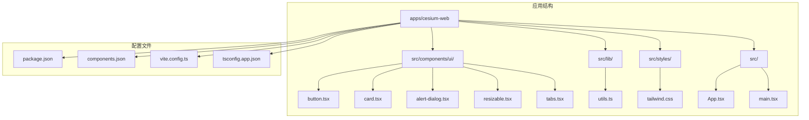
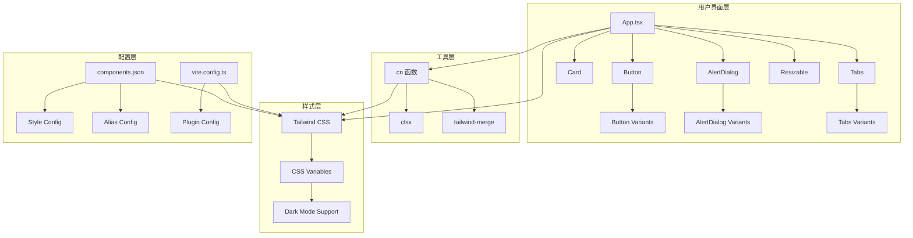
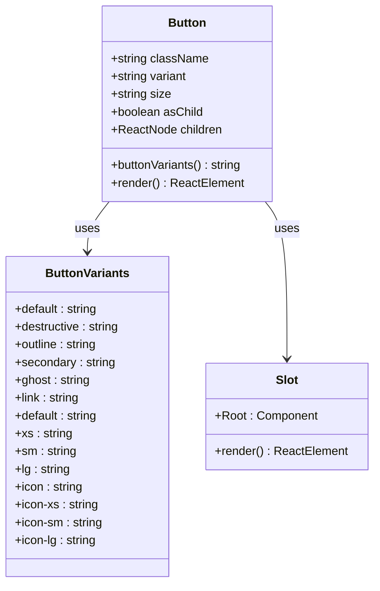
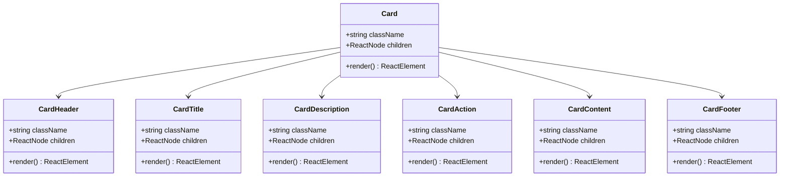
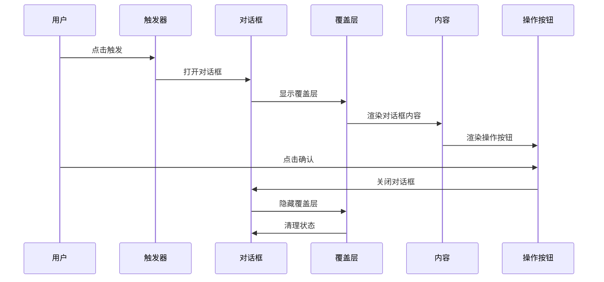
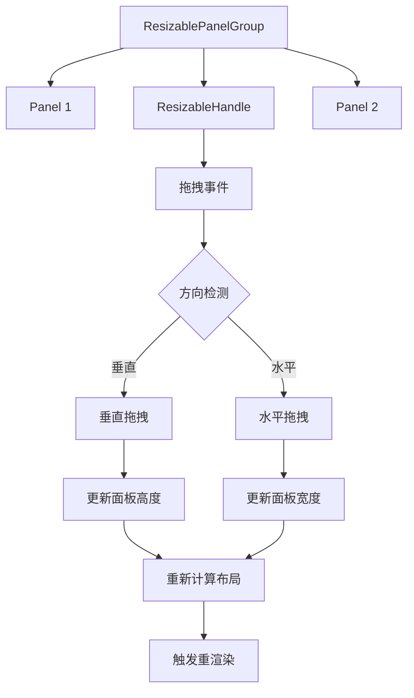
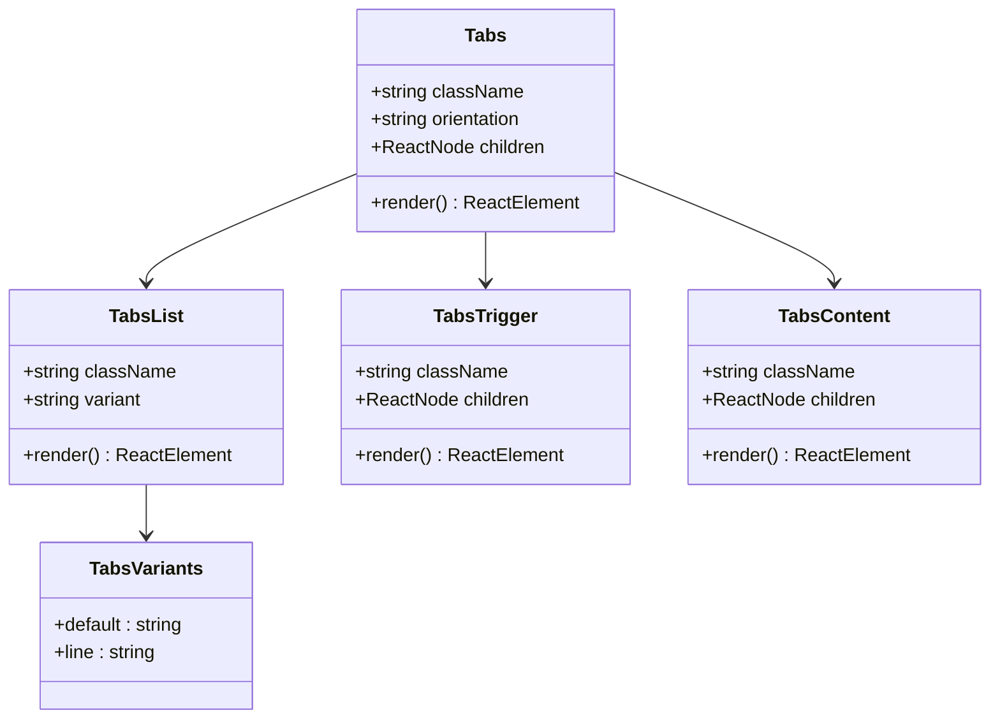
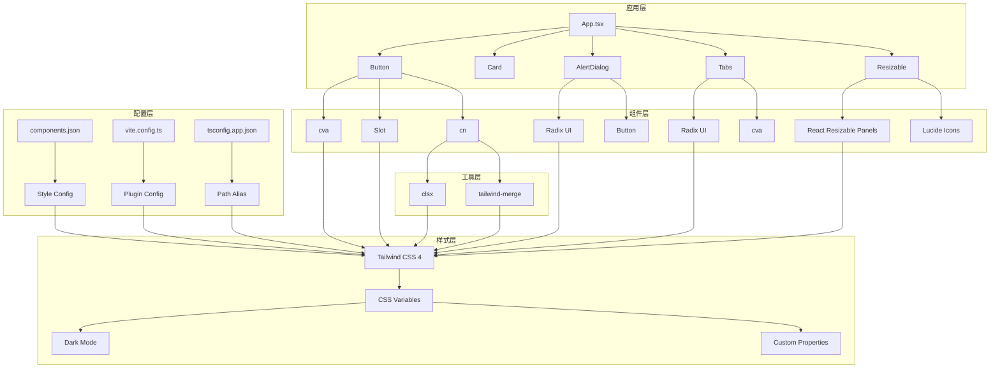

# Shadcn/UI 组件库集成

<cite>
**本文档引用的文件**
- [package.json](file://apps/cesium-web/package.json)
- [components.json](file://apps/cesium-web/components.json)
- [tailwind.css](file://apps/cesium-web/src/styles/tailwind.css)
- [utils.ts](file://apps/cesium-web/src/lib/utils.ts)
- [button.tsx](file://apps/cesium-web/src/components/ui/button.tsx)
- [card.tsx](file://apps/cesium-web/src/components/ui/card.tsx)
- [alert-dialog.tsx](file://apps/cesium-web/src/components/ui/alert-dialog.tsx)
- [resizable.tsx](file://apps/cesium-web/src/components/ui/resizable.tsx)
- [tabs.tsx](file://apps/cesium-web/src/components/ui/tabs.tsx)
- [vite.config.ts](file://apps/cesium-web/vite.config.ts)
- [tsconfig.app.json](file://apps/cesium-web/tsconfig.app.json)
- [App.tsx](file://apps/cesium-web/src/App.tsx)
- [main.tsx](file://apps/cesium-web/src/main.tsx)
</cite>

## 目录

1. [简介](#简介)
2. [项目结构](#项目结构)
3. [核心组件](#核心组件)
4. [架构概览](#架构概览)
5. [详细组件分析](#详细组件分析)
6. [依赖关系分析](#依赖关系分析)
7. [性能考虑](#性能考虑)
8. [故障排除指南](#故障排除指南)
9. [结论](#结论)

## 简介

本项目成功集成了 Shadcn/UI 组件库，这是一个基于 Radix UI 和 Tailwind CSS 的高质量 React 组件库。项目采用现代化的前端技术栈，包括 React 19、Vite 7、Tailwind CSS 4 和 TypeScript，实现了完整的组件库配置和本地定制。

Shadcn/UI 为项目提供了丰富的 UI 组件，包括基础按钮、卡片、对话框、标签页等，所有组件都经过精心设计，支持主题定制和样式覆盖。项目特别注重可访问性和用户体验，每个组件都遵循最佳实践。

## 项目结构

项目采用模块化的组织方式，Shadcn/UI 组件集中存放于 `src/components/ui/` 目录下，每个组件都是独立的模块，便于维护和复用。

**图表来源**

- [package.json:1-51](file://apps/cesium-web/package.json#L1-L51)
- [components.json:1-24](file://apps/cesium-web/components.json#L1-L24)
- [tailwind.css:1-127](file://apps/cesium-web/src/styles/tailwind.css#L1-127)

**章节来源**

- [package.json:1-51](file://apps/cesium-web/package.json#L1-L51)
- [components.json:1-24](file://apps/cesium-web/components.json#L1-L24)

## 核心组件

项目集成了多个核心 Shadcn/UI 组件，每个组件都经过精心设计和优化：

### 组件库配置

项目使用 `components.json` 文件进行全局配置，定义了组件库的样式、图标库、路径别名等关键设置：

- **样式系统**: 使用 New York 风格的主题
- **图标库**: 集成 Lucide 图标库
- **路径别名**: 定义了 `@/components`、`@/lib/utils` 等便捷路径
- **Tailwind 配置**: 指向 `src/styles/tailwind.css` 作为样式入口

### 核心依赖

项目依赖以下关键包来实现完整的 Shadcn/UI 功能：

- `class-variance-authority`: 提供变体系统支持
- `clsx`: 类名合并工具
- `tailwind-merge`: Tailwind CSS 类名智能合并
- `radix-ui`: 无障碍的 UI 组件库
- `lucide-react`: 现代 SVG 图标库

**章节来源**

- [components.json:1-24](file://apps/cesium-web/components.json#L1-L24)
- [package.json:12-29](file://apps/cesium-web/package.json#L12-L29)

## 架构概览

项目采用分层架构设计，Shadcn/UI 组件作为 UI 层与业务逻辑层分离，通过清晰的接口进行交互。

**图表来源**

- [App.tsx:15-146](file://apps/cesium-web/src/App.tsx#L15-L146)
- [utils.ts:1-7](file://apps/cesium-web/src/lib/utils.ts#L1-L7)
- [tailwind.css:1-127](file://apps/cesium-web/src/styles/tailwind.css#L1-L127)

## 详细组件分析

### Button 组件分析

Button 组件是项目中最复杂的组件之一，实现了完整的变体系统和尺寸系统。

**图表来源**

- [button.tsx:7-37](file://apps/cesium-web/src/components/ui/button.tsx#L7-L37)
- [button.tsx:39-60](file://apps/cesium-web/src/components/ui/button.tsx#L39-L60)

#### 变体系统设计

Button 组件支持多种预定义变体，每种变体都有特定的视觉风格和交互行为：

- **默认变体**: 主要操作按钮，使用 primary 颜色方案
- **破坏性变体**: 危险操作按钮，使用 destructive 颜色方案
- **轮廓变体**: 空心按钮，适合次要操作
- **次级变体**: 辅助操作按钮，使用 secondary 颜色方案
- **幽灵变体**: 透明背景按钮，适合工具栏
- **链接变体**: 文本链接样式

#### 尺寸系统设计

组件支持完整的尺寸系统，确保在不同场景下都能提供合适的视觉比例：

- **超小尺寸**: xs (h-6, px-2)
- **小尺寸**: sm (h-8, px-3)
- **默认尺寸**: default (h-9, px-4 py-2)
- **大尺寸**: lg (h-10, px-6)
- **图标尺寸**: icon 系列 (size-6 到 size-10)

**章节来源**

- [button.tsx:1-63](file://apps/cesium-web/src/components/ui/button.tsx#L1-L63)

### Card 组件分析

Card 组件提供了一个灵活的内容容器，支持头部、标题、描述、内容、动作和底部区域。

**图表来源**

- [card.tsx:5-13](file://apps/cesium-web/src/components/ui/card.tsx#L5-L13)
- [card.tsx:15-26](file://apps/cesium-web/src/components/ui/card.tsx#L15-L26)
- [card.tsx:28-34](file://apps/cesium-web/src/components/ui/card.tsx#L28-L34)
- [card.tsx:36-44](file://apps/cesium-web/src/components/ui/card.tsx#L36-L44)
- [card.tsx:46-54](file://apps/cesium-web/src/components/ui/card.tsx#L46-L54)

#### 卡片布局系统

Card 组件采用了智能的网格布局系统，支持响应式设计和动态内容排列：

- **头部区域**: 支持操作按钮的网格布局
- **标题区域**: 使用语义化标题标签
- **描述区域**: 提供辅助文本展示
- **内容区域**: 灵活的内容容器
- **动作区域**: 右侧对齐的操作按钮
- **底部区域**: 分隔线和间距控制

**章节来源**

- [card.tsx:1-57](file://apps/cesium-web/src/components/ui/card.tsx#L1-L57)

### AlertDialog 组件分析

AlertDialog 组件是一个完整的模态对话框解决方案，集成了触发器、门户、覆盖层、内容、标题、描述等多个子组件。

**图表来源**

- [alert-dialog.tsx:7-9](file://apps/cesium-web/src/components/ui/alert-dialog.tsx#L7-L9)
- [alert-dialog.tsx:19-30](file://apps/cesium-web/src/components/ui/alert-dialog.tsx#L19-L30)
- [alert-dialog.tsx:32-53](file://apps/cesium-web/src/components/ui/alert-dialog.tsx#L32-L53)

#### 对话框变体系统

AlertDialog 支持两种尺寸变体和完整的按钮变体系统：

- **尺寸变体**: default (最大宽度 480px) 和 sm (最大宽度 320px)
- **按钮变体**: 继承 Button 组件的所有变体和尺寸
- **布局系统**: 响应式网格布局，支持媒体区域

**章节来源**

- [alert-dialog.tsx:1-162](file://apps/cesium-web/src/components/ui/alert-dialog.tsx#L1-L162)

### Resizable 组件分析

Resizable 组件提供了强大的面板调整功能，支持水平和垂直方向的面板分割。

**图表来源**

- [resizable.tsx:6-14](file://apps/cesium-web/src/components/ui/resizable.tsx#L6-L14)
- [resizable.tsx:20-43](file://apps/cesium-web/src/components/ui/resizable.tsx#L20-L43)

#### 处理器设计模式

ResizableHandle 组件采用了处理器模式，支持可选的可视化手柄：

- **无手柄模式**: 简洁的分割线
- **有手柄模式**: 显示 GripVertical 图标的手柄
- **焦点状态**: 支持键盘导航和焦点管理

**章节来源**

- [resizable.tsx:1-46](file://apps/cesium-web/src/components/ui/resizable.tsx#L1-L46)

### Tabs 组件分析

Tabs 组件提供了灵活的标签页切换功能，支持水平和垂直布局以及多种样式变体。

**图表来源**

- [tabs.tsx:7-17](file://apps/cesium-web/src/components/ui/tabs.tsx#L7-L17)
- [tabs.tsx:34-47](file://apps/cesium-web/src/components/ui/tabs.tsx#L34-L47)
- [tabs.tsx:49-63](file://apps/cesium-web/src/components/ui/tabs.tsx#L49-L63)

#### 标签页变体系统

Tabs 组件支持两种主要变体：

- **默认变体**: 使用背景色填充的标签页
- **线条变体**: 使用线条指示器的标签页，更加简洁

**章节来源**

- [tabs.tsx:1-70](file://apps/cesium-web/src/components/ui/tabs.tsx#L1-L70)

## 依赖关系分析

项目中的依赖关系清晰明确，Shadcn/UI 组件库与核心依赖形成了稳定的生态系统。

**图表来源**

- [package.json:12-29](file://apps/cesium-web/package.json#L12-L29)
- [components.json:6-12](file://apps/cesium-web/components.json#L6-L12)
- [vite.config.ts:1-10](file://apps/cesium-web/vite.config.ts#L1-L10)

### 核心依赖关系

项目的关键依赖关系包括：

- **样式系统**: Tailwind CSS 4 作为基础样式框架
- **变体系统**: class-variance-authority 提供组件变体支持
- **无障碍**: radix-ui 确保组件的可访问性
- **图标系统**: lucide-react 提供现代化图标
- **工具函数**: clsx 和 tailwind-merge 优化类名处理

**章节来源**

- [package.json:12-29](file://apps/cesium-web/package.json#L12-L29)
- [components.json:1-24](file://apps/cesium-web/components.json#L1-L24)

## 性能考虑

项目在性能方面采用了多项优化策略，确保组件库的高效运行。

### 样式优化

- **CSS 变量**: 使用 CSS 自定义属性实现主题切换
- **Tailwind 合并**: 通过 tailwind-merge 避免重复样式
- **条件渲染**: 组件根据状态动态渲染，减少不必要的 DOM 更新

### 组件优化

- **变体缓存**: cva 函数缓存变体结果，避免重复计算
- **最小化重渲染**: 使用 React.memo 和适当的 props 比较
- **懒加载**: 大型组件按需加载，减少初始包大小

### 构建优化

- **Tree Shaking**: 确保未使用的代码被移除
- **代码分割**: 按路由和功能模块进行代码分割
- **压缩优化**: 生产环境启用代码压缩和混淆

## 故障排除指南

### 常见问题及解决方案

#### 样式不生效

**问题**: 组件样式显示异常或主题不正确

**解决方案**:

1. 检查 `src/styles/tailwind.css` 是否正确导入
2. 验证 CSS 变量是否正确定义
3. 确认 `components.json` 中的 Tailwind 配置

#### 组件导入错误

**问题**: 无法正确导入 Shadcn/UI 组件

**解决方案**:

1. 检查 `components.json` 中的别名配置
2. 验证 `tsconfig.app.json` 中的路径映射
3. 确认组件文件的导出语法

#### 变体系统问题

**问题**: 组件变体显示异常

**解决方案**:

1. 检查 cva 函数的变体定义
2. 验证 `cn` 函数的类名合并逻辑
3. 确认 Tailwind CSS 的变体配置

#### 无障碍功能问题

**问题**: 组件的可访问性功能异常

**解决方案**:

1. 检查 Radix UI 组件的正确使用
2. 验证焦点管理和键盘导航
3. 确认屏幕阅读器支持

**章节来源**

- [tailwind.css:1-127](file://apps/cesium-web/src/styles/tailwind.css#L1-L127)
- [utils.ts:1-7](file://apps/cesium-web/src/lib/utils.ts#L1-L7)
- [components.json:15-21](file://apps/cesium-web/components.json#L15-L21)

## 结论

本项目成功实现了 Shadcn/UI 组件库的完整集成，建立了现代化的前端开发基础设施。通过精心设计的组件架构、完善的配置系统和优化的性能策略，项目为后续的功能扩展奠定了坚实的基础。

### 主要成就

- **完整的组件库集成**: 成功集成多个核心 Shadcn/UI 组件
- **灵活的定制能力**: 支持主题定制和样式覆盖
- **优秀的开发体验**: 提供直观的组件 API 和良好的开发工具支持
- **高性能实现**: 采用多项优化策略确保组件性能

### 未来发展方向

- **组件扩展**: 根据项目需求添加更多自定义组件
- **主题系统**: 进一步完善主题定制功能
- **国际化支持**: 添加多语言支持
- **测试覆盖**: 建立完整的组件测试体系

通过持续的维护和改进，该项目将成为一个功能完善、易于维护的现代化前端应用。
