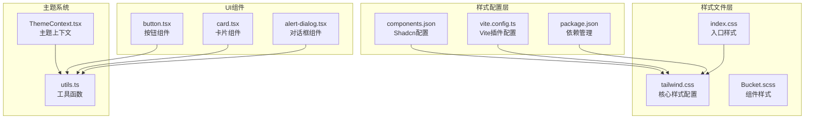
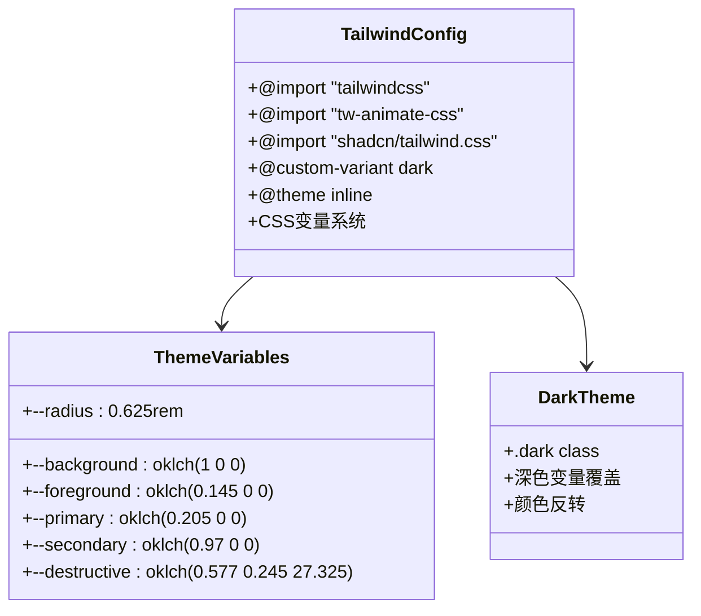
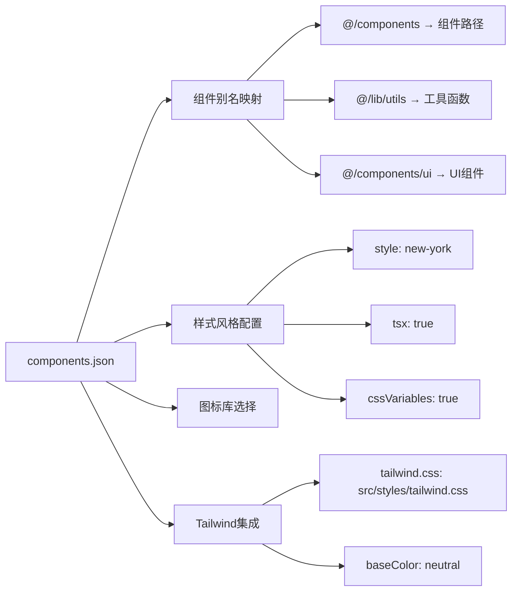
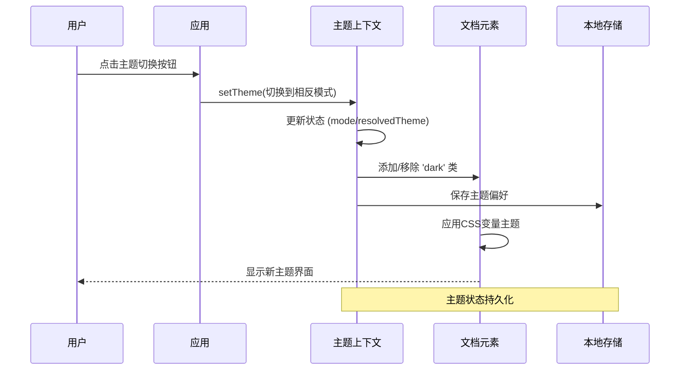
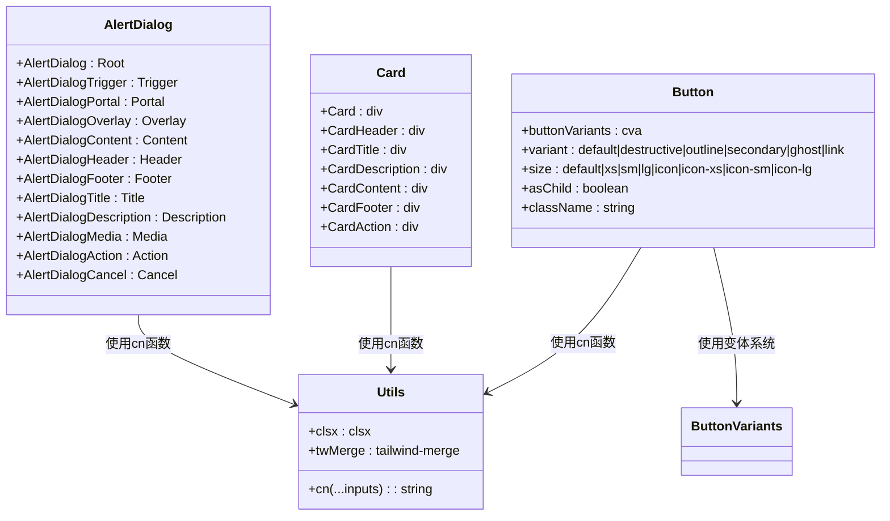
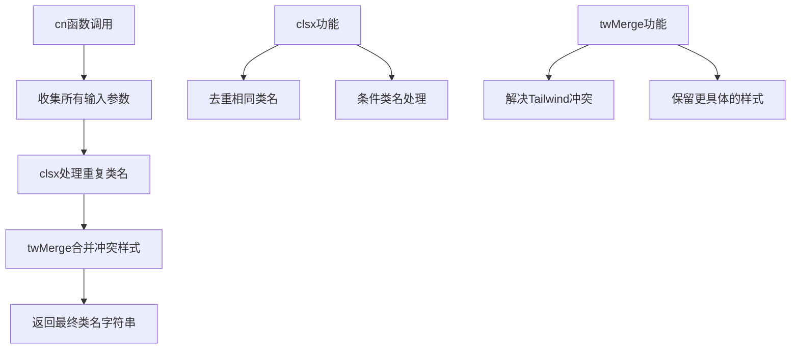
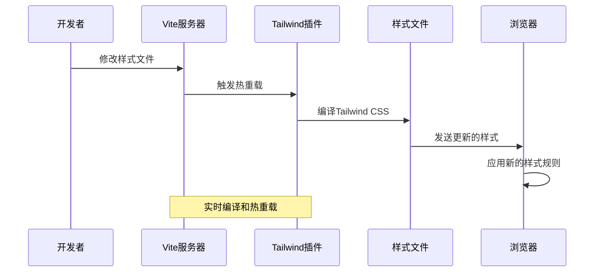
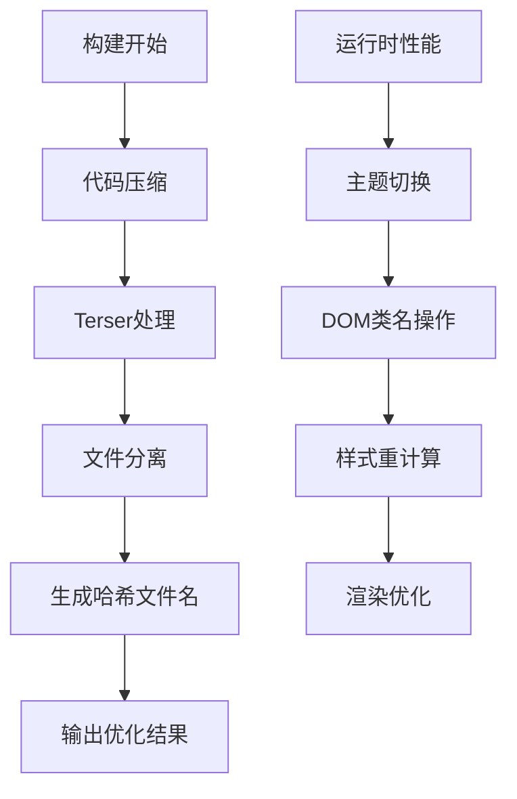

# Tailwind CSS 样式系统

<cite>
**本文档引用的文件**
- [components.json](file://apps/cesium-web/components.json)
- [tailwind.css](file://apps/cesium-web/src/styles/tailwind.css)
- [index.css](file://apps/cesium-web/src/styles/index.css)
- [vite.config.ts](file://apps/cesium-web/vite.config.ts)
- [package.json](file://apps/cesium-web/package.json)
- [ThemeContext.tsx](file://apps/cesium-web/src/contexts/ThemeContext.tsx)
- [utils.ts](file://apps/cesium-web/src/lib/utils.ts)
- [button.tsx](file://apps/cesium-web/src/components/ui/button.tsx)
- [card.tsx](file://apps/cesium-web/src/components/ui/card.tsx)
- [alert-dialog.tsx](file://apps/cesium-web/src/components/ui/alert-dialog.tsx)
- [App.tsx](file://apps/cesium-web/src/App.tsx)
- [Bucket.tsx](file://apps/cesium-web/src/components/Bucket/Bucket.tsx)
- [Bucket.scss](file://apps/cesium-web/src/components/Bucket/Bucket.scss)
</cite>

## 目录

1. [简介](#简介)
2. [项目结构](#项目结构)
3. [核心组件](#核心组件)
4. [架构概览](#架构概览)
5. [详细组件分析](#详细组件分析)
6. [依赖关系分析](#依赖关系分析)
7. [性能考虑](#性能考虑)
8. [故障排除指南](#故障排除指南)
9. [结论](#结论)

## 简介

本项目采用现代化的 Tailwind CSS v4 样式系统，结合 Shadcn/ui 组件库和自定义主题配置，构建了一个功能完整的 Cesium 应用界面。系统支持深色/浅色主题切换、响应式设计、动画效果和组件化样式管理。

## 项目结构

项目中的样式系统主要由以下组件构成：



**图表来源**

- [components.json:1-24](file://apps/cesium-web/components.json#L1-L24)
- [vite.config.ts:1-81](file://apps/cesium-web/vite.config.ts#L1-L81)
- [tailwind.css:1-127](file://apps/cesium-web/src/styles/tailwind.css#L1-L127)

**章节来源**

- [components.json:1-24](file://apps/cesium-web/components.json#L1-L24)
- [vite.config.ts:1-81](file://apps/cesium-web/vite.config.ts#L1-L81)
- [package.json:1-51](file://apps/cesium-web/package.json#L1-L51)

## 核心组件

### Tailwind CSS 配置系统

系统使用 Tailwind CSS v4 的现代配置方式，通过 CSS 变量实现主题化设计：



**图表来源**

- [tailwind.css:1-127](file://apps/cesium-web/src/styles/tailwind.css#L1-L127)

### Shadcn/ui 集成配置

项目集成了 Shadcn/ui 组件库，通过配置文件管理组件别名和样式风格：



**图表来源**

- [components.json:1-24](file://apps/cesium-web/components.json#L1-L24)

**章节来源**

- [tailwind.css:1-127](file://apps/cesium-web/src/styles/tailwind.css#L1-L127)
- [components.json:1-24](file://apps/cesium-web/components.json#L1-L24)

## 架构概览

系统采用分层架构设计，确保样式系统的可维护性和扩展性：

```mermaid
graph TB
subgraph "构建层"
A[Vite构建系统]
B[Tailwind CSS v4]
C[@tailwindcss/vite插件]
end
subgraph "配置层"
D[components.json]
E[vite.config.ts]
F[package.json]
end
subgraph "样式层"
G[index.css]
H[tailwind.css]
I[组件样式]
end
subgraph "主题层"
J[ThemeContext.tsx]
K[utils.ts]
L[动态主题切换]
end
subgraph "组件层"
M[UI组件库]
N[业务组件]
O[样式工具函数]
end
A --> B
B --> C
D --> H
E --> A
F --> B
G --> H
H --> I
J --> K
K --> O
I --> M
M --> N
N --> O
```

**图表来源**

- [vite.config.ts:1-81](file://apps/cesium-web/vite.config.ts#L1-L81)
- [tailwind.css:1-127](file://apps/cesium-web/src/styles/tailwind.css#L1-L127)
- [ThemeContext.tsx:1-108](file://apps/cesium-web/src/contexts/ThemeContext.tsx#L1-L108)

## 详细组件分析

### 主题管理系统

系统实现了完整的深色/浅色主题切换机制：



**图表来源**

- [ThemeContext.tsx:57-99](file://apps/cesium-web/src/contexts/ThemeContext.tsx#L57-L99)
- [App.tsx:13-16](file://apps/cesium-web/src/App.tsx#L13-L16)

#### 主题状态管理

主题系统支持三种模式：浅色、深色和系统跟随：

| 模式类型 | 描述         | 实现方式                           |
| -------- | ------------ | ---------------------------------- |
| light    | 强制浅色主题 | 直接设置 resolvedTheme 为 "light"  |
| dark     | 强制深色主题 | 直接设置 resolvedTheme 为 "dark"   |
| system   | 跟随系统设置 | 监听 prefers-color-scheme 媒体查询 |

**章节来源**

- [ThemeContext.tsx:1-108](file://apps/cesium-web/src/contexts/ThemeContext.tsx#L1-L108)
- [App.tsx:51-58](file://apps/cesium-web/src/App.tsx#L51-L58)

### Shadcn/ui 组件系统

系统集成了多个 Shadcn/ui 组件，每个组件都遵循一致的设计规范：



**图表来源**

- [button.tsx:1-63](file://apps/cesium-web/src/components/ui/button.tsx#L1-L63)
- [card.tsx:1-57](file://apps/cesium-web/src/components/ui/card.tsx#L1-L57)
- [alert-dialog.tsx:1-162](file://apps/cesium-web/src/components/ui/alert-dialog.tsx#L1-L162)
- [utils.ts:1-7](file://apps/cesium-web/src/lib/utils.ts#L1-L7)

#### 按钮组件变体系统

按钮组件使用 class-variance-authority (cva) 实现灵活的变体系统：

| 变体类型    | 样式特征       | 适用场景                 |
| ----------- | -------------- | ------------------------ |
| default     | 主要品牌色背景 | 主要操作按钮             |
| destructive | 红色破坏性操作 | 删除、取消等危险操作     |
| outline     | 边框样式       | 次要操作或需要强调的按钮 |
| secondary   | 次要品牌色     | 次要功能按钮             |
| ghost       | 透明背景       | 工具栏或导航按钮         |
| link        | 文本链接样式   | 导航链接或辅助操作       |

**章节来源**

- [button.tsx:7-37](file://apps/cesium-web/src/components/ui/button.tsx#L7-L37)
- [utils.ts:4-6](file://apps/cesium-web/src/lib/utils.ts#L4-L6)

### 样式工具函数

系统提供了统一的样式合并工具函数：



**图表来源**

- [utils.ts:1-7](file://apps/cesium-web/src/lib/utils.ts#L1-L7)

**章节来源**

- [utils.ts:1-7](file://apps/cesium-web/src/lib/utils.ts#L1-L7)

### 构建系统集成

Vite 构建系统与 Tailwind CSS 的深度集成：



**图表来源**

- [vite.config.ts:9-10](file://apps/cesium-web/vite.config.ts#L9-L10)

**章节来源**

- [vite.config.ts:1-81](file://apps/cesium-web/vite.config.ts#L1-L81)
- [package.json:12-28](file://apps/cesium-web/package.json#L12-L28)

## 依赖关系分析

系统的核心依赖关系如下：

```mermaid
graph TB
subgraph "核心依赖"
A[tailwindcss ^4.1.18]
B[@tailwindcss/vite ^4.1.18]
C[class-variance-authority ^0.7.1]
D[clsx ^2.1.1]
E[tailwind-merge ^3.4.0]
end
subgraph "UI库"
F[shadcn ^3.8.4]
G[lucide-react ^0.563.0]
H[radix-ui]
end
subgraph "构建工具"
I[vite ^7.3.1]
J[@vitejs/plugin-react-swc ^4.2.2]
K[sass ^1.97.3]
end
subgraph "运行时依赖"
L[react ^19.2.0]
M[react-dom ^19.2.0]
N[cesium catalog:]
end
A --> B
C --> D
D --> E
F --> A
G --> L
H --> L
I --> J
I --> K
L --> M
N --> L
```

**图表来源**

- [package.json:12-48](file://apps/cesium-web/package.json#L12-L48)

**章节来源**

- [package.json:1-51](file://apps/cesium-web/package.json#L1-L51)

## 性能考虑

### 样式优化策略

1. **CSS 变量优化**
   - 使用 CSS 自定义属性实现主题切换
   - 减少重复的样式声明
   - 支持运行时主题切换

2. **构建优化**
   - Terser 压缩配置
   - 移除生产环境 console 和 debugger
   - 文件名哈希缓存

3. **组件化样式**
   - 使用 Shadcn/ui 组件减少重复代码
   - 统一的样式工具函数
   - 条件样式处理

### 性能监控



**章节来源**

- [vite.config.ts:34-47](file://apps/cesium-web/vite.config.ts#L34-L47)
- [vite.config.ts:56-76](file://apps/cesium-web/vite.config.ts#L56-L76)

## 故障排除指南

### 常见问题及解决方案

1. **主题切换不生效**
   - 检查 `document.documentElement` 是否正确添加/移除 'dark' 类
   - 验证 CSS 变量是否正确更新
   - 确认本地存储权限

2. **Shadcn/ui 组件样式异常**
   - 检查 `components.json` 配置文件
   - 验证 Tailwind CSS 版本兼容性
   - 确认组件导入路径正确

3. **构建错误**
   - 检查 Vite 配置中的 Tailwind 插件
   - 验证依赖版本兼容性
   - 确认样式文件路径正确

**章节来源**

- [ThemeContext.tsx:64-74](file://apps/cesium-web/src/contexts/ThemeContext.tsx#L64-L74)
- [components.json:6-12](file://apps/cesium-web/components.json#L6-L12)

## 结论

本项目的 Tailwind CSS 样式系统展现了现代化前端开发的最佳实践：

1. **模块化设计** - 清晰的分层架构和组件化样式
2. **主题灵活性** - 完整的深色/浅色主题支持和系统跟随
3. **性能优化** - 构建时优化和运行时性能考虑
4. **可维护性** - 统一的样式工具和组件规范
5. **扩展性** - 易于添加新组件和自定义样式的架构

通过合理的配置和组件设计，系统为 Cesium 应用提供了强大而灵活的样式基础，支持复杂的空间数据可视化需求。
