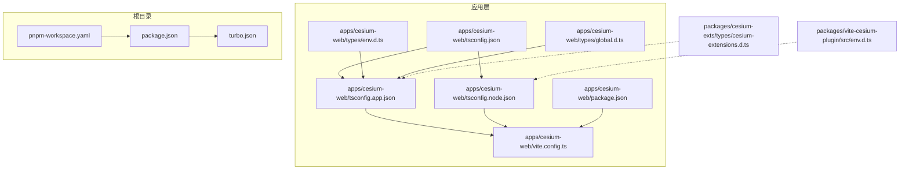
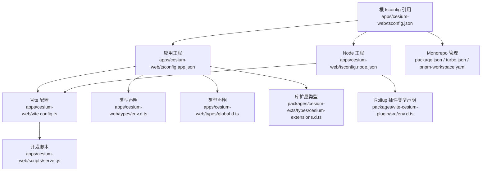
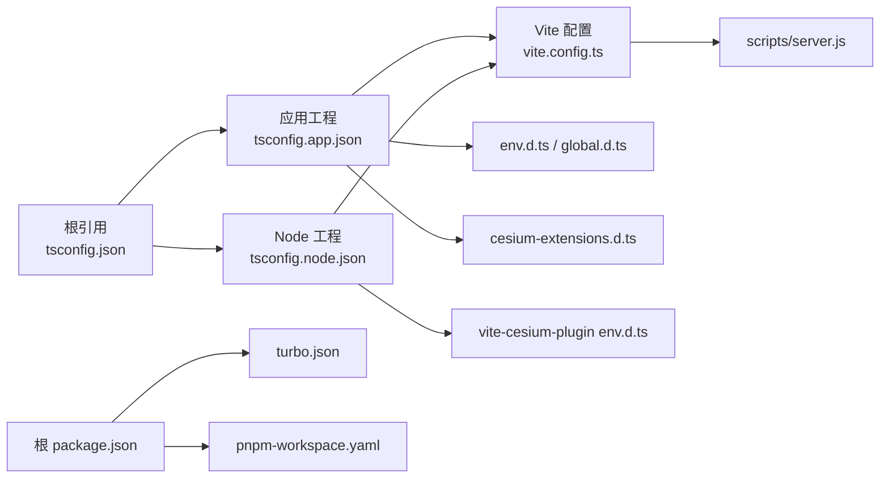

# TypeScript 配置

<cite>
**本文档引用的文件**
- [apps/cesium-web/tsconfig.json](file://apps/cesium-web/tsconfig.json)
- [apps/cesium-web/tsconfig.app.json](file://apps/cesium-web/tsconfig.app.json)
- [apps/cesium-web/tsconfig.node.json](file://apps/cesium-web/tsconfig.node.json)
- [apps/cesium-web/package.json](file://apps/cesium-web/package.json)
- [apps/cesium-web/types/env.d.ts](file://apps/cesium-web/types/env.d.ts)
- [apps/cesium-web/types/global.d.ts](file://apps/cesium-web/types/global.d.ts)
- [apps/cesium-web/vite.config.ts](file://apps/cesium-web/vite.config.ts)
- [apps/cesium-web/scripts/server.js](file://apps/cesium-web/scripts/server.js)
- [apps/cesium-web/eslint.config.js](file://apps/cesium-web/eslint.config.js)
- [apps/cesium-web/README.md](file://apps/cesium-web/README.md)
- [packages/cesium-exts/types/cesium-extensions.d.ts](file://packages/cesium-exts/types/cesium-extensions.d.ts)
- [packages/vite-cesium-plugin/src/env.d.ts](file://packages/vite-cesium-plugin/src/env.d.ts)
- [package.json](file://package.json)
- [turbo.json](file://turbo.json)
- [pnpm-workspace.yaml](file://pnpm-workspace.yaml)
</cite>

## 目录

1. [简介](#简介)
2. [项目结构](#项目结构)
3. [核心组件](#核心组件)
4. [架构总览](#架构总览)
5. [详细组件分析](#详细组件分析)
6. [依赖分析](#依赖分析)
7. [性能考虑](#性能考虑)
8. [故障排查指南](#故障排查指南)
9. [结论](#结论)
10. [附录](#附录)

## 简介

本文件系统性梳理了该仓库中 TypeScript 配置的设计与实现，重点覆盖以下方面：

- tsconfig.json 的编译选项、路径映射与模块解析策略
- app 与 node 环境下的配置差异与职责边界
- 类型检查规则、编译目标与模块系统的配置要点
- 类型定义文件的管理与第三方库类型声明处理
- 开发期类型检查最佳实践与生产环境类型安全保证

该配置采用“根 tsconfig 引用 + 分工程”的组织方式，分别面向浏览器端应用与构建工具链（Vite 配置）两类环境，确保类型检查与构建性能的平衡。

## 项目结构

该仓库为 monorepo 结构，TypeScript 配置集中在应用层（apps/cesium-web），并通过根工作区统一管理依赖版本与脚本。

**图表来源**

- [apps/cesium-web/tsconfig.json:1-12](file://apps/cesium-web/tsconfig.json#L1-L12)
- [apps/cesium-web/tsconfig.app.json:1-34](file://apps/cesium-web/tsconfig.app.json#L1-L34)
- [apps/cesium-web/tsconfig.node.json:1-28](file://apps/cesium-web/tsconfig.node.json#L1-L28)
- [apps/cesium-web/vite.config.ts:1-81](file://apps/cesium-web/vite.config.ts#L1-L81)
- [apps/cesium-web/package.json:1-51](file://apps/cesium-web/package.json#L1-L51)
- [apps/cesium-web/types/env.d.ts:1-16](file://apps/cesium-web/types/env.d.ts#L1-L16)
- [apps/cesium-web/types/global.d.ts:1-8](file://apps/cesium-web/types/global.d.ts#L1-L8)
- [package.json:1-35](file://package.json#L1-L35)
- [turbo.json:1-16](file://turbo.json#L1-L16)
- [pnpm-workspace.yaml:1-12](file://pnpm-workspace.yaml#L1-L12)
- [packages/cesium-exts/types/cesium-extensions.d.ts:1-869](file://packages/cesium-exts/types/cesium-extensions.d.ts#L1-L869)
- [packages/vite-cesium-plugin/src/env.d.ts:1-2](file://packages/vite-cesium-plugin/src/env.d.ts#L1-L2)

**章节来源**

- [apps/cesium-web/tsconfig.json:1-12](file://apps/cesium-web/tsconfig.json#L1-L12)
- [apps/cesium-web/tsconfig.app.json:1-34](file://apps/cesium-web/tsconfig.app.json#L1-L34)
- [apps/cesium-web/tsconfig.node.json:1-28](file://apps/cesium-web/tsconfig.node.json#L1-L28)
- [apps/cesium-web/vite.config.ts:1-81](file://apps/cesium-web/vite.config.ts#L1-L81)
- [apps/cesium-web/package.json:1-51](file://apps/cesium-web/package.json#L1-L51)
- [apps/cesium-web/types/env.d.ts:1-16](file://apps/cesium-web/types/env.d.ts#L1-L16)
- [apps/cesium-web/types/global.d.ts:1-8](file://apps/cesium-web/types/global.d.ts#L1-L8)
- [package.json:1-35](file://package.json#L1-L35)
- [turbo.json:1-16](file://turbo.json#L1-L16)
- [pnpm-workspace.yaml:1-12](file://pnpm-workspace.yaml#L1-L12)

## 核心组件

- 根 tsconfig 引用：通过 references 将应用拆分为独立工程，提升编译性能与类型隔离。
- app 工程：面向浏览器端应用，启用严格类型检查、ESNext 模块与 JSX 生成策略。
- node 工程：面向构建工具链（Vite 配置），启用 Node 类型与 ESNext 模块解析。
- 类型声明：通过 env.d.ts、global.d.ts 以及第三方库类型声明文件，统一全局与库扩展类型。
- 构建与脚手架：结合 Vite、ESLint 与 Turborepo，形成开发与生产的类型安全闭环。

**章节来源**

- [apps/cesium-web/tsconfig.json:1-12](file://apps/cesium-web/tsconfig.json#L1-L12)
- [apps/cesium-web/tsconfig.app.json:1-34](file://apps/cesium-web/tsconfig.app.json#L1-L34)
- [apps/cesium-web/tsconfig.node.json:1-28](file://apps/cesium-web/tsconfig.node.json#L1-L28)
- [apps/cesium-web/types/env.d.ts:1-16](file://apps/cesium-web/types/env.d.ts#L1-L16)
- [apps/cesium-web/types/global.d.ts:1-8](file://apps/cesium-web/types/global.d.ts#L1-L8)
- [apps/cesium-web/vite.config.ts:1-81](file://apps/cesium-web/vite.config.ts#L1-L81)
- [apps/cesium-web/eslint.config.js:1-37](file://apps/cesium-web/eslint.config.js#L1-L37)

## 架构总览

下图展示了 TypeScript 配置在项目中的角色与交互关系：

**图表来源**

- [apps/cesium-web/tsconfig.json:1-12](file://apps/cesium-web/tsconfig.json#L1-L12)
- [apps/cesium-web/tsconfig.app.json:1-34](file://apps/cesium-web/tsconfig.app.json#L1-L34)
- [apps/cesium-web/tsconfig.node.json:1-28](file://apps/cesium-web/tsconfig.node.json#L1-L28)
- [apps/cesium-web/vite.config.ts:1-81](file://apps/cesium-web/vite.config.ts#L1-L81)
- [apps/cesium-web/types/env.d.ts:1-16](file://apps/cesium-web/types/env.d.ts#L1-L16)
- [apps/cesium-web/types/global.d.ts:1-8](file://apps/cesium-web/types/global.d.ts#L1-L8)
- [packages/cesium-exts/types/cesium-extensions.d.ts:1-869](file://packages/cesium-exts/types/cesium-extensions.d.ts#L1-L869)
- [packages/vite-cesium-plugin/src/env.d.ts:1-2](file://packages/vite-cesium-plugin/src/env.d.ts#L1-L2)
- [apps/cesium-web/scripts/server.js:1-4](file://apps/cesium-web/scripts/server.js#L1-L4)
- [package.json:1-35](file://package.json#L1-L35)
- [turbo.json:1-16](file://turbo.json#L1-L16)
- [pnpm-workspace.yaml:1-12](file://pnpm-workspace.yaml#L1-L12)

## 详细组件分析

### 根 tsconfig 引用与路径映射

- 引用策略：通过 references 将应用拆分为 app 与 node 两个工程，提升增量编译与类型检查效率。
- 路径映射：baseUrl 与 paths 配置统一使用 @/\* 指向 src 目录，便于模块导入与 IDE 跳转。
- 文件包含：files 数组为空，实际包含由各工程的 include 控制。

**章节来源**

- [apps/cesium-web/tsconfig.json:1-12](file://apps/cesium-web/tsconfig.json#L1-L12)

### 应用工程（tsconfig.app.json）

- 编译目标与模块系统
  - target：ES2022，适配现代浏览器特性与打包器生态。
  - module：ESNext，配合 bundler 的模块解析策略。
  - moduleResolution：bundler，确保与打包器一致的解析行为。
- 严格类型检查
  - strict：开启全部严格检查。
  - 未使用项检查：noUnusedLocals、noUnusedParameters。
  - 语法擦除：erasableSyntaxOnly，仅保留可擦除语法（TS 5.8+）。
  - switch 穿透防护：noFallthroughCasesInSwitch。
  - 副作用导入检查：noUncheckedSideEffectImports。
- JSX 与类型声明
  - jsx：react-jsx，生成 React 元素。
  - types：vite/client，注入 Vite 环境类型。
- 输出与工程化
  - composite：启用工程拆分。
  - emitDeclarationOnly：仅输出类型声明文件。
  - include：src 与 types，确保类型与源码均被纳入检查。
- 路径映射：与根配置一致，统一 @/_ 到 src/_。

**章节来源**

- [apps/cesium-web/tsconfig.app.json:1-34](file://apps/cesium-web/tsconfig.app.json#L1-L34)

### Node 工程（tsconfig.node.json）

- 编译目标与模块系统
  - target：ES2023，面向 Node 环境。
  - module：ESNext，moduleResolution：bundler。
- 类型声明
  - types：node，引入 Node.js 全局类型。
- 严格类型检查
  - 与 app 工程一致的严格规则集。
- 工程化与包含范围
  - composite：启用工程拆分。
  - emitDeclarationOnly：仅输出类型声明文件。
  - include：vite.config.ts，确保构建配置具备类型安全。

**章节来源**

- [apps/cesium-web/tsconfig.node.json:1-28](file://apps/cesium-web/tsconfig.node.json#L1-L28)

### 类型定义文件管理

- 环境常量类型（env.d.ts）
  - 通过 /// <reference types="vite/client" /> 引入 Vite 环境类型。
  - 声明全局常量：**INNER_ORIGIN**、**OUTER_ORIGIN**、**CESIUM_BASE_URL**，用于运行时注入与类型校验。
- 全局窗口类型（global.d.ts）
  - 扩展 Window 接口，声明 Cesium 全局变量，确保浏览器端全局对象的类型安全。
- 第三方库类型声明
  - Cesium 扩展类型：在 packages/cesium-exts/types/cesium-extensions.d.ts 中对 Cesium 底层渲染 API 进行类型增强，覆盖着色器、缓冲区、纹理、渲染命令等核心模块。
  - Rollup 插件类型：在 packages/vite-cesium-plugin/src/env.d.ts 中声明外部全局模块，确保打包阶段类型可用。

**章节来源**

- [apps/cesium-web/types/env.d.ts:1-16](file://apps/cesium-web/types/env.d.ts#L1-L16)
- [apps/cesium-web/types/global.d.ts:1-8](file://apps/cesium-web/types/global.d.ts#L1-L8)
- [packages/cesium-exts/types/cesium-extensions.d.ts:1-869](file://packages/cesium-exts/types/cesium-extensions.d.ts#L1-L869)
- [packages/vite-cesium-plugin/src/env.d.ts:1-2](file://packages/vite-cesium-plugin/src/env.d.ts#L1-L2)

### 构建与开发脚手架集成

- Vite 配置
  - 路径别名：通过 resolve.alias 将 @ 映射到 src，与 tsconfig 的 paths 保持一致。
  - 插件：react、tailwindcss、vite-cesium-plugin，确保开发体验与构建产物质量。
  - 构建输出：自定义输出目录与文件命名策略，优化缓存与分发。
- 开发脚本
  - scripts/server.js：提供简单异步启动逻辑，便于本地联调。
- Monorepo 管理
  - package.json：统一脚本与引擎版本约束。
  - turbo.json：定义构建任务依赖与缓存策略。
  - pnpm-workspace.yaml：集中管理依赖版本与 catalog。

**章节来源**

- [apps/cesium-web/vite.config.ts:1-81](file://apps/cesium-web/vite.config.ts#L1-L81)
- [apps/cesium-web/scripts/server.js:1-4](file://apps/cesium-web/scripts/server.js#L1-L4)
- [package.json:1-35](file://package.json#L1-L35)
- [turbo.json:1-16](file://turbo.json#L1-L16)
- [pnpm-workspace.yaml:1-12](file://pnpm-workspace.yaml#L1-L12)

### ESLint 与类型感知

- ESLint 配置
  - 使用 tseslint.configs.recommended 与推荐规则集，结合 react-hooks 与 react-refresh。
  - 在生产建议中，可通过 recommendedTypeChecked、strictTypeChecked 或 stylisticTypeChecked 提升类型感知强度，并通过 parserOptions.project 指向 app 与 node 工程，使规则在多 tsconfig 环境下协同工作。
- 与 tsconfig 的协作
  - 通过根 tsconfig 的 references，确保 ESLint 能正确解析模块与类型，避免“找不到模块”或“类型缺失”的误报。

**章节来源**

- [apps/cesium-web/eslint.config.js:1-37](file://apps/cesium-web/eslint.config.js#L1-L37)
- [apps/cesium-web/README.md:16-74](file://apps/cesium-web/README.md#L16-L74)

## 依赖分析

- 工程耦合
  - 根 tsconfig 通过 references 将 app 与 node 工程解耦，降低相互影响。
  - app 工程依赖 Vite 配置与类型声明；node 工程依赖 Node 类型与打包插件类型。
- 外部依赖
  - 通过 pnpm-workspace.yaml 的 catalog 统一管理 Cesium、TypeScript、ESLint、Vite 等关键依赖版本，减少版本漂移风险。
- Monorepo 协同
  - turbo.json 定义构建任务依赖，确保子包构建顺序与缓存命中率。

**图表来源**

- [apps/cesium-web/tsconfig.json:1-12](file://apps/cesium-web/tsconfig.json#L1-L12)
- [apps/cesium-web/tsconfig.app.json:1-34](file://apps/cesium-web/tsconfig.app.json#L1-L34)
- [apps/cesium-web/tsconfig.node.json:1-28](file://apps/cesium-web/tsconfig.node.json#L1-L28)
- [apps/cesium-web/vite.config.ts:1-81](file://apps/cesium-web/vite.config.ts#L1-L81)
- [apps/cesium-web/types/env.d.ts:1-16](file://apps/cesium-web/types/env.d.ts#L1-L16)
- [apps/cesium-web/types/global.d.ts:1-8](file://apps/cesium-web/types/global.d.ts#L1-L8)
- [packages/cesium-exts/types/cesium-extensions.d.ts:1-869](file://packages/cesium-exts/types/cesium-extensions.d.ts#L1-L869)
- [packages/vite-cesium-plugin/src/env.d.ts:1-2](file://packages/vite-cesium-plugin/src/env.d.ts#L1-L2)
- [apps/cesium-web/scripts/server.js:1-4](file://apps/cesium-web/scripts/server.js#L1-L4)
- [package.json:1-35](file://package.json#L1-L35)
- [turbo.json:1-16](file://turbo.json#L1-L16)
- [pnpm-workspace.yaml:1-12](file://pnpm-workspace.yaml#L1-L12)

**章节来源**

- [apps/cesium-web/tsconfig.json:1-12](file://apps/cesium-web/tsconfig.json#L1-L12)
- [apps/cesium-web/tsconfig.app.json:1-34](file://apps/cesium-web/tsconfig.app.json#L1-L34)
- [apps/cesium-web/tsconfig.node.json:1-28](file://apps/cesium-web/tsconfig.node.json#L1-L28)
- [apps/cesium-web/vite.config.ts:1-81](file://apps/cesium-web/vite.config.ts#L1-L81)
- [apps/cesium-web/types/env.d.ts:1-16](file://apps/cesium-web/types/env.d.ts#L1-L16)
- [apps/cesium-web/types/global.d.ts:1-8](file://apps/cesium-web/types/global.d.ts#L1-L8)
- [packages/cesium-exts/types/cesium-extensions.d.ts:1-869](file://packages/cesium-exts/types/cesium-extensions.d.ts#L1-L869)
- [packages/vite-cesium-plugin/src/env.d.ts:1-2](file://packages/vite-cesium-plugin/src/env.d.ts#L1-L2)
- [apps/cesium-web/scripts/server.js:1-4](file://apps/cesium-web/scripts/server.js#L1-L4)
- [package.json:1-35](file://package.json#L1-L35)
- [turbo.json:1-16](file://turbo.json#L1-L16)
- [pnpm-workspace.yaml:1-12](file://pnpm-workspace.yaml#L1-L12)

## 性能考虑

- 工程拆分与增量编译
  - 通过 composite 与 emitDeclarationOnly，仅输出类型声明文件，减少全量编译成本。
  - references 将 app 与 node 工程分离，避免相互干扰，提升增量编译速度。
- 模块解析与语法擦除
  - moduleResolution=bundler 与 verbatimModuleSyntax 保持与打包器一致的解析与语法，减少运行时错误与打包体积。
  - erasableSyntaxOnly 仅保留可擦除语法，进一步优化类型擦除后的代码体积。
- 构建优化
  - Vite 配置中自定义输出命名与 Terser 压缩选项，结合 chunkSizeWarningLimit，平衡产物体积与加载性能。

**章节来源**

- [apps/cesium-web/tsconfig.app.json:1-34](file://apps/cesium-web/tsconfig.app.json#L1-L34)
- [apps/cesium-web/tsconfig.node.json:1-28](file://apps/cesium-web/tsconfig.node.json#L1-L28)
- [apps/cesium-web/vite.config.ts:1-81](file://apps/cesium-web/vite.config.ts#L1-L81)

## 故障排查指南

- “找不到模块”或“类型缺失”
  - 确认 ESLint 的 parserOptions.project 正确指向 app 与 node 工程，使其在多 tsconfig 环境下协同工作。
  - 检查根 tsconfig 的 references 是否正确引用子工程。
- 路径别名不生效
  - 确保 tsconfig 的 baseUrl 与 paths 与 Vite 的 resolve.alias 保持一致。
- 未使用变量/参数告警过多
  - 在 app 工程中已启用 noUnusedLocals 与 noUnusedParameters，可在团队规范中约定忽略模式（如以 \_ 开头）。
- 构建失败或类型声明未生成
  - 检查 composite 与 emitDeclarationOnly 的组合是否满足预期；确认 include 范围覆盖到目标文件。

**章节来源**

- [apps/cesium-web/README.md:16-74](file://apps/cesium-web/README.md#L16-L74)
- [apps/cesium-web/tsconfig.json:1-12](file://apps/cesium-web/tsconfig.json#L1-L12)
- [apps/cesium-web/tsconfig.app.json:1-34](file://apps/cesium-web/tsconfig.app.json#L1-L34)
- [apps/cesium-web/vite.config.ts:1-81](file://apps/cesium-web/vite.config.ts#L1-L81)

## 结论

本项目的 TypeScript 配置通过“根 tsconfig 引用 + 分工程”的方式，在开发与生产环境中实现了类型安全与构建性能的平衡。应用工程专注于浏览器端类型与严格检查，Node 工程聚焦于构建工具链类型与 Node 环境支持；配合统一的路径映射、类型声明与 ESLint 配置，形成了可维护、可扩展的类型体系。

## 附录

### 开发时类型检查最佳实践

- 使用 recommendedTypeChecked 或 strictTypeChecked 提升 ESLint 的类型感知能力。
- 通过 parserOptions.project 指向 app 与 node 工程，确保规则在多 tsconfig 环境下协同。
- 在团队内约定忽略模式（如以 \_ 开头的未使用变量），减少噪音同时保持严格性。

**章节来源**

- [apps/cesium-web/README.md:16-74](file://apps/cesium-web/README.md#L16-L74)

### 生产环境类型安全保证

- 通过 composite 与 emitDeclarationOnly，仅输出类型声明文件，减少运行时负担。
- 严格检查规则贯穿 app 与 node 工程，确保潜在问题在开发阶段暴露。
- Vite 构建配置与 Terser 压缩选项配合，保障产物体积与稳定性。

**章节来源**

- [apps/cesium-web/tsconfig.app.json:1-34](file://apps/cesium-web/tsconfig.app.json#L1-L34)
- [apps/cesium-web/tsconfig.node.json:1-28](file://apps/cesium-web/tsconfig.node.json#L1-L28)
- [apps/cesium-web/vite.config.ts:1-81](file://apps/cesium-web/vite.config.ts#L1-L81)
