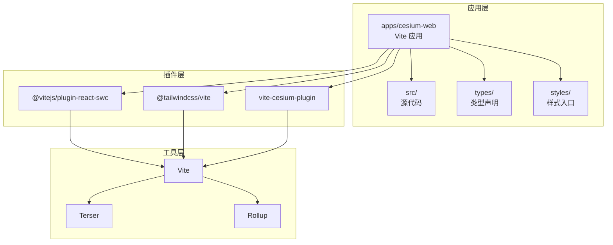
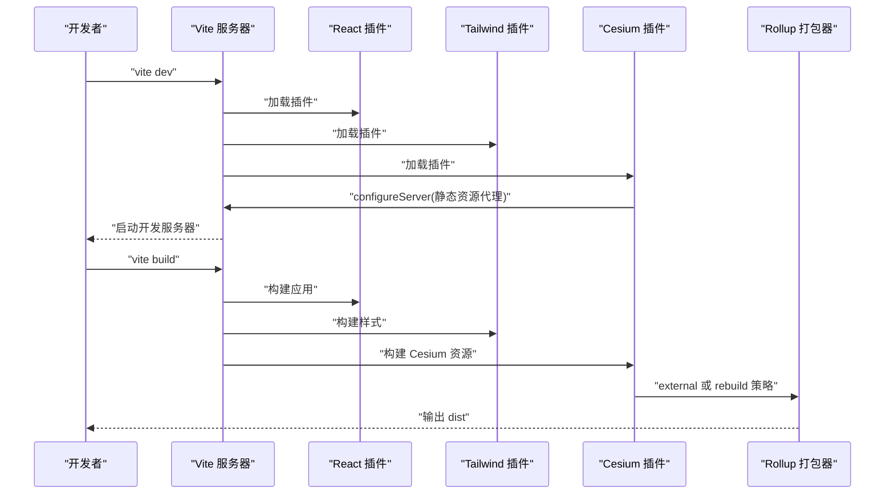
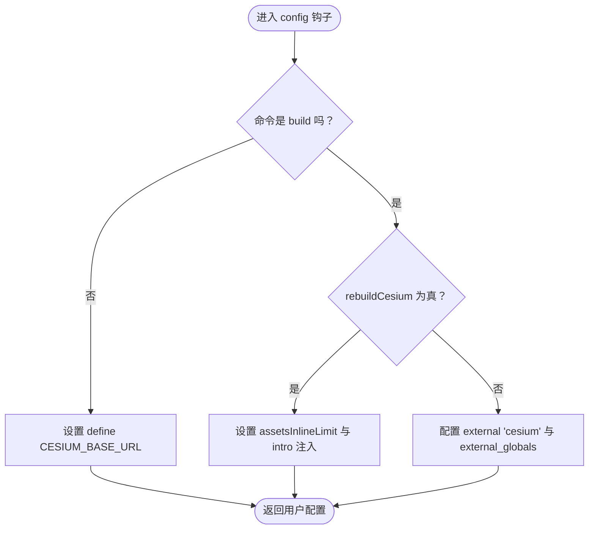
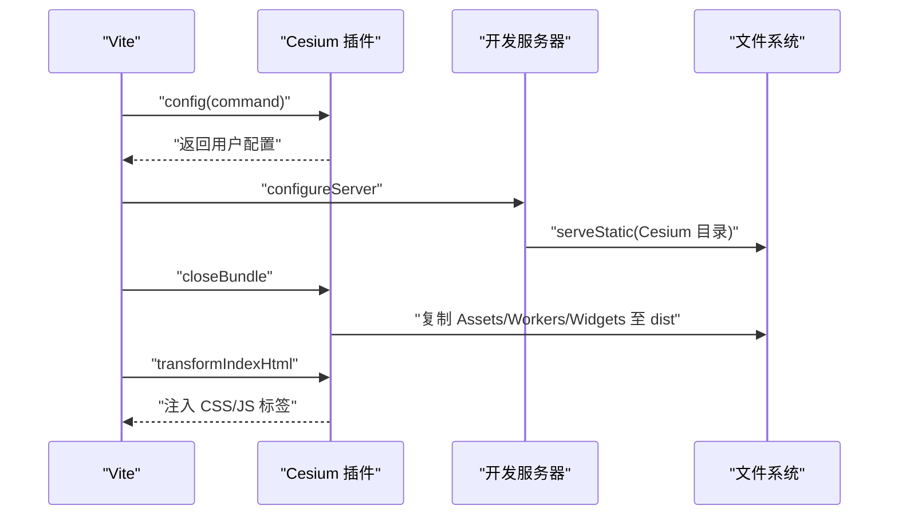
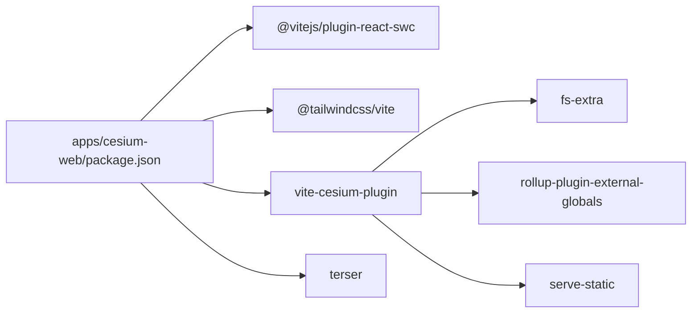

# Vite 构建配置

<cite>
**本文档引用的文件**
- [vite.config.ts](file://apps/cesium-web/vite.config.ts)
- [package.json](file://apps/cesium-web/package.json)
- [index.ts](file://packages/vite-cesium-plugin/src/index.ts)
- [package.json](file://packages/vite-cesium-plugin/package.json)
- [env.d.ts](file://apps/cesium-web/types/env.d.ts)
- [global.d.ts](file://apps/cesium-web/types/global.d.ts)
- [tsconfig.app.json](file://apps/cesium-web/tsconfig.app.json)
- [tsconfig.json](file://apps/cesium-web/tsconfig.json)
- [server.js](file://apps/cesium-web/scripts/server.js)
- [tailwind.css](file://apps/cesium-web/src/styles/tailwind.css)
- [components.json](file://apps/cesium-web/components.json)
- [main.tsx](file://apps/cesium-web/src/main.tsx)
- [App.tsx](file://apps/cesium-web/src/App.tsx)
</cite>

## 目录

1. [简介](#简介)
2. [项目结构](#项目结构)
3. [核心组件](#核心组件)
4. [架构总览](#架构总览)
5. [详细组件分析](#详细组件分析)
6. [依赖关系分析](#依赖关系分析)
7. [性能考虑](#性能考虑)
8. [故障排除指南](#故障排除指南)
9. [结论](#结论)
10. [附录](#附录)

## 简介

本文件系统性梳理 Vite 构建配置，重点覆盖以下方面：

- 插件体系：React、Tailwind CSS、Cesium 插件的集成与行为差异
- 路径别名与类型支持：如何通过 Vite 与 TypeScript 协同实现统一的模块解析
- 开发服务器配置：网络访问、自动打开浏览器等
- 构建优化：Terser 压缩、Rollup 打包输出命名策略
- 环境差异：开发与生产环境的差异化配置与行为
- 性能优化建议与常见问题排查
- 自定义插件开发与配置扩展方法

## 项目结构

该仓库采用多包工作区结构，核心前端应用位于 apps/cesium-web，Cesium 相关的 Vite 插件位于 packages/vite-cesium-plugin。应用内通过路径别名 @ 指向 src 目录，配合 TypeScript 的路径映射确保类型与运行时一致。

图表来源

- [vite.config.ts:1-81](file://apps/cesium-web/vite.config.ts#L1-L81)
- [package.json:1-51](file://apps/cesium-web/package.json#L1-L51)
- [index.ts:1-194](file://packages/vite-cesium-plugin/src/index.ts#L1-L194)

章节来源

- [vite.config.ts:1-81](file://apps/cesium-web/vite.config.ts#L1-L81)
- [package.json:1-51](file://apps/cesium-web/package.json#L1-L51)
- [tsconfig.app.json:1-34](file://apps/cesium-web/tsconfig.app.json#L1-L34)
- [tsconfig.json:1-12](file://apps/cesium-web/tsconfig.json#L1-L12)

## 核心组件

本节聚焦 Vite 配置文件中的关键部分及其作用机制。

- 插件配置
  - React 插件：启用 React 代码转换与热更新
  - Tailwind CSS 插件：将 Tailwind 指令注入到构建流程
  - Cesium 插件：提供开发服务器静态资源代理、复制 Cesium 资源、注入 HTML 标签、以及生产构建时的外部化或重打包策略

- 路径别名
  - 通过 Vite 的 resolve.alias 与 TypeScript 的 paths 实现 @/_ 到 src/_ 的统一映射，保证开发与构建一致

- 开发服务器
  - host 设置为允许通过 IP 访问
  - open 为 true，启动时自动打开浏览器

- 构建优化
  - minify 使用 Terser 并开启 keep_infinity、drop_console、drop_debugger
  - Rollup 输出命名策略：入口、共享块、静态资源分别按类型分类命名并带 hash

章节来源

- [vite.config.ts:9-81](file://apps/cesium-web/vite.config.ts#L9-L81)
- [tsconfig.app.json:28-30](file://apps/cesium-web/tsconfig.app.json#L28-L30)
- [tsconfig.json:4-6](file://apps/cesium-web/tsconfig.json#L4-L6)

## 架构总览

下图展示 Vite 在开发与生产两种命令下的关键流程与插件交互：

图表来源

- [vite.config.ts:9-22](file://apps/cesium-web/vite.config.ts#L9-L22)
- [index.ts:95-139](file://packages/vite-cesium-plugin/src/index.ts#L95-L139)
- [index.ts:141-152](file://packages/vite-cesium-plugin/src/index.ts#L141-L152)

## 详细组件分析

### React 插件配置

- 作用：负责 React JSX/TSX 的转换、HMR、以及与 Vite 的集成
- 在本项目中作为第一个插件加载，确保后续插件（如 Tailwind、Cesium）在转换后的代码上工作

章节来源

- [vite.config.ts:5-10](file://apps/cesium-web/vite.config.ts#L5-L10)

### Tailwind CSS 插件配置

- 作用：将 Tailwind 指令注入到构建流程，使 CSS 能按需生成
- 与应用样式入口协同，生成主题化的 CSS

章节来源

- [vite.config.ts:3-10](file://apps/cesium-web/vite.config.ts#L3-L10)
- [tailwind.css:1-4](file://apps/cesium-web/src/styles/tailwind.css#L1-L4)

### Cesium 插件配置与行为

- 功能概览
  - 开发环境：通过中间件代理 Cesium 目录，解决跨域与 404；注入全局变量 CESIUM_BASE_URL
  - 生产环境：根据配置决定是外部化 Cesium（external + external_globals）还是重新打包（rebuildCesium）
  - 自动复制 Assets/Workers/Widgets 等静态资源至输出目录
  - 注入 Widgets 样式与必要脚本（当非 rebuildCesium 且生产构建）

- 关键配置项
  - rebuildCesium：是否将 Cesium 源码打包进应用产物
  - devMinifyCesium：开发时是否使用压缩版 Cesium
  - cesiumBuildRootPath / cesiumBuildPath：Cesium Build 目录位置
  - cesiumBaseUrl：Cesium 资源基础路径（最终注入 window.CESIUM_BASE_URL）

- 生命周期钩子
  - config：区分 dev/build，设置 define、rollupOptions、assetsInlineLimit 等
  - configureServer：开发服务器中挂载静态资源代理
  - closeBundle：生产构建完成后复制静态资源
  - transformIndexHtml：注入 CSS/JS 标签

图表来源

- [index.ts:95-139](file://packages/vite-cesium-plugin/src/index.ts#L95-L139)

图表来源

- [index.ts:141-152](file://packages/vite-cesium-plugin/src/index.ts#L141-L152)
- [index.ts:154-169](file://packages/vite-cesium-plugin/src/index.ts#L154-L169)
- [index.ts:171-191](file://packages/vite-cesium-plugin/src/index.ts#L171-L191)

章节来源

- [index.ts:75-194](file://packages/vite-cesium-plugin/src/index.ts#L75-L194)
- [vite.config.ts:6-10](file://apps/cesium-web/vite.config.ts#L6-L10)

### 路径别名与类型支持

- Vite 层：resolve.alias 将 @ 映射到 src
- TypeScript 层：tsconfig.app.json 与 tsconfig.json 的 paths 保持一致，确保类型检查与运行时解析一致
- 组件别名：components.json 中的 aliases 字段进一步规范了组件、工具、UI、hooks 的别名，便于统一导入

章节来源

- [vite.config.ts:11-15](file://apps/cesium-web/vite.config.ts#L11-L15)
- [tsconfig.app.json:28-30](file://apps/cesium-web/tsconfig.app.json#L28-L30)
- [tsconfig.json:4-6](file://apps/cesium-web/tsconfig.json#L4-L6)
- [components.json:15-21](file://apps/cesium-web/components.json#L15-L21)

### 开发服务器配置

- host: "0.0.0.0" 允许通过局域网 IP 访问开发服务器
- open: true 启动时自动打开浏览器
- 与自定义脚本 server.js 协作：在启动 Vite 前执行自定义逻辑（当前示例为空操作）

章节来源

- [vite.config.ts:17-22](file://apps/cesium-web/vite.config.ts#L17-L22)
- [server.js:1-4](file://apps/cesium-web/scripts/server.js#L1-L4)

### 构建优化与输出命名策略

- 压缩：minify 使用 "terser"，开启 keep_infinity、drop_console、drop_debugger，删除注释
- 输出目录：outDir 为 dist，emptyOutDir 确保每次构建前清理
- Rollup 输出命名：
  - 入口文件：js/[name].[hash].js
  - 共享块：js/[name].[hash].js
  - 静态资源：按类型分类命名，如 media/img/fonts/[name].[hash].[ext]
- 资源体积告警阈值：chunkSizeWarningLimit 提升至较大值以适应大型应用

章节来源

- [vite.config.ts:24-79](file://apps/cesium-web/vite.config.ts#L24-L79)

### 环境差异与全局常量

- 开发环境：通过 define 注入 CESIUM_BASE_URL，避免硬编码
- 生产环境：根据 rebuildCesium 决定 external 或 rebuild 策略，并在产物中注入必要的全局变量或脚本
- 类型声明：env.d.ts 定义了 **INNER_ORIGIN**、**OUTER_ORIGIN**、**CESIUM_BASE_URL** 等全局常量，供应用代码使用
- 全局类型：global.d.ts 为 window.Cesium 声明类型，确保 Cesium 外部化后类型安全

章节来源

- [index.ts:112-114](file://packages/vite-cesium-plugin/src/index.ts#L112-L114)
- [index.ts:117-127](file://packages/vite-cesium-plugin/src/index.ts#L117-L127)
- [env.d.ts:8-15](file://apps/cesium-web/types/env.d.ts#L8-L15)
- [global.d.ts:4-6](file://apps/cesium-web/types/global.d.ts#L4-L6)

### 自定义插件开发与配置扩展

- 插件接口：遵循 Vite Plugin 接口，常用钩子包括 config、configureServer、closeBundle、transformIndexHtml
- 扩展建议：
  - 在 config 中根据 command 分支处理 dev/build 差异
  - 在 configureServer 中挂载中间件处理静态资源或代理
  - 在 closeBundle 中进行资源复制、产物后处理
  - 在 transformIndexHtml 中注入必要的 CSS/JS 标签
- 与第三方库协作：使用 rollup-plugin-external-globals 外部化全局库，结合 serve-static 提供静态资源

章节来源

- [index.ts:92-193](file://packages/vite-cesium-plugin/src/index.ts#L92-L193)

## 依赖关系分析

- 应用依赖
  - @vitejs/plugin-react-swc：React 转换与 HMR
  - @tailwindcss/vite：Tailwind 指令注入
  - vite-cesium-plugin：Cesium 集成与资源处理
  - terser：生产压缩
- 插件内部依赖
  - fs-extra：文件复制
  - rollup-plugin-external-globals：外部化全局变量
  - serve-static：静态资源服务

图表来源

- [package.json:12-48](file://apps/cesium-web/package.json#L12-L48)
- [package.json:22-28](file://apps/cesium-web/package.json#L22-L28)
- [package.json:1-51](file://apps/cesium-web/package.json#L1-L51)
- [index.ts:1-5](file://packages/vite-cesium-plugin/src/index.ts#L1-L5)

章节来源

- [package.json:12-48](file://apps/cesium-web/package.json#L12-L48)
- [package.json:22-28](file://apps/cesium-web/package.json#L22-L28)
- [package.json:1-51](file://apps/cesium-web/package.json#L1-L51)
- [package.json:22-38](file://packages/vite-cesium-plugin/package.json#L22-L38)

## 性能考虑

- 压缩策略
  - keep_infinity：防止 Infinity 被压缩为 1/0，避免潜在性能问题
  - drop_console/drop_debugger：移除生产环境日志与断点，减小体积
  - comments: false：删除注释，进一步减小体积
- 资源体积告警
  - 将 chunkSizeWarningLimit 提升至较高值，避免大体积产物频繁告警
- 输出命名
  - 使用哈希命名静态资源，有利于浏览器缓存与增量更新
  - 按类型分类命名，便于 CDN 缓存策略与资源管理
- 外部化与重打包
  - 对于大型库（如 Cesium），优先考虑 external + 复制静态资源，减少打包体积与时间
  - 如需内联或调试，可启用 rebuildCesium

章节来源

- [vite.config.ts:34-47](file://apps/cesium-web/vite.config.ts#L34-L47)
- [vite.config.ts:30-31](file://apps/cesium-web/vite.config.ts#L30-L31)
- [vite.config.ts:50-76](file://apps/cesium-web/vite.config.ts#L50-L76)
- [index.ts:128-136](file://packages/vite-cesium-plugin/src/index.ts#L128-L136)

## 故障排除指南

- Cesium 资源 404 或跨域问题
  - 确认开发服务器已挂载 Cesium 目录代理
  - 检查 cesiumBaseUrl 与实际部署路径一致
- 生产构建后 Cesium 无法加载
  - 确认 rebuildCesium 配置与实际产物一致
  - 检查 dist 中是否包含 Assets/Workers/Widgets/Cesium.js
- 全局变量未定义
  - 开发环境通过 define 注入 CESIUM_BASE_URL
  - 生产环境通过 external_globals 或 intro 注入
- 类型错误
  - 确保 env.d.ts 与 global.d.ts 正确声明全局常量与窗口对象
  - 保持 tsconfig 的 paths 与 Vite alias 一致

章节来源

- [index.ts:141-152](file://packages/vite-cesium-plugin/src/index.ts#L141-L152)
- [index.ts:154-169](file://packages/vite-cesium-plugin/src/index.ts#L154-L169)
- [index.ts:112-114](file://packages/vite-cesium-plugin/src/index.ts#L112-L114)
- [index.ts:124](file://packages/vite-cesium-plugin/src/index.ts#L124)
- [env.d.ts:8-15](file://apps/cesium-web/types/env.d.ts#L8-L15)
- [global.d.ts:4-6](file://apps/cesium-web/types/global.d.ts#L4-L6)
- [tsconfig.app.json:28-30](file://apps/cesium-web/tsconfig.app.json#L28-L30)

## 结论

本配置通过 React、Tailwind、Cesium 三大插件与 Vite 的深度集成，实现了现代化前端开发体验与高性能生产构建。路径别名与 TypeScript 配置的一致性确保了开发与构建的可靠性。针对 Cesium 的外部化与资源复制策略有效平衡了体积与可维护性。通过合理的 Terser 与 Rollup 策略，可在保证运行效率的同时显著降低产物体积。

## 附录

- 示例组件与入口
  - main.tsx：应用入口，初始化插件与主题上下文
  - App.tsx：应用根组件，使用路径别名 @/\* 导入组件
- 样式与 UI
  - tailwind.css：Tailwind 主题与自定义变量
  - components.json：UI 组件别名与样式配置

章节来源

- [main.tsx:1-19](file://apps/cesium-web/src/main.tsx#L1-L19)
- [App.tsx:1-149](file://apps/cesium-web/src/App.tsx#L1-L149)
- [tailwind.css:1-127](file://apps/cesium-web/src/styles/tailwind.css#L1-L127)
- [components.json:1-24](file://apps/cesium-web/components.json#L1-L24)
