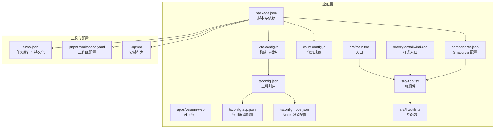
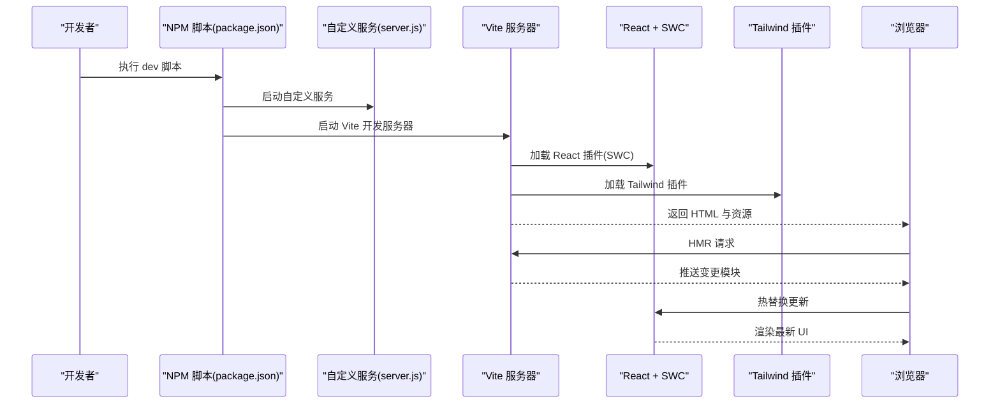
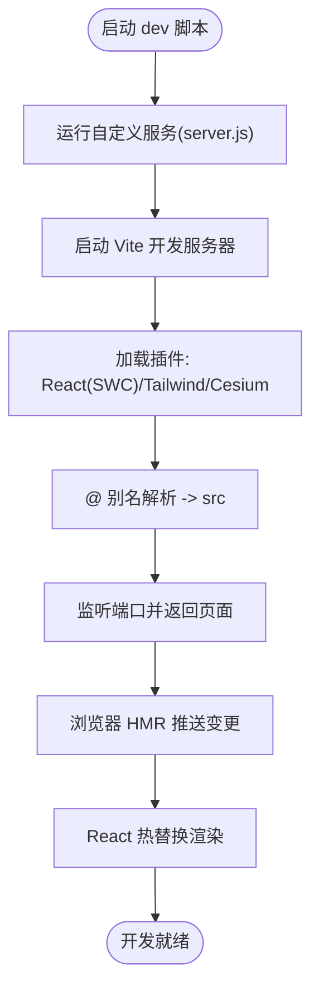
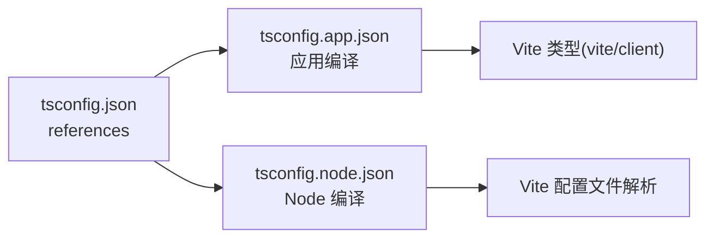
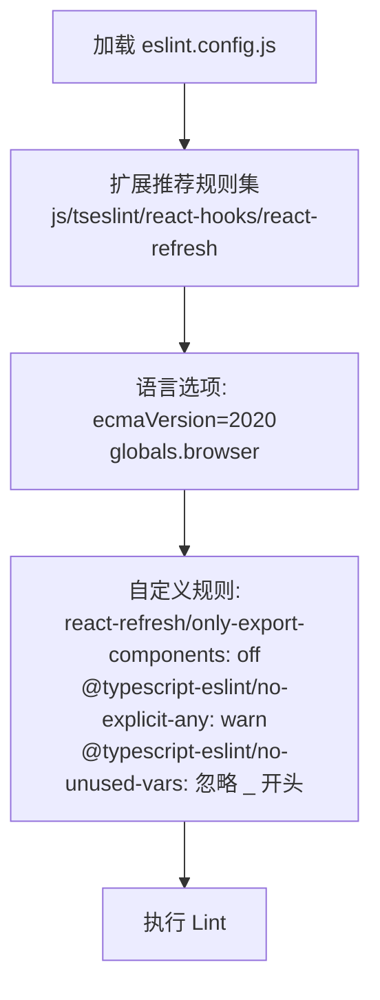
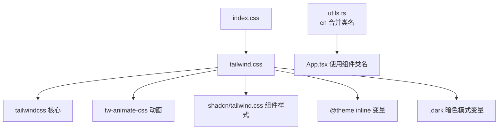
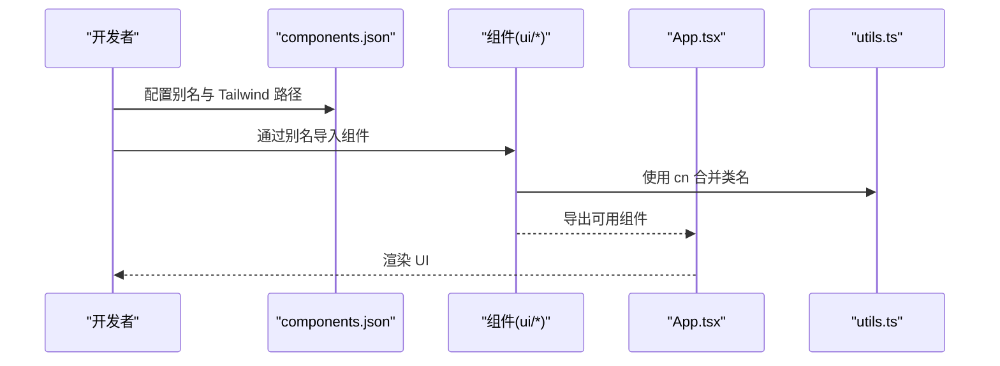
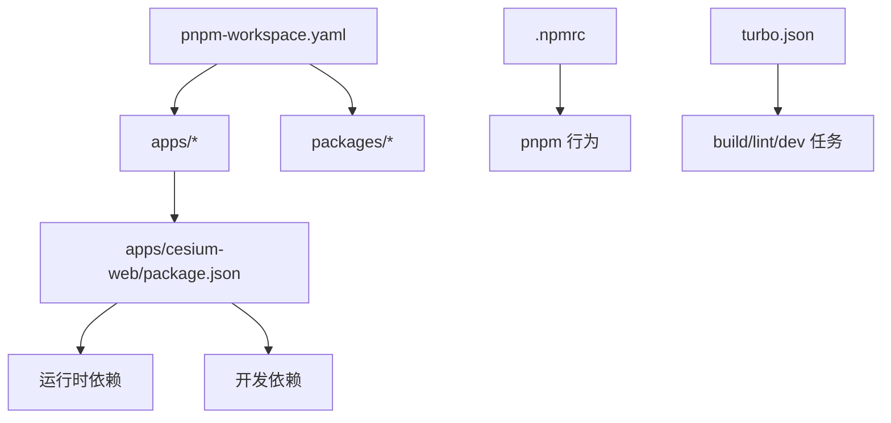

# 开发环境

<cite>
**本文档引用的文件**
- [vite.config.ts](file://apps/cesium-web/vite.config.ts)
- [tsconfig.json](file://apps/cesium-web/tsconfig.json)
- [tsconfig.app.json](file://apps/cesium-web/tsconfig.app.json)
- [tsconfig.node.json](file://apps/cesium-web/tsconfig.node.json)
- [eslint.config.js](file://apps/cesium-web/eslint.config.js)
- [components.json](file://apps/cesium-web/components.json)
- [package.json](file://apps/cesium-web/package.json)
- [server.js](file://apps/cesium-web/scripts/server.js)
- [tailwind.css](file://apps/cesium-web/src/styles/tailwind.css)
- [index.css](file://apps/cesium-web/src/styles/index.css)
- [utils.ts](file://apps/cesium-web/src/lib/utils.ts)
- [App.tsx](file://apps/cesium-web/src/App.tsx)
- [main.tsx](file://apps/cesium-web/src/main.tsx)
- [turbo.json](file://turbo.json)
- [pnpm-workspace.yaml](file://pnpm-workspace.yaml)
- [.npmrc](file://.npmrc)
- [README.md](file://apps/cesium-web/README.md)
</cite>

## 目录

1. [简介](#简介)
2. [项目结构](#项目结构)
3. [核心组件](#核心组件)
4. [架构总览](#架构总览)
5. [详细组件分析](#详细组件分析)
6. [依赖分析](#依赖分析)
7. [性能考虑](#性能考虑)
8. [故障排查指南](#故障排查指南)
9. [结论](#结论)
10. [附录](#附录)

## 简介

本指南面向团队开发者，系统讲解本项目的开发环境配置与使用方法，涵盖以下主题：

- Vite 构建配置与开发服务器启动流程
- TypeScript 编译设置与多工程引用
- ESLint 代码规范配置与推荐升级路径
- Tailwind CSS 样式系统配置与暗色模式支持
- 组件库（Shadcn/ui）集成与别名配置
- 开发工作流程最佳实践（代码组织、命名约定、模块导入）
- 常见问题与性能优化建议
- 团队协作统一标准与工具配置

## 项目结构

本仓库采用 pnpm workspaces + Turborepo 的多包结构，核心前端应用位于 apps/cesium-web。该应用使用 Vite 作为构建工具，React + TypeScript 作为技术栈，Tailwind CSS 提供原子化样式，Shadcn/ui 提供可复用组件。

图表来源

- [package.json:1-51](file://apps/cesium-web/package.json#L1-L51)
- [vite.config.ts:1-81](file://apps/cesium-web/vite.config.ts#L1-L81)
- [tsconfig.json:1-12](file://apps/cesium-web/tsconfig.json#L1-L12)
- [tsconfig.app.json:1-34](file://apps/cesium-web/tsconfig.app.json#L1-L34)
- [tsconfig.node.json:1-28](file://apps/cesium-web/tsconfig.node.json#L1-L28)
- [eslint.config.js:1-37](file://apps/cesium-web/eslint.config.js#L1-L37)
- [components.json:1-24](file://apps/cesium-web/components.json#L1-L24)
- [tailwind.css:1-127](file://apps/cesium-web/src/styles/tailwind.css#L1-L127)
- [utils.ts:1-7](file://apps/cesium-web/src/lib/utils.ts#L1-L7)
- [main.tsx:1-19](file://apps/cesium-web/src/main.tsx#L1-L19)
- [App.tsx:1-149](file://apps/cesium-web/src/App.tsx#L1-L149)
- [turbo.json:1-16](file://turbo.json#L1-L16)
- [pnpm-workspace.yaml:1-12](file://pnpm-workspace.yaml#L1-L12)
- [.npmrc:1-3](file://.npmrc#L1-L3)

章节来源

- [package.json:1-51](file://apps/cesium-web/package.json#L1-L51)
- [turbo.json:1-16](file://turbo.json#L1-L16)
- [pnpm-workspace.yaml:1-12](file://pnpm-workspace.yaml#L1-L12)
- [.npmrc:1-3](file://.npmrc#L1-L3)

## 核心组件

- Vite 构建与开发服务器：启用 React（SWC）、Tailwind CSS 插件、Cesium 插件；配置路径别名、开发服务器主机与自动打开、构建产物输出与 Rollup 输出命名、生产压缩与注释移除。
- TypeScript 多工程：通过 tsconfig.json 的 references 将应用与 Node 工程拆分，分别在 tsconfig.app.json 与 tsconfig.node.json 中配置严格类型检查、模块解析策略与 JSX 生成方式。
- ESLint：基于 flat config，启用推荐规则集、React Hooks、React Refresh，并对未使用变量与显式 any 提供告警与忽略规则。
- Tailwind CSS：引入 tw-animate-css 与 Shadcn/ui 样式，定义暗色模式变量与层叠基底样式，使用 CSS 变量与 oklch 色彩空间。
- Shadcn/ui：通过 components.json 定义样式风格、TSX 支持、Tailwind 配置路径、别名映射（components、utils、ui、lib、hooks），并启用 lucide 图标库。
- 工具函数：cn 组合类名，结合 clsx 与 tailwind-merge 实现冲突覆盖与合并。
- 应用入口与根组件：main.tsx 注入全局样式与插件初始化，App.tsx 组织页面布局与交互。

章节来源

- [vite.config.ts:1-81](file://apps/cesium-web/vite.config.ts#L1-L81)
- [tsconfig.json:1-12](file://apps/cesium-web/tsconfig.json#L1-L12)
- [tsconfig.app.json:1-34](file://apps/cesium-web/tsconfig.app.json#L1-L34)
- [tsconfig.node.json:1-28](file://apps/cesium-web/tsconfig.node.json#L1-L28)
- [eslint.config.js:1-37](file://apps/cesium-web/eslint.config.js#L1-L37)
- [components.json:1-24](file://apps/cesium-web/components.json#L1-L24)
- [tailwind.css:1-127](file://apps/cesium-web/src/styles/tailwind.css#L1-L127)
- [utils.ts:1-7](file://apps/cesium-web/src/lib/utils.ts#L1-L7)
- [main.tsx:1-19](file://apps/cesium-web/src/main.tsx#L1-L19)
- [App.tsx:1-149](file://apps/cesium-web/src/App.tsx#L1-L149)

## 架构总览

下图展示从开发命令到浏览器渲染的关键流程，包括插件加载、样式注入、组件挂载与热更新机制。

图表来源

- [package.json:6-11](file://apps/cesium-web/package.json#L6-L11)
- [server.js:1-4](file://apps/cesium-web/scripts/server.js#L1-L4)
- [vite.config.ts:9-22](file://apps/cesium-web/vite.config.ts#L9-L22)
- [main.tsx:1-19](file://apps/cesium-web/src/main.tsx#L1-L19)

## 详细组件分析

### Vite 构建配置与开发服务器

- 插件链：React（SWC）、Tailwind CSS、vite-cesium-plugin。
- 路径别名：@ 指向 src，便于统一导入。
- 开发服务器：host 允许局域网访问，open 自动打开浏览器。
- 构建输出：outDir 为 dist，emptyOutDir 清理输出目录；chunkSizeWarningLimit 提升体积警告阈值。
- 生产压缩：minify 使用 terser，保留 Infinity 并移除 console 与 debugger；注释全部删除。
- Rollup 输出命名：入口、代码块、静态资源按类型分类命名并带 hash。
- 与自定义服务：dev 脚本先启动 scripts/server.js 再启动 Vite。

图表来源

- [package.json:6-11](file://apps/cesium-web/package.json#L6-L11)
- [server.js:1-4](file://apps/cesium-web/scripts/server.js#L1-L4)
- [vite.config.ts:9-22](file://apps/cesium-web/vite.config.ts#L9-L22)
- [vite.config.ts:11-15](file://apps/cesium-web/vite.config.ts#L11-L15)
- [vite.config.ts:24-79](file://apps/cesium-web/vite.config.ts#L24-L79)

章节来源

- [vite.config.ts:1-81](file://apps/cesium-web/vite.config.ts#L1-L81)
- [package.json:6-11](file://apps/cesium-web/package.json#L6-L11)

### TypeScript 编译设置与工程拆分

- 基础配置：tsconfig.json 通过 references 引用应用与 Node 工程。
- 应用工程(tsconfig.app.json)：目标 ES2022，模块解析 bundler，JSX 采用 react-jsx，严格检查开启，路径别名 @/\* 映射 src。
- Node 工程(tsconfig.node.json)：目标 ES2023，包含 Node 类型，模块解析 bundler，严格检查开启。
- 与 Vite 集成：Vite 使用 Vite Types（vite/client）类型，确保开发时类型正确。

图表来源

- [tsconfig.json:1-12](file://apps/cesium-web/tsconfig.json#L1-L12)
- [tsconfig.app.json:1-34](file://apps/cesium-web/tsconfig.app.json#L1-L34)
- [tsconfig.node.json:1-28](file://apps/cesium-web/tsconfig.node.json#L1-L28)

章节来源

- [tsconfig.json:1-12](file://apps/cesium-web/tsconfig.json#L1-L12)
- [tsconfig.app.json:1-34](file://apps/cesium-web/tsconfig.app.json#L1-L34)
- [tsconfig.node.json:1-28](file://apps/cesium-web/tsconfig.node.json#L1-L28)
- [README.md:14-74](file://apps/cesium-web/README.md#L14-L74)

### ESLint 代码规范配置

- 配置结构：flat config，排除 dist 目录，针对 ts/tsx 文件启用推荐规则集。
- 规则要点：关闭 react-refresh 对仅导出常量的限制；对 any 提供 warn；对未使用变量提供灵活忽略（以下划线开头的参数/变量/解构数组）。
- 推荐升级：README 提供了基于类型感知的更严格规则组合与 React 特定插件的启用方式。

图表来源

- [eslint.config.js:1-37](file://apps/cesium-web/eslint.config.js#L1-L37)
- [README.md:14-74](file://apps/cesium-web/README.md#L14-L74)

章节来源

- [eslint.config.js:1-37](file://apps/cesium-web/eslint.config.js#L1-L37)
- [README.md:14-74](file://apps/cesium-web/README.md#L14-L74)

### Tailwind CSS 样式系统

- 样式入口：index.css 引入 tailwind.css。
- 样式实现：tailwind.css 导入 tailwindcss、tw-animate-css 与 shadcn/tailwind.css；定义自定义变体 dark；通过 @theme inline 使用 CSS 变量；在 :root 与 .dark 中定义 oklch 色彩变量；在 base 层设置通用边框与文本颜色。
- 工具函数：utils.ts 的 cn 使用 clsx 与 tailwind-merge 合并类名，避免冲突。

图表来源

- [index.css:1-2](file://apps/cesium-web/src/styles/index.css#L1-L2)
- [tailwind.css:1-127](file://apps/cesium-web/src/styles/tailwind.css#L1-L127)
- [utils.ts:1-7](file://apps/cesium-web/src/lib/utils.ts#L1-L7)
- [App.tsx:1-149](file://apps/cesium-web/src/App.tsx#L1-L149)

章节来源

- [tailwind.css:1-127](file://apps/cesium-web/src/styles/tailwind.css#L1-L127)
- [index.css:1-2](file://apps/cesium-web/src/styles/index.css#L1-L2)
- [utils.ts:1-7](file://apps/cesium-web/src/lib/utils.ts#L1-L7)

### 组件库（Shadcn/ui）集成与自定义

- 配置文件：components.json 定义 style、rsc、tsx、tailwind 配置、基础色、CSS 变量开关、图标库、RTL、别名映射与注册表。
- 别名映射：components -> @/components，utils -> @/lib/utils，ui -> @/components/ui，lib -> @/lib，hooks -> @/hooks。
- 在组件中使用：App.tsx 引入并使用 ui/button、ui/tabs、ui/resizable 等组件，配合 cn 合并类名。

图表来源

- [components.json:1-24](file://apps/cesium-web/components.json#L1-L24)
- [App.tsx:1-149](file://apps/cesium-web/src/App.tsx#L1-L149)
- [utils.ts:1-7](file://apps/cesium-web/src/lib/utils.ts#L1-L7)

章节来源

- [components.json:1-24](file://apps/cesium-web/components.json#L1-L24)
- [App.tsx:1-149](file://apps/cesium-web/src/App.tsx#L1-L149)
- [utils.ts:1-7](file://apps/cesium-web/src/lib/utils.ts#L1-L7)

### 开发工作流程与最佳实践

- 代码组织：按功能划分目录（components、hooks、lib、styles、util），入口文件集中管理。
- 命名约定：组件文件使用 PascalCase（如 Bucket.tsx），工具函数使用 camelCase（如 cn）。
- 模块导入：统一使用 @ 别名导入 src 下资源，减少相对路径复杂度。
- 组件复用：优先使用 Shadcn/ui 组件与 cn 合并类名，保证一致性与可维护性。
- 调试技巧：利用 Vite 的 HMR 快速反馈；在 ESLint 中对未使用变量进行灵活忽略；在 TypeScript 中启用严格检查提升质量。

章节来源

- [vite.config.ts:11-15](file://apps/cesium-web/vite.config.ts#L11-L15)
- [tsconfig.app.json:28-30](file://apps/cesium-web/tsconfig.app.json#L28-L30)
- [utils.ts:1-7](file://apps/cesium-web/src/lib/utils.ts#L1-L7)
- [App.tsx:1-149](file://apps/cesium-web/src/App.tsx#L1-L149)

## 依赖分析

- 工作区与包管理：pnpm-workspace.yaml 声明 apps 与 packages 为工作区，.npmrc 设置 auto-install-peers 与 engine-strict。
- Turborepo：turbo.json 定义 build/lint/dev 任务，dev 任务持久化且不缓存，确保开发体验稳定。
- 应用依赖：React 19、SWC React 插件、Tailwind CSS v4、@tailwindcss/vite、vite-cesium-plugin、Monaco Editor、Radix UI、Lucide React 等。
- 开发依赖：ESLint、typescript-eslint、globals、sass、terser、shadcn、vite 等。

图表来源

- [pnpm-workspace.yaml:1-12](file://pnpm-workspace.yaml#L1-L12)
- [.npmrc:1-3](file://.npmrc#L1-L3)
- [turbo.json:1-16](file://turbo.json#L1-L16)
- [package.json:1-51](file://apps/cesium-web/package.json#L1-L51)

章节来源

- [pnpm-workspace.yaml:1-12](file://pnpm-workspace.yaml#L1-L12)
- [.npmrc:1-3](file://.npmrc#L1-L3)
- [turbo.json:1-16](file://turbo.json#L1-L16)
- [package.json:1-51](file://apps/cesium-web/package.json#L1-L51)

## 性能考虑

- 构建体积：提升 chunkSizeWarningLimit，合理拆分代码块，避免单文件过大。
- 生产压缩：启用 terser，保留 Infinity，移除 console 与 debugger，删除注释，降低包体与运行时开销。
- 模块解析：使用 bundler 解析策略与 verbatimModuleSyntax，减少不必要的语法转换。
- 样式体积：Tailwind CSS 按需引入与变量化设计，避免冗余样式。
- 开发体验：HMR 与 SWC 加速，避免频繁全量刷新；dev 任务持久化，减少重启成本。

章节来源

- [vite.config.ts:24-79](file://apps/cesium-web/vite.config.ts#L24-L79)
- [tsconfig.app.json:10-18](file://apps/cesium-web/tsconfig.app.json#L10-L18)
- [tailwind.css:1-127](file://apps/cesium-web/src/styles/tailwind.css#L1-L127)

## 故障排查指南

- 开发服务器无法访问：确认 server.host 设置为 0.0.0.0，确保防火墙放行端口。
- 路径别名无效：检查 vite.config.ts 的 alias 与 tsconfig.app.json 的 paths 是否一致。
- ESLint 报错：根据 eslint.config.js 的规则调整代码或在 IDE 中启用类型感知规则（参考 README 的推荐配置）。
- Tailwind 样式未生效：确认 index.css 引入 tailwind.css，且 components.json 的 tailwind.css 路径正确。
- 组件类名冲突：使用 utils.ts 的 cn 合并类名，避免重复覆盖。
- 自定义服务异常：检查 scripts/server.js 是否有异步逻辑阻塞，必要时简化或移除临时逻辑。

章节来源

- [vite.config.ts:17-22](file://apps/cesium-web/vite.config.ts#L17-L22)
- [vite.config.ts:11-15](file://apps/cesium-web/vite.config.ts#L11-L15)
- [eslint.config.js:22-34](file://apps/cesium-web/eslint.config.js#L22-L34)
- [index.css:1-2](file://apps/cesium-web/src/styles/index.css#L1-L2)
- [components.json:7-12](file://apps/cesium-web/components.json#L7-L12)
- [utils.ts:1-7](file://apps/cesium-web/src/lib/utils.ts#L1-L7)
- [server.js:1-4](file://apps/cesium-web/scripts/server.js#L1-L4)

## 结论

本项目已建立完善的开发环境：Vite 提供快速启动与热更新，TypeScript 多工程拆分保障编译性能与类型安全，ESLint 与 Tailwind CSS/组件库形成统一的代码与样式规范。遵循本文档的配置与最佳实践，可显著提升开发效率与代码质量，并为团队协作提供一致的工具链与标准。

## 附录

- 团队协作标准建议
  - 统一使用 pnpm 并启用 auto-install-peers，确保依赖一致性。
  - 使用 husky 与 commitlint 规范提交信息（当前仓库存在 .husky 目录，建议完善钩子）。
  - 在 CI 中执行 lint、build 与测试，确保质量门禁。
  - 文档与变更日志同步更新，便于知识沉淀与回溯。

章节来源

- [.npmrc:1-3](file://.npmrc#L1-L3)
- [turbo.json:1-16](file://turbo.json#L1-L16)
- [package.json:1-51](file://apps/cesium-web/package.json#L1-L51)
