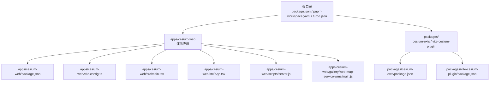
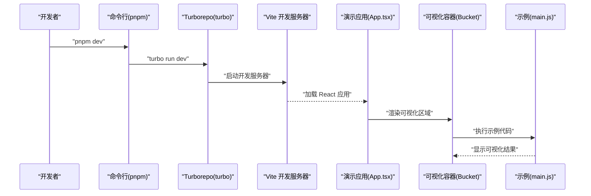
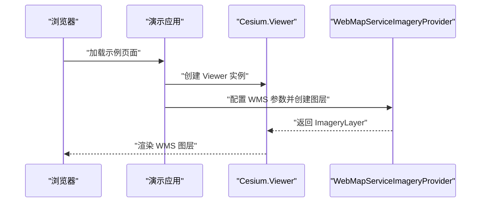
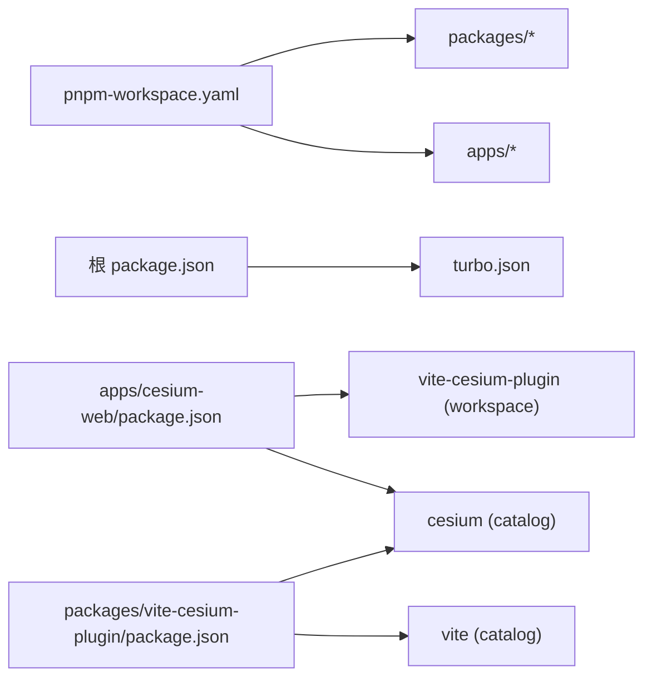

# 快速开始

<cite>
**本文引用的文件**
- [README.md](file://README.md)
- [package.json](file://package.json)
- [pnpm-workspace.yaml](file://pnpm-workspace.yaml)
- [turbo.json](file://turbo.json)
- [apps/cesium-web/package.json](file://apps/cesium-web/package.json)
- [apps/cesium-web/vite.config.ts](file://apps/cesium-web/vite.config.ts)
- [apps/cesium-web/src/main.tsx](file://apps/cesium-web/src/main.tsx)
- [apps/cesium-web/src/App.tsx](file://apps/cesium-web/src/App.tsx)
- [apps/cesium-web/scripts/server.js](file://apps/cesium-web/scripts/server.js)
- [apps/cesium-web/gallery/web-map-service-wms/main.js](file://apps/cesium-web/gallery/web-map-service-wms/main.js)
- [packages/cesium-exts/package.json](file://packages/cesium-exts/package.json)
- [packages/vite-cesium-plugin/package.json](file://packages/vite-cesium-plugin/package.json)
</cite>

## 目录

1. [简介](#简介)
2. [项目结构](#项目结构)
3. [核心组件](#核心组件)
4. [架构总览](#架构总览)
5. [详细组件分析](#详细组件分析)
6. [依赖关系分析](#依赖关系分析)
7. [性能注意事项](#性能注意事项)
8. [故障排查指南](#故障排查指南)
9. [结论](#结论)
10. [附录](#附录)

## 简介

本指南面向希望快速上手 Cesium 扩展项目的开发者，覆盖从环境准备、项目克隆与依赖安装，到开发服务器启动与常用命令的完整流程；同时提供基础使用示例与首个热力图可视化案例，帮助不同经验水平的用户尽快建立开发环境并运行示例。

## 项目结构

该项目采用 Monorepo 架构，使用 pnpm workspace 管理多包，结合 Turborepo 统一调度构建与开发任务。核心目录与职责如下：

- apps/cesium-web：基于 Vite + React 的演示应用，提供交互式示例画廊与沙盒编辑器
- packages/cesium-exts：核心扩展库，包含热力图、风场等可视化组件
- packages/vite-cesium-plugin：Vite 插件，用于在 Vite 项目中无缝集成 CesiumJS
- 根级配置：package.json、pnpm-workspace.yaml、turbo.json、README.md 等

图表来源

- [package.json:1-35](file://package.json#L1-L35)
- [pnpm-workspace.yaml:1-12](file://pnpm-workspace.yaml#L1-L12)
- [turbo.json:1-16](file://turbo.json#L1-L16)
- [apps/cesium-web/package.json:1-51](file://apps/cesium-web/package.json#L1-L51)
- [apps/cesium-web/vite.config.ts:1-81](file://apps/cesium-web/vite.config.ts#L1-L81)
- [apps/cesium-web/src/main.tsx:1-19](file://apps/cesium-web/src/main.tsx#L1-L19)
- [apps/cesium-web/src/App.tsx:1-149](file://apps/cesium-web/src/App.tsx#L1-L149)
- [apps/cesium-web/scripts/server.js:1-4](file://apps/cesium-web/scripts/server.js#L1-L4)
- [apps/cesium-web/gallery/web-map-service-wms/main.js:1-22](file://apps/cesium-web/gallery/web-map-service-wms/main.js#L1-L22)
- [packages/cesium-exts/package.json:1-48](file://packages/cesium-exts/package.json#L1-L48)
- [packages/vite-cesium-plugin/package.json:1-40](file://packages/vite-cesium-plugin/package.json#L1-L40)

章节来源

- [README.md:90-123](file://README.md#L90-L123)
- [pnpm-workspace.yaml:1-12](file://pnpm-workspace.yaml#L1-L12)
- [turbo.json:1-16](file://turbo.json#L1-L16)

## 核心组件

- 演示应用（apps/cesium-web）
  - 基于 Vite + React，内置 TailwindCSS、Monaco 编辑器、主题切换与设置面板
  - 提供示例画廊与沙盒编辑器，支持实时运行与控制台输出
- 核心扩展库（packages/cesium-exts）
  - 提供热力图、风场等可视化组件，支持多种渲染模式
  - 通过 Gulp + Rollup 构建，输出 ESM、CJS、UMD 与类型声明
- Vite 插件（packages/vite-cesium-plugin）
  - 为 Vite 项目提供 CesiumJS 集成能力，简化开发体验

章节来源

- [apps/cesium-web/package.json:1-51](file://apps/cesium-web/package.json#L1-L51)
- [packages/cesium-exts/package.json:1-48](file://packages/cesium-exts/package.json#L1-L48)
- [packages/vite-cesium-plugin/package.json:1-40](file://packages/vite-cesium-plugin/package.json#L1-L40)

## 架构总览

下图展示了从开发命令到应用启动、再到示例运行的整体流程：

图表来源

- [package.json:5-12](file://package.json#L5-L12)
- [turbo.json:10-13](file://turbo.json#L10-L13)
- [apps/cesium-web/vite.config.ts:16-22](file://apps/cesium-web/vite.config.ts#L16-L22)
- [apps/cesium-web/src/App.tsx:118-131](file://apps/cesium-web/src/App.tsx#L118-L131)
- [apps/cesium-web/gallery/web-map-service-wms/main.js:1-22](file://apps/cesium-web/gallery/web-map-service-wms/main.js#L1-L22)

## 详细组件分析

### 环境要求与安装

- 环境要求
  - Node.js >= 22.18.0
  - pnpm >= 10.10.0
  - Cesium >= 1.136.0（推荐 1.141.0）
- 安装步骤
  1. 克隆仓库并进入目录
  2. 安装依赖：pnpm install
- 开发与构建命令
  - 启动开发服务器：pnpm dev
  - 构建所有包：pnpm build
  - 代码检查：pnpm lint
  - 代码格式化：pnpm format

章节来源

- [README.md:33-64](file://README.md#L33-L64)
- [package.json:28-33](file://package.json#L28-L33)
- [pnpm-workspace.yaml:4-11](file://pnpm-workspace.yaml#L4-L11)

### 开发服务器与常用命令

- 开发服务器
  - 通过 pnpm dev 启动，内部调用 Turborepo 并由 Vite 提供热更新
  - Vite 配置允许通过 IP 访问并自动打开浏览器
- 常用命令
  - pnpm dev：启动开发服务器
  - pnpm build：构建所有包
  - pnpm lint：运行 ESLint
  - pnpm format：使用 Prettier 格式化

章节来源

- [package.json:5-11](file://package.json#L5-L11)
- [turbo.json:10-13](file://turbo.json#L10-L13)
- [apps/cesium-web/vite.config.ts:16-22](file://apps/cesium-web/vite.config.ts#L16-L22)

### 目录结构与关键配置文件

- apps/cesium-web
  - src：应用源码，包含入口、页面、组件、上下文、工具等
  - vite.config.ts：Vite 配置，启用 React、TailwindCSS 与 Cesium 插件
  - package.json：应用依赖与脚本
- packages/cesium-exts
  - 核心扩展库，包含模块与工具
  - 通过 Gulp + Rollup 构建，输出多格式产物
- packages/vite-cesium-plugin
  - Vite 插件，提供 CesiumJS 集成
- 根级
  - pnpm-workspace.yaml：工作区与版本目录配置
  - turbo.json：任务缓存与持久化配置
  - README.md：特性、示例与项目结构说明

章节来源

- [apps/cesium-web/vite.config.ts:1-81](file://apps/cesium-web/vite.config.ts#L1-L81)
- [apps/cesium-web/package.json:1-51](file://apps/cesium-web/package.json#L1-L51)
- [packages/cesium-exts/package.json:1-48](file://packages/cesium-exts/package.json#L1-L48)
- [packages/vite-cesium-plugin/package.json:1-40](file://packages/vite-cesium-plugin/package.json#L1-L40)
- [pnpm-workspace.yaml:1-12](file://pnpm-workspace.yaml#L1-L12)
- [turbo.json:1-16](file://turbo.json#L1-L16)
- [README.md:90-123](file://README.md#L90-L123)

### 第一个热力图可视化案例

- 示例目标：在 Cesium 中添加热力图图层并展示数据点
- 关键步骤
  1. 引入核心库中的热力图组件
  2. 创建 Viewer 并初始化热力图实例
  3. 添加数据点并渲染
- 说明
  - 本项目提供热力图组件与示例，可在演示应用中直接运行或参考示例代码进行集成

章节来源

- [README.md:66-88](file://README.md#L66-L88)

### 示例运行流程（以 WMS 图层为例）

图表来源

- [apps/cesium-web/gallery/web-map-service-wms/main.js:1-22](file://apps/cesium-web/gallery/web-map-service-wms/main.js#L1-L22)

## 依赖关系分析

- 工作区与版本目录
  - pnpm-workspace.yaml 声明 apps 与 packages 为工作区，并通过 catalog 统一管理版本
- 构建与开发
  - package.json 定义根级脚本，委托给 Turborepo
  - turbo.json 配置任务依赖与缓存策略
- 应用与插件
  - apps/cesium-web 依赖 Cesium 与 vite-cesium-plugin
  - vite-cesium-plugin 作为 Vite 插件提供 Cesium 集成

图表来源

- [pnpm-workspace.yaml:1-12](file://pnpm-workspace.yaml#L1-L12)
- [package.json:1-35](file://package.json#L1-L35)
- [turbo.json:1-16](file://turbo.json#L1-L16)
- [apps/cesium-web/package.json:12-28](file://apps/cesium-web/package.json#L12-L28)
- [packages/vite-cesium-plugin/package.json:22-38](file://packages/vite-cesium-plugin/package.json#L22-L38)

章节来源

- [pnpm-workspace.yaml:1-12](file://pnpm-workspace.yaml#L1-L12)
- [package.json:1-35](file://package.json#L1-L35)
- [turbo.json:1-16](file://turbo.json#L1-L16)
- [apps/cesium-web/package.json:1-51](file://apps/cesium-web/package.json#L1-L51)
- [packages/vite-cesium-plugin/package.json:1-40](file://packages/vite-cesium-plugin/package.json#L1-L40)

## 性能注意事项

- 构建优化
  - Vite 配置中启用了 Terser 压缩，生产环境移除 console 与 debugger，降低包体与运行时开销
  - 输出文件名包含哈希，便于浏览器缓存与增量更新
- 开发体验
  - 开发任务不启用缓存且持久化，确保热更新稳定可靠
- 建议
  - 在本地开发时保持自动打开浏览器与主机地址开放，便于多端调试
  - 对大型示例建议拆分为独立沙盒，避免一次性加载过多资源

章节来源

- [apps/cesium-web/vite.config.ts:32-77](file://apps/cesium-web/vite.config.ts#L32-L77)
- [turbo.json:10-13](file://turbo.json#L10-L13)

## 故障排查指南

- 环境版本不匹配
  - 确认 Node.js 与 pnpm 版本满足要求，Cesium 版本与项目推荐版本一致
- 依赖安装失败
  - 清理缓存后重试安装，确保网络稳定
- 开发服务器无法访问
  - 检查 Vite 配置中的 host 与 open 设置，确认防火墙未拦截
- 示例无法运行
  - 确认示例代码正确引入 Cesium 并创建 Viewer 实例
  - 如需网络资源，检查跨域与代理配置

章节来源

- [README.md:33-37](file://README.md#L33-L37)
- [package.json:28-33](file://package.json#L28-L33)
- [apps/cesium-web/vite.config.ts:16-22](file://apps/cesium-web/vite.config.ts#L16-L22)
- [apps/cesium-web/gallery/web-map-service-wms/main.js:1-22](file://apps/cesium-web/gallery/web-map-service-wms/main.js#L1-L22)

## 结论

通过本指南，您可以在本地快速搭建基于 Vite + React 的 Cesium 扩展开发环境，完成依赖安装、启动开发服务器，并运行首个热力图可视化示例。项目采用 Monorepo 架构与现代化工具链，适合进一步扩展与维护。

## 附录

- 常用命令速查
  - pnpm dev：启动开发服务器
  - pnpm build：构建所有包
  - pnpm lint：运行 ESLint
  - pnpm format：格式化代码
- 推荐实践
  - 在沙盒中编写与调试示例，逐步迁移到正式项目
  - 使用主题切换与设置面板提升开发效率
  - 参考示例画廊与编辑器，快速验证组件效果

章节来源

- [README.md:125-133](file://README.md#L125-L133)
- [apps/cesium-web/src/App.tsx:1-149](file://apps/cesium-web/src/App.tsx#L1-L149)
