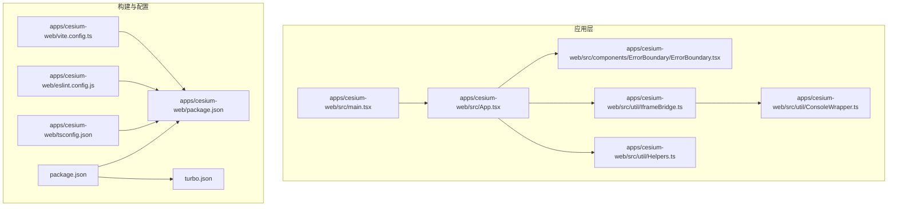
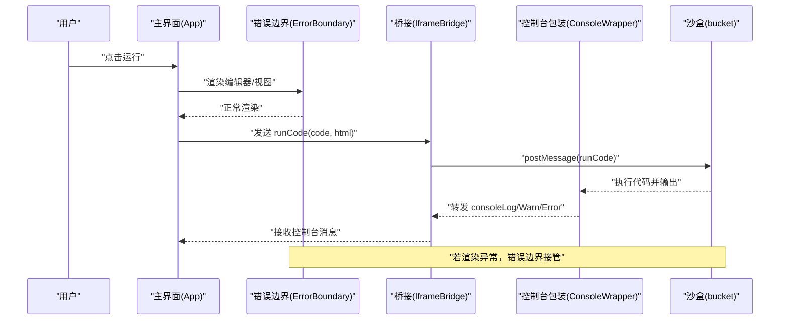
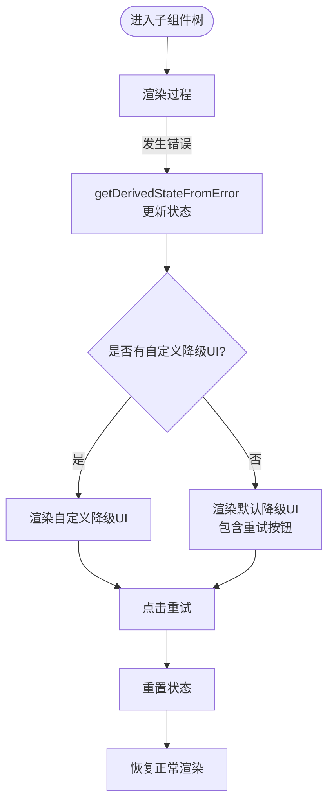
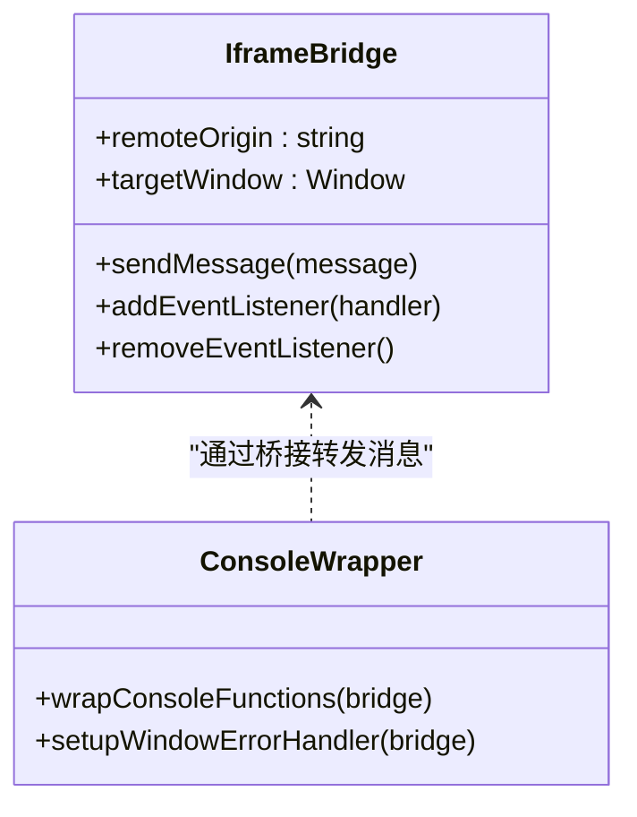
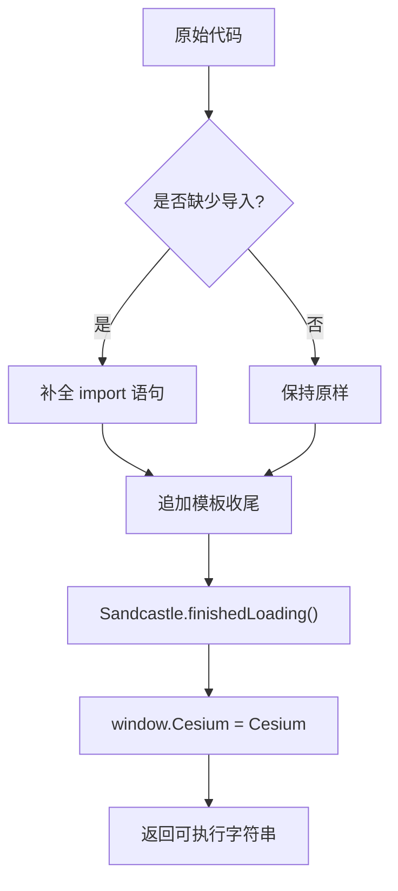
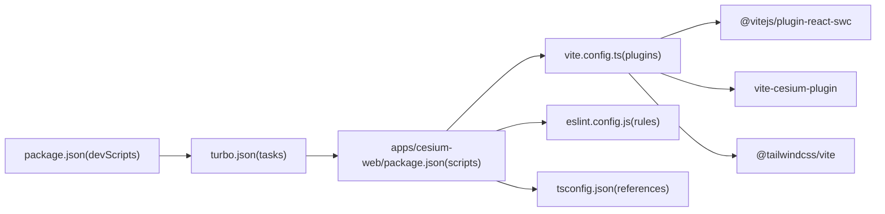

# 故障排除

<cite>
**本文引用的文件**
- [apps/cesium-web/package.json](file://apps/cesium-web/package.json)
- [apps/cesium-web/vite.config.ts](file://apps/cesium-web/vite.config.ts)
- [apps/cesium-web/README.md](file://apps/cesium-web/README.md)
- [apps/cesium-web/eslint.config.js](file://apps/cesium-web/eslint.config.js)
- [apps/cesium-web/tsconfig.json](file://apps/cesium-web/tsconfig.json)
- [apps/cesium-web/src/App.tsx](file://apps/cesium-web/src/App.tsx)
- [apps/cesium-web/src/main.tsx](file://apps/cesium-web/src/main.tsx)
- [apps/cesium-web/scripts/server.js](file://apps/cesium-web/scripts/server.js)
- [apps/cesium-web/src/components/ErrorBoundary/ErrorBoundary.tsx](file://apps/cesium-web/src/components/ErrorBoundary/ErrorBoundary.tsx)
- [apps/cesium-web/src/util/ConsoleWrapper.ts](file://apps/cesium-web/src/util/ConsoleWrapper.ts)
- [apps/cesium-web/src/util/IframeBridge.ts](file://apps/cesium-web/src/util/IframeBridge.ts)
- [apps/cesium-web/src/util/Helpers.ts](file://apps/cesium-web/src/util/Helpers.ts)
- [package.json](file://package.json)
- [turbo.json](file://turbo.json)
</cite>

## 目录

1. [简介](#简介)
2. [项目结构](#项目结构)
3. [核心组件](#核心组件)
4. [架构总览](#架构总览)
5. [详细组件分析](#详细组件分析)
6. [依赖分析](#依赖分析)
7. [性能考虑](#性能考虑)
8. [故障排除指南](#故障排除指南)
9. [结论](#结论)
10. [附录](#附录)

## 简介

本指南面向使用与开发 Cesium 扩展示例应用的开发者，聚焦于常见构建错误、运行时异常、性能问题与调试技巧。文档基于仓库中的实际配置与实现，提供可操作的诊断步骤、修复建议与最佳实践，帮助不同经验水平的开发者快速定位并解决问题。

## 项目结构

该仓库采用多包工作区（monorepo）组织，核心应用位于 apps/cesium-web，包含 Vite + React + TypeScript 的前端工程，以及与 Cesium 相关的工具与组件。关键特性包括：

- 使用 Vite 作为构建与开发服务器，集成 React-SWC 插件与 TailwindCSS 支持
- 通过自研 vite-cesium-plugin 优化 Cesium 资源加载
- 使用错误边界组件隔离渲染错误，避免整页崩溃
- 通过 IframeBridge 实现沙盒（bucket）与父窗口之间的类型安全消息传递
- 通过 ConsoleWrapper 将沙盒内的控制台输出映射到父窗口控制台
- 通过 Helpers 提供代码模板嵌入、URL 压缩存档等实用能力

图表来源

- [apps/cesium-web/src/main.tsx:1-19](file://apps/cesium-web/src/main.tsx#L1-L19)
- [apps/cesium-web/src/App.tsx:1-149](file://apps/cesium-web/src/App.tsx#L1-L149)
- [apps/cesium-web/src/components/ErrorBoundary/ErrorBoundary.tsx:1-130](file://apps/cesium-web/src/components/ErrorBoundary/ErrorBoundary.tsx#L1-L130)
- [apps/cesium-web/src/util/IframeBridge.ts:1-183](file://apps/cesium-web/src/util/IframeBridge.ts#L1-L183)
- [apps/cesium-web/src/util/ConsoleWrapper.ts:1-296](file://apps/cesium-web/src/util/ConsoleWrapper.ts#L1-L296)
- [apps/cesium-web/src/util/Helpers.ts:1-137](file://apps/cesium-web/src/util/Helpers.ts#L1-L137)
- [apps/cesium-web/vite.config.ts:1-81](file://apps/cesium-web/vite.config.ts#L1-L81)
- [apps/cesium-web/eslint.config.js:1-37](file://apps/cesium-web/eslint.config.js#L1-L37)
- [apps/cesium-web/tsconfig.json:1-12](file://apps/cesium-web/tsconfig.json#L1-L12)
- [apps/cesium-web/package.json:1-51](file://apps/cesium-web/package.json#L1-L51)
- [package.json:1-35](file://package.json#L1-L35)
- [turbo.json:1-16](file://turbo.json#L1-L16)

章节来源

- [apps/cesium-web/package.json:1-51](file://apps/cesium-web/package.json#L1-L51)
- [apps/cesium-web/vite.config.ts:1-81](file://apps/cesium-web/vite.config.ts#L1-L81)
- [apps/cesium-web/README.md:1-74](file://apps/cesium-web/README.md#L1-L74)
- [apps/cesium-web/eslint.config.js:1-37](file://apps/cesium-web/eslint.config.js#L1-L37)
- [apps/cesium-web/tsconfig.json:1-12](file://apps/cesium-web/tsconfig.json#L1-L12)
- [package.json:1-35](file://package.json#L1-L35)
- [turbo.json:1-16](file://turbo.json#L1-L16)

## 核心组件

- 应用入口与主题提供者：负责初始化插件、挂载根组件与主题上下文
- 主界面容器：组织左侧导航、中间编辑器/画廊、右侧视图与控制台区域
- 错误边界：捕获子树渲染错误，提供降级 UI 与重试机制
- 桥接工具：在父窗口与沙盒 iframe 间进行类型安全的消息传递
- 控制台包装：拦截并转发沙盒内 console 输出到父窗口
- 辅助工具：代码模板嵌入、URL 压缩存档、行号提取等

章节来源

- [apps/cesium-web/src/main.tsx:1-19](file://apps/cesium-web/src/main.tsx#L1-L19)
- [apps/cesium-web/src/App.tsx:1-149](file://apps/cesium-web/src/App.tsx#L1-L149)
- [apps/cesium-web/src/components/ErrorBoundary/ErrorBoundary.tsx:1-130](file://apps/cesium-web/src/components/ErrorBoundary/ErrorBoundary.tsx#L1-L130)
- [apps/cesium-web/src/util/IframeBridge.ts:1-183](file://apps/cesium-web/src/util/IframeBridge.ts#L1-L183)
- [apps/cesium-web/src/util/ConsoleWrapper.ts:1-296](file://apps/cesium-web/src/util/ConsoleWrapper.ts#L1-L296)
- [apps/cesium-web/src/util/Helpers.ts:1-137](file://apps/cesium-web/src/util/Helpers.ts#L1-L137)

## 架构总览

应用采用“父窗口 + 沙盒 iframe”的双层架构，通过 IframeBridge 实现类型安全通信；错误边界包裹关键区域，避免单点故障；Vite 负责开发与构建，TailwindCSS 提供样式基础，ESLint 与 TypeScript 提供静态质量保障。

图表来源

- [apps/cesium-web/src/App.tsx:72-141](file://apps/cesium-web/src/App.tsx#L72-L141)
- [apps/cesium-web/src/components/ErrorBoundary/ErrorBoundary.tsx:50-123](file://apps/cesium-web/src/components/ErrorBoundary/ErrorBoundary.tsx#L50-L123)
- [apps/cesium-web/src/util/IframeBridge.ts:78-182](file://apps/cesium-web/src/util/IframeBridge.ts#L78-L182)
- [apps/cesium-web/src/util/ConsoleWrapper.ts:254-295](file://apps/cesium-web/src/util/ConsoleWrapper.ts#L254-L295)

## 详细组件分析

### 错误边界组件

- 职责：捕获子组件树渲染阶段、生命周期与构造函数中的错误，展示降级 UI 并提供重试
- 关键点：无法捕获事件处理器、异步代码、服务端渲染错误；错误信息会打印到控制台
- 适用场景：编辑器、视图区域、控制台等易出错模块

图表来源

- [apps/cesium-web/src/components/ErrorBoundary/ErrorBoundary.tsx:50-123](file://apps/cesium-web/src/components/ErrorBoundary/ErrorBoundary.tsx#L50-L123)

章节来源

- [apps/cesium-web/src/components/ErrorBoundary/ErrorBoundary.tsx:1-130](file://apps/cesium-web/src/components/ErrorBoundary/ErrorBoundary.tsx#L1-L130)

### 桥接与控制台包装

- IframeBridge：统一消息信封、来源校验、类型安全、防自监听回环
- ConsoleWrapper：拦截 console 方法与 window.error，将消息通过桥接转发至父窗口
- 行号提取：从错误栈或消息中提取沙盒内行号，辅助定位

图表来源

- [apps/cesium-web/src/util/IframeBridge.ts:78-182](file://apps/cesium-web/src/util/IframeBridge.ts#L78-L182)
- [apps/cesium-web/src/util/ConsoleWrapper.ts:254-295](file://apps/cesium-web/src/util/ConsoleWrapper.ts#L254-L295)

章节来源

- [apps/cesium-web/src/util/IframeBridge.ts:1-183](file://apps/cesium-web/src/util/IframeBridge.ts#L1-L183)
- [apps/cesium-web/src/util/ConsoleWrapper.ts:1-296](file://apps/cesium-web/src/util/ConsoleWrapper.ts#L1-L296)

### 辅助工具与模板嵌入

- 模板嵌入：自动补齐 Cesium 与 Sandcastle 导入，注入加载完成回调与全局挂载
- URL 压缩存档：对 [code, html] 进行裁剪、DEFLATE 压缩与 Base64 编码，支持历史字段兼容提示

图表来源

- [apps/cesium-web/src/util/Helpers.ts:18-36](file://apps/cesium-web/src/util/Helpers.ts#L18-L36)

章节来源

- [apps/cesium-web/src/util/Helpers.ts:1-137](file://apps/cesium-web/src/util/Helpers.ts#L1-L137)

## 依赖分析

- 应用层依赖：React、Cesium、Monaco Editor、TailwindCSS、SWC/ESLint 等
- 构建链路：Vite → React-SWC → TailwindCSS → vite-cesium-plugin → Rollup/Terser
- 工作区脚本：Turbo 管理 dev/build/lint，husky/lint-staged 保证提交质量

图表来源

- [package.json:5-11](file://package.json#L5-L11)
- [turbo.json:3-13](file://turbo.json#L3-L13)
- [apps/cesium-web/package.json:6-11](file://apps/cesium-web/package.json#L6-L11)
- [apps/cesium-web/vite.config.ts:3-10](file://apps/cesium-web/vite.config.ts#L3-L10)
- [apps/cesium-web/eslint.config.js:8-36](file://apps/cesium-web/eslint.config.js#L8-L36)
- [apps/cesium-web/tsconfig.json:9-11](file://apps/cesium-web/tsconfig.json#L9-L11)

章节来源

- [package.json:1-35](file://package.json#L1-L35)
- [turbo.json:1-16](file://turbo.json#L1-L16)
- [apps/cesium-web/package.json:1-51](file://apps/cesium-web/package.json#L1-L51)
- [apps/cesium-web/vite.config.ts:1-81](file://apps/cesium-web/vite.config.ts#L1-L81)
- [apps/cesium-web/eslint.config.js:1-37](file://apps/cesium-web/eslint.config.js#L1-L37)
- [apps/cesium-web/tsconfig.json:1-12](file://apps/cesium-web/tsconfig.json#L1-L12)

## 性能考虑

- 构建优化：启用 Terser 压缩、移除 console/debugger、消除大体积警告阈值
- 资源命名：区分 media/img/fonts，便于缓存与 CDN 管理
- 代码分割：Rollup 输出策略确保入口与 chunk 文件名稳定
- 开发体验：host 公网访问、自动打开浏览器、禁用缓存的 dev 任务

章节来源

- [apps/cesium-web/vite.config.ts:24-79](file://apps/cesium-web/vite.config.ts#L24-L79)

## 故障排除指南

### 一、构建与环境问题

- 症状：安装失败或依赖不一致
  - 检查 Node/PNPM 版本要求与 engines 配置
  - 使用 pnpm 安装，避免 npm/yarn 的解析差异
- 症状：Vite 启动报错或端口占用
  - 查看 server.host 与 open 配置，确认网络访问权限
  - 确认 scripts/server.js 逻辑与 dev 脚本组合是否正确
- 症状：Cesium 资源加载失败
  - 确认 vite-cesium-plugin 已正确注册
  - 检查构建输出目录与资源路径映射

章节来源

- [package.json:28-33](file://package.json#L28-L33)
- [apps/cesium-web/package.json:6-11](file://apps/cesium-web/package.json#L6-L11)
- [apps/cesium-web/vite.config.ts:9-22](file://apps/cesium-web/vite.config.ts#L9-L22)
- [apps/cesium-web/scripts/server.js:1-4](file://apps/cesium-web/scripts/server.js#L1-L4)

### 二、运行时异常与沙盒交互

- 症状：页面空白或整页崩溃
  - 检查 ErrorBoundary 是否包裹关键区域
  - 查看控制台错误堆栈，定位具体组件
- 症状：沙盒内报错但无高亮
  - 确认 ConsoleWrapper 是否正确拦截 window.error 与 console 方法
  - 检查 IframeBridge 的 remoteOrigin 与 addEventListener 是否生效
- 症状：控制台输出缺失或乱序
  - 确认 wrapConsoleFunctions 已在沙盒初始化时调用
  - 检查消息信封 id 与来源校验是否被第三方 postMessage 干扰

章节来源

- [apps/cesium-web/src/components/ErrorBoundary/ErrorBoundary.tsx:50-123](file://apps/cesium-web/src/components/ErrorBoundary/ErrorBoundary.tsx#L50-L123)
- [apps/cesium-web/src/util/ConsoleWrapper.ts:254-295](file://apps/cesium-web/src/util/ConsoleWrapper.ts#L254-L295)
- [apps/cesium-web/src/util/IframeBridge.ts:149-169](file://apps/cesium-web/src/util/IframeBridge.ts#L149-L169)

### 三、调试技巧与工具使用

- 浏览器开发者工具
  - Elements：检查 DOM 结构与样式
  - Console：查看错误与日志；注意区分父窗口与沙盒控制台
  - Sources：断点调试；关注沙盒内行号映射
  - Network：检查资源加载与缓存策略
- Cesium Inspector
  - 在沙盒 Viewer 中启用 Inspector，观察帧率、几何体、材质与相机状态
  - 结合控制台输出定位渲染瓶颈
- 性能分析
  - 使用 Performance 面板录制交互，识别长任务与重排
  - 关注资源体积与加载时间，结合构建配置优化

### 四、代码质量与静态分析

- ESLint
  - 使用推荐规则集与 React/TypeScript 规则
  - 关闭仅刷新相关限制，避免误报
  - 通过 lint 脚本与 lint-staged 在提交前自动修复
- TypeScript
  - 使用项目引用（references）提升编译性能
  - 在 tsconfig 中配置路径别名与 baseUrl
- Prettier
  - 统一格式化风格，减少代码审查分歧

章节来源

- [apps/cesium-web/eslint.config.js:8-36](file://apps/cesium-web/eslint.config.js#L8-L36)
- [apps/cesium-web/tsconfig.json:2-6](file://apps/cesium-web/tsconfig.json#L2-L6)
- [apps/cesium-web/tsconfig.json:9-11](file://apps/cesium-web/tsconfig.json#L9-L11)
- [package.json:13-20](file://package.json#L13-L20)

### 五、环境配置诊断

- Node 版本与包管理器
  - 确认满足 engines 要求，优先使用 pnpm
- 工作区与 Turbo
  - dev/build/lint 通过 Turbo 并行调度，检查 tasks 配置
  - 确保依赖前置构建顺序（dependsOn）
- 开发服务器
  - host: "0.0.0.0" 允许局域网访问
  - open: true 自动打开浏览器
- 资源与别名
  - @ 路径别名在 tsconfig 与 Vite 中保持一致

章节来源

- [package.json:29-33](file://package.json#L29-L33)
- [turbo.json:3-13](file://turbo.json#L3-L13)
- [apps/cesium-web/vite.config.ts:11-15](file://apps/cesium-web/vite.config.ts#L11-L15)
- [apps/cesium-web/tsconfig.json:2-6](file://apps/cesium-web/tsconfig.json#L2-L6)

### 六、不同经验水平的策略

- 新手
  - 严格遵循脚本命令与默认配置，先跑通 dev/build
  - 使用内置错误边界与控制台包装，优先查看父窗口控制台
- 中级
  - 自定义 ESLint/TS 配置，启用更严格的规则
  - 分析构建产物与资源体积，优化加载策略
- 高级
  - 深入理解 IframeBridge 与沙盒通信机制
  - 结合 Cesium Inspector 与性能面板进行系统级优化

### 七、问题反馈与社区支持

- 提交 Issue 时请包含：
  - Node/pnpm/Vite 版本与操作系统
  - 复现步骤与最小可复现代码片段
  - 控制台截图与网络面板记录
  - 构建产物与资源加载情况
- 社区渠道
  - GitHub Issues：用于缺陷与功能请求
  - 讨论区：针对使用问题与最佳实践交流

## 结论

通过本指南，开发者可以系统地定位与解决构建、运行与性能问题，掌握调试工具与静态分析方法，并依据经验水平采取相应的排查策略。建议在日常开发中持续关注控制台输出、错误边界行为与资源加载状态，配合 ESLint/TS 与 Turbo 工作流，确保代码质量与交付效率。

## 附录

### 常见错误信息与含义

- “无法解析模块”或“找不到模块”
  - 检查 tsconfig 路径别名与 Vite 别名是否一致
  - 确认依赖已安装且版本兼容
- “Cesium 未定义”或“Viewer 未找到”
  - 确认模板嵌入逻辑已注入导入与挂载
  - 检查沙盒初始化顺序与加载回调
- “跨域消息被忽略”
  - 确认 IframeBridge 的 remoteOrigin 与目标窗口来源一致
  - 避免第三方 postMessage 干扰，使用沙盒桥接信封

### 快速检查清单

- 环境：Node/PNPM 版本满足要求
- 依赖：使用 pnpm 安装，无悬挂依赖
- 构建：dev 成功、build 无严重警告
- 运行：错误边界生效、控制台输出正常
- 调试：Inspector 启用、性能面板可用
- 质量：ESLint 通过、TS 编译无错误
