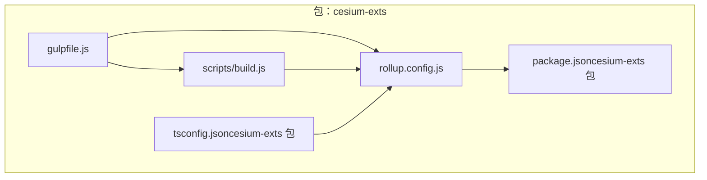
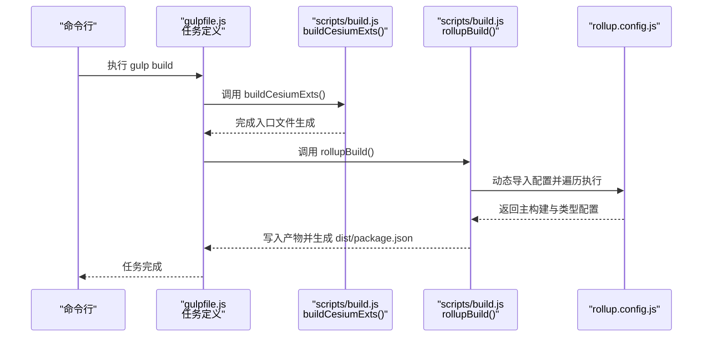
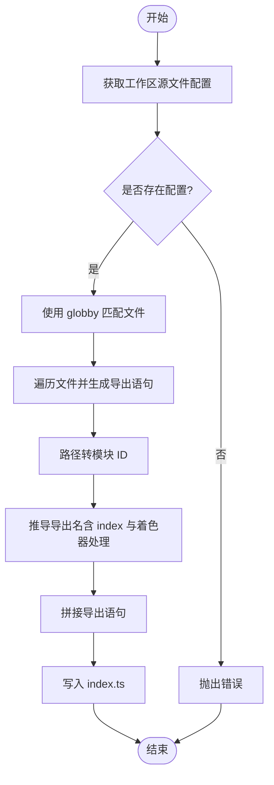
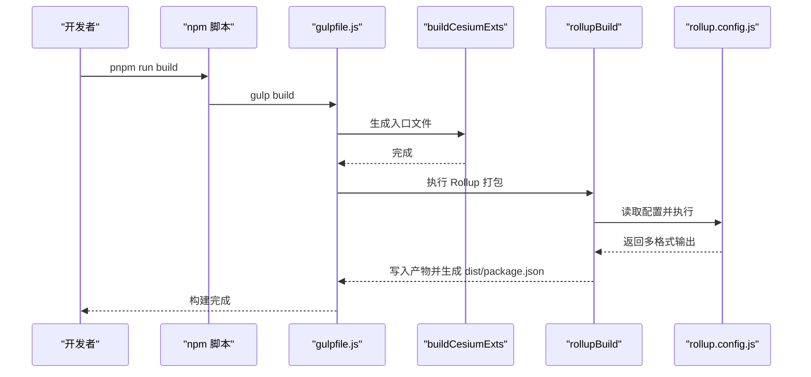
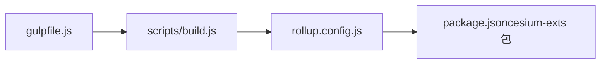

# Gulp 构建任务

<cite>
**本文引用的文件**
- [gulpfile.js](file://packages/cesium-exts/gulpfile.js)
- [build.js](file://packages/cesium-exts/scripts/build.js)
- [rollup.config.js](file://packages/cesium-exts/rollup.config.js)
- [package.json（cesium-exts 包）](file://packages/cesium-exts/package.json)
- [package.json（根项目）](file://package.json)
- [tsconfig.json（cesium-exts 包）](file://packages/cesium-exts/tsconfig.json)
</cite>

## 目录

1. [简介](#简介)
2. [项目结构](#项目结构)
3. [核心组件](#核心组件)
4. [架构总览](#架构总览)
5. [详细组件分析](#详细组件分析)
6. [依赖分析](#依赖分析)
7. [性能考虑](#性能考虑)
8. [故障排查指南](#故障排查指南)
9. [结论](#结论)
10. [附录](#附录)

## 简介

本文件面向 Gulp 构建任务的使用者与维护者，系统化梳理 gulpfile.js 中的任务定义与执行流程，重点解释以下内容：

- buildCesiumExts 与 rollupBuild 两个核心构建步骤的作用与执行顺序
- series 任务编排模式的使用方式与任务依赖关系
- 构建任务的参数配置、错误处理与日志输出
- 如何扩展与自定义构建流程（新增构建步骤、修改现有流程）
- 调试技巧与常见问题解决方案

## 项目结构

本仓库采用 monorepo 结构，构建相关的核心文件位于 packages/cesium-exts 目录内：

- gulpfile.js：Gulp 入口文件，定义具名任务与任务编排
- scripts/build.js：构建逻辑实现，包含入口文件生成与 Rollup 打包
- rollup.config.js：Rollup 打包配置，定义多格式输出与插件链
- package.json（cesium-exts 包）：声明构建脚本与依赖
- tsconfig.json（cesium-exts 包）：TypeScript 编译配置，影响打包产物质量与兼容性

图表来源

- [gulpfile.js:1-16](file://packages/cesium-exts/gulpfile.js#L1-L16)
- [build.js:1-187](file://packages/cesium-exts/scripts/build.js#L1-L187)
- [rollup.config.js:1-123](file://packages/cesium-exts/rollup.config.js#L1-L123)
- [package.json（cesium-exts 包）:1-48](file://packages/cesium-exts/package.json#L1-L48)
- [tsconfig.json（cesium-exts 包）:1-51](file://packages/cesium-exts/tsconfig.json#L1-L51)

章节来源

- [gulpfile.js:1-16](file://packages/cesium-exts/gulpfile.js#L1-L16)
- [package.json（cesium-exts 包）:1-48](file://packages/cesium-exts/package.json#L1-L48)

## 核心组件

- gulpfile.js
  - 导入 Gulp 的 series 编排器与构建函数
  - 定义异步任务 buildJs：先调用 buildCesiumExts，再调用 rollupBuild
  - 导出具名任务 build，使用 series 编排上述流程
- scripts/build.js
  - buildCesiumExts：为 engine 工作区生成统一入口文件 index.ts
  - rollupBuild：切换工作目录至项目根，动态导入 rollup.config.js，逐条执行配置并并行写入输出，最后生成 dist/package.json
  - createIndexJs：根据 glob 模式匹配源文件，生成导出语句并写入 index.ts
  - generateDistPackageJson：生成发布用的 dist/package.json
- rollup.config.js
  - 定义 external 外部依赖集合
  - 基础插件链：typescript、terser、resolve、json、commonjs
  - 主构建配置：ESM/CJS/UMD 三格式输出
  - 类型声明配置：rollup-plugin-dts 生成 .d.ts
- package.json（cesium-exts 包）
  - scripts.build 指向 gulp build
  - 声明构建所需依赖（gulp、rollup 及其插件）
- tsconfig.json（cesium-exts 包）
  - 影响 TypeScript 编译目标、模块解析策略等，间接影响 Rollup 打包结果

章节来源

- [gulpfile.js:1-16](file://packages/cesium-exts/gulpfile.js#L1-L16)
- [build.js:27-63](file://packages/cesium-exts/scripts/build.js#L27-L63)
- [rollup.config.js:17-122](file://packages/cesium-exts/rollup.config.js#L17-L122)
- [package.json（cesium-exts 包）:16-46](file://packages/cesium-exts/package.json#L16-L46)
- [tsconfig.json（cesium-exts 包）:1-51](file://packages/cesium-exts/tsconfig.json#L1-L51)

## 架构总览

下图展示了从 Gulp 任务到具体构建步骤的端到端流程：

图表来源

- [gulpfile.js:7-15](file://packages/cesium-exts/gulpfile.js#L7-L15)
- [build.js:27-63](file://packages/cesium-exts/scripts/build.js#L27-L63)
- [rollup.config.js:118-122](file://packages/cesium-exts/rollup.config.js#L118-L122)

## 详细组件分析

### 任务编排与依赖：series 模式

- gulpfile.js 使用 series 将 buildJs 串行化，确保 buildCesiumExts 先于 rollupBuild 执行
- 优点
  - 明确的执行顺序，避免并发竞争
  - 便于扩展：可在 buildJs 中插入更多步骤
- 注意事项
  - 所有步骤均为异步，需正确 await
  - 若后续步骤依赖前序步骤的输出（如入口文件），应保证顺序与完整性

章节来源

- [gulpfile.js:2-15](file://packages/cesium-exts/gulpfile.js#L2-L15)

### 核心构建步骤一：buildCesiumExts

- 作用
  - 为 engine 工作区生成统一入口文件 index.ts
  - 基于 workspaceSourceFiles 中的 glob 模式匹配源文件，生成导出语句并写入 index.ts
- 关键行为
  - 使用 globby 匹配文件
  - 将文件路径转换为模块 ID
  - 根据路径规则推断导出名（含 index 与着色器文件的特殊处理）
  - 写入 index.ts
- 错误处理
  - 若工作区配置缺失，直接抛错
- 日志输出
  - 通过 generateDistPackageJson 输出生成提示

章节来源

- [build.js:27-29](file://packages/cesium-exts/scripts/build.js#L27-L29)
- [build.js:73-133](file://packages/cesium-exts/scripts/build.js#L73-L133)

### 核心构建步骤二：rollupBuild

- 作用
  - 切换工作目录至项目根，动态导入 rollup.config.js
  - 遍历配置数组，逐条执行 rollup 并行写入所有输出
  - 最终生成 dist/package.json
- 关键行为
  - process.chdir(projectRoot) 确保配置解析路径正确
  - 动态 import("../rollup.config.js")，使路径解析基于根目录
  - 统一处理单/多输出配置，使用 Promise.all 并行写入
  - finally 中关闭 bundle，释放资源
- 错误处理
  - 捕获打包异常并打印带输入项的错误信息，随后抛出
- 日志输出
  - 生成 dist/package.json 时输出提示

章节来源

- [build.js:35-63](file://packages/cesium-exts/scripts/build.js#L35-L63)

### Rollup 配置：rollup.config.js

- 外部依赖 external
  - 包含 peerDependencies 与 devDependencies，避免将这些依赖打入产物
- 基础插件链
  - typescript：基于 tsconfig.json 编译
  - terser：压缩与混淆，移除 console 与 debugger，清理注释
  - resolve：解析 node_modules 中的第三方模块
  - json：将 JSON 转为 ES 模块
  - commonjs：转换 CommonJS 为 ES 模块
- 主构建配置（ESM/CJS/UMD）
  - ESM：现代前端生态友好
  - CJS：Node.js 生态友好
  - UMD：浏览器全局变量兼容
- 类型声明配置（dts）
  - 生成 .d.ts 类型声明文件，供发布包使用

章节来源

- [rollup.config.js:17-19](file://packages/cesium-exts/rollup.config.js#L17-L19)
- [rollup.config.js:25-53](file://packages/cesium-exts/rollup.config.js#L25-L53)
- [rollup.config.js:58-94](file://packages/cesium-exts/rollup.config.js#L58-L94)
- [rollup.config.js:100-115](file://packages/cesium-exts/rollup.config.js#L100-L115)
- [rollup.config.js:118-122](file://packages/cesium-exts/rollup.config.js#L118-L122)

### 入口文件生成算法：createIndexJs

图表来源

- [build.js:73-133](file://packages/cesium-exts/scripts/build.js#L73-L133)

章节来源

- [build.js:73-133](file://packages/cesium-exts/scripts/build.js#L73-L133)

### 任务执行序列：从 gulp 到产物

图表来源

- [package.json（cesium-exts 包）:16-18](file://packages/cesium-exts/package.json#L16-L18)
- [gulpfile.js:7-15](file://packages/cesium-exts/gulpfile.js#L7-L15)
- [build.js:27-63](file://packages/cesium-exts/scripts/build.js#L27-L63)
- [rollup.config.js:118-122](file://packages/cesium-exts/rollup.config.js#L118-L122)

## 依赖分析

- 任务耦合与内聚
  - gulpfile.js 仅承担任务编排职责，内聚度高
  - buildCesiumExts 与 rollupBuild 分别负责“入口生成”和“打包”，职责清晰
- 直接与间接依赖
  - gulpfile.js 直接依赖 scripts/build.js
  - scripts/build.js 直接依赖 rollup.config.js
  - rollup.config.js 依赖 package.json 中的 peerDependencies 与 devDependencies，决定 external
- 外部依赖与集成点
  - gulp、rollup 及其插件由包管理安装
  - Cesium 作为 peerDependencies，通过 external 控制不被打包

图表来源

- [gulpfile.js:4-4](file://packages/cesium-exts/gulpfile.js#L4-L4)
- [build.js:41-41](file://packages/cesium-exts/scripts/build.js#L41-L41)
- [rollup.config.js:8-8](file://packages/cesium-exts/rollup.config.js#L8-L8)
- [package.json（cesium-exts 包）:27-46](file://packages/cesium-exts/package.json#L27-L46)

章节来源

- [gulpfile.js:4-4](file://packages/cesium-exts/gulpfile.js#L4-L4)
- [build.js:41-41](file://packages/cesium-exts/scripts/build.js#L41-L41)
- [rollup.config.js:17-19](file://packages/cesium-exts/rollup.config.js#L17-L19)
- [package.json（cesium-exts 包）:27-46](file://packages/cesium-exts/package.json#L27-L46)

## 性能考虑

- 并行写入输出
  - rollupBuild 对同一配置的多个输出使用 Promise.all 并行写入，缩短整体耗时
- 资源释放
  - finally 中关闭 bundle，避免内存泄漏
- 压缩与混淆
  - terser 启用压缩、混淆与注释清理，降低产物体积
- 模块解析策略
  - tsconfig.json 使用 bundler 模式，提升与现代打包器的兼容性与性能

章节来源

- [build.js:50-58](file://packages/cesium-exts/scripts/build.js#L50-L58)
- [rollup.config.js:33-43](file://packages/cesium-exts/rollup.config.js#L33-L43)
- [tsconfig.json（cesium-exts 包）:35-35](file://packages/cesium-exts/tsconfig.json#L35-L35)

## 故障排查指南

- 构建失败定位
  - rollupBuild 捕获打包异常并打印带输入项的错误信息，优先查看该错误日志
- 入口文件生成失败
  - 若工作区配置缺失，将抛出错误；检查 workspaceSourceFiles 中的键名与 glob 模式
- 路径解析问题
  - 确保 rollup.config.js 的路径解析基于项目根目录（已通过 process.chdir 与动态 import 实现）
- 外部依赖未生效
  - 检查 package.json 的 peerDependencies 与 devDependencies 是否正确声明
- 产物缺失或不完整
  - 确认 rollup.config.js 的输出配置与插件链是否满足需求
- 调试建议
  - 在 gulpfile.js 中临时开启详细日志
  - 逐步注释 buildJs 中的步骤，缩小问题范围
  - 使用最小化示例验证 rollup.config.js 的某一条配置

章节来源

- [build.js:52-54](file://packages/cesium-exts/scripts/build.js#L52-L54)
- [build.js:77-80](file://packages/cesium-exts/scripts/build.js#L77-L80)
- [rollup.config.js:17-19](file://packages/cesium-exts/rollup.config.js#L17-L19)

## 结论

本构建系统通过 gulpfile.js 的 series 编排，将“生成入口文件”与“Rollup 打包”两大步骤串联，配合 scripts/build.js 的入口生成与打包逻辑，以及 rollup.config.js 的多格式输出与插件链，形成一套清晰、可扩展且具备良好性能的构建流程。通过合理的错误处理与日志输出，能够快速定位问题并保障构建稳定性。

## 附录

### 任务扩展与自定义指南

- 新增构建步骤
  - 在 gulpfile.js 的 buildJs 中追加异步步骤，并确保 await
  - 若步骤依赖入口文件，将其置于 buildCesiumExts 之后
- 修改现有流程
  - 调整 buildJs 的顺序以改变执行先后
  - 在 scripts/build.js 中扩展 createIndexJs 或 rollupBuild 的逻辑
- 参数配置
  - 入口文件生成：调整 workspaceSourceFiles 中的 glob 模式
  - 打包配置：在 rollup.config.js 中增删插件或调整输出格式
  - TypeScript 行为：在 tsconfig.json 中调整编译选项

章节来源

- [gulpfile.js:7-15](file://packages/cesium-exts/gulpfile.js#L7-L15)
- [build.js:17-21](file://packages/cesium-exts/scripts/build.js#L17-L21)
- [rollup.config.js:25-53](file://packages/cesium-exts/rollup.config.js#L25-L53)
- [tsconfig.json（cesium-exts 包）:2-48](file://packages/cesium-exts/tsconfig.json#L2-L48)
