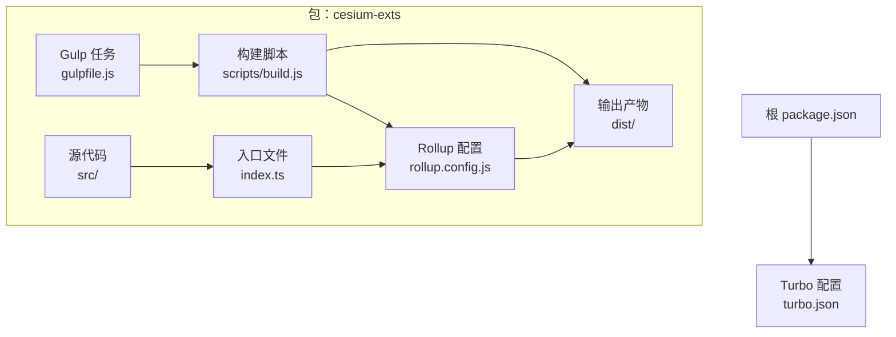
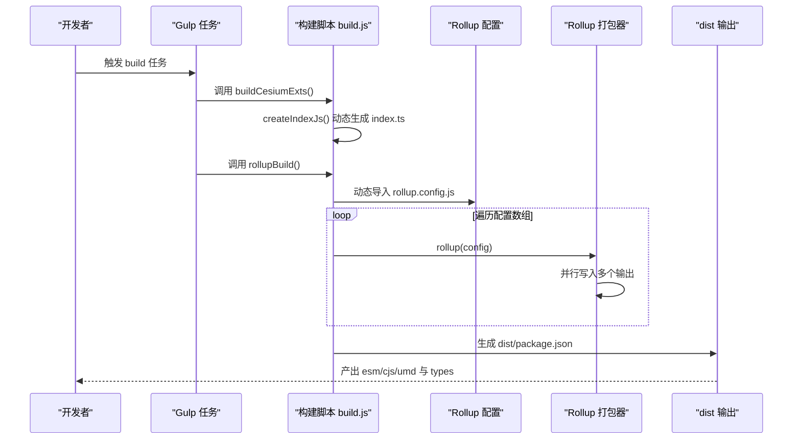
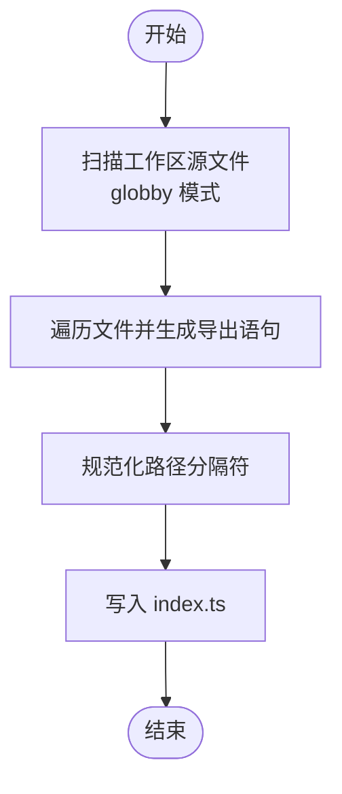
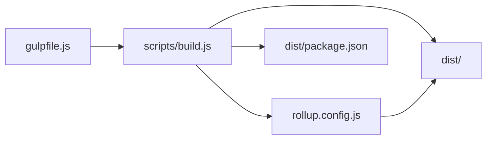

# Rollup 打包配置

<cite>
**本文引用的文件**
- [rollup.config.js](file://packages/cesium-exts/rollup.config.js)
- [build.js](file://packages/cesium-exts/scripts/build.js)
- [gulpfile.js](file://packages/cesium-exts/gulpfile.js)
- [package.json（cesium-exts）](file://packages/cesium-exts/package.json)
- [package.json（根）](file://package.json)
- [index.ts（入口）](file://packages/cesium-exts/index.ts)
- [tsconfig.json](file://packages/cesium-exts/tsconfig.json)
- [turbo.json](file://turbo.json)
- [vite.config.ts（cesium-web）](file://apps/cesium-web/vite.config.ts)
- [cesiumUtils.ts](file://packages/cesium-exts/src/Utils/cesiumUtils.ts)
</cite>

## 目录

1. [简介](#简介)
2. [项目结构](#项目结构)
3. [核心组件](#核心组件)
4. [架构总览](#架构总览)
5. [详细组件分析](#详细组件分析)
6. [依赖关系分析](#依赖关系分析)
7. [性能考量](#性能考量)
8. [故障排查指南](#故障排查指南)
9. [结论](#结论)
10. [附录](#附录)

## 简介

本文件系统性梳理了基于 Rollup 的多格式输出打包方案，覆盖 ESM、CJS、UMD 三类产物的生成策略与差异；阐述入口文件的动态生成机制与模块解析规则；详解插件体系（TypeScript 编译、代码压缩、sourcemap、JSON/ CommonJS/Node 解析、类型声明生成）；并给出优化策略（tree-shaking、代码分割、依赖优化）、externals 配置与第三方依赖处理建议，以及自定义配置的最佳实践。

## 项目结构

本仓库采用 monorepo 结构，Rollup 打包位于独立包内，配合 Gulp 任务链完成入口文件生成与 Rollup 打包，最终产出多格式 JS 与类型声明文件，并生成发布用的 dist/package.json。

图表来源

- [rollup.config.js:1-123](file://packages/cesium-exts/rollup.config.js#L1-L123)
- [build.js:1-187](file://packages/cesium-exts/scripts/build.js#L1-L187)
- [gulpfile.js:1-16](file://packages/cesium-exts/gulpfile.js#L1-L16)
- [package.json（根）:1-35](file://package.json#L1-L35)
- [turbo.json:1-16](file://turbo.json#L1-L16)

章节来源

- [rollup.config.js:1-123](file://packages/cesium-exts/rollup.config.js#L1-L123)
- [build.js:1-187](file://packages/cesium-exts/scripts/build.js#L1-L187)
- [gulpfile.js:1-16](file://packages/cesium-exts/gulpfile.js#L1-L16)
- [package.json（根）:1-35](file://package.json#L1-L35)
- [turbo.json:1-16](file://turbo.json#L1-L16)

## 核心组件

- 多格式输出配置：ESM、CJS、UMD 三类产物，分别面向现代前端生态、Node 生态与浏览器通用场景。
- 动态入口生成：根据工作区源文件集合自动生成 index.ts，保证导出一致性与可维护性。
- 插件体系：TypeScript 编译、Node 解析、CommonJS 转换、JSON 导入、代码压缩、类型声明生成。
- 外部依赖管理：将 peerDependencies、devDependencies 与核心库标记为 external，避免重复打包。
- 发布产物整理：生成 dist/package.json，统一导出字段与文件清单。

章节来源

- [rollup.config.js:58-94](file://packages/cesium-exts/rollup.config.js#L58-L94)
- [rollup.config.js:100-115](file://packages/cesium-exts/rollup.config.js#L100-L115)
- [build.js:27-63](file://packages/cesium-exts/scripts/build.js#L27-L63)
- [build.js:158-186](file://packages/cesium-exts/scripts/build.js#L158-L186)

## 架构总览

下图展示从入口生成到 Rollup 打包再到产物发布的端到端流程。

图表来源

- [gulpfile.js:7-12](file://packages/cesium-exts/gulpfile.js#L7-L12)
- [build.js:27-63](file://packages/cesium-exts/scripts/build.js#L27-L63)
- [rollup.config.js:118-122](file://packages/cesium-exts/rollup.config.js#L118-L122)

## 详细组件分析

### 多格式输出策略与差异

- ESM（现代模块）
  - 适用：现代打包器（Vite/Webpack/Rollup）与支持 ES Module 的运行时。
  - 特点：天然支持 tree-shaking；按需加载；与 TS 模块解析“bundler”模式契合。
  - 产物：./dist/cesium-exts.esm.js。
- CJS（Node 默认）
  - 适用：Node 环境与传统打包器。
  - 特点：exports: auto 自动推断导出模式；与 require 兼容。
  - 产物：./dist/cesium-exts.cjs.js。
- UMD（通用模块）
  - 适用：浏览器直挂全局变量，同时兼容 AMD/CMD/Node。
  - 特点：通过 globals 将外部依赖映射到全局变量；命名空间为 CesiumExts。
  - 产物：./dist/cesium-exts.umd.js。

章节来源

- [rollup.config.js:63-86](file://packages/cesium-exts/rollup.config.js#L63-L86)

### 入口文件动态生成机制

- 工作区源文件集合：通过 glob 模式匹配 src/Utils 与 src/modules 下的模块入口。
- 文件扫描与导出生成：遍历匹配结果，将每个模块映射为 export 语句，自动推导导出别名。
- 路径规范化：统一 Windows 风格路径为 Unix 风格，确保模块 ID 一致。
- 写入入口：将生成的导出语句写入 index.ts，供 Rollup 作为单一输入。

图表来源

- [build.js:73-133](file://packages/cesium-exts/scripts/build.js#L73-L133)
- [build.js:151-153](file://packages/cesium-exts/scripts/build.js#L151-L153)

章节来源

- [build.js:17-21](file://packages/cesium-exts/scripts/build.js#L17-L21)
- [build.js:73-133](file://packages/cesium-exts/scripts/build.js#L73-L133)
- [index.ts:1-4](file://packages/cesium-exts/index.ts#L1-L4)

### 模块解析规则与外部依赖

- external 列表由三部分组成：
  - 核心库：cesium。
  - peerDependencies：随包声明的对等依赖。
  - devDependencies：开发期依赖（避免打入产物）。
- UMD 全局映射：将 cesium 映射到浏览器全局 Cesium。
- Node 解析与 CommonJS：通过 @rollup/plugin-node-resolve 与 @rollup/plugin-commonjs 协同，确保第三方模块与 CJS 能被正确解析与转换。

章节来源

- [rollup.config.js:17-19](file://packages/cesium-exts/rollup.config.js#L17-L19)
- [rollup.config.js:83-85](file://packages/cesium-exts/rollup.config.js#L83-L85)
- [rollup.config.js:46-53](file://packages/cesium-exts/rollup.config.js#L46-L53)

### 插件系统与构建管线

- TypeScript 编译：@rollup/plugin-typescript，使用 tsconfig.json 控制编译目标、严格性与模块解析策略。
- 代码压缩：@rollup/plugin-terser，开启 drop_console、drop_debugger、mangle 与注释移除。
- Node 解析：@rollup/plugin-node-resolve，支持 bundler 模式解析。
- CommonJS 转换：@rollup/plugin-commonjs，使 CJS 模块可被 Rollup 处理。
- JSON 导入：@rollup/plugin-json，将 JSON 作为 ES 模块导入。
- 类型声明：rollup-plugin-dts，生成 .d.ts 类型文件。
- sourcemap：当前配置未启用，如需调试可按需开启。

章节来源

- [rollup.config.js:25-53](file://packages/cesium-exts/rollup.config.js#L25-L53)
- [rollup.config.js:100-115](file://packages/cesium-exts/rollup.config.js#L100-L115)
- [tsconfig.json:33-35](file://packages/cesium-exts/tsconfig.json#L33-L35)

### 类型声明生成与发布准备

- 类型声明：通过 rollup-plugin-dts 生成 types/index.d.ts。
- 发布元数据：生成 dist/package.json，统一 main/module/exports/types/files 字段，声明 peerDependencies 为 cesium。

章节来源

- [rollup.config.js:100-115](file://packages/cesium-exts/rollup.config.js#L100-L115)
- [build.js:158-186](file://packages/cesium-exts/scripts/build.js#L158-L186)

### 与 Vite 的协同（浏览器侧）

- Vite 项目可通过其内置的 Rollup 选项进行代码分割与命名策略定制，与本包的多格式产物形成互补。
- 本包侧重于库打包，Vite 侧重应用打包；两者在 monorepo 中可并行工作。

章节来源

- [vite.config.ts:49-79](file://apps/cesium-web/vite.config.ts#L49-L79)

## 依赖关系分析

- 包装器与任务链
  - gulpfile.js 串联 buildCesiumExts 与 rollupBuild。
  - build.js 动态导入 rollup.config.js，逐条执行配置并并行写入输出。
- 配置与输入
  - rollup.config.js 定义 external、output、plugins 与 dts 配置。
  - index.ts 由 build.js 动态生成，作为 Rollup 输入。
- 发布与导出
  - build.js 生成 dist/package.json，统一导出字段与文件清单。

图表来源

- [gulpfile.js:4-12](file://packages/cesium-exts/gulpfile.js#L4-L12)
- [build.js:35-63](file://packages/cesium-exts/scripts/build.js#L35-L63)
- [rollup.config.js:118-122](file://packages/cesium-exts/rollup.config.js#L118-L122)

章节来源

- [gulpfile.js:1-16](file://packages/cesium-exts/gulpfile.js#L1-L16)
- [build.js:35-63](file://packages/cesium-exts/scripts/build.js#L35-L63)
- [rollup.config.js:118-122](file://packages/cesium-exts/rollup.config.js#L118-L122)

## 性能考量

- tree-shaking
  - 使用 ESM 输出与严格模块解析，最大化摇树效果。
  - 确保导出为具名导出，避免副作用导致的不可摇树。
- 代码压缩
  - 启用 terser 的 drop_console、drop_debugger、mangle 与注释清理，显著降低体积。
- 并行写入
  - 构建脚本对多个输出配置并行写入，缩短整体耗时。
- 模块解析优化
  - 使用 bundler 模式解析，减少 Node 风格解析带来的额外开销。
- sourcemap
  - 当前未启用，如需调试可按需开启；注意对体积与构建时间的影响。

章节来源

- [rollup.config.js:33-43](file://packages/cesium-exts/rollup.config.js#L33-L43)
- [build.js:50-51](file://packages/cesium-exts/scripts/build.js#L50-L51)
- [tsconfig.json:33-35](file://packages/cesium-exts/tsconfig.json#L33-L35)

## 故障排查指南

- 找不到工作区源文件
  - 现象：createIndexJs 抛出“找不到工作区的源文件”错误。
  - 排查：确认 workspaceSourceFiles 中的 glob 模式是否匹配实际文件。
- 导出别名冲突
  - 现象：生成的 index.ts 存在重复导出别名。
  - 排查：检查模块路径与 index 文件命名，必要时调整导出名生成逻辑。
- 外部依赖未生效
  - 现象：打包产物包含 cesium 或其他依赖。
  - 排查：确认 external 列表是否包含对应包名；UMD globals 是否正确映射。
- 压缩后调试困难
  - 现象：运行时报错难以定位。
  - 建议：临时开启 sourcemap 进行定位，上线前再关闭。
- 并行写入失败
  - 现象：某条输出写入报错导致整体失败。
  - 排查：查看具体配置的 input/output/sourcemap 设置，确保路径与权限正确。

章节来源

- [build.js:78-80](file://packages/cesium-exts/scripts/build.js#L78-L80)
- [build.js:52-58](file://packages/cesium-exts/scripts/build.js#L52-L58)
- [rollup.config.js:17-19](file://packages/cesium-exts/rollup.config.js#L17-L19)

## 结论

本打包方案以动态入口生成为核心，结合 Rollup 的多格式输出与完善的插件体系，实现了对现代前端生态（ESM）、Node 生态（CJS）与浏览器通用场景（UMD）的全面覆盖。通过 external 策略与类型声明生成，兼顾了库的可分发性与可维护性。配合并行写入与压缩策略，可在保证质量的同时提升构建效率。

## 附录

### 多格式输出对比表

- ESM
  - 适用：现代打包器与浏览器原生支持
  - 优点：天然 tree-shaking、按需加载
  - 产物：./dist/cesium-exts.esm.js
- CJS
  - 适用：Node 环境与传统打包器
  - 优点：exports: auto 自动推断导出
  - 产物：./dist/cesium-exts.cjs.js
- UMD
  - 适用：浏览器直挂全局变量
  - 优点：兼容多种模块系统
  - 产物：./dist/cesium-exts.umd.js

章节来源

- [rollup.config.js:63-86](file://packages/cesium-exts/rollup.config.js#L63-L86)

### 外部依赖与导出字段

- external：cesium、peerDependencies、devDependencies
- UMD globals：cesium -> Cesium
- 发布导出：main/module/exports/types/files

章节来源

- [rollup.config.js:17-19](file://packages/cesium-exts/rollup.config.js#L17-L19)
- [rollup.config.js:83-85](file://packages/cesium-exts/rollup.config.js#L83-L85)
- [build.js:158-186](file://packages/cesium-exts/scripts/build.js#L158-L186)

### 自定义配置最佳实践

- 选择输出格式
  - 若仅面向现代浏览器与打包器：优先 ESM。
  - 若需 Node 兼容：保留 CJS；如需浏览器直挂：保留 UMD。
- 管理 external
  - 将 peerDependencies 与核心库（如 cesium）加入 external，避免重复打包。
- 插件顺序
  - TypeScript 编译应在 Node 解析与 CommonJS 转换之前，确保模块可被正确识别。
- sourcemap
  - 开发阶段建议开启，生产阶段按需关闭以减少体积。
- 类型声明
  - 使用 rollup-plugin-dts 生成 .d.ts，配合 dist/package.json 的 types 字段。

章节来源

- [rollup.config.js:25-53](file://packages/cesium-exts/rollup.config.js#L25-L53)
- [rollup.config.js:100-115](file://packages/cesium-exts/rollup.config.js#L100-L115)
- [build.js:158-186](file://packages/cesium-exts/scripts/build.js#L158-L186)
