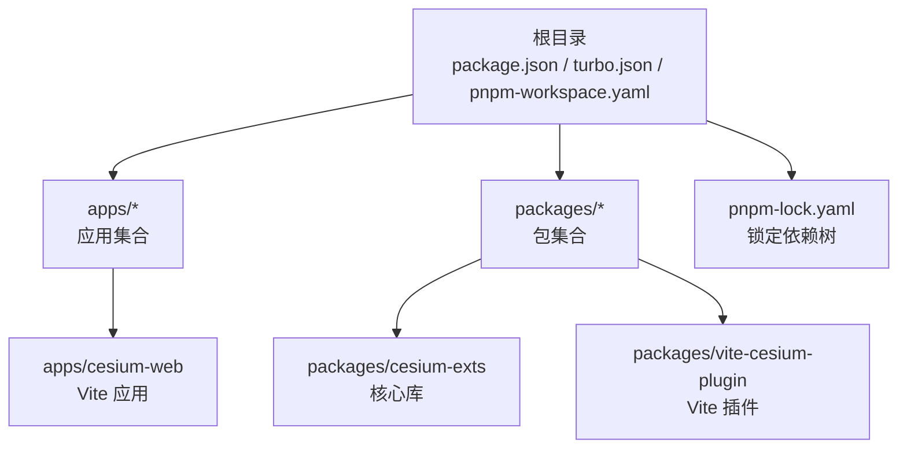
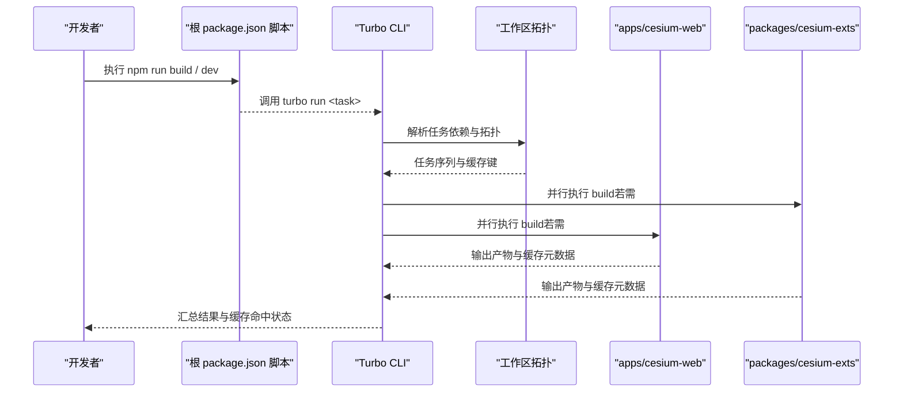
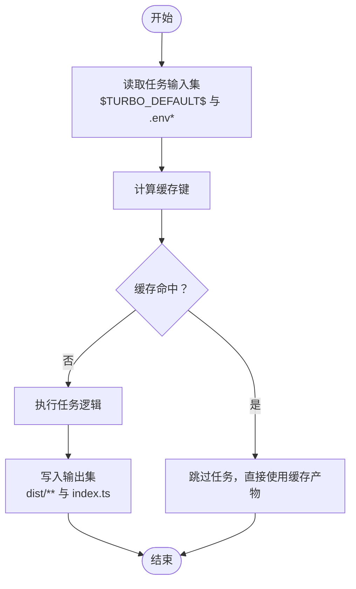
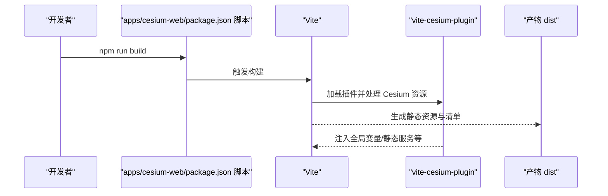
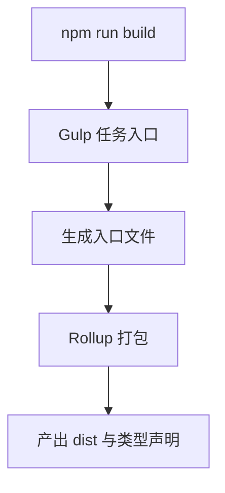
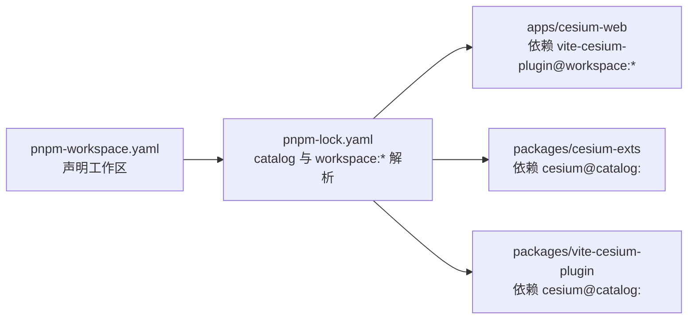
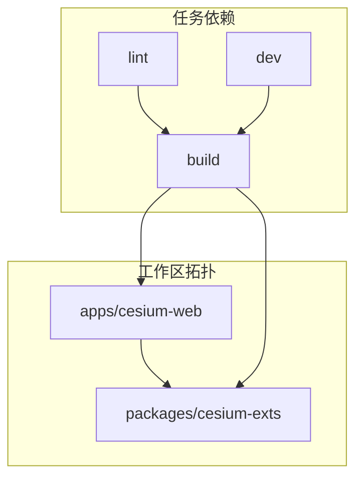

# Turborepo 构建优化

<cite>
**本文引用的文件**
- [turbo.json](file://turbo.json)
- [package.json](file://package.json)
- [pnpm-workspace.yaml](file://pnpm-workspace.yaml)
- [pnpm-lock.yaml](file://pnpm-lock.yaml)
- [apps/cesium-web/package.json](file://apps/cesium-web/package.json)
- [apps/cesium-web/vite.config.ts](file://apps/cesium-web/vite.config.ts)
- [packages/cesium-exts/package.json](file://packages/cesium-exts/package.json)
- [packages/cesium-exts/gulpfile.js](file://packages/cesium-exts/gulpfile.js)
- [packages/vite-cesium-plugin/package.json](file://packages/vite-cesium-plugin/package.json)
</cite>

## 目录

1. [简介](#简介)
2. [项目结构](#项目结构)
3. [核心组件](#核心组件)
4. [架构总览](#架构总览)
5. [详细组件分析](#详细组件分析)
6. [依赖分析](#依赖分析)
7. [性能考量](#性能考量)
8. [故障排查指南](#故障排查指南)
9. [结论](#结论)
10. [附录](#附录)

## 简介

本文件面向 Turborepo 在 monorepo 场景下的构建优化与缓存实践，围绕以下目标展开：

- 解释 monorepo 架构下的构建管理与缓存机制
- 深入说明 turbo.json 中的任务依赖关系与执行顺序优化
- 文档化增量构建的工作原理（变更检测、缓存策略、并行执行）
- 解释 pnpm workspace 的依赖管理与链接策略
- 提供构建性能分析方法（任务执行时间统计与瓶颈识别）
- 给出 CI/CD 集成与缓存持久化配置建议
- 为团队提供构建流程优化与维护指导

## 项目结构

本仓库采用 Turborepo + pnpm workspace 的 monorepo 架构，顶层通过 package.json 管理脚本与工具链，turbo.json 定义任务与缓存规则，pnpm-workspace.yaml 声明工作区范围，各应用与包在 apps 与 packages 下独立维护。

图表来源

- [package.json:1-35](file://package.json#L1-L35)
- [turbo.json:1-16](file://turbo.json#L1-L16)
- [pnpm-workspace.yaml:1-12](file://pnpm-workspace.yaml#L1-L12)

章节来源

- [package.json:1-35](file://package.json#L1-L35)
- [turbo.json:1-16](file://turbo.json#L1-L16)
- [pnpm-workspace.yaml:1-12](file://pnpm-workspace.yaml#L1-L12)

## 核心组件

- 顶层脚本与工具链
  - 通过根目录 package.json 的 scripts 调用 turbo 运行 dev/build/lint 等任务，并统一安装与引擎要求由根 package.json 的 engines 字段约束。
- Turbo 任务与缓存
  - turbo.json 定义 build、lint、dev 三类任务，其中 build 显式声明依赖上游任务（^build），并设置输入/输出以驱动增量构建与缓存命中。
- pnpm workspace 与 catalog
  - pnpm-workspace.yaml 声明工作区范围；pnpm-lock.yaml 展示 catalog 版本解析与 workspace:\* 链接策略。
- 应用与包的构建链路
  - apps/cesium-web 使用 Vite + 自研插件进行前端构建；packages/cesium-exts 使用 Gulp + Rollup 进行核心库打包；packages/vite-cesium-plugin 作为 Vite 插件被应用侧消费。

章节来源

- [package.json:5-12](file://package.json#L5-L12)
- [turbo.json:3-13](file://turbo.json#L3-L13)
- [pnpm-workspace.yaml:1-12](file://pnpm-workspace.yaml#L1-L12)
- [pnpm-lock.yaml:31-200](file://pnpm-lock.yaml#L31-L200)
- [apps/cesium-web/package.json:6-11](file://apps/cesium-web/package.json#L6-L11)
- [packages/cesium-exts/package.json:16-19](file://packages/cesium-exts/package.json#L16-L19)
- [packages/vite-cesium-plugin/package.json:1-40](file://packages/vite-cesium-plugin/package.json#L1-L40)

## 架构总览

下图展示从命令到具体构建任务的端到端流程，以及 Turbo 如何根据任务依赖与缓存规则进行调度与复用。

图表来源

- [package.json:5-12](file://package.json#L5-L12)
- [turbo.json:3-13](file://turbo.json#L3-L13)
- [apps/cesium-web/package.json:6-11](file://apps/cesium-web/package.json#L6-L11)
- [packages/cesium-exts/package.json:16-19](file://packages/cesium-exts/package.json#L16-L19)

## 详细组件分析

### Turbo 任务与缓存策略

- 任务定义
  - build：声明 dependsOn: ["^build"]，确保上游包先于当前包构建；设置 inputs 与 outputs，驱动增量构建与缓存键生成。
  - lint：空定义，继承默认行为。
  - dev：cache=false、persistent=true，避免开发态被缓存，但保持长驻进程以提升热更新体验。
- 增量构建与缓存键
  - 输入集包含 $TURBO_DEFAULT$ 与 .env\*，输出集包含 dist/\*\* 与 index.ts。Turbo 基于输入指纹与缓存存储判断是否跳过任务。
- 并行执行
  - 由于任务间无显式串行依赖，且依赖拓扑允许，Turbo 将尽可能并行执行可安全并行的任务。

图表来源

- [turbo.json:4-8](file://turbo.json#L4-L8)

章节来源

- [turbo.json:3-13](file://turbo.json#L3-L13)

### 应用层构建链路（apps/cesium-web）

- 任务脚本
  - dev：组合本地脚本与 Vite 启动；build：调用 Vite 打包；lint：调用 ESLint。
- 构建配置
  - Vite 配置启用 React 插件、TailwindCSS 插件与自研 Cesium 插件；设置别名、开发服务器参数、产物命名与压缩策略等。
- 依赖与版本
  - 通过 workspace:_ 引用本地插件；依赖版本来自 catalog 或 workspace:_，保证一致性与本地联调。

图表来源

- [apps/cesium-web/package.json:6-11](file://apps/cesium-web/package.json#L6-L11)
- [apps/cesium-web/vite.config.ts:1-81](file://apps/cesium-web/vite.config.ts#L1-L81)
- [packages/vite-cesium-plugin/package.json:1-40](file://packages/vite-cesium-plugin/package.json#L1-L40)

章节来源

- [apps/cesium-web/package.json:6-11](file://apps/cesium-web/package.json#L6-L11)
- [apps/cesium-web/vite.config.ts:1-81](file://apps/cesium-web/vite.config.ts#L1-L81)
- [packages/vite-cesium-plugin/package.json:1-40](file://packages/vite-cesium-plugin/package.json#L1-L40)

### 核心库构建链路（packages/cesium-exts）

- 任务脚本
  - build：委托 Gulp 执行构建任务。
- Gulp 任务
  - 通过 series 串行执行入口生成与 Rollup 打包，确保产物生成顺序正确。
- 依赖与版本
  - 依赖版本来自 catalog，peerDependencies 指向 Cesium，保证与应用侧版本一致。

图表来源

- [packages/cesium-exts/package.json:16-19](file://packages/cesium-exts/package.json#L16-L19)
- [packages/cesium-exts/gulpfile.js:1-16](file://packages/cesium-exts/gulpfile.js#L1-L16)

章节来源

- [packages/cesium-exts/package.json:16-19](file://packages/cesium-exts/package.json#L16-L19)
- [packages/cesium-exts/gulpfile.js:1-16](file://packages/cesium-exts/gulpfile.js#L1-L16)

### pnpm workspace 与依赖管理

- 工作区范围
  - pnpm-workspace.yaml 声明 apps/_ 与 packages/_ 为工作区，确保跨包依赖解析与链接。
- 依赖解析
  - pnpm-lock.yaml 展示 catalog 版本解析（如 @types/node、typescript、cesium 等）与 workspace:\* 链接（如 vite-cesium-plugin -> packages/vite-cesium-plugin）。
- 链接策略
  - workspace:_ 将包以符号链接方式链接到本地，实现“边改边用”的联调体验；catalog:_ 将版本解析到统一 catalog，减少重复与漂移。

图表来源

- [pnpm-workspace.yaml:1-12](file://pnpm-workspace.yaml#L1-L12)
- [pnpm-lock.yaml:31-200](file://pnpm-lock.yaml#L31-L200)

章节来源

- [pnpm-workspace.yaml:1-12](file://pnpm-workspace.yaml#L1-L12)
- [pnpm-lock.yaml:31-200](file://pnpm-lock.yaml#L31-L200)

## 依赖分析

- 任务耦合与拓扑
  - build 任务通过 dependsOn: ["^build"] 与工作区拓扑形成有向无环图（DAG），Turbo 按拓扑排序执行，避免不必要等待。
- 外部依赖与版本策略
  - catalog:_ 统一版本，降低冲突；workspace:_ 实现本地联调。
- 缓存键影响因素
  - 输入集包含 $TURBO_DEFAULT$ 与 .env\*，意味着环境变量变化会触发重建；输出集包含 dist/\*\* 与 index.ts，确保产物完整性。

图表来源

- [turbo.json:3-13](file://turbo.json#L3-L13)
- [apps/cesium-web/package.json:28](file://apps/cesium-web/package.json#L28)
- [packages/cesium-exts/package.json:27-29](file://packages/cesium-exts/package.json#L27-L29)

章节来源

- [turbo.json:3-13](file://turbo.json#L3-L13)
- [apps/cesium-web/package.json:28](file://apps/cesium-web/package.json#L28)
- [packages/cesium-exts/package.json:27-29](file://packages/cesium-exts/package.json#L27-L29)

## 性能考量

- 任务粒度与并行度
  - 将 lint、build、dev 分离为独立任务，便于并行执行与缓存复用；dev 使用 persistent=true 保持长驻进程，减少冷启动成本。
- 输入/输出与增量构建
  - 精准设置 inputs 与 outputs，避免误判或漏判；将 .env\* 纳入输入，确保环境相关产物正确重建。
- 构建链路优化
  - 应用层使用 Vite 快速打包与热更新；核心库使用 Gulp+Rollup 控制产物质量与体积；插件层集中处理 Cesium 资源，减少应用侧复杂度。
- 压缩与产物命名
  - Vite 配置中开启 Terser 压缩与注释剔除，合理命名产物文件，有助于缓存命中与 CDN 友好性。

章节来源

- [turbo.json:4-13](file://turbo.json#L4-L13)
- [apps/cesium-web/vite.config.ts:32-78](file://apps/cesium-web/vite.config.ts#L32-L78)
- [packages/cesium-exts/gulpfile.js:7-12](file://packages/cesium-exts/gulpfile.js#L7-L12)

## 故障排查指南

- 常见问题与定位
  - 任务未触发：检查 turbo.json 中 dependsOn 与输入集是否正确；确认上游包是否已成功缓存。
  - 缓存未命中：核对 inputs 是否包含变更文件（如 .env\*）；确认输出集是否覆盖实际产物。
  - 开发态异常：dev 任务 cache=false 且 persistent=true，若出现卡顿，尝试重启进程或检查插件加载。
  - 依赖不一致：核对 pnpm-lock.yaml 中 catalog 与 workspace:\* 解析，避免版本漂移。
- 排查步骤
  - 使用 turbo run <task> --dry 查看任务计划与缓存状态
  - 清理缓存后重试：turbo clean
  - 检查工作区链接：确认 workspace:\* 是否正确指向本地包

章节来源

- [turbo.json:3-13](file://turbo.json#L3-L13)
- [pnpm-lock.yaml:31-200](file://pnpm-lock.yaml#L31-L200)

## 结论

本项目通过 Turborepo 的任务依赖与缓存机制、pnpm 的 catalog 与 workspace:\* 策略，实现了 monorepo 场景下的高效构建与稳定依赖管理。建议持续关注输入/输出集的精细化配置、插件链路的稳定性与缓存命中率，并结合 CI/CD 的缓存持久化策略，进一步提升整体交付效率。

## 附录

- CI/CD 集成与缓存持久化建议
  - 缓存键：将依赖锁文件、环境变量与构建产物纳入缓存键，确保可重现性与命中率。
  - 并行策略：在流水线中并行执行不同任务，利用 Turbo 的拓扑能力减少总耗时。
  - 归档与回滚：对 dist 产物与 lockfile 进行归档，便于快速回滚与审计。
- 团队维护建议
  - 保持 catalog 版本统一，定期同步升级；对 workspace:\* 的改动进行小步提交与充分测试。
  - 对关键任务（如 build、lint）增加失败告警与日志采集，便于问题定位。
