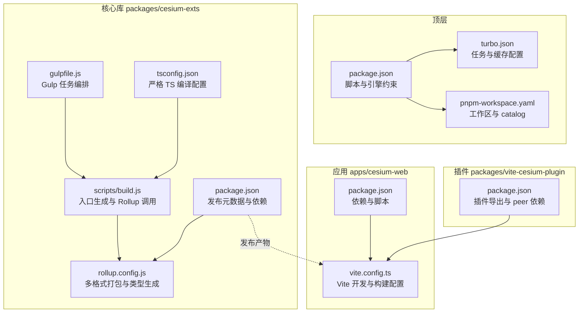
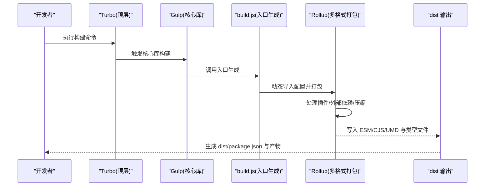
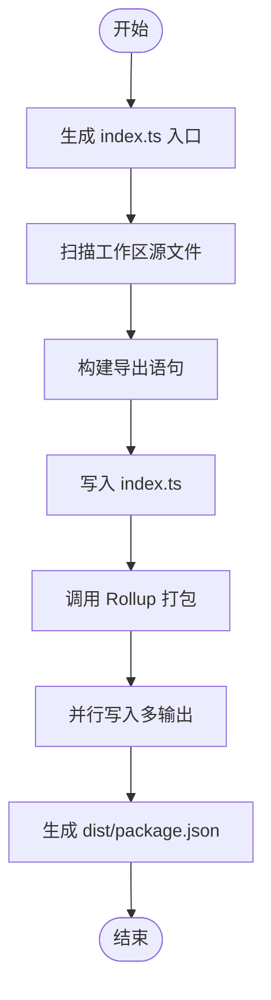
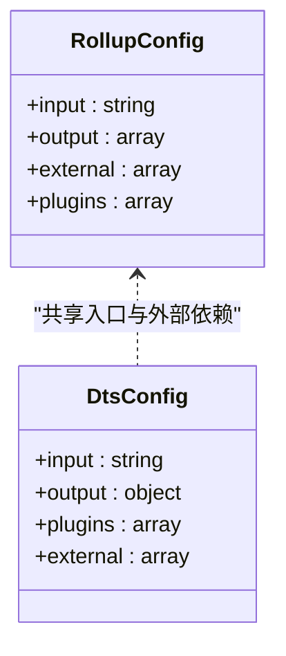
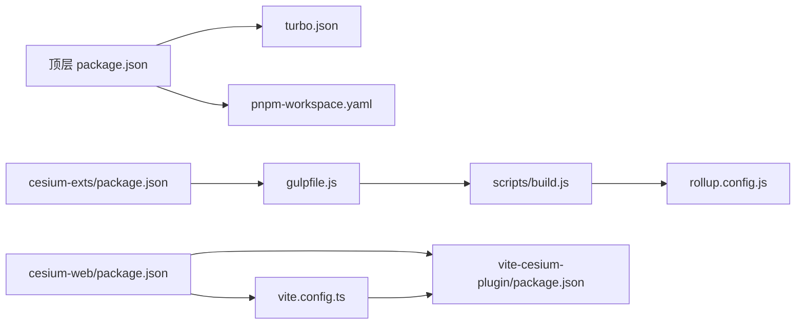

# 构建系统

<cite>
**本文引用的文件**
- [package.json](file://package.json)
- [turbo.json](file://turbo.json)
- [pnpm-workspace.yaml](file://pnpm-workspace.yaml)
- [packages/cesium-exts/gulpfile.js](file://packages/cesium-exts/gulpfile.js)
- [packages/cesium-exts/scripts/build.js](file://packages/cesium-exts/scripts/build.js)
- [packages/cesium-exts/rollup.config.js](file://packages/cesium-exts/rollup.config.js)
- [packages/cesium-exts/package.json](file://packages/cesium-exts/package.json)
- [packages/cesium-exts/tsconfig.json](file://packages/cesium-exts/tsconfig.json)
- [apps/cesium-web/vite.config.ts](file://apps/cesium-web/vite.config.ts)
- [apps/cesium-web/package.json](file://apps/cesium-web/package.json)
- [packages/vite-cesium-plugin/package.json](file://packages/vite-cesium-plugin/package.json)
</cite>

## 目录

1. [简介](#简介)
2. [项目结构](#项目结构)
3. [核心组件](#核心组件)
4. [架构总览](#架构总览)
5. [详细组件分析](#详细组件分析)
6. [依赖关系分析](#依赖关系分析)
7. [性能考量](#性能考量)
8. [故障排查指南](#故障排查指南)
9. [结论](#结论)
10. [附录](#附录)

## 简介

本文件系统性阐述本仓库的构建体系，重点覆盖以下方面：

- Gulp 与 Rollup 的组合使用：任务编排、代码转换与打包优化
- 多格式输出（ESM、CJS、UMD）的生成流程与适用场景
- 类型定义文件（.d.ts）的生成与维护流程
- Turborepo 的缓存机制与增量构建优化
- 构建性能分析与优化建议
- 发布流程、版本管理与 CI/CD 集成思路
- 面向维护者的扩展与定制指导

## 项目结构

本仓库采用 monorepo 结构，使用 pnpm workspace 管理多包；顶层通过 Turborepo 协调各子包的构建、缓存与增量构建；核心库 cesium-exts 通过 Gulp 调度入口生成与 Rollup 打包；应用层 cesium-web 使用 Vite 进行前端开发与构建。

图表来源

- [package.json:1-35](file://package.json#L1-L35)
- [turbo.json:1-16](file://turbo.json#L1-L16)
- [pnpm-workspace.yaml:1-12](file://pnpm-workspace.yaml#L1-L12)
- [packages/cesium-exts/gulpfile.js:1-16](file://packages/cesium-exts/gulpfile.js#L1-L16)
- [packages/cesium-exts/scripts/build.js:1-187](file://packages/cesium-exts/scripts/build.js#L1-L187)
- [packages/cesium-exts/rollup.config.js:1-123](file://packages/cesium-exts/rollup.config.js#L1-L123)
- [packages/cesium-exts/package.json:1-48](file://packages/cesium-exts/package.json#L1-L48)
- [packages/cesium-exts/tsconfig.json:1-51](file://packages/cesium-exts/tsconfig.json#L1-L51)
- [apps/cesium-web/vite.config.ts:1-81](file://apps/cesium-web/vite.config.ts#L1-L81)
- [apps/cesium-web/package.json:1-51](file://apps/cesium-web/package.json#L1-L51)
- [packages/vite-cesium-plugin/package.json:1-40](file://packages/vite-cesium-plugin/package.json#L1-L40)

章节来源

- [package.json:1-35](file://package.json#L1-L35)
- [turbo.json:1-16](file://turbo.json#L1-L16)
- [pnpm-workspace.yaml:1-12](file://pnpm-workspace.yaml#L1-L12)

## 核心组件

- 顶层脚本与引擎约束：通过顶层 package.json 统一脚本与 Node/PNPM 版本要求，驱动 Turborepo 的任务执行。
- Turborepo：集中定义 build/lint/dev 等任务，设置输入/输出、缓存与持久化行为，实现跨包增量构建。
- Gulp 任务编排：在核心库中，Gulp 串联“生成统一入口文件 → 调用 Rollup 打包”的流程。
- Rollup 打包：同时产出 ESM、CJS、UMD 三类格式与类型声明文件，配置外部依赖与压缩策略。
- 应用层 Vite：面向前端应用的开发与构建，配合插件与别名，控制产物命名与压缩策略。
- 插件生态：vite-cesium-plugin 作为 Vite 插件，提供 CesiumJS 集成能力，供应用侧使用。

章节来源

- [packages/cesium-exts/gulpfile.js:1-16](file://packages/cesium-exts/gulpfile.js#L1-L16)
- [packages/cesium-exts/scripts/build.js:1-187](file://packages/cesium-exts/scripts/build.js#L1-L187)
- [packages/cesium-exts/rollup.config.js:1-123](file://packages/cesium-exts/rollup.config.js#L1-L123)
- [apps/cesium-web/vite.config.ts:1-81](file://apps/cesium-web/vite.config.ts#L1-L81)
- [packages/vite-cesium-plugin/package.json:1-40](file://packages/vite-cesium-plugin/package.json#L1-L40)

## 架构总览

下图展示从顶层到具体包的构建链路与交互：

图表来源

- [turbo.json:1-16](file://turbo.json#L1-L16)
- [packages/cesium-exts/gulpfile.js:1-16](file://packages/cesium-exts/gulpfile.js#L1-L16)
- [packages/cesium-exts/scripts/build.js:35-63](file://packages/cesium-exts/scripts/build.js#L35-L63)
- [packages/cesium-exts/rollup.config.js:58-94](file://packages/cesium-exts/rollup.config.js#L58-L94)

## 详细组件分析

### Gulp 与入口生成

- 任务编排：Gulp 将“生成统一入口文件”和“调用 Rollup 打包”串行执行，保证入口文件先于打包完成。
- 入口生成：根据工作区源文件模式扫描匹配，生成 index.ts 导出清单，自动推断导出名并规范化路径。
- 并行写入：Rollup 打包完成后并行写入多输出配置，提升吞吐。

图表来源

- [packages/cesium-exts/gulpfile.js:7-12](file://packages/cesium-exts/gulpfile.js#L7-L12)
- [packages/cesium-exts/scripts/build.js:27-29](file://packages/cesium-exts/scripts/build.js#L27-L29)
- [packages/cesium-exts/scripts/build.js:82-133](file://packages/cesium-exts/scripts/build.js#L82-L133)
- [packages/cesium-exts/scripts/build.js:43-63](file://packages/cesium-exts/scripts/build.js#L43-L63)

章节来源

- [packages/cesium-exts/gulpfile.js:1-16](file://packages/cesium-exts/gulpfile.js#L1-L16)
- [packages/cesium-exts/scripts/build.js:1-187](file://packages/cesium-exts/scripts/build.js#L1-L187)

### Rollup 多格式打包与类型生成

- 外部依赖策略：将 Cesium 与 peerDependencies、devDependencies 纳入 external，避免打入产物。
- 基础插件链：TypeScript 编译、压缩混淆、解析与 CommonJS 转换、JSON 模块处理。
- 多格式输出：ESM、CJS、UMD 三类格式，分别适配现代打包器、Node 环境与浏览器/UMD 场景。
- 类型声明：使用 rollup-plugin-dts 生成 .d.ts，排除外部依赖，输出至 dist/types。

图表来源

- [packages/cesium-exts/rollup.config.js:17-19](file://packages/cesium-exts/rollup.config.js#L17-L19)
- [packages/cesium-exts/rollup.config.js:25-53](file://packages/cesium-exts/rollup.config.js#L25-L53)
- [packages/cesium-exts/rollup.config.js:58-94](file://packages/cesium-exts/rollup.config.js#L58-L94)
- [packages/cesium-exts/rollup.config.js:100-115](file://packages/cesium-exts/rollup.config.js#L100-L115)

章节来源

- [packages/cesium-exts/rollup.config.js:1-123](file://packages/cesium-exts/rollup.config.js#L1-L123)

### 类型定义文件生成与维护

- 生成位置：dist/types/index.d.ts
- 生成策略：独立配置，使用 dts 插件，排除外部依赖，确保消费者仅获得库内类型。
- 发布关联：dist/package.json 指定 types 字段，指向生成的类型文件。

章节来源

- [packages/cesium-exts/rollup.config.js:100-115](file://packages/cesium-exts/rollup.config.js#L100-L115)
- [packages/cesium-exts/scripts/build.js:158-186](file://packages/cesium-exts/scripts/build.js#L158-L186)

### 应用层 Vite 构建与优化

- 插件与别名：React、TailwindCSS、vite-cesium-plugin 插件，路径别名 @ 指向 src。
- 开发服务器：host 允许外网访问，open 自动打开浏览器。
- 构建优化：开启 Terser 压缩，移除 console/debugger，chunkSizeWarningLimit 提升体积容忍度；Rollup 输出命名规则统一资源命名。
- 与核心库协作：通过 workspace:\* 依赖 vite-cesium-plugin，实现 Cesium 集成。

章节来源

- [apps/cesium-web/vite.config.ts:1-81](file://apps/cesium-web/vite.config.ts#L1-L81)
- [apps/cesium-web/package.json:1-51](file://apps/cesium-web/package.json#L1-L51)
- [packages/vite-cesium-plugin/package.json:1-40](file://packages/vite-cesium-plugin/package.json#L1-L40)

### 发布流程与 dist/package.json

- 生成时机：Rollup 打包完成后，自动生成 dist/package.json。
- 关键字段：main/module 指向 ESM/CJS；exports 字段提供 import/require 双重入口；files 包含产物与 types；types 指向类型声明。
- peerDependencies：保留对 Cesium 的 peer 依赖，确保消费者自行提供运行时。

章节来源

- [packages/cesium-exts/scripts/build.js:158-186](file://packages/cesium-exts/scripts/build.js#L158-L186)
- [packages/cesium-exts/package.json:16-19](file://packages/cesium-exts/package.json#L16-L19)

## 依赖关系分析

- 顶层依赖：package.json 与 turbo.json 协同，定义任务与缓存；pnpm-workspace.yaml 约束工作区与 catalog。
- 核心库依赖：Gulp 调用 build.js，build.js 动态导入 rollup.config.js 并执行打包；dist/package.json 由 build.js 生成。
- 应用层依赖：cesium-web 通过 workspace:\* 依赖 vite-cesium-plugin，Vite 配置启用插件与别名。
- 外部依赖：Cesium 作为 peerDependencies，避免重复打包；其他工具链（TypeScript、ESLint、Prettier）通过 catalog 统一版本。

图表来源

- [package.json:1-35](file://package.json#L1-L35)
- [turbo.json:1-16](file://turbo.json#L1-L16)
- [pnpm-workspace.yaml:1-12](file://pnpm-workspace.yaml#L1-L12)
- [packages/cesium-exts/package.json:1-48](file://packages/cesium-exts/package.json#L1-L48)
- [packages/cesium-exts/gulpfile.js:1-16](file://packages/cesium-exts/gulpfile.js#L1-L16)
- [packages/cesium-exts/scripts/build.js:1-187](file://packages/cesium-exts/scripts/build.js#L1-L187)
- [packages/cesium-exts/rollup.config.js:1-123](file://packages/cesium-exts/rollup.config.js#L1-L123)
- [apps/cesium-web/package.json:1-51](file://apps/cesium-web/package.json#L1-L51)
- [apps/cesium-web/vite.config.ts:1-81](file://apps/cesium-web/vite.config.ts#L1-L81)
- [packages/vite-cesium-plugin/package.json:1-40](file://packages/vite-cesium-plugin/package.json#L1-L40)

章节来源

- [package.json:1-35](file://package.json#L1-L35)
- [turbo.json:1-16](file://turbo.json#L1-L16)
- [pnpm-workspace.yaml:1-12](file://pnpm-workspace.yaml#L1-L12)
- [packages/cesium-exts/package.json:1-48](file://packages/cesium-exts/package.json#L1-L48)
- [apps/cesium-web/package.json:1-51](file://apps/cesium-web/package.json#L1-L51)

## 性能考量

- 并行写入：Rollup 打包完成后并行写入多输出，减少 I/O 时间。
- 外部依赖剔除：将 Cesium 与开发依赖设为 external，显著降低产物体积与打包时间。
- 压缩与混淆：启用 terser，移除 console/debugger、注释，提升体积与加载性能。
- 缓存与增量：Turborepo 依据输入/输出缓存任务结果，避免重复构建。
- 构建体积预警：Vite 中提高 chunkSizeWarningLimit，避免小体积波动引发噪音。
- 源码映射：TS 与 Rollup 默认关闭 sourcemap，减少产物体积；如需调试可在本地临时开启。

章节来源

- [packages/cesium-exts/scripts/build.js:43-63](file://packages/cesium-exts/scripts/build.js#L43-L63)
- [packages/cesium-exts/rollup.config.js:17-19](file://packages/cesium-exts/rollup.config.js#L17-L19)
- [packages/cesium-exts/rollup.config.js:33-43](file://packages/cesium-exts/rollup.config.js#L33-L43)
- [turbo.json:4-8](file://turbo.json#L4-L8)
- [apps/cesium-web/vite.config.ts:29-47](file://apps/cesium-web/vite.config.ts#L29-L47)

## 故障排查指南

- 入口生成失败：检查工作区源文件模式与路径，确认 createIndexJs 的 glob 匹配是否正确。
- Rollup 打包报错：查看 build.js 中的错误捕获与日志，定位具体输入配置；确认 external 列表是否遗漏 peerDependencies。
- 类型声明缺失：确认 rollup-plugin-dts 是否启用，入口与 external 配置是否一致。
- dist/package.json 未生成：检查打包流程是否正常结束，确认 generateDistPackageJson 的调用顺序。
- Vite 构建异常：核对插件顺序与别名配置，检查 terserOptions 与 Rollup 输出命名规则。

章节来源

- [packages/cesium-exts/scripts/build.js:73-133](file://packages/cesium-exts/scripts/build.js#L73-L133)
- [packages/cesium-exts/scripts/build.js:45-59](file://packages/cesium-exts/scripts/build.js#L45-L59)
- [packages/cesium-exts/rollup.config.js:100-115](file://packages/cesium-exts/rollup.config.js#L100-L115)
- [packages/cesium-exts/scripts/build.js:158-186](file://packages/cesium-exts/scripts/build.js#L158-L186)
- [apps/cesium-web/vite.config.ts:1-81](file://apps/cesium-web/vite.config.ts#L1-L81)

## 结论

本构建系统通过 Turborepo 实现跨包增量构建与缓存，借助 Gulp 与 Rollup 的组合完成入口生成与多格式打包，配合 Vite 为应用层提供高效开发体验。通过 external 策略、压缩与并行写入等手段优化构建性能；通过 dist/package.json 与类型声明保障发布质量与消费体验。整体设计兼顾现代打包器生态与多场景分发需求。

## 附录

### 多格式输出适用场景

- ESM：现代打包器与浏览器原生模块，推荐优先使用
- CJS：Node.js 环境与传统打包器
- UMD：浏览器全局变量场景，需注意外部依赖映射

章节来源

- [packages/cesium-exts/rollup.config.js:63-87](file://packages/cesium-exts/rollup.config.js#L63-L87)

### 发布流程与版本管理建议

- 版本同步：顶层与各包版本保持一致，遵循语义化版本。
- 发布前检查：确保 dist 产物完整、dist/package.json 字段正确、类型声明存在。
- 自动化：结合 CI/CD 在 PR/MR 合并后触发构建与发布（如使用 pnpm publish）。

章节来源

- [packages/cesium-exts/scripts/build.js:158-186](file://packages/cesium-exts/scripts/build.js#L158-L186)
- [packages/cesium-exts/package.json:16-19](file://packages/cesium-exts/package.json#L16-L19)

### CI/CD 集成思路

- 任务编排：使用顶层脚本统一触发 dev/build/lint；Turborepo 依据缓存与依赖图执行增量构建。
- 缓存策略：利用 $TURBO_DEFAULT$ 与 outputs 目录，结合 CI 缓存加速。
- 质量门禁：lint 与格式化在提交前执行，避免污染主分支。

章节来源

- [package.json:5-11](file://package.json#L5-L11)
- [turbo.json:4-13](file://turbo.json#L4-L13)

### 扩展与定制指导

- 新增工作区：在 build.js 中扩展 workspaceSourceFiles，新增入口生成逻辑。
- 自定义 Rollup 插件：在 getBasePlugins 中追加插件，注意与 terser 的兼容性。
- 类型声明策略：若引入新的外部类型，调整 dts 配置的 external 列表。
- Vite 插件扩展：在 vite.config.ts 中增加插件与别名，确保与核心库的依赖关系清晰。

章节来源

- [packages/cesium-exts/scripts/build.js:17-21](file://packages/cesium-exts/scripts/build.js#L17-L21)
- [packages/cesium-exts/rollup.config.js:25-53](file://packages/cesium-exts/rollup.config.js#L25-L53)
- [apps/cesium-web/vite.config.ts:1-81](file://apps/cesium-web/vite.config.ts#L1-L81)
