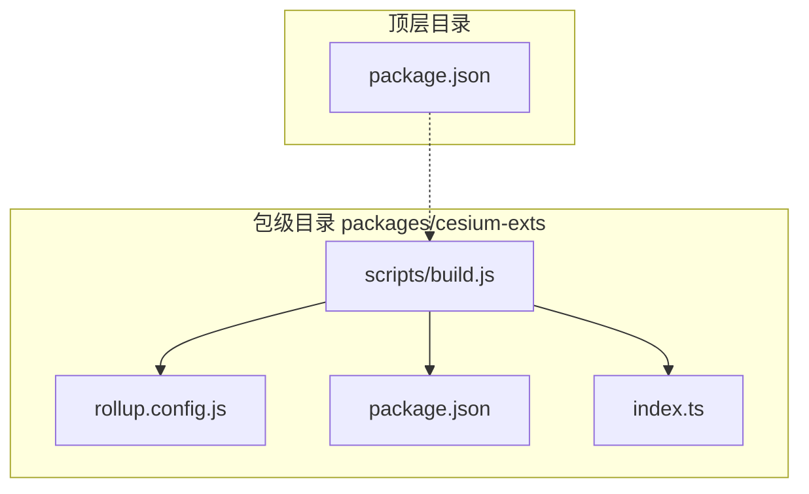
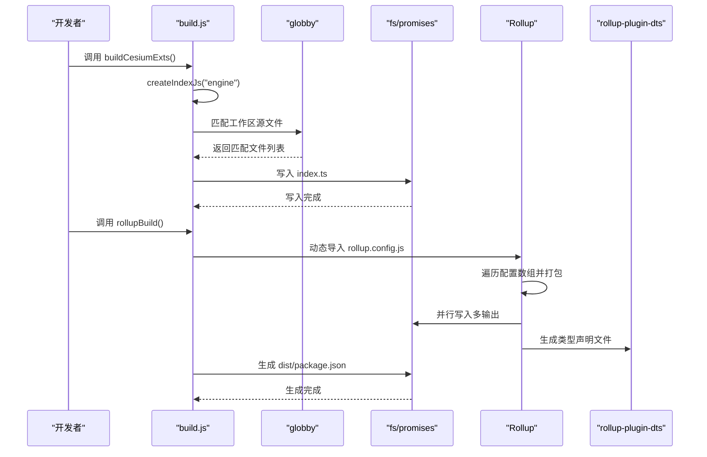
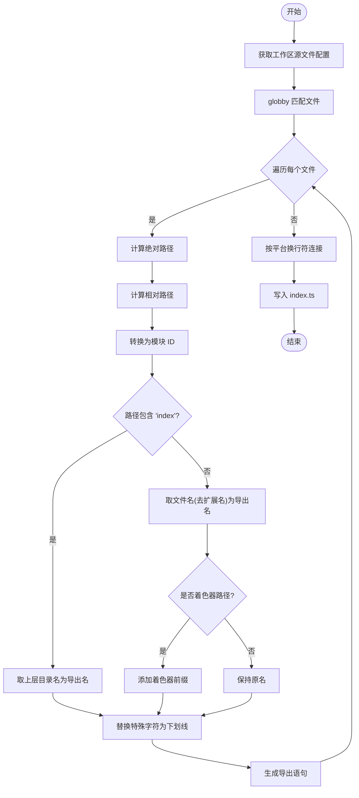
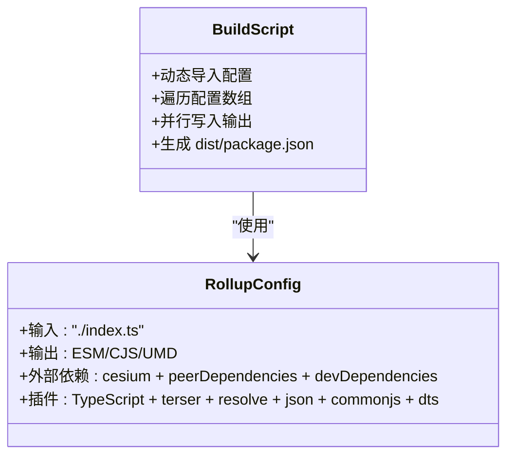
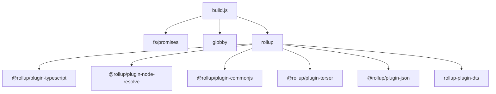

# 构建脚本工具

<cite>
**本文档引用的文件**
- [build.js](file://packages/cesium-exts/scripts/build.js)
- [rollup.config.js](file://packages/cesium-exts/rollup.config.js)
- [package.json](file://packages/cesium-exts/package.json)
- [index.ts](file://packages/cesium-exts/index.ts)
- [package.json](file://package.json)
</cite>

## 目录

1. [简介](#简介)
2. [项目结构](#项目结构)
3. [核心组件](#核心组件)
4. [架构概览](#架构概览)
5. [详细组件分析](#详细组件分析)
6. [依赖关系分析](#依赖关系分析)
7. [性能考虑](#性能考虑)
8. [故障排除指南](#故障排除指南)
9. [结论](#结论)
10. [附录](#附录)

## 简介

本文件档针对构建脚本工具进行深入技术文档化，重点围绕 `build.js` 的核心构建逻辑与工具函数展开。文档将详细解释入口文件生成算法、文件路径处理与模块导出策略，阐述构建过程中的文件操作、目录创建与清理机制，说明构建脚本与外部工具（Rollup、globby、fs/promises）的集成方式，以及命令行参数传递与环境变量处理。同时提供扩展与定制方法、错误处理、日志记录与调试功能的实现细节，为维护者提供脚本维护与故障排除的实用指导。

## 项目结构

该构建脚本位于 `packages/cesium-exts/scripts/build.js`，配合 `rollup.config.js` 实现打包与发布。核心文件组织如下：

- 构建脚本：`packages/cesium-exts/scripts/build.js`
- Rollup 配置：`packages/cesium-exts/rollup.config.js`
- 包配置：`packages/cesium-exts/package.json`
- 入口聚合文件：`packages/cesium-exts/index.ts`
- 顶层包管理：`package.json`

**图表来源**

- [build.js:1-187](file://packages/cesium-exts/scripts/build.js#L1-L187)
- [rollup.config.js:1-123](file://packages/cesium-exts/rollup.config.js#L1-L123)
- [package.json:1-48](file://packages/cesium-exts/package.json#L1-L48)
- [index.ts:1-4](file://packages/cesium-exts/index.ts#L1-L4)
- [package.json:1-35](file://package.json#L1-L35)

**章节来源**

- [build.js:1-187](file://packages/cesium-exts/scripts/build.js#L1-L187)
- [rollup.config.js:1-123](file://packages/cesium-exts/rollup.config.js#L1-L123)
- [package.json:1-48](file://packages/cesium-exts/package.json#L1-L48)
- [index.ts:1-4](file://packages/cesium-exts/index.ts#L1-L4)
- [package.json:1-35](file://package.json#L1-L35)

## 核心组件

本节聚焦于构建脚本中的关键函数与职责划分：

- `buildCesiumExts`: 主构建入口，负责调用工作区入口生成流程。
- `rollupBuild`: 执行 Rollup 打包，动态加载配置并并行写入多输出，最后生成 dist/package.json。
- `createIndexJs`: 核心入口文件生成算法，扫描源文件、计算模块 ID、生成导出语句并写入 index.ts。
- `filePathToModuleId`: 路径到模块 ID 的转换工具，统一平台路径分隔符。
- `generateDistPackageJson`: 生成发布用的 dist/package.json，定义主入口、模块入口、导出映射与类型信息。

**章节来源**

- [build.js:27-63](file://packages/cesium-exts/scripts/build.js#L27-L63)
- [build.js:73-133](file://packages/cesium-exts/scripts/build.js#L73-L133)
- [build.js:151-153](file://packages/cesium-exts/scripts/build.js#L151-L153)
- [build.js:158-186](file://packages/cesium-exts/scripts/build.js#L158-L186)

## 架构概览

构建流程由两大部分组成：入口文件生成与 Rollup 打包。入口文件生成阶段通过 globby 扫描工作区源文件，计算模块 ID 并生成统一入口；Rollup 打包阶段读取配置，执行多格式输出并生成类型声明文件，最后生成 dist/package.json 供发布使用。

**图表来源**

- [build.js:27-63](file://packages/cesium-exts/scripts/build.js#L27-L63)
- [build.js:73-133](file://packages/cesium-exts/scripts/build.js#L73-L133)
- [rollup.config.js:58-94](file://packages/cesium-exts/rollup.config.js#L58-L94)
- [rollup.config.js:100-115](file://packages/cesium-exts/rollup.config.js#L100-L115)

## 详细组件分析

### 入口文件生成算法（createIndexJs）

该算法负责为指定工作区生成统一入口文件，核心流程如下：

- 读取工作区源文件配置（glob 模式），使用 globby 匹配文件。
- 对每个匹配文件：
  - 计算绝对路径与相对路径，转换为模块 ID。
  - 基于路径是否包含“index”决定导出名：包含则取上层目录名，否则取文件名（去扩展名）。
  - 特殊处理着色器文件，添加前缀以避免命名冲突。
  - 统一替换特殊字符为下划线，保证导出名合法。
  - 生成标准导出语句。
- 将所有导出语句按平台换行符连接，写入 index.ts。

**图表来源**

- [build.js:73-133](file://packages/cesium-exts/scripts/build.js#L73-L133)
- [build.js:151-153](file://packages/cesium-exts/scripts/build.js#L151-L153)

**章节来源**

- [build.js:73-133](file://packages/cesium-exts/scripts/build.js#L73-L133)
- [build.js:151-153](file://packages/cesium-exts/scripts/build.js#L151-L153)

### 文件路径处理与模块导出策略

- 路径规范化：统一使用 Unix 风格路径分隔符，避免 Windows 与 Unix 行为差异。
- 模块 ID 转换：移除扩展名后替换路径分隔符，确保导入路径正确。
- 导出命名规则：
  - 包含“index”的模块使用上层目录名作为导出名。
  - 非 index 模块使用文件名（去扩展名）作为导出名。
  - 着色器模块自动添加前缀，避免命名冲突。
  - 特殊字符统一替换为下划线，保证标识符合法性。
- 导出语句格式：采用标准 ES 模块导出语法，确保与 Rollup 输出一致。

**章节来源**

- [build.js:90-125](file://packages/cesium-exts/scripts/build.js#L90-L125)
- [build.js:151-153](file://packages/cesium-exts/scripts/build.js#L151-L153)

### Rollup 打包与多格式输出

- 配置加载：动态导入 rollup.config.js，确保工作目录切换到项目根目录后再解析相对路径。
- 多配置支持：遍历配置数组，对每个配置执行打包与并行写入多输出。
- 外部依赖：从 package.json 中提取 peerDependencies 与 devDependencies，统一声明为外部依赖，避免打包进最终产物。
- 输出格式：同时生成 ESM、CJS、UMD 三种格式，满足不同运行环境需求。
- 类型声明：使用 rollup-plugin-dts 生成类型声明文件，输出至 dist/types。

**图表来源**

- [rollup.config.js:58-94](file://packages/cesium-exts/rollup.config.js#L58-L94)
- [rollup.config.js:100-115](file://packages/cesium-exts/rollup.config.js#L100-L115)
- [build.js:35-63](file://packages/cesium-exts/scripts/build.js#L35-L63)

**章节来源**

- [rollup.config.js:17-19](file://packages/cesium-exts/rollup.config.js#L17-L19)
- [rollup.config.js:25-53](file://packages/cesium-exts/rollup.config.js#L25-L53)
- [rollup.config.js:58-94](file://packages/cesium-exts/rollup.config.js#L58-L94)
- [rollup.config.js:100-115](file://packages/cesium-exts/rollup.config.js#L100-L115)
- [build.js:35-63](file://packages/cesium-exts/scripts/build.js#L35-L63)

### 发布元数据生成（generateDistPackageJson）

- 读取根 package.json，提取必要字段（name、version、description、keywords、author、license、peerDependencies）。
- 定义主入口与模块入口：main 指向 CJS，module 指向 ESM。
- 导出映射：提供 import 与 require 两种入口，分别指向 ESM 与 CJS。
- 文件清单：包含三大产物与 types 目录。
- 类型声明：types 指向 dist/types/index.d.ts。
- 写入 dist/package.json 并输出成功日志。

**章节来源**

- [build.js:158-186](file://packages/cesium-exts/scripts/build.js#L158-L186)
- [package.json:1-48](file://packages/cesium-exts/package.json#L1-L48)

## 依赖关系分析

构建脚本与外部工具的耦合关系如下：

- fs/promises：用于读取与写入文件，支持异步操作与编码控制。
- globby：用于匹配工作区源文件，支持多模式与绝对路径。
- rollup：作为打包核心，配合多种插件实现编译、压缩、解析与 CommonJS 转换。
- rollup-plugin-dts：生成 TypeScript 类型声明文件。
- @rollup/plugin-typescript、@rollup/plugin-node-resolve、@rollup/plugin-commonjs、@rollup/plugin-terser、@rollup/plugin-json：提供编译、解析、转换与压缩能力。

**图表来源**

- [build.js:4-6](file://packages/cesium-exts/scripts/build.js#L4-L6)
- [rollup.config.js:2-7](file://packages/cesium-exts/rollup.config.js#L2-L7)

**章节来源**

- [build.js:4-6](file://packages/cesium-exts/scripts/build.js#L4-L6)
- [rollup.config.js:2-7](file://packages/cesium-exts/rollup.config.js#L2-L7)

## 性能考虑

- 并行写入：Rollup 打包完成后对所有输出配置并行写入，减少总耗时。
- 路径处理优化：使用 map + join 替代循环拼接，提升字符串处理效率。
- 压缩与混淆：启用 terser 的压缩与混淆，减少产物体积，提高加载性能。
- 外部依赖剔除：将 cesium 与开发依赖标记为外部依赖，避免重复打包，降低体积与构建时间。
- 类型声明独立生成：通过 rollup-plugin-dts 单独生成类型文件，避免与主构建耦合。

**章节来源**

- [build.js:50-51](file://packages/cesium-exts/scripts/build.js#L50-L51)
- [build.js:90-125](file://packages/cesium-exts/scripts/build.js#L90-L125)
- [rollup.config.js:33-43](file://packages/cesium-exts/rollup.config.js#L33-L43)
- [rollup.config.js:17-19](file://packages/cesium-exts/rollup.config.js#L17-L19)

## 故障排除指南

- 工作区源文件配置缺失：当传入不存在的工作区名称时，会抛出错误。请检查 workspaceSourceFiles 中的键值是否正确。
- 路径解析异常：确保项目根目录与工作区根目录一致，避免相对路径计算错误。
- Rollup 打包失败：查看控制台输出的错误信息，定位具体配置项与输入文件；确认外部依赖声明正确。
- 生成 index.ts 失败：检查目标路径权限与磁盘空间；确认 globby 匹配结果非空。
- dist/package.json 生成失败：检查根 package.json 结构与字段完整性；确认 dist 目录存在且可写。
- 日志与调试：构建脚本在关键节点输出提示信息，便于定位问题；可在本地增加更多 console 输出辅助调试。

**章节来源**

- [build.js:78-80](file://packages/cesium-exts/scripts/build.js#L78-L80)
- [build.js:52-54](file://packages/cesium-exts/scripts/build.js#L52-L54)
- [build.js:185-186](file://packages/cesium-exts/scripts/build.js#L185-L186)

## 结论

本构建脚本工具通过清晰的职责划分与高效的实现策略，实现了入口文件自动生成、多格式打包与发布元数据生成的完整流程。其设计兼顾了可维护性与性能，提供了良好的扩展点与完善的错误处理机制。建议在后续迭代中持续关注外部依赖版本更新与 Rollup 插件生态变化，以保持构建链路的稳定性与先进性。

## 附录

### 扩展与定制方法

- 添加新的工作区：在 workspaceSourceFiles 中新增键值对，定义源文件匹配模式。
- 修改导出命名规则：调整 createIndexJs 中的导出名提取与规范化逻辑。
- 新增构建步骤：在 buildCesiumExts 或 rollupBuild 中插入新步骤，注意异步顺序与错误捕获。
- 自定义 Rollup 配置：在 rollup.config.js 中调整插件选项或新增配置对象。
- 环境变量与命令行参数：可在构建脚本中读取 process.env 与 process.argv，实现条件化构建。

**章节来源**

- [build.js:17-21](file://packages/cesium-exts/scripts/build.js#L17-L21)
- [build.js:27-29](file://packages/cesium-exts/scripts/build.js#L27-L29)
- [rollup.config.js:25-53](file://packages/cesium-exts/rollup.config.js#L25-L53)
