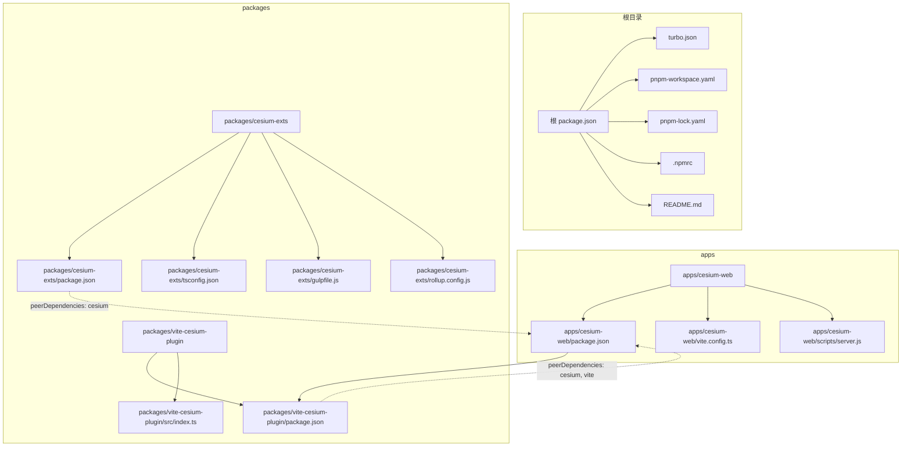
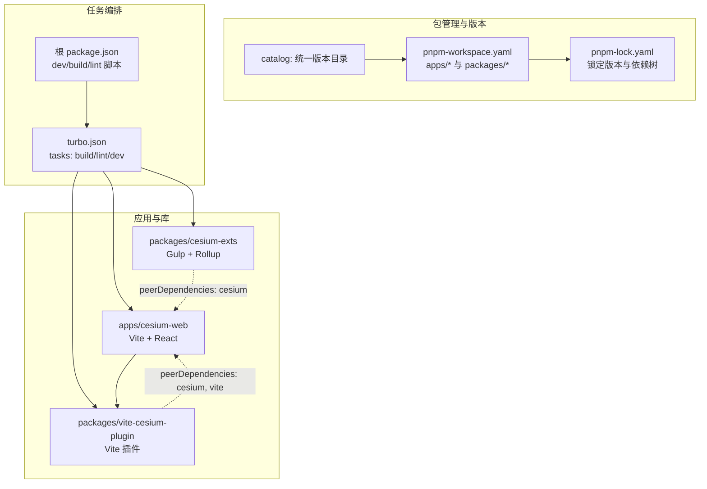
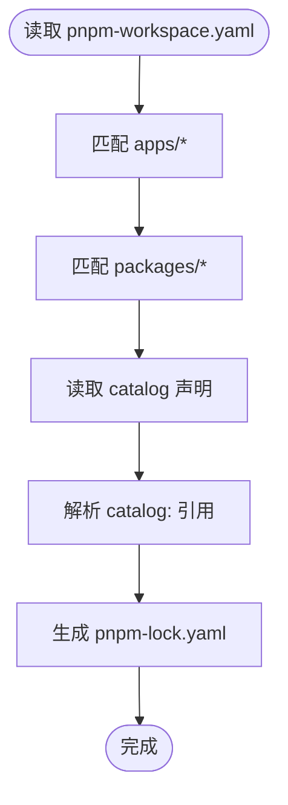
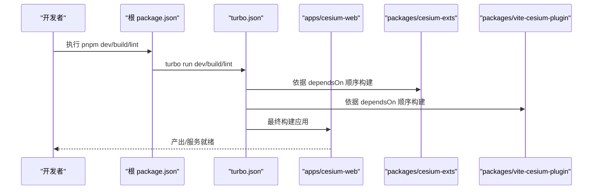
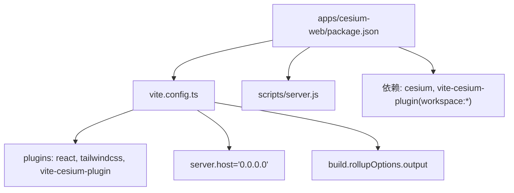
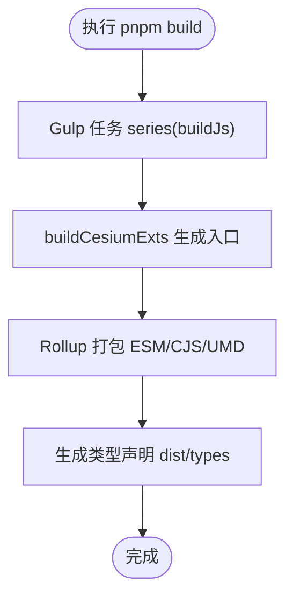
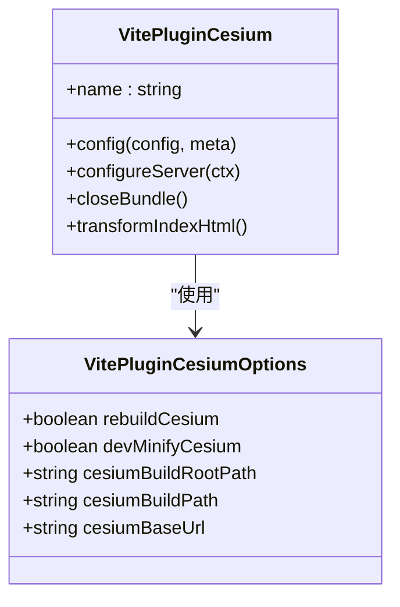
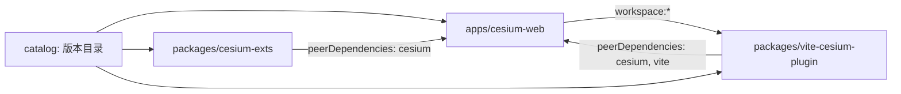

# Monorepo 架构

<cite>
**本文引用的文件**
- [turbo.json](file://turbo.json)
- [pnpm-workspace.yaml](file://pnpm-workspace.yaml)
- [package.json](file://package.json)
- [pnpm-lock.yaml](file://pnpm-lock.yaml)
- [.npmrc](file://.npmrc)
- [README.md](file://README.md)
- [apps/cesium-web/package.json](file://apps/cesium-web/package.json)
- [apps/cesium-web/vite.config.ts](file://apps/cesium-web/vite.config.ts)
- [apps/cesium-web/scripts/server.js](file://apps/cesium-web/scripts/server.js)
- [packages/cesium-exts/package.json](file://packages/cesium-exts/package.json)
- [packages/cesium-exts/tsconfig.json](file://packages/cesium-exts/tsconfig.json)
- [packages/cesium-exts/gulpfile.js](file://packages/cesium-exts/gulpfile.js)
- [packages/cesium-exts/rollup.config.js](file://packages/cesium-exts/rollup.config.js)
- [packages/vite-cesium-plugin/package.json](file://packages/vite-cesium-plugin/package.json)
- [packages/vite-cesium-plugin/src/index.ts](file://packages/vite-cesium-plugin/src/index.ts)
</cite>

## 目录

1. [简介](#简介)
2. [项目结构](#项目结构)
3. [核心组件](#核心组件)
4. [架构总览](#架构总览)
5. [详细组件分析](#详细组件分析)
6. [依赖分析](#依赖分析)
7. [性能考量](#性能考量)
8. [故障排查指南](#故障排查指南)
9. [结论](#结论)
10. [附录](#附录)

## 简介

本项目采用 Monorepo 架构，结合 pnpm workspace 与 Turborepo，实现多包协同开发与构建。根目录通过工作区配置将 apps 与 packages 下的子包纳入统一管理；通过 catalog 统一版本策略，减少重复声明；借助 Turborepo 的任务编排与缓存能力，加速构建与测试。应用层使用 Vite + React 进行演示与开发，核心库通过 Gulp + Rollup 进行多格式打包与类型声明生成；同时提供一个专门的 Vite 插件，用于在 Vite 项目中无缝集成 CesiumJS。

## 项目结构

项目采用典型的 Monorepo 分层组织：

- apps：应用层，包含演示应用与开发环境，负责对外展示与交互体验
- packages：核心库与工具包，包含核心扩展库与 Vite 插件，负责业务与工程能力沉淀
- 根目录：统一的包管理与任务编排配置，集中定义工作区、版本目录与脚本

图表来源

- [turbo.json:1-16](file://turbo.json#L1-L16)
- [pnpm-workspace.yaml:1-12](file://pnpm-workspace.yaml#L1-L12)
- [pnpm-lock.yaml:1-200](file://pnpm-lock.yaml#L1-L200)
- [apps/cesium-web/package.json:1-51](file://apps/cesium-web/package.json#L1-L51)
- [apps/cesium-web/vite.config.ts:1-81](file://apps/cesium-web/vite.config.ts#L1-L81)
- [packages/cesium-exts/package.json:1-48](file://packages/cesium-exts/package.json#L1-L48)
- [packages/cesium-exts/tsconfig.json:1-51](file://packages/cesium-exts/tsconfig.json#L1-L51)
- [packages/cesium-exts/gulpfile.js:1-16](file://packages/cesium-exts/gulpfile.js#L1-L16)
- [packages/cesium-exts/rollup.config.js:1-123](file://packages/cesium-exts/rollup.config.js#L1-L123)
- [packages/vite-cesium-plugin/package.json:1-40](file://packages/vite-cesium-plugin/package.json#L1-L40)
- [packages/vite-cesium-plugin/src/index.ts:1-194](file://packages/vite-cesium-plugin/src/index.ts#L1-L194)

章节来源

- [pnpm-workspace.yaml:1-12](file://pnpm-workspace.yaml#L1-L12)
- [pnpm-lock.yaml:1-200](file://pnpm-lock.yaml#L1-L200)
- [README.md:90-123](file://README.md#L90-L123)

## 核心组件

- pnpm workspace：通过工作区配置将 apps/_ 与 packages/_ 纳入统一管理，实现依赖去重与本地链接
- catalog：在根目录集中声明公共依赖版本，子包通过 "catalog:" 引用，确保版本统一
- Turborepo：定义任务规范（build、lint、dev），利用缓存与并行执行提升整体效率
- 应用层（apps/cesium-web）：基于 Vite + React 的演示应用，集成自研 Vite 插件
- 核心库（packages/cesium-exts）：基于 Gulp + Rollup 的多格式打包与类型声明生成
- 插件（packages/vite-cesium-plugin）：在 Vite 中无缝集成 CesiumJS，支持开发与生产两种模式

章节来源

- [pnpm-workspace.yaml:1-12](file://pnpm-workspace.yaml#L1-L12)
- [pnpm-lock.yaml:7-29](file://pnpm-lock.yaml#L7-L29)
- [turbo.json:1-16](file://turbo.json#L1-L16)
- [apps/cesium-web/package.json:1-51](file://apps/cesium-web/package.json#L1-L51)
- [packages/cesium-exts/package.json:1-48](file://packages/cesium-exts/package.json#L1-L48)
- [packages/vite-cesium-plugin/package.json:1-40](file://packages/vite-cesium-plugin/package.json#L1-L40)

## 架构总览

该架构通过 pnpm 与 Turborepo 协同，形成“统一版本 + 并行构建 + 缓存加速”的工程体系。根目录集中管理工作区与版本目录，子包通过本地链接与 catalog 引用实现依赖共享与版本统一；Turborepo 负责任务编排与缓存，按拓扑顺序执行构建链路，显著缩短增量构建时间。

图表来源

- [pnpm-workspace.yaml:1-12](file://pnpm-workspace.yaml#L1-L12)
- [pnpm-lock.yaml:1-200](file://pnpm-lock.yaml#L1-L200)
- [turbo.json:1-16](file://turbo.json#L1-L16)
- [package.json:5-11](file://package.json#L5-L11)
- [apps/cesium-web/package.json:12-28](file://apps/cesium-web/package.json#L12-L28)
- [packages/cesium-exts/package.json:27-29](file://packages/cesium-exts/package.json#L27-L29)
- [packages/vite-cesium-plugin/package.json:33-38](file://packages/vite-cesium-plugin/package.json#L33-L38)

## 详细组件分析

### pnpm workspace 与 catalog 设计

- 工作区匹配：通过 apps/_ 与 packages/_ 将应用与库纳入同一锁文件与安装上下文，避免重复安装与版本漂移
- catalog 统一：在根目录集中声明常用依赖版本，子包通过 "catalog:" 引用，减少重复声明与版本不一致风险
- 锁文件：pnpm-lock.yaml 展示了 catalog 的实际解析结果，确保各包使用一致的版本

图表来源

- [pnpm-workspace.yaml:1-12](file://pnpm-workspace.yaml#L1-L12)
- [pnpm-lock.yaml:7-29](file://pnpm-lock.yaml#L7-L29)

章节来源

- [pnpm-workspace.yaml:1-12](file://pnpm-workspace.yaml#L1-L12)
- [pnpm-lock.yaml:7-29](file://pnpm-lock.yaml#L7-L29)
- [.npmrc:1-3](file://.npmrc#L1-L3)

### Turborepo 任务编排与缓存

- 任务定义：build 任务声明依赖上游包先构建（dependsOn: ^build），并指定输入/输出以启用缓存
- 开发任务：dev 任务禁用缓存并持久化，保证开发体验
- 根脚本：通过根 package.json 调用 turbo run dev/build/lint，统一入口

图表来源

- [package.json:5-11](file://package.json#L5-L11)
- [turbo.json:3-14](file://turbo.json#L3-L14)
- [apps/cesium-web/package.json:6-10](file://apps/cesium-web/package.json#L6-L10)
- [packages/cesium-exts/package.json:16-18](file://packages/cesium-exts/package.json#L16-L18)
- [packages/vite-cesium-plugin/package.json:16-18](file://packages/vite-cesium-plugin/package.json#L16-L18)

章节来源

- [turbo.json:1-16](file://turbo.json#L1-L16)
- [package.json:5-11](file://package.json#L5-L11)

### 应用层（apps/cesium-web）

- 依赖与脚本：集成 React、TailwindCSS、Monaco Editor 等；通过本地链接引入 vite-cesium-plugin
- Vite 配置：启用 React 插件、TailwindCSS 插件与自研插件；配置开发服务器与构建输出
- 开发脚本：结合自定义 server.js 与 Vite 启动开发环境

图表来源

- [apps/cesium-web/package.json:12-49](file://apps/cesium-web/package.json#L12-L49)
- [apps/cesium-web/vite.config.ts:1-81](file://apps/cesium-web/vite.config.ts#L1-L81)
- [apps/cesium-web/scripts/server.js:1-4](file://apps/cesium-web/scripts/server.js#L1-L4)

章节来源

- [apps/cesium-web/package.json:1-51](file://apps/cesium-web/package.json#L1-L51)
- [apps/cesium-web/vite.config.ts:1-81](file://apps/cesium-web/vite.config.ts#L1-L81)
- [apps/cesium-web/scripts/server.js:1-4](file://apps/cesium-web/scripts/server.js#L1-L4)

### 核心库（packages/cesium-exts）

- 构建流程：通过 Gulp 串联入口生成与 Rollup 打包，生成 ESM/CJS/UMD 与类型声明
- 依赖策略：将 Cesium 声明为 peerDependencies，由上层应用提供，避免重复打包
- TypeScript 配置：面向现代打包器的严格配置，提升构建性能与类型安全

图表来源

- [packages/cesium-exts/gulpfile.js:1-16](file://packages/cesium-exts/gulpfile.js#L1-L16)
- [packages/cesium-exts/rollup.config.js:1-123](file://packages/cesium-exts/rollup.config.js#L1-L123)
- [packages/cesium-exts/package.json:16-18](file://packages/cesium-exts/package.json#L16-L18)

章节来源

- [packages/cesium-exts/package.json:1-48](file://packages/cesium-exts/package.json#L1-L48)
- [packages/cesium-exts/gulpfile.js:1-16](file://packages/cesium-exts/gulpfile.js#L1-L16)
- [packages/cesium-exts/rollup.config.js:1-123](file://packages/cesium-exts/rollup.config.js#L1-L123)
- [packages/cesium-exts/tsconfig.json:1-51](file://packages/cesium-exts/tsconfig.json#L1-L51)

### Vite 插件（packages/vite-cesium-plugin）

- 功能：在 Vite 中无缝集成 CesiumJS，支持开发与生产两种模式；自动注入 CSS/JS 标签，复制静态资源
- 配置项：控制是否重建 Cesium、开发时是否使用压缩版 Cesium、静态资源基础路径等
- 依赖策略：作为插件被应用引入，Cesium 由应用提供（peerDependencies）

图表来源

- [packages/vite-cesium-plugin/src/index.ts:7-48](file://packages/vite-cesium-plugin/src/index.ts#L7-L48)
- [packages/vite-cesium-plugin/src/index.ts:75-194](file://packages/vite-cesium-plugin/src/index.ts#L75-L194)

章节来源

- [packages/vite-cesium-plugin/package.json:1-40](file://packages/vite-cesium-plugin/package.json#L1-L40)
- [packages/vite-cesium-plugin/src/index.ts:1-194](file://packages/vite-cesium-plugin/src/index.ts#L1-L194)

## 依赖分析

- 依赖共享机制：通过 pnpm workspace 将子包纳入同一安装上下文，实现去重与本地链接；通过 catalog 统一版本，避免重复声明
- 版本统一管理：根目录 catalog 声明公共依赖版本，子包通过 "catalog:" 引用；pnpm-lock.yaml 展示解析结果
- 包间依赖关系：应用层依赖核心库与插件；核心库与插件共同依赖 Cesium；插件与应用共同依赖 Vite
- peerDependencies：核心库与插件将 Cesium 声明为 peerDependencies，由应用层提供，避免重复打包与版本冲突

图表来源

- [pnpm-workspace.yaml:1-12](file://pnpm-workspace.yaml#L1-L12)
- [pnpm-lock.yaml:51-100](file://pnpm-lock.yaml#L51-L100)
- [packages/cesium-exts/package.json:27-29](file://packages/cesium-exts/package.json#L27-L29)
- [packages/vite-cesium-plugin/package.json:33-38](file://packages/vite-cesium-plugin/package.json#L33-L38)
- [apps/cesium-web/package.json:12-28](file://apps/cesium-web/package.json#L12-L28)

章节来源

- [pnpm-workspace.yaml:1-12](file://pnpm-workspace.yaml#L1-L12)
- [pnpm-lock.yaml:51-100](file://pnpm-lock.yaml#L51-L100)
- [packages/cesium-exts/package.json:27-29](file://packages/cesium-exts/package.json#L27-L29)
- [packages/vite-cesium-plugin/package.json:33-38](file://packages/vite-cesium-plugin/package.json#L33-L38)
- [apps/cesium-web/package.json:12-28](file://apps/cesium-web/package.json#L12-L28)

## 性能考量

- 并行与缓存：Turborepo 通过任务缓存与拓扑排序，避免重复计算，加速增量构建
- 依赖去重：pnpm workspace 将子包纳入同一上下文，减少重复安装与网络请求
- 构建链路：核心库使用 Gulp + Rollup，按序执行入口生成与打包，避免不必要的重编译
- 开发体验：应用层 dev 任务禁用缓存并持久化，保证热更新与实时反馈

## 故障排查指南

- 版本不一致：若出现 Cesium 或其他依赖版本冲突，检查根目录 catalog 与子包 "catalog:" 引用是否一致，确认 pnpm-lock.yaml 解析结果
- 本地链接异常：确认 pnpm-workspace.yaml 匹配路径正确，且子包通过 workspace:\* 引用本地插件
- 构建失败：核对核心库的 Gulp 与 Rollup 配置，确保入口生成与打包步骤正常执行
- 开发服务器问题：检查应用层 Vite 配置与插件参数，确认静态资源代理与 HTML 注入逻辑

章节来源

- [pnpm-workspace.yaml:1-12](file://pnpm-workspace.yaml#L1-L12)
- [pnpm-lock.yaml:1-200](file://pnpm-lock.yaml#L1-L200)
- [packages/cesium-exts/gulpfile.js:1-16](file://packages/cesium-exts/gulpfile.js#L1-L16)
- [packages/cesium-exts/rollup.config.js:1-123](file://packages/cesium-exts/rollup.config.js#L1-L123)
- [apps/cesium-web/vite.config.ts:1-81](file://apps/cesium-web/vite.config.ts#L1-L81)

## 结论

该 Monorepo 架构通过 pnpm workspace 与 Turborepo 的组合，实现了依赖统一、版本可控与构建高效的工程体系。apps 与 packages 的职责清晰分离，核心库与插件沉淀通用能力，应用层专注于演示与交互。配合 catalog 与本地链接，有效降低了版本漂移与重复依赖的风险；Turborepo 的缓存与并行执行进一步提升了开发与 CI 的效率。

## 附录

- 常用命令：根 package.json 提供 dev、build、lint、format 等脚本，统一入口调用 turbo run
- 环境要求：根 package.json 与 README.md 明确 Node.js、pnpm 与 Cesium 的最低版本要求
- 项目结构：README.md 提供了清晰的目录结构说明，便于理解各模块职责

章节来源

- [package.json:5-11](file://package.json#L5-L11)
- [README.md:33-64](file://README.md#L33-L64)
