# UI 组件库

<cite>
**本文档引用的文件**
- [apps/cesium-web/src/components/ui/button.tsx](file://apps/cesium-web/src/components/ui/button.tsx)
- [apps/cesium-web/src/components/ui/card.tsx](file://apps/cesium-web/src/components/ui/card.tsx)
- [apps/cesium-web/src/components/ui/alert-dialog.tsx](file://apps/cesium-web/src/components/ui/alert-dialog.tsx)
- [apps/cesium-web/src/components/ui/tabs.tsx](file://apps/cesium-web/src/components/ui/tabs.tsx)
- [apps/cesium-web/src/components/ui/resizable.tsx](file://apps/cesium-web/src/components/ui/resizable.tsx)
- [apps/cesium-web/src/lib/utils.ts](file://apps/cesium-web/src/lib/utils.ts)
- [apps/cesium-web/src/contexts/ThemeContext.tsx](file://apps/cesium-web/src/contexts/ThemeContext.tsx)
- [apps/cesium-web/src/components/Bucket/Bucket.tsx](file://apps/cesium-web/src/components/Bucket/Bucket.tsx)
- [apps/cesium-web/src/components/Bucket/Bucket.scss](file://apps/cesium-web/src/components/Bucket/Bucket.scss)
- [apps/cesium-web/src/components/SandcastleEditor/SandcastleEditor.tsx](file://apps/cesium-web/src/components/SandcastleEditor/SandcastleEditor.tsx)
- [apps/cesium-web/src/components/ErrorBoundary/ErrorBoundary.tsx](file://apps/cesium-web/src/components/ErrorBoundary/ErrorBoundary.tsx)
- [apps/cesium-web/src/styles/index.css](file://apps/cesium-web/src/styles/index.css)
- [apps/cesium-web/package.json](file://apps/cesium-web/package.json)
- [apps/cesium-web/vite.config.ts](file://apps/cesium-web/vite.config.ts)
- [apps/cesium-web/tsconfig.app.json](file://apps/cesium-web/tsconfig.app.json)
</cite>

## 目录

1. [简介](#简介)
2. [项目结构](#项目结构)
3. [核心组件](#核心组件)
4. [架构总览](#架构总览)
5. [组件详细分析](#组件详细分析)
6. [依赖关系分析](#依赖关系分析)
7. [性能考量](#性能考量)
8. [故障排查指南](#故障排查指南)
9. [结论](#结论)
10. [附录](#附录)

## 简介

本文件面向 UI 组件库的使用者与维护者，系统化梳理基础组件与复合组件的设计规范、实现标准与最佳实践。重点覆盖以下方面：

- 基础组件（Button、Card、AlertDialog 等）的属性接口、样式变体与交互行为
- 复合组件的组合模式、状态管理与事件处理机制
- 可访问性支持、响应式设计与跨浏览器兼容性
- 主题适配、样式定制与扩展接口
- 组件测试策略、文档生成与版本管理建议
- 组件开发规范、命名约定与最佳实践

## 项目结构

组件库位于前端应用内，采用“按功能域组织”的模块化结构，核心 UI 组件集中在 ui 目录，配套工具与上下文集中于 lib 与 contexts，样式入口统一由 styles/index.css 引入 TailwindCSS。

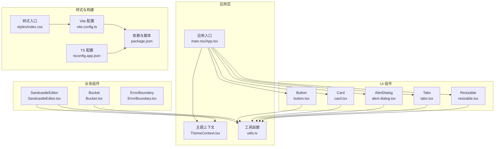

图表来源

- [apps/cesium-web/src/components/ui/button.tsx:1-63](file://apps/cesium-web/src/components/ui/button.tsx#L1-L63)
- [apps/cesium-web/src/components/ui/card.tsx:1-57](file://apps/cesium-web/src/components/ui/card.tsx#L1-L57)
- [apps/cesium-web/src/components/ui/alert-dialog.tsx:1-162](file://apps/cesium-web/src/components/ui/alert-dialog.tsx#L1-L162)
- [apps/cesium-web/src/components/ui/tabs.tsx:1-70](file://apps/cesium-web/src/components/ui/tabs.tsx#L1-L70)
- [apps/cesium-web/src/components/ui/resizable.tsx:1-46](file://apps/cesium-web/src/components/ui/resizable.tsx#L1-L46)
- [apps/cesium-web/src/contexts/ThemeContext.tsx:1-108](file://apps/cesium-web/src/contexts/ThemeContext.tsx#L1-L108)
- [apps/cesium-web/src/lib/utils.ts:1-7](file://apps/cesium-web/src/lib/utils.ts#L1-L7)
- [apps/cesium-web/src/components/SandcastleEditor/SandcastleEditor.tsx:1-73](file://apps/cesium-web/src/components/SandcastleEditor/SandcastleEditor.tsx#L1-L73)
- [apps/cesium-web/src/components/Bucket/Bucket.tsx:1-135](file://apps/cesium-web/src/components/Bucket/Bucket.tsx#L1-L135)
- [apps/cesium-web/src/styles/index.css:1-2](file://apps/cesium-web/src/styles/index.css#L1-L2)
- [apps/cesium-web/vite.config.ts:1-81](file://apps/cesium-web/vite.config.ts#L1-L81)
- [apps/cesium-web/package.json:1-51](file://apps/cesium-web/package.json#L1-L51)

章节来源

- [apps/cesium-web/src/styles/index.css:1-2](file://apps/cesium-web/src/styles/index.css#L1-L2)
- [apps/cesium-web/vite.config.ts:1-81](file://apps/cesium-web/vite.config.ts#L1-L81)
- [apps/cesium-web/package.json:1-51](file://apps/cesium-web/package.json#L1-L51)

## 核心组件

本节概述基础与复合组件的职责、接口与样式策略，帮助快速理解组件族谱与使用方式。

- Button：提供多变体与多尺寸的按钮，支持 asChild 透传与无障碍增强
- Card：卡片容器及其语义化子块（头、标题、描述、内容、操作、页脚）
- AlertDialog：基于 Radix UI 的对话框体系，支持尺寸、动作按钮与媒体区域
- Tabs：标签页容器，支持横向/纵向与多种列表样式变体
- Resizable：面板分栏与拖拽调整，提供带手柄的交互体验
- ThemeContext：主题模式切换与持久化，支持 light/dark/system
- SandcastleEditor：基于 Monaco 的代码编辑器，随主题切换自动适配
- Bucket：沙箱 iframe 容器，负责与沙箱通信与运行控制
- ErrorBoundary：错误边界，提供降级 UI 与重试机制

章节来源

- [apps/cesium-web/src/components/ui/button.tsx:1-63](file://apps/cesium-web/src/components/ui/button.tsx#L1-L63)
- [apps/cesium-web/src/components/ui/card.tsx:1-57](file://apps/cesium-web/src/components/ui/card.tsx#L1-L57)
- [apps/cesium-web/src/components/ui/alert-dialog.tsx:1-162](file://apps/cesium-web/src/components/ui/alert-dialog.tsx#L1-L162)
- [apps/cesium-web/src/components/ui/tabs.tsx:1-70](file://apps/cesium-web/src/components/ui/tabs.tsx#L1-L70)
- [apps/cesium-web/src/components/ui/resizable.tsx:1-46](file://apps/cesium-web/src/components/ui/resizable.tsx#L1-L46)
- [apps/cesium-web/src/contexts/ThemeContext.tsx:1-108](file://apps/cesium-web/src/contexts/ThemeContext.tsx#L1-L108)
- [apps/cesium-web/src/components/SandcastleEditor/SandcastleEditor.tsx:1-73](file://apps/cesium-web/src/components/SandcastleEditor/SandcastleEditor.tsx#L1-L73)
- [apps/cesium-web/src/components/Bucket/Bucket.tsx:1-135](file://apps/cesium-web/src/components/Bucket/Bucket.tsx#L1-L135)
- [apps/cesium-web/src/components/ErrorBoundary/ErrorBoundary.tsx:1-130](file://apps/cesium-web/src/components/ErrorBoundary/ErrorBoundary.tsx#L1-L130)

## 架构总览

组件库围绕“原子组件 + 复合组件 + 主题上下文 + 工具函数”的分层设计展开，样式通过 TailwindCSS 与 class-variance-authority 实现变体与合并，构建链路由 Vite + SWC + TailwindCSS 插件组成。

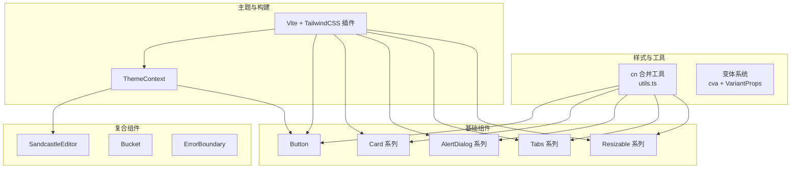

图表来源

- [apps/cesium-web/src/lib/utils.ts:1-7](file://apps/cesium-web/src/lib/utils.ts#L1-L7)
- [apps/cesium-web/src/contexts/ThemeContext.tsx:1-108](file://apps/cesium-web/src/contexts/ThemeContext.tsx#L1-L108)
- [apps/cesium-web/vite.config.ts:1-81](file://apps/cesium-web/vite.config.ts#L1-L81)

## 组件详细分析

### Button 组件

- 设计要点
  - 使用变体系统定义外观（如 default、destructive、outline、secondary、ghost、link）
  - 使用尺寸系统定义高宽与内边距（如 default、xs、sm、lg、icon 系列）
  - 支持 asChild 透传至 Slot.Root，便于组合链接或自定义元素
  - 通过 data-slot、data-variant、data-size 标识，利于样式与测试定位
  - 无障碍增强：聚焦可见性、禁用态、无效态（aria-invalid）等
- 属性接口
  - className：额外样式类
  - variant：变体枚举
  - size：尺寸枚举
  - asChild：是否透传为子节点
  - 其余继承自原生 button
- 样式与交互
  - 通过 cn 合并与变体计算，确保样式冲突最小化
  - 焦点环、悬停、禁用、无效态均有明确视觉反馈
- 可访问性
  - 保留原生 button 的可访问语义
  - 通过聚焦与 ring 辅助键盘导航
- 扩展接口
  - 可通过传入 className 覆盖默认样式
  - 可结合 asChild 与自定义元素组合使用

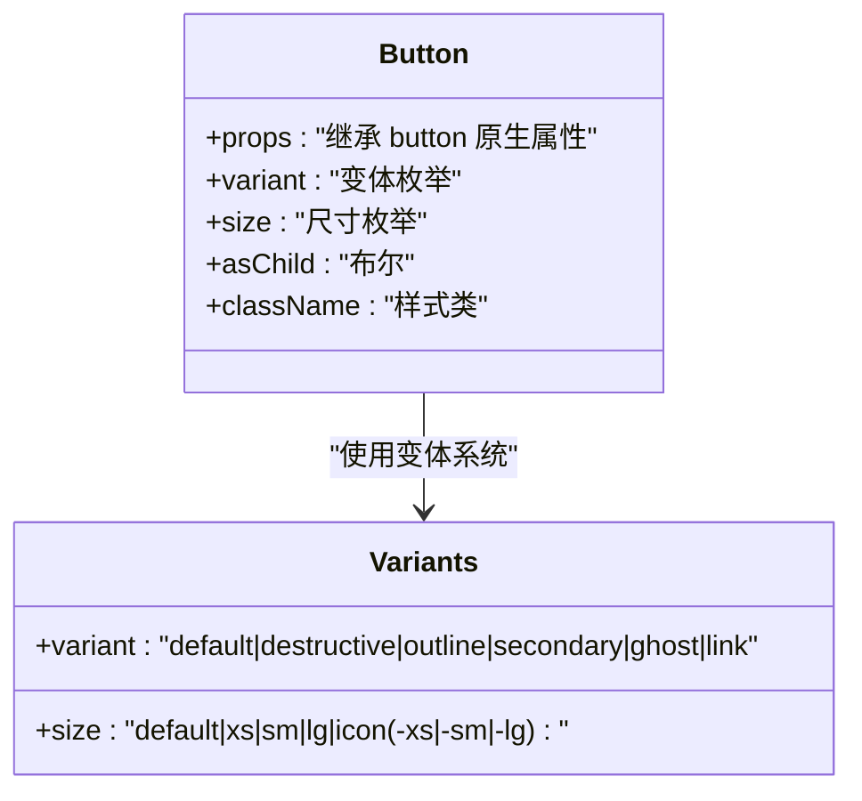

图表来源

- [apps/cesium-web/src/components/ui/button.tsx:7-37](file://apps/cesium-web/src/components/ui/button.tsx#L7-L37)

章节来源

- [apps/cesium-web/src/components/ui/button.tsx:1-63](file://apps/cesium-web/src/components/ui/button.tsx#L1-L63)
- [apps/cesium-web/src/lib/utils.ts:1-7](file://apps/cesium-web/src/lib/utils.ts#L1-L7)

### Card 组件族

- 设计要点
  - 卡片容器与语义化子块解耦，便于灵活组合
  - 通过 data-slot 标识各子块，利于样式与测试
  - 响应式网格与对齐逻辑，支持操作区与标题描述的自适应排布
- 子组件
  - Card：卡片根容器
  - CardHeader/CardTitle/CardDescription/CardAction/CardContent/CardFooter：语义化区块
- 样式与交互
  - 统一圆角、阴影、边框与背景色
  - 操作区支持右对齐与自适应布局
- 可访问性
  - 语义化结构，配合标题与描述提升可读性
- 扩展接口
  - 通过 className 覆盖默认样式
  - 可按需组合子块，满足不同布局需求

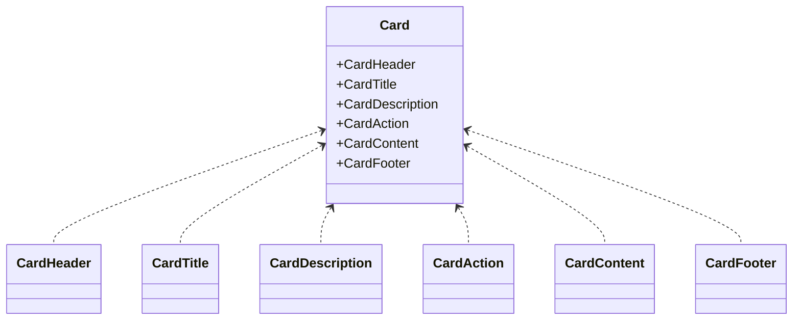

图表来源

- [apps/cesium-web/src/components/ui/card.tsx:5-56](file://apps/cesium-web/src/components/ui/card.tsx#L5-L56)

章节来源

- [apps/cesium-web/src/components/ui/card.tsx:1-57](file://apps/cesium-web/src/components/ui/card.tsx#L1-L57)

### AlertDialog 组件族

- 设计要点
  - 基于 Radix UI 的可访问性与无障碍语义
  - 支持 default/sm 两种尺寸，内容区具备入场/出场动画
  - 动作按钮复用 Button，统一变体与尺寸
  - 媒体区支持图标占位与响应式布局
- 子组件
  - Root/Trigger/Portal/Overlay/Content/Title/Description/Media/Action/Cancel/Header/Footer
- 交互行为
  - 触发器打开/关闭对话框
  - Overlay 支持点击外部关闭
  - Action/Cancel 透传 Button，保持一致风格
- 可访问性
  - 自动管理焦点、隐藏背景滚动、支持键盘关闭
- 扩展接口
  - 通过 size 控制内容宽度
  - 通过 className 覆盖默认样式

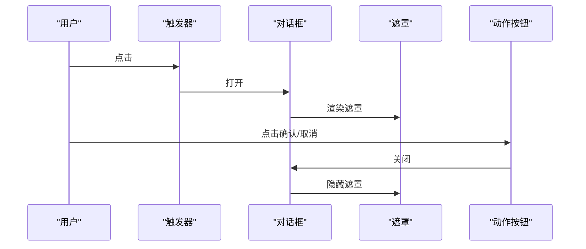

图表来源

- [apps/cesium-web/src/components/ui/alert-dialog.tsx:7-53](file://apps/cesium-web/src/components/ui/alert-dialog.tsx#L7-L53)
- [apps/cesium-web/src/components/ui/alert-dialog.tsx:120-146](file://apps/cesium-web/src/components/ui/alert-dialog.tsx#L120-L146)

章节来源

- [apps/cesium-web/src/components/ui/alert-dialog.tsx:1-162](file://apps/cesium-web/src/components/ui/alert-dialog.tsx#L1-L162)

### Tabs 组件族

- 设计要点
  - 支持横向/纵向两种方向
  - 列表支持 default 与 line 两种变体
  - 触发器激活态具备指示线，支持水平/垂直差异
- 子组件
  - Tabs/TabsList/TabsTrigger/TabsContent
- 样式与交互
  - 通过 data-orientation 与 data-variant 控制布局与激活态样式
  - 悬停与聚焦具备清晰反馈
- 可访问性
  - 基于 Radix UI 的键盘导航与 ARIA 属性
- 扩展接口
  - 通过 variant 与 orientation 控制外观与方向

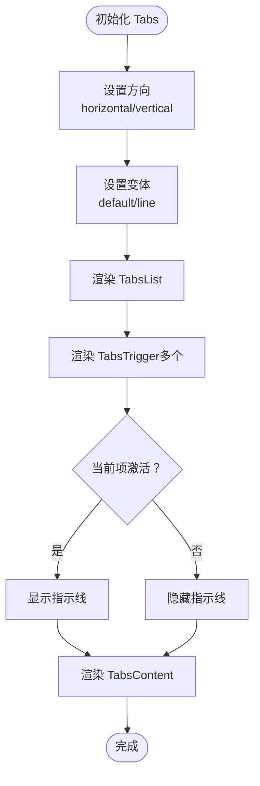

图表来源

- [apps/cesium-web/src/components/ui/tabs.tsx:7-67](file://apps/cesium-web/src/components/ui/tabs.tsx#L7-L67)

章节来源

- [apps/cesium-web/src/components/ui/tabs.tsx:1-70](file://apps/cesium-web/src/components/ui/tabs.tsx#L1-L70)

### Resizable 组件族

- 设计要点
  - 基于 react-resizable-panels，提供面板分组与可调分隔条
  - 分隔条支持方向（水平/垂直）与手柄可视化
  - 通过 aria-\* 属性提供可访问性提示
- 子组件
  - ResizablePanelGroup/ResizablePanel/ResizableHandle
- 交互行为
  - 拖拽调整面板尺寸，支持键盘微调（依赖底层库）
- 可访问性
  - 通过 focus-visible 与 aria 属性提升可用性
- 扩展接口
  - 通过 withHandle 开启手柄显示
  - 通过 className 覆盖默认样式

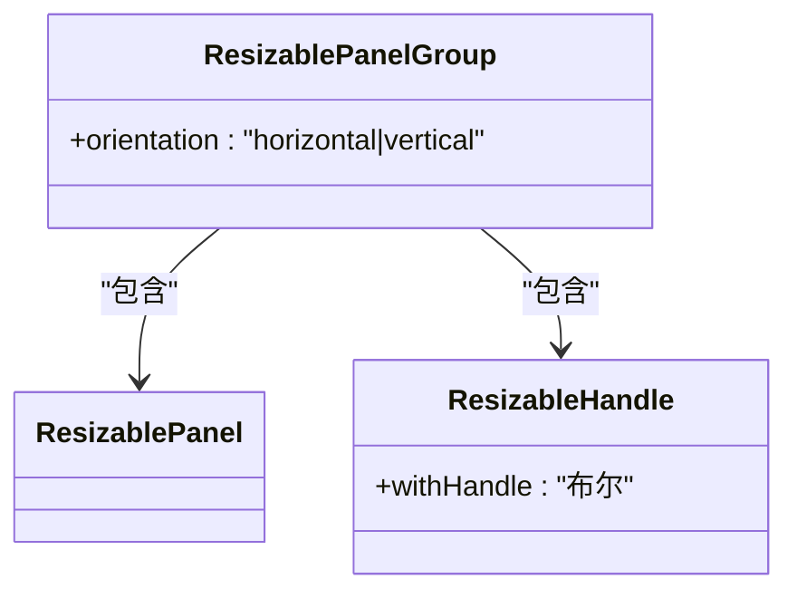

图表来源

- [apps/cesium-web/src/components/ui/resizable.tsx:6-43](file://apps/cesium-web/src/components/ui/resizable.tsx#L6-L43)

章节来源

- [apps/cesium-web/src/components/ui/resizable.tsx:1-46](file://apps/cesium-web/src/components/ui/resizable.tsx#L1-L46)

### SandcastleEditor 组件

- 设计要点
  - 基于 Monaco Editor，提供代码编辑能力
  - 主题随 ThemeContext 切换，自动适配 vs-dark/light
  - 默认配置优化：禁用 minimap、自动布局、固定字体等
- 属性接口
  - value：当前代码内容
  - language：编程语言，默认 javascript
  - onChange：内容变更回调
- 可访问性
  - 依托 Monaco 的键盘导航与屏幕阅读器支持
- 扩展接口
  - 可通过 onChange 与 value 双向绑定
  - 可通过 className 覆盖容器样式

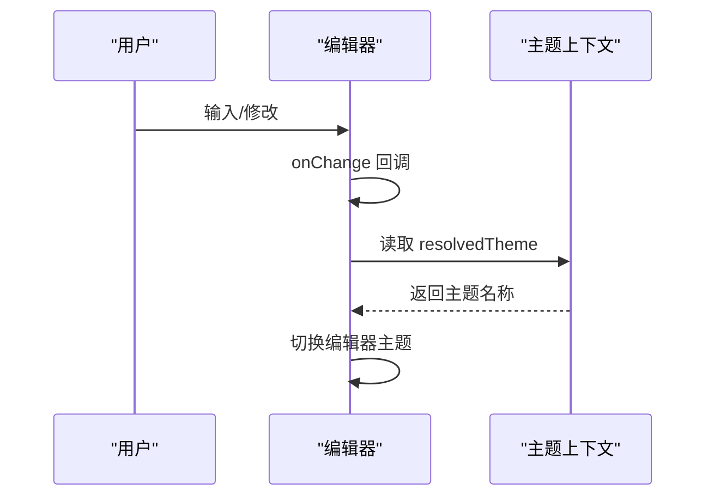

图表来源

- [apps/cesium-web/src/components/SandcastleEditor/SandcastleEditor.tsx:44-68](file://apps/cesium-web/src/components/SandcastleEditor/SandcastleEditor.tsx#L44-L68)
- [apps/cesium-web/src/contexts/ThemeContext.tsx:101-107](file://apps/cesium-web/src/contexts/ThemeContext.tsx#L101-L107)

章节来源

- [apps/cesium-web/src/components/SandcastleEditor/SandcastleEditor.tsx:1-73](file://apps/cesium-web/src/components/SandcastleEditor/SandcastleEditor.tsx#L1-L73)
- [apps/cesium-web/src/contexts/ThemeContext.tsx:1-108](file://apps/cesium-web/src/contexts/ThemeContext.tsx#L1-L108)

### Bucket 组件

- 设计要点
  - 通过 iframe sandbox 与 IframeBridge 实现安全隔离与双向通信
  - 支持运行计数器触发重新执行
  - 控制台消息与高亮行号回传
- 属性接口
  - code：要执行的代码
  - html：注入的 HTML
  - runNumber：运行计数器
  - highlightLine：高亮行号回调
  - appendConsole/resetConsole：控制台消息与重置回调
- 交互行为
  - 监听 bucketReady，准备后发送 runCode
  - 处理 consoleLog/consoleError/consoleWarn/highlight 等消息
- 可访问性
  - 通过 iframe sandbox 降低风险，避免与宿主页面冲突
- 扩展接口
  - 可通过 className 控制 iframe 容器样式
  - 可通过沙箱模板嵌入自定义逻辑

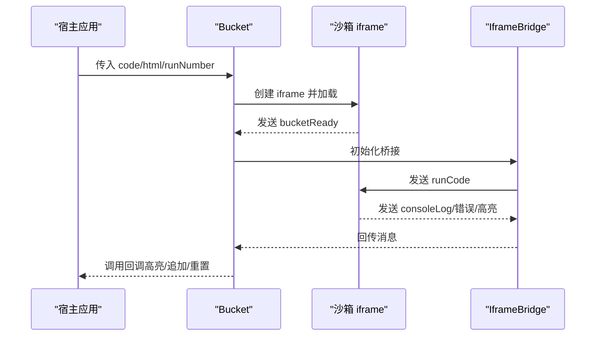

图表来源

- [apps/cesium-web/src/components/Bucket/Bucket.tsx:53-110](file://apps/cesium-web/src/components/Bucket/Bucket.tsx#L53-L110)
- [apps/cesium-web/src/components/Bucket/Bucket.scss:1-9](file://apps/cesium-web/src/components/Bucket/Bucket.scss#L1-L9)

章节来源

- [apps/cesium-web/src/components/Bucket/Bucket.tsx:1-135](file://apps/cesium-web/src/components/Bucket/Bucket.tsx#L1-L135)
- [apps/cesium-web/src/components/Bucket/Bucket.scss:1-9](file://apps/cesium-web/src/components/Bucket/Bucket.scss#L1-L9)

### ErrorBoundary 组件

- 设计要点
  - 捕获子树渲染期错误，提供降级 UI 与重试机制
  - 支持自定义 fallback，优先级高于默认 UI
- 属性接口
  - children：子组件
  - fallback：自定义降级 UI
- 交互行为
  - 捕获错误后渲染降级 UI，并允许用户重试
- 可访问性
  - 降级 UI 提供清晰的错误提示与可点击的重试按钮
- 扩展接口
  - 可通过 fallback 自定义错误页

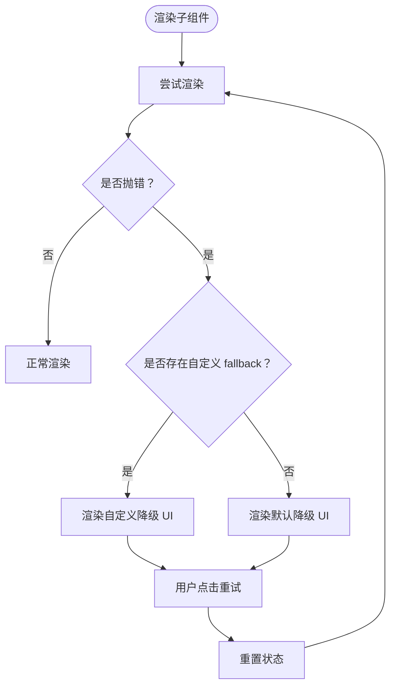

图表来源

- [apps/cesium-web/src/components/ErrorBoundary/ErrorBoundary.tsx:50-123](file://apps/cesium-web/src/components/ErrorBoundary/ErrorBoundary.tsx#L50-L123)

章节来源

- [apps/cesium-web/src/components/ErrorBoundary/ErrorBoundary.tsx:1-130](file://apps/cesium-web/src/components/ErrorBoundary/ErrorBoundary.tsx#L1-L130)

## 依赖关系分析

- 样式与工具
  - cn 工具：统一类名合并与冲突修复
  - class-variance-authority：变体系统，支持条件样式组合
  - TailwindCSS：原子化样式与响应式断点
- 组件依赖
  - Button、Card、AlertDialog、Tabs、Resizable 均依赖 cn 与变体系统
  - SandcastleEditor 依赖 ThemeContext 与 Monaco
  - Bucket 依赖 IframeBridge 与沙箱模板
- 构建与运行
  - Vite + SWC + TailwindCSS 插件，支持路径别名与生产优化
  - TypeScript 严格模式，路径别名 @/\* 指向 src

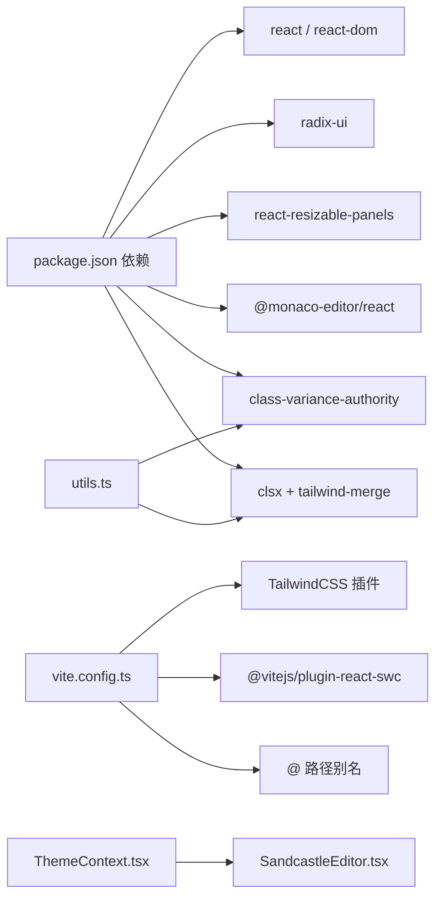

图表来源

- [apps/cesium-web/package.json:12-28](file://apps/cesium-web/package.json#L12-L28)
- [apps/cesium-web/vite.config.ts:1-81](file://apps/cesium-web/vite.config.ts#L1-L81)
- [apps/cesium-web/src/lib/utils.ts:1-7](file://apps/cesium-web/src/lib/utils.ts#L1-L7)
- [apps/cesium-web/src/contexts/ThemeContext.tsx:1-108](file://apps/cesium-web/src/contexts/ThemeContext.tsx#L1-L108)
- [apps/cesium-web/src/components/SandcastleEditor/SandcastleEditor.tsx:1-73](file://apps/cesium-web/src/components/SandcastleEditor/SandcastleEditor.tsx#L1-L73)

章节来源

- [apps/cesium-web/package.json:1-51](file://apps/cesium-web/package.json#L1-L51)
- [apps/cesium-web/vite.config.ts:1-81](file://apps/cesium-web/vite.config.ts#L1-L81)
- [apps/cesium-web/tsconfig.app.json:1-34](file://apps/cesium-web/tsconfig.app.json#L1-L34)

## 性能考量

- 样式与类名
  - 使用 cn 合并类名，避免重复与冲突；变体系统按需组合，减少冗余样式
- 组件渲染
  - 对重型组件（如 SandcastleEditor）使用 memo 降低重渲染
  - Bucket 通过运行计数器触发 reload，避免不必要的重复执行
- 构建优化
  - 生产环境启用 Terser 压缩，移除 console 与 debugger
  - 文件名带哈希，利于缓存与增量更新
- 主题切换
  - ThemeContext 仅在 mode 或 resolvedTheme 变化时更新 DOM class 与存储，避免频繁重绘

[本节为通用指导，无需列出章节来源]

## 故障排查指南

- Button 无效态与聚焦态异常
  - 检查 aria-invalid 与 focus-visible 样式是否正确应用
  - 确认 variant/size 与 data-\* 属性一致
- AlertDialog 无法关闭或焦点丢失
  - 确认 Trigger/Overlay/Content 的组合是否完整
  - 检查 Portal 是否挂载到正确容器
- Tabs 激活态指示线不显示
  - 检查 data-orientation 与 data-variant 是否匹配
  - 确认激活状态 data-state 是否正确传递
- Resizable 分隔条不可拖拽
  - 检查 orientation 与 aria-\* 属性
  - 确认 react-resizable-panels 版本与事件绑定
- SandcastleEditor 主题不生效
  - 检查 ThemeContext 的 resolvedTheme 值
  - 确认编辑器 theme 与 resolvedTheme 的映射
- Bucket 无法接收控制台消息
  - 检查 iframeBridge 初始化与消息监听
  - 确认沙箱 ready 信号与 runCode 发送顺序
- ErrorBoundary 未捕获错误
  - 确认错误发生在渲染期/生命周期/构造函数
  - 避免在事件处理器或异步回调中未捕获的错误

章节来源

- [apps/cesium-web/src/components/ui/button.tsx:1-63](file://apps/cesium-web/src/components/ui/button.tsx#L1-L63)
- [apps/cesium-web/src/components/ui/alert-dialog.tsx:1-162](file://apps/cesium-web/src/components/ui/alert-dialog.tsx#L1-L162)
- [apps/cesium-web/src/components/ui/tabs.tsx:1-70](file://apps/cesium-web/src/components/ui/tabs.tsx#L1-L70)
- [apps/cesium-web/src/components/ui/resizable.tsx:1-46](file://apps/cesium-web/src/components/ui/resizable.tsx#L1-L46)
- [apps/cesium-web/src/components/SandcastleEditor/SandcastleEditor.tsx:1-73](file://apps/cesium-web/src/components/SandcastleEditor/SandcastleEditor.tsx#L1-L73)
- [apps/cesium-web/src/components/Bucket/Bucket.tsx:1-135](file://apps/cesium-web/src/components/Bucket/Bucket.tsx#L1-L135)
- [apps/cesium-web/src/components/ErrorBoundary/ErrorBoundary.tsx:1-130](file://apps/cesium-web/src/components/ErrorBoundary/ErrorBoundary.tsx#L1-L130)

## 结论

本组件库以“可组合、可变体、可访问”为核心设计原则，通过变体系统与工具函数实现一致的样式与交互体验；通过主题上下文与构建配置保障跨浏览器与跨设备的稳定性。复合组件在保证语义化与可访问性的前提下，提供了灵活的扩展接口与良好的开发体验。

[本节为总结性内容，无需列出章节来源]

## 附录

### 可访问性支持清单

- 基础组件
  - Button：保留原生语义，聚焦可见性与禁用态
  - AlertDialog：自动焦点管理、键盘关闭、遮罩点击关闭
  - Tabs：键盘导航、ARIA 属性、激活态指示
- 复合组件
  - SandcastleEditor：Monaco 的可访问性特性
  - Bucket：iframe sandbox 降低风险
  - ErrorBoundary：降级 UI 提供清晰提示

章节来源

- [apps/cesium-web/src/components/ui/button.tsx:1-63](file://apps/cesium-web/src/components/ui/button.tsx#L1-L63)
- [apps/cesium-web/src/components/ui/alert-dialog.tsx:1-162](file://apps/cesium-web/src/components/ui/alert-dialog.tsx#L1-L162)
- [apps/cesium-web/src/components/ui/tabs.tsx:1-70](file://apps/cesium-web/src/components/ui/tabs.tsx#L1-L70)
- [apps/cesium-web/src/components/SandcastleEditor/SandcastleEditor.tsx:1-73](file://apps/cesium-web/src/components/SandcastleEditor/SandcastleEditor.tsx#L1-L73)
- [apps/cesium-web/src/components/Bucket/Bucket.tsx:1-135](file://apps/cesium-web/src/components/Bucket/Bucket.tsx#L1-L135)
- [apps/cesium-web/src/components/ErrorBoundary/ErrorBoundary.tsx:1-130](file://apps/cesium-web/src/components/ErrorBoundary/ErrorBoundary.tsx#L1-L130)

### 响应式设计与跨浏览器兼容性

- 响应式
  - 使用 Tailwind 断点与相对单位，确保在小屏与大屏均良好展示
  - 组件内部通过 data-slot 与 data-\* 属性驱动条件样式
- 兼容性
  - 构建目标 ES2022，使用现代浏览器特性
  - 通过插件与 polyfill 策略（如需要）保证旧环境可用

章节来源

- [apps/cesium-web/src/styles/index.css:1-2](file://apps/cesium-web/src/styles/index.css#L1-L2)
- [apps/cesium-web/vite.config.ts:1-81](file://apps/cesium-web/vite.config.ts#L1-L81)
- [apps/cesium-web/tsconfig.app.json:1-34](file://apps/cesium-web/tsconfig.app.json#L1-L34)

### 主题适配、样式定制与扩展接口

- 主题适配
  - ThemeContext 提供 light/dark/system 三种模式，持久化到 localStorage
  - DOM 根节点添加/移除 dark class，联动全局样式
- 样式定制
  - cn 工具统一类名合并，避免冲突
  - 变体系统按需组合，支持覆盖默认样式
- 扩展接口
  - 组件均支持 className 透传
  - 复合组件支持通过 props 传递配置（如 size、variant、orientation）

章节来源

- [apps/cesium-web/src/contexts/ThemeContext.tsx:1-108](file://apps/cesium-web/src/contexts/ThemeContext.tsx#L1-L108)
- [apps/cesium-web/src/lib/utils.ts:1-7](file://apps/cesium-web/src/lib/utils.ts#L1-L7)
- [apps/cesium-web/src/components/ui/button.tsx:1-63](file://apps/cesium-web/src/components/ui/button.tsx#L1-L63)
- [apps/cesium-web/src/components/ui/alert-dialog.tsx:1-162](file://apps/cesium-web/src/components/ui/alert-dialog.tsx#L1-L162)
- [apps/cesium-web/src/components/ui/tabs.tsx:1-70](file://apps/cesium-web/src/components/ui/tabs.tsx#L1-L70)
- [apps/cesium-web/src/components/ui/resizable.tsx:1-46](file://apps/cesium-web/src/components/ui/resizable.tsx#L1-L46)

### 组件测试策略、文档生成与版本管理

- 测试策略
  - 单元测试：针对 Button、Card、Tabs 等组件的变体与交互进行快照与行为测试
  - 可访问性测试：使用 axe 或类似工具验证 ARIA 与键盘导航
  - 端到端测试：对 Bucket 与 SandcastleEditor 的交互流程进行录制与回归
- 文档生成
  - 使用 Storybook 或自建文档站点，基于组件源码生成 API 文档与示例
  - 为每个组件提供属性表格、变体示例与可访问性说明
- 版本管理
  - 采用语义化版本，遵循变更日志规范
  - 通过 CI 在 PR 中自动校验 lint、测试与构建

[本节为通用指导，无需列出章节来源]

### 组件开发规范、命名约定与最佳实践

- 命名约定
  - 组件文件：PascalCase.tsx，样式文件：同名同目录
  - 数据属性：data-slot、data-variant、data-size、data-orientation 等
- 最佳实践
  - 优先使用变体系统与 className 透传，避免硬编码样式
  - 保持语义化结构，提供可访问性属性
  - 对重型组件使用 memo，减少重渲染
  - 通过 ThemeContext 与 TailwindCSS 实现主题一致性

[本节为通用指导，无需列出章节来源]
