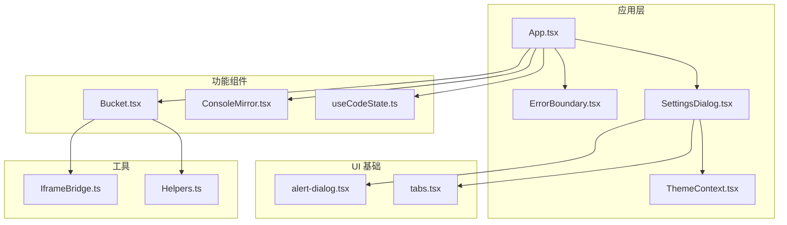
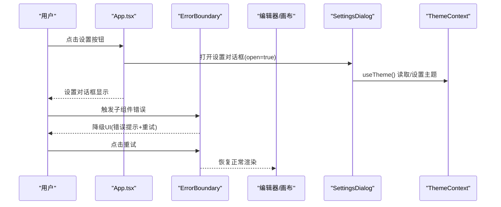
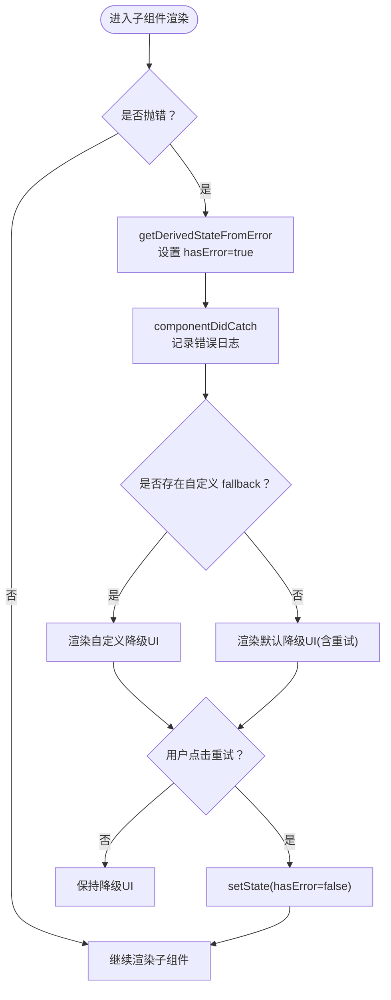
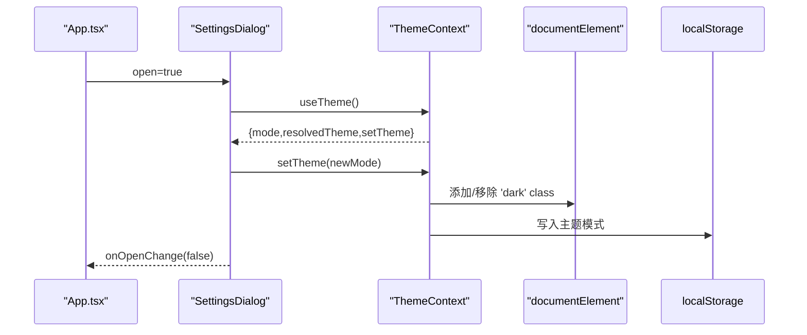
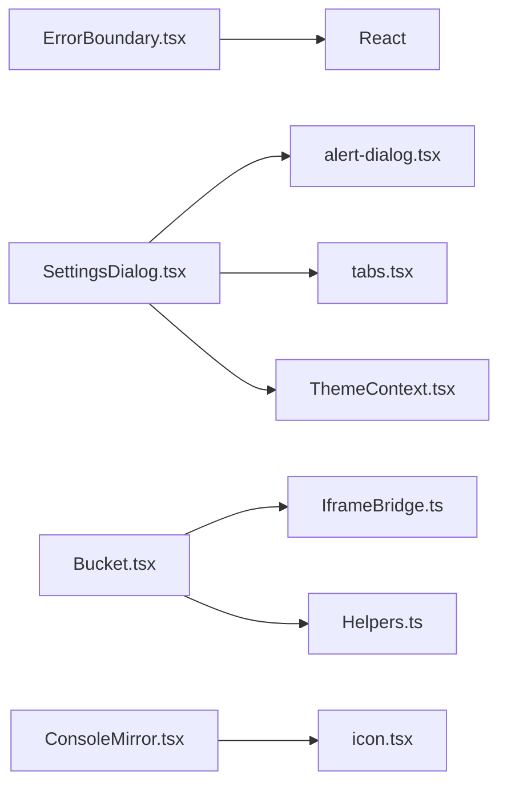

# 专用组件

<cite>
**本文引用的文件**
- [ErrorBoundary.tsx](file://apps/cesium-web/src/components/ErrorBoundary/ErrorBoundary.tsx)
- [SettingsDialog.tsx](file://apps/cesium-web/src/components/SettingsDialog/SettingsDialog.tsx)
- [ThemeContext.tsx](file://apps/cesium-web/src/contexts/ThemeContext.tsx)
- [App.tsx](file://apps/cesium-web/src/App.tsx)
- [alert-dialog.tsx](file://apps/cesium-web/src/components/ui/alert-dialog.tsx)
- [tabs.tsx](file://apps/cesium-web/src/components/ui/tabs.tsx)
- [useCodeState.ts](file://apps/cesium-web/src/hooks/useCodeState.ts)
- [Bucket.tsx](file://apps/cesium-web/src/components/Bucket/Bucket.tsx)
- [ConsoleMirror.tsx](file://apps/cesium-web/src/components/ConsoleMirror/ConsoleMirror.tsx)
- [IframeBridge.ts](file://apps/cesium-web/src/util/IframeBridge.ts)
- [Helpers.ts](file://apps/cesium-web/src/util/Helpers.ts)
</cite>

## 目录

1. [简介](#简介)
2. [项目结构](#项目结构)
3. [核心组件](#核心组件)
4. [架构总览](#架构总览)
5. [组件详解](#组件详解)
6. [依赖关系分析](#依赖关系分析)
7. [性能考量](#性能考量)
8. [故障排查指南](#故障排查指南)
9. [结论](#结论)
10. [附录](#附录)

## 简介

本文件聚焦两类“专用组件”的实现与使用：错误边界组件 ErrorBoundary 与设置对话框组件 SettingsDialog。前者用于在 React 子树中捕获 JavaScript 错误，避免整页崩溃；后者用于集中管理应用的用户偏好与配置项。文档将从实现原理、错误捕获机制、降级渲染策略、配置管理、状态持久化、上下文传递、生命周期管理、回调与扩展接口等方面进行深入剖析，并给出在复杂应用中的集成模式与调试技巧。

## 项目结构

- 专用组件位于应用层 src/components 下，分别承担错误兜底与设置管理职责。
- 设置对话框依赖主题上下文 ThemeContext，通过 useTheme 获取/更新主题模式。
- 错误边界包裹编辑器与可视化画布区域，确保局部错误不影响全局。
- UI 基础组件来自 src/components/ui，包括对话框与标签页组件。

图表来源

- [App.tsx:15-146](file://apps/cesium-web/src/App.tsx#L15-L146)
- [ErrorBoundary.tsx:50-123](file://apps/cesium-web/src/components/ErrorBoundary/ErrorBoundary.tsx#L50-L123)
- [SettingsDialog.tsx:19-147](file://apps/cesium-web/src/components/SettingsDialog/SettingsDialog.tsx#L19-L147)
- [ThemeContext.tsx:57-99](file://apps/cesium-web/src/contexts/ThemeContext.tsx#L57-L99)
- [alert-dialog.tsx:7-161](file://apps/cesium-web/src/components/ui/alert-dialog.tsx#L7-L161)
- [tabs.tsx:7-69](file://apps/cesium-web/src/components/ui/tabs.tsx#L7-L69)
- [Bucket.tsx:53-134](file://apps/cesium-web/src/components/Bucket/Bucket.tsx#L53-L134)
- [IframeBridge.ts:78-182](file://apps/cesium-web/src/util/IframeBridge.ts#L78-L182)
- [Helpers.ts:18-36](file://apps/cesium-web/src/util/Helpers.ts#L18-L36)

章节来源

- [App.tsx:15-146](file://apps/cesium-web/src/App.tsx#L15-L146)

## 核心组件

- ErrorBoundary：类组件，提供静态 getDerivedStateFromError 与实例 componentDidCatch 生命周期钩子，实现错误捕获与降级渲染。
- SettingsDialog：函数组件，基于 AlertDialog 与 Tabs，通过 useTheme 访问/修改主题模式；当前包含通用、编辑器、Cesium 三个配置分区，部分功能占位未实现。

章节来源

- [ErrorBoundary.tsx:50-123](file://apps/cesium-web/src/components/ErrorBoundary/ErrorBoundary.tsx#L50-L123)
- [SettingsDialog.tsx:19-147](file://apps/cesium-web/src/components/SettingsDialog/SettingsDialog.tsx#L19-L147)

## 架构总览

- 错误边界采用“子树兜底”策略：在编辑器与可视化区域分别包裹 ErrorBoundary，确保局部错误不影响整体 UI。
- 设置对话框通过 ThemeProvider 提供的主题上下文，实现主题模式的读取与持久化（localStorage）。
- Bucket 与 IframeBridge 协作，实现沙箱 iframe 的消息桥接与代码执行，ConsoleMirror 负责控制台镜像展示。

图表来源

- [App.tsx:20-21](file://apps/cesium-web/src/App.tsx#L20-L21)
- [App.tsx:73-112](file://apps/cesium-web/src/App.tsx#L73-L112)
- [App.tsx:122-131](file://apps/cesium-web/src/App.tsx#L122-L131)
- [SettingsDialog.tsx:19-147](file://apps/cesium-web/src/components/SettingsDialog/SettingsDialog.tsx#L19-L147)
- [ThemeContext.tsx:101-107](file://apps/cesium-web/src/contexts/ThemeContext.tsx#L101-L107)

## 组件详解

### ErrorBoundary 错误边界组件

- 设计目标：在子组件树中捕获渲染阶段、生命周期与构造函数中的错误，避免整页崩溃。
- 关键机制：
  - 静态 getDerivedStateFromError：当子组件抛错时，返回新的状态以进入降级渲染。
  - 实例 componentDidCatch：记录错误日志，便于开发调试。
  - 渲染分支：hasError 为真时优先使用 props.fallback，否则渲染默认降级 UI 并提供“重试”按钮。
- 适用范围与限制：
  - 无法捕获事件处理器、异步代码、服务端渲染中的错误。
  - 建议在关键区域（编辑器、可视化画布）包裹，避免影响其他模块。
- 降级渲染策略：
  - 支持自定义 fallback 节点；默认 UI 包含错误信息与重试按钮，点击后清空错误状态，尝试恢复。
- 回调与扩展：
  - 可通过 fallback 自定义错误 UI；若需上报错误，可在 componentDidCatch 中接入监控系统。

图表来源

- [ErrorBoundary.tsx:68-82](file://apps/cesium-web/src/components/ErrorBoundary/ErrorBoundary.tsx#L68-L82)
- [ErrorBoundary.tsx:90-122](file://apps/cesium-web/src/components/ErrorBoundary/ErrorBoundary.tsx#L90-L122)

章节来源

- [ErrorBoundary.tsx:50-123](file://apps/cesium-web/src/components/ErrorBoundary/ErrorBoundary.tsx#L50-L123)

### SettingsDialog 设置对话框组件

- 组件职责：提供统一的设置入口，包含通用、编辑器、Cesium 三大配置分区。
- 集成方式：
  - 通过 open/onOpenChange 与 App 状态联动，实现打开/关闭。
  - 使用 useTheme 读取/设置主题模式（light/dark/system），并持久化至 localStorage。
- 配置管理与状态持久化：
  - 主题模式通过 useReducer 管理，结合 useEffect 同步 DOM class 与 localStorage。
  - 系统主题监听：当 mode 为 system 时，监听 prefers-color-scheme 媒体查询变化，动态更新 resolvedTheme。
- 用户偏好存储：
  - 使用 localStorage 键名存储主题模式，重启后恢复。
- 未实现功能：
  - 通用与 Cesium 分区中的多个开关目前为占位，后续可扩展为真正的配置项。

图表来源

- [SettingsDialog.tsx:19-147](file://apps/cesium-web/src/components/SettingsDialog/SettingsDialog.tsx#L19-L147)
- [ThemeContext.tsx:57-99](file://apps/cesium-web/src/contexts/ThemeContext.tsx#L57-L99)

章节来源

- [SettingsDialog.tsx:19-147](file://apps/cesium-web/src/components/SettingsDialog/SettingsDialog.tsx#L19-L147)
- [ThemeContext.tsx:57-99](file://apps/cesium-web/src/contexts/ThemeContext.tsx#L57-L99)

### 组件生命周期与上下文传递

- ErrorBoundary 生命周期：
  - 构造函数初始化状态。
  - getDerivedStateFromError 在错误发生时派生新状态。
  - componentDidCatch 记录错误信息。
  - render 根据状态选择降级 UI 或子组件。
- SettingsDialog 生命周期：
  - 函数组件无实例生命周期，依赖 useTheme 提供的状态与 setter。
  - 通过 ThemeProvider 在根部注入上下文，保证子树可访问。
- 上下文传递：
  - ThemeProvider 使用 useReducer 管理状态，useEffect 同步 DOM 与存储。
  - App 通过 useTheme 获取 resolvedTheme 与 setTheme，用于侧边栏主题切换与设置对话框主题选择。

章节来源

- [ErrorBoundary.tsx:55-82](file://apps/cesium-web/src/components/ErrorBoundary/ErrorBoundary.tsx#L55-L82)
- [ThemeContext.tsx:57-99](file://apps/cesium-web/src/contexts/ThemeContext.tsx#L57-L99)
- [App.tsx:15-70](file://apps/cesium-web/src/App.tsx#L15-L70)

### 配置参数、回调与扩展接口

- ErrorBoundary
  - Props
    - children：子组件节点
    - fallback：可选的自定义降级 UI
  - 扩展建议
    - 在 componentDidCatch 中接入错误上报（如 Sentry、自研埋点）
    - 提供更多降级策略（如“复制错误信息”、“跳转帮助页”）
- SettingsDialog
  - Props
    - open：是否打开
    - onOpenChange：打开/关闭回调
  - 扩展建议
    - 通用分区：启用调试模式、控制台镜像、自动运行等开关
    - Cesium 分区：地形、信息框等选项
    - 本地化与多语言支持
    - 导入/导出配置（JSON）

章节来源

- [ErrorBoundary.tsx:6-11](file://apps/cesium-web/src/components/ErrorBoundary/ErrorBoundary.tsx#L6-L11)
- [SettingsDialog.tsx:14-17](file://apps/cesium-web/src/components/SettingsDialog/SettingsDialog.tsx#L14-L17)

### 在复杂应用中的集成模式

- 错误边界集成模式
  - 在编辑器区域与可视化画布区域分别包裹 ErrorBoundary，实现“局部兜底”。
  - 在关键业务模块（如地图渲染、脚本执行）外层增加 ErrorBoundary，避免单点故障扩散。
  - 对于第三方组件，建议在其外层包裹，减少未知错误对应用的影响。
- 设置对话框集成模式
  - 通过 App 状态管理 open/onOpenChange，统一控制打开/关闭。
  - 与主题上下文配合，实现主题切换与持久化。
  - 可扩展为“全局设置中心”，集中管理多模块配置。

章节来源

- [App.tsx:73-112](file://apps/cesium-web/src/App.tsx#L73-L112)
- [App.tsx:122-131](file://apps/cesium-web/src/App.tsx#L122-L131)
- [App.tsx:142-142](file://apps/cesium-web/src/App.tsx#L142-L142)

## 依赖关系分析

- ErrorBoundary 依赖 React 组件模型，无需外部 UI 库。
- SettingsDialog 依赖：
  - AlertDialog 与 Tabs（来自 ui 子目录）
  - useTheme（来自 ThemeContext）
  - Icon（来自 icon 组件）
- Bucket 与 IframeBridge 协作，实现沙箱 iframe 的消息桥接与代码执行。
- ConsoleMirror 作为控制台镜像占位组件，后续可扩展为真实控制台 UI。

图表来源

- [ErrorBoundary.tsx:1-1](file://apps/cesium-web/src/components/ErrorBoundary/ErrorBoundary.tsx#L1-L1)
- [SettingsDialog.tsx:1-12](file://apps/cesium-web/src/components/SettingsDialog/SettingsDialog.tsx#L1-L12)
- [alert-dialog.tsx:1-9](file://apps/cesium-web/src/components/ui/alert-dialog.tsx#L1-L9)
- [tabs.tsx:1-6](file://apps/cesium-web/src/components/ui/tabs.tsx#L1-L6)
- [ThemeContext.tsx:1-1](file://apps/cesium-web/src/contexts/ThemeContext.tsx#L1-L1)
- [Bucket.tsx:1-6](file://apps/cesium-web/src/components/Bucket/Bucket.tsx#L1-L6)
- [IframeBridge.ts:78-182](file://apps/cesium-web/src/util/IframeBridge.ts#L78-L182)
- [Helpers.ts:18-36](file://apps/cesium-web/src/util/Helpers.ts#L18-L36)
- [ConsoleMirror.tsx:1-2](file://apps/cesium-web/src/components/ConsoleMirror/ConsoleMirror.tsx#L1-L2)

章节来源

- [App.tsx:11-12](file://apps/cesium-web/src/App.tsx#L11-L12)
- [App.tsx:142-142](file://apps/cesium-web/src/App.tsx#L142-L142)

## 性能考量

- ErrorBoundary
  - 仅在错误发生时切换到降级 UI，正常渲染成本几乎为零。
  - 自定义 fallback 应尽量轻量，避免引入额外计算。
- SettingsDialog
  - 通过 useTheme 读取/设置主题，避免不必要的重渲染。
  - Tabs 与 AlertDialog 为轻量 UI 组件，性能开销较小。
- Bucket 与 IframeBridge
  - 通过 runNumber 触发 reload，避免频繁重建 iframe。
  - 消息桥接采用信封结构与来源校验，减少无关消息处理。

[本节为通用性能讨论，不直接分析特定文件]

## 故障排查指南

- ErrorBoundary 常见问题
  - 事件处理器中的错误不会被捕获：需在事件处理器内使用 try/catch。
  - 异步错误未捕获：需在 Promise.catch 或 async/await 中处理。
  - 服务端渲染错误：SSR 场景下无法捕获客户端错误，需在客户端挂载后使用。
  - 降级 UI 不显示：确认 hasError 状态是否被正确派生与更新。
- SettingsDialog 常见问题
  - 主题未持久化：检查 localStorage 写入与 DOM class 同步逻辑。
  - 系统主题未生效：确认媒体查询监听是否注册与注销。
  - 未实现功能：通用与 Cesium 分区的开关需逐步实现。
- 调试技巧
  - 在 ErrorBoundary 的 componentDidCatch 中输出错误堆栈与 componentStack。
  - 使用浏览器开发者工具查看 localStorage 中的主题键值。
  - 在 SettingsDialog 中通过按钮切换主题，观察 DOM class 变化。

章节来源

- [ErrorBoundary.tsx:29-34](file://apps/cesium-web/src/components/ErrorBoundary/ErrorBoundary.tsx#L29-L34)
- [ErrorBoundary.tsx:79-82](file://apps/cesium-web/src/components/ErrorBoundary/ErrorBoundary.tsx#L79-L82)
- [ThemeContext.tsx:64-88](file://apps/cesium-web/src/contexts/ThemeContext.tsx#L64-L88)

## 结论

- ErrorBoundary 通过 React 错误边界机制实现了可靠的局部错误兜底，适合在关键区域部署，保障用户体验。
- SettingsDialog 以对话框形式提供统一的配置入口，结合 ThemeContext 实现主题模式的读取、设置与持久化。
- 在复杂应用中，建议将错误边界与设置对话框作为基础设施组件，围绕它们构建更完善的配置与容错体系。

[本节为总结性内容，不直接分析特定文件]

## 附录

- 代码片段路径参考
  - 错误边界实现：[ErrorBoundary.tsx:50-123](file://apps/cesium-web/src/components/ErrorBoundary/ErrorBoundary.tsx#L50-L123)
  - 设置对话框实现：[SettingsDialog.tsx:19-147](file://apps/cesium-web/src/components/SettingsDialog/SettingsDialog.tsx#L19-L147)
  - 主题上下文实现：[ThemeContext.tsx:57-99](file://apps/cesium-web/src/contexts/ThemeContext.tsx#L57-L99)
  - 应用集成示例：[App.tsx:73-112](file://apps/cesium-web/src/App.tsx#L73-L112), [App.tsx:122-131](file://apps/cesium-web/src/App.tsx#L122-L131), [App.tsx:142-142](file://apps/cesium-web/src/App.tsx#L142-L142)
  - UI 基础组件：[alert-dialog.tsx:7-161](file://apps/cesium-web/src/components/ui/alert-dialog.tsx#L7-L161), [tabs.tsx:7-69](file://apps/cesium-web/src/components/ui/tabs.tsx#L7-L69)
  - 代码状态管理：[useCodeState.ts:118-122](file://apps/cesium-web/src/hooks/useCodeState.ts#L118-L122)
  - 沙箱与桥接：[Bucket.tsx:53-134](file://apps/cesium-web/src/components/Bucket/Bucket.tsx#L53-L134), [IframeBridge.ts:78-182](file://apps/cesium-web/src/util/IframeBridge.ts#L78-L182)
  - 辅助工具：[Helpers.ts:18-36](file://apps/cesium-web/src/util/Helpers.ts#L18-L36)

[本节为参考清单，不直接分析特定文件]
