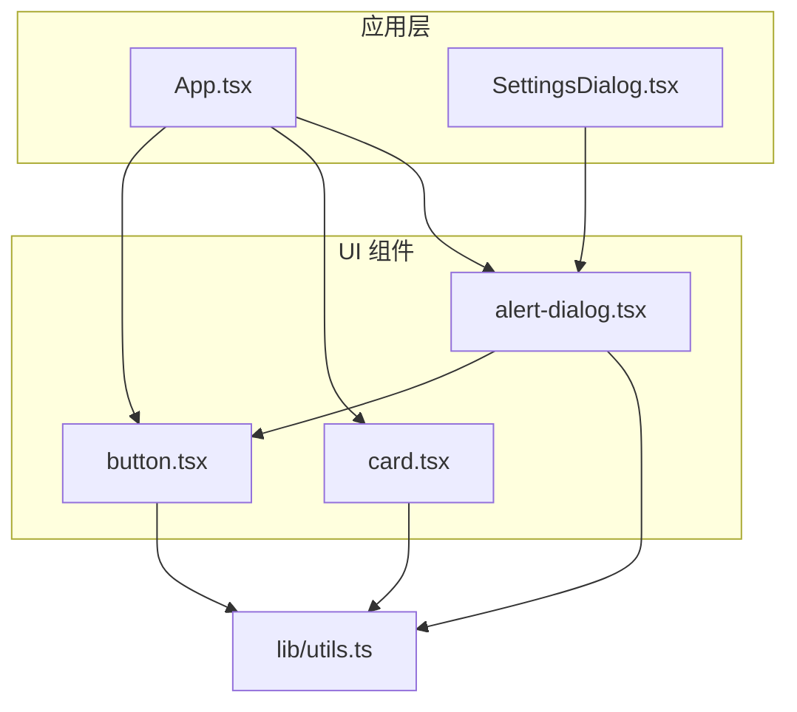
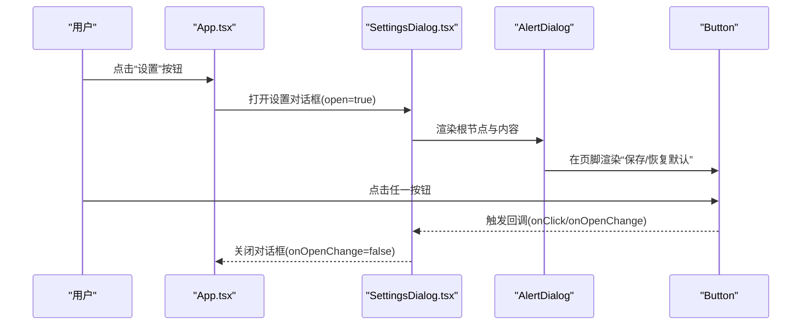
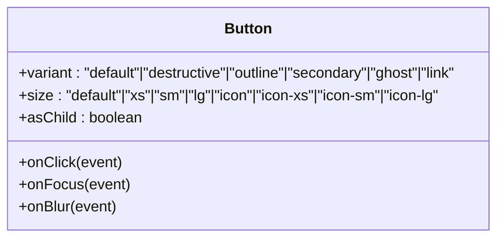
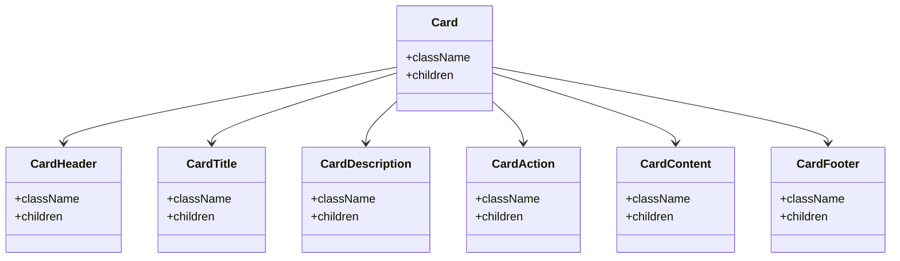
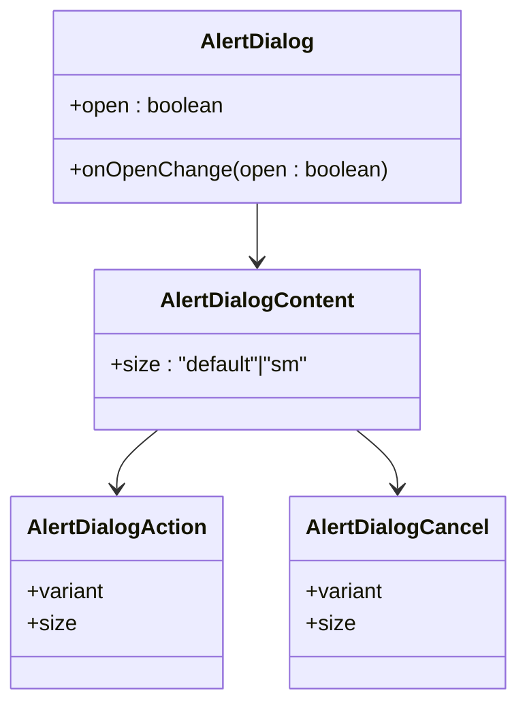
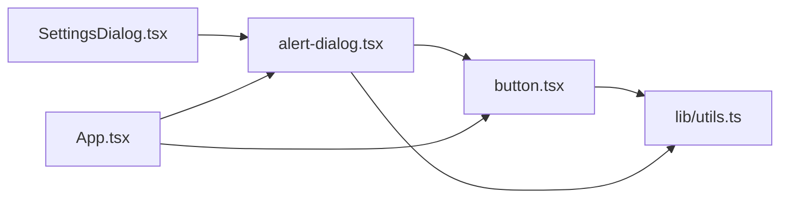

# 基础组件

<cite>
**本文引用的文件**
- [apps/cesium-web/src/components/ui/button.tsx](file://apps/cesium-web/src/components/ui/button.tsx)
- [apps/cesium-web/src/components/ui/card.tsx](file://apps/cesium-web/src/components/ui/card.tsx)
- [apps/cesium-web/src/components/ui/alert-dialog.tsx](file://apps/cesium-web/src/components/ui/alert-dialog.tsx)
- [apps/cesium-web/src/lib/utils.ts](file://apps/cesium-web/src/lib/utils.ts)
- [apps/cesium-web/src/App.tsx](file://apps/cesium-web/src/App.tsx)
- [apps/cesium-web/src/components/SettingsDialog/SettingsDialog.tsx](file://apps/cesium-web/src/components/SettingsDialog/SettingsDialog.tsx)
</cite>

## 目录

1. [简介](#简介)
2. [项目结构](#项目结构)
3. [核心组件](#核心组件)
4. [架构总览](#架构总览)
5. [详细组件分析](#详细组件分析)
6. [依赖关系分析](#依赖关系分析)
7. [性能考量](#性能考量)
8. [故障排查指南](#故障排查指南)
9. [结论](#结论)
10. [附录](#附录)

## 简介

本文件聚焦于基础 UI 组件的设计规范与实现细节，覆盖 Button、Card、AlertDialog 等核心组件。内容包括：

- 属性接口与类型定义
- 样式变体与尺寸规格
- 交互行为与状态管理
- 可访问性与键盘导航
- 事件处理与回调约定
- 使用示例与最佳实践

## 项目结构

基础组件位于应用层的 UI 组件目录，采用按功能模块组织的方式，便于复用与维护。

图表来源

- [apps/cesium-web/src/App.tsx:15-146](file://apps/cesium-web/src/App.tsx#L15-L146)
- [apps/cesium-web/src/components/SettingsDialog/SettingsDialog.tsx:19-147](file://apps/cesium-web/src/components/SettingsDialog/SettingsDialog.tsx#L19-L147)
- [apps/cesium-web/src/components/ui/button.tsx:1-63](file://apps/cesium-web/src/components/ui/button.tsx#L1-L63)
- [apps/cesium-web/src/components/ui/card.tsx:1-57](file://apps/cesium-web/src/components/ui/card.tsx#L1-L57)
- [apps/cesium-web/src/components/ui/alert-dialog.tsx:1-162](file://apps/cesium-web/src/components/ui/alert-dialog.tsx#L1-L162)
- [apps/cesium-web/src/lib/utils.ts:1-7](file://apps/cesium-web/src/lib/utils.ts#L1-L7)

章节来源

- [apps/cesium-web/src/App.tsx:15-146](file://apps/cesium-web/src/App.tsx#L15-L146)
- [apps/cesium-web/src/components/SettingsDialog/SettingsDialog.tsx:19-147](file://apps/cesium-web/src/components/SettingsDialog/SettingsDialog.tsx#L19-L147)

## 核心组件

本节概述三个组件的职责、对外接口与典型用法。

- Button
  - 职责：承载点击交互，支持多种视觉变体与尺寸；可透传原生 button 属性；支持“以子元素形式渲染”模式。
  - 关键特性：基于变体与尺寸的类组合；焦点可见性与禁用态；支持 SVG 图标内联。
  - 典型用法：工具栏按钮、表单提交、操作入口等。

- Card
  - 职责：容器卡片，提供头部、标题、描述、内容、尾部与操作槽位，统一间距与边框阴影。
  - 关键特性：语义化 slot 数据属性；网格布局与响应式断点；可选 action 区域对齐。
  - 典型用法：设置面板、信息展示卡片、分组容器。

- AlertDialog
  - 职责：模态对话框容器，封装触发器、遮罩、内容区、标题、描述、媒体区与操作按钮。
  - 关键特性：尺寸变体（默认/小）；内置 Button 作为 Action/Cancel；数据属性驱动布局与动画。
  - 典型用法：确认/取消提示、设置弹窗、信息提示。

章节来源

- [apps/cesium-web/src/components/ui/button.tsx:7-62](file://apps/cesium-web/src/components/ui/button.tsx#L7-L62)
- [apps/cesium-web/src/components/ui/card.tsx:5-56](file://apps/cesium-web/src/components/ui/card.tsx#L5-L56)
- [apps/cesium-web/src/components/ui/alert-dialog.tsx:7-161](file://apps/cesium-web/src/components/ui/alert-dialog.tsx#L7-L161)

## 架构总览

组件间协作关系如下：应用层通过状态控制打开/关闭对话框；对话框内部使用 AlertDialog 容器与 Button；Card 提供卡片化布局。

图表来源

- [apps/cesium-web/src/App.tsx:20-21](file://apps/cesium-web/src/App.tsx#L20-L21)
- [apps/cesium-web/src/components/SettingsDialog/SettingsDialog.tsx:22-146](file://apps/cesium-web/src/components/SettingsDialog/SettingsDialog.tsx#L22-L146)
- [apps/cesium-web/src/components/ui/alert-dialog.tsx:7-161](file://apps/cesium-web/src/components/ui/alert-dialog.tsx#L7-L161)
- [apps/cesium-web/src/components/ui/button.tsx:39-62](file://apps/cesium-web/src/components/ui/button.tsx#L39-L62)

## 详细组件分析

### Button 组件

- 设计要点
  - 变体：default、destructive、outline、secondary、ghost、link
  - 尺寸：default、xs、sm、lg、icon、icon-xs、icon-sm、icon-lg
  - 渲染策略：asChild 使用 Slot.Root 包裹子元素，否则渲染为 button
  - 状态与可访问性：聚焦可见环、禁用态、无效态样式；支持 SVG 内联
- 类型与默认值
  - Props：继承原生 button 属性，扩展 variant、size、asChild
  - 默认值：variant="default"，size="default"
- 使用建议
  - 图标按钮：使用 icon 或 icon-\* 尺寸，确保可读性
  - 危险操作：使用 destructive 变体，配合确认对话框
  - 链接风格：使用 link 变体，注意语义与键盘可达性

图表来源

- [apps/cesium-web/src/components/ui/button.tsx:39-62](file://apps/cesium-web/src/components/ui/button.tsx#L39-L62)

章节来源

- [apps/cesium-web/src/components/ui/button.tsx:7-62](file://apps/cesium-web/src/components/ui/button.tsx#L7-L62)

### Card 组件

- 设计要点
  - 结构化布局：Card、CardHeader、CardTitle、CardDescription、CardContent、CardFooter、CardAction
  - 响应式与网格：基于 CSS Grid 的响应式布局，支持 action 区域对齐
  - 语义化：data-slot 属性便于主题与测试定位
- 类型与默认值
  - Props：继承原生 div 属性
  - 默认值：无特定默认值，样式由组合类提供
- 使用建议
  - 头部与操作：利用 CardHeader 与 CardAction 实现标题与操作按钮的对齐
  - 描述文本：使用 CardDescription 提供辅助说明
  - 内容区：使用 CardContent 统一分隔与留白

图表来源

- [apps/cesium-web/src/components/ui/card.tsx:5-56](file://apps/cesium-web/src/components/ui/card.tsx#L5-L56)

章节来源

- [apps/cesium-web/src/components/ui/card.tsx:5-56](file://apps/cesium-web/src/components/ui/card.tsx#L5-L56)

### AlertDialog 组件

- 设计要点
  - 容器：Root、Portal、Overlay、Content
  - 内容：Header、Title、Description、Media、Footer
  - 操作：Action（使用 Button 变体与尺寸）、Cancel（使用 Button 变体与尺寸）
  - 尺寸：default、sm；通过 data-size 控制最大宽度与布局
- 类型与默认值
  - Props：继承 Radix UI 对应组件属性；Content 支持 size="default"|"sm"
  - 默认值：size="default"
- 使用建议
  - 与 Button 组合：Action/Cancel 通过 asChild 透传 Button 的变体与尺寸
  - 布局适配：small 尺寸适合轻量提示；默认尺寸适合复杂设置面板
  - 无障碍：保持标题与描述清晰；确保键盘可到达性

图表来源

- [apps/cesium-web/src/components/ui/alert-dialog.tsx:7-161](file://apps/cesium-web/src/components/ui/alert-dialog.tsx#L7-L161)
- [apps/cesium-web/src/components/ui/button.tsx:39-62](file://apps/cesium-web/src/components/ui/button.tsx#L39-L62)

章节来源

- [apps/cesium-web/src/components/ui/alert-dialog.tsx:7-161](file://apps/cesium-web/src/components/ui/alert-dialog.tsx#L7-L161)

## 依赖关系分析

- Button 依赖工具函数 cn 用于类名合并；使用 class-variance-authority 生成变体类。
- AlertDialog 依赖 Button 作为 Action/Cancel 的渲染载体；依赖 Portal/Overlay/Content 等 Radix UI 组件。
- 应用层通过状态 open/onOpenChange 控制对话框显示；在设置对话框中组合 Card 与 Tabs。

图表来源

- [apps/cesium-web/src/components/ui/button.tsx:1-63](file://apps/cesium-web/src/components/ui/button.tsx#L1-L63)
- [apps/cesium-web/src/components/ui/alert-dialog.tsx:1-162](file://apps/cesium-web/src/components/ui/alert-dialog.tsx#L1-L162)
- [apps/cesium-web/src/lib/utils.ts:1-7](file://apps/cesium-web/src/lib/utils.ts#L1-L7)
- [apps/cesium-web/src/components/SettingsDialog/SettingsDialog.tsx:19-147](file://apps/cesium-web/src/components/SettingsDialog/SettingsDialog.tsx#L19-L147)
- [apps/cesium-web/src/App.tsx:15-146](file://apps/cesium-web/src/App.tsx#L15-L146)

章节来源

- [apps/cesium-web/src/components/ui/button.tsx:1-63](file://apps/cesium-web/src/components/ui/button.tsx#L1-L63)
- [apps/cesium-web/src/components/ui/alert-dialog.tsx:1-162](file://apps/cesium-web/src/components/ui/alert-dialog.tsx#L1-L162)
- [apps/cesium-web/src/lib/utils.ts:1-7](file://apps/cesium-web/src/lib/utils.ts#L1-L7)
- [apps/cesium-web/src/components/SettingsDialog/SettingsDialog.tsx:19-147](file://apps/cesium-web/src/components/SettingsDialog/SettingsDialog.tsx#L19-L147)
- [apps/cesium-web/src/App.tsx:15-146](file://apps/cesium-web/src/App.tsx#L15-L146)

## 性能考量

- 类名合并：使用 cn 合并多个类，避免重复与冲突，减少不必要的 DOM 重排。
- 变体计算：cva 仅在变体变化时更新类名，避免每次渲染都进行复杂计算。
- 渲染策略：Button 的 asChild 模式允许更少的 DOM 层级，提升可访问性与渲染效率。
- 对话框：AlertDialog 使用 Portal 将内容挂载到文档根节点，减少布局抖动。

## 故障排查指南

- Button 不生效或样式异常
  - 检查 variant/size 是否拼写正确；确认未覆盖关键类名
  - 确认禁用态与无效态的样式是否符合预期
- AlertDialog 无法关闭或遮罩不消失
  - 检查 open 与 onOpenChange 的状态同步
  - 确认 Portal 与 Overlay 的渲染层级
- Card 布局错位
  - 检查是否正确使用 CardHeader 与 CardAction 的组合
  - 确认网格断点与列数是否匹配

## 结论

Button、Card、AlertDialog 三者共同构成了应用的基础交互与布局单元。通过变体与尺寸的组合、语义化数据属性以及与 Button 的深度集成，实现了高可定制、高可访问性的 UI 基础设施。建议在业务组件中优先复用这些基础组件，以保证一致的交互体验与可维护性。

## 附录

### 使用示例与最佳实践

- 在应用中打开设置对话框
  - 通过状态 open 控制对话框显示；在页脚使用 Button 触发保存或恢复默认
  - 参考路径：[apps/cesium-web/src/App.tsx:20-21](file://apps/cesium-web/src/App.tsx#L20-L21)，[apps/cesium-web/src/components/SettingsDialog/SettingsDialog.tsx:138-143](file://apps/cesium-web/src/components/SettingsDialog/SettingsDialog.tsx#L138-L143)
- 在卡片中组织设置项
  - 使用 CardHeader/CardTitle/CardDescription 组织标题与说明
  - 使用 CardContent 添加设置项；使用 CardFooter 放置操作按钮
  - 参考路径：[apps/cesium-web/src/components/SettingsDialog/SettingsDialog.tsx:25-31](file://apps/cesium-web/src/components/SettingsDialog/SettingsDialog.tsx#L25-L31)，[apps/cesium-web/src/components/SettingsDialog/SettingsDialog.tsx:40-70](file://apps/cesium-web/src/components/SettingsDialog/SettingsDialog.tsx#L40-L70)
- 在对话框中使用按钮
  - Action/Cancel 通过 asChild 与 Button 变体/尺寸联动
  - 参考路径：[apps/cesium-web/src/components/ui/alert-dialog.tsx:120-146](file://apps/cesium-web/src/components/ui/alert-dialog.tsx#L120-L146)
