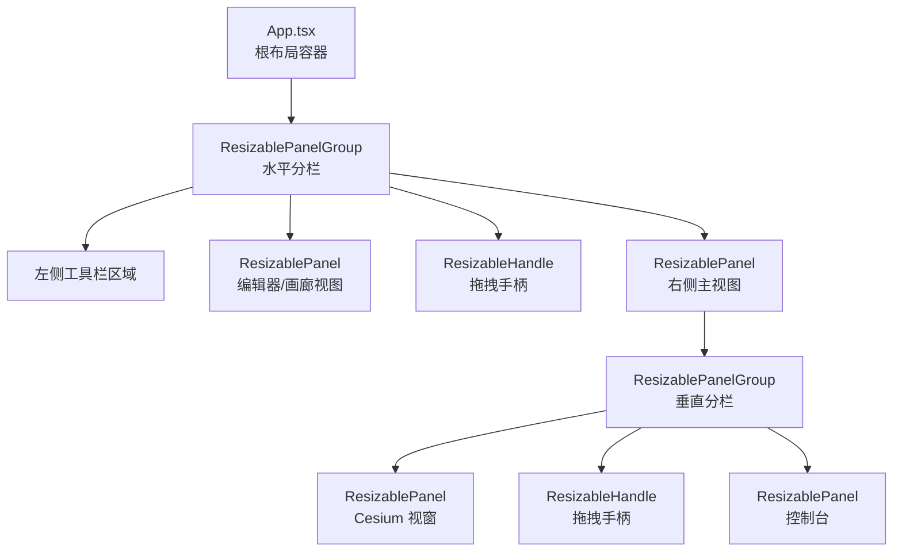
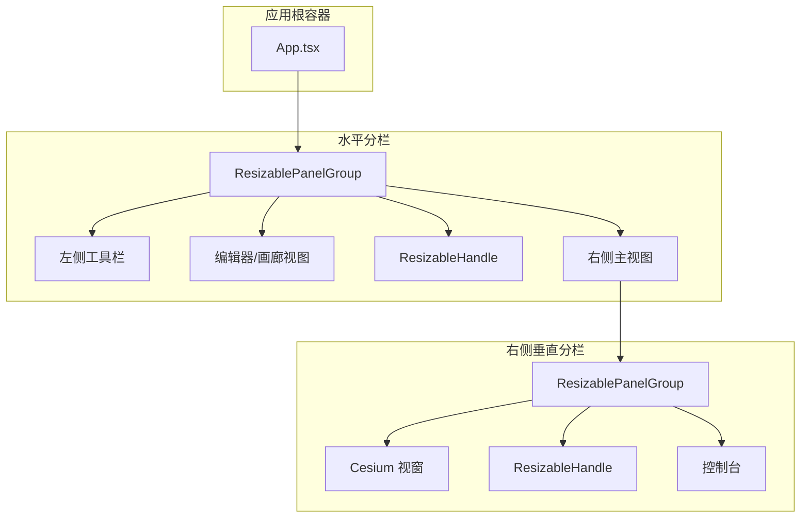
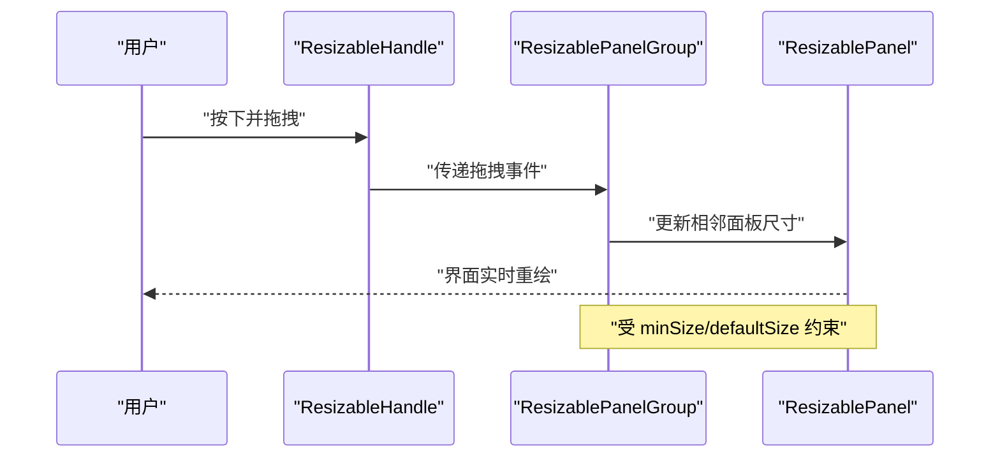
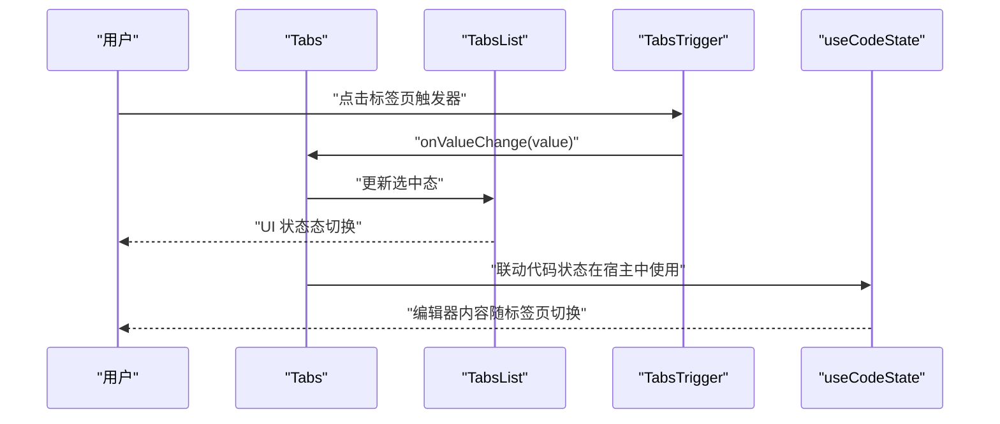
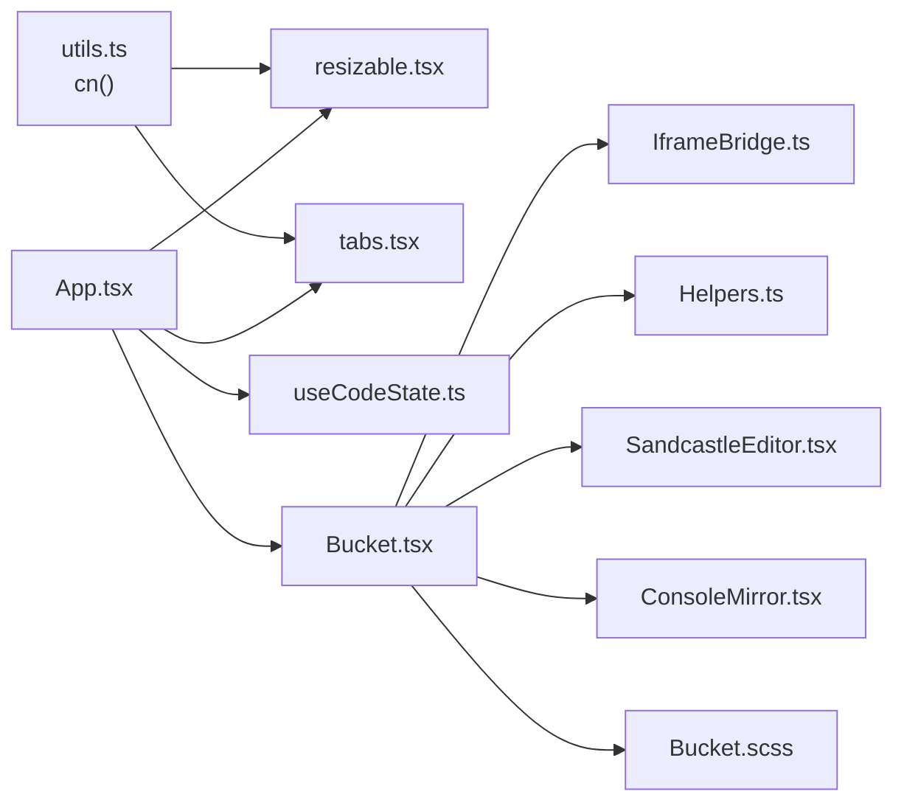
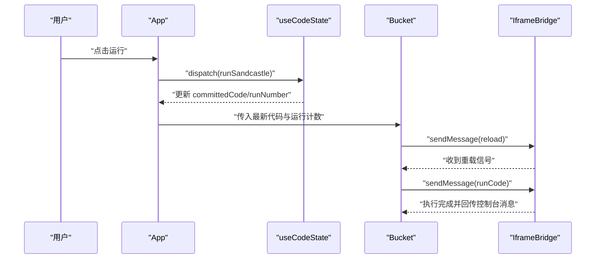

# 布局组件

<cite>
**本文引用的文件**
- [resizable.tsx](file://apps/cesium-web/src/components/ui/resizable.tsx)
- [tabs.tsx](file://apps/cesium-web/src/components/ui/tabs.tsx)
- [App.tsx](file://apps/cesium-web/src/App.tsx)
- [utils.ts](file://apps/cesium-web/src/lib/utils.ts)
- [useCodeState.ts](file://apps/cesium-web/src/hooks/useCodeState.ts)
- [IframeBridge.ts](file://apps/cesium-web/src/util/IframeBridge.ts)
- [Helpers.ts](file://apps/cesium-web/src/util/Helpers.ts)
- [SandcastleEditor.tsx](file://apps/cesium-web/src/components/SandcastleEditor/SandcastleEditor.tsx)
- [ConsoleMirror.tsx](file://apps/cesium-web/src/components/ConsoleMirror/ConsoleMirror.tsx)
- [Bucket.tsx](file://apps/cesium-web/src/components/Bucket/Bucket.tsx)
- [Bucket.scss](file://apps/cesium-web/src/components/Bucket/Bucket.scss)
- [main.tsx](file://apps/cesium-web/src/main.tsx)
</cite>

## 目录

1. [简介](#简介)
2. [项目结构](#项目结构)
3. [核心组件](#核心组件)
4. [架构总览](#架构总览)
5. [详细组件分析](#详细组件分析)
6. [依赖关系分析](#依赖关系分析)
7. [性能考量](#性能考量)
8. [故障排查指南](#故障排查指南)
9. [结论](#结论)
10. [附录](#附录)

## 简介

本文件聚焦于布局组件的设计与实现，重点覆盖可调整大小面板（Resizable）与标签页（Tabs）两大类布局能力。文档从设计理念出发，深入解释拖拽逻辑、边界限制与响应式行为；阐述标签页的路由集成、动态标签管理与状态同步机制；并总结布局算法、尺寸计算与动画过渡效果。最后给出配置项、事件回调、扩展接口及在实际项目中的组合使用案例与性能优化建议。

## 项目结构

本项目的布局体系围绕“左右分栏 + 上下分栏”的双层可调整大小面板展开，左侧为工具栏与编辑器/画廊视图，右侧为主视图与控制台区域。标签页组件用于在编辑器视图内切换“JavaScript/HTML”两种语言视图，配合状态机驱动的代码提交与运行流程。

图表来源

- [App.tsx:24-143](file://apps/cesium-web/src/App.tsx#L24-L143)
- [resizable.tsx:6-45](file://apps/cesium-web/src/components/ui/resizable.tsx#L6-L45)

章节来源

- [App.tsx:15-146](file://apps/cesium-web/src/App.tsx#L15-L146)

## 核心组件

- 可调整大小面板（Resizable）
  - 组件封装：使用第三方库提供的 Panel、PanelGroup、Separator（Handle）能力，统一添加数据槽位与样式类名，便于主题与样式系统集成。
  - 关键点：通过最小尺寸与默认尺寸约束面板边界；拖拽手柄支持水平/垂直两种方向的视觉与交互适配。
- 标签页（Tabs）
  - 组件封装：基于 Radix UI 的 Tabs，提供列表、触发器、内容区等子组件，并通过变体系统支持“默认/线状”两种外观风格。
  - 关键点：支持横向/纵向两种方向；通过数据属性与类名系统实现状态态下的视觉强调与过渡。

章节来源

- [resizable.tsx:6-45](file://apps/cesium-web/src/components/ui/resizable.tsx#L6-L45)
- [tabs.tsx:7-69](file://apps/cesium-web/src/components/ui/tabs.tsx#L7-L69)

## 架构总览

整体采用“双层可调整大小面板 + 标签页切换 + 状态机驱动”的布局架构。左侧工具栏与中间编辑器/画廊视图通过水平分栏组织；右侧主视图进一步拆分为“Cesium 视窗 + 控制台”的垂直分栏。标签页在编辑器视图内切换语言视图，状态机负责代码提交、运行与脏标记管理。

图表来源

- [App.tsx:24-143](file://apps/cesium-web/src/App.tsx#L24-L143)
- [resizable.tsx:6-45](file://apps/cesium-web/src/components/ui/resizable.tsx#L6-L45)

## 详细组件分析

### 可调整大小面板（Resizable）设计与实现

- 设计理念
  - 通过两层 PanelGroup 实现“水平 + 垂直”的双轴布局，满足编辑器与视图/控制台的多场景组合。
  - Handle 作为拖拽入口，提供可视化的抓取手柄与方向适配，保证在不同方向上的交互一致性。
- 实现要点
  - 最小尺寸与默认尺寸：通过属性约束面板的最小/默认尺寸，避免布局塌陷或过度压缩。
  - 方向适配：根据 orientation 属性切换水平/垂直布局，Handle 的样式与伪元素定位随之变化。
  - 样式合并：使用通用工具函数合并类名，确保与 Tailwind/Turbo 适配。
- 拖拽逻辑与边界限制
  - 拖拽由第三方库接管，组件仅负责声明 orientation、minSize、defaultSize 等参数，以及 Handle 的可视化表现。
  - 边界限制：由库内部基于 minSize/defaultSize 计算与约束，超出范围的拖拽会被拒绝或回弹至有效区间。
- 响应式行为
  - 容器采用全屏尺寸，内部 Panel 通过 flex 与百分比高度/宽度自适应窗口变化。
  - Handle 的伪元素与旋转策略确保在水平/垂直方向上均提供稳定的视觉反馈与交互范围。

图表来源

- [resizable.tsx:20-43](file://apps/cesium-web/src/components/ui/resizable.tsx#L20-L43)
- [App.tsx:24-143](file://apps/cesium-web/src/App.tsx#L24-L143)

章节来源

- [resizable.tsx:6-45](file://apps/cesium-web/src/components/ui/resizable.tsx#L6-L45)
- [utils.ts:4-6](file://apps/cesium-web/src/lib/utils.ts#L4-L6)
- [App.tsx:24-143](file://apps/cesium-web/src/App.tsx#L24-L143)

### 标签页（Tabs）设计与实现

- 设计理念
  - 以“列表 + 触发器 + 内容区”的结构组织标签页，支持横向/纵向两种方向，满足不同布局需求。
  - 通过变体系统提供“默认/线状”两种外观风格，结合状态态（激活/未激活）的视觉强调，提升可读性与一致性。
- 实现要点
  - 列表与触发器：列表支持 variant 参数，触发器内置状态态样式与过渡效果。
  - 内容区：内容区作为占位容器，承载对应标签页的内容。
  - 方向属性：通过 data-orientation 与 orientation 属性传递方向信息，影响布局与样式分支。
- 动态标签管理与状态同步
  - 在应用中，标签页用于切换“JavaScript/HTML”两种语言视图，状态由顶层状态管理（Tabs 的 value/onValueChange）与代码状态机（useCodeState）协同维护。
  - 当用户点击“运行”按钮时，状态机提交当前代码，随后由右侧主视图刷新执行。

图表来源

- [tabs.tsx:7-69](file://apps/cesium-web/src/components/ui/tabs.tsx#L7-L69)
- [App.tsx:75-103](file://apps/cesium-web/src/App.tsx#L75-L103)
- [useCodeState.ts:63-110](file://apps/cesium-web/src/hooks/useCodeState.ts#L63-L110)

章节来源

- [tabs.tsx:7-69](file://apps/cesium-web/src/components/ui/tabs.tsx#L7-L69)
- [App.tsx:75-103](file://apps/cesium-web/src/App.tsx#L75-L103)
- [useCodeState.ts:118-122](file://apps/cesium-web/src/hooks/useCodeState.ts#L118-L122)

### 布局算法、尺寸计算与动画过渡

- 布局算法
  - 双层 PanelGroup：外层水平分栏决定左右区域占比；内层垂直分栏决定上下面板占比。
  - 尺寸计算：由第三方库根据鼠标拖拽位置与 minSize/defaultSize 计算相邻面板的新尺寸，确保不越界。
- 动画与过渡
  - 标签页触发器内置过渡类名，激活态强调通过伪元素与透明度过渡实现，提供平滑的视觉反馈。
  - Handle 的伪元素与旋转策略在不同方向上保持一致的交互体验。

章节来源

- [resizable.tsx:20-43](file://apps/cesium-web/src/components/ui/resizable.tsx#L20-L43)
- [tabs.tsx:49-62](file://apps/cesium-web/src/components/ui/tabs.tsx#L49-L62)

### 配置选项、事件回调与扩展接口

- 可调整大小面板（Resizable）
  - 配置项：orientation（方向）、minSize（最小尺寸）、defaultSize（默认尺寸）、className（样式类名）。
  - 事件回调：由第三方库内部处理拖拽事件，组件通过属性声明参与布局约束。
  - 扩展接口：通过 withHandle 属性控制是否显示可视化手柄；通过 data-slot 属性暴露内部节点槽位，便于主题与样式系统识别。
- 标签页（Tabs）
  - 配置项：orientation（方向）、variant（外观变体）、className（样式类名）。
  - 事件回调：onValueChange（值变更回调），用于联动状态机或路由。
  - 扩展接口：data-slot 与 data-orientation/data-variant 等数据属性，便于样式系统与无障碍访问。

章节来源

- [resizable.tsx:6-45](file://apps/cesium-web/src/components/ui/resizable.tsx#L6-L45)
- [tabs.tsx:7-69](file://apps/cesium-web/src/components/ui/tabs.tsx#L7-L69)

### 组件在实际项目中的组合使用案例

- 案例一：编辑器 + 主视图 + 控制台
  - 左侧工具栏固定宽度，中间为编辑器/画廊视图，右侧主视图包含 Cesium 视窗与控制台，垂直分栏通过 Handle 调整比例。
  - 标签页在编辑器视图内切换“JavaScript/HTML”，运行按钮触发状态机提交并执行。
- 案例二：侧边栏 + 主工作区
  - 水平分栏左侧为导航/工具，右侧为主工作区，工作区内再按需拆分上下区域，满足多面板协作场景。

章节来源

- [App.tsx:24-143](file://apps/cesium-web/src/App.tsx#L24-L143)

## 依赖关系分析

- 组件依赖
  - Resizable 组件依赖第三方库的 Panel/PanelGroup/Separator，负责拖拽与尺寸计算。
  - Tabs 组件依赖 Radix UI 的 Tabs，负责状态态与无障碍行为。
  - App 作为根容器，协调 Resizable 与 Tabs 的组合使用，并通过 useCodeState 驱动代码提交与运行。
- 外部依赖
  - 样式工具：clsx 与 tailwind-merge 提供类名合并与冲突修复。
  - 通信桥接：IframeBridge 提供父窗口与 iframe 的类型安全消息通道，支撑沙箱执行与控制台镜像。

图表来源

- [utils.ts:4-6](file://apps/cesium-web/src/lib/utils.ts#L4-L6)
- [resizable.tsx:1-5](file://apps/cesium-web/src/components/ui/resizable.tsx#L1-L5)
- [tabs.tsx:1-5](file://apps/cesium-web/src/components/ui/tabs.tsx#L1-L5)
- [App.tsx:1-14](file://apps/cesium-web/src/App.tsx#L1-L14)
- [useCodeState.ts:1-123](file://apps/cesium-web/src/hooks/useCodeState.ts#L1-L123)
- [Bucket.tsx:1-135](file://apps/cesium-web/src/components/Bucket/Bucket.tsx#L1-L135)
- [IframeBridge.ts:78-182](file://apps/cesium-web/src/util/IframeBridge.ts#L78-L182)
- [Helpers.ts:18-36](file://apps/cesium-web/src/util/Helpers.ts#L18-L36)
- [SandcastleEditor.tsx:1-73](file://apps/cesium-web/src/components/SandcastleEditor/SandcastleEditor.tsx#L1-L73)
- [ConsoleMirror.tsx:1-25](file://apps/cesium-web/src/components/ConsoleMirror/ConsoleMirror.tsx#L1-L25)
- [Bucket.scss:1-9](file://apps/cesium-web/src/components/Bucket/Bucket.scss#L1-L9)

章节来源

- [main.tsx:1-19](file://apps/cesium-web/src/main.tsx#L1-L19)

## 性能考量

- 渲染优化
  - 使用 memo 包装重型组件（如编辑器、沙箱容器），减少不必要的重渲染。
  - 标签页与面板容器采用轻量级封装，避免额外的渲染开销。
- 尺寸计算与拖拽
  - 将复杂布局委托给第三方库，避免手动计算带来的抖动与性能损耗。
  - 合理设置 minSize/defaultSize，减少频繁的边界回弹与重排。
- 通信与执行
  - 沙箱执行通过消息桥接，避免主线程阻塞；运行计数器用于触发 iframe 重载，确保代码更新生效。
- 样式与主题
  - 使用类名合并工具统一处理 Tailwind/Turbo 样式，减少冲突与重复类名带来的渲染成本。

## 故障排查指南

- 拖拽无效或无法释放
  - 检查 minSize/defaultSize 是否导致面板尺寸越界；确认 Handle 的方向与容器方向一致。
- 标签页状态不同步
  - 确认 Tabs 的 value/onValueChange 是否正确绑定到状态机；检查标签页内容区是否正确映射。
- 沙箱执行不生效
  - 确认运行计数器是否递增；检查消息桥接的 origin 与目标窗口是否正确；验证模板注入逻辑是否成功。
- 控制台消息缺失
  - 检查消息桥接监听是否注册；确认消息类型与来源校验是否通过；核对控制台镜像组件是否正确渲染。

章节来源

- [Bucket.tsx:59-110](file://apps/cesium-web/src/components/Bucket/Bucket.tsx#L59-L110)
- [IframeBridge.ts:149-181](file://apps/cesium-web/src/util/IframeBridge.ts#L149-L181)
- [Helpers.ts:18-36](file://apps/cesium-web/src/util/Helpers.ts#L18-L36)

## 结论

本布局体系通过“双层可调整大小面板 + 标签页 + 状态机”的组合，实现了编辑器、视图与控制台的灵活协作。Resizable 提供稳定可靠的拖拽与边界约束，Tabs 提供清晰的状态态与视觉反馈。借助消息桥接与模板注入，沙箱执行与控制台镜像得以高效协同。在实际项目中，建议合理设置尺寸约束、使用 memo 优化渲染，并通过数据槽位与样式系统增强可维护性与可扩展性。

## 附录

- 关键流程图：运行与刷新
  - 用户点击“运行” → 状态机提交代码并递增运行计数 → 父窗口通过消息桥接通知沙箱重载 → 沙箱执行新代码并回传控制台消息。

图表来源

- [App.tsx:83-87](file://apps/cesium-web/src/App.tsx#L83-L87)
- [useCodeState.ts:82-89](file://apps/cesium-web/src/hooks/useCodeState.ts#L82-L89)
- [Bucket.tsx:60-82](file://apps/cesium-web/src/components/Bucket/Bucket.tsx#L60-L82)
- [IframeBridge.ts:122-129](file://apps/cesium-web/src/util/IframeBridge.ts#L122-L129)
