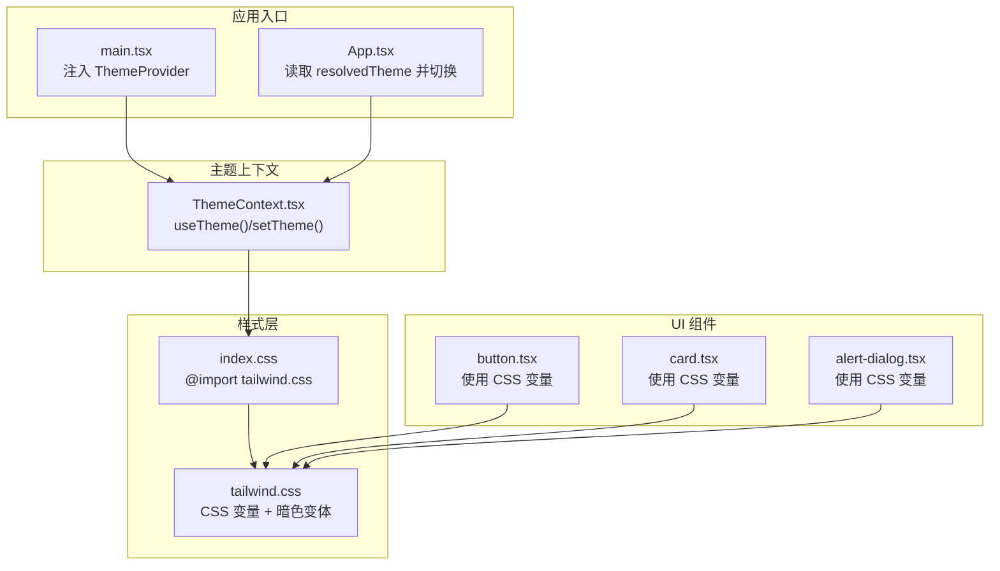
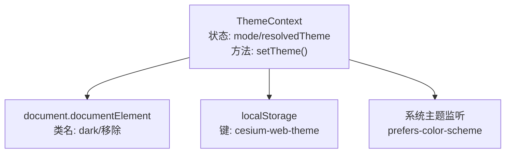
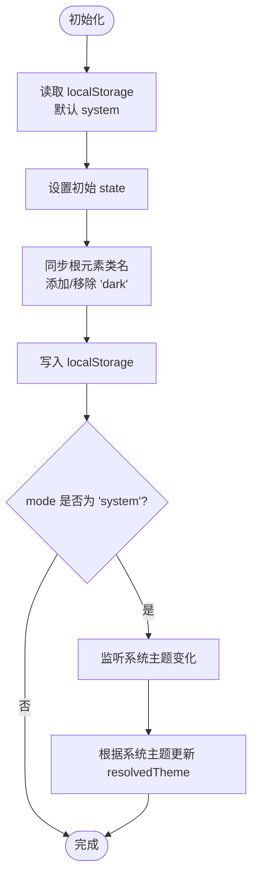
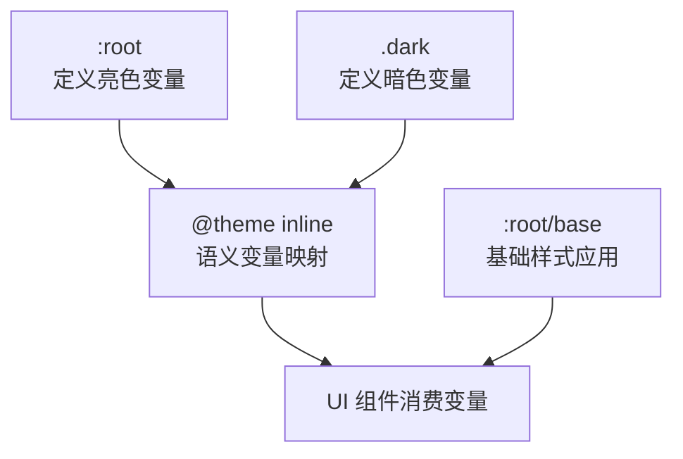
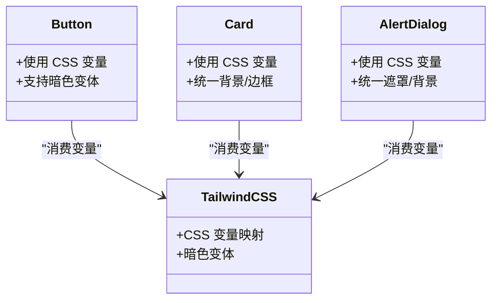
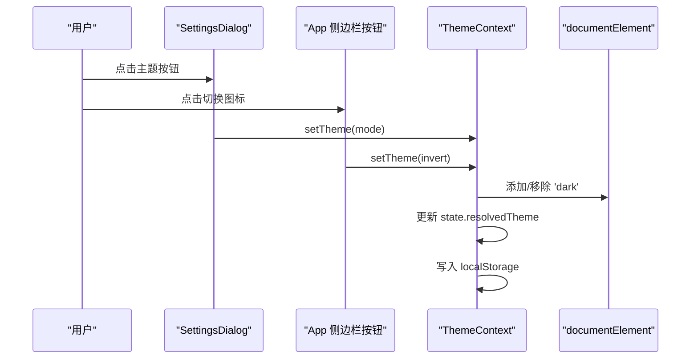
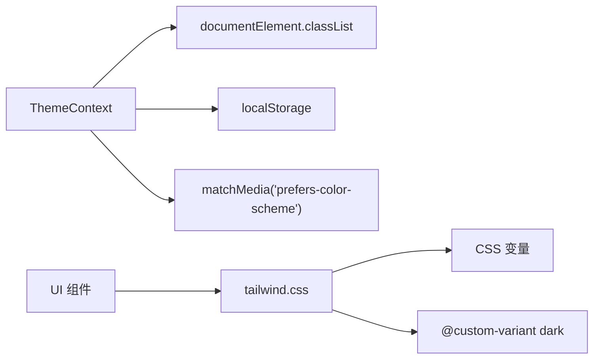

# 主题系统

<cite>
**本文引用的文件**
- [ThemeContext.tsx](file://apps/cesium-web/src/contexts/ThemeContext.tsx)
- [tailwind.css](file://apps/cesium-web/src/styles/tailwind.css)
- [index.css](file://apps/cesium-web/src/styles/index.css)
- [App.tsx](file://apps/cesium-web/src/App.tsx)
- [SettingsDialog.tsx](file://apps/cesium-web/src/components/SettingsDialog/SettingsDialog.tsx)
- [main.tsx](file://apps/cesium-web/src/main.tsx)
- [button.tsx](file://apps/cesium-web/src/components/ui/button.tsx)
- [card.tsx](file://apps/cesium-web/src/components/ui/card.tsx)
- [alert-dialog.tsx](file://apps/cesium-web/src/components/ui/alert-dialog.tsx)
- [utils.ts](file://apps/cesium-web/src/lib/utils.ts)
- [package.json](file://apps/cesium-web/package.json)
</cite>

## 目录

1. [简介](#简介)
2. [项目结构](#项目结构)
3. [核心组件](#核心组件)
4. [架构总览](#架构总览)
5. [详细组件分析](#详细组件分析)
6. [依赖关系分析](#依赖关系分析)
7. [性能考虑](#性能考虑)
8. [故障排查指南](#故障排查指南)
9. [结论](#结论)
10. [附录](#附录)

## 简介

本主题系统以 React Context 为核心，结合 Tailwind CSS 的 CSS 变量与暗色变体，实现了明/暗/系统三种主题模式的统一管理与动态切换。系统通过 DOM 根元素类名同步与本地存储持久化，确保主题状态在页面刷新后仍可保持；同时监听系统主题变化，在“系统”模式下自动更新。组件层基于 Tailwind CSS 变量与暗色变体，实现一致的视觉风格与无障碍适配。

## 项目结构

主题系统涉及的关键文件分布如下：

- 上下文与入口：ThemeContext 提供主题状态与切换能力；main.tsx 注入 Provider；App 使用主题状态。
- 样式层：index.css 引入 tailwind.css；tailwind.css 定义 CSS 变量与暗色变体规则。
- 组件层：UI 组件（如 Button、Card、AlertDialog）直接消费 Tailwind 变量，无需感知具体颜色值。
- 设置对话框：SettingsDialog 提供主题选择入口，联动上下文。

**图表来源**

- [main.tsx:12-18](file://apps/cesium-web/src/main.tsx#L12-L18)
- [ThemeContext.tsx:57-99](file://apps/cesium-web/src/contexts/ThemeContext.tsx#L57-L99)
- [index.css:1](file://apps/cesium-web/src/styles/index.css#L1)
- [tailwind.css:1](file://apps/cesium-web/src/styles/tailwind.css#L1)
- [button.tsx:7-37](file://apps/cesium-web/src/components/ui/button.tsx#L7-L37)
- [card.tsx:5-13](file://apps/cesium-web/src/components/ui/card.tsx#L5-L13)
- [alert-dialog.tsx:32-53](file://apps/cesium-web/src/components/ui/alert-dialog.tsx#L32-L53)

**章节来源**

- [main.tsx:12-18](file://apps/cesium-web/src/main.tsx#L12-L18)
- [index.css:1](file://apps/cesium-web/src/styles/index.css#L1)
- [tailwind.css:1](file://apps/cesium-web/src/styles/tailwind.css#L1)

## 核心组件

- 主题上下文（ThemeContext）
  - 提供 mode（light/dark/system）、resolvedTheme（light/dark）与 setTheme 方法。
  - 初始状态从 localStorage 读取，若无则为 system；首次渲染时同步根元素类名与本地存储。
  - 在 mode 为 system 时监听系统主题变化，实时更新 resolvedTheme。
- 应用入口（main.tsx）
  - 在根节点包裹 ThemeProvider，确保全局可用。
- 应用组件（App）
  - 通过 useTheme 获取 resolvedTheme，并在侧边栏按钮上实现明/暗主题切换。
- 设置对话框（SettingsDialog）
  - 在“编辑器”标签页提供主题选择按钮，分别调用 setTheme 切换 light/dark/system。
- 样式层（tailwind.css）
  - 定义 CSS 变量映射（如 --color-background、--color-foreground 等），并在 :root 与 .dark 中分别赋值。
  - 使用 @custom-variant dark 定义暗色变体选择器，使组件层可按需应用暗色样式。
- UI 组件（button.tsx、card.tsx、alert-dialog.tsx）
  - 直接使用 Tailwind 变量生成类名，无需硬编码颜色值，保证与主题一致。

**章节来源**

- [ThemeContext.tsx:19-39](file://apps/cesium-web/src/contexts/ThemeContext.tsx#L19-L39)
- [ThemeContext.tsx:41-50](file://apps/cesium-web/src/contexts/ThemeContext.tsx#L41-L50)
- [ThemeContext.tsx:57-99](file://apps/cesium-web/src/contexts/ThemeContext.tsx#L57-L99)
- [App.tsx:13-16](file://apps/cesium-web/src/App.tsx#L13-L16)
- [App.tsx:47-58](file://apps/cesium-web/src/App.tsx#L47-L58)
- [SettingsDialog.tsx:19-102](file://apps/cesium-web/src/components/SettingsDialog/SettingsDialog.tsx#L19-L102)
- [tailwind.css:5](file://apps/cesium-web/src/styles/tailwind.css#L5)
- [tailwind.css:47-46](file://apps/cesium-web/src/styles/tailwind.css#L47-L46)
- [tailwind.css:48-81](file://apps/cesium-web/src/styles/tailwind.css#L48-L81)
- [tailwind.css:83-115](file://apps/cesium-web/src/styles/tailwind.css#L83-L115)
- [button.tsx:7-37](file://apps/cesium-web/src/components/ui/button.tsx#L7-L37)
- [card.tsx:5-13](file://apps/cesium-web/src/components/ui/card.tsx#L5-L13)
- [alert-dialog.tsx:32-53](file://apps/cesium-web/src/components/ui/alert-dialog.tsx#L32-L53)

## 架构总览

主题系统采用“上下文驱动 + CSS 变量 + 暗色变体”的分层设计：

- 上下文层：集中管理主题模式与解析后的主题，负责与 DOM、localStorage 同步以及系统主题监听。
- 样式层：以 CSS 变量承载颜色语义，通过 :root 与 .dark 定义明/暗两套映射；@custom-variant dark 实现暗色变体。
- 组件层：不关心具体颜色值，仅消费 Tailwind 变量与暗色变体，确保一致性与可维护性。

**图表来源**

- [ThemeContext.tsx:63-74](file://apps/cesium-web/src/contexts/ThemeContext.tsx#L63-L74)
- [ThemeContext.tsx:76-88](file://apps/cesium-web/src/contexts/ThemeContext.tsx#L76-L88)
- [ThemeContext.tsx:19](file://apps/cesium-web/src/contexts/ThemeContext.tsx#L19)

## 详细组件分析

### 主题上下文（ThemeContext）

- 设计要点
  - 使用 useReducer 管理状态，动作类型包括 SET_MODE 与 SET_RESOLVED_THEME，职责清晰。
  - resolveTheme 将 system 解析为 light/dark，避免在组件层处理分支。
  - getInitialState 优先读取 localStorage，兜底为 system，保证用户偏好与初始体验一致。
  - 同步 DOM 类名与 localStorage，确保样式与持久化一致。
  - 监听系统主题变化，仅在 system 模式下生效，避免覆盖用户手动选择。
- 错误处理
  - useTheme 在未包裹 Provider 时抛出错误，强制正确使用上下文。
- 复杂度
  - 状态更新与副作用均为 O(1)，DOM 操作与事件监听在必要时触发，整体开销极低。

**图表来源**

- [ThemeContext.tsx:29-39](file://apps/cesium-web/src/contexts/ThemeContext.tsx#L29-L39)
- [ThemeContext.tsx:57-61](file://apps/cesium-web/src/contexts/ThemeContext.tsx#L57-L61)
- [ThemeContext.tsx:63-74](file://apps/cesium-web/src/contexts/ThemeContext.tsx#L63-L74)
- [ThemeContext.tsx:76-88](file://apps/cesium-web/src/contexts/ThemeContext.tsx#L76-L88)

**章节来源**

- [ThemeContext.tsx:19-39](file://apps/cesium-web/src/contexts/ThemeContext.tsx#L19-L39)
- [ThemeContext.tsx:41-50](file://apps/cesium-web/src/contexts/ThemeContext.tsx#L41-L50)
- [ThemeContext.tsx:57-99](file://apps/cesium-web/src/contexts/ThemeContext.tsx#L57-L99)
- [ThemeContext.tsx:101-107](file://apps/cesium-web/src/contexts/ThemeContext.tsx#L101-L107)

### 样式层（tailwind.css）

- CSS 变量映射
  - 通过 @theme inline 将 CSS 变量映射到语义化命名，如 --color-background、--color-primary 等。
  - :root 定义亮色主题变量；.dark 定义暗色主题变量，二者互斥。
- 暗色变体
  - @custom-variant dark 定义了暗色选择器，组件层可使用 dark:&:is(...) 语法在暗色下生效。
- 基础层
  - 在 :root/base 层应用边框、背景、前景等基础样式，确保全局一致性。
- 与 Tailwind v4 集成
  - 引入 tailwindcss、tw-animate-css、shadcn/tailwind.css，支持动画与组件库样式。

**图表来源**

- [tailwind.css:5](file://apps/cesium-web/src/styles/tailwind.css#L5)
- [tailwind.css:47-46](file://apps/cesium-web/src/styles/tailwind.css#L47-L46)
- [tailwind.css:48-81](file://apps/cesium-web/src/styles/tailwind.css#L48-L81)
- [tailwind.css:83-115](file://apps/cesium-web/src/styles/tailwind.css#L83-L115)
- [tailwind.css:117-126](file://apps/cesium-web/src/styles/tailwind.css#L117-L126)

**章节来源**

- [tailwind.css:1](file://apps/cesium-web/src/styles/tailwind.css#L1)
- [tailwind.css:5](file://apps/cesium-web/src/styles/tailwind.css#L5)
- [tailwind.css:47-46](file://apps/cesium-web/src/styles/tailwind.css#L47-L46)
- [tailwind.css:48-81](file://apps/cesium-web/src/styles/tailwind.css#L48-L81)
- [tailwind.css:83-115](file://apps/cesium-web/src/styles/tailwind.css#L83-L115)
- [tailwind.css:117-126](file://apps/cesium-web/src/styles/tailwind.css#L117-L126)

### 组件级主题适配（UI 组件）

- Button
  - 使用 cva 定义变体与尺寸，内部类名直接消费 CSS 变量，无需硬编码颜色。
  - 支持暗色变体，通过 @custom-variant dark 生效。
- Card
  - 通过 Tailwind 变量实现卡片背景、边框、阴影等，保证与主题一致。
- AlertDialog
  - 对话框背景、遮罩、标题、描述等均使用 CSS 变量，确保在明/暗主题下具有一致外观。

**图表来源**

- [button.tsx:7-37](file://apps/cesium-web/src/components/ui/button.tsx#L7-L37)
- [card.tsx:5-13](file://apps/cesium-web/src/components/ui/card.tsx#L5-L13)
- [alert-dialog.tsx:32-53](file://apps/cesium-web/src/components/ui/alert-dialog.tsx#L32-L53)
- [tailwind.css:5](file://apps/cesium-web/src/styles/tailwind.css#L5)
- [tailwind.css:47-46](file://apps/cesium-web/src/styles/tailwind.css#L47-L46)

**章节来源**

- [button.tsx:7-37](file://apps/cesium-web/src/components/ui/button.tsx#L7-L37)
- [card.tsx:5-13](file://apps/cesium-web/src/components/ui/card.tsx#L5-L13)
- [alert-dialog.tsx:32-53](file://apps/cesium-web/src/components/ui/alert-dialog.tsx#L32-L53)

### 动态切换流程（App 与 SettingsDialog）

- App 侧边栏按钮
  - 读取 resolvedTheme，根据当前主题切换到另一模式，并通过 setTheme 更新上下文。
- SettingsDialog 编辑器标签页
  - 提供浅色/深色/系统三个按钮，点击即调用 setTheme 更新模式。
- 切换结果
  - 上下文更新 state，同步根元素类名与 localStorage；若为 system，系统主题变化也会被监听并更新。

**图表来源**

- [SettingsDialog.tsx:75-101](file://apps/cesium-web/src/components/SettingsDialog/SettingsDialog.tsx#L75-L101)
- [App.tsx:47-58](file://apps/cesium-web/src/App.tsx#L47-L58)
- [ThemeContext.tsx:90-92](file://apps/cesium-web/src/contexts/ThemeContext.tsx#L90-L92)
- [ThemeContext.tsx:63-74](file://apps/cesium-web/src/contexts/ThemeContext.tsx#L63-L74)

**章节来源**

- [SettingsDialog.tsx:75-101](file://apps/cesium-web/src/components/SettingsDialog/SettingsDialog.tsx#L75-L101)
- [App.tsx:47-58](file://apps/cesium-web/src/App.tsx#L47-L58)
- [ThemeContext.tsx:63-74](file://apps/cesium-web/src/contexts/ThemeContext.tsx#L63-L74)
- [ThemeContext.tsx:90-92](file://apps/cesium-web/src/contexts/ThemeContext.tsx#L90-L92)

## 依赖关系分析

- 主题上下文依赖
  - DOM API：documentElement.classList 用于添加/移除 'dark'。
  - 本地存储：localStorage 用于持久化主题模式。
  - 媒体查询：window.matchMedia 监听系统主题变化。
- 样式依赖
  - Tailwind CSS v4：提供原子类与变量系统。
  - 自定义变体：@custom-variant dark。
  - 动画与组件库：tw-animate-css、shadcn/tailwind.css。
- 组件依赖
  - UI 组件通过 Tailwind 变量与暗色变体消费样式，不依赖具体颜色值。

**图表来源**

- [ThemeContext.tsx:63-74](file://apps/cesium-web/src/contexts/ThemeContext.tsx#L63-L74)
- [ThemeContext.tsx:76-88](file://apps/cesium-web/src/contexts/ThemeContext.tsx#L76-L88)
- [tailwind.css:5](file://apps/cesium-web/src/styles/tailwind.css#L5)
- [tailwind.css:47-46](file://apps/cesium-web/src/styles/tailwind.css#L47-L46)
- [tailwind.css:1](file://apps/cesium-web/src/styles/tailwind.css#L1)

**章节来源**

- [ThemeContext.tsx:63-74](file://apps/cesium-web/src/contexts/ThemeContext.tsx#L63-L74)
- [ThemeContext.tsx:76-88](file://apps/cesium-web/src/contexts/ThemeContext.tsx#L76-L88)
- [tailwind.css:1](file://apps/cesium-web/src/styles/tailwind.css#L1)
- [tailwind.css:5](file://apps/cesium-web/src/styles/tailwind.css#L5)
- [tailwind.css:47-46](file://apps/cesium-web/src/styles/tailwind.css#L47-L46)

## 性能考虑

- 最小化重排与重绘
  - 仅在主题切换时更新根元素类名与 localStorage，避免频繁 DOM 操作。
- 事件监听清理
  - 在 effect cleanup 中移除媒体查询监听，防止内存泄漏。
- CSS 变量与原子类
  - 使用 CSS 变量与 Tailwind 原子类减少内联样式的计算成本，提升渲染效率。
- 渐进增强
  - 在无 JS 或禁用 JS 的情况下，仍可通过 :root 与 .dark 的 CSS 规则维持基本主题一致性。

[本节为通用性能讨论，无需特定文件来源]

## 故障排查指南

- 问题：切换主题后样式未更新
  - 排查：确认根元素是否包含 'dark' 类；检查 localStorage 中的主题键值；验证系统监听是否生效。
  - 参考：[ThemeContext.tsx:63-74](file://apps/cesium-web/src/contexts/ThemeContext.tsx#L63-L74)、[ThemeContext.tsx:76-88](file://apps/cesium-web/src/contexts/ThemeContext.tsx#L76-L88)
- 问题：系统主题切换无效
  - 排查：确认 mode 为 'system'；检查媒体查询监听是否注册；验证回调是否触发。
  - 参考：[ThemeContext.tsx:76-88](file://apps/cesium-web/src/contexts/ThemeContext.tsx#L76-L88)
- 问题：组件颜色不符合预期
  - 排查：确认组件是否使用 Tailwind 变量；检查 @custom-variant dark 是否正确应用；核对 :root 与 .dark 的变量值。
  - 参考：[tailwind.css:5](file://apps/cesium-web/src/styles/tailwind.css#L5)、[tailwind.css:83-115](file://apps/cesium-web/src/styles/tailwind.css#L83-L115)
- 问题：useTheme 报错
  - 排查：确认已在 ThemeProvider 下使用；检查 Provider 包裹范围。
  - 参考：[ThemeContext.tsx:101-107](file://apps/cesium-web/src/contexts/ThemeContext.tsx#L101-L107)

**章节来源**

- [ThemeContext.tsx:63-74](file://apps/cesium-web/src/contexts/ThemeContext.tsx#L63-L74)
- [ThemeContext.tsx:76-88](file://apps/cesium-web/src/contexts/ThemeContext.tsx#L76-L88)
- [tailwind.css:5](file://apps/cesium-web/src/styles/tailwind.css#L5)
- [tailwind.css:83-115](file://apps/cesium-web/src/styles/tailwind.css#L83-L115)
- [ThemeContext.tsx:101-107](file://apps/cesium-web/src/contexts/ThemeContext.tsx#L101-L107)

## 结论

该主题系统以 Context 为中心，结合 Tailwind CSS 变量与暗色变体，实现了简洁、可维护且高性能的主题管理。通过 DOM 类名同步与本地存储持久化，确保用户体验的一致性；通过系统主题监听，进一步提升易用性。组件层完全依赖变量与变体，降低耦合，便于扩展与品牌定制。

[本节为总结，无需特定文件来源]

## 附录

### 主题状态与持久化

- 存储键：cesium-web-theme
- 默认值：system
- 同步对象：documentElement.classList、localStorage

**章节来源**

- [ThemeContext.tsx:19](file://apps/cesium-web/src/contexts/ThemeContext.tsx#L19)
- [ThemeContext.tsx:29-39](file://apps/cesium-web/src/contexts/ThemeContext.tsx#L29-L39)
- [ThemeContext.tsx:63-74](file://apps/cesium-web/src/contexts/ThemeContext.tsx#L63-L74)

### CSS 变量与暗色变体

- 变量映射：通过 @theme inline 将语义变量映射到 --color-\*。
- 明/暗变量：:root 定义亮色变量；.dark 定义暗色变量。
- 暗色变体：@custom-variant dark 用于在暗色下生效的样式。

**章节来源**

- [tailwind.css:5](file://apps/cesium-web/src/styles/tailwind.css#L5)
- [tailwind.css:47-46](file://apps/cesium-web/src/styles/tailwind.css#L47-L46)
- [tailwind.css:48-81](file://apps/cesium-web/src/styles/tailwind.css#L48-L81)
- [tailwind.css:83-115](file://apps/cesium-web/src/styles/tailwind.css#L83-L115)

### 组件级别主题适配清单

- Button：使用 CSS 变量与暗色变体，支持多种变体与尺寸。
- Card：统一背景、边框、阴影，适配明/暗主题。
- AlertDialog：对话框背景、遮罩、标题、描述均使用 CSS 变量。

**章节来源**

- [button.tsx:7-37](file://apps/cesium-web/src/components/ui/button.tsx#L7-L37)
- [card.tsx:5-13](file://apps/cesium-web/src/components/ui/card.tsx#L5-L13)
- [alert-dialog.tsx:32-53](file://apps/cesium-web/src/components/ui/alert-dialog.tsx#L32-L53)

### 扩展与最佳实践

- 自定义主题
  - 在 :root 与 .dark 中新增或调整 CSS 变量，即可实现品牌色板与层级规范的定制。
  - 通过 @custom-variant dark 定义新的暗色变体规则，满足复杂组件需求。
- 动画与过渡
  - 使用 tw-animate-css 提供的动画类，配合 CSS 变量实现主题切换时的平滑过渡。
- 无障碍访问
  - 保持对比度与可读性，确保明/暗主题下文字与背景的可读性符合 WCAG 建议。
  - 避免仅依赖颜色传达信息，辅以文本或图标。
- 性能优化
  - 避免在主题切换时进行大规模 DOM 重构；尽量只更新根元素类名与必要的样式属性。
  - 合理使用 CSS 变量，减少重复计算与重绘。

**章节来源**

- [tailwind.css:1](file://apps/cesium-web/src/styles/tailwind.css#L1)
- [package.json:42-45](file://apps/cesium-web/package.json#L42-L45)
