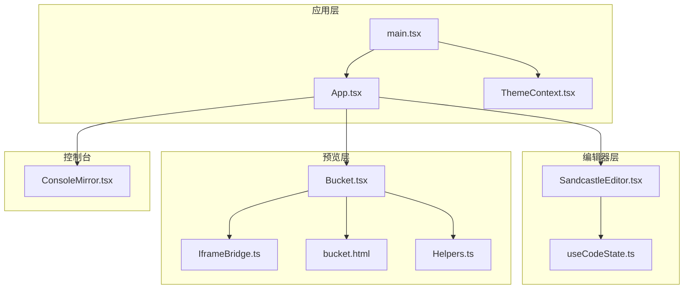
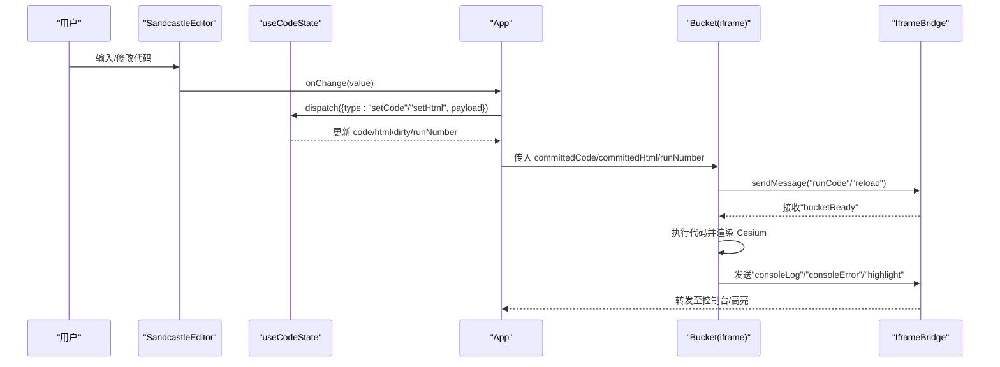
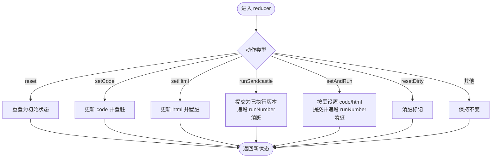
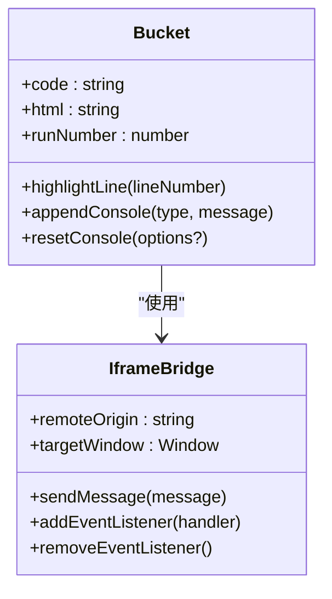
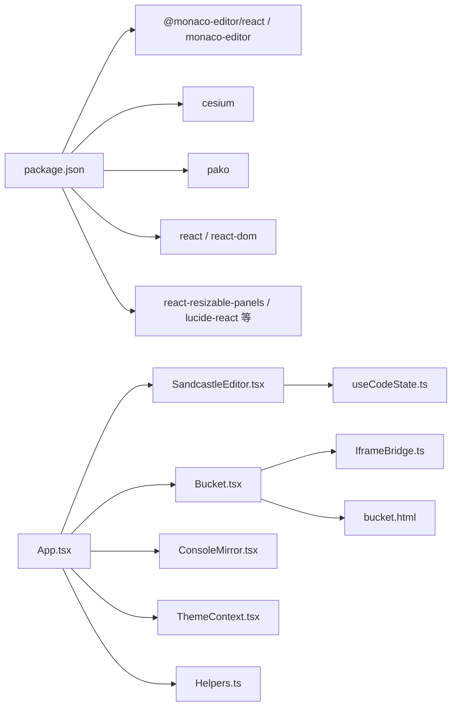

# 代码编辑器集成

<cite>
**本文引用的文件**
- [SandcastleEditor.tsx](file://apps/cesium-web/src/components/SandcastleEditor/SandcastleEditor.tsx)
- [useCodeState.ts](file://apps/cesium-web/src/hooks/useCodeState.ts)
- [App.tsx](file://apps/cesium-web/src/App.tsx)
- [ThemeContext.tsx](file://apps/cesium-web/src/contexts/ThemeContext.tsx)
- [IframeBridge.ts](file://apps/cesium-web/src/util/IframeBridge.ts)
- [Bucket.tsx](file://apps/cesium-web/src/components/Bucket/Bucket.tsx)
- [ConsoleMirror.tsx](file://apps/cesium-web/src/components/ConsoleMirror/ConsoleMirror.tsx)
- [Helpers.ts](file://apps/cesium-web/src/util/Helpers.ts)
- [bucket.html](file://apps/cesium-web/templates/bucket.html)
- [main.tsx](file://apps/cesium-web/src/main.tsx)
- [package.json](file://apps/cesium-web/package.json)
</cite>

## 目录

1. [简介](#简介)
2. [项目结构](#项目结构)
3. [核心组件](#核心组件)
4. [架构总览](#架构总览)
5. [详细组件分析](#详细组件分析)
6. [依赖关系分析](#依赖关系分析)
7. [性能考虑](#性能考虑)
8. [故障排查指南](#故障排查指南)
9. [结论](#结论)
10. [附录](#附录)

## 简介

本文件面向“Monaco Editor 集成与实时预览”主题，系统梳理代码编辑器在应用中的实现方式与工作机制。重点包括：

- 编辑器组件封装与配置项
- 多语言支持与主题适配
- 代码状态管理与实时同步
- 实时预览（iframe 沙箱）与消息桥接
- 错误标记与控制台镜像
- 性能优化与大文件处理建议
- 扩展接口与自定义插件开发思路

## 项目结构

围绕编辑器与预览的关键文件组织如下：

- 编辑器封装：SandcastleEditor.tsx
- 状态管理：useCodeState.ts
- 应用入口与布局：App.tsx、main.tsx
- 主题上下文：ThemeContext.tsx
- 预览沙箱与消息桥接：Bucket.tsx、IframeBridge.ts
- 辅助工具：Helpers.ts
- 模板页：bucket.html
- 依赖声明：package.json

图表来源

- [App.tsx:15-146](file://apps/cesium-web/src/App.tsx#L15-L146)
- [SandcastleEditor.tsx:44-72](file://apps/cesium-web/src/components/SandcastleEditor/SandcastleEditor.tsx#L44-L72)
- [useCodeState.ts:118-122](file://apps/cesium-web/src/hooks/useCodeState.ts#L118-L122)
- [Bucket.tsx:53-135](file://apps/cesium-web/src/components/Bucket/Bucket.tsx#L53-L135)
- [IframeBridge.ts:78-182](file://apps/cesium-web/src/util/IframeBridge.ts#L78-L182)
- [bucket.html:1-84](file://apps/cesium-web/templates/bucket.html#L1-L84)
- [Helpers.ts:18-36](file://apps/cesium-web/src/util/Helpers.ts#L18-L36)
- [ConsoleMirror.tsx:10-24](file://apps/cesium-web/src/components/ConsoleMirror/ConsoleMirror.tsx#L10-L24)
- [main.tsx:12-18](file://apps/cesium-web/src/main.tsx#L12-L18)

章节来源

- [App.tsx:15-146](file://apps/cesium-web/src/App.tsx#L15-L146)
- [SandcastleEditor.tsx:44-72](file://apps/cesium-web/src/components/SandcastleEditor/SandcastleEditor.tsx#L44-L72)
- [useCodeState.ts:118-122](file://apps/cesium-web/src/hooks/useCodeState.ts#L118-L122)
- [Bucket.tsx:53-135](file://apps/cesium-web/src/components/Bucket/Bucket.tsx#L53-L135)
- [IframeBridge.ts:78-182](file://apps/cesium-web/src/util/IframeBridge.ts#L78-L182)
- [bucket.html:1-84](file://apps/cesium-web/templates/bucket.html#L1-L84)
- [Helpers.ts:18-36](file://apps/cesium-web/src/util/Helpers.ts#L18-L36)
- [ConsoleMirror.tsx:10-24](file://apps/cesium-web/src/components/ConsoleMirror/ConsoleMirror.tsx#L10-L24)
- [main.tsx:12-18](file://apps/cesium-web/src/main.tsx#L12-L18)

## 核心组件

- 编辑器组件：基于 @monaco-editor/react 的 SandcastleEditor，负责渲染与主题切换、语言切换、基础编辑配置。
- 状态机：useCodeState 提供代码与 HTML 的双轨状态、提交与运行计数、脏标记等。
- 预览沙箱：Bucket 通过 iframe 加载模板页，桥接消息驱动执行与高亮。
- 主题上下文：ThemeContext 提供系统/浅色/深色模式切换与持久化。

章节来源

- [SandcastleEditor.tsx:44-72](file://apps/cesium-web/src/components/SandcastleEditor/SandcastleEditor.tsx#L44-L72)
- [useCodeState.ts:36-55](file://apps/cesium-web/src/hooks/useCodeState.ts#L36-L55)
- [Bucket.tsx:53-135](file://apps/cesium-web/src/components/Bucket/Bucket.tsx#L53-L135)
- [ThemeContext.tsx:57-99](file://apps/cesium-web/src/contexts/ThemeContext.tsx#L57-L99)

## 架构总览

编辑器与预览通过“状态机—编辑器—沙箱—消息桥接”的链路实现“所见即所得”的实时预览。

图表来源

- [App.tsx:92-100](file://apps/cesium-web/src/App.tsx#L92-L100)
- [useCodeState.ts:63-110](file://apps/cesium-web/src/hooks/useCodeState.ts#L63-L110)
- [Bucket.tsx:69-110](file://apps/cesium-web/src/components/Bucket/Bucket.tsx#L69-L110)
- [IframeBridge.ts:149-181](file://apps/cesium-web/src/util/IframeBridge.ts#L149-L181)

## 详细组件分析

### 编辑器组件（SandcastleEditor）

- 功能职责
  - 基于 @monaco-editor/react 渲染编辑器
  - 支持语言切换（javascript/html/css）
  - 主题随系统/用户选择切换（light/vs-dark）
  - 基础配置：字号、缩略图禁用、自动布局、tab宽度、字体族、滚动与行高高亮等
- 关键点
  - 通过 useTheme 获取 resolvedTheme 并映射到编辑器主题
  - onChange 回调透传到上层，配合 useCodeState 更新状态
  - 语言与内容由 App 通过 props 下发

章节来源

- [SandcastleEditor.tsx:44-72](file://apps/cesium-web/src/components/SandcastleEditor/SandcastleEditor.tsx#L44-L72)
- [ThemeContext.tsx:101-107](file://apps/cesium-web/src/contexts/ThemeContext.tsx#L101-L107)

### 状态管理（useCodeState）

- 状态模型
  - code/html：当前编辑内容
  - committedCode/committedHtml：已提交执行的内容
  - runNumber：运行计数，用于触发 iframe 重建
  - dirty：脏标记，表示是否已保存
- 行为
  - setCode/setHtml：更新对应内容并置脏
  - runSandcastle：提交当前内容为已执行版本，递增 runNumber，清除脏
  - setAndRun：一次性设置并执行
  - reset/resetDirty：重置与清脏

图表来源

- [useCodeState.ts:63-110](file://apps/cesium-web/src/hooks/useCodeState.ts#L63-L110)

章节来源

- [useCodeState.ts:36-55](file://apps/cesium-web/src/hooks/useCodeState.ts#L36-L55)
- [useCodeState.ts:63-110](file://apps/cesium-web/src/hooks/useCodeState.ts#L63-L110)

### 预览沙箱（Bucket）与消息桥接（IframeBridge）

- 沙箱职责
  - 加载模板页（bucket.html），在 sandbox 环境中渲染 Cesium
  - 通过 IframeBridge 与父窗口通信
  - 监听 bucketReady，首次注入代码并执行；后续根据 runNumber 触发 reload
- 消息类型
  - 父→子：reload、runCode
  - 子→父：bucketReady、consoleClear/consoleLog/consoleError、highlight
- 安全性
  - 仅转发受信消息（带特定 id 的信封结构）
  - 严格 origin 校验与来源过滤，避免自监听与第三方干扰

图表来源

- [IframeBridge.ts:78-182](file://apps/cesium-web/src/util/IframeBridge.ts#L78-L182)
- [Bucket.tsx:53-135](file://apps/cesium-web/src/components/Bucket/Bucket.tsx#L53-L135)

章节来源

- [Bucket.tsx:53-135](file://apps/cesium-web/src/components/Bucket/Bucket.tsx#L53-L135)
- [IframeBridge.ts:78-182](file://apps/cesium-web/src/util/IframeBridge.ts#L78-L182)

### 应用布局与交互（App）

- 布局
  - 左侧工具栏、中间编辑区（标签页切换 JS/HTML）、右侧预览与控制台
- 交互
  - 顶部 Tabs 切换 activeTab，编辑器语言随之变化
  - 运行按钮触发 runSandcastle，提交当前内容并刷新预览
  - 编辑器 onChange 将变更写入状态机

章节来源

- [App.tsx:15-146](file://apps/cesium-web/src/App.tsx#L15-L146)

### 主题适配（ThemeContext）

- 模式
  - system/light/dark；持久化到 localStorage
  - 监听系统配色变化，动态更新 DOM class
- 与编辑器联动
  - SandcastleEditor 读取 resolvedTheme，映射为编辑器主题

章节来源

- [ThemeContext.tsx:57-99](file://apps/cesium-web/src/contexts/ThemeContext.tsx#L57-L99)
- [SandcastleEditor.tsx:44-72](file://apps/cesium-web/src/components/SandcastleEditor/SandcastleEditor.tsx#L44-L72)

### 控制台镜像（ConsoleMirror）

- 职责
  - 展示来自 iframe 的日志/警告/错误消息
  - 与 IframeBridge 的消息类型对接

章节来源

- [ConsoleMirror.tsx:10-24](file://apps/cesium-web/src/components/ConsoleMirror/ConsoleMirror.tsx#L10-L24)
- [Bucket.tsx:69-110](file://apps/cesium-web/src/components/Bucket/Bucket.tsx#L69-L110)

### 辅助工具（Helpers）

- 代码注入
  - 自动补齐 import 语句，保证执行一致性
- 压缩存档
  - 将 code/html 压缩并生成 URL hash，便于分享与恢复

章节来源

- [Helpers.ts:18-36](file://apps/cesium-web/src/util/Helpers.ts#L18-L36)
- [Helpers.ts:63-79](file://apps/cesium-web/src/util/Helpers.ts#L63-L79)
- [Helpers.ts:100-136](file://apps/cesium-web/src/util/Helpers.ts#L100-L136)

## 依赖关系分析

- 编辑器依赖
  - @monaco-editor/react 与 monaco-editor 提供编辑能力
- 预览依赖
  - bucket.html 作为 iframe 模板页，加载 Cesium 资源
- 工具依赖
  - pako 用于压缩存档
- 插件入口
  - plugins/index.ts 作为扩展点占位

图表来源

- [package.json:12-28](file://apps/cesium-web/package.json#L12-L28)
- [App.tsx:15-146](file://apps/cesium-web/src/App.tsx#L15-L146)
- [SandcastleEditor.tsx:44-72](file://apps/cesium-web/src/components/SandcastleEditor/SandcastleEditor.tsx#L44-L72)
- [useCodeState.ts:118-122](file://apps/cesium-web/src/hooks/useCodeState.ts#L118-L122)
- [Bucket.tsx:53-135](file://apps/cesium-web/src/components/Bucket/Bucket.tsx#L53-L135)
- [IframeBridge.ts:78-182](file://apps/cesium-web/src/util/IframeBridge.ts#L78-L182)
- [bucket.html:1-84](file://apps/cesium-web/templates/bucket.html#L1-L84)
- [ConsoleMirror.tsx:10-24](file://apps/cesium-web/src/components/ConsoleMirror/ConsoleMirror.tsx#L10-L24)
- [ThemeContext.tsx:57-99](file://apps/cesium-web/src/contexts/ThemeContext.tsx#L57-L99)
- [Helpers.ts:18-36](file://apps/cesium-web/src/util/Helpers.ts#L18-L36)

章节来源

- [package.json:12-28](file://apps/cesium-web/package.json#L12-L28)

## 性能考虑

- 编辑器配置
  - 缩略图禁用（减少渲染开销）
  - 自动布局启用（避免手动重排）
  - 固定溢出控件与行高高亮范围控制
- 状态同步
  - 通过 runNumber 强制 iframe 重建，确保执行上下文干净
  - 脏标记避免不必要的运行
- 预览沙箱
  - sandbox 限制与 origin 校验降低风险
  - 仅在 bucketReady 后注入代码，避免重复初始化
- 大文件与内存
  - 建议：对超长代码采用延迟加载/分块、禁用实时语法高亮、减少装饰物（如行号高亮范围）
  - 通过压缩存档（pako）降低网络传输与存储成本
- 主题与字体
  - 固定字体族与字号，减少重排抖动

章节来源

- [SandcastleEditor.tsx:27-38](file://apps/cesium-web/src/components/SandcastleEditor/SandcastleEditor.tsx#L27-L38)
- [useCodeState.ts:82-89](file://apps/cesium-web/src/hooks/useCodeState.ts#L82-L89)
- [Bucket.tsx:59-66](file://apps/cesium-web/src/components/Bucket/Bucket.tsx#L59-L66)
- [Helpers.ts:63-79](file://apps/cesium-web/src/util/Helpers.ts#L63-L79)

## 故障排查指南

- 编辑器主题不生效
  - 检查 ThemeContext 的 resolvedTheme 是否正确计算与持久化
  - 确认 SandcastleEditor 的 theme 映射
- 预览不更新
  - 确认 runSandcastle 已触发且 runNumber 递增
  - 检查 Bucket 是否收到 bucketReady 并发送 runCode/reload
- 控制台无输出
  - 确认 IframeBridge 的消息监听已注册且 origin 校验通过
  - 检查 bucket.html 是否正确加载并注入代码
- 消息桥接冲突
  - 确保仅处理带特定 id 的信封消息，避免第三方 postMessage 干扰

章节来源

- [ThemeContext.tsx:57-99](file://apps/cesium-web/src/contexts/ThemeContext.tsx#L57-L99)
- [SandcastleEditor.tsx:44-72](file://apps/cesium-web/src/components/SandcastleEditor/SandcastleEditor.tsx#L44-L72)
- [useCodeState.ts:82-89](file://apps/cesium-web/src/hooks/useCodeState.ts#L82-L89)
- [Bucket.tsx:69-110](file://apps/cesium-web/src/components/Bucket/Bucket.tsx#L69-L110)
- [IframeBridge.ts:149-181](file://apps/cesium-web/src/util/IframeBridge.ts#L149-L181)

## 结论

本项目以“状态机 + 编辑器 + 沙箱 + 桥接”的清晰分层实现了可靠的代码编辑与实时预览。编辑器配置简洁高效，主题与语言切换自然；通过 runNumber 与消息桥接确保预览与编辑状态强一致；控制台镜像与高亮消息进一步提升了调试体验。对于扩展与优化，可在语法高亮规则、智能补全、错误标记与自动格式化等方面引入 Monaco 的语言服务与贡献点，同时结合压缩存档与大文件处理策略持续提升性能与稳定性。

## 附录

### 编辑器配置与能力说明

- 配置项要点
  - 字号、tab 宽度、字体族、滚动边界、自动布局、行高高亮、内边距、溢出控件圆角
- 多语言支持
  - 通过 language prop 切换 javascript/html/css
- 主题适配
  - resolvedTheme → vs-dark/light 映射
- 快捷键
  - 未显式覆盖，遵循 Monaco 默认快捷键

章节来源

- [SandcastleEditor.tsx:27-38](file://apps/cesium-web/src/components/SandcastleEditor/SandcastleEditor.tsx#L27-L38)
- [SandcastleEditor.tsx:44-72](file://apps/cesium-web/src/components/SandcastleEditor/SandcastleEditor.tsx#L44-L72)

### 实时同步与版本控制策略

- 同步机制
  - onChange → dispatch → 提交到 committedCode/committedHtml
  - runSandcastle 触发 runNumber 递增，强制 iframe 重建
- 版本策略
  - committed\* 作为“已知正确版本”，用于预览执行
  - dirty 标记提示未保存更改

章节来源

- [useCodeState.ts:63-110](file://apps/cesium-web/src/hooks/useCodeState.ts#L63-L110)
- [App.tsx:83-87](file://apps/cesium-web/src/App.tsx#L83-L87)
- [Bucket.tsx:59-66](file://apps/cesium-web/src/components/Bucket/Bucket.tsx#L59-L66)

### 代码验证、错误标记与自动格式化

- 当前实现
  - 未发现显式的语法高亮规则、错误标记与自动格式化配置
- 建议
  - 引入 Monaco 语言服务与贡献点，实现：
    - 语法高亮规则（基于 monaco.languages.registerDocumentSemanticTokensProvider 等）
    - 错误标记（diagnostics）
    - 自动格式化（registerDocumentFormattingEditProvider）
  - 与现有状态机/桥接机制解耦，通过编辑器 API 注入

[本节为概念性建议，无需代码来源]

### 扩展接口与自定义插件开发

- 插件入口
  - plugins/index.ts 提供 install 占位，可用于注册 Monaco 扩展或全局钩子
- 开发建议
  - 通过 @monaco-editor/react 的 onMount 获取 monaco 实例
  - 注册语言特性、命令、贡献点，避免侵入现有编辑器组件
  - 与 IframeBridge 保持消息契约稳定

章节来源

- [plugins/index.ts:1-4](file://apps/cesium-web/src/plugins/index.ts#L1-L4)
- [main.tsx:7-10](file://apps/cesium-web/src/main.tsx#L7-L10)
