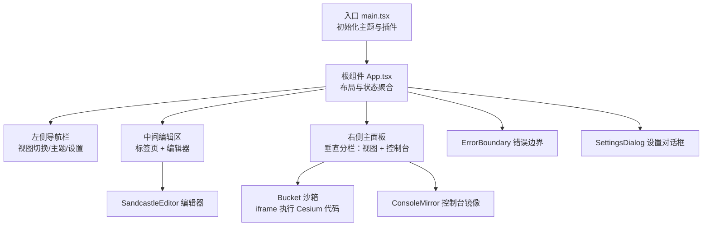
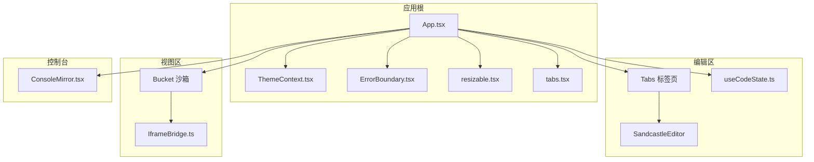
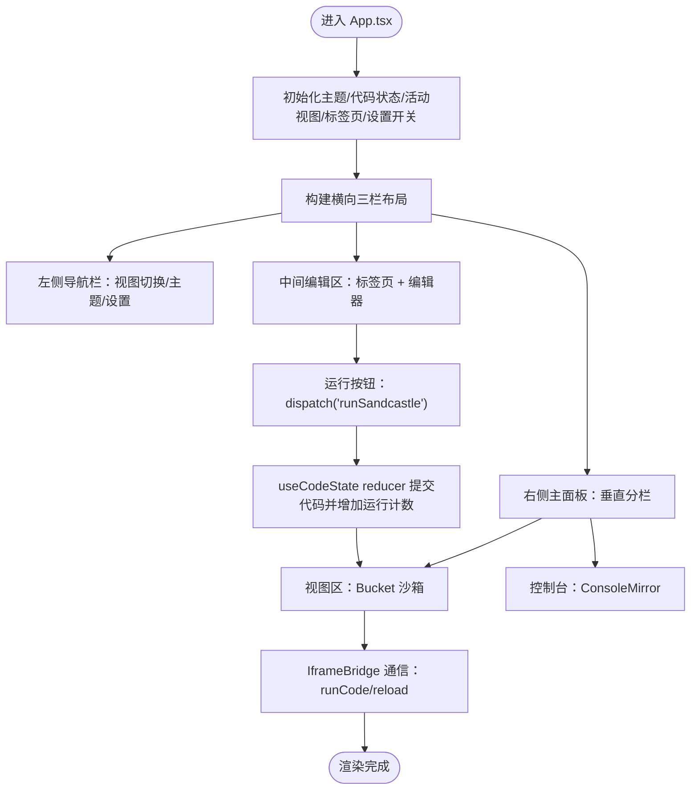
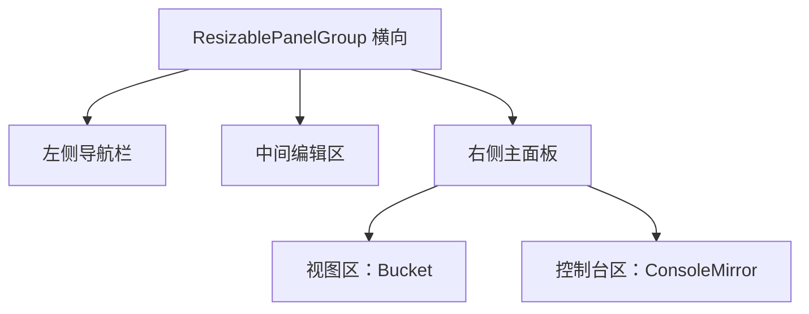
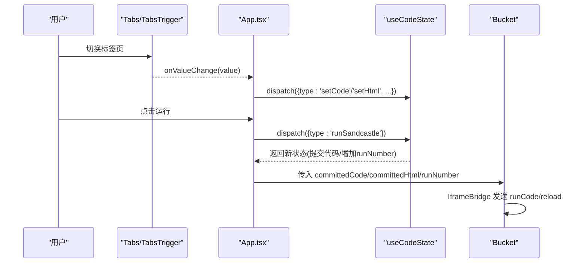
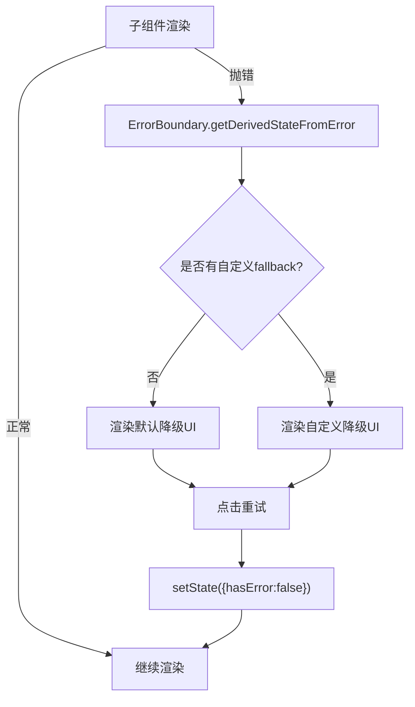
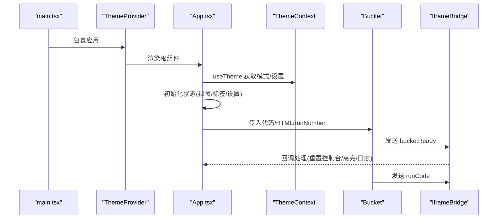
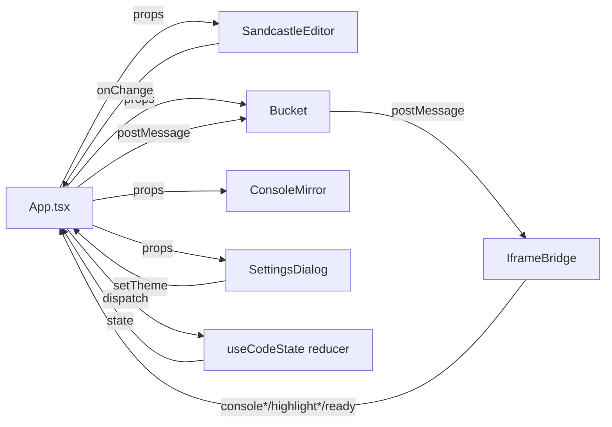
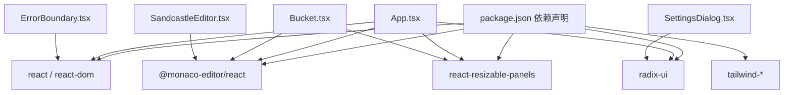

# 应用主组件

<cite>
**本文档引用的文件**
- [App.tsx](file://apps/cesium-web/src/App.tsx)
- [main.tsx](file://apps/cesium-web/src/main.tsx)
- [ErrorBoundary.tsx](file://apps/cesium-web/src/components/ErrorBoundary/ErrorBoundary.tsx)
- [resizable.tsx](file://apps/cesium-web/src/components/ui/resizable.tsx)
- [tabs.tsx](file://apps/cesium-web/src/components/ui/tabs.tsx)
- [useCodeState.ts](file://apps/cesium-web/src/hooks/useCodeState.ts)
- [ThemeContext.tsx](file://apps/cesium-web/src/contexts/ThemeContext.tsx)
- [SandcastleEditor.tsx](file://apps/cesium-web/src/components/SandcastleEditor/SandcastleEditor.tsx)
- [ConsoleMirror.tsx](file://apps/cesium-web/src/components/ConsoleMirror/ConsoleMirror.tsx)
- [Bucket.tsx](file://apps/cesium-web/src/components/Bucket/Bucket.tsx)
- [IframeBridge.ts](file://apps/cesium-web/src/util/IframeBridge.ts)
- [SettingsDialog.tsx](file://apps/cesium-web/src/components/SettingsDialog/SettingsDialog.tsx)
- [package.json](file://apps/cesium-web/package.json)
</cite>

## 目录

1. [简介](#简介)
2. [项目结构](#项目结构)
3. [核心组件](#核心组件)
4. [架构总览](#架构总览)
5. [详细组件分析](#详细组件分析)
6. [依赖关系分析](#依赖关系分析)
7. [性能考虑](#性能考虑)
8. [故障排查指南](#故障排查指南)
9. [结论](#结论)
10. [附录](#附录)

## 简介

本文件聚焦于应用主组件 App.tsx 的整体架构设计与组件组织，系统性阐述布局结构、状态管理、组件协调机制，以及左侧导航栏、右侧主面板分层布局、底部控制台集成方式。同时深入解析响应式面板组的实现原理、标签页系统的切换逻辑、错误边界处理机制、应用启动流程、组件生命周期管理与性能优化策略，并总结组件间通信模式、状态提升与数据流向，最后提供组件开发规范与扩展指南。

## 项目结构

应用采用“入口 -> 主组件 -> 子组件”的层次化组织方式：

- 入口文件负责初始化主题上下文、安装插件并渲染根组件。
- 主组件 App.tsx 作为应用的根容器，组织左右分栏与上下分栏的布局，承载状态与交互。
- 子组件包括编辑器、画布沙箱、控制台镜像、设置对话框、错误边界等，分别承担编辑、渲染、调试与配置职责。
- 布局通过可调整尺寸的面板组实现，标签页系统提供多语言代码编辑体验。

图表来源

- [main.tsx:12-18](file://apps/cesium-web/src/main.tsx#L12-L18)
- [App.tsx:22-145](file://apps/cesium-web/src/App.tsx#L22-L145)

章节来源

- [main.tsx:1-19](file://apps/cesium-web/src/main.tsx#L1-L19)
- [App.tsx:15-149](file://apps/cesium-web/src/App.tsx#L15-L149)

## 核心组件

- 布局容器与状态
  - 使用响应式面板组进行横向与纵向分栏，支持拖拽调整尺寸。
  - 通过本地状态管理活动视图（编辑器/画廊）、活动标签页（JavaScript/HTML）、设置对话框开关与主题模式。
- 编辑器与标签页
  - 标签页系统提供 JavaScript 与 HTML/CSS 两页，支持切换与运行按钮触发执行。
  - 编辑器基于 Monaco Editor，按主题自动选择编辑器主题。
- 画布沙箱与控制台
  - Bucket 组件在 iframe 中隔离执行用户代码，通过桥接工具与父窗口通信，实现控制台消息镜像、高亮提示与重新加载。
  - ConsoleMirror 作为控制台展示容器，占位显示消息。
- 错误边界
  - 捕获子组件渲染阶段错误，提供降级 UI 与重试能力。
- 设置对话框
  - 提供通用、编辑器、Cesium 三大标签页，当前包含主题切换与资源路径等占位项。

章节来源

- [App.tsx:15-149](file://apps/cesium-web/src/App.tsx#L15-L149)
- [resizable.tsx:6-43](file://apps/cesium-web/src/components/ui/resizable.tsx#L6-L43)
- [tabs.tsx:7-69](file://apps/cesium-web/src/components/ui/tabs.tsx#L7-L69)
- [SandcastleEditor.tsx:44-72](file://apps/cesium-web/src/components/SandcastleEditor/SandcastleEditor.tsx#L44-L72)
- [Bucket.tsx:53-134](file://apps/cesium-web/src/components/Bucket/Bucket.tsx#L53-L134)
- [ConsoleMirror.tsx:10-24](file://apps/cesium-web/src/components/ConsoleMirror/ConsoleMirror.tsx#L10-L24)
- [ErrorBoundary.tsx:50-130](file://apps/cesium-web/src/components/ErrorBoundary/ErrorBoundary.tsx#L50-L130)
- [SettingsDialog.tsx:19-147](file://apps/cesium-web/src/components/SettingsDialog/SettingsDialog.tsx#L19-L147)

## 架构总览

应用采用“容器-展示”分离与“状态提升 + 单向数据流”的设计原则：

- App.tsx 聚合应用状态（代码、HTML、运行计数、活动视图、活动标签页、主题模式、设置开关），向下传递给子组件。
- 子组件通过回调或上下文读取状态，避免跨层级共享复杂状态。
- 错误边界包裹关键区域，确保局部错误不影响全局。
- Bucket 与父窗口通过桥接工具进行类型安全的跨帧通信。

图表来源

- [App.tsx:15-149](file://apps/cesium-web/src/App.tsx#L15-L149)
- [ThemeContext.tsx:57-99](file://apps/cesium-web/src/contexts/ThemeContext.tsx#L57-L99)
- [ErrorBoundary.tsx:50-130](file://apps/cesium-web/src/components/ErrorBoundary/ErrorBoundary.tsx#L50-L130)
- [resizable.tsx:6-43](file://apps/cesium-web/src/components/ui/resizable.tsx#L6-L43)
- [tabs.tsx:7-69](file://apps/cesium-web/src/components/ui/tabs.tsx#L7-L69)
- [useCodeState.ts:118-122](file://apps/cesium-web/src/hooks/useCodeState.ts#L118-L122)
- [SandcastleEditor.tsx:44-72](file://apps/cesium-web/src/components/SandcastleEditor/SandcastleEditor.tsx#L44-L72)
- [Bucket.tsx:53-134](file://apps/cesium-web/src/components/Bucket/Bucket.tsx#L53-L134)
- [IframeBridge.ts:78-182](file://apps/cesium-web/src/util/IframeBridge.ts#L78-L182)
- [ConsoleMirror.tsx:10-24](file://apps/cesium-web/src/components/ConsoleMirror/ConsoleMirror.tsx#L10-L24)

## 详细组件分析

### App.tsx：布局与状态协调

- 布局结构
  - 横向三栏：左侧导航栏、中间编辑区、右侧主面板（纵向分为视图区与控制台）。
  - 导航栏提供视图切换（画廊/编辑器）、主题切换、设置入口。
  - 编辑区采用标签页系统，支持 JavaScript 与 HTML/CSS 代码编辑与运行。
  - 主面板内嵌 Bucket 沙箱与 ConsoleMirror 控制台。
- 状态管理
  - 本地状态：活动视图、活动标签页、设置对话框开关、主题模式。
  - 全局状态：代码与 HTML 的编辑态与已提交态、运行计数、脏标记，通过 useCodeState 管理。
- 组件协调
  - 标签页切换与运行按钮通过 dispatch 触发状态机更新，驱动沙箱重新执行。
  - 错误边界包裹编辑区与视图区，保证局部异常不影响整体。
  - 设置对话框通过主题上下文影响编辑器主题与页面类名。

图表来源

- [App.tsx:15-149](file://apps/cesium-web/src/App.tsx#L15-L149)
- [useCodeState.ts:63-110](file://apps/cesium-web/src/hooks/useCodeState.ts#L63-L110)
- [Bucket.tsx:59-110](file://apps/cesium-web/src/components/Bucket/Bucket.tsx#L59-L110)
- [IframeBridge.ts:122-129](file://apps/cesium-web/src/util/IframeBridge.ts#L122-L129)

章节来源

- [App.tsx:15-149](file://apps/cesium-web/src/App.tsx#L15-L149)

### 响应式面板组与分层布局

- 横向布局
  - 左侧固定宽度导航栏，中间为可调整尺寸的编辑区，右侧为可调整尺寸的主面板。
- 纵向布局
  - 右侧主面板内部再分为上下两部分：上方为视图区（Bucket），下方为控制台区。
- 拖拽与最小尺寸
  - 通过 handle 与 minSize/defaultSize 控制面板尺寸范围，保障可用性。

图表来源

- [App.tsx:24-141](file://apps/cesium-web/src/App.tsx#L24-L141)
- [resizable.tsx:6-43](file://apps/cesium-web/src/components/ui/resizable.tsx#L6-L43)

章节来源

- [App.tsx:24-141](file://apps/cesium-web/src/App.tsx#L24-L141)
- [resizable.tsx:6-43](file://apps/cesium-web/src/components/ui/resizable.tsx#L6-L43)

### 标签页系统与切换逻辑

- 标签页组件
  - Tabs、TabsList、TabsTrigger、TabsContent 提供可定制的标签页 UI。
  - 支持 variant="line" 的线性样式，适配顶部操作区。
- 切换与运行
  - activeTab 管理当前语言页签；onValueChange 更新编辑器内容。
  - 运行按钮触发 dispatch('runSandcastle')，提交当前代码并增加运行计数，驱动沙箱重新执行。

图表来源

- [App.tsx:74-103](file://apps/cesium-web/src/App.tsx#L74-L103)
- [tabs.tsx:34-63](file://apps/cesium-web/src/components/ui/tabs.tsx#L34-L63)
- [useCodeState.ts:63-110](file://apps/cesium-web/src/hooks/useCodeState.ts#L63-L110)
- [Bucket.tsx:59-110](file://apps/cesium-web/src/components/Bucket/Bucket.tsx#L59-L110)
- [IframeBridge.ts:122-129](file://apps/cesium-web/src/util/IframeBridge.ts#L122-L129)

章节来源

- [App.tsx:74-103](file://apps/cesium-web/src/App.tsx#L74-L103)
- [tabs.tsx:34-63](file://apps/cesium-web/src/components/ui/tabs.tsx#L34-L63)
- [useCodeState.ts:63-110](file://apps/cesium-web/src/hooks/useCodeState.ts#L63-L110)

### 错误边界处理机制

- 捕获范围
  - 捕获子组件渲染阶段、生命周期与构造函数中的错误；无法捕获事件处理器、异步与服务端渲染错误。
- 降级 UI
  - 优先使用自定义 fallback；否则使用内置错误提示与重试按钮。
- 日志与恢复
  - 捕获错误时打印控制台日志；重试按钮可清空错误状态并恢复渲染。

图表来源

- [ErrorBoundary.tsx:68-122](file://apps/cesium-web/src/components/ErrorBoundary/ErrorBoundary.tsx#L68-L122)

章节来源

- [ErrorBoundary.tsx:50-130](file://apps/cesium-web/src/components/ErrorBoundary/ErrorBoundary.tsx#L50-L130)

### 应用启动流程与生命周期

- 启动流程
  - main.tsx 安装插件、初始化 ThemeProvider，渲染 App。
  - App.tsx 初始化主题、代码状态、活动视图与标签页，构建布局。
- 生命周期
  - App.tsx 作为根组件，负责状态提升与事件分发。
  - Bucket 在 ready 后首次发送 runCode，后续根据 runNumber 变化发送 reload。
  - 主题变更通过 ThemeProvider 同步 DOM class 与 localStorage。

图表来源

- [main.tsx:9-18](file://apps/cesium-web/src/main.tsx#L9-L18)
- [ThemeContext.tsx:57-99](file://apps/cesium-web/src/contexts/ThemeContext.tsx#L57-L99)
- [App.tsx:15-149](file://apps/cesium-web/src/App.tsx#L15-L149)
- [Bucket.tsx:59-110](file://apps/cesium-web/src/components/Bucket/Bucket.tsx#L59-L110)
- [IframeBridge.ts:122-129](file://apps/cesium-web/src/util/IframeBridge.ts#L122-L129)

章节来源

- [main.tsx:9-18](file://apps/cesium-web/src/main.tsx#L9-L18)
- [ThemeContext.tsx:57-99](file://apps/cesium-web/src/contexts/ThemeContext.tsx#L57-L99)
- [App.tsx:15-149](file://apps/cesium-web/src/App.tsx#L15-L149)

### 组件间通信模式与数据流向

- 单向数据流
  - App.tsx 作为状态中心，通过 props 向子组件传递状态与回调。
  - 子组件通过回调向上游分发动作，由 useCodeState reducer 统一更新状态。
- 跨帧通信
  - Bucket 与父窗口通过 IframeBridge 进行类型安全通信，父窗口负责控制台镜像与高亮提示。
- 主题联动
  - 编辑器主题随 resolvedTheme 自动切换，ThemeProvider 同步 DOM class 与存储。

图表来源

- [App.tsx:92-130](file://apps/cesium-web/src/App.tsx#L92-L130)
- [SandcastleEditor.tsx:44-72](file://apps/cesium-web/src/components/SandcastleEditor/SandcastleEditor.tsx#L44-L72)
- [useCodeState.ts:118-122](file://apps/cesium-web/src/hooks/useCodeState.ts#L118-L122)
- [Bucket.tsx:53-134](file://apps/cesium-web/src/components/Bucket/Bucket.tsx#L53-L134)
- [IframeBridge.ts:78-182](file://apps/cesium-web/src/util/IframeBridge.ts#L78-L182)

章节来源

- [App.tsx:92-130](file://apps/cesium-web/src/App.tsx#L92-L130)
- [SandcastleEditor.tsx:44-72](file://apps/cesium-web/src/components/SandcastleEditor/SandcastleEditor.tsx#L44-L72)
- [useCodeState.ts:118-122](file://apps/cesium-web/src/hooks/useCodeState.ts#L118-L122)
- [Bucket.tsx:53-134](file://apps/cesium-web/src/components/Bucket/Bucket.tsx#L53-L134)
- [IframeBridge.ts:78-182](file://apps/cesium-web/src/util/IframeBridge.ts#L78-L182)

## 依赖关系分析

- 组件依赖
  - App.tsx 依赖主题上下文、代码状态钩子、UI 组件库与业务组件。
  - Bucket 依赖桥接工具与辅助函数，负责与 iframe 通信。
- 外部依赖
  - Monaco Editor 提供代码编辑能力。
  - react-resizable-panels 提供可调整尺寸的面板组。
  - radix-ui 提供标签页等无障碍 UI 原语。

图表来源

- [package.json:12-28](file://apps/cesium-web/package.json#L12-L28)
- [App.tsx:1-13](file://apps/cesium-web/src/App.tsx#L1-L13)

章节来源

- [package.json:12-28](file://apps/cesium-web/package.json#L12-L28)
- [App.tsx:1-13](file://apps/cesium-web/src/App.tsx#L1-L13)

## 性能考虑

- 渲染优化
  - 编辑器组件使用 memo 包装，避免不必要的重渲染。
  - 标签页与面板组件均采用轻量封装，减少渲染开销。
- 计算与通信
  - 运行计数器仅在运行时递增，用于触发 iframe 刷新，避免频繁重建。
  - 桥接工具对消息来源与信封结构进行严格校验，过滤无关流量。
- 主题与布局
  - 主题切换通过 DOM class 与 localStorage 同步，避免深层重渲染。
  - 面板组支持自动布局与最小尺寸限制，提升可用性与稳定性。

章节来源

- [SandcastleEditor.tsx:71-72](file://apps/cesium-web/src/components/SandcastleEditor/SandcastleEditor.tsx#L71-L72)
- [Bucket.tsx:59-66](file://apps/cesium-web/src/components/Bucket/Bucket.tsx#L59-L66)
- [IframeBridge.ts:150-169](file://apps/cesium-web/src/util/IframeBridge.ts#L150-L169)
- [ThemeContext.tsx:64-74](file://apps/cesium-web/src/contexts/ThemeContext.tsx#L64-L74)

## 故障排查指南

- 编辑器无响应
  - 检查主题是否正确同步至 DOM class，确认编辑器主题与页面主题一致。
  - 确认 onChange 回调是否正确分发到 dispatch。
- 沙箱不执行
  - 确认 Bucket 是否收到 bucketReady 消息并发送 runCode。
  - 检查 runNumber 是否递增，以触发 reload。
- 控制台无输出
  - 确认 ConsoleMirror 是否正确接收 consoleLog/consoleError/consoleWarn 消息。
  - 检查桥接工具的 remoteOrigin 与 postMessage 目标窗口是否匹配。
- 错误边界误触发
  - 确认错误是否发生在渲染阶段或生命周期内；事件处理器与异步错误需在子组件内自行捕获。

章节来源

- [ThemeContext.tsx:64-74](file://apps/cesium-web/src/contexts/ThemeContext.tsx#L64-L74)
- [Bucket.tsx:69-110](file://apps/cesium-web/src/components/Bucket/Bucket.tsx#L69-L110)
- [IframeBridge.ts:122-129](file://apps/cesium-web/src/util/IframeBridge.ts#L122-L129)
- [ErrorBoundary.tsx:68-82](file://apps/cesium-web/src/components/ErrorBoundary/ErrorBoundary.tsx#L68-L82)

## 结论

App.tsx 通过清晰的布局划分、统一的状态管理与健壮的错误边界，构建了可扩展的开发环境。横向与纵向的响应式面板组提供了灵活的界面组织方式；标签页系统与编辑器结合实现了多语言代码编辑与一键运行；Bucket 与 IframeBridge 的跨帧通信保障了 Cesium 代码的安全执行与调试反馈。整体设计遵循单向数据流与状态提升原则，便于维护与扩展。

## 附录

### 组件开发规范与扩展指南

- 状态管理
  - 优先使用 useCodeState 管理代码与运行状态，避免在子组件中分散状态。
  - 对于主题与全局配置，使用 ThemeContext 提供统一入口。
- 组件通信
  - 通过 props 向下传递状态，通过回调向上游分发动作。
  - 跨帧通信必须使用 IframeBridge 并严格校验消息来源与信封结构。
- 布局与样式
  - 使用 resizable 组件实现可调整尺寸的面板，合理设置 minSize/defaultSize。
  - 标签页样式通过 variant 与类名组合实现，保持一致性。
- 错误处理
  - 对关键区域使用 ErrorBoundary 包裹，提供降级 UI 与重试能力。
  - 对事件处理器与异步错误，应在子组件内自行 try/catch 并上报。
- 性能优化
  - 对昂贵的渲染组件使用 memo 包装。
  - 避免在渲染过程中进行重型计算，必要时使用 useMemo/useCallback。
  - 控制面板数量与嵌套层级，减少重排与重绘。

章节来源

- [useCodeState.ts:118-122](file://apps/cesium-web/src/hooks/useCodeState.ts#L118-L122)
- [ThemeContext.tsx:101-107](file://apps/cesium-web/src/contexts/ThemeContext.tsx#L101-L107)
- [resizable.tsx:6-43](file://apps/cesium-web/src/components/ui/resizable.tsx#L6-L43)
- [tabs.tsx:19-32](file://apps/cesium-web/src/components/ui/tabs.tsx#L19-L32)
- [ErrorBoundary.tsx:90-122](file://apps/cesium-web/src/components/ErrorBoundary/ErrorBoundary.tsx#L90-L122)
- [SandcastleEditor.tsx:71-72](file://apps/cesium-web/src/components/SandcastleEditor/SandcastleEditor.tsx#L71-L72)
