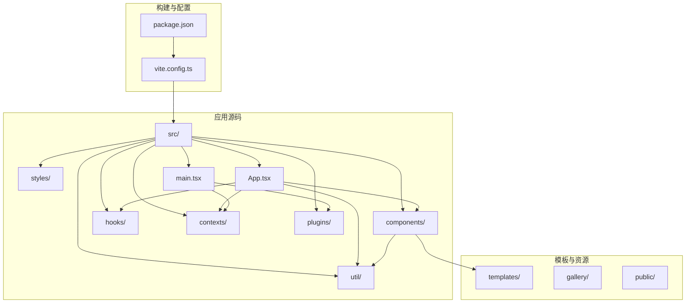
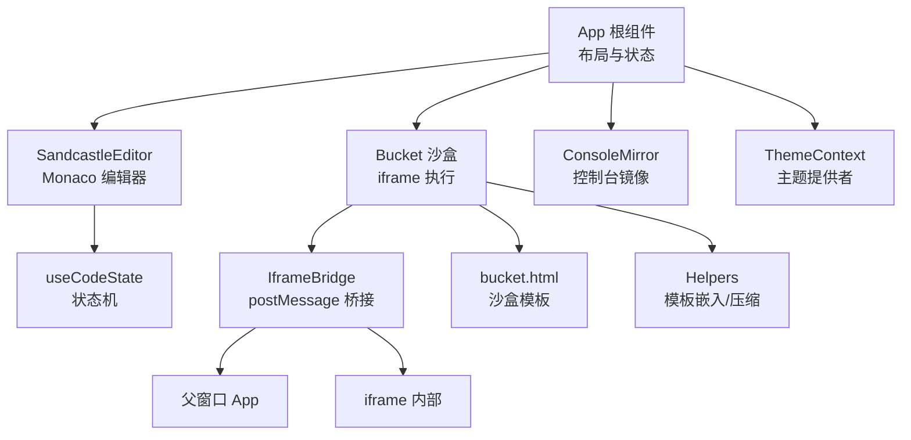
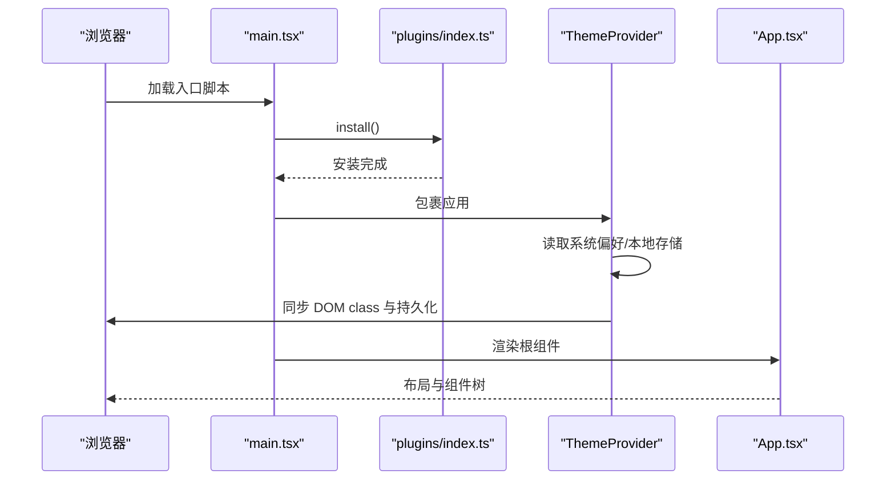
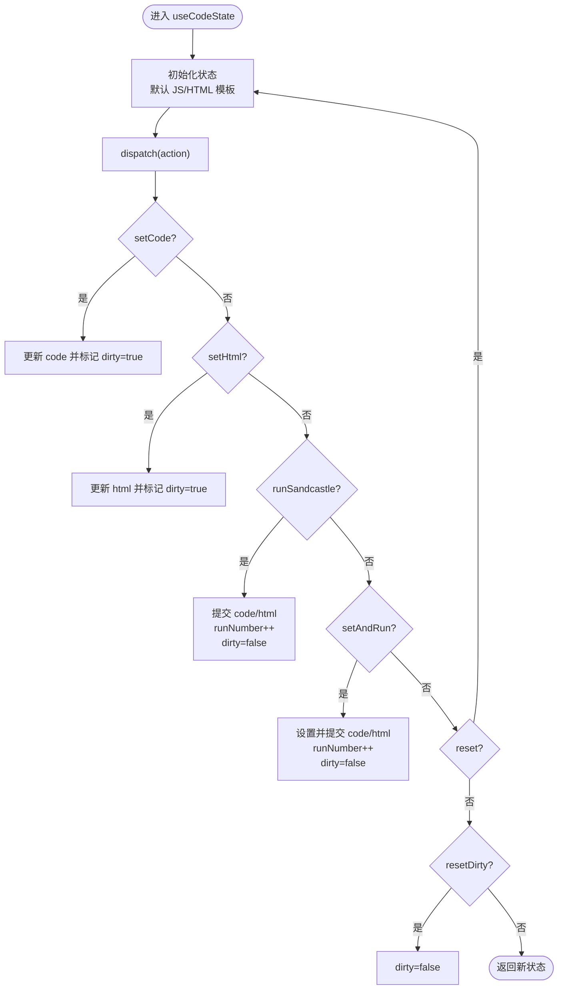
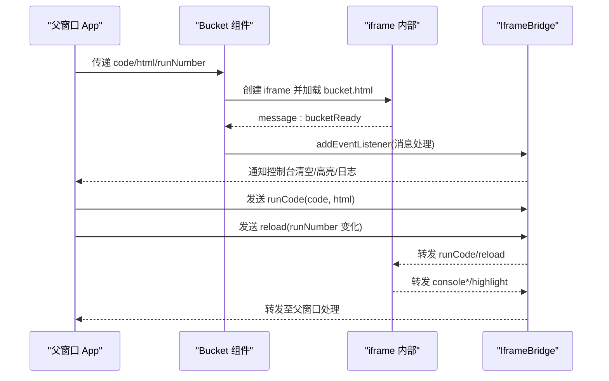
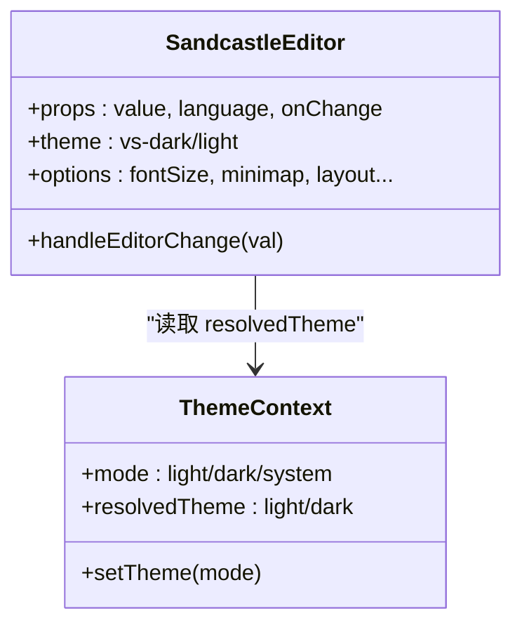
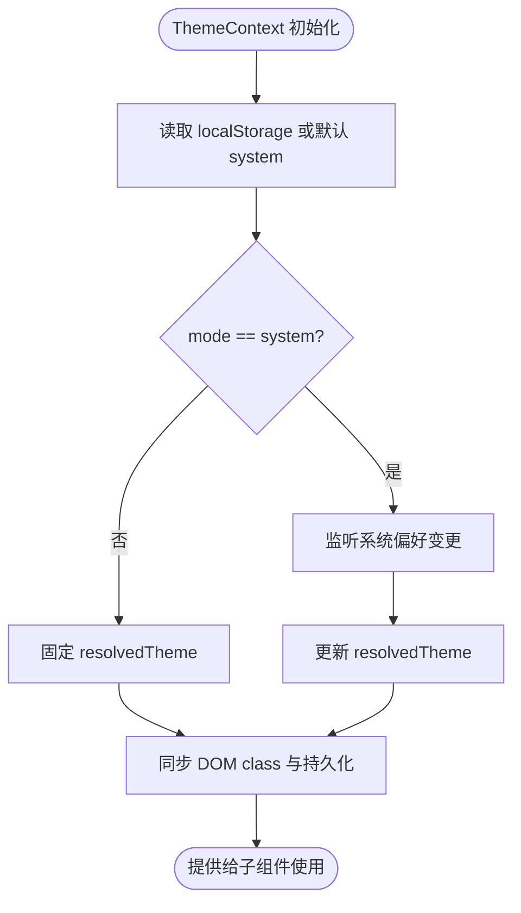
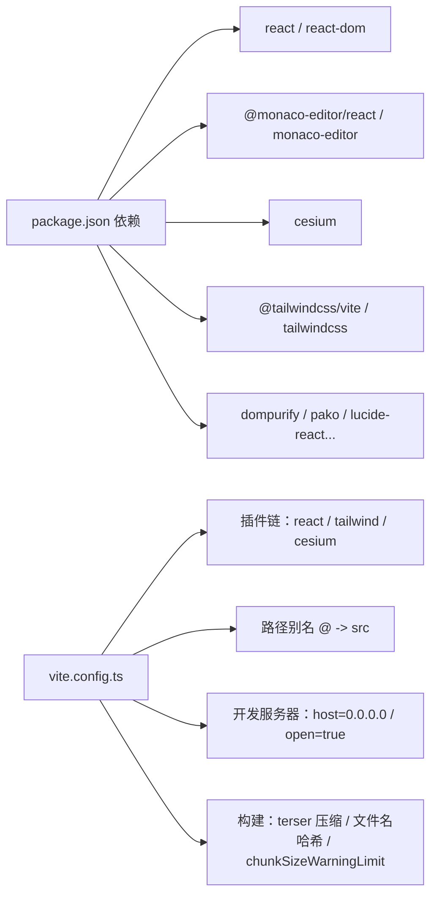

# 应用层架构

<cite>
**本文档引用的文件**
- [apps/cesium-web/package.json](file://apps/cesium-web/package.json)
- [apps/cesium-web/src/main.tsx](file://apps/cesium-web/src/main.tsx)
- [apps/cesium-web/src/App.tsx](file://apps/cesium-web/src/App.tsx)
- [apps/cesium-web/vite.config.ts](file://apps/cesium-web/vite.config.ts)
- [apps/cesium-web/templates/bucket.html](file://apps/cesium-web/templates/bucket.html)
- [apps/cesium-web/src/components/Bucket/Bucket.tsx](file://apps/cesium-web/src/components/Bucket/Bucket.tsx)
- [apps/cesium-web/src/components/SandcastleEditor/SandcastleEditor.tsx](file://apps/cesium-web/src/components/SandcastleEditor/SandcastleEditor.tsx)
- [apps/cesium-web/src/hooks/useCodeState.ts](file://apps/cesium-web/src/hooks/useCodeState.ts)
- [apps/cesium-web/src/contexts/ThemeContext.tsx](file://apps/cesium-web/src/contexts/ThemeContext.tsx)
- [apps/cesium-web/src/plugins/index.ts](file://apps/cesium-web/src/plugins/index.ts)
- [apps/cesium-web/src/util/IframeBridge.ts](file://apps/cesium-web/src/util/IframeBridge.ts)
- [apps/cesium-web/src/util/Helpers.ts](file://apps/cesium-web/src/util/Helpers.ts)
- [apps/cesium-web/src/components/ConsoleMirror/ConsoleMirror.tsx](file://apps/cesium-web/src/components/ConsoleMirror/ConsoleMirror.tsx)
- [apps/cesium-web/src/components/ErrorBoundary/ErrorBoundary.tsx](file://apps/cesium-web/src/components/ErrorBoundary/ErrorBoundary.tsx)
- [apps/cesium-web/src/styles/index.css](file://apps/cesium-web/src/styles/index.css)
</cite>

## 目录

1. [简介](#简介)
2. [项目结构](#项目结构)
3. [核心组件](#核心组件)
4. [架构总览](#架构总览)
5. [详细组件分析](#详细组件分析)
6. [依赖关系分析](#依赖关系分析)
7. [性能考虑](#性能考虑)
8. [故障排查指南](#故障排查指南)
9. [结论](#结论)
10. [附录](#附录)

## 简介

本文件面向 cesium-web 应用的应用层架构，系统性阐述 React 应用的目录结构、组件层次与状态管理模式；深入解释沙盒执行系统（Bucket 组件）的架构设计与安全隔离机制；描述代码编辑器（Monaco Editor）集成与实时预览机制；解释主题系统、路由管理与构建配置；并提供应用启动流程、组件生命周期与性能优化策略，以及组件开发规范与扩展指南。

## 项目结构

应用采用多包工作区结构，核心应用位于 apps/cesium-web。前端采用 Vite + React 19 + TypeScript，样式使用 Tailwind CSS v4。项目关键目录与职责如下：

- apps/cesium-web/src：应用源码
  - components：可复用 UI 组件与业务组件（如 Bucket、SandcastleEditor、ConsoleMirror、ErrorBoundary）
  - hooks：自定义 Hook（如 useCodeState）
  - contexts：全局上下文（如 ThemeContext）
  - util：工具模块（如 IframeBridge、Helpers）
  - plugins：插件入口（预留）
  - styles：样式入口
  - main.tsx/App.tsx：应用入口与根组件
- apps/cesium-web/templates：模板资源（如 bucket.html）
- apps/cesium-web/public/scripts：开发服务器脚本
- apps/cesium-web/gallery：示例画廊（占位）
- 构建与开发：vite.config.ts、package.json scripts

图表来源

- [apps/cesium-web/src/main.tsx:1-19](file://apps/cesium-web/src/main.tsx#L1-L19)
- [apps/cesium-web/src/App.tsx:1-149](file://apps/cesium-web/src/App.tsx#L1-L149)
- [apps/cesium-web/vite.config.ts:1-81](file://apps/cesium-web/vite.config.ts#L1-L81)

章节来源

- [apps/cesium-web/package.json:1-51](file://apps/cesium-web/package.json#L1-L51)
- [apps/cesium-web/src/main.tsx:1-19](file://apps/cesium-web/src/main.tsx#L1-L19)
- [apps/cesium-web/src/App.tsx:1-149](file://apps/cesium-web/src/App.tsx#L1-L149)
- [apps/cesium-web/vite.config.ts:1-81](file://apps/cesium-web/vite.config.ts#L1-L81)

## 核心组件

- 应用入口与初始化
  - main.tsx：初始化插件、主题提供者与根组件渲染
  - App.tsx：应用根布局、视图切换、状态管理与组件组合
- 编辑器与状态
  - SandcastleEditor：基于 Monaco Editor 的代码编辑器，支持主题联动
  - useCodeState：useReducer 管理代码、HTML、提交态、运行计数与脏标记
- 沙盒执行系统
  - Bucket：iframe 沙盒容器，负责与 iframe 内部通信与安全隔离
  - IframeBridge：类型安全的 postMessage 桥接，带来源校验与消息信封
  - Helpers：代码模板嵌入与 URL 存档压缩/解压
- 主题系统
  - ThemeContext：主题模式（light/dark/system）、持久化与系统偏好监听
- 边界与辅助
  - ErrorBoundary：子树错误边界，提供降级 UI 与重试
  - ConsoleMirror：控制台镜像占位（后续可接入真实控制台）

章节来源

- [apps/cesium-web/src/main.tsx:1-19](file://apps/cesium-web/src/main.tsx#L1-L19)
- [apps/cesium-web/src/App.tsx:1-149](file://apps/cesium-web/src/App.tsx#L1-L149)
- [apps/cesium-web/src/components/SandcastleEditor/SandcastleEditor.tsx:1-73](file://apps/cesium-web/src/components/SandcastleEditor/SandcastleEditor.tsx#L1-L73)
- [apps/cesium-web/src/hooks/useCodeState.ts:1-123](file://apps/cesium-web/src/hooks/useCodeState.ts#L1-L123)
- [apps/cesium-web/src/components/Bucket/Bucket.tsx:1-135](file://apps/cesium-web/src/components/Bucket/Bucket.tsx#L1-L135)
- [apps/cesium-web/src/util/IframeBridge.ts:1-183](file://apps/cesium-web/src/util/IframeBridge.ts#L1-L183)
- [apps/cesium-web/src/util/Helpers.ts:1-137](file://apps/cesium-web/src/util/Helpers.ts#L1-L137)
- [apps/cesium-web/src/contexts/ThemeContext.tsx:1-108](file://apps/cesium-web/src/contexts/ThemeContext.tsx#L1-L108)
- [apps/cesium-web/src/components/ErrorBoundary/ErrorBoundary.tsx:1-130](file://apps/cesium-web/src/components/ErrorBoundary/ErrorBoundary.tsx#L1-L130)
- [apps/cesium-web/src/components/ConsoleMirror/ConsoleMirror.tsx:1-25](file://apps/cesium-web/src/components/ConsoleMirror/ConsoleMirror.tsx#L1-L25)

## 架构总览

应用采用“根组件组合 + 沙盒 iframe 执行”的双层架构：

- 前端层：React 组件树负责布局、状态、主题与交互
- 执行层：Bucket 在 iframe 中执行用户代码，通过 IframeBridge 与父窗口通信
- 编辑器层：Monaco Editor 提供代码输入与语法高亮，与状态机联动
- 主题层：ThemeContext 提供主题模式与持久化，影响编辑器与组件外观

图表来源

- [apps/cesium-web/src/App.tsx:1-149](file://apps/cesium-web/src/App.tsx#L1-L149)
- [apps/cesium-web/src/components/SandcastleEditor/SandcastleEditor.tsx:1-73](file://apps/cesium-web/src/components/SandcastleEditor/SandcastleEditor.tsx#L1-L73)
- [apps/cesium-web/src/hooks/useCodeState.ts:1-123](file://apps/cesium-web/src/hooks/useCodeState.ts#L1-L123)
- [apps/cesium-web/src/components/Bucket/Bucket.tsx:1-135](file://apps/cesium-web/src/components/Bucket/Bucket.tsx#L1-L135)
- [apps/cesium-web/src/util/IframeBridge.ts:1-183](file://apps/cesium-web/src/util/IframeBridge.ts#L1-L183)
- [apps/cesium-web/templates/bucket.html:1-84](file://apps/cesium-web/templates/bucket.html#L1-L84)
- [apps/cesium-web/src/util/Helpers.ts:1-137](file://apps/cesium-web/src/util/Helpers.ts#L1-L137)

## 详细组件分析

### 应用启动与初始化流程

- 插件安装：应用启动时调用 plugins.install，目前为空实现，预留扩展点
- 主题提供者：ThemeProvider 包裹应用，读取系统偏好与本地存储，同步 DOM class 与持久化
- 根组件渲染：App 作为顶层容器，组合编辑器、沙盒、控制台与设置对话框

图表来源

- [apps/cesium-web/src/main.tsx:1-19](file://apps/cesium-web/src/main.tsx#L1-L19)
- [apps/cesium-web/src/plugins/index.ts:1-4](file://apps/cesium-web/src/plugins/index.ts#L1-L4)
- [apps/cesium-web/src/contexts/ThemeContext.tsx:1-108](file://apps/cesium-web/src/contexts/ThemeContext.tsx#L1-L108)
- [apps/cesium-web/src/App.tsx:1-149](file://apps/cesium-web/src/App.tsx#L1-L149)

章节来源

- [apps/cesium-web/src/main.tsx:1-19](file://apps/cesium-web/src/main.tsx#L1-L19)
- [apps/cesium-web/src/plugins/index.ts:1-4](file://apps/cesium-web/src/plugins/index.ts#L1-L4)
- [apps/cesium-web/src/contexts/ThemeContext.tsx:1-108](file://apps/cesium-web/src/contexts/ThemeContext.tsx#L1-L108)
- [apps/cesium-web/src/App.tsx:1-149](file://apps/cesium-web/src/App.tsx#L1-L149)

### 状态管理模式（useCodeState）

- 状态结构：包含当前编辑代码、HTML、已提交代码/HTML、运行计数与脏标记
- 行为类型：重置、设置代码/HTML、运行、设置并运行、重置脏标记
- 作用：统一管理编辑态与提交态，驱动 Bucket 重新执行与控制台刷新

图表来源

- [apps/cesium-web/src/hooks/useCodeState.ts:1-123](file://apps/cesium-web/src/hooks/useCodeState.ts#L1-L123)

章节来源

- [apps/cesium-web/src/hooks/useCodeState.ts:1-123](file://apps/cesium-web/src/hooks/useCodeState.ts#L1-L123)

### 沙盒执行系统（Bucket 与 IframeBridge）

- 安全隔离：iframe sandbox 属性启用脚本与同源执行，限制能力以降低风险
- 模板加载：通过 bucket.html 作为沙盒基础模板，注入 Cesium 资源与最小样式
- 通信机制：IframeBridge 提供类型安全的 postMessage 通道，带来源校验与消息信封
- 生命周期：父窗口在 bucketReady 后发送 runCode，随后根据 runNumber 变化触发 reload

图表来源

- [apps/cesium-web/src/components/Bucket/Bucket.tsx:1-135](file://apps/cesium-web/src/components/Bucket/Bucket.tsx#L1-L135)
- [apps/cesium-web/src/util/IframeBridge.ts:1-183](file://apps/cesium-web/src/util/IframeBridge.ts#L1-L183)
- [apps/cesium-web/templates/bucket.html:1-84](file://apps/cesium-web/templates/bucket.html#L1-L84)

章节来源

- [apps/cesium-web/src/components/Bucket/Bucket.tsx:1-135](file://apps/cesium-web/src/components/Bucket/Bucket.tsx#L1-L135)
- [apps/cesium-web/src/util/IframeBridge.ts:1-183](file://apps/cesium-web/src/util/IframeBridge.ts#L1-L183)
- [apps/cesium-web/templates/bucket.html:1-84](file://apps/cesium-web/templates/bucket.html#L1-L84)

### 代码编辑器（Monaco Editor）集成

- 组件封装：SandcastleEditor 基于 @monaco-editor/react，统一主题与编辑器选项
- 选项配置：禁用 minimap、自动布局、行高亮、字体与缩进等，兼顾性能与可用性
- 与状态联动：onChange 回调通过 useCodeState 分发器更新代码状态

图表来源

- [apps/cesium-web/src/components/SandcastleEditor/SandcastleEditor.tsx:1-73](file://apps/cesium-web/src/components/SandcastleEditor/SandcastleEditor.tsx#L1-L73)
- [apps/cesium-web/src/contexts/ThemeContext.tsx:1-108](file://apps/cesium-web/src/contexts/ThemeContext.tsx#L1-L108)

章节来源

- [apps/cesium-web/src/components/SandcastleEditor/SandcastleEditor.tsx:1-73](file://apps/cesium-web/src/components/SandcastleEditor/SandcastleEditor.tsx#L1-L73)
- [apps/cesium-web/src/contexts/ThemeContext.tsx:1-108](file://apps/cesium-web/src/contexts/ThemeContext.tsx#L1-L108)

### 主题系统与样式

- 主题提供者：支持 light/dark/system 三种模式，持久化到 localStorage，同步 DOM class
- 系统偏好监听：当模式为 system 时监听 prefers-color-scheme 变化
- 样式入口：index.css 导入 tailwind.css，Tailwind v4 通过 Vite 插件集成

图表来源

- [apps/cesium-web/src/contexts/ThemeContext.tsx:1-108](file://apps/cesium-web/src/contexts/ThemeContext.tsx#L1-L108)
- [apps/cesium-web/src/styles/index.css:1-2](file://apps/cesium-web/src/styles/index.css#L1-L2)
- [apps/cesium-web/vite.config.ts:1-81](file://apps/cesium-web/vite.config.ts#L1-L81)

章节来源

- [apps/cesium-web/src/contexts/ThemeContext.tsx:1-108](file://apps/cesium-web/src/contexts/ThemeContext.tsx#L1-L108)
- [apps/cesium-web/src/styles/index.css:1-2](file://apps/cesium-web/src/styles/index.css#L1-L2)
- [apps/cesium-web/vite.config.ts:1-81](file://apps/cesium-web/vite.config.ts#L1-L81)

### 错误边界与容错

- ErrorBoundary：捕获子组件渲染阶段、生命周期与构造函数中的错误，提供降级 UI 与重试
- 适用范围：编辑器、沙盒、控制台等关键区域建议包裹错误边界

章节来源

- [apps/cesium-web/src/components/ErrorBoundary/ErrorBoundary.tsx:1-130](file://apps/cesium-web/src/components/ErrorBoundary/ErrorBoundary.tsx#L1-L130)

## 依赖关系分析

- 应用依赖
  - React 19、React DOM、Monaco Editor、@monaco-editor/react、Cesium、Tailwind CSS v4
  - 开发依赖：Vite、SWC React 插件、ESLint、TypeScript
- 构建与开发
  - Vite 配置：React 插件、Tailwind CSS 插件、Cesium 插件、路径别名、开发服务器与构建优化
  - 脚本：dev（启动开发服务器与 Vite）、build、preview、lint

图表来源

- [apps/cesium-web/package.json:1-51](file://apps/cesium-web/package.json#L1-L51)
- [apps/cesium-web/vite.config.ts:1-81](file://apps/cesium-web/vite.config.ts#L1-L81)

章节来源

- [apps/cesium-web/package.json:1-51](file://apps/cesium-web/package.json#L1-L51)
- [apps/cesium-web/vite.config.ts:1-81](file://apps/cesium-web/vite.config.ts#L1-L81)

## 性能考虑

- 构建优化
  - Terser 压缩：保留 Infinity、移除 console 与 debugger、删除注释
  - Rollup 输出：入口与代码块文件名带哈希，静态资源按类型分类命名
  - chunkSizeWarningLimit 提升阈值，避免过大包告警
- 编辑器性能
  - 禁用 minimap、自动布局、行高亮范围等，减少重绘与计算
  - 字体选择与字号适配，避免过度渲染
- 运行时性能
  - Bucket 仅在 runNumber 变化时触发 reload，避免不必要的 iframe 重建
  - IframeBridge 仅转发受信消息，过滤无关 postMessage 流量

章节来源

- [apps/cesium-web/vite.config.ts:24-79](file://apps/cesium-web/vite.config.ts#L24-L79)
- [apps/cesium-web/src/components/SandcastleEditor/SandcastleEditor.tsx:27-38](file://apps/cesium-web/src/components/SandcastleEditor/SandcastleEditor.tsx#L27-L38)
- [apps/cesium-web/src/components/Bucket/Bucket.tsx:59-66](file://apps/cesium-web/src/components/Bucket/Bucket.tsx#L59-L66)
- [apps/cesium-web/src/util/IframeBridge.ts:149-181](file://apps/cesium-web/src/util/IframeBridge.ts#L149-L181)

## 故障排查指南

- 编辑器无响应或主题不生效
  - 检查 ThemeContext 是否正确包裹，resolvedTheme 是否随系统偏好变化
  - 确认 SandcastleEditor 的 theme 与 useTheme 的 resolvedTheme 一致
- 沙盒不执行或报跨域错误
  - 确认 bucket.html 的 **CESIUM_BASE_URL** 替换与资源路径正确
  - 检查 iframe sandbox 能力与 IframeBridge 的 remoteOrigin 配置
- 控制台无输出
  - 确认 IframeBridge 的 addEventListener 已注册且 origin 校验通过
  - 检查 ConsoleMirror 的占位实现是否被替换为真实控制台组件
- 构建产物异常
  - 查看 Terser 选项与 Rollup 输出命名规则，确认资源路径与缓存策略

章节来源

- [apps/cesium-web/src/contexts/ThemeContext.tsx:64-88](file://apps/cesium-web/src/contexts/ThemeContext.tsx#L64-L88)
- [apps/cesium-web/src/components/SandcastleEditor/SandcastleEditor.tsx:44-65](file://apps/cesium-web/src/components/SandcastleEditor/SandcastleEditor.tsx#L44-L65)
- [apps/cesium-web/templates/bucket.html:80-81](file://apps/cesium-web/templates/bucket.html#L80-L81)
- [apps/cesium-web/src/util/IframeBridge.ts:149-181](file://apps/cesium-web/src/util/IframeBridge.ts#L149-L181)
- [apps/cesium-web/vite.config.ts:34-76](file://apps/cesium-web/vite.config.ts#L34-L76)

## 结论

本应用通过清晰的分层架构实现了“编辑-执行-预览-调试”的一体化体验：编辑器负责输入与主题适配，状态机统一管理代码与运行态，沙盒执行系统在 iframe 中安全隔离运行用户代码并通过桥接通信，主题系统贯穿全局。构建配置与性能优化策略确保了开发效率与运行稳定性。未来可在控制台镜像、路由管理与示例画廊等方面进一步完善。

## 附录

### 组件开发规范与扩展指南

- 组件组织
  - 将通用 UI 放入 components/ui，业务组件放入 components（如 Bucket、SandcastleEditor）
  - 使用 memo 包装纯展示组件，减少不必要重渲染
- 状态管理
  - 优先使用 useReducer 管理复杂状态机，保持状态集中与可预测
  - 将副作用（如网络请求、定时器）放入 useEffect，注意清理
- 沙盒扩展
  - 通过 IframeBridge 扩展消息类型时，严格定义 MessageToApp/MessageToBucket
  - 在 bucket.html 中谨慎引入外部资源，确保安全与性能
- 主题与样式
  - 通过 ThemeContext 提供的主题值控制组件外观
  - 使用 Tailwind CSS v4 类名，避免内联样式的滥用
- 错误处理
  - 关键区域使用 ErrorBoundary 包裹，提供友好的降级 UI
- 构建与发布
  - 遵循 Vite 配置的输出命名与压缩策略
  - 开发时开启自动打开浏览器与主机地址访问，便于联调
