# Bucket 容器组件

<cite>
**本文档引用的文件**
- [Bucket.tsx](file://apps/cesium-web/src/components/Bucket/Bucket.tsx)
- [Bucket.scss](file://apps/cesium-web/src/components/Bucket/Bucket.scss)
- [IframeBridge.ts](file://apps/cesium-web/src/util/IframeBridge.ts)
- [bucket-client.ts](file://apps/cesium-web/src/util/bucket-client.ts)
- [bucket.html](file://apps/cesium-web/templates/bucket.html)
- [ConsoleWrapper.ts](file://apps/cesium-web/src/util/ConsoleWrapper.ts)
- [Helpers.ts](file://apps/cesium-web/src/util/Helpers.ts)
- [useCodeState.ts](file://apps/cesium-web/src/hooks/useCodeState.ts)
- [ConsoleMirror.tsx](file://apps/cesium-web/src/components/ConsoleMirror/ConsoleMirror.tsx)
- [App.tsx](file://apps/cesium-web/src/App.tsx)
</cite>

## 目录

1. [简介](#简介)
2. [项目结构](#项目结构)
3. [核心组件](#核心组件)
4. [架构概览](#架构概览)
5. [详细组件分析](#详细组件分析)
6. [依赖关系分析](#依赖关系分析)
7. [性能考虑](#性能考虑)
8. [故障排除指南](#故障排除指南)
9. [结论](#结论)
10. [附录](#附录)

## 简介

Bucket 容器组件是一个基于 iframe 的沙盒容器，专门用于在隔离环境中执行 CesiumJS 代码。该组件采用 React 构建，通过精心设计的安全架构确保代码执行的隔离性和安全性。Bucket 组件的核心特性包括：

- **沙盒隔离**：使用 iframe 和安全属性实现代码执行隔离
- **双向通信**：通过 IframeBridge 实现类型安全的消息传递
- **代码注入**：动态注入和执行用户提供的 JavaScript 代码
- **控制台集成**：实时同步控制台输出到主应用
- **响应式布局**：完整的 CSS 样式系统支持

## 项目结构

Bucket 组件位于应用的组件目录中，采用模块化设计，与其他组件协同工作：

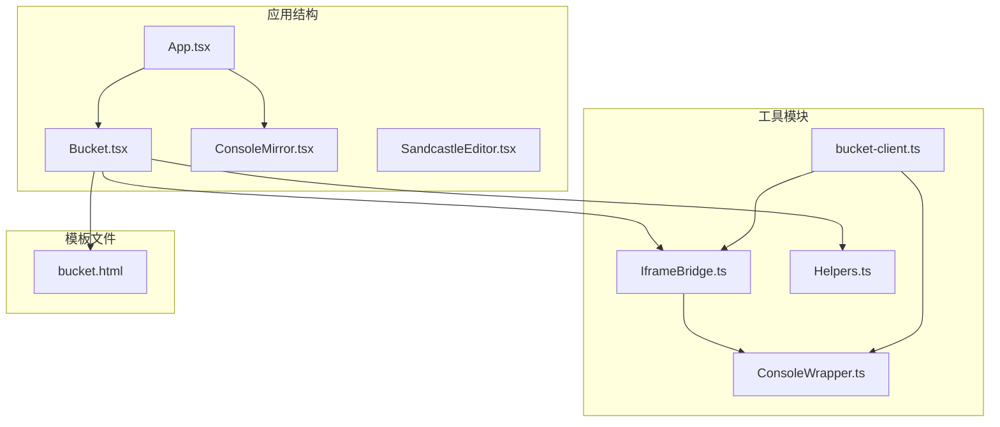

**图表来源**

- [App.tsx:15-146](file://apps/cesium-web/src/App.tsx#L15-L146)
- [Bucket.tsx:1-135](file://apps/cesium-web/src/components/Bucket/Bucket.tsx#L1-L135)

**章节来源**

- [Bucket.tsx:1-135](file://apps/cesium-web/src/components/Bucket/Bucket.tsx#L1-L135)
- [App.tsx:15-146](file://apps/cesium-web/src/App.tsx#L15-L146)

## 核心组件

### Bucket 组件属性接口

Bucket 组件通过明确的 TypeScript 接口定义了所有可用的属性：

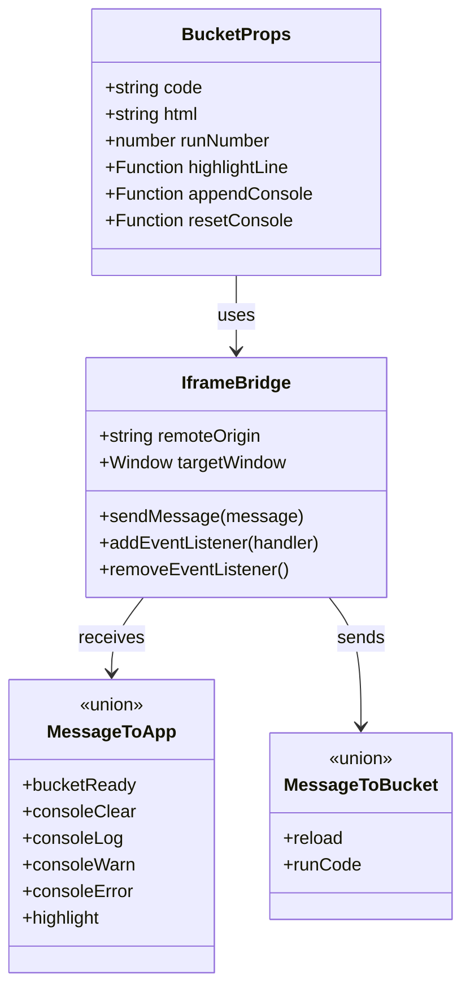

**图表来源**

- [Bucket.tsx:17-47](file://apps/cesium-web/src/components/Bucket/Bucket.tsx#L17-L47)
- [IframeBridge.ts:20-36](file://apps/cesium-web/src/util/IframeBridge.ts#L20-L36)

### 状态管理系统

组件使用 React 的状态管理机制来跟踪沙盒就绪状态和运行计数器：

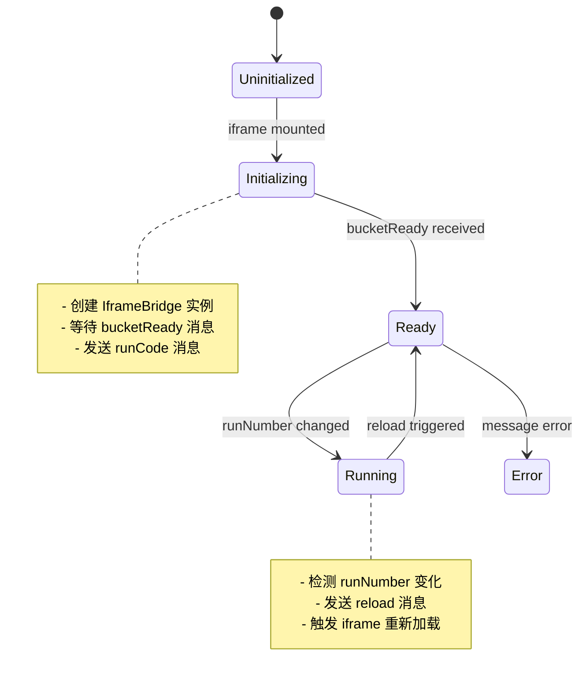

**图表来源**

- [Bucket.tsx:53-132](file://apps/cesium-web/src/components/Bucket/Bucket.tsx#L53-L132)

**章节来源**

- [Bucket.tsx:17-47](file://apps/cesium-web/src/components/Bucket/Bucket.tsx#L17-L47)
- [useCodeState.ts:36-55](file://apps/cesium-web/src/hooks/useCodeState.ts#L36-L55)

## 架构概览

Bucket 组件采用分层架构设计，确保代码执行的安全性和可靠性：

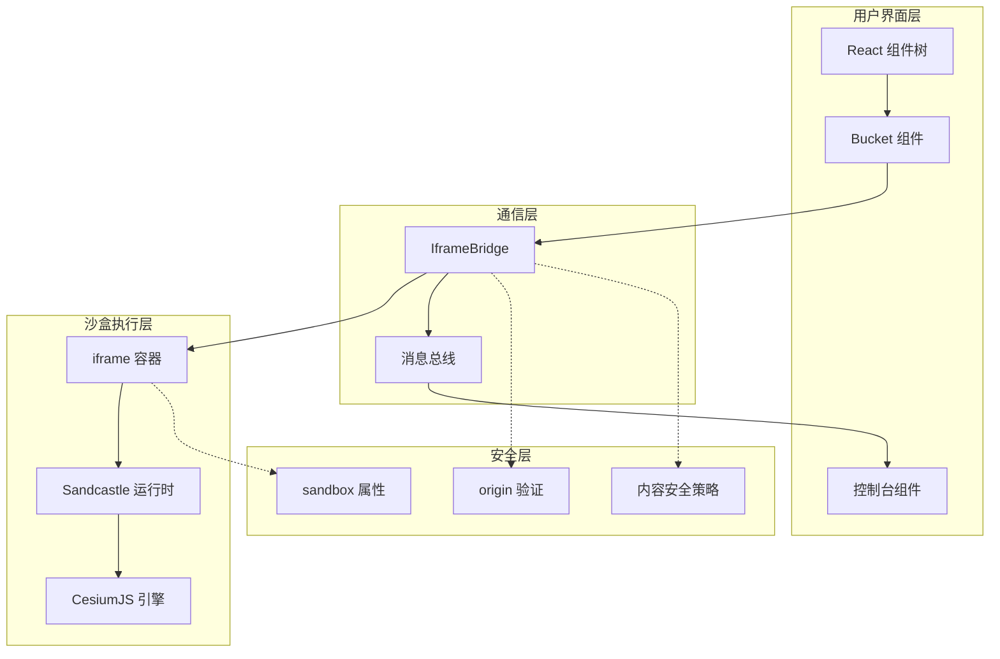

**图表来源**

- [Bucket.tsx:112-131](file://apps/cesium-web/src/components/Bucket/Bucket.tsx#L112-L131)
- [IframeBridge.ts:78-182](file://apps/cesium-web/src/util/IframeBridge.ts#L78-L182)

## 详细组件分析

### IframeBridge 通信机制

IframeBridge 是整个系统的核心通信组件，提供了类型安全的跨 iframe 消息传递：

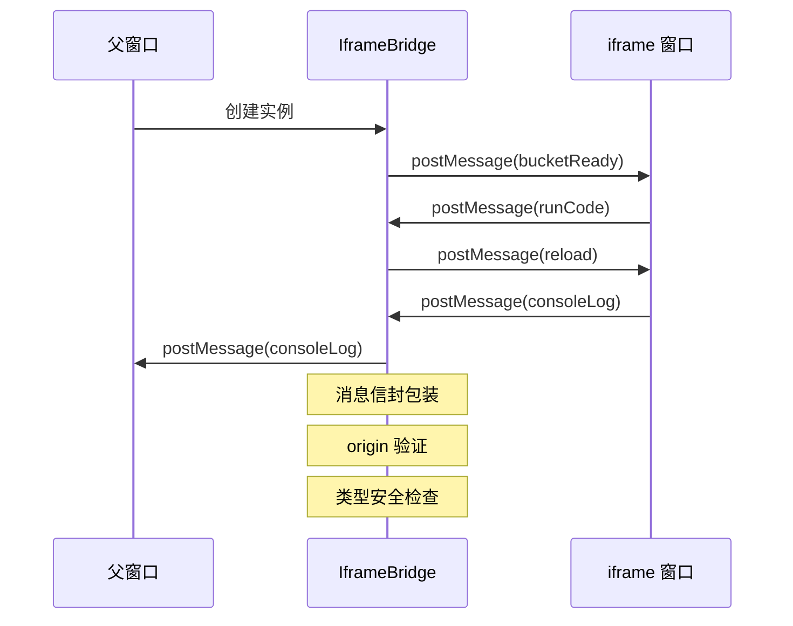

**图表来源**

- [IframeBridge.ts:122-129](file://apps/cesium-web/src/util/IframeBridge.ts#L122-L129)
- [bucket-client.ts:70-78](file://apps/cesium-web/src/util/bucket-client.ts#L70-L78)

#### 消息协议定义

系统定义了严格的消息协议来确保通信的可靠性：

| 消息类型       | 发送方 | 接收方 | 用途               | 载荷                                                                         |
| -------------- | ------ | ------ | ------------------ | ---------------------------------------------------------------------------- |
| `bucketReady`  | iframe | 父窗口 | 沙盒初始化完成通知 | `{ type: "bucketReady" }`                                                    |
| `reload`       | 父窗口 | iframe | 触发沙盒重新加载   | `{ type: "reload" }`                                                         |
| `runCode`      | 父窗口 | iframe | 执行代码和 HTML    | `{ type: "runCode", code: string, html: string }`                            |
| `consoleClear` | iframe | 父窗口 | 清空控制台         | `{ type: "consoleClear" }`                                                   |
| `consoleLog`   | iframe | 父窗口 | 日志输出           | `{ type: "consoleLog", log: string }`                                        |
| `consoleWarn`  | iframe | 父窗口 | 警告输出           | `{ type: "consoleWarn", warn: string }`                                      |
| `consoleError` | iframe | 父窗口 | 错误输出           | `{ type: "consoleError", error: string, lineNumber?: number, url?: string }` |
| `highlight`    | iframe | 父窗口 | 高亮指定行号       | `{ type: "highlight", highlight: number }`                                   |

**章节来源**

- [IframeBridge.ts:20-36](file://apps/cesium-web/src/util/IframeBridge.ts#L20-L36)
- [ConsoleWrapper.ts:248-252](file://apps/cesium-web/src/util/ConsoleWrapper.ts#L248-L252)

### iframe 初始化过程

Bucket 组件的 iframe 初始化过程经过精心设计，确保安全和可靠：

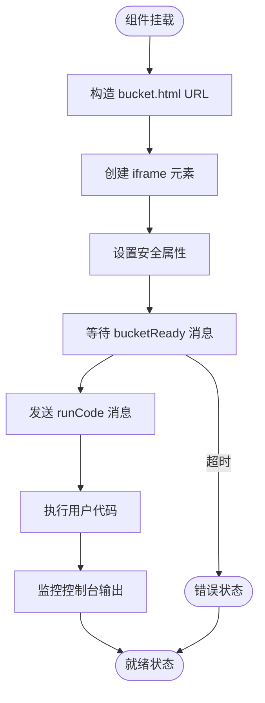

**图表来源**

- [Bucket.tsx:59-103](file://apps/cesium-web/src/components/Bucket/Bucket.tsx#L59-L103)

#### 沙盒安全属性配置

iframe 使用了严格的安全属性配置：

- `sandbox="allow-scripts allow-same-origin"`：允许脚本执行和相同源访问
- `allowFullScreen`：支持全屏显示
- `loading="lazy"`：延迟加载优化性能

这些属性确保了代码执行的安全性，同时保持了必要的功能完整性。

**章节来源**

- [Bucket.tsx:124-129](file://apps/cesium-web/src/components/Bucket/Bucket.tsx#L124-L129)

### 代码注入流程

Bucket 组件实现了智能的代码注入机制，确保用户代码能够正确执行：

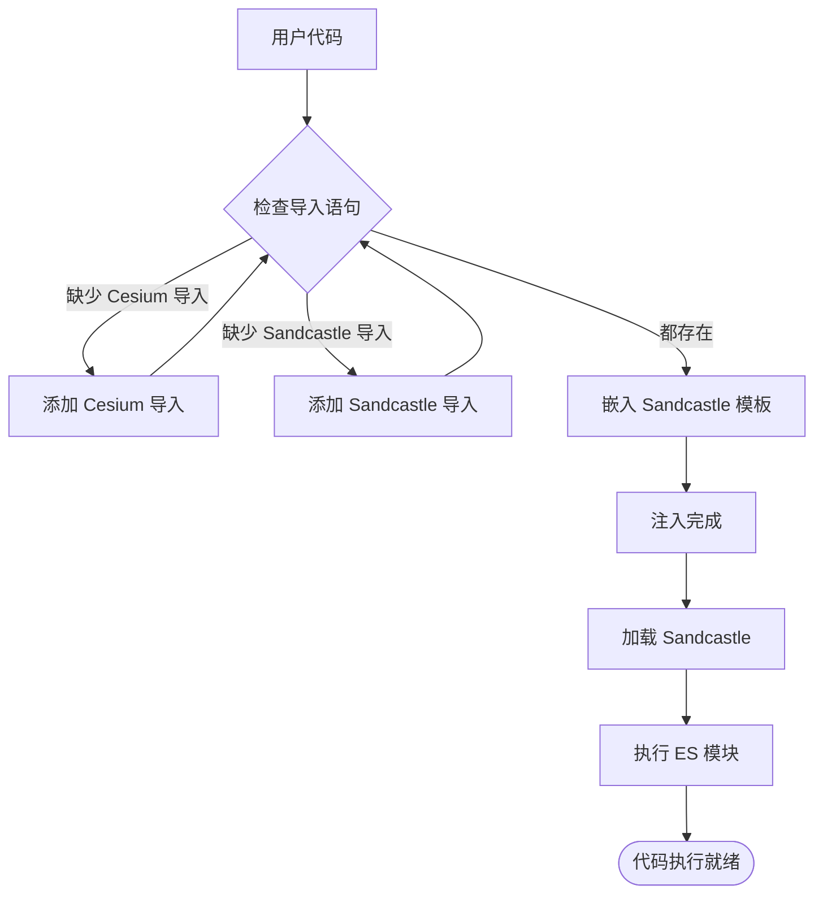

**图表来源**

- [Helpers.ts:18-36](file://apps/cesium-web/src/util/Helpers.ts#L18-L36)
- [bucket-client.ts:32-56](file://apps/cesium-web/src/util/bucket-client.ts#L32-L56)

#### HTML 内容嵌入策略

系统采用了安全的 HTML 内容处理策略：

1. **DOMPurify 清理**：使用 DOMPurify 对 HTML 内容进行安全清理
2. **样式标签支持**：允许特定的样式标签注入
3. **Firefox 兼容性**：针对 Firefox 的特殊处理
4. **防重复加载**：防止多次加载相同的 Sandcastle

**章节来源**

- [bucket-client.ts:38-56](file://apps/cesium-web/src/util/bucket-client.ts#L38-L56)
- [ConsoleWrapper.ts:254-295](file://apps/cesium-web/src/util/ConsoleWrapper.ts#L254-L295)

### 运行计数器机制

运行计数器是 Bucket 组件的核心状态管理机制：

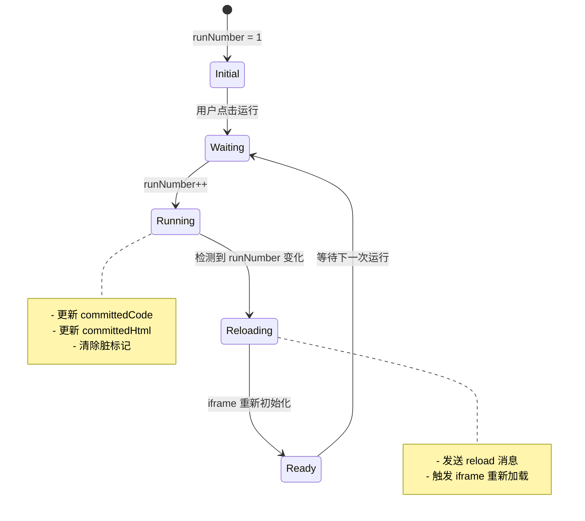

**图表来源**

- [useCodeState.ts:82-89](file://apps/cesium-web/src/hooks/useCodeState.ts#L82-L89)
- [Bucket.tsx:59-66](file://apps/cesium-web/src/components/Bucket/Bucket.tsx#L59-L66)

**章节来源**

- [useCodeState.ts:41-43](file://apps/cesium-web/src/hooks/useCodeState.ts#L41-L43)
- [Bucket.tsx:54-57](file://apps/cesium-web/src/components/Bucket/Bucket.tsx#L54-L57)

### 组件间事件通信模式

Bucket 组件与应用其他部分的事件通信采用统一的模式：

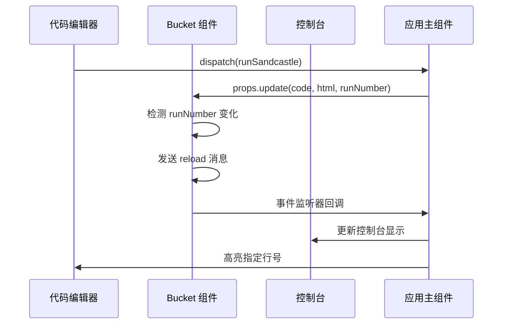

**图表来源**

- [App.tsx:118-131](file://apps/cesium-web/src/App.tsx#L118-L131)
- [Bucket.tsx:69-110](file://apps/cesium-web/src/components/Bucket/Bucket.tsx#L69-L110)

**章节来源**

- [App.tsx:118-131](file://apps/cesium-web/src/App.tsx#L118-L131)
- [ConsoleMirror.tsx:3-8](file://apps/cesium-web/src/components/ConsoleMirror/ConsoleMirror.tsx#L3-L8)

## 依赖关系分析

Bucket 组件的依赖关系体现了清晰的模块化设计：

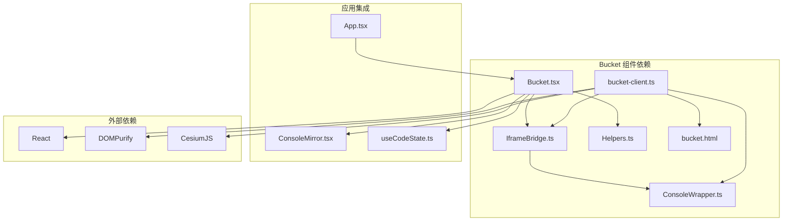

**图表来源**

- [Bucket.tsx:1-6](file://apps/cesium-web/src/components/Bucket/Bucket.tsx#L1-L6)
- [bucket-client.ts:6-8](file://apps/cesium-web/src/util/bucket-client.ts#L6-L8)

### 错误处理策略

系统实现了多层次的错误处理机制：

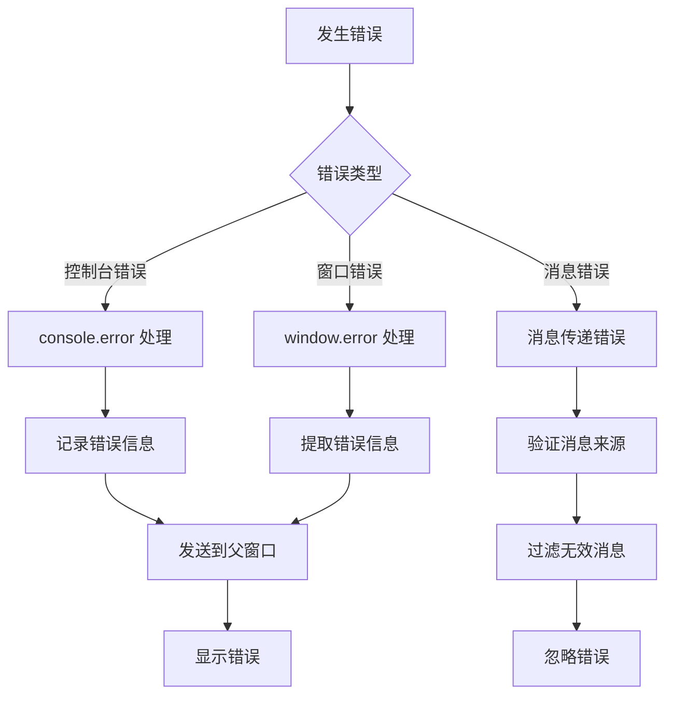

**图表来源**

- [ConsoleWrapper.ts:205-246](file://apps/cesium-web/src/util/ConsoleWrapper.ts#L205-L246)
- [IframeBridge.ts:150-167](file://apps/cesium-web/src/util/IframeBridge.ts#L150-L167)

**章节来源**

- [ConsoleWrapper.ts:205-246](file://apps/cesium-web/src/util/ConsoleWrapper.ts#L205-L246)
- [IframeBridge.ts:150-167](file://apps/cesium-web/src/util/IframeBridge.ts#L150-L167)

## 性能考虑

### 响应式布局设计

Bucket 组件采用了灵活的响应式布局系统：

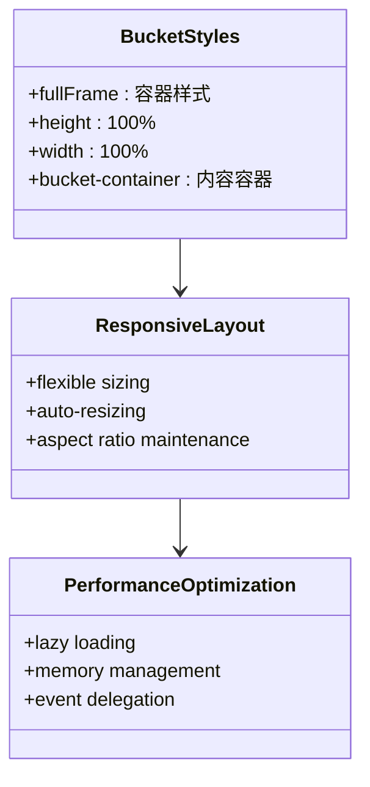

**图表来源**

- [Bucket.scss:1-9](file://apps/cesium-web/src/components/Bucket/Bucket.scss#L1-L9)

### 性能优化技巧

1. **懒加载策略**：iframe 使用 `loading="lazy"` 属性实现延迟加载
2. **内存管理**：及时清理事件监听器和引用
3. **消息过滤**：只处理预期的消息类型
4. **DOM 操作优化**：批量更新 DOM 结构
5. **缓存机制**：避免重复的计算和网络请求

**章节来源**

- [Bucket.tsx:128](file://apps/cesium-web/src/components/Bucket/Bucket.tsx#L128)
- [IframeBridge.ts:177-181](file://apps/cesium-web/src/util/IframeBridge.ts#L177-L181)

## 故障排除指南

### 常见问题及解决方案

#### iframe 加载失败

**症状**：Bucket 组件无法显示内容或显示空白

**可能原因**：

1. 沙盒 URL 构造错误
2. 跨域权限问题
3. iframe 安全属性限制

**解决方案**：

1. 检查 `__INNER_ORIGIN__` 构造的 URL
2. 验证跨域配置
3. 确认沙盒属性设置

#### 代码执行异常

**症状**：用户代码无法正常执行

**可能原因**：

1. 代码注入失败
2. 导入语句缺失
3. 沙盒环境限制

**解决方案**：

1. 检查 `embedInSandcastleTemplate` 函数
2. 验证代码导入语句
3. 确认沙盒权限

#### 控制台输出丢失

**症状**：控制台无法显示 iframe 中的输出

**可能原因**：

1. 消息传递中断
2. 控制台包装器问题
3. 消息过滤错误

**解决方案**：

1. 检查 IframeBridge 配置
2. 验证 ConsoleWrapper 设置
3. 确认消息类型匹配

**章节来源**

- [bucket-client.ts:62-79](file://apps/cesium-web/src/util/bucket-client.ts#L62-L79)
- [ConsoleWrapper.ts:254-295](file://apps/cesium-web/src/util/ConsoleWrapper.ts#L254-L295)

## 结论

Bucket 容器组件是一个设计精良的 iframe 沙盒执行框架，具有以下关键优势：

1. **安全性优先**：通过严格的沙盒配置和消息验证确保执行安全
2. **类型安全**：完整的 TypeScript 支持和消息协议定义
3. **用户体验**：流畅的代码执行和实时控制台反馈
4. **可维护性**：清晰的模块化设计和完善的错误处理
5. **性能优化**：合理的资源管理和响应式布局

该组件为 CesiumJS 代码演示和测试提供了可靠的基础设施，支持复杂的地理空间可视化应用开发。

## 附录

### 组件使用示例

```typescript
// 基本使用方式
<Bucket
  code={codeState.committedCode}
  html={codeState.committedHtml}
  runNumber={codeState.runNumber}
  highlightLine={(lineNumber) => console.log(`高亮第${lineNumber}行`)}
  appendConsole={(type, message) => console.log(`${type}: ${message}`)}
  resetConsole={() => console.log('控制台已清空')}
/>
```

### 配置选项说明

| 属性名          | 类型     | 必需 | 描述                       | 默认值 |
| --------------- | -------- | ---- | -------------------------- | ------ |
| `code`          | string   | 是   | 要在沙箱中执行的代码       | -      |
| `html`          | string   | 是   | 要注入到沙箱中的 HTML 内容 | -      |
| `runNumber`     | number   | 是   | 运行次数计数器             | -      |
| `highlightLine` | Function | 是   | 高亮指定行号的回调函数     | -      |
| `appendConsole` | Function | 是   | 向控制台追加消息的回调函数 | -      |
| `resetConsole`  | Function | 是   | 重置控制台的回调函数       | -      |

### 最佳实践建议

1. **代码组织**：将复杂逻辑拆分为多个函数，便于调试和维护
2. **错误处理**：始终包含适当的错误处理和边界条件检查
3. **性能监控**：定期检查内存使用和执行时间
4. **安全审计**：定期审查沙盒配置和消息验证逻辑
5. **兼容性测试**：在不同浏览器环境下测试功能完整性
