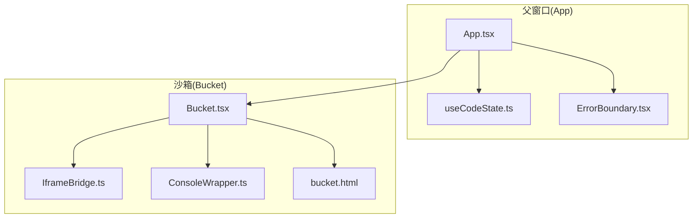
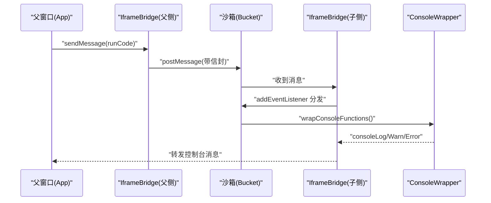
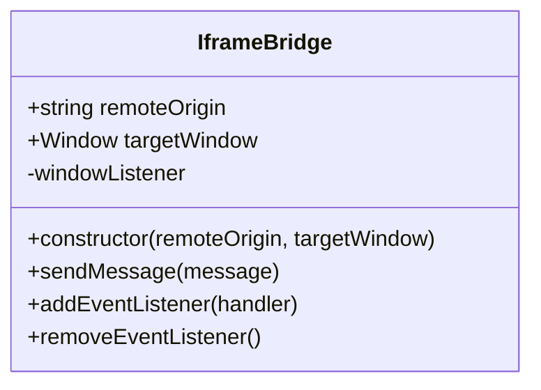
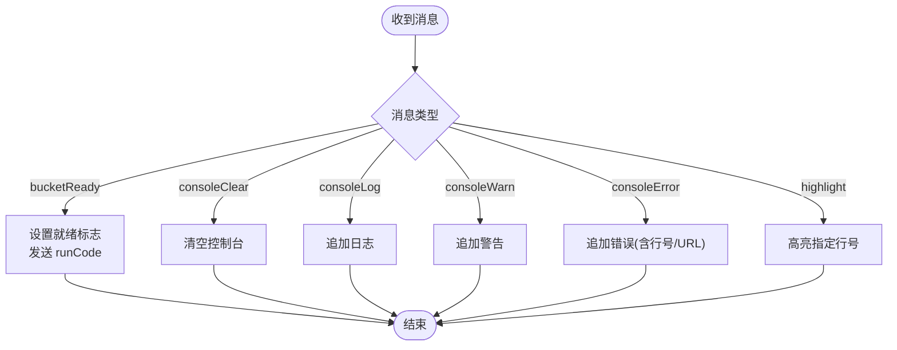
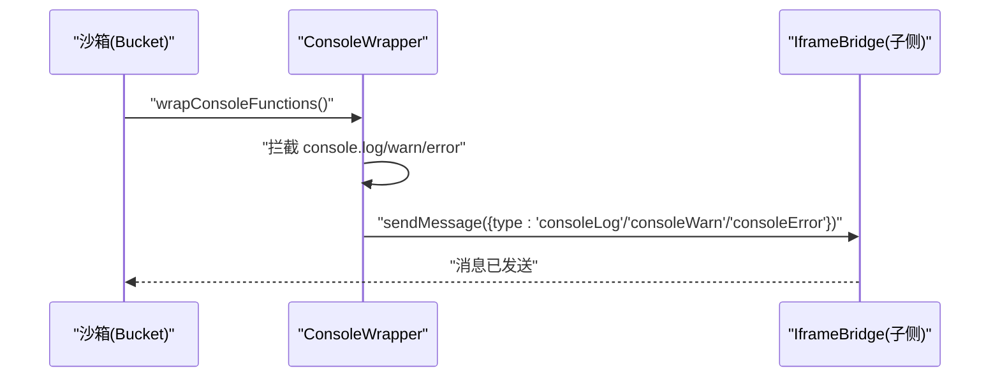
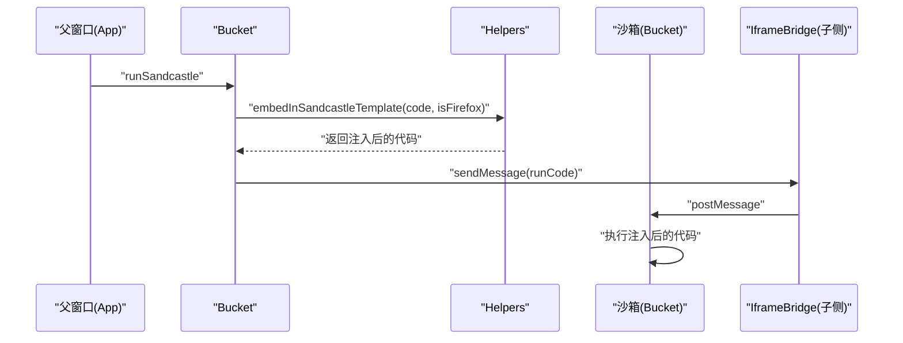
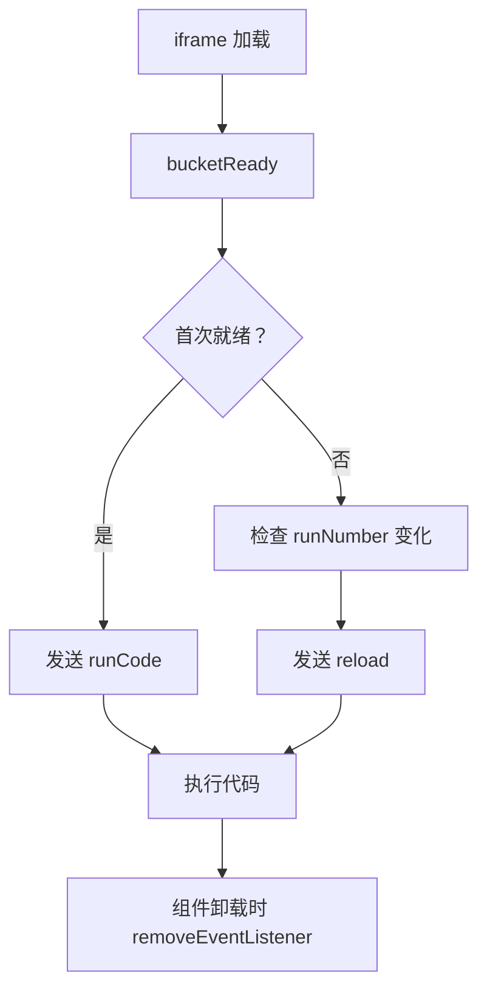
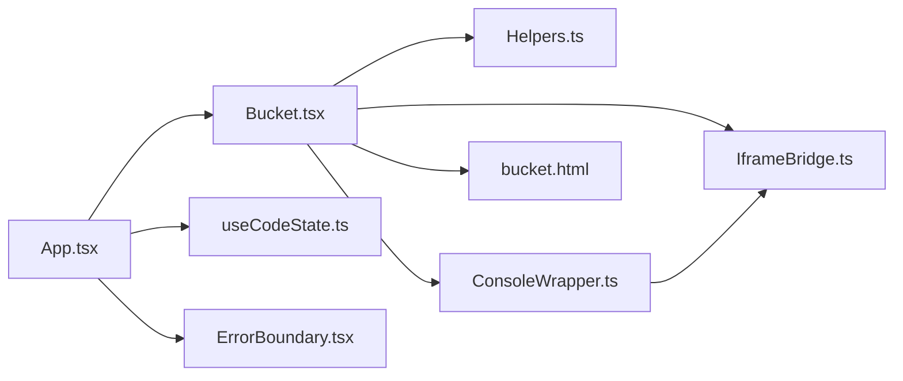

# IframeBridge 通信机制

<cite>
**本文引用的文件**
- [IframeBridge.ts](file://apps/cesium-web/src/util/IframeBridge.ts)
- [ConsoleWrapper.ts](file://apps/cesium-web/src/util/ConsoleWrapper.ts)
- [Bucket.tsx](file://apps/cesium-web/src/components/Bucket/Bucket.tsx)
- [App.tsx](file://apps/cesium-web/src/App.tsx)
- [useCodeState.ts](file://apps/cesium-web/src/hooks/useCodeState.ts)
- [Helpers.ts](file://apps/cesium-web/src/util/Helpers.ts)
- [bucket.html](file://apps/cesium-web/templates/bucket.html)
- [ErrorBoundary.tsx](file://apps/cesium-web/src/components/ErrorBoundary/ErrorBoundary.tsx)
- [ProcessStatus.ts](file://apps/cesium-web/src/util/ProcessStatus.ts)
</cite>

## 目录

1. [简介](#简介)
2. [项目结构](#项目结构)
3. [核心组件](#核心组件)
4. [架构总览](#架构总览)
5. [详细组件分析](#详细组件分析)
6. [依赖关系分析](#依赖关系分析)
7. [性能考量](#性能考量)
8. [故障排查指南](#故障排查指南)
9. [结论](#结论)
10. [附录](#附录)

## 简介

本文档系统性阐述 IframeBridge 跨框架通信桥接的设计与实现，涵盖消息序列化/反序列化、类型安全、监听器注册与事件分发、异步通信处理、消息类型处理流程（代码执行、控制台输出、错误报告、行号高亮）、通信协议与消息格式规范、版本兼容策略、安全边界与权限验证、异常处理、性能监控、连接状态管理与资源清理，以及使用示例与扩展开发指南。文档面向不同技术背景的读者，既提供高层概览也包含代码级细节与可视化图表。

## 项目结构

本项目围绕“父窗口（App）—沙箱 iframe（Bucket）”的双端通信展开，IframeBridge 作为通用桥接工具，结合 ConsoleWrapper 实现控制台消息的封装与转发，配合 Bucket 组件完成代码执行与高亮联动，配合 App 与 useCodeState 管理运行状态与视图布局。

**图表来源**

- [App.tsx:15-146](file://apps/cesium-web/src/App.tsx#L15-L146)
- [Bucket.tsx:53-132](file://apps/cesium-web/src/components/Bucket/Bucket.tsx#L53-L132)
- [IframeBridge.ts:78-182](file://apps/cesium-web/src/util/IframeBridge.ts#L78-L182)
- [ConsoleWrapper.ts:254-295](file://apps/cesium-web/src/util/ConsoleWrapper.ts#L254-L295)
- [bucket.html:1-84](file://apps/cesium-web/templates/bucket.html#L1-L84)

**章节来源**

- [App.tsx:15-146](file://apps/cesium-web/src/App.tsx#L15-L146)
- [Bucket.tsx:53-132](file://apps/cesium-web/src/components/Bucket/Bucket.tsx#L53-L132)

## 核心组件

- IframeBridge：提供类型安全的 postMessage 桥接，封装消息信封、来源校验、同窗口过滤与监听器生命周期管理。
- ConsoleWrapper：封装 console.\* 方法与 window.onerror，统一生成控制台消息并经 IframeBridge 发送至父窗口。
- Bucket：承载 iframe，初始化 IframeBridge，处理来自父窗口的消息（运行、刷新、高亮、控制台同步）。
- App/useCodeState：管理代码状态、运行计数与视图布局，驱动 Bucket 执行代码。
- Helpers：提供代码模板嵌入与 URL 压缩/解压工具，支撑运行时注入与分享链接。
- ErrorBoundary：提供组件级错误边界，避免单个组件错误导致整页崩溃。

**章节来源**

- [IframeBridge.ts:78-182](file://apps/cesium-web/src/util/IframeBridge.ts#L78-L182)
- [ConsoleWrapper.ts:254-295](file://apps/cesium-web/src/util/ConsoleWrapper.ts#L254-L295)
- [Bucket.tsx:53-132](file://apps/cesium-web/src/components/Bucket/Bucket.tsx#L53-L132)
- [useCodeState.ts:63-110](file://apps/cesium-web/src/hooks/useCodeState.ts#L63-L110)

## 架构总览

IframeBridge 采用“双向类型约束 + 信封包装 + 多层校验”的设计，确保消息仅在父子窗口间传递且类型安全。消息在发送前被包装为固定 id 的信封，接收侧通过类型守卫与 origin/source 校验过滤无关流量；同时避免同窗口自发消息造成回环。

**图表来源**

- [IframeBridge.ts:122-129](file://apps/cesium-web/src/util/IframeBridge.ts#L122-L129)
- [IframeBridge.ts:149-170](file://apps/cesium-web/src/util/IframeBridge.ts#L149-L170)
- [ConsoleWrapper.ts:254-295](file://apps/cesium-web/src/util/ConsoleWrapper.ts#L254-L295)
- [Bucket.tsx:69-110](file://apps/cesium-web/src/components/Bucket/Bucket.tsx#L69-L110)

## 详细组件分析

### IframeBridge 类与消息协议

- 类型安全与方向约束：通过泛型参数在编译期限定“发送/接收”消息类型，避免方向错误。
- 信封结构：所有消息以固定 id 的信封包裹，便于区分第三方库消息。
- 来源校验：严格比对 event.origin 与 remoteOrigin。
- 同窗口过滤：忽略来自 window.source === window 的消息，防止回环。
- 监听器管理：保存监听器引用，支持 removeEventListener 精确移除。

**图表来源**

- [IframeBridge.ts:78-182](file://apps/cesium-web/src/util/IframeBridge.ts#L78-L182)

**章节来源**

- [IframeBridge.ts:78-182](file://apps/cesium-web/src/util/IframeBridge.ts#L78-L182)

### 消息类型与处理流程

- 父→子消息（MessageToBucket）：reload、runCode（包含 code 与 html）。
- 子→父消息（MessageToApp）：bucketReady、consoleClear、consoleLog、consoleWarn、consoleError、highlight。

**图表来源**

- [Bucket.tsx:69-110](file://apps/cesium-web/src/components/Bucket/Bucket.tsx#L69-L110)

**章节来源**

- [IframeBridge.ts:20-30](file://apps/cesium-web/src/util/IframeBridge.ts#L20-L30)
- [Bucket.tsx:69-110](file://apps/cesium-web/src/components/Bucket/Bucket.tsx#L69-L110)

### 控制台消息封装与转发

- ConsoleWrapper 封装 console.\* 与 window.onerror，统一生成结构化消息并发送。
- 支持复杂对象/数组/函数的简化字符串化，避免大对象导致的字符串膨胀。
- 错误行号提取：优先从 error.stack，其次从错误消息中的位置信息。

**图表来源**

- [ConsoleWrapper.ts:254-295](file://apps/cesium-web/src/util/ConsoleWrapper.ts#L254-L295)
- [IframeBridge.ts:122-129](file://apps/cesium-web/src/util/IframeBridge.ts#L122-L129)

**章节来源**

- [ConsoleWrapper.ts:17-162](file://apps/cesium-web/src/util/ConsoleWrapper.ts#L17-L162)
- [ConsoleWrapper.ts:205-246](file://apps/cesium-web/src/util/ConsoleWrapper.ts#L205-L246)
- [ConsoleWrapper.ts:254-295](file://apps/cesium-web/src/util/ConsoleWrapper.ts#L254-L295)

### 代码执行与模板注入

- Bucket 在收到 bucketReady 后发送 runCode，包含注入模板后的完整代码与 HTML。
- Helpers 提供 embedInSandcastleTemplate，自动补齐 import 并注入 Sandcastle.finishedLoading 与 window.Cesium 挂载。

**图表来源**

- [Bucket.tsx:74-82](file://apps/cesium-web/src/components/Bucket/Bucket.tsx#L74-L82)
- [Helpers.ts:18-36](file://apps/cesium-web/src/util/Helpers.ts#L18-L36)

**章节来源**

- [Bucket.tsx:74-82](file://apps/cesium-web/src/components/Bucket/Bucket.tsx#L74-L82)
- [Helpers.ts:18-36](file://apps/cesium-web/src/util/Helpers.ts#L18-L36)

### 连接状态与生命周期管理

- Bucket 组件在 iframe 加载完成后设置就绪标志，首次就绪即发送 runCode。
- 通过 runNumber 变更触发 reload，实现代码更新后的重新执行。
- 监听器注册与移除：addEventListener 返回原始监听器引用，可在卸载时 removeEventListener。

**图表来源**

- [Bucket.tsx:59-66](file://apps/cesium-web/src/components/Bucket/Bucket.tsx#L59-L66)
- [Bucket.tsx:105-110](file://apps/cesium-web/src/components/Bucket/Bucket.tsx#L105-L110)

**章节来源**

- [Bucket.tsx:59-66](file://apps/cesium-web/src/components/Bucket/Bucket.tsx#L59-L66)
- [Bucket.tsx:105-110](file://apps/cesium-web/src/components/Bucket/Bucket.tsx#L105-L110)

### 安全边界与权限验证

- 来源校验：仅接受与 remoteOrigin 完全一致的 origin。
- 同窗口过滤：忽略来自 window.source === window 的消息，防止回环。
- 空操作保护：当 targetWindow 与当前 window 相同时，sendMessage 直接返回。
- iframe sandbox：Bucket 使用 allow-scripts 与 allow-same-origin，限制风险面。

**章节来源**

- [IframeBridge.ts:117-129](file://apps/cesium-web/src/util/IframeBridge.ts#L117-L129)
- [IframeBridge.ts:157-164](file://apps/cesium-web/src/util/IframeBridge.ts#L157-L164)
- [Bucket.tsx:126](file://apps/cesium-web/src/components/Bucket/Bucket.tsx#L126)

### 异常处理与错误报告

- 组件级错误边界：ErrorBoundary 捕获子树渲染错误，提供降级 UI 与重试。
- 控制台错误：ConsoleWrapper 将错误消息与可选行号/URL 发送到父窗口。
- 窗口级错误：setupWindowErrorHandler 捕获 window.onerror，提取行号并转发。

**章节来源**

- [ErrorBoundary.tsx:50-123](file://apps/cesium-web/src/components/ErrorBoundary/ErrorBoundary.tsx#L50-L123)
- [ConsoleWrapper.ts:205-246](file://apps/cesium-web/src/util/ConsoleWrapper.ts#L205-L246)

### 性能监控与资源清理

- 监听器生命周期：addEventListener 返回原始监听器引用，便于在组件卸载时 removeEventListener，避免内存泄漏。
- 空操作保护：sendMessage 在同窗口场景下直接返回，避免不必要的 postMessage。
- 控制台字符串化优化：针对对象/数组/函数采用简化策略，减少大对象日志带来的性能开销。
- 运行计数器：通过 runNumber 变更触发 reload，避免重复执行与资源浪费。

**章节来源**

- [IframeBridge.ts:177-181](file://apps/cesium-web/src/util/IframeBridge.ts#L177-L181)
- [ConsoleWrapper.ts:17-48](file://apps/cesium-web/src/util/ConsoleWrapper.ts#L17-L48)
- [useCodeState.ts:82-89](file://apps/cesium-web/src/hooks/useCodeState.ts#L82-L89)

## 依赖关系分析

- Bucket 依赖 IframeBridge、Helpers、ConsoleWrapper 与 bucket.html 模板。
- App 依赖 Bucket、useCodeState、ErrorBoundary。
- ConsoleWrapper 依赖 IframeBridge 类型别名 BridgeToApp。
- IframeBridge 依赖浏览器 MessageEvent 与 postMessage API。

**图表来源**

- [App.tsx:15-146](file://apps/cesium-web/src/App.tsx#L15-L146)
- [Bucket.tsx:4-6](file://apps/cesium-web/src/components/Bucket/Bucket.tsx#L4-L6)
- [ConsoleWrapper.ts:1](file://apps/cesium-web/src/util/ConsoleWrapper.ts#L1)

**章节来源**

- [App.tsx:15-146](file://apps/cesium-web/src/App.tsx#L15-L146)
- [Bucket.tsx:4-6](file://apps/cesium-web/src/components/Bucket/Bucket.tsx#L4-L6)

## 性能考量

- 消息信封与类型守卫：通过 isKnownMessageStructure 快速过滤无关消息，降低处理开销。
- 控制台字符串化：simpleStringify、print、combineArguments 避免大对象直接 JSON.stringify 导致的性能问题。
- 运行去抖：通过 runNumber 与 reload 机制，避免频繁重复执行。
- 监听器移除：组件卸载时移除监听器，防止事件累积导致内存泄漏。

[本节为通用性能建议，无需特定文件引用]

## 故障排查指南

- 消息未到达：检查 remoteOrigin 是否与 iframe 的实际来源一致；确认是否被 isKnownMessageStructure 过滤。
- 重复监听：多次 addEventListener 会覆盖旧监听但不会自动移除，需手动 removeEventListener。
- 回环问题：确保 targetWindow 与当前 window 不同；避免在同页面内互相发送消息。
- 控制台消息缺失：确认 ConsoleWrapper.wrapConsoleFunctions 已在沙箱内调用；检查 window.onerror 是否被正确设置。
- 错误行号不准确：检查错误栈中是否包含沙箱文件名或匿名位置信息；确认 errorLineNumber 的解析逻辑。

**章节来源**

- [IframeBridge.ts:149-170](file://apps/cesium-web/src/util/IframeBridge.ts#L149-L170)
- [ConsoleWrapper.ts:205-246](file://apps/cesium-web/src/util/ConsoleWrapper.ts#L205-L246)

## 结论

IframeBridge 通过严格的类型约束、信封包装与多层校验，构建了安全可靠的跨框架通信通道。结合 ConsoleWrapper 的控制台封装与 Bucket 的模板注入，实现了从代码执行到错误报告的完整闭环。配合 App/useCodeState 的状态管理与 ErrorBoundary 的错误边界，系统在可用性、安全性与可维护性上达到良好平衡。建议在扩展开发中遵循现有消息协议与安全策略，确保新增功能与现有机制兼容。

[本节为总结性内容，无需特定文件引用]

## 附录

### 通信协议与消息格式规范

- 信封结构：固定 id 字段标识为本桥接消息，message 字段承载业务消息体。
- 父→子消息：
  - reload：指示沙箱重新加载自身。
  - runCode：包含 code 与 html，用于执行注入后的完整代码。
- 子→父消息：
  - bucketReady：沙箱初始化完成通知。
  - consoleClear：清空控制台。
  - consoleLog：日志消息。
  - consoleWarn：警告消息。
  - consoleError：错误消息，可包含行号与 URL。
  - highlight：请求父窗口高亮指定行号。

**章节来源**

- [IframeBridge.ts:46](file://apps/cesium-web/src/util/IframeBridge.ts#L46)
- [IframeBridge.ts:20](file://apps/cesium-web/src/util/IframeBridge.ts#L20)
- [IframeBridge.ts:30](file://apps/cesium-web/src/util/IframeBridge.ts#L30)

### 版本兼容性策略

- 消息类型演进：通过枚举与联合类型明确消息结构，新增消息类型时保持向后兼容。
- URL 压缩/解压：历史版本的链接可能包含额外字段，当前版本解码时会发出警告并忽略，确保兼容旧链接。

**章节来源**

- [Helpers.ts:97-136](file://apps/cesium-web/src/util/Helpers.ts#L97-L136)

### 使用示例与扩展开发指南

- 父窗口侧使用：
  - 创建 IframeBridge 实例，目标窗口指向 iframe.contentWindow，remoteOrigin 指向沙箱来源。
  - 调用 addEventListener 注册消息处理函数，处理 bucketReady、consoleClear、consoleLog、consoleWarn、consoleError、highlight 等。
  - 调用 sendMessage 发送 reload 或 runCode。
- 沙箱侧使用：
  - 创建 IframeBridge 实例，目标窗口指向 window.parent，remoteOrigin 指向父窗口来源。
  - 在收到 bucketReady 后发送 runCode，并根据控制台消息类型调用父窗口提供的回调（高亮、追加、重置）。
- 扩展开发：
  - 新增消息类型：在对应方向的消息类型中添加新类型，并在两端分别实现发送与接收逻辑。
  - 新增处理流程：在 Bucket 的消息处理函数中增加分支处理，确保类型守卫与来源校验生效。
  - 安全增强：如需更严格的权限控制，可在 remoteOrigin 校验基础上增加 token 或签名验证。

**章节来源**

- [Bucket.tsx:105-110](file://apps/cesium-web/src/components/Bucket/Bucket.tsx#L105-L110)
- [IframeBridge.ts:149-170](file://apps/cesium-web/src/util/IframeBridge.ts#L149-L170)
