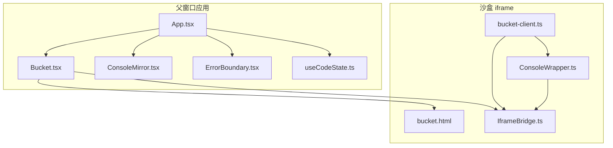
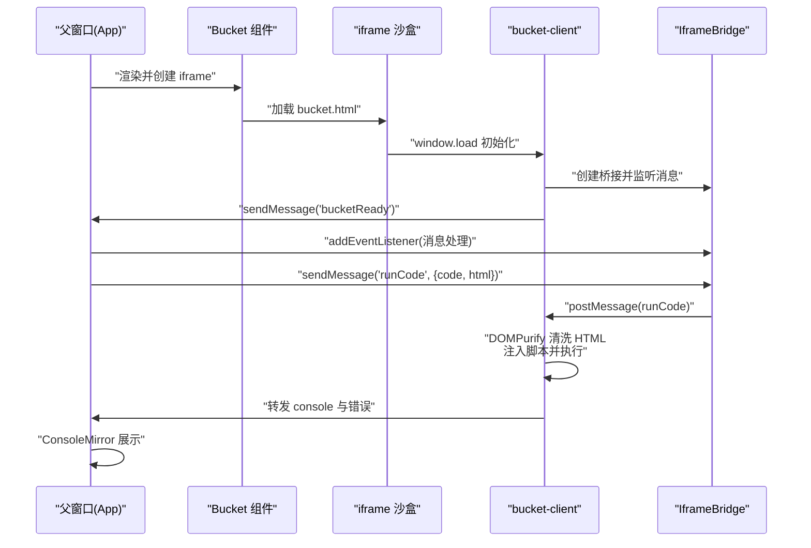
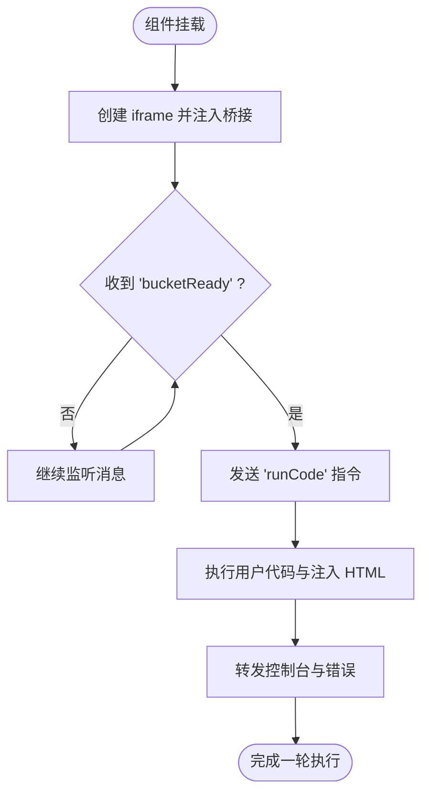
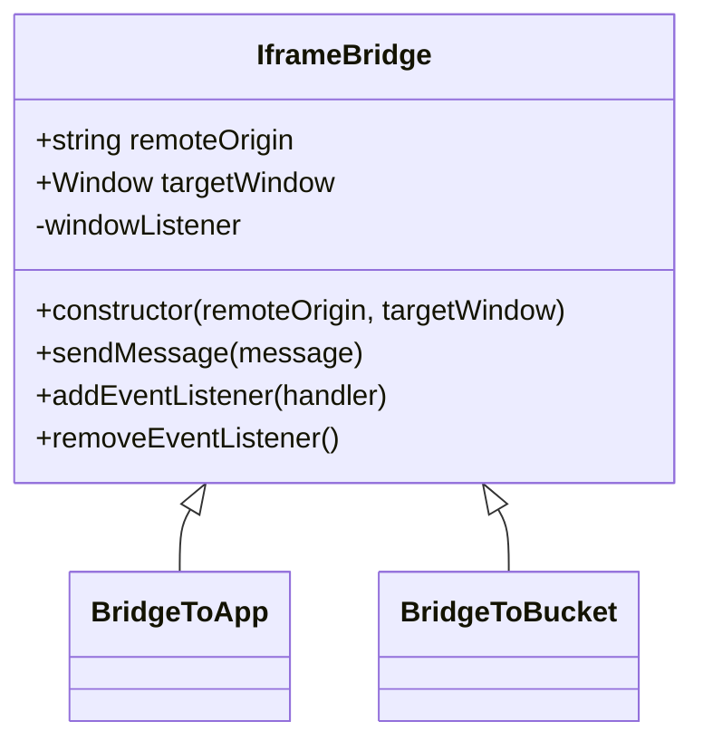
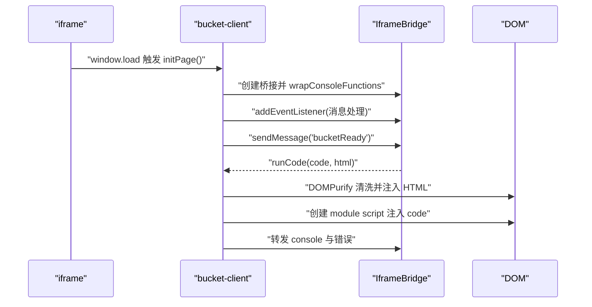
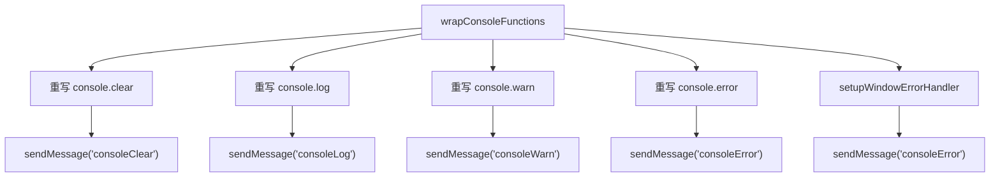
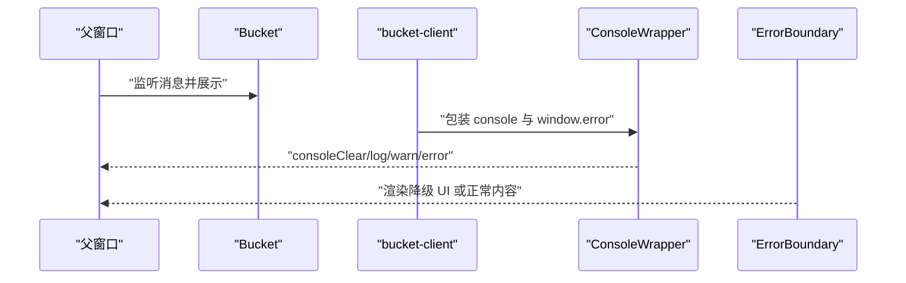
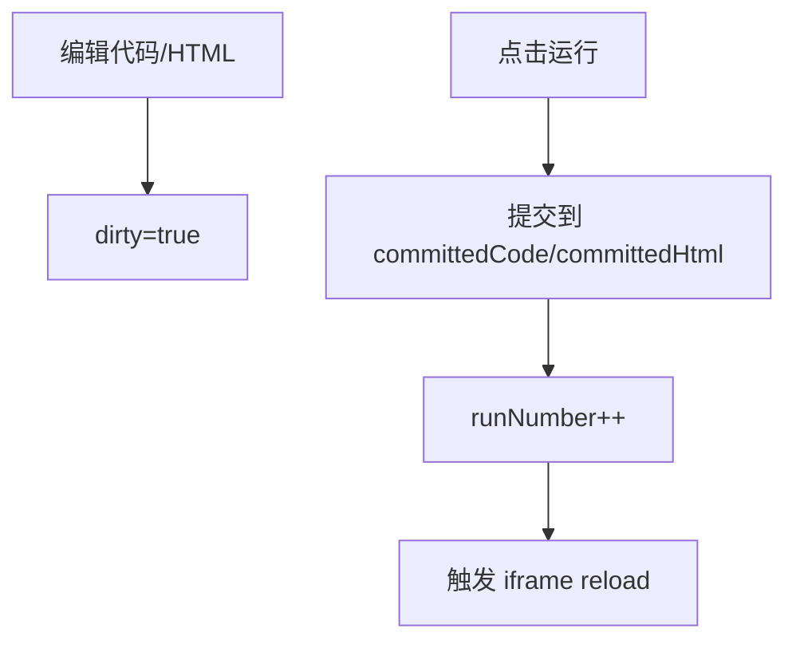
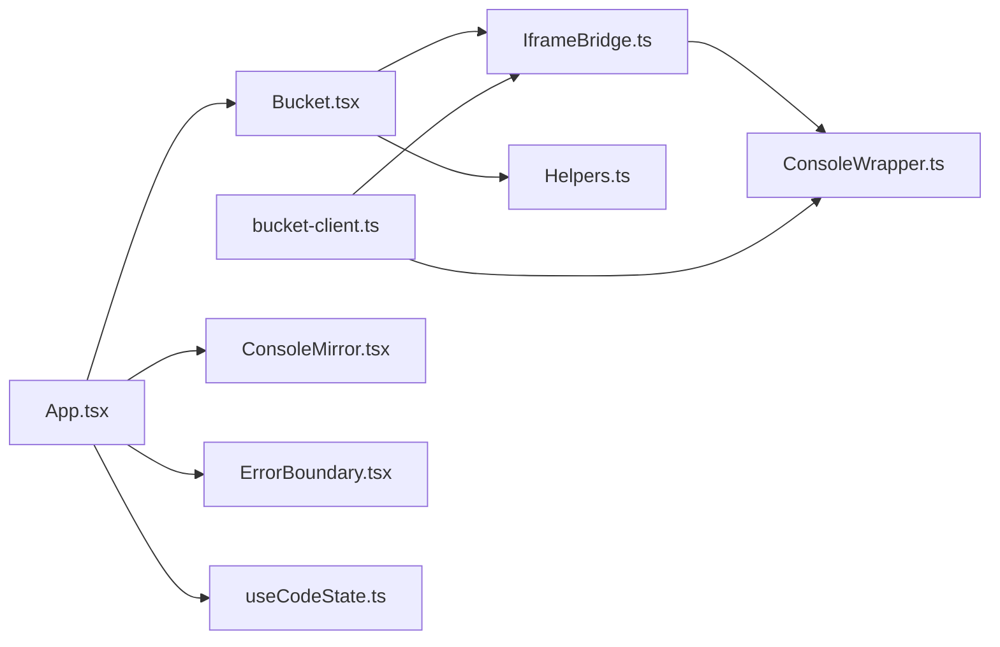

# 沙盒执行系统

<cite>
**本文引用的文件**
- [Bucket.tsx](file://apps/cesium-web/src/components/Bucket/Bucket.tsx)
- [IframeBridge.ts](file://apps/cesium-web/src/util/IframeBridge.ts)
- [bucket-client.ts](file://apps/cesium-web/src/util/bucket-client.ts)
- [bucket.html](file://apps/cesium-web/templates/bucket.html)
- [App.tsx](file://apps/cesium-web/src/App.tsx)
- [ConsoleWrapper.ts](file://apps/cesium-web/src/util/ConsoleWrapper.ts)
- [Helpers.ts](file://apps/cesium-web/src/util/Helpers.ts)
- [ConsoleMirror.tsx](file://apps/cesium-web/src/components/ConsoleMirror/ConsoleMirror.tsx)
- [ErrorBoundary.tsx](file://apps/cesium-web/src/components/ErrorBoundary/ErrorBoundary.tsx)
- [useCodeState.ts](file://apps/cesium-web/src/hooks/useCodeState.ts)
- [Bucket.scss](file://apps/cesium-web/src/components/Bucket/Bucket.scss)
- [package.json](file://apps/cesium-web/package.json)
- [vite.config.ts](file://apps/cesium-web/vite.config.ts)
- [sleep.ts](file://apps/cesium-web/src/util/sleep.ts)
- [ProcessStatus.ts](file://apps/cesium-web/src/util/ProcessStatus.ts)
- [utils.ts](file://apps/cesium-web/src/lib/utils.ts)
</cite>

## 目录

1. [简介](#简介)
2. [项目结构](#项目结构)
3. [核心组件](#核心组件)
4. [架构总览](#架构总览)
5. [详细组件分析](#详细组件分析)
6. [依赖关系分析](#依赖关系分析)
7. [性能考量](#性能考量)
8. [故障排查指南](#故障排查指南)
9. [结论](#结论)
10. [附录](#附录)

## 简介

本文件面向“沙盒执行系统”的架构文档，聚焦于 Bucket 组件的安全隔离机制与代码执行流程，系统性阐述：

- iframe 沙盒容器的设计原则与安全边界
- 跨框架通信桥接（IframeBridge）的消息协议与实现细节
- 代码注入与 Cesium 场景初始化流程及实时渲染更新策略
- 安全边界、权限控制与资源访问限制
- 错误处理、异常捕获与优雅降级
- 性能监控、内存管理与资源清理策略
- 沙盒系统的扩展接口与自定义配置选项

## 项目结构

该沙盒系统围绕“父窗口应用 + iframe 沙盒”双层结构组织，核心文件分布如下：

- 组件层：Bucket（沙盒容器）、ConsoleMirror（控制台镜像）、ErrorBoundary（错误边界）
- 工具层：IframeBridge（跨帧通信桥）、ConsoleWrapper（控制台包装与错误捕获）、Helpers（代码模板注入）
- 页面模板：bucket.html（最小化沙盒页面）
- 状态与入口：App.tsx（应用入口）、useCodeState（代码状态机）

图表来源

- [App.tsx:15-145](file://apps/cesium-web/src/App.tsx#L15-L145)
- [Bucket.tsx:53-135](file://apps/cesium-web/src/components/Bucket/Bucket.tsx#L53-L135)
- [bucket-client.ts:62-87](file://apps/cesium-web/src/util/bucket-client.ts#L62-L87)
- [bucket.html:1-84](file://apps/cesium-web/templates/bucket.html#L1-L84)
- [IframeBridge.ts:78-183](file://apps/cesium-web/src/util/IframeBridge.ts#L78-L183)
- [ConsoleWrapper.ts:254-296](file://apps/cesium-web/src/util/ConsoleWrapper.ts#L254-L296)

章节来源

- [App.tsx:15-145](file://apps/cesium-web/src/App.tsx#L15-L145)
- [Bucket.tsx:53-135](file://apps/cesium-web/src/components/Bucket/Bucket.tsx#L53-L135)
- [bucket-client.ts:62-87](file://apps/cesium-web/src/util/bucket-client.ts#L62-L87)
- [bucket.html:1-84](file://apps/cesium-web/templates/bucket.html#L1-L84)
- [IframeBridge.ts:78-183](file://apps/cesium-web/src/util/IframeBridge.ts#L78-L183)
- [ConsoleWrapper.ts:254-296](file://apps/cesium-web/src/util/ConsoleWrapper.ts#L254-L296)

## 核心组件

- Bucket：负责创建并管理 iframe 沙盒容器，基于沙盒页面模板与 IframeBridge 协议驱动代码执行与控制台消息回传。
- IframeBridge：提供类型安全、来源校验与信封封装的 postMessage 通信桥，统一消息协议与生命周期管理。
- bucket-client：在 iframe 内初始化桥接、包装控制台、接收父窗口指令并注入与执行用户代码。
- ConsoleWrapper：包装 console API 并捕获 window.error，将日志与错误转发至父窗口。
- Helpers：将用户代码注入 Sandcastle 模板，补齐缺失的 import 与回调，保证 Cesium 场景正确初始化。
- ConsoleMirror：控制台展示组件（占位，实际消息由父窗口聚合）。
- ErrorBoundary：React 错误边界，提供优雅降级与重试能力。
- useCodeState：代码状态机，维护编辑态与提交态、运行计数器与脏标记。

章节来源

- [Bucket.tsx:53-135](file://apps/cesium-web/src/components/Bucket/Bucket.tsx#L53-L135)
- [IframeBridge.ts:78-183](file://apps/cesium-web/src/util/IframeBridge.ts#L78-L183)
- [bucket-client.ts:62-87](file://apps/cesium-web/src/util/bucket-client.ts#L62-L87)
- [ConsoleWrapper.ts:254-296](file://apps/cesium-web/src/util/ConsoleWrapper.ts#L254-L296)
- [Helpers.ts:18-36](file://apps/cesium-web/src/util/Helpers.ts#L18-L36)
- [ConsoleMirror.tsx:1-25](file://apps/cesium-web/src/components/ConsoleMirror/ConsoleMirror.tsx#L1-L25)
- [ErrorBoundary.tsx:50-130](file://apps/cesium-web/src/components/ErrorBoundary/ErrorBoundary.tsx#L50-L130)
- [useCodeState.ts:63-110](file://apps/cesium-web/src/hooks/useCodeState.ts#L63-L110)

## 架构总览

沙盒执行系统采用“父窗口 + iframe 沙盒”的双层架构，通过 IframeBridge 实现类型安全与来源校验的跨帧通信。整体流程：

- 父窗口通过 Bucket 创建 iframe，指定沙盒策略与模板 URL
- iframe 加载 bucket.html，初始化 bucket-client，建立桥接并上报“就绪”
- 父窗口收到“就绪”后，通过桥接发送“执行代码”指令，包含模板化后的用户代码与注入的 HTML
- iframe 内 bucket-client 接收指令，注入并执行代码，同时包装控制台与错误捕获
- 控制台日志与错误通过桥接回传父窗口，由 ConsoleMirror 展示
- 运行计数器变化触发 iframe 重新加载，实现“热重载”

图表来源

- [Bucket.tsx:112-131](file://apps/cesium-web/src/components/Bucket/Bucket.tsx#L112-L131)
- [bucket-client.ts:62-87](file://apps/cesium-web/src/util/bucket-client.ts#L62-L87)
- [IframeBridge.ts:149-181](file://apps/cesium-web/src/util/IframeBridge.ts#L149-L181)

章节来源

- [Bucket.tsx:59-110](file://apps/cesium-web/src/components/Bucket/Bucket.tsx#L59-L110)
- [bucket-client.ts:62-87](file://apps/cesium-web/src/util/bucket-client.ts#L62-L87)
- [IframeBridge.ts:149-181](file://apps/cesium-web/src/util/IframeBridge.ts#L149-L181)

## 详细组件分析

### Bucket 组件：iframe 沙盒容器与安全隔离

- 安全隔离
  - iframe sandbox 属性启用“允许脚本”和“允许同源”，限制其他能力，避免弹窗、表单提交等危险行为
  - 通过 IframeBridge 的 origin 校验与信封结构过滤无关消息
- 生命周期与消息
  - 监听“就绪”消息后，清空控制台并发送“执行代码”指令
  - 监听运行计数器变化，触发“reload”指令以刷新 iframe
  - 支持高亮行号与控制台消息回传
- 页面模板与 URL 构造
  - 通过 **INNER_ORIGIN** 与 location.pathname 动态拼接 bucket.html 的 URL，适配部署路径

图表来源

- [Bucket.tsx:59-110](file://apps/cesium-web/src/components/Bucket/Bucket.tsx#L59-L110)
- [Bucket.tsx:112-131](file://apps/cesium-web/src/components/Bucket/Bucket.tsx#L112-L131)

章节来源

- [Bucket.tsx:53-135](file://apps/cesium-web/src/components/Bucket/Bucket.tsx#L53-L135)
- [Bucket.scss:1-9](file://apps/cesium-web/src/components/Bucket/Bucket.scss#L1-L9)

### IframeBridge：跨框架通信桥接与消息协议

- 类型安全与来源校验
  - 发送端与接收端分别持有对方窗口引用，发送前统一封装为 { id: "sandcastle-bridge", message }
  - 接收端进行三重校验：信封结构、origin 一致、来源非自身
- 消息协议
  - 父 -> iframe：reload、runCode
  - iframe -> 父：bucketReady、consoleClear、consoleLog、consoleWarn、consoleError、highlight
- 生命周期管理
  - addEventListener 返回底层监听函数引用，removeEventListener 支持精确移除
  - 空操作保护：当目标窗口为当前窗口时静默跳过，避免自监听死循环

图表来源

- [IframeBridge.ts:78-183](file://apps/cesium-web/src/util/IframeBridge.ts#L78-L183)

章节来源

- [IframeBridge.ts:11-36](file://apps/cesium-web/src/util/IframeBridge.ts#L11-L36)
- [IframeBridge.ts:122-129](file://apps/cesium-web/src/util/IframeBridge.ts#L122-L129)
- [IframeBridge.ts:149-181](file://apps/cesium-web/src/util/IframeBridge.ts#L149-L181)

### bucket-client：iframe 内执行环境与代码注入

- 初始化流程
  - 设置全局变量指示外层来源，创建桥接并包装控制台
  - 注册消息监听，响应“reload”与“runCode”
  - 发送“bucketReady”通知父窗口
- 代码注入与 HTML 注入
  - 使用 DOMPurify 清洗 HTML，强制以 body 方式注入，避免样式导入异常
  - 以 module script 形式注入用户代码，确保现代模块语义
- Cesium 场景初始化
  - 通过 Helpers 将用户代码包裹为 Sandcastle 模板，自动补齐 import 与回调
  - 在模板末尾调用 Sandcastle.finishedLoading() 与 window.Cesium 挂载，便于调试

图表来源

- [bucket-client.ts:62-87](file://apps/cesium-web/src/util/bucket-client.ts#L62-L87)
- [Helpers.ts:18-36](file://apps/cesium-web/src/util/Helpers.ts#L18-L36)

章节来源

- [bucket-client.ts:20-56](file://apps/cesium-web/src/util/bucket-client.ts#L20-L56)
- [bucket-client.ts:62-87](file://apps/cesium-web/src/util/bucket-client.ts#L62-L87)
- [Helpers.ts:18-36](file://apps/cesium-web/src/util/Helpers.ts#L18-L36)

### ConsoleWrapper：控制台包装与错误捕获

- 控制台包装
  - 重写 console.clear/log/warn/error，统一转发为标准化消息
  - 对复杂对象、数组、函数进行简化打印，避免控制台溢出
- 窗口级错误捕获
  - 监听 window.error，提取行号与文件名，区分沙盒页面与匿名栈
  - 将错误消息回传父窗口，支持高亮定位

图表来源

- [ConsoleWrapper.ts:254-296](file://apps/cesium-web/src/util/ConsoleWrapper.ts#L254-L296)

章节来源

- [ConsoleWrapper.ts:17-162](file://apps/cesium-web/src/util/ConsoleWrapper.ts#L17-L162)
- [ConsoleWrapper.ts:205-246](file://apps/cesium-web/src/util/ConsoleWrapper.ts#L205-L246)

### 控制台与错误处理：消息流与降级

- 控制台镜像
  - ConsoleMirror 作为展示组件，实际消息由父窗口聚合并传入
- 错误边界
  - ErrorBoundary 捕获子树渲染错误，提供默认降级 UI 与重试机制

图表来源

- [ConsoleMirror.tsx:10-25](file://apps/cesium-web/src/components/ConsoleMirror/ConsoleMirror.tsx#L10-L25)
- [ErrorBoundary.tsx:50-130](file://apps/cesium-web/src/components/ErrorBoundary/ErrorBoundary.tsx#L50-L130)

章节来源

- [ConsoleMirror.tsx:10-25](file://apps/cesium-web/src/components/ConsoleMirror/ConsoleMirror.tsx#L10-L25)
- [ErrorBoundary.tsx:50-130](file://apps/cesium-web/src/components/ErrorBoundary/ErrorBoundary.tsx#L50-L130)

### 代码状态与运行控制：useCodeState

- 状态机职责
  - 维护编辑态与提交态、运行计数器、脏标记
  - 提交后增加 runNumber，触发 Bucket 重新加载
- 默认模板
  - 提供默认 JavaScript 与 HTML 模板，确保首次运行可用

图表来源

- [useCodeState.ts:63-110](file://apps/cesium-web/src/hooks/useCodeState.ts#L63-L110)

章节来源

- [useCodeState.ts:36-55](file://apps/cesium-web/src/hooks/useCodeState.ts#L36-L55)
- [useCodeState.ts:82-89](file://apps/cesium-web/src/hooks/useCodeState.ts#L82-L89)

## 依赖关系分析

- 组件耦合
  - App 通过 Bucket 驱动沙盒执行；Bucket 依赖 IframeBridge 与 Helpers；bucket-client 依赖 IframeBridge 与 ConsoleWrapper
- 外部依赖
  - DOMPurify：HTML 清洗
  - Pako：URL 压缩存档
  - Cesium：场景渲染
  - Vite 插件：Cesium 资源与构建优化

图表来源

- [App.tsx:15-145](file://apps/cesium-web/src/App.tsx#L15-L145)
- [Bucket.tsx:53-135](file://apps/cesium-web/src/components/Bucket/Bucket.tsx#L53-L135)
- [IframeBridge.ts:78-183](file://apps/cesium-web/src/util/IframeBridge.ts#L78-L183)
- [bucket-client.ts:62-87](file://apps/cesium-web/src/util/bucket-client.ts#L62-L87)
- [ConsoleWrapper.ts:254-296](file://apps/cesium-web/src/util/ConsoleWrapper.ts#L254-L296)
- [Helpers.ts:18-36](file://apps/cesium-web/src/util/Helpers.ts#L18-L36)

章节来源

- [package.json:12-28](file://apps/cesium-web/package.json#L12-L28)
- [vite.config.ts:1-81](file://apps/cesium-web/vite.config.ts#L1-L81)

## 性能考量

- 构建与资源
  - 使用 Terser 压缩、移除 console 与 debugger，减少生产体积
  - 按类型分类输出资源文件名，利于缓存与 CDN 分发
- 执行效率
  - iframe sandbox 限制降低风险，但不影响执行性能
  - 控制台消息简化打印，避免大对象序列化开销
- 内存与资源清理
  - 消息监听生命周期明确，建议在组件卸载时调用 removeEventListener
  - 通过运行计数器触发 iframe reload，避免长期累积状态导致内存泄漏

章节来源

- [vite.config.ts:34-47](file://apps/cesium-web/vite.config.ts#L34-L47)
- [ConsoleWrapper.ts:17-48](file://apps/cesium-web/src/util/ConsoleWrapper.ts#L17-L48)
- [IframeBridge.ts:177-181](file://apps/cesium-web/src/util/IframeBridge.ts#L177-L181)

## 故障排查指南

- 无法收到“就绪”消息
  - 检查 **INNER_ORIGIN** 注入与 bucket.html URL 构造
  - 确认 iframe sandbox 未阻断必要能力
- 控制台无输出
  - 确认 ConsoleWrapper 已 wrapConsoleFunctions
  - 检查消息信封与 origin 校验是否通过
- 代码未执行
  - 确认 Helpers 已将代码包裹为 Sandcastle 模板
  - 检查 DOMPurify 清洗后的 HTML 是否有效
- 运行计数器无效
  - 确认 useCodeState 的 runSandcastle 行为已触发
  - 检查 Bucket 中 reload 消息发送逻辑

章节来源

- [Bucket.tsx:74-82](file://apps/cesium-web/src/components/Bucket/Bucket.tsx#L74-L82)
- [bucket-client.ts:62-87](file://apps/cesium-web/src/util/bucket-client.ts#L62-L87)
- [ConsoleWrapper.ts:254-296](file://apps/cesium-web/src/util/ConsoleWrapper.ts#L254-L296)
- [Helpers.ts:18-36](file://apps/cesium-web/src/util/Helpers.ts#L18-L36)
- [useCodeState.ts:82-89](file://apps/cesium-web/src/hooks/useCodeState.ts#L82-L89)

## 结论

该沙盒执行系统通过严格的 iframe 安全边界、类型安全的跨帧通信桥与模板化的代码注入机制，实现了可控、可观测且可扩展的 Cesium 场景执行环境。结合错误边界与控制台包装，系统在安全性与可用性之间取得平衡，并为后续扩展（如自定义配置项、插件化注入、性能监控钩子）提供了清晰的接口与路径。

## 附录

- 扩展接口与自定义配置建议
  - IframeBridge：支持新增消息类型与处理函数，保持信封与来源校验
  - bucket.html：可注入更多资源或主题变量，适配不同部署环境
  - Helpers：支持更多模板片段与条件注入，满足复杂场景
  - ConsoleWrapper：可扩展消息格式与上报通道，接入外部监控平台
  - useCodeState：可扩展动作类型与状态字段，支持多语言与多页面 HTML
- 关键实现参考路径
  - [IframeBridge 类与消息协议:78-183](file://apps/cesium-web/src/util/IframeBridge.ts#L78-L183)
  - [bucket-client 初始化与消息处理:62-87](file://apps/cesium-web/src/util/bucket-client.ts#L62-L87)
  - [代码模板注入与 Cesium 初始化:18-36](file://apps/cesium-web/src/util/Helpers.ts#L18-L36)
  - [控制台包装与错误捕获:254-296](file://apps/cesium-web/src/util/ConsoleWrapper.ts#L254-L296)
  - [沙盒容器与运行控制:53-135](file://apps/cesium-web/src/components/Bucket/Bucket.tsx#L53-L135)
  - [应用入口与状态机:15-145](file://apps/cesium-web/src/App.tsx#L15-L145), [useCodeState:63-110](file://apps/cesium-web/src/hooks/useCodeState.ts#L63-L110)
