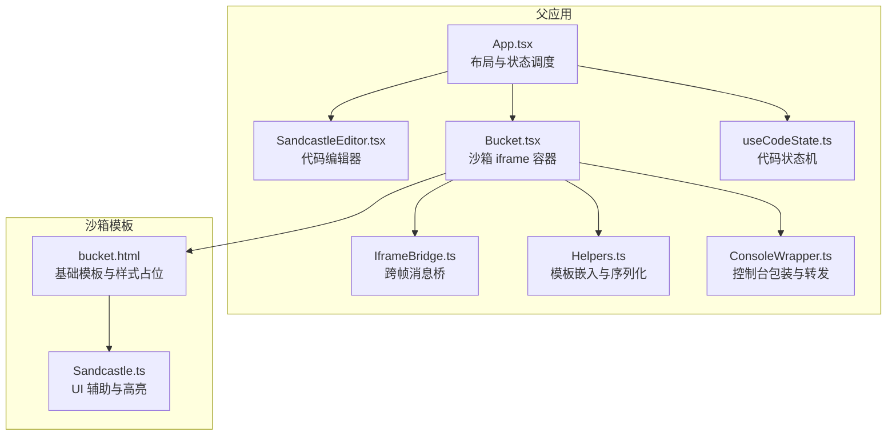
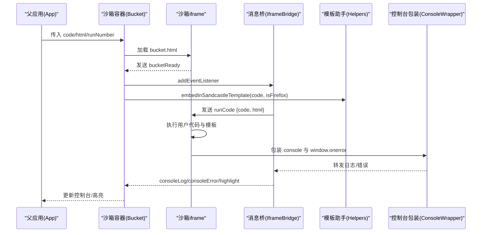
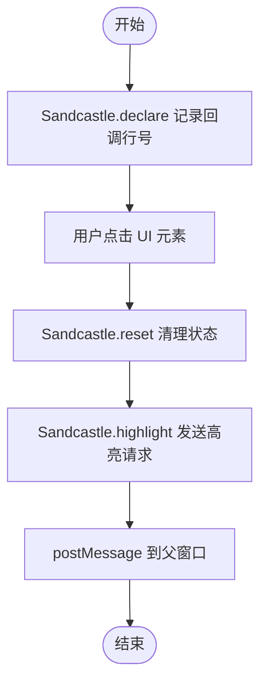
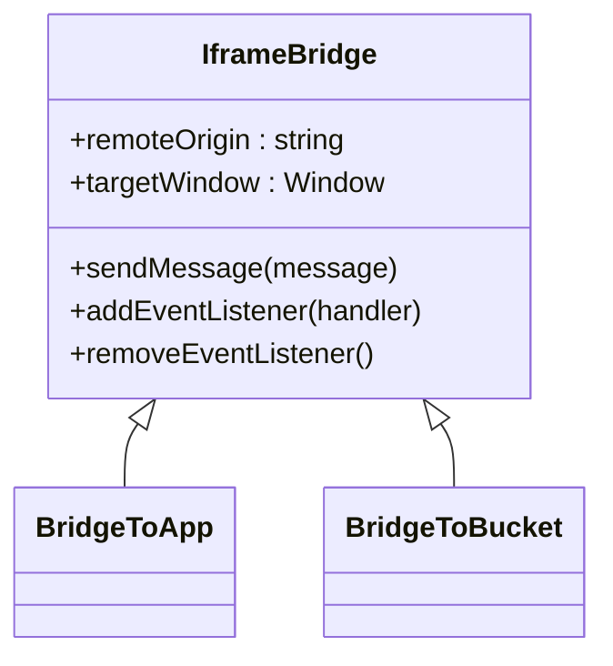
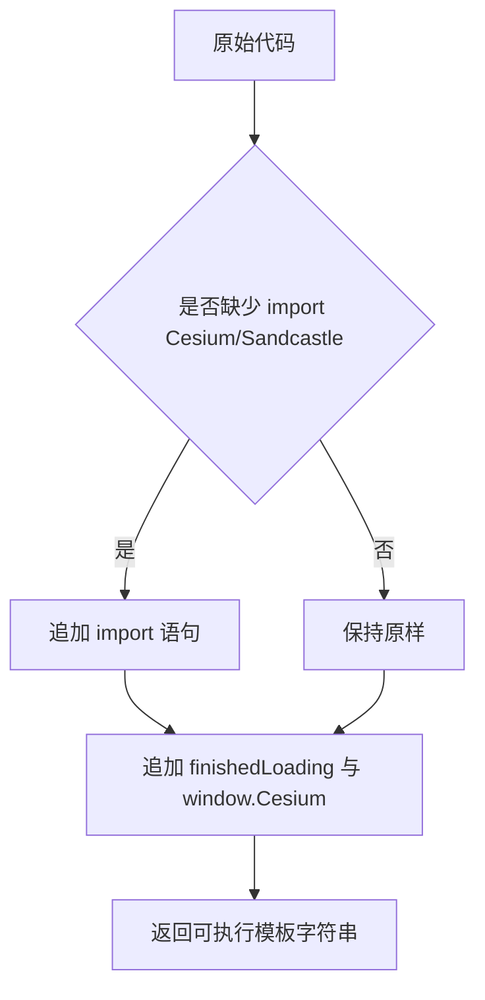
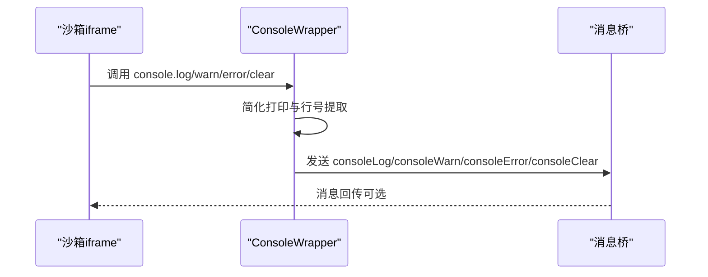
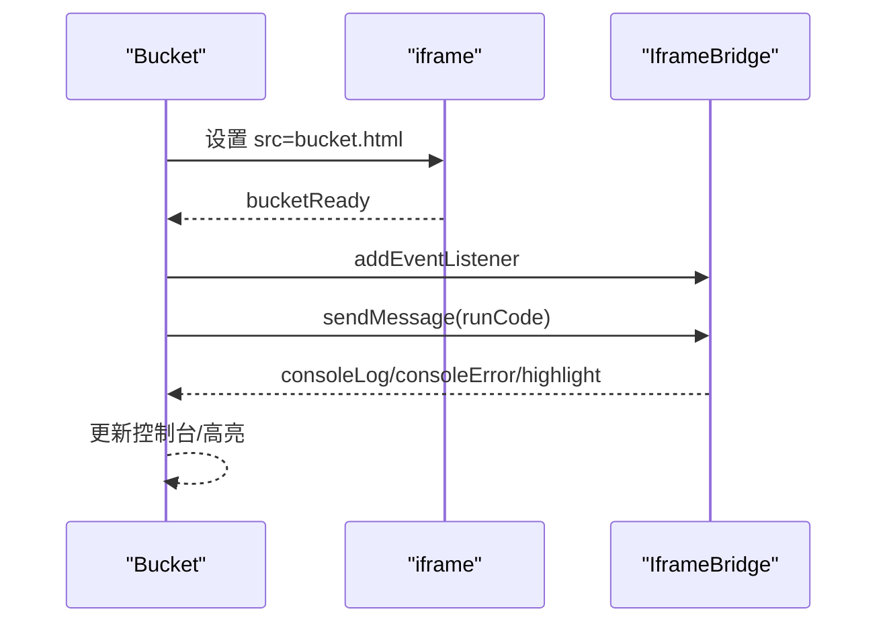
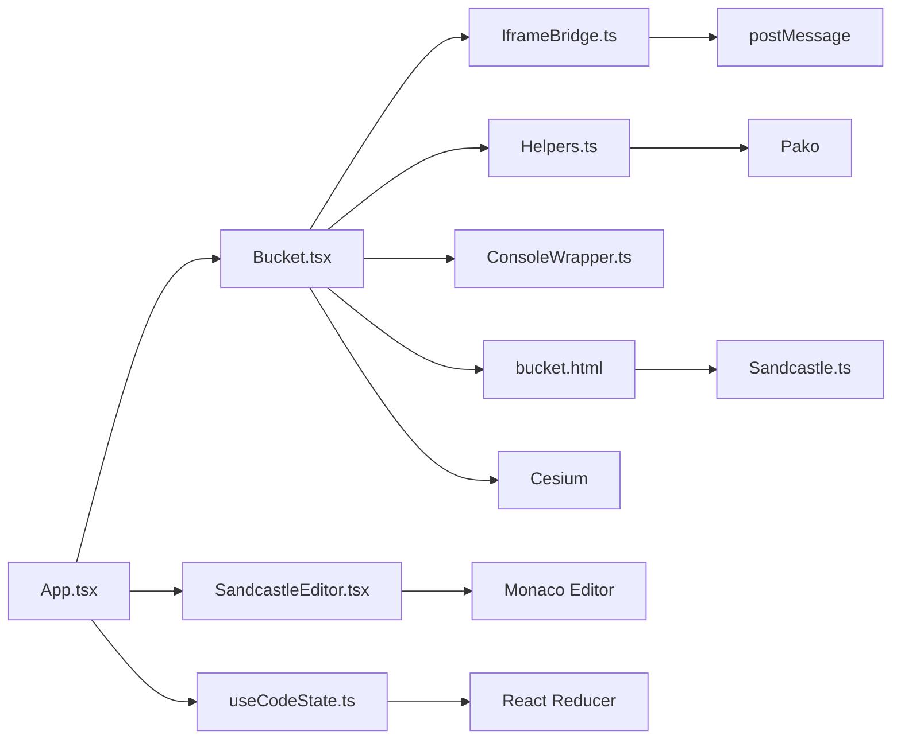

# 沙盒模板系统

<cite>
**本文引用的文件**
- [Sandcastle.ts](file://apps/cesium-web/templates/Sandcastle.ts)
- [bucket.html](file://apps/cesium-web/templates/bucket.html)
- [SandcastleEditor.tsx](file://apps/cesium-web/src/components/SandcastleEditor/SandcastleEditor.tsx)
- [IframeBridge.ts](file://apps/cesium-web/src/util/IframeBridge.ts)
- [Helpers.ts](file://apps/cesium-web/src/util/Helpers.ts)
- [ConsoleWrapper.ts](file://apps/cesium-web/src/util/ConsoleWrapper.ts)
- [Bucket.tsx](file://apps/cesium-web/src/components/Bucket/Bucket.tsx)
- [App.tsx](file://apps/cesium-web/src/App.tsx)
- [main.tsx](file://apps/cesium-web/src/main.tsx)
- [useCodeState.ts](file://apps/cesium-web/src/hooks/useCodeState.ts)
- [getBaseUrl.ts](file://apps/cesium-web/src/util/getBaseUrl.ts)
- [package.json](file://apps/cesium-web/package.json)
- [sandcastle.yaml](file://apps/cesium-web/gallery/web-map-service-wms/sandcastle.yaml)
- [main.js](file://apps/cesium-web/gallery/web-map-service-wms/main.js)
- [index.html](file://apps/cesium-web/gallery/web-map-service-wms/index.html)
</cite>

## 目录

1. [简介](#简介)
2. [项目结构](#项目结构)
3. [核心组件](#核心组件)
4. [架构总览](#架构总览)
5. [详细组件分析](#详细组件分析)
6. [依赖关系分析](#依赖关系分析)
7. [性能考量](#性能考量)
8. [故障排除指南](#故障排除指南)
9. [结论](#结论)
10. [附录](#附录)

## 简介

本文件面向沙盒模板系统的技术文档，聚焦于：

- 沙盒 HTML 模板的设计与 Cesium 场景初始化流程
- 模板结构、资源加载策略与依赖管理
- 代码嵌入机制、动态脚本注入与 DOM 操作处理
- Firefox 兼容性处理、浏览器差异适配与功能降级策略
- 模板变量替换、URL 处理与路径解析机制
- Cesium 实例创建、场景配置与渲染循环管理
- 模板扩展接口、自定义配置选项与性能优化技巧
- 模板使用示例、调试方法与故障排除指南

## 项目结构

该系统围绕“父应用 + 沙箱 iframe（bucket）”的双层架构组织，前端采用 React + Vite 构建，模板与运行时逻辑分离，便于维护与扩展。

**图表来源**

- [App.tsx:15-145](file://apps/cesium-web/src/App.tsx#L15-L145)
- [Bucket.tsx:53-132](file://apps/cesium-web/src/components/Bucket/Bucket.tsx#L53-L132)
- [IframeBridge.ts:78-182](file://apps/cesium-web/src/util/IframeBridge.ts#L78-L182)
- [Helpers.ts:18-36](file://apps/cesium-web/src/util/Helpers.ts#L18-L36)
- [ConsoleWrapper.ts:254-295](file://apps/cesium-web/src/util/ConsoleWrapper.ts#L254-L295)
- [bucket.html:1-84](file://apps/cesium-web/templates/bucket.html#L1-L84)
- [Sandcastle.ts:32-261](file://apps/cesium-web/templates/Sandcastle.ts#L32-L261)

**章节来源**

- [App.tsx:15-145](file://apps/cesium-web/src/App.tsx#L15-L145)
- [Bucket.tsx:53-132](file://apps/cesium-web/src/components/Bucket/Bucket.tsx#L53-L132)
- [package.json:12-28](file://apps/cesium-web/package.json#L12-L28)

## 核心组件

- 沙箱模板与运行时
  - bucket.html：提供最小化样式与占位符，注入 Cesium 基础资源路径变量，屏蔽 FOUC 与重排。
  - Sandcastle.ts：在沙箱内提供 UI 构建与高亮能力，记录“书签”行号并通过 postMessage 回传父窗口。
- 跨帧通信桥
  - IframeBridge：统一消息信封、来源校验与类型安全，支持父窗口与 iframe 双向通信。
- 代码嵌入与序列化
  - Helpers.embedInSandcastleTemplate：自动补齐导入与运行收尾，保证行号对齐与 DevTools 可见性。
  - Helpers.makeCompressedBase64String / decodeBase64Data：URL 分享与存档的压缩编码/解码。
- 控制台包装
  - ConsoleWrapper：包装 console 方法与 window.onerror，将日志与错误转发至父窗口并增强可读性。
- 编辑器与状态
  - SandcastleEditor：基于 Monaco 的编辑器封装，主题随上下文切换。
  - useCodeState：代码与 HTML 的编辑状态机，支持提交运行与脏标记。

**章节来源**

- [bucket.html:1-84](file://apps/cesium-web/templates/bucket.html#L1-L84)
- [Sandcastle.ts:32-261](file://apps/cesium-web/templates/Sandcastle.ts#L32-L261)
- [IframeBridge.ts:78-182](file://apps/cesium-web/src/util/IframeBridge.ts#L78-L182)
- [Helpers.ts:18-36](file://apps/cesium-web/src/util/Helpers.ts#L18-L36)
- [ConsoleWrapper.ts:254-295](file://apps/cesium-web/src/util/ConsoleWrapper.ts#L254-L295)
- [SandcastleEditor.tsx:44-72](file://apps/cesium-web/src/components/SandcastleEditor/SandcastleEditor.tsx#L44-L72)
- [useCodeState.ts:63-110](file://apps/cesium-web/src/hooks/useCodeState.ts#L63-L110)

## 架构总览

系统通过 Bucket 组件加载沙箱模板，借助 IframeBridge 实现父子窗口间的消息传递；Helpers 负责将用户代码包裹为可执行模板；ConsoleWrapper 将沙箱内的日志与错误回传到父窗口控制台；Sandcastle.ts 在沙箱内提供 UI 与高亮能力。

**图表来源**

- [Bucket.tsx:68-110](file://apps/cesium-web/src/components/Bucket/Bucket.tsx#L68-L110)
- [IframeBridge.ts:149-170](file://apps/cesium-web/src/util/IframeBridge.ts#L149-L170)
- [Helpers.ts:18-36](file://apps/cesium-web/src/util/Helpers.ts#L18-L36)
- [ConsoleWrapper.ts:254-295](file://apps/cesium-web/src/util/ConsoleWrapper.ts#L254-L295)

## 详细组件分析

### 沙箱模板与基础结构（bucket.html）

- 设计要点
  - 通过占位符注入 Cesium 基础资源路径，避免 FOUC 与重排。
  - 内联最小化样式，确保加载 Overlay 与工具栏可见性。
  - 通过脚本注入全局变量，供沙箱内脚本读取。
- 资源加载策略
  - 使用 vite-ignore 标记静态资源，交由构建工具处理。
  - 通过 **CESIUM_BASE_URL** 占位符实现运行时替换。
- 依赖管理
  - 依赖 Cesium Widgets 样式与 lighter.css，确保控件外观一致性。

**章节来源**

- [bucket.html:1-84](file://apps/cesium-web/templates/bucket.html#L1-L84)

### 沙箱运行时辅助（Sandcastle.ts）

- 功能概述
  - 提供 UI 构建：按钮、开关、下拉菜单等，统一注入“书签”行号。
  - 高亮机制：通过堆栈信息定位行号，向父窗口发送高亮请求。
  - 生命周期：finishedLoading 触发默认动作与加载态移除。
- 浏览器差异适配
  - 针对 Firefox、Chrome、IE 的堆栈标识差异进行兼容处理。
- DOM 操作
  - 动态创建元素并注入工具栏，支持点击回调与默认动作绑定。

**图表来源**

- [Sandcastle.ts:45-100](file://apps/cesium-web/templates/Sandcastle.ts#L45-L100)

**章节来源**

- [Sandcastle.ts:32-261](file://apps/cesium-web/templates/Sandcastle.ts#L32-L261)

### 跨帧消息桥（IframeBridge）

- 类型安全与来源校验
  - 统一消息信封 id，过滤第三方 postMessage 流量。
  - origin 校验与同源保护，避免消息回环。
- 双向通信
  - 父窗口与 iframe 各自持有桥实例，分别指向对方窗口。
  - 支持 bucketReady、runCode、console\*、highlight 等消息类型。
- 空操作保护
  - 当 targetWindow 与当前 window 相同时，静默跳过发送，防止无限回环。

**图表来源**

- [IframeBridge.ts:78-182](file://apps/cesium-web/src/util/IframeBridge.ts#L78-L182)

**章节来源**

- [IframeBridge.ts:78-182](file://apps/cesium-web/src/util/IframeBridge.ts#L78-L182)

### 代码嵌入与动态脚本注入（Helpers）

- 模板嵌入
  - 自动补齐 import 语句，保证 Cesium 与 Sandcastle 可用。
  - 将补丁导入置于末尾，避免编辑器行号偏移。
  - 注入 finishedLoading 与 window.Cesium 挂载，便于调试。
- URL 分享与存档
  - 压缩编码：JSON 数组裁剪首尾固定片段，raw DEFLATE 压缩，Base64 无填充。
  - 解码兼容：历史字段提示与忽略，保证向前兼容。

**图表来源**

- [Helpers.ts:18-36](file://apps/cesium-web/src/util/Helpers.ts#L18-L36)

**章节来源**

- [Helpers.ts:18-36](file://apps/cesium-web/src/util/Helpers.ts#L18-L36)
- [Helpers.ts:63-79](file://apps/cesium-web/src/util/Helpers.ts#L63-L79)
- [Helpers.ts:100-136](file://apps/cesium-web/src/util/Helpers.ts#L100-L136)

### 控制台包装与转发（ConsoleWrapper）

- 包装策略
  - 重写 console.clear/log/warn/error，统一转发至父窗口。
  - 错误对象增强：尝试从堆栈提取行号，提升定位效率。
- 窗口错误捕获
  - 监听 window.onerror，过滤沙箱自身 URL，提取行号并转发。
- 输出优化
  - 对数组、对象、函数进行简化打印，避免大对象导致的长字符串。

**图表来源**

- [ConsoleWrapper.ts:254-295](file://apps/cesium-web/src/util/ConsoleWrapper.ts#L254-L295)
- [IframeBridge.ts:149-170](file://apps/cesium-web/src/util/IframeBridge.ts#L149-L170)

**章节来源**

- [ConsoleWrapper.ts:254-295](file://apps/cesium-web/src/util/ConsoleWrapper.ts#L254-L295)

### 沙箱容器与运行流程（Bucket）

- 初始化
  - 通过 **INNER_ORIGIN** 与 location.pathname 构造 bucket.html 的绝对 URL。
  - 懒加载 iframe，sandbox 限制仅允许脚本与同源。
- 运行控制
  - 监听 bucketReady 后发送 runCode，携带模板化代码与自定义 HTML。
  - 通过 runNumber 变化触发 reload，实现代码热更新。
- 交互处理
  - 接收 console\*、highlight 等消息，驱动父窗口控制台与编辑器高亮。

**图表来源**

- [Bucket.tsx:59-110](file://apps/cesium-web/src/components/Bucket/Bucket.tsx#L59-L110)

**章节来源**

- [Bucket.tsx:53-132](file://apps/cesium-web/src/components/Bucket/Bucket.tsx#L53-L132)

### 编辑器与状态管理（SandcastleEditor + useCodeState）

- 编辑器
  - 基于 Monaco，主题随上下文切换，禁用 minimap 以节省空间。
  - 自动布局与行高亮，提升编辑体验。
- 状态机
  - 支持 setCode/setHtml、runSandcastle、setAndRun 等动作。
  - 提交后更新 committedCode/committedHtml 与 runNumber，触发 iframe 重新加载。

**章节来源**

- [SandcastleEditor.tsx:44-72](file://apps/cesium-web/src/components/SandcastleEditor/SandcastleEditor.tsx#L44-L72)
- [useCodeState.ts:63-110](file://apps/cesium-web/src/hooks/useCodeState.ts#L63-L110)

### Firefox 兼容性与浏览器差异适配

- 堆栈标识差异
  - Firefox 使用 “bucket:line”、Chrome 使用 “<anonymous>:”、IE 使用 “Unknown script code:”。
  - 通过多分支查找定位行号，确保高亮与错误定位准确。
- 功能降级
  - 在 Firefox 下注入额外空行以对齐行号，减少编辑器与运行时的行号偏差。
  - 严格来源校验与消息过滤，避免第三方库干扰。

**章节来源**

- [Sandcastle.ts:57-72](file://apps/cesium-web/templates/Sandcastle.ts#L57-L72)
- [ConsoleWrapper.ts:205-246](file://apps/cesium-web/src/util/ConsoleWrapper.ts#L205-L246)
- [Bucket.tsx:76-82](file://apps/cesium-web/src/components/Bucket/Bucket.tsx#L76-L82)

### 模板变量替换、URL 处理与路径解析

- 变量替换
  - bucket.html 中的 **CESIUM_BASE_URL** 由沙箱脚本注入，运行时替换为实际路径。
- 路径解析
  - Bucket 通过 **INNER_ORIGIN** 与 pathname 构造 bucket.html 的绝对 URL，适配部署路径。
- 基础路径
  - getBaseUrl 提供不含查询与哈希的基础 URL，便于分享与重定向。

**章节来源**

- [bucket.html:80-81](file://apps/cesium-web/templates/bucket.html#L80-L81)
- [Bucket.tsx:8-11](file://apps/cesium-web/src/components/Bucket/Bucket.tsx#L8-L11)
- [getBaseUrl.ts:1-5](file://apps/cesium-web/src/util/getBaseUrl.ts#L1-L5)

### Cesium 实例创建、场景配置与渲染循环

- 示例流程
  - 在沙箱模板中创建 Viewer 容器，添加 WMS 影像图层，设置相机视角。
- 渲染循环
  - Cesium 内部管理渲染循环，无需手动干预；可通过控制台观察实例与状态。
- 调试建议
  - 通过 Helpers 注入的 window.Cesium 访问实例，结合 Sandcastle 高亮快速定位问题。

**章节来源**

- [main.js:1-22](file://apps/cesium-web/gallery/web-map-service-wms/main.js#L1-L22)
- [index.html:1-7](file://apps/cesium-web/gallery/web-map-service-wms/index.html#L1-L7)

### 模板扩展接口与自定义配置

- 扩展点
  - 自定义 HTML 片段注入：通过 Bucket 的 html 参数传入，沙箱内按需渲染。
  - 自定义样式：通过 bucket.html 的内联样式与 Widgets 样式组合。
  - 消息扩展：可在 IframeBridge 基础上新增消息类型，扩展沙箱能力。
- 配置项
  - INNER_ORIGIN：沙箱模板来源，影响 bucket.html 的加载路径。
  - runNumber：运行计数器，驱动 iframe 重新加载。
  - 编辑器主题：根据主题上下文自动切换。

**章节来源**

- [Bucket.tsx:17-47](file://apps/cesium-web/src/components/Bucket/Bucket.tsx#L17-L47)
- [IframeBridge.ts:106-109](file://apps/cesium-web/src/util/IframeBridge.ts#L106-L109)
- [SandcastleEditor.tsx:59-65](file://apps/cesium-web/src/components/SandcastleEditor/SandcastleEditor.tsx#L59-L65)

## 依赖关系分析

- 运行时依赖
  - Cesium：核心 3D 引擎，通过模板注入与 Helpers 挂载。
  - Monaco Editor：代码编辑器，主题与配置由上下文决定。
  - Pako：DEFLATE 压缩，用于 URL 分享的存档压缩。
- 构建与打包
  - Vite + SWC React 插件，按需加载与热更新。
  - vite-cesium-plugin：Cesium 资源处理插件，配合模板占位符。

**图表来源**

- [package.json:12-28](file://apps/cesium-web/package.json#L12-L28)
- [main.tsx:7-10](file://apps/cesium-web/src/main.tsx#L7-L10)

**章节来源**

- [package.json:12-28](file://apps/cesium-web/package.json#L12-L28)
- [main.tsx:7-10](file://apps/cesium-web/src/main.tsx#L7-L10)

## 性能考量

- 编辑器性能
  - 关闭 minimap、启用自动布局，减少重绘与重排。
  - 固定字体与行高亮，降低渲染压力。
- 沙箱加载
  - 通过 vite-ignore 与占位符延迟资源解析，缩短首屏时间。
  - 懒加载 iframe，按需触发运行。
- 日志与错误
  - 控制台包装避免大对象打印，减少主线程阻塞。
  - 错误行号提取与来源过滤，提升调试效率。
- 压缩与分享
  - 使用 DEFLATE 压缩与 Base64 无填充，显著缩小 URL 长度。

[本节为通用性能建议，不直接分析特定文件]

## 故障排除指南

- 无法加载沙箱
  - 检查 INNER_ORIGIN 与 bucket.html 的相对路径是否正确。
  - 确认 iframe sandbox 权限包含 allow-scripts 与 allow-same-origin。
- 代码未执行
  - 确认 bucketReady 已到达，再发送 runCode。
  - 检查 Helpers 是否正确注入 finishedLoading 与 window.Cesium。
- 控制台无输出
  - 确认 ConsoleWrapper 已包装 console 方法并与桥连接。
  - 检查消息来源与 origin 校验是否通过。
- 行号高亮不准
  - 确认浏览器堆栈标识匹配（Firefox/Chrome/IE）。
  - 在 Firefox 下确认已注入额外空行以对齐行号。
- URL 分享失效
  - 检查压缩编码/解码流程，确认历史字段兼容提示。

**章节来源**

- [Bucket.tsx:124-129](file://apps/cesium-web/src/components/Bucket/Bucket.tsx#L124-L129)
- [IframeBridge.ts:150-168](file://apps/cesium-web/src/util/IframeBridge.ts#L150-L168)
- [ConsoleWrapper.ts:254-295](file://apps/cesium-web/src/util/ConsoleWrapper.ts#L254-L295)
- [Helpers.ts:100-136](file://apps/cesium-web/src/util/Helpers.ts#L100-L136)

## 结论

沙盒模板系统通过清晰的分层设计与严格的跨帧通信机制，实现了安全、可控且易扩展的 Cesium 示例运行环境。模板变量替换、动态脚本注入与控制台转发构成了完整的开发与调试闭环；Firefox 兼容性与浏览器差异适配确保了广泛的可用性；状态机与编辑器优化提升了开发体验。未来可在消息协议扩展、资源预加载与可视化调试方面进一步增强。

[本节为总结性内容，不直接分析特定文件]

## 附录

### 模板使用示例

- 示例目录
  - gallery/web-map-service-wms：展示 WMS 影像服务加载与相机视角设置。
- 使用步骤
  - 在编辑器中编写代码与 HTML 片段。
  - 点击“运行”，沙箱加载 bucket.html 并执行模板化代码。
  - 通过控制台查看日志与错误，利用高亮定位问题。

**章节来源**

- [sandcastle.yaml:1-7](file://apps/cesium-web/gallery/web-map-service-wms/sandcastle.yaml#L1-L7)
- [main.js:1-22](file://apps/cesium-web/gallery/web-map-service-wms/main.js#L1-L22)
- [index.html:1-7](file://apps/cesium-web/gallery/web-map-service-wms/index.html#L1-L7)

### 调试方法

- 在 DevTools 中访问 window.Cesium 获取实例。
- 使用 Sandcastle 高亮定位代码行，结合控制台错误信息。
- 通过 URL 分享功能复现问题，核对压缩编码与解码流程。

**章节来源**

- [Helpers.ts:32-35](file://apps/cesium-web/src/util/Helpers.ts#L32-L35)
- [ConsoleWrapper.ts:288-292](file://apps/cesium-web/src/util/ConsoleWrapper.ts#L288-L292)
