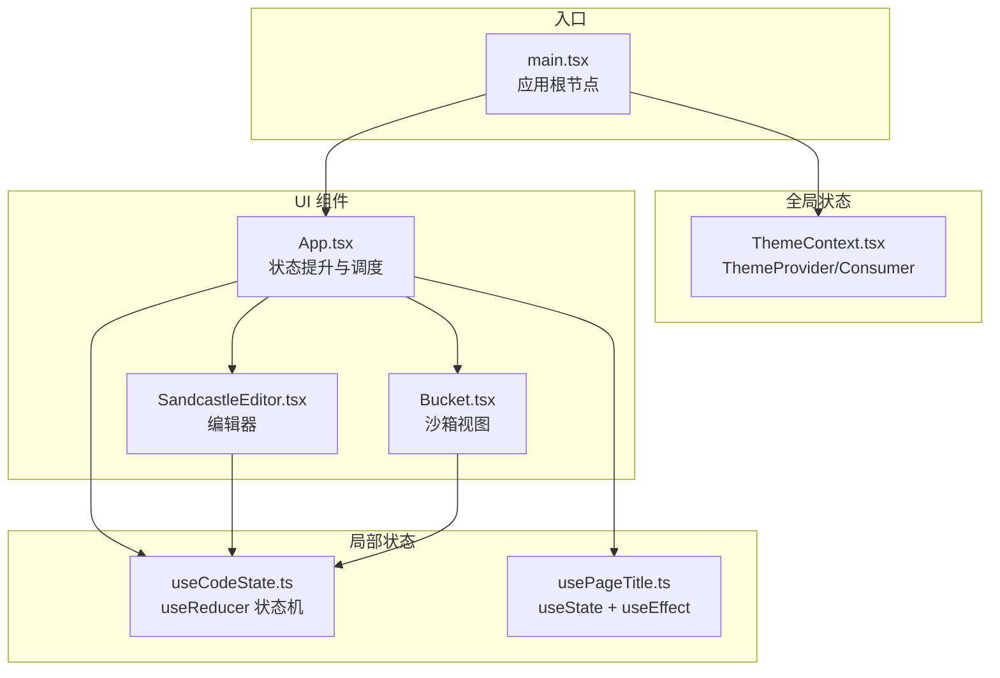
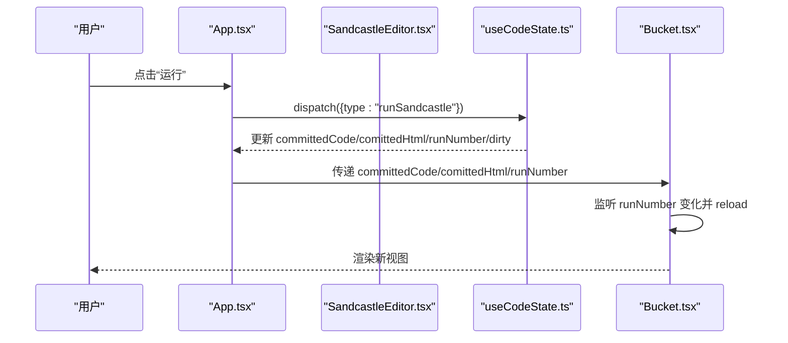
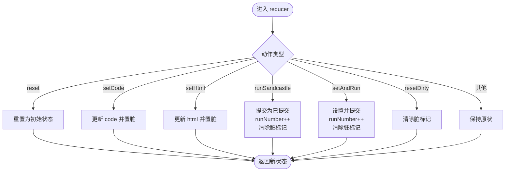
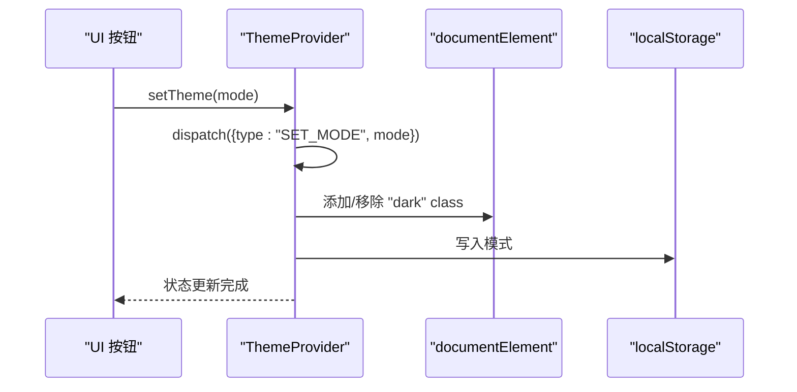
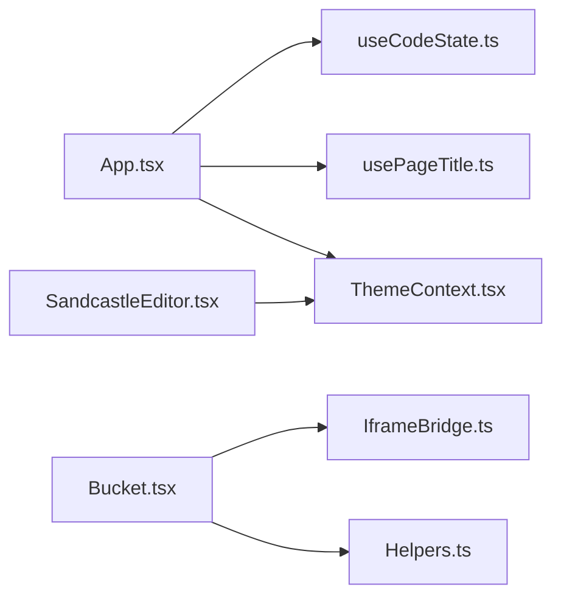

# 状态管理

<cite>
**本文引用的文件**
- [apps/cesium-web/src/hooks/useCodeState.ts](file://apps/cesium-web/src/hooks/useCodeState.ts)
- [apps/cesium-web/src/hooks/usePageTitle.ts](file://apps/cesium-web/src/hooks/usePageTitle.ts)
- [apps/cesium-web/src/contexts/ThemeContext.tsx](file://apps/cesium-web/src/contexts/ThemeContext.tsx)
- [apps/cesium-web/src/App.tsx](file://apps/cesium-web/src/App.tsx)
- [apps/cesium-web/src/main.tsx](file://apps/cesium-web/src/main.tsx)
- [apps/cesium-web/src/components/SandcastleEditor/SandcastleEditor.tsx](file://apps/cesium-web/src/components/SandcastleEditor/SandcastleEditor.tsx)
- [apps/cesium-web/src/components/Bucket/Bucket.tsx](file://apps/cesium-web/src/components/Bucket/Bucket.tsx)
- [apps/cesium-web/src/util/Helpers.ts](file://apps/cesium-web/src/util/Helpers.ts)
- [apps/cesium-web/src/util/ConsoleWrapper.ts](file://apps/cesium-web/src/util/ConsoleWrapper.ts)
- [apps/cesium-web/src/util/IframeBridge.ts](file://apps/cesium-web/src/util/IframeBridge.ts)
- [apps/cesium-web/package.json](file://apps/cesium-web/package.json)
</cite>

## 目录

1. [简介](#简介)
2. [项目结构](#项目结构)
3. [核心组件](#核心组件)
4. [架构总览](#架构总览)
5. [详细组件分析](#详细组件分析)
6. [依赖关系分析](#依赖关系分析)
7. [性能考量](#性能考量)
8. [故障排查指南](#故障排查指南)
9. [结论](#结论)
10. [附录](#附录)

## 简介

本文件聚焦于本项目的“状态管理架构”，围绕以下主题展开：

- 自定义 Hook 的设计模式与状态协调机制
- 代码状态、主题状态与页面标题的状态流转
- 状态提升策略、Context API 使用模式与状态持久化方案
- 状态订阅机制、副作用处理与性能优化策略
- 状态同步、冲突解决与回滚机制
- 状态调试工具、时间旅行与状态快照能力建议
- 最佳实践、设计原则与扩展指南

## 项目结构

本项目采用“自定义 Hook + Context Provider”的组合式状态管理模式：

- 自定义 Hook 负责局部状态与派发动作，如代码状态与页面标题状态
- Context Provider 负责全局主题状态与持久化
- 组件通过 Hook 与 Context 获取状态并触发动作，形成单向数据流

图表来源

- [apps/cesium-web/src/main.tsx:1-19](file://apps/cesium-web/src/main.tsx#L1-L19)
- [apps/cesium-web/src/contexts/ThemeContext.tsx:1-108](file://apps/cesium-web/src/contexts/ThemeContext.tsx#L1-L108)
- [apps/cesium-web/src/hooks/useCodeState.ts:1-123](file://apps/cesium-web/src/hooks/useCodeState.ts#L1-L123)
- [apps/cesium-web/src/hooks/usePageTitle.ts:1-43](file://apps/cesium-web/src/hooks/usePageTitle.ts#L1-L43)
- [apps/cesium-web/src/App.tsx:1-149](file://apps/cesium-web/src/App.tsx#L1-L149)
- [apps/cesium-web/src/components/SandcastleEditor/SandcastleEditor.tsx:1-73](file://apps/cesium-web/src/components/SandcastleEditor/SandcastleEditor.tsx#L1-L73)
- [apps/cesium-web/src/components/Bucket/Bucket.tsx:1-135](file://apps/cesium-web/src/components/Bucket/Bucket.tsx#L1-L135)

章节来源

- [apps/cesium-web/src/main.tsx:1-19](file://apps/cesium-web/src/main.tsx#L1-L19)
- [apps/cesium-web/src/App.tsx:1-149](file://apps/cesium-web/src/App.tsx#L1-L149)

## 核心组件

- 代码状态 Hook：使用 useReducer 管理“当前编辑代码/HTML、已提交代码/HTML、运行计数、脏标记”等，提供统一的动作派发接口
- 主题 Context：使用 useReducer 管理“模式/解析主题”，结合 localStorage 与系统媒体查询实现持久化与响应式主题
- 页面标题 Hook：基于 document.title 动态更新标题，并在脏状态时附加星号提示
- 应用根节点：在根节点注入 ThemeProvider，确保全局主题可用；同时在 App 层进行状态提升与动作分发

章节来源

- [apps/cesium-web/src/hooks/useCodeState.ts:1-123](file://apps/cesium-web/src/hooks/useCodeState.ts#L1-L123)
- [apps/cesium-web/src/contexts/ThemeContext.tsx:1-108](file://apps/cesium-web/src/contexts/ThemeContext.tsx#L1-L108)
- [apps/cesium-web/src/hooks/usePageTitle.ts:1-43](file://apps/cesium-web/src/hooks/usePageTitle.ts#L1-L43)
- [apps/cesium-web/src/main.tsx:1-19](file://apps/cesium-web/src/main.tsx#L1-L19)
- [apps/cesium-web/src/App.tsx:1-149](file://apps/cesium-web/src/App.tsx#L1-L149)

## 架构总览

本项目采用“局部状态 Hook + 全局 Context Provider”的分层状态管理：

- 局部状态：代码状态、页面标题状态，通过 useReducer 或 useState 管理，避免跨层级传递复杂 props
- 全局状态：主题状态，通过 Context Provider 提供，支持持久化与系统主题联动
- 组件层：App 作为状态提升中心，将状态与动作向下传递给子组件；编辑器与沙箱视图分别消费状态并触发动作

图表来源

- [apps/cesium-web/src/App.tsx:83-86](file://apps/cesium-web/src/App.tsx#L83-L86)
- [apps/cesium-web/src/hooks/useCodeState.ts:63-110](file://apps/cesium-web/src/hooks/useCodeState.ts#L63-L110)
- [apps/cesium-web/src/components/Bucket/Bucket.tsx:59-66](file://apps/cesium-web/src/components/Bucket/Bucket.tsx#L59-L66)

## 详细组件分析

### 代码状态 Hook（useCodeState）

- 设计要点
  - 使用 useReducer 维护“当前/已提交代码、HTML、运行计数、脏标记”等状态
  - 动作类型覆盖“重置、设置代码/HTML、运行、设置并运行、重置脏标记”
  - 通过返回值暴露状态与派发器，便于上层组件统一调度
- 状态流转
  - setCode/setHtml：更新当前代码并置脏
  - runSandcastle：提交当前代码为已提交，增加运行计数，清除脏标记
  - setAndRun：一次性设置并提交，同时增加运行计数
  - reset：恢复默认初始状态
- 与沙箱视图的协作
  - App 将 committedCode/comittedHtml/runNumber 传递给 Bucket
  - Bucket 依据 runNumber 变化触发 reload，从而实现“代码变更 → 视图刷新”的同步

图表来源

- [apps/cesium-web/src/hooks/useCodeState.ts:63-110](file://apps/cesium-web/src/hooks/useCodeState.ts#L63-L110)

章节来源

- [apps/cesium-web/src/hooks/useCodeState.ts:1-123](file://apps/cesium-web/src/hooks/useCodeState.ts#L1-L123)
- [apps/cesium-web/src/App.tsx:92-100](file://apps/cesium-web/src/App.tsx#L92-L100)
- [apps/cesium-web/src/components/Bucket/Bucket.tsx:59-66](file://apps/cesium-web/src/components/Bucket/Bucket.tsx#L59-L66)

### 主题 Context（ThemeContext）

- 设计要点
  - 使用 useReducer 管理“模式/解析主题”，支持“浅色/深色/系统”
  - 通过 localStorage 实现持久化，初始化时读取并回填
  - 监听系统主题变化（prefers-color-scheme），在模式为“系统”时自动更新解析主题
  - 通过 DOM class 切换实现样式生效
- 状态持久化
  - 初始化：从 localStorage 读取模式，若不存在则默认“系统”
  - 更新：每次 setTheme 时同步写入 localStorage
- 系统主题联动
  - 模式为“系统”时，监听媒体查询变化并更新解析主题

图表来源

- [apps/cesium-web/src/contexts/ThemeContext.tsx:57-99](file://apps/cesium-web/src/contexts/ThemeContext.tsx#L57-L99)

章节来源

- [apps/cesium-web/src/contexts/ThemeContext.tsx:1-108](file://apps/cesium-web/src/contexts/ThemeContext.tsx#L1-L108)

### 页面标题 Hook（usePageTitle）

- 设计要点
  - 维护标题与脏状态两个独立状态
  - 通过 useEffect 监听标题与脏状态变化，动态更新 document.title
  - 支持在标题中追加星号以提示“未保存修改”
- 与代码状态的协同
  - 当代码处于脏状态时，标题自动带星号，帮助用户感知未保存更改

章节来源

- [apps/cesium-web/src/hooks/usePageTitle.ts:1-43](file://apps/cesium-web/src/hooks/usePageTitle.ts#L1-L43)

### 应用根节点与状态提升

- 根节点注入 ThemeProvider，保证全局主题可用
- App 作为状态提升中心：
  - 从 ThemeContext 获取解析主题与切换函数
  - 从 useCodeState 获取代码状态与派发器
  - 将 committedCode/comittedHtml/runNumber 传递给 Bucket
  - 将当前 code/html 与 onChange 传递给编辑器

章节来源

- [apps/cesium-web/src/main.tsx:1-19](file://apps/cesium-web/src/main.tsx#L1-L19)
- [apps/cesium-web/src/App.tsx:1-149](file://apps/cesium-web/src/App.tsx#L1-L149)

### 编辑器组件与状态订阅

- SandcastleEditor 仅负责展示与回调，不持有状态
- 通过 props.value 与 onChange 与 useCodeState 协作
- 主题通过 useTheme 决定编辑器主题

章节来源

- [apps/cesium-web/src/components/SandcastleEditor/SandcastleEditor.tsx:1-73](file://apps/cesium-web/src/components/SandcastleEditor/SandcastleEditor.tsx#L1-L73)
- [apps/cesium-web/src/hooks/useCodeState.ts:1-123](file://apps/cesium-web/src/hooks/useCodeState.ts#L1-L123)
- [apps/cesium-web/src/contexts/ThemeContext.tsx:1-108](file://apps/cesium-web/src/contexts/ThemeContext.tsx#L1-L108)

### 沙箱视图与状态同步

- Bucket 通过 IframeBridge 与 iframe 内容通信
- 通过 runNumber 变化触发 reload，实现“已提交代码 → 视图执行”的强一致
- 监听来自 iframe 的控制台消息并镜像到 UI

章节来源

- [apps/cesium-web/src/components/Bucket/Bucket.tsx:1-135](file://apps/cesium-web/src/components/Bucket/Bucket.tsx#L1-L135)
- [apps/cesium-web/src/util/IframeBridge.ts:1-183](file://apps/cesium-web/src/util/IframeBridge.ts#L1-L183)

### 辅助工具与状态持久化

- Helpers：提供“嵌入运行模板”“压缩 Base64 存档”等能力，支撑分享与持久化
- ConsoleWrapper：封装 console 的拦截与转发，配合 IframeBridge 实现跨域控制台镜像

章节来源

- [apps/cesium-web/src/util/Helpers.ts:1-137](file://apps/cesium-web/src/util/Helpers.ts#L1-L137)
- [apps/cesium-web/src/util/ConsoleWrapper.ts:1-296](file://apps/cesium-web/src/util/ConsoleWrapper.ts#L1-L296)
- [apps/cesium-web/src/util/IframeBridge.ts:1-183](file://apps/cesium-web/src/util/IframeBridge.ts#L1-L183)

## 依赖关系分析

- 组件依赖
  - App 依赖 useCodeState、useTheme
  - SandcastleEditor 依赖 useTheme
  - Bucket 依赖 IframeBridge、Helpers
- 外部依赖
  - React（useReducer、useState、useEffect、useContext、useMemo/memo）
  - localStorage（主题持久化）
  - Monaco Editor（代码编辑）

图表来源

- [apps/cesium-web/src/App.tsx:1-149](file://apps/cesium-web/src/App.tsx#L1-L149)
- [apps/cesium-web/src/hooks/useCodeState.ts:1-123](file://apps/cesium-web/src/hooks/useCodeState.ts#L1-L123)
- [apps/cesium-web/src/hooks/usePageTitle.ts:1-43](file://apps/cesium-web/src/hooks/usePageTitle.ts#L1-L43)
- [apps/cesium-web/src/contexts/ThemeContext.tsx:1-108](file://apps/cesium-web/src/contexts/ThemeContext.tsx#L1-L108)
- [apps/cesium-web/src/components/SandcastleEditor/SandcastleEditor.tsx:1-73](file://apps/cesium-web/src/components/SandcastleEditor/SandcastleEditor.tsx#L1-L73)
- [apps/cesium-web/src/components/Bucket/Bucket.tsx:1-135](file://apps/cesium-web/src/components/Bucket/Bucket.tsx#L1-L135)
- [apps/cesium-web/src/util/IframeBridge.ts:1-183](file://apps/cesium-web/src/util/IframeBridge.ts#L1-L183)
- [apps/cesium-web/src/util/Helpers.ts:1-137](file://apps/cesium-web/src/util/Helpers.ts#L1-L137)

章节来源

- [apps/cesium-web/package.json:1-51](file://apps/cesium-web/package.json#L1-L51)

## 性能考量

- 组件记忆化
  - 编辑器与沙箱视图均使用 memo，避免不必要的重渲染
- 状态最小化
  - 仅在必要时传递状态（如 Bucket 仅接收 committedCode/comittedHtml/runNumber）
- 副作用隔离
  - 主题切换与系统主题监听在 Context 内部完成，避免在多个组件重复监听
- 事件监听清理
  - 主题监听在卸载时移除，避免内存泄漏

章节来源

- [apps/cesium-web/src/components/SandcastleEditor/SandcastleEditor.tsx:72-73](file://apps/cesium-web/src/components/SandcastleEditor/SandcastleEditor.tsx#L72-L73)
- [apps/cesium-web/src/components/Bucket/Bucket.tsx:134-135](file://apps/cesium-web/src/components/Bucket/Bucket.tsx#L134-L135)
- [apps/cesium-web/src/contexts/ThemeContext.tsx:76-88](file://apps/cesium-web/src/contexts/ThemeContext.tsx#L76-L88)

## 故障排查指南

- 页面标题未更新
  - 检查 usePageTitle 的 useEffect 依赖项是否包含 title/isDirty
  - 确认 setIsDirty 与 setPageTitle 的调用顺序
- 主题切换无效
  - 检查 ThemeProvider 是否包裹根节点
  - 确认 setTheme 是否正确调用 dispatch
  - 查看 localStorage 中是否存在主题键值
- 代码运行后视图未刷新
  - 检查 App 是否将 committedCode/comittedHtml/runNumber 传递给 Bucket
  - 确认 Bucket 是否监听到 runNumber 变化并触发 reload
- 控制台消息未显示
  - 检查 IframeBridge 的 addEventListener 是否注册成功
  - 确认消息类型与来源校验是否通过
  - 核对沙箱内 console 包装是否正确注入

章节来源

- [apps/cesium-web/src/hooks/usePageTitle.ts:21-39](file://apps/cesium-web/src/hooks/usePageTitle.ts#L21-L39)
- [apps/cesium-web/src/contexts/ThemeContext.tsx:90-92](file://apps/cesium-web/src/contexts/ThemeContext.tsx#L90-L92)
- [apps/cesium-web/src/App.tsx:122-130](file://apps/cesium-web/src/App.tsx#L122-L130)
- [apps/cesium-web/src/components/Bucket/Bucket.tsx:59-66](file://apps/cesium-web/src/components/Bucket/Bucket.tsx#L59-L66)
- [apps/cesium-web/src/util/IframeBridge.ts:149-170](file://apps/cesium-web/src/util/IframeBridge.ts#L149-L170)
- [apps/cesium-web/src/util/ConsoleWrapper.ts:254-295](file://apps/cesium-web/src/util/ConsoleWrapper.ts#L254-L295)

## 结论

本项目通过“局部 Hook + 全局 Context”的组合，实现了清晰的状态边界与职责分离：

- 局部状态（代码、标题）通过 Hook 管理，动作集中、易于测试
- 全局状态（主题）通过 Context 提供，具备持久化与系统联动能力
- 组件间通过状态提升与 props 下传实现解耦，沙箱视图通过 runNumber 强一致地响应已提交代码
- 通过 memo 与副作用清理保障性能与稳定性

## 附录

### 状态提升策略与最佳实践

- 将共享状态提升至最近的共同祖先组件，减少跨层级 props
- 将动作集中到上层组件，下层组件只负责消费状态与回调
- 对于高频更新的状态，优先考虑拆分与记忆化

### Context API 使用模式

- 将只读状态与更新函数一并导出，避免在多处重复读取 localStorage
- 在 Provider 内部处理副作用与事件监听，确保卸载时清理

### 状态持久化方案

- 主题：localStorage 键值持久化，初始化时读取
- 代码：可通过 URL hash 或服务端存储实现分享与恢复（参考 Helpers 的压缩存档能力）

### 状态订阅机制与副作用处理

- 通过 useEffect 订阅状态变化并执行副作用（如更新 document.title、切换 DOM class、监听系统主题）
- 注意在卸载时移除监听，避免内存泄漏

### 性能优化策略

- 使用 memo 避免不必要的重渲染
- 将状态最小化传递，仅传递必要的 props
- 合理拆分组件，降低重渲染范围

### 状态同步、冲突解决与回滚机制

- 同步：通过 runNumber 与 committed 状态实现“已提交 → 已执行”的强一致
- 冲突：当前设计中未出现多源并发写入，若引入外部输入（如 URL 参数），可在初始化阶段合并策略
- 回滚：当前未提供显式回滚，可通过“重置”动作回到初始状态

### 状态调试工具、时间旅行与快照

- 时间旅行：可在 reducer 中记录历史动作与状态，结合 UI 实现“前进/后退”
- 快照：利用 Helpers 的压缩存档能力，将当前状态序列化为 URL，实现“状态快照分享”

章节来源

- [apps/cesium-web/src/hooks/useCodeState.ts:63-110](file://apps/cesium-web/src/hooks/useCodeState.ts#L63-L110)
- [apps/cesium-web/src/util/Helpers.ts:63-79](file://apps/cesium-web/src/util/Helpers.ts#L63-L79)
- [apps/cesium-web/src/util/Helpers.ts:100-136](file://apps/cesium-web/src/util/Helpers.ts#L100-L136)
