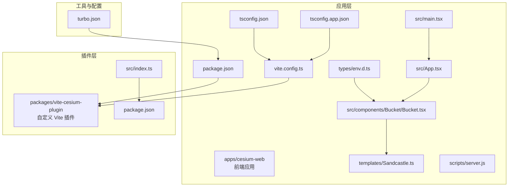
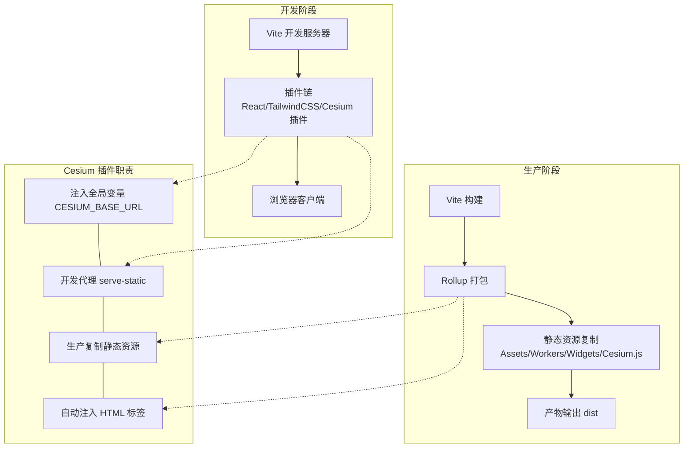
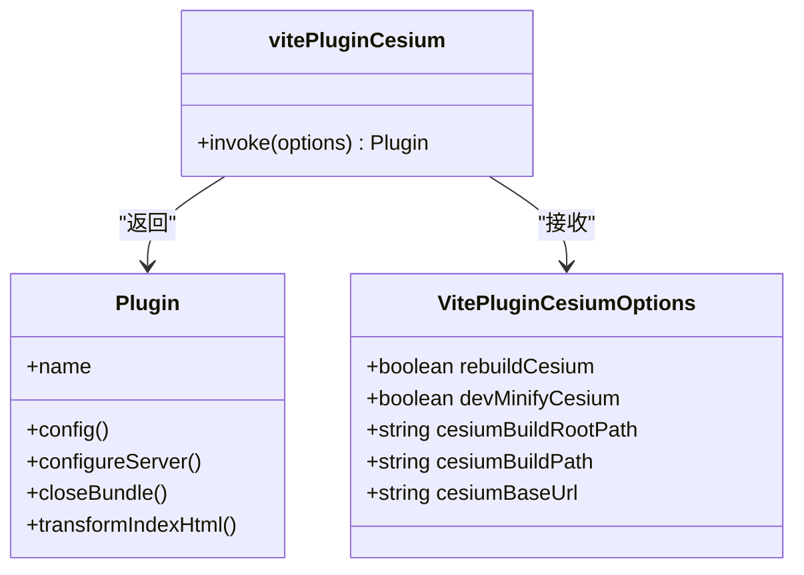
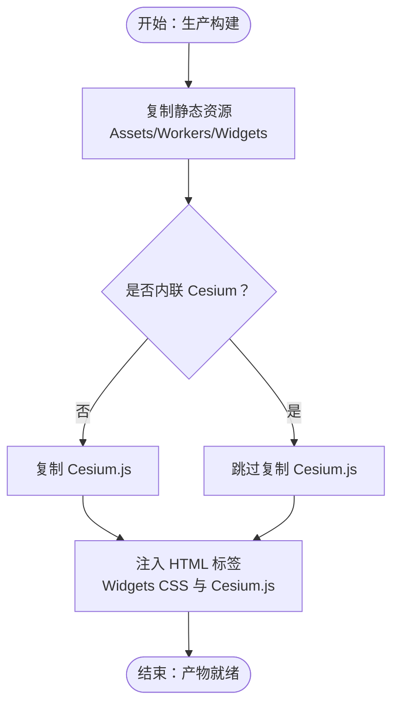
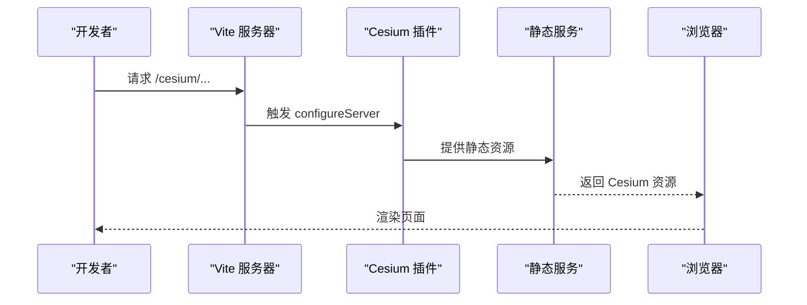
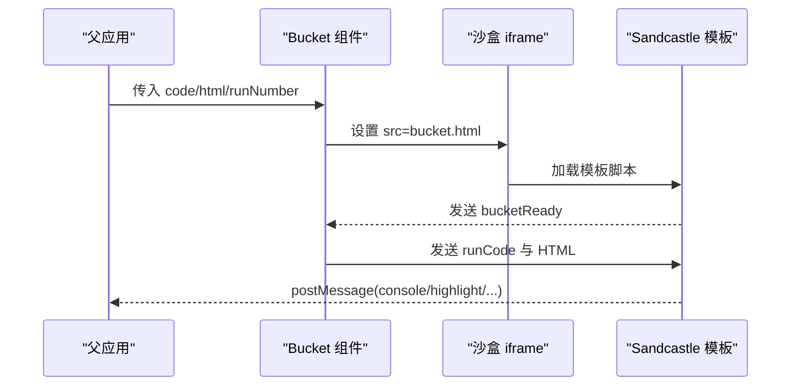
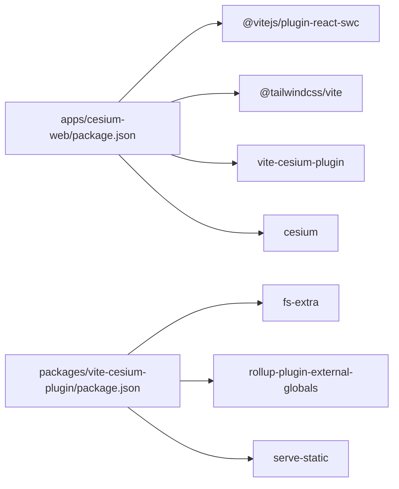

# 构建系统架构

<cite>
**本文引用的文件**   
- [vite.config.ts](file://apps/cesium-web/vite.config.ts)
- [package.json](file://apps/cesium-web/package.json)
- [index.ts](file://packages/vite-cesium-plugin/src/index.ts)
- [package.json](file://packages/vite-cesium-plugin/package.json)
- [main.tsx](file://apps/cesium-web/src/main.tsx)
- [App.tsx](file://apps/cesium-web/src/App.tsx)
- [Bucket.tsx](file://apps/cesium-web/src/components/Bucket/Bucket.tsx)
- [Sandcastle.ts](file://apps/cesium-web/templates/Sandcastle.ts)
- [env.d.ts](file://apps/cesium-web/types/env.d.ts)
- [tsconfig.app.json](file://apps/cesium-web/tsconfig.app.json)
- [tsconfig.json](file://apps/cesium-web/tsconfig.json)
- [turbo.json](file://turbo.json)
- [server.js](file://apps/cesium-web/scripts/server.js)
</cite>

## 目录

1. [引言](#引言)
2. [项目结构](#项目结构)
3. [核心组件](#核心组件)
4. [架构总览](#架构总览)
5. [详细组件分析](#详细组件分析)
6. [依赖关系分析](#依赖关系分析)
7. [性能考量](#性能考量)
8. [故障排除指南](#故障排除指南)
9. [结论](#结论)
10. [附录](#附录)

## 引言

本文件面向构建系统架构与 Vite 配置，重点阐述以下方面：

- Vite 构建配置与自定义插件设计实现
- Cesium 资源处理、代码分割与优化策略
- 开发服务器、热重载与代理设置
- 生产环境构建流程、资源打包与部署优化
- 自定义 Vite 插件的实现原理与扩展能力
- 构建性能分析、缓存策略与调试技巧
- 最佳实践与故障排除指南

## 项目结构

该仓库采用多包工作区组织，核心前端应用位于 apps/cesium-web，自定义 Vite 插件位于 packages/vite-cesium-plugin。应用通过 Vite 7 进行开发与构建，配合 React 19、TailwindCSS v4 与 CesiumJS。

图表来源

- [vite.config.ts:1-81](file://apps/cesium-web/vite.config.ts#L1-L81)
- [package.json:1-51](file://apps/cesium-web/package.json#L1-L51)
- [index.ts:1-193](file://packages/vite-cesium-plugin/src/index.ts#L1-L193)
- [package.json:1-40](file://packages/vite-cesium-plugin/package.json#L1-L40)
- [main.tsx:1-19](file://apps/cesium-web/src/main.tsx#L1-L19)
- [App.tsx:1-149](file://apps/cesium-web/src/App.tsx#L1-L149)
- [Bucket.tsx:1-135](file://apps/cesium-web/src/components/Bucket/Bucket.tsx#L1-L135)
- [Sandcastle.ts:1-264](file://apps/cesium-web/templates/Sandcastle.ts#L1-L264)
- [env.d.ts:1-16](file://apps/cesium-web/types/env.d.ts#L1-L16)
- [tsconfig.app.json:1-34](file://apps/cesium-web/tsconfig.app.json#L1-L34)
- [tsconfig.json:1-12](file://apps/cesium-web/tsconfig.json#L1-L12)
- [turbo.json:1-16](file://turbo.json#L1-L16)
- [server.js:1-4](file://apps/cesium-web/scripts/server.js#L1-L4)

章节来源

- [vite.config.ts:1-81](file://apps/cesium-web/vite.config.ts#L1-L81)
- [package.json:1-51](file://apps/cesium-web/package.json#L1-L51)
- [index.ts:1-193](file://packages/vite-cesium-plugin/src/index.ts#L1-L193)
- [package.json:1-40](file://packages/vite-cesium-plugin/package.json#L1-L40)
- [main.tsx:1-19](file://apps/cesium-web/src/main.tsx#L1-L19)
- [App.tsx:1-149](file://apps/cesium-web/src/App.tsx#L1-L149)
- [Bucket.tsx:1-135](file://apps/cesium-web/src/components/Bucket/Bucket.tsx#L1-L135)
- [Sandcastle.ts:1-264](file://apps/cesium-web/templates/Sandcastle.ts#L1-L264)
- [env.d.ts:1-16](file://apps/cesium-web/types/env.d.ts#L1-L16)
- [tsconfig.app.json:1-34](file://apps/cesium-web/tsconfig.app.json#L1-L34)
- [tsconfig.json:1-12](file://apps/cesium-web/tsconfig.json#L1-L12)
- [turbo.json:1-16](file://turbo.json#L1-L16)
- [server.js:1-4](file://apps/cesium-web/scripts/server.js#L1-L4)

## 核心组件

- Vite 配置与插件链
  - 插件顺序：React SWC、TailwindCSS、自定义 Cesium 插件
  - 路径别名：@ 指向 src
  - 开发服务器：host=0.0.0.0，open=true
  - 构建输出：outDir=dist，emptyOutDir=true，chunkSizeWarningLimit 较大
  - 压缩：minify=terser，保留 Infinity，移除 console 与 debugger，删除注释
  - Rollup 输出命名：entry/chunk 使用 js/[name].[hash].js；静态资源按类型分类命名
- 自定义 Vite 插件（vite-cesium-plugin）
  - 功能：开发代理、注入全局变量、生产复制静态资源、自动注入 HTML 标签
  - 配置项：rebuildCesium、devMinifyCesium、cesiumBuildRootPath、cesiumBuildPath、cesiumBaseUrl
- TypeScript 配置
  - tsconfig.app.json：ESNext 模块解析、bundler 策略、严格检查、路径别名
  - tsconfig.json：项目引用（references）

章节来源

- [vite.config.ts:1-81](file://apps/cesium-web/vite.config.ts#L1-L81)
- [index.ts:1-193](file://packages/vite-cesium-plugin/src/index.ts#L1-L193)
- [tsconfig.app.json:1-34](file://apps/cesium-web/tsconfig.app.json#L1-L34)
- [tsconfig.json:1-12](file://apps/cesium-web/tsconfig.json#L1-L12)

## 架构总览

下图展示 Vite 构建与自定义插件在开发与生产阶段的关键交互：

图表来源

- [vite.config.ts:1-81](file://apps/cesium-web/vite.config.ts#L1-L81)
- [index.ts:1-193](file://packages/vite-cesium-plugin/src/index.ts#L1-L193)

## 详细组件分析

### Vite 构建配置分析

- 插件链与别名
  - 插件顺序影响构建与开发行为，建议保持 React/TailwindCSS 在前，Cesium 插件在后以确保资源注入与代理生效
  - 路径别名 @ 指向 src，便于统一导入
- 开发服务器
  - host=0.0.0.0 支持局域网访问
  - open=true 便于启动即打开浏览器
- 构建与压缩
  - outDir=dist，emptyOutDir=true 确保每次构建前清理
  - chunkSizeWarningLimit 提升大型包容忍度
  - minify=terser，compress.keep_infinity=true 避免性能问题，drop_console/drop_debugger 移除调试信息
  - format.comments=false 删除注释
- Rollup 输出命名
  - JS 文件：js/[name].[hash].js
  - 静态资源：根据类型分类命名（media/img/fonts/...），提升缓存命中与 CDN 分发效率

章节来源

- [vite.config.ts:1-81](file://apps/cesium-web/vite.config.ts#L1-L81)

### 自定义 Vite 插件（vite-cesium-plugin）实现

- 设计目标
  - 无缝集成 CesiumJS：开发代理、注入全局变量、复制静态资源、自动注入 HTML 标签
  - 支持两种模式：rebuildCesium=false（外部依赖，复制 Cesium.js）或 true（内联打包）
- 关键实现要点
  - 生命周期钩子
    - config：记录命令、base、outDir，计算并注入 CESIUM_BASE_URL
    - configureServer：开发代理 serve-static，支持 CORS
    - closeBundle：生产复制 Assets/ThirdParty/Workers/Widgets，条件复制 Cesium.js
    - transformIndexHtml：注入 Widgets CSS 与 Cesium.js（非内联模式）
  - 配置项
    - rebuildCesium：是否内联 Cesium
    - devMinifyCesium：开发时是否使用压缩版 Cesium
    - cesiumBuildRootPath/cesiumBuildPath：Cesium Build 目录定位
    - cesiumBaseUrl：Cesium 资源基础路径（自动拼接 base）

图表来源

- [index.ts:11-48](file://packages/vite-cesium-plugin/src/index.ts#L11-L48)
- [index.ts:75-93](file://packages/vite-cesium-plugin/src/index.ts#L75-L93)

章节来源

- [index.ts:1-193](file://packages/vite-cesium-plugin/src/index.ts#L1-L193)
- [package.json:1-40](file://packages/vite-cesium-plugin/package.json#L1-L40)

### Cesium 资源处理与代码分割

- 资源复制与注入
  - 生产构建完成后复制 Assets/ThirdParty/Workers/Widgets 至 dist/cesium/
  - 非内联模式下注入 Cesium.js 与 Widgets CSS
- 代码分割与命名
  - JS 入口与分块统一使用哈希命名，有利于浏览器缓存与 CDN 更新
  - 静态资源按类型分类命名，便于长期缓存策略
- 跨域与开发代理
  - 插件在开发阶段提供静态服务并设置 CORS，避免 404 与跨域问题
  - 通过全局变量 CESIUM_BASE_URL 计算资源访问路径

图表来源

- [index.ts:154-169](file://packages/vite-cesium-plugin/src/index.ts#L154-L169)
- [index.ts:171-191](file://packages/vite-cesium-plugin/src/index.ts#L171-L191)

章节来源

- [index.ts:154-169](file://packages/vite-cesium-plugin/src/index.ts#L154-L169)
- [index.ts:171-191](file://packages/vite-cesium-plugin/src/index.ts#L171-L191)
- [vite.config.ts:48-78](file://apps/cesium-web/vite.config.ts#L48-L78)

### 开发服务器、热重载与代理设置

- 开发服务器
  - host=0.0.0.0、open=true，便于团队协作与快速预览
- 插件代理
  - 使用 serve-static 提供静态资源服务，设置 Access-Control-Allow-Origin
  - 通过 configureServer 钩子注册中间件，拦截 Cesium 资源请求
- 热重载
  - 由 Vite 内核与 React 插件共同实现，无需额外配置

图表来源

- [index.ts:130-151](file://packages/vite-cesium-plugin/src/index.ts#L130-L151)
- [vite.config.ts:16-22](file://apps/cesium-web/vite.config.ts#L16-L22)

章节来源

- [index.ts:130-151](file://packages/vite-cesium-plugin/src/index.ts#L130-L151)
- [vite.config.ts:16-22](file://apps/cesium-web/vite.config.ts#L16-L22)

### 生产环境构建流程与部署优化

- 构建命令与脚本
  - dev：先启动自定义 server.js，再启动 Vite
  - build：执行 Vite 构建
  - preview：本地预览构建产物
- 产物组织
  - outDir=dist，静态资源按类型分类命名，利于 CDN 缓存与回源策略
- 部署建议
  - 将 dist 作为静态站点部署，确保 /cesium/ 路径可访问
  - 若使用反向代理，确保对 /cesium/ 的静态资源请求正确转发

章节来源

- [package.json:6-11](file://apps/cesium-web/package.json#L6-L11)
- [vite.config.ts:24-78](file://apps/cesium-web/vite.config.ts#L24-L78)
- [server.js:1-4](file://apps/cesium-web/scripts/server.js#L1-L4)

### 自定义 Vite 插件的实现原理与扩展能力

- 实现原理
  - 通过 Vite 插件生命周期钩子介入配置、开发服务器与打包收尾阶段
  - 使用 serve-static 提供开发期静态资源服务，结合 CORS 解决跨域
  - 在 closeBundle 阶段复制 Cesium 静态资源，保证生产可用
- 扩展能力
  - 可新增配置项（如自定义资源目录、CDN 基础路径）
  - 可扩展 transformIndexHtml 注入更多标签或脚本
  - 可在 configureServer 中增加路由拦截与日志

章节来源

- [index.ts:95-115](file://packages/vite-cesium-plugin/src/index.ts#L95-L115)
- [index.ts:130-151](file://packages/vite-cesium-plugin/src/index.ts#L130-L151)
- [index.ts:154-169](file://packages/vite-cesium-plugin/src/index.ts#L154-L169)
- [index.ts:171-191](file://packages/vite-cesium-plugin/src/index.ts#L171-L191)

### 应用与模板的跨域通信

- 全局常量注入
  - **INNER_ORIGIN**、**OUTER_ORIGIN**、**CESIUM_BASE_URL** 由 Vite define 注入
- Bucket 组件与沙盒通信
  - Bucket 组件通过 iframe sandbox 与父窗口通信，使用 IframeBridge 与 Sandcastle 模板交互
  - 通过 postMessage 传递高亮、日志等事件

图表来源

- [Bucket.tsx:59-110](file://apps/cesium-web/src/components/Bucket/Bucket.tsx#L59-L110)
- [Sandcastle.ts:80-116](file://apps/cesium-web/templates/Sandcastle.ts#L80-L116)
- [env.d.ts:8-16](file://apps/cesium-web/types/env.d.ts#L8-L16)

章节来源

- [env.d.ts:1-16](file://apps/cesium-web/types/env.d.ts#L1-L16)
- [Bucket.tsx:1-135](file://apps/cesium-web/src/components/Bucket/Bucket.tsx#L1-L135)
- [Sandcastle.ts:1-264](file://apps/cesium-web/templates/Sandcastle.ts#L1-L264)

## 依赖关系分析

- 应用依赖
  - @vitejs/plugin-react-swc：React 代码转译
  - @tailwindcss/vite：样式框架集成
  - vite-cesium-plugin：自定义插件
  - cesium：CesiumJS 官方库
- 插件依赖
  - fs-extra：文件系统操作
  - rollup-plugin-external-globals：外部全局变量映射
  - serve-static：开发静态资源服务

图表来源

- [package.json:12-28](file://apps/cesium-web/package.json#L12-L28)
- [package.json:22-26](file://packages/vite-cesium-plugin/package.json#L22-L26)

章节来源

- [package.json:12-28](file://apps/cesium-web/package.json#L12-L28)
- [package.json:22-26](file://packages/vite-cesium-plugin/package.json#L22-L26)

## 性能考量

- 代码压缩与体积
  - Terser 保留 Infinity，移除 console 与 debugger，减少体积并避免潜在性能问题
  - chunkSizeWarningLimit 提升大型包容忍度，便于识别异常体积
- 缓存策略
  - JS 文件使用哈希命名，静态资源按类型分类命名，利于浏览器与 CDN 缓存
- 构建缓存与并行
  - turbo.json 中 dev 任务持久化与缓存配置，提升迭代速度
- TypeScript 构建优化
  - tsconfig.app.json 使用 bundler 模式与严格检查，提升编译性能与类型安全

章节来源

- [vite.config.ts:34-47](file://apps/cesium-web/vite.config.ts#L34-L47)
- [vite.config.ts:30](file://apps/cesium-web/vite.config.ts#L30)
- [vite.config.ts:50-76](file://apps/cesium-web/vite.config.ts#L50-L76)
- [turbo.json:10-13](file://turbo.json#L10-L13)
- [tsconfig.app.json:11-18](file://apps/cesium-web/tsconfig.app.json#L11-L18)

## 故障排除指南

- Cesium 资源 404 或跨域
  - 确认插件已启用且开发代理正常工作
  - 检查 cesiumBaseUrl 与实际部署路径一致
  - 确认生产构建后 dist/cesium/ 目录存在
- 构建体积过大
  - 检查 chunkSizeWarningLimit 与第三方库体积
  - 考虑将 Cesium 设置为外部依赖（rebuildCesium=false）以减小产物体积
- 热重载无效
  - 确认开发服务器 host 与网络可达
  - 检查浏览器控制台是否存在网络错误
- 调试技巧
  - 使用浏览器开发者工具 Network 面板观察 /cesium/ 请求
  - 在 devMinifyCesium=false 时可获得更清晰的堆栈与断点
  - 通过全局变量 **CESIUM_BASE_URL** 验证资源路径

章节来源

- [index.ts:130-151](file://packages/vite-cesium-plugin/src/index.ts#L130-L151)
- [index.ts:154-169](file://packages/vite-cesium-plugin/src/index.ts#L154-L169)
- [vite.config.ts:24-78](file://apps/cesium-web/vite.config.ts#L24-L78)

## 结论

本构建系统通过 Vite 与自定义 Cesium 插件实现了对 CesiumJS 的无缝集成：开发阶段提供代理与全局变量注入，生产阶段自动复制静态资源并注入必要标签。配合合理的命名策略与缓存配置，可在保证开发体验的同时优化构建体积与部署效率。建议在团队协作中统一插件配置与资源路径，持续监控构建体积与缓存命中率。

## 附录

- 最佳实践
  - 开发：host=0.0.0.0，open=true，devMinifyCesium=false 便于调试
  - 生产：rebuildCesium=false，启用哈希命名与分类资源，确保 /cesium/ 可访问
  - 体积：优先外部依赖 + CDN，减少内联体积；合理拆分第三方库
- 相关文件索引
  - [vite.config.ts:1-81](file://apps/cesium-web/vite.config.ts#L1-L81)
  - [index.ts:1-193](file://packages/vite-cesium-plugin/src/index.ts#L1-L193)
  - [package.json:1-51](file://apps/cesium-web/package.json#L1-L51)
  - [package.json:1-40](file://packages/vite-cesium-plugin/package.json#L1-L40)
  - [tsconfig.app.json:1-34](file://apps/cesium-web/tsconfig.app.json#L1-L34)
  - [tsconfig.json:1-12](file://apps/cesium-web/tsconfig.json#L1-L12)
  - [turbo.json:1-16](file://turbo.json#L1-L16)
  - [env.d.ts:1-16](file://apps/cesium-web/types/env.d.ts#L1-L16)
  - [Bucket.tsx:1-135](file://apps/cesium-web/src/components/Bucket/Bucket.tsx#L1-L135)
  - [Sandcastle.ts:1-264](file://apps/cesium-web/templates/Sandcastle.ts#L1-L264)
  - [server.js:1-4](file://apps/cesium-web/scripts/server.js#L1-L4)
