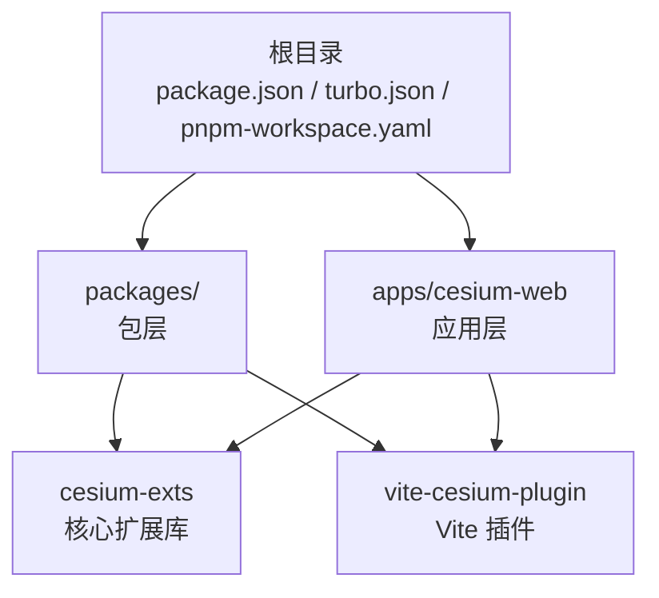
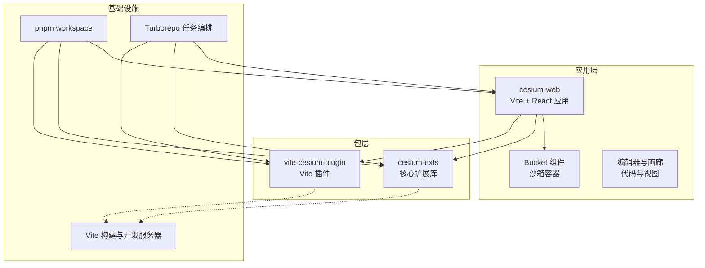
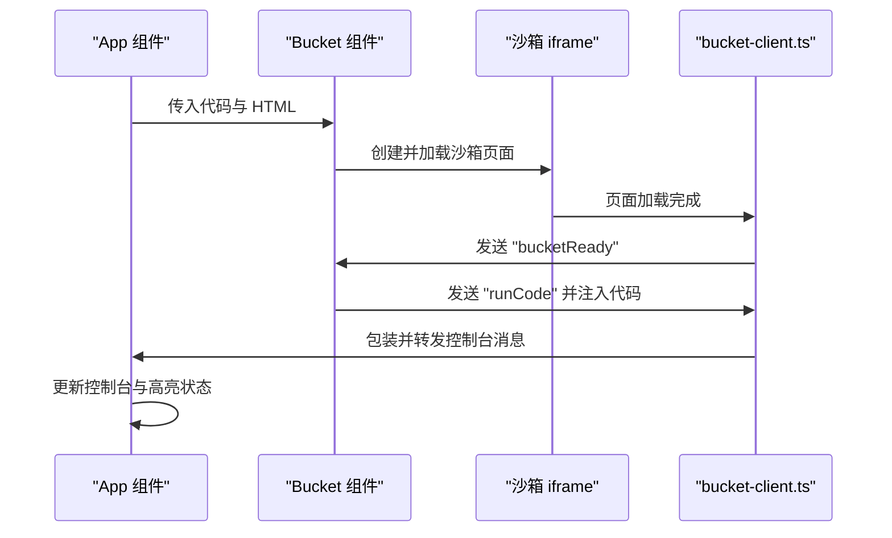
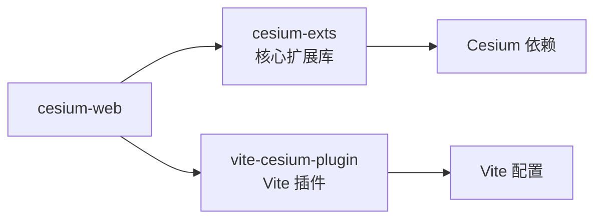
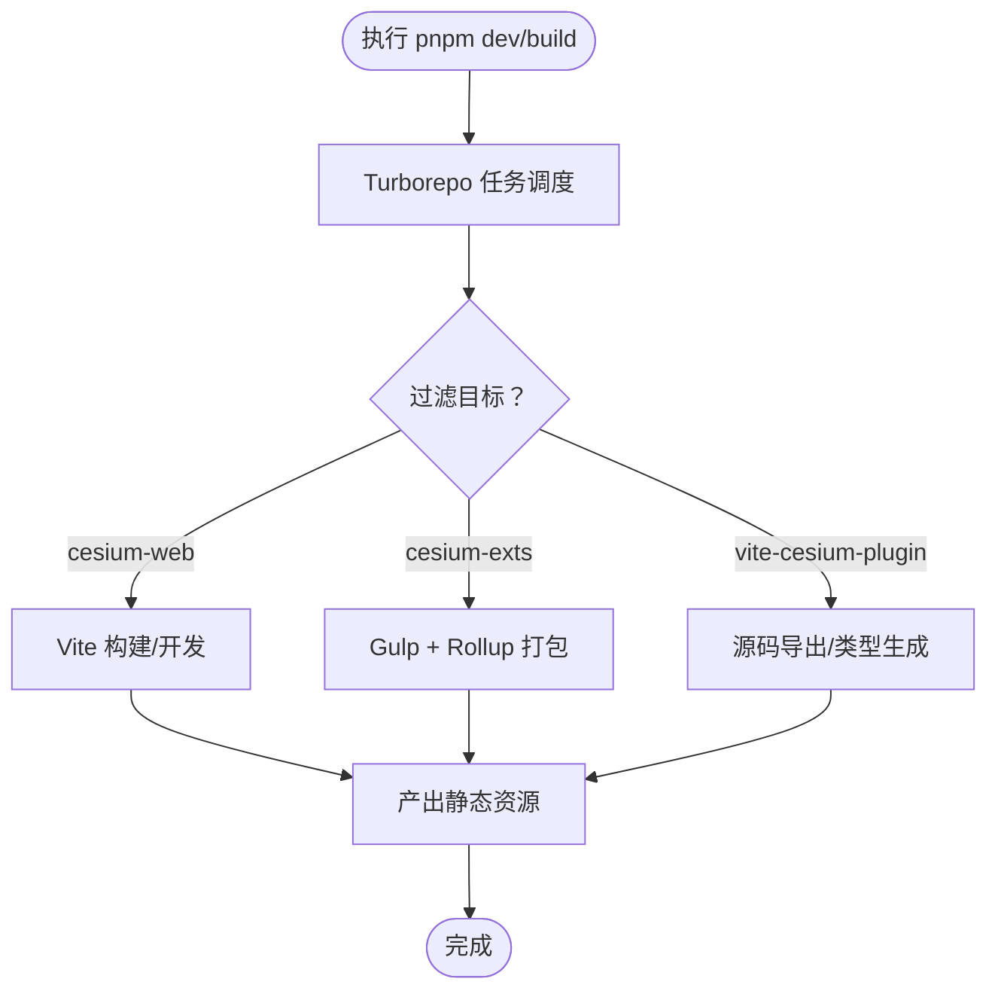
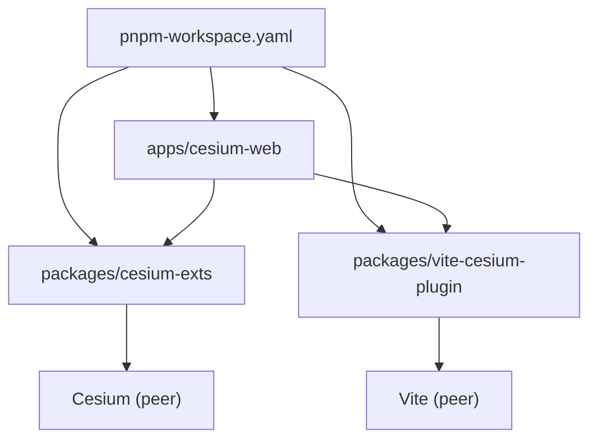

# 架构设计

<cite>
**本文引用的文件**
- [package.json](file://package.json)
- [pnpm-workspace.yaml](file://pnpm-workspace.yaml)
- [turbo.json](file://turbo.json)
- [README.md](file://README.md)
- [apps/cesium-web/package.json](file://apps/cesium-web/package.json)
- [apps/cesium-web/vite.config.ts](file://apps/cesium-web/vite.config.ts)
- [apps/cesium-web/src/main.tsx](file://apps/cesium-web/src/main.tsx)
- [apps/cesium-web/src/App.tsx](file://apps/cesium-web/src/App.tsx)
- [apps/cesium-web/src/plugins/index.ts](file://apps/cesium-web/src/plugins/index.ts)
- [apps/cesium-web/src/components/Bucket/Bucket.tsx](file://apps/cesium-web/src/components/Bucket/Bucket.tsx)
- [apps/cesium-web/src/util/bucket-client.ts](file://apps/cesium-web/src/util/bucket-client.ts)
- [apps/cesium-web/scripts/server.js](file://apps/cesium-web/scripts/server.js)
- [packages/cesium-exts/package.json](file://packages/cesium-exts/package.json)
- [packages/vite-cesium-plugin/package.json](file://packages/vite-cesium-plugin/package.json)
</cite>

## 目录

1. [引言](#引言)
2. [项目结构](#项目结构)
3. [核心组件](#核心组件)
4. [架构总览](#架构总览)
5. [详细组件分析](#详细组件分析)
6. [依赖分析](#依赖分析)
7. [性能考量](#性能考量)
8. [故障排查指南](#故障排查指南)
9. [结论](#结论)
10. [附录](#附录)

## 引言

本项目是一个基于 Cesium 的高性能扩展库集合，采用 Monorepo 架构，结合 pnpm workspace 与 Turborepo，实现多包协同开发与构建。应用层（apps/cesium-web）提供基于 Vite + React 的演示与开发环境；包层（packages/）包含核心扩展库（cesium-exts）与 Vite 插件（vite-cesium-plugin），前者提供可视化组件能力，后者优化 Cesium 在 Vite 中的集成体验。本文档从架构设计、组件交互、构建与部署策略等方面进行系统化阐述，帮助架构师与高级开发者快速理解并扩展该体系。

## 项目结构

项目采用 Monorepo 分层组织：

- 根目录：统一的包管理与流水线配置（pnpm workspace、Turborepo、根 package.json）
- apps/cesium-web：应用层，包含前端工程、构建配置、开发脚本与演示示例
- packages/：包层，包含核心扩展库与辅助插件
- scripts/：根级脚本与校验钩子（如 husky）

图表来源

- [package.json:1-35](file://package.json#L1-L35)
- [pnpm-workspace.yaml:1-12](file://pnpm-workspace.yaml#L1-L12)
- [turbo.json:1-16](file://turbo.json#L1-L16)

章节来源

- [package.json:1-35](file://package.json#L1-L35)
- [pnpm-workspace.yaml:1-12](file://pnpm-workspace.yaml#L1-L12)
- [turbo.json:1-16](file://turbo.json#L1-L16)

## 核心组件

- 应用层（apps/cesium-web）
  - 基于 Vite + React 的开发环境，集成 TailwindCSS、SWC、Monaco 编辑器等生态
  - 提供沙箱运行与可视化演示能力，通过 Bucket 组件与 iframe 隔离环境通信
  - 通过 vite-cesium-plugin 优化 Cesium 资源加载与全局变量映射
- 包层（packages/）
  - cesium-exts：核心扩展库，提供热力图、风场等可视化组件与工具函数
  - vite-cesium-plugin：Vite 插件，解决 Cesium 在 Vite 环境中的打包与运行问题
- 根配置
  - pnpm workspace：统一管理工作区与依赖版本
  - Turborepo：统一构建、缓存与任务编排

章节来源

- [apps/cesium-web/package.json:1-51](file://apps/cesium-web/package.json#L1-L51)
- [packages/cesium-exts/package.json:1-48](file://packages/cesium-exts/package.json#L1-L48)
- [packages/vite-cesium-plugin/package.json:1-40](file://packages/vite-cesium-plugin/package.json#L1-L40)
- [package.json:1-35](file://package.json#L1-L35)

## 架构总览

整体架构围绕“应用层 + 包层”的职责分离展开，应用层负责交互与演示，包层负责能力沉淀与复用。通过 Vite 插件与沙箱机制，实现安全隔离与高效运行。

图表来源

- [apps/cesium-web/vite.config.ts:1-81](file://apps/cesium-web/vite.config.ts#L1-L81)
- [apps/cesium-web/src/App.tsx:1-149](file://apps/cesium-web/src/App.tsx#L1-L149)
- [apps/cesium-web/src/components/Bucket/Bucket.tsx:1-135](file://apps/cesium-web/src/components/Bucket/Bucket.tsx#L1-L135)
- [packages/vite-cesium-plugin/package.json:1-40](file://packages/vite-cesium-plugin/package.json#L1-L40)
- [packages/cesium-exts/package.json:1-48](file://packages/cesium-exts/package.json#L1-L48)
- [package.json:1-35](file://package.json#L1-L35)

## 详细组件分析

### 应用层（apps/cesium-web）

- 入口与主题
  - main.tsx 负责初始化主题上下文、安装插件并挂载应用
  - App.tsx 作为根组件，组织侧边栏、编辑器/画廊视图、主视图与控制台
- 沙箱与通信
  - Bucket 组件通过 iframe 加载沙箱页面，使用 IframeBridge 实现双向消息通信
  - bucket-client.ts 在沙箱页面初始化，建立与外部应用的桥接，处理控制台包装与代码注入
- 构建与开发
  - vite.config.ts 配置 React、TailwindCSS、Cesium 插件与输出策略
  - scripts/server.js 提供自定义开发服务器入口（当前为空实现，便于扩展）

图表来源

- [apps/cesium-web/src/App.tsx:1-149](file://apps/cesium-web/src/App.tsx#L1-L149)
- [apps/cesium-web/src/components/Bucket/Bucket.tsx:1-135](file://apps/cesium-web/src/components/Bucket/Bucket.tsx#L1-L135)
- [apps/cesium-web/src/util/bucket-client.ts:1-87](file://apps/cesium-web/src/util/bucket-client.ts#L1-L87)

章节来源

- [apps/cesium-web/src/main.tsx:1-19](file://apps/cesium-web/src/main.tsx#L1-L19)
- [apps/cesium-web/src/App.tsx:1-149](file://apps/cesium-web/src/App.tsx#L1-L149)
- [apps/cesium-web/src/components/Bucket/Bucket.tsx:1-135](file://apps/cesium-web/src/components/Bucket/Bucket.tsx#L1-L135)
- [apps/cesium-web/src/util/bucket-client.ts:1-87](file://apps/cesium-web/src/util/bucket-client.ts#L1-L87)
- [apps/cesium-web/vite.config.ts:1-81](file://apps/cesium-web/vite.config.ts#L1-L81)
- [apps/cesium-web/scripts/server.js:1-4](file://apps/cesium-web/scripts/server.js#L1-L4)

### 包层（packages/）

- cesium-exts
  - 作为核心扩展库，提供可视化组件与工具函数，面向下游应用提供易用 API
  - 通过 peerDependencies 与 Cesium 版本解耦，避免重复打包
- vite-cesium-plugin
  - 作为 Vite 插件，负责将 Cesium 资源以全局变量形式注入，减少打包体积与运行时开销
  - 与 Vite 配置配合，提升开发体验与构建效率

图表来源

- [packages/cesium-exts/package.json:1-48](file://packages/cesium-exts/package.json#L1-L48)
- [packages/vite-cesium-plugin/package.json:1-40](file://packages/vite-cesium-plugin/package.json#L1-L40)
- [apps/cesium-web/package.json:1-51](file://apps/cesium-web/package.json#L1-L51)

章节来源

- [packages/cesium-exts/package.json:1-48](file://packages/cesium-exts/package.json#L1-L48)
- [packages/vite-cesium-plugin/package.json:1-40](file://packages/vite-cesium-plugin/package.json#L1-L40)
- [apps/cesium-web/package.json:1-51](file://apps/cesium-web/package.json#L1-L51)

### 构建系统与开发环境

- 任务编排
  - 根 package.json 通过脚本统一调用 Turborepo，实现跨包的 dev/build/lint/format
  - turbo.json 定义 build/lint/dev 任务的输入、输出与缓存策略
- 应用构建
  - vite.config.ts 配置 Terser 压缩、Rollup 输出命名与静态资源分类
  - 通过插件链路集成 React、TailwindCSS 与 Cesium 插件
- 包构建
  - cesium-exts 通过 gulp + rollup 的组合进行多格式打包与类型声明生成
  - vite-cesium-plugin 以源码导出为主，面向 Vite 生态使用

图表来源

- [package.json:1-35](file://package.json#L1-L35)
- [turbo.json:1-16](file://turbo.json#L1-L16)
- [apps/cesium-web/vite.config.ts:1-81](file://apps/cesium-web/vite.config.ts#L1-L81)
- [packages/cesium-exts/package.json:1-48](file://packages/cesium-exts/package.json#L1-L48)
- [packages/vite-cesium-plugin/package.json:1-40](file://packages/vite-cesium-plugin/package.json#L1-L40)

章节来源

- [package.json:1-35](file://package.json#L1-L35)
- [turbo.json:1-16](file://turbo.json#L1-L16)
- [apps/cesium-web/vite.config.ts:1-81](file://apps/cesium-web/vite.config.ts#L1-L81)
- [packages/cesium-exts/package.json:1-48](file://packages/cesium-exts/package.json#L1-L48)
- [packages/vite-cesium-plugin/package.json:1-40](file://packages/vite-cesium-plugin/package.json#L1-L40)

## 依赖分析

- 工作区与版本管理
  - pnpm-workspace.yaml 将 apps/_ 与 packages/_ 纳入工作区，catalog 字段集中管理版本
  - 通过 catalog: 语法在包内引用统一版本，降低版本漂移风险
- 包间依赖
  - cesium-web 依赖 cesium-exts 与 vite-cesium-plugin，形成“应用消费扩展库与插件”的依赖闭环
  - cesium-exts 以 peerDependencies 形式声明对 Cesium 的依赖，避免重复打包
- 任务依赖
  - turbo.json 的 dependsOn 指定构建顺序，确保上游包先于下游包构建

图表来源

- [pnpm-workspace.yaml:1-12](file://pnpm-workspace.yaml#L1-L12)
- [apps/cesium-web/package.json:1-51](file://apps/cesium-web/package.json#L1-L51)
- [packages/cesium-exts/package.json:1-48](file://packages/cesium-exts/package.json#L1-L48)
- [packages/vite-cesium-plugin/package.json:1-40](file://packages/vite-cesium-plugin/package.json#L1-L40)

章节来源

- [pnpm-workspace.yaml:1-12](file://pnpm-workspace.yaml#L1-L12)
- [apps/cesium-web/package.json:1-51](file://apps/cesium-web/package.json#L1-L51)
- [packages/cesium-exts/package.json:1-48](file://packages/cesium-exts/package.json#L1-L48)
- [packages/vite-cesium-plugin/package.json:1-40](file://packages/vite-cesium-plugin/package.json#L1-L40)

## 性能考量

- 构建优化
  - Vite 开发服务器启用热更新与按需加载，减少冷启动时间
  - 生产构建启用 Terser 压缩与 Rollup 输出命名策略，降低包体与提升缓存命中率
- 运行时隔离
  - 沙箱 iframe 限制脚本与资源访问范围，避免代码冲突与安全风险
  - 控制台包装与消息桥接，减少主线程阻塞与异常扩散
- 依赖解耦
  - 通过 peerDependencies 与插件机制，避免重复打包与版本冲突

## 故障排查指南

- 开发服务器无法启动
  - 检查根脚本与 Turborepo 配置，确认 dev 任务可用
  - 若自定义 server.js 未生效，确认脚本路径与执行权限
- 沙箱代码不执行或报错
  - 确认 Bucket 组件已发送 "bucketReady" 消息并进入 ready 状态
  - 检查 IframeBridge 的消息通道与 bucket-client.ts 的初始化流程
- Cesium 资源加载失败
  - 确认 vite-cesium-plugin 已正确注入全局变量与静态资源路径
  - 检查 Vite 配置中的别名与插件顺序

章节来源

- [package.json:1-35](file://package.json#L1-L35)
- [apps/cesium-web/scripts/server.js:1-4](file://apps/cesium-web/scripts/server.js#L1-L4)
- [apps/cesium-web/src/components/Bucket/Bucket.tsx:1-135](file://apps/cesium-web/src/components/Bucket/Bucket.tsx#L1-L135)
- [apps/cesium-web/src/util/bucket-client.ts:1-87](file://apps/cesium-web/src/util/bucket-client.ts#L1-L87)
- [apps/cesium-web/vite.config.ts:1-81](file://apps/cesium-web/vite.config.ts#L1-L81)
- [packages/vite-cesium-plugin/package.json:1-40](file://packages/vite-cesium-plugin/package.json#L1-L40)

## 结论

本项目通过 Monorepo 架构实现了应用层与包层的清晰边界与高效协作。借助 pnpm workspace 与 Turborepo，统一了版本管理与任务编排；通过 Vite 插件与沙箱机制，兼顾了开发体验与运行时安全。核心扩展库与插件的模块化设计，为后续功能扩展与生态建设提供了稳定基础。

## 附录

- 技术选型与权衡
  - Vite：快速开发与构建，生态完善，适合前端工程化
  - React：组件化与状态管理成熟，利于复杂 UI 组织
  - Cesium：3D 地理可视化事实标准，需通过插件优化集成体验
  - Turborepo：跨包任务编排与缓存加速，提升整体效率
  - pnpm：去重与硬链接提升安装与存储效率，配合 catalog 管理版本
- 建议
  - 逐步完善包层的单元测试与类型覆盖
  - 在应用层增加端到端测试与性能监控
  - 持续评估与升级依赖版本，保持与 Cesium 生态同步
