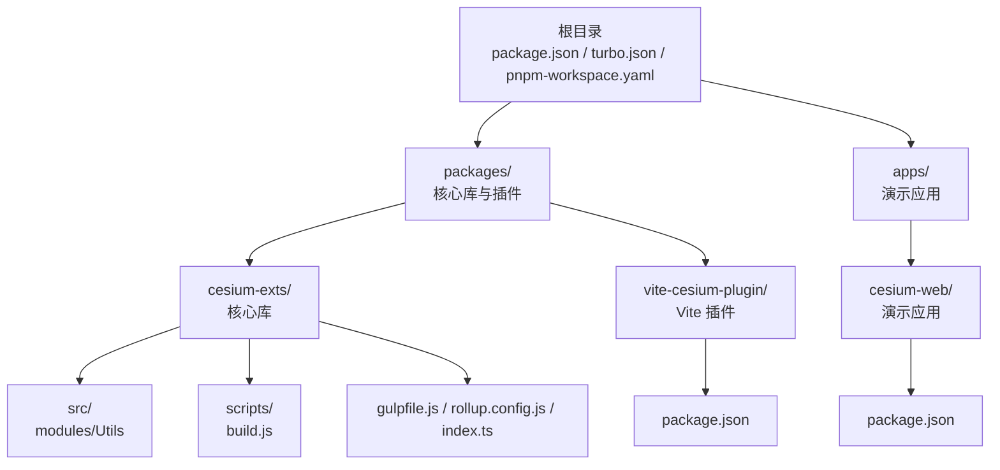
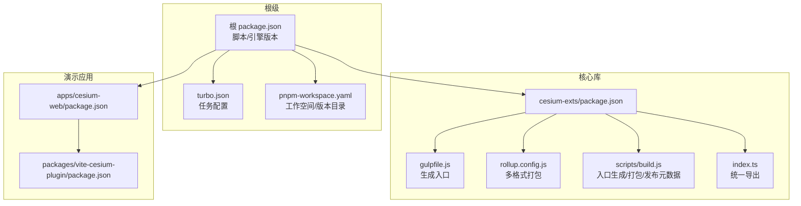
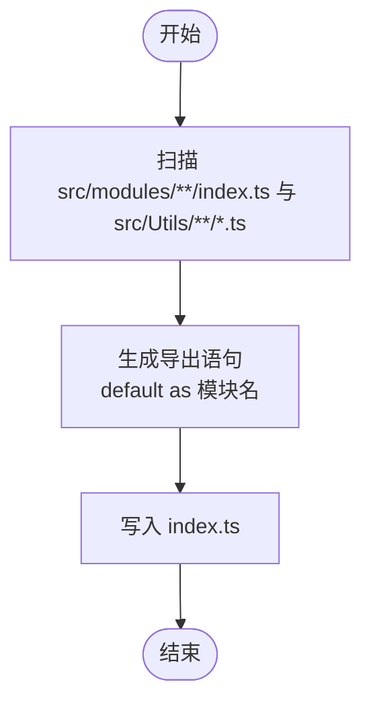
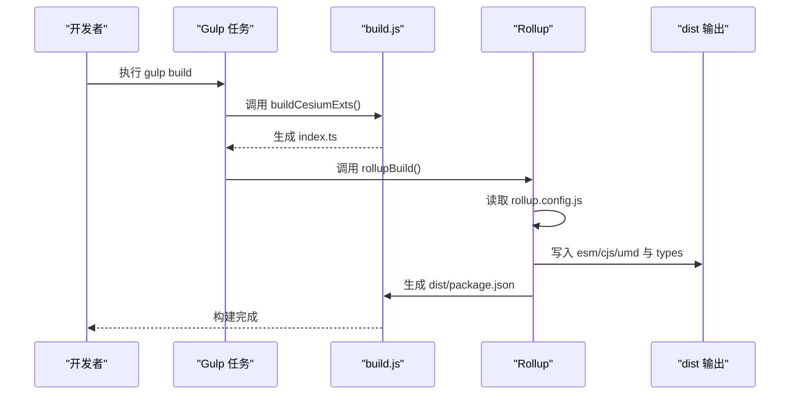
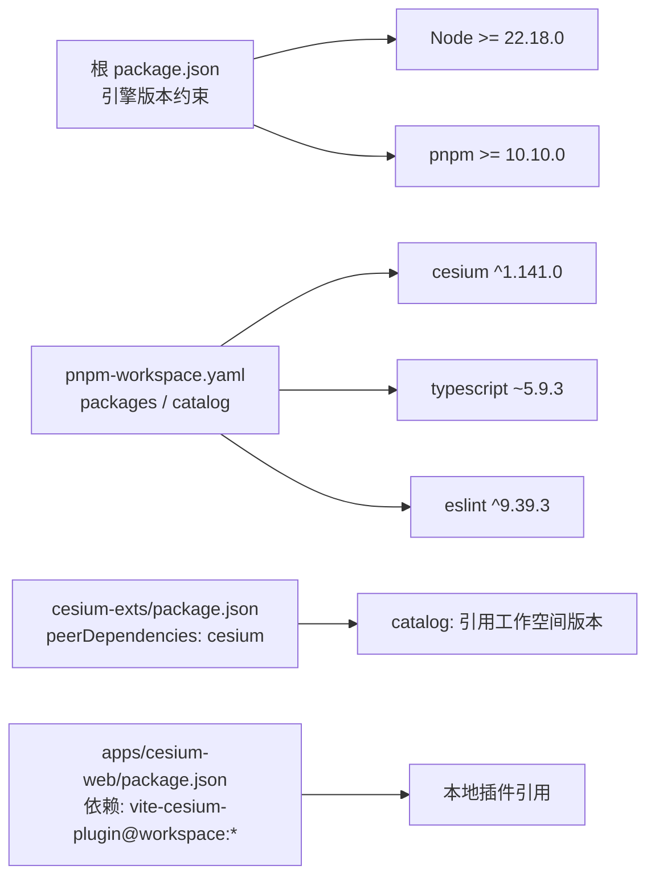
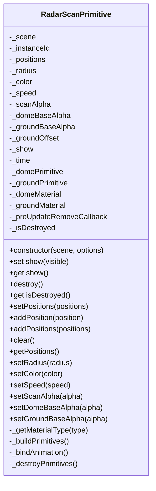
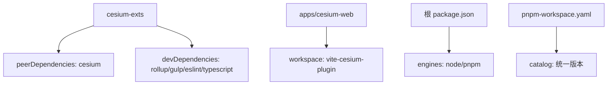

# cesium-exts 包结构

<cite>
**本文档引用的文件**
- [packages/cesium-exts/package.json](file://packages/cesium-exts/package.json)
- [packages/cesium-exts/index.ts](file://packages/cesium-exts/index.ts)
- [packages/cesium-exts/gulpfile.js](file://packages/cesium-exts/gulpfile.js)
- [packages/cesium-exts/rollup.config.js](file://packages/cesium-exts/rollup.config.js)
- [packages/cesium-exts/scripts/build.js](file://packages/cesium-exts/scripts/build.js)
- [packages/cesium-exts/src/Utils/cesiumUtils.ts](file://packages/cesium-exts/src/Utils/cesiumUtils.ts)
- [packages/cesium-exts/src/modules/HeatLayer/index.ts](file://packages/cesium-exts/src/modules/HeatLayer/index.ts)
- [packages/cesium-exts/src/modules/WindLayer/index.ts](file://packages/cesium-exts/src/modules/WindLayer/index.ts)
- [packages/cesium-exts/src/modules/Radar/index.ts](file://packages/cesium-exts/src/modules/Radar/index.ts)
- [packages/vite-cesium-plugin/package.json](file://packages/vite-cesium-plugin/package.json)
- [apps/cesium-web/package.json](file://apps/cesium-web/package.json)
- [package.json](file://package.json)
- [pnpm-workspace.yaml](file://pnpm-workspace.yaml)
- [turbo.json](file://turbo.json)
- [README.md](file://README.md)
</cite>

## 目录

1. [简介](#简介)
2. [项目结构](#项目结构)
3. [核心组件](#核心组件)
4. [架构总览](#架构总览)
5. [详细组件分析](#详细组件分析)
6. [依赖分析](#依赖分析)
7. [性能考虑](#性能考虑)
8. [故障排除指南](#故障排除指南)
9. [结论](#结论)
10. [附录](#附录)

## 简介

本文件系统性梳理 cesium-exts 包的目录组织、依赖管理与导出配置，阐述版本管理策略、发布流程与兼容性保障，总结模块化设计原则与命名约定，并提供安装使用方法与版本升级注意事项。该仓库采用 Monorepo 架构，使用 pnpm workspace 与 Turborepo 管理多包依赖与构建，核心库 cesium-exts 提供热力图、风场、雷达扫描等可视化组件，并通过 Gulp + Rollup 实现多格式构建与类型声明生成。

## 项目结构

仓库采用 Monorepo 结构，顶层通过 package.json 管理脚本与引擎版本约束，pnpm-workspace.yaml 定义工作空间与 catalog 版本目录，turbo.json 配置构建缓存与任务依赖。核心库位于 packages/cesium-exts，配套 Vite 插件位于 packages/vite-cesium-plugin，演示应用位于 apps/cesium-web。

图表来源

- [package.json:1-35](file://package.json#L1-L35)
- [pnpm-workspace.yaml:1-12](file://pnpm-workspace.yaml#L1-L12)
- [turbo.json:1-16](file://turbo.json#L1-L16)

章节来源

- [package.json:1-35](file://package.json#L1-L35)
- [pnpm-workspace.yaml:1-12](file://pnpm-workspace.yaml#L1-L12)
- [turbo.json:1-16](file://turbo.json#L1-L16)

## 核心组件

- 包元数据与导出
  - 包名与版本：cesium-exts@1.0.0
  - 类型：ES Module
  - 入口与导出：index.ts 统一导出工具与模块；dist/package.json 提供 ESM/CJS 导出映射
  - 关键字段：files、scripts、peerDependencies、devDependencies
- 构建与打包
  - Gulp 任务：先生成入口文件，再 Rollup 打包
  - Rollup 配置：ESM/CJS/UMD 三格式输出，生成类型声明
  - 外部依赖：cesium 通过 peerDependencies 交由使用者提供
- 模块与工具
  - Utils：cesium 版本查询、相机平滑飞行等工具函数
  - modules：HeatLayer、WindLayer、Radar 等可视化组件
  - 入口聚合：index.ts 导出各模块与工具

章节来源

- [packages/cesium-exts/package.json:1-48](file://packages/cesium-exts/package.json#L1-L48)
- [packages/cesium-exts/index.ts:1-4](file://packages/cesium-exts/index.ts#L1-L4)
- [packages/cesium-exts/gulpfile.js:1-16](file://packages/cesium-exts/gulpfile.js#L1-L16)
- [packages/cesium-exts/rollup.config.js:1-123](file://packages/cesium-exts/rollup.config.js#L1-L123)
- [packages/cesium-exts/scripts/build.js:1-187](file://packages/cesium-exts/scripts/build.js#L1-L187)

## 架构总览

整体架构围绕“Monorepo + 多包 + 多格式构建”的设计展开。根级脚本统一调度，核心库通过 Gulp + Rollup 生成多格式产物与类型声明，演示应用通过 Vite 插件与核心库协同开发。

图表来源

- [package.json:1-35](file://package.json#L1-L35)
- [turbo.json:1-16](file://turbo.json#L1-L16)
- [pnpm-workspace.yaml:1-12](file://pnpm-workspace.yaml#L1-L12)
- [packages/cesium-exts/package.json:1-48](file://packages/cesium-exts/package.json#L1-L48)
- [packages/cesium-exts/gulpfile.js:1-16](file://packages/cesium-exts/gulpfile.js#L1-L16)
- [packages/cesium-exts/rollup.config.js:1-123](file://packages/cesium-exts/rollup.config.js#L1-L123)
- [packages/cesium-exts/scripts/build.js:1-187](file://packages/cesium-exts/scripts/build.js#L1-L187)
- [apps/cesium-web/package.json:1-51](file://apps/cesium-web/package.json#L1-L51)
- [packages/vite-cesium-plugin/package.json:1-40](file://packages/vite-cesium-plugin/package.json#L1-L40)

## 详细组件分析

### 入口与导出聚合（index.ts）

- 职责：集中导出工具与模块，便于用户按需引入
- 约定：每个模块的 index.ts 作为默认导出入口，入口文件由构建脚本自动生成并覆盖

图表来源

- [packages/cesium-exts/scripts/build.js:73-133](file://packages/cesium-exts/scripts/build.js#L73-L133)
- [packages/cesium-exts/index.ts:1-4](file://packages/cesium-exts/index.ts#L1-L4)

章节来源

- [packages/cesium-exts/index.ts:1-4](file://packages/cesium-exts/index.ts#L1-L4)
- [packages/cesium-exts/scripts/build.js:73-133](file://packages/cesium-exts/scripts/build.js#L73-L133)

### 构建流水线（Gulp + Rollup）

- Gulp 任务链：先生成入口文件，再调用 Rollup 打包
- Rollup 配置：ESM/CJS/UMD 三格式输出，外部依赖仅保留 cesium 与 peerDependencies
- 类型声明：使用 rollup-plugin-dts 生成 types/index.d.ts
- 发布元数据：生成 dist/package.json，限定导出字段与文件列表

图表来源

- [packages/cesium-exts/gulpfile.js:1-16](file://packages/cesium-exts/gulpfile.js#L1-L16)
- [packages/cesium-exts/scripts/build.js:35-63](file://packages/cesium-exts/scripts/build.js#L35-L63)
- [packages/cesium-exts/rollup.config.js:1-123](file://packages/cesium-exts/rollup.config.js#L1-L123)

章节来源

- [packages/cesium-exts/gulpfile.js:1-16](file://packages/cesium-exts/gulpfile.js#L1-L16)
- [packages/cesium-exts/scripts/build.js:35-63](file://packages/cesium-exts/scripts/build.js#L35-L63)
- [packages/cesium-exts/rollup.config.js:1-123](file://packages/cesium-exts/rollup.config.js#L1-L123)

### 依赖管理与版本策略

- 工作空间与版本目录：pnpm-workspace.yaml 定义 packages 与 catalog，统一管理版本
- 根级引擎约束：package.json 指定 Node/npm/pnpm 最低版本
- 核心库依赖：
  - peerDependencies：cesium 通过 catalog: 引用工作空间版本
  - devDependencies：构建与类型相关工具通过 catalog: 统一版本
- 演示应用依赖：通过 workspace:\* 引用本地 vite-cesium-plugin

图表来源

- [package.json:28-34](file://package.json#L28-L34)
- [pnpm-workspace.yaml:1-12](file://pnpm-workspace.yaml#L1-L12)
- [packages/cesium-exts/package.json:27-46](file://packages/cesium-exts/package.json#L27-L46)
- [apps/cesium-web/package.json:28](file://apps/cesium-web/package.json#L28)

章节来源

- [package.json:28-34](file://package.json#L28-L34)
- [pnpm-workspace.yaml:1-12](file://pnpm-workspace.yaml#L1-L12)
- [packages/cesium-exts/package.json:27-46](file://packages/cesium-exts/package.json#L27-L46)
- [apps/cesium-web/package.json:28](file://apps/cesium-web/package.json#L28)

### 模块化设计与命名约定

- 目录结构
  - src/modules/<模块>/index.ts：模块默认导出入口
  - src/Utils：通用工具函数，统一导出
- 命名约定
  - 模块导出名：基于目录名或文件名推导，特殊字符替换为下划线
  - 着色器文件：自动添加 \_shaders 前缀
- 入口聚合：index.ts 通过构建脚本自动生成，保持导出一致性

章节来源

- [packages/cesium-exts/scripts/build.js:73-133](file://packages/cesium-exts/scripts/build.js#L73-L133)
- [packages/cesium-exts/index.ts:1-4](file://packages/cesium-exts/index.ts#L1-L4)

### 工具模块：cesiumUtils

- 功能要点
  - 查询当前 Cesium 版本与 cesium-exts 版本
  - 相机平滑飞行到目标包围球（基于 flyToBoundingSphere）
- 设计原则
  - 通过 Cesium.globalThis 读取版本信息
  - 参数化配置，提供默认值与类型约束

章节来源

- [packages/cesium-exts/src/Utils/cesiumUtils.ts:1-106](file://packages/cesium-exts/src/Utils/cesiumUtils.ts#L1-L106)

### 可视化模块：HeatLayer

- 功能要点
  - 基于 h337 的热力图渲染
  - 支持构造函数初始化与后续数据添加
- 设计原则
  - 以类封装内部状态与行为
  - 通过外部依赖提供渲染能力

章节来源

- [packages/cesium-exts/src/modules/HeatLayer/index.ts:1-13](file://packages/cesium-exts/src/modules/HeatLayer/index.ts#L1-L13)

### 可视化模块：WindLayer

- 功能要点
  - 风场可视化组件（当前实现为占位）
- 设计原则
  - 保持与 HeatLayer 一致的类结构与导出方式

章节来源

- [packages/cesium-exts/src/modules/WindLayer/index.ts:1-10](file://packages/cesium-exts/src/modules/WindLayer/index.ts#L1-L10)

### 可视化模块：Radar（雷达扫描）

- 功能要点
  - 基于 GeometryInstance 合批与自定义 Shader 的高性能雷达扫描
  - 支持多实例、可配置颜色、半径、速度、透明度等参数
  - 生命周期管理：显示/隐藏、销毁、清空数据
- 设计原则
  - 使用 MaterialAppearance 注入自定义 GLSL 着色器
  - 通过 preUpdate 事件驱动时间变量，实现 GPU 级动画
  - 提供完善的 getter/setter 与类型约束

图表来源

- [packages/cesium-exts/src/modules/Radar/index.ts:45-439](file://packages/cesium-exts/src/modules/Radar/index.ts#L45-L439)

章节来源

- [packages/cesium-exts/src/modules/Radar/index.ts:45-439](file://packages/cesium-exts/src/modules/Radar/index.ts#L45-L439)

### 发布流程与兼容性

- 发布产物
  - ESM/CJS/UMD 三种格式
  - types/index.d.ts 类型声明
  - dist/package.json：限定导出字段与文件列表
- 兼容性
  - 通过 peerDependencies 与 catalog: 统一 Cesium 版本
  - 根级 engines 约束 Node/pnpm 版本
- 版本管理
  - 核心库版本：1.0.0
  - 工作空间版本：cesium@^1.141.0、typescript@~5.9.3 等

章节来源

- [packages/cesium-exts/rollup.config.js:58-94](file://packages/cesium-exts/rollup.config.js#L58-L94)
- [packages/cesium-exts/scripts/build.js:158-186](file://packages/cesium-exts/scripts/build.js#L158-L186)
- [packages/cesium-exts/package.json:27-46](file://packages/cesium-exts/package.json#L27-L46)
- [package.json:28-34](file://package.json#L28-L34)
- [pnpm-workspace.yaml:4-11](file://pnpm-workspace.yaml#L4-L11)

## 依赖分析

- 直接依赖关系
  - 核心库依赖 Cesium（peerDependencies），构建工具链通过 devDependencies 管理
  - 演示应用通过 workspace:\* 依赖本地 vite-cesium-plugin
- 外部耦合
  - Cesium 通过 catalog: 与工作空间版本对齐，避免版本漂移
  - Turborepo 与 pnpm 协同，提升构建缓存与依赖解析效率

图表来源

- [packages/cesium-exts/package.json:27-46](file://packages/cesium-exts/package.json#L27-L46)
- [apps/cesium-web/package.json:28](file://apps/cesium-web/package.json#L28)
- [package.json:28-34](file://package.json#L28-L34)
- [pnpm-workspace.yaml:4-11](file://pnpm-workspace.yaml#L4-L11)

章节来源

- [packages/cesium-exts/package.json:27-46](file://packages/cesium-exts/package.json#L27-L46)
- [apps/cesium-web/package.json:28](file://apps/cesium-web/package.json#L28)
- [package.json:28-34](file://package.json#L28-L34)
- [pnpm-workspace.yaml:4-11](file://pnpm-workspace.yaml#L4-L11)

## 性能考虑

- 渲染优化
  - Radar 使用 GeometryInstance 合批与自定义 Shader，降低绘制批次与提升 GPU 利用率
  - 通过 preUpdate 事件驱动时间变量，避免 JS 层动画开销
- 构建优化
  - Rollup 启用 terser 压缩与混淆，移除 console 与注释
  - 外部依赖仅保留 cesium，减少打包体积
- 运行时优化
  - 工具函数 flyToTarget 基于 flyToBoundingSphere，提供平滑相机动画
  - Radar 提供 setSpeed/setScanAlpha 等纯 GPU 级参数调整，即时生效

章节来源

- [packages/cesium-exts/rollup.config.js:25-53](file://packages/cesium-exts/rollup.config.js#L25-L53)
- [packages/cesium-exts/src/Utils/cesiumUtils.ts:71-103](file://packages/cesium-exts/src/Utils/cesiumUtils.ts#L71-L103)
- [packages/cesium-exts/src/modules/Radar/index.ts:254-263](file://packages/cesium-exts/src/modules/Radar/index.ts#L254-L263)

## 故障排除指南

- 构建失败
  - 检查 Node/pnpm 版本是否满足根级 engines 约束
  - 确认 Cesium 版本与工作空间 catalog 对齐
- 运行时错误
  - Cesium Viewer 为空：flyToTarget 会抛出异常，需确保传入有效实例
  - 雷达组件未显示：检查 show 属性与材质 uniform 更新
- 兼容性问题
  - 若出现 Cesium 版本不匹配，确认 peerDependencies 与 catalog 版本一致
  - 演示应用需通过 workspace:\* 引用本地插件，避免版本错配

章节来源

- [package.json:28-34](file://package.json#L28-L34)
- [pnpm-workspace.yaml:4-11](file://pnpm-workspace.yaml#L4-L11)
- [packages/cesium-exts/src/Utils/cesiumUtils.ts:84-86](file://packages/cesium-exts/src/Utils/cesiumUtils.ts#L84-L86)
- [packages/cesium-exts/src/modules/Radar/index.ts:288-292](file://packages/cesium-exts/src/modules/Radar/index.ts#L288-L292)

## 结论

cesium-exts 通过清晰的 Monorepo 结构、严格的版本目录与 peerDependencies 策略、以及 Gulp + Rollup 的多格式构建流程，实现了高质量的 Cesium 可视化组件库。模块化设计与命名约定保证了可维护性与可扩展性；工具函数与高性能渲染组件兼顾易用性与性能。遵循本文档的安装、构建与升级建议，可确保在不同环境中稳定运行。

## 附录

### 安装与使用

- 环境要求
  - Node >= 22.18.0，pnpm >= 10.10.0
  - Cesium >= 1.136.0（建议与工作空间版本对齐）
- 安装步骤
  - 克隆仓库并安装根依赖
  - 启动开发服务器或构建产物
- 使用示例
  - 从包中导入 HeatLayer、WindLayer、cesiumUtils
  - 在 Cesium Viewer 中创建与配置组件

章节来源

- [README.md:33-64](file://README.md#L33-L64)
- [README.md:66-88](file://README.md#L66-L88)

### 版本升级注意事项

- 升级 Cesium
  - 通过 pnpm-workspace.yaml 的 catalog 更新版本
  - 确保核心库与演示应用的 peerDependencies 与 devDependencies 保持一致
- 升级 TypeScript
  - 更新 typescript 与相关类型工具版本，确保类型声明兼容
- 发布前检查
  - 重新生成入口文件与类型声明
  - 校验 dist/package.json 的导出字段与文件列表

章节来源

- [pnpm-workspace.yaml:4-11](file://pnpm-workspace.yaml#L4-L11)
- [packages/cesium-exts/scripts/build.js:158-186](file://packages/cesium-exts/scripts/build.js#L158-L186)
- [packages/cesium-exts/rollup.config.js:100-115](file://packages/cesium-exts/rollup.config.js#L100-L115)

### 元数据与许可证

- 包元数据
  - 名称：cesium-exts
  - 版本：1.0.0
  - 关键词：cesium, engine, 3d
  - 许可证：ISC
- 许可证条款
  - 详见仓库 LICENSE 文件

章节来源

- [packages/cesium-exts/package.json:2-26](file://packages/cesium-exts/package.json#L2-L26)
- [README.md:159-161](file://README.md#L159-L161)

### 贡献指南

- 代码规范
  - 使用 ESLint + Prettier 统一风格
  - 提交前执行 lint 与 format
- 提交流程
  - 使用 Husky 与 lint-staged 自动化校验
  - 通过 Turborepo 统一构建与测试

章节来源

- [package.json:13-20](file://package.json#L13-L20)
- [package.json:5-11](file://package.json#L5-L11)
