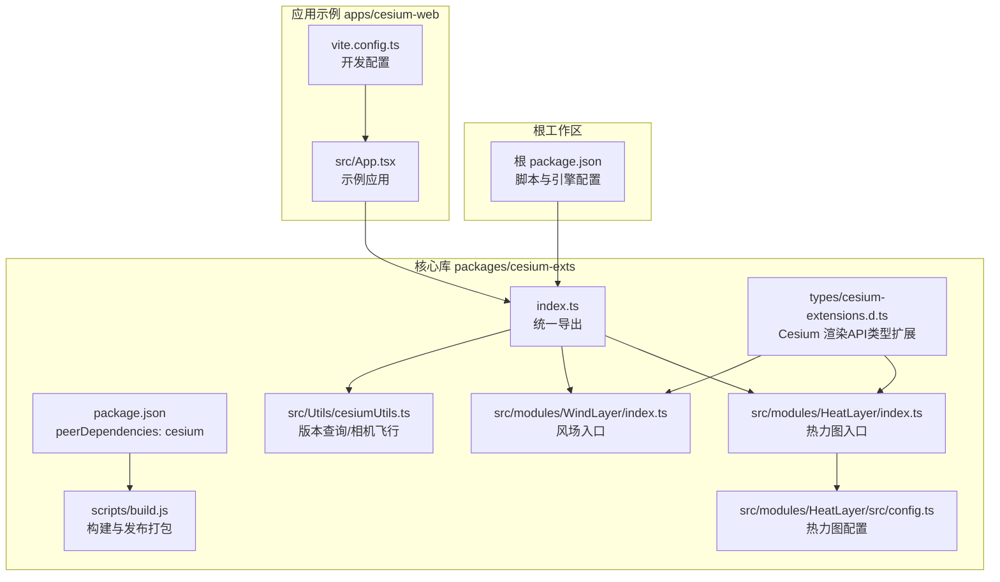
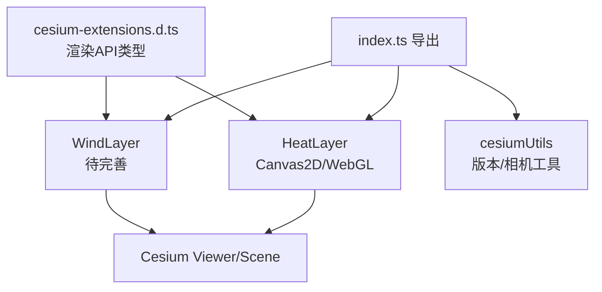
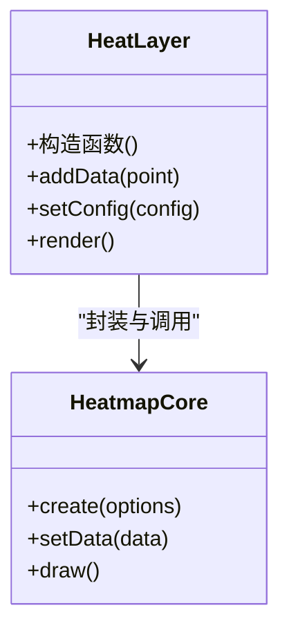
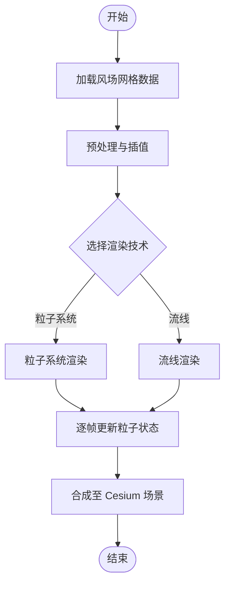
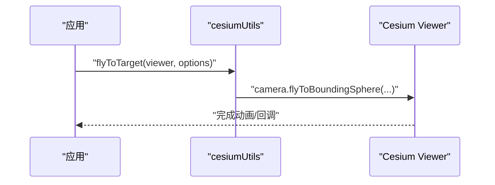
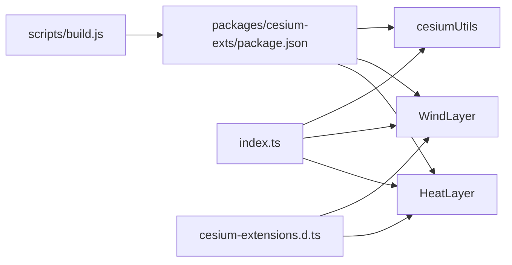

# 可视化模块

<cite>
**本文引用的文件**
- [packages/cesium-exts/index.ts](file://packages/cesium-exts/index.ts)
- [packages/cesium-exts/package.json](file://packages/cesium-exts/package.json)
- [packages/cesium-exts/README.md](file://packages/cesium-exts/README.md)
- [packages/cesium-exts/src/modules/HeatLayer/index.ts](file://packages/cesium-exts/src/modules/HeatLayer/index.ts)
- [packages/cesium-exts/src/modules/HeatLayer/src/config.ts](file://packages/cesium-exts/src/modules/HeatLayer/src/config.ts)
- [packages/cesium-exts/src/modules/WindLayer/index.ts](file://packages/cesium-exts/src/modules/WindLayer/index.ts)
- [packages/cesium-exts/src/Utils/cesiumUtils.ts](file://packages/cesium-exts/src/Utils/cesiumUtils.ts)
- [packages/cesium-exts/types/cesium-extensions.d.ts](file://packages/cesium-exts/types/cesium-extensions.d.ts)
- [packages/cesium-exts/scripts/build.js](file://packages/cesium-exts/scripts/build.js)
- [apps/cesium-web/README.md](file://apps/cesium-web/README.md)
- [apps/cesium-web/src/App.tsx](file://apps/cesium-web/src/App.tsx)
- [apps/cesium-web/vite.config.ts](file://apps/cesium-web/vite.config.ts)
- [package.json](file://package.json)
</cite>

## 目录

1. [引言](#引言)
2. [项目结构](#项目结构)
3. [核心组件](#核心组件)
4. [架构总览](#架构总览)
5. [详细组件分析](#详细组件分析)
6. [依赖分析](#依赖分析)
7. [性能考量](#性能考量)
8. [故障排查指南](#故障排查指南)
9. [结论](#结论)
10. [附录](#附录)

## 引言

本文件面向 cesium-exts 可视化模块的综合文档，聚焦热力图（HeatLayer）与风场（WindLayer）两大核心模块的设计理念、架构模式与实现要点，并结合工具函数（cesiumUtils）与类型扩展（cesium-extensions.d.ts），系统阐述模块间协作关系、数据流转机制、性能优化策略与内存管理实践。同时提供模块选择指南与典型使用场景分析，帮助读者在 Cesium 生态中高效落地地理空间可视化。

## 项目结构

- 仓库采用 Monorepo 架构，根目录通过 Turborepo + pnpm workspace 统一管理多包依赖与构建。
- 核心库位于 packages/cesium-exts，提供 HeatLayer、WindLayer、Radar（已导出但实现尚简）、cesiumUtils 等能力。
- 应用示例位于 apps/cesium-web，采用 Vite + React 提供交互式演示与编辑体验。
- 构建体系由 Gulp + Rollup 驱动，自动生成入口文件与多格式产物（ESM/CJS/UMD）。

**图表来源**

- [packages/cesium-exts/index.ts:1-4](file://packages/cesium-exts/index.ts#L1-L4)
- [packages/cesium-exts/package.json:1-47](file://packages/cesium-exts/package.json#L1-L47)
- [packages/cesium-exts/src/modules/HeatLayer/index.ts:1-13](file://packages/cesium-exts/src/modules/HeatLayer/index.ts#L1-L13)
- [packages/cesium-exts/src/modules/WindLayer/index.ts:1-9](file://packages/cesium-exts/src/modules/WindLayer/index.ts#L1-L9)
- [packages/cesium-exts/src/Utils/cesiumUtils.ts:1-106](file://packages/cesium-exts/src/Utils/cesiumUtils.ts#L1-L106)
- [packages/cesium-exts/types/cesium-extensions.d.ts:1-49](file://packages/cesium-exts/types/cesium-extensions.d.ts#L1-L49)
- [packages/cesium-exts/scripts/build.js:145-186](file://packages/cesium-exts/scripts/build.js#L145-L186)
- [apps/cesium-web/src/App.tsx](file://apps/cesium-web/src/App.tsx)
- [apps/cesium-web/vite.config.ts](file://apps/cesium-web/vite.config.ts)

**章节来源**

- [package.json:1-34](file://package.json#L1-L34)
- [packages/cesium-exts/README.md:1-30](file://packages/cesium-exts/README.md#L1-L30)
- [packages/cesium-exts/README.md:90-123](file://packages/cesium-exts/README.md#L90-L123)
- [packages/cesium-exts/package.json:1-47](file://packages/cesium-exts/package.json#L1-L47)

## 核心组件

- HeatLayer（热力图）
  - 设计理念：提供高性能热力图渲染，支持 Canvas2D 与 WebGL 双渲染模式，适配海量点数据的实时可视化。
  - 当前实现：入口文件已导出，内部通过第三方库 h337 初始化渲染器；配置文件提供参数化能力。
  - 关键接口路径：[packages/cesium-exts/src/modules/HeatLayer/index.ts:1-13](file://packages/cesium-exts/src/modules/HeatLayer/index.ts#L1-L13)，[packages/cesium-exts/src/modules/HeatLayer/src/config.ts](file://packages/cesium-exts/src/modules/HeatLayer/src/config.ts)
- WindLayer（风场）
  - 设计理念：风场可视化组件，强调流体场的动态表现与性能平衡。
  - 当前实现：入口文件已导出，具体渲染细节尚未展开；建议结合 Cesium Shader 与粒子系统实现。
  - 关键接口路径：[packages/cesium-exts/src/modules/WindLayer/index.ts:1-9](file://packages/cesium-exts/src/modules/WindLayer/index.ts#L1-L9)
- cesiumUtils（工具函数）
  - 提供 Cesium 版本查询、cesium-exts 版本查询、相机平滑飞行到目标点等实用工具。
  - 关键接口路径：[packages/cesium-exts/src/Utils/cesiumUtils.ts:1-106](file://packages/cesium-exts/src/Utils/cesiumUtils.ts#L1-L106)
- 类型扩展（cesium-extensions.d.ts）
  - 为 Cesium 底层渲染 API 提供 TypeScript 类型声明，覆盖着色器管理、缓冲区、纹理、渲染命令等。
  - 关键接口路径：[packages/cesium-exts/types/cesium-extensions.d.ts:1-49](file://packages/cesium-exts/types/cesium-extensions.d.ts#L1-L49)

**章节来源**

- [packages/cesium-exts/index.ts:1-4](file://packages/cesium-exts/index.ts#L1-L4)
- [packages/cesium-exts/src/modules/HeatLayer/index.ts:1-13](file://packages/cesium-exts/src/modules/HeatLayer/index.ts#L1-L13)
- [packages/cesium-exts/src/modules/HeatLayer/src/config.ts](file://packages/cesium-exts/src/modules/HeatLayer/src/config.ts)
- [packages/cesium-exts/src/modules/WindLayer/index.ts:1-9](file://packages/cesium-exts/src/modules/WindLayer/index.ts#L1-L9)
- [packages/cesium-exts/src/Utils/cesiumUtils.ts:1-106](file://packages/cesium-exts/src/Utils/cesiumUtils.ts#L1-L106)
- [packages/cesium-exts/types/cesium-extensions.d.ts:1-49](file://packages/cesium-exts/types/cesium-extensions.d.ts#L1-L49)

## 架构总览

- 统一入口：index.ts 将 HeatLayer、WindLayer、cesiumUtils 等模块集中导出，便于上层按需引入。
- 渲染管线：HeatLayer 基于 h337 的渲染器，WindLayer 待完善；两者均依托 Cesium 的 3D 场景与相机系统。
- 类型安全：通过 types/cesium-extensions.d.ts 为底层渲染 API 提供类型约束，降低集成风险。
- 构建与分发：scripts/build.js 生成 dist/package.json，确保 ESM/CJS/UMD 与 types 正确发布。

**图表来源**

- [packages/cesium-exts/index.ts:1-4](file://packages/cesium-exts/index.ts#L1-L4)
- [packages/cesium-exts/src/modules/HeatLayer/index.ts:1-13](file://packages/cesium-exts/src/modules/HeatLayer/index.ts#L1-L13)
- [packages/cesium-exts/src/modules/WindLayer/index.ts:1-9](file://packages/cesium-exts/src/modules/WindLayer/index.ts#L1-L9)
- [packages/cesium-exts/src/Utils/cesiumUtils.ts:1-106](file://packages/cesium-exts/src/Utils/cesiumUtils.ts#L1-L106)
- [packages/cesium-exts/types/cesium-extensions.d.ts:1-49](file://packages/cesium-exts/types/cesium-extensions.d.ts#L1-L49)

## 详细组件分析

### 热力图（HeatLayer）组件分析

- 设计理念
  - 面向海量点数据的热力图渲染，兼顾渲染性能与视觉效果。
  - 支持 Canvas2D 与 WebGL 双渲染模式，依据场景规模与设备能力动态选择。
- 实现要点
  - 入口类封装 h337 渲染器，初始化时传入基础配置对象。
  - 配置文件提供参数化入口，便于外部调参（如渐变、半径、模糊度等）。
- 数据流与渲染策略
  - 数据输入：addData 接口接收经纬度与强度值。
  - 渲染阶段：将地理坐标转换为屏幕空间，叠加高斯核，合成热力图纹理。
  - 输出：叠加至 Cesium 场景，随相机移动与缩放同步更新。
- 性能与内存
  - 通过核半径与模糊度控制采样密度与混合开销。
  - 建议对数据进行降采样或分块渲染，避免超大数据集导致的卡顿。

**图表来源**

- [packages/cesium-exts/src/modules/HeatLayer/index.ts:1-13](file://packages/cesium-exts/src/modules/HeatLayer/index.ts#L1-L13)
- [packages/cesium-exts/src/modules/HeatLayer/src/config.ts](file://packages/cesium-exts/src/modules/HeatLayer/src/config.ts)

**章节来源**

- [packages/cesium-exts/src/modules/HeatLayer/index.ts:1-13](file://packages/cesium-exts/src/modules/HeatLayer/index.ts#L1-L13)
- [packages/cesium-exts/src/modules/HeatLayer/src/config.ts](file://packages/cesium-exts/src/modules/HeatLayer/src/config.ts)

### 风场（WindLayer）组件分析

- 设计理念
  - 风场可视化强调动态与连续性，适合展示风向、风速的时空变化。
- 实现现状
  - 入口类已导出，具体渲染逻辑尚未实现；建议采用粒子系统或流线技术。
- 推荐方案
  - 粒子系统：基于 Cesium 的 ParticleSystem，使用自定义 GLSL 着色器驱动粒子运动。
  - 流线技术：预计算速度场，使用 Instanced Rendering 批量绘制流线几何。
- 数据与渲染
  - 输入：风场网格数据（经度、纬度、高度、U/V 分量）。
  - 渲染：根据时间步进更新粒子位置或流线顶点，结合透明度与颜色映射增强层次感。

[此图为概念性流程示意，不直接对应具体源码文件，故无图表来源]

**章节来源**

- [packages/cesium-exts/src/modules/WindLayer/index.ts:1-9](file://packages/cesium-exts/src/modules/WindLayer/index.ts#L1-L9)

### 工具函数（cesiumUtils）分析

- 能力概览
  - 版本查询：获取 Cesium 与 cesium-exts 的版本信息，便于诊断与兼容性判断。
  - 相机飞行：基于包围球计算，平滑飞到目标区域，支持航向、俯仰、距离与动画时长配置。
- 使用建议
  - 在切换场景或首次加载时调用相机飞行，提升用户体验。
  - 结合热力图/风场的初始视角，确保数据可见性与覆盖范围。

**图表来源**

- [packages/cesium-exts/src/Utils/cesiumUtils.ts:71-103](file://packages/cesium-exts/src/Utils/cesiumUtils.ts#L71-L103)

**章节来源**

- [packages/cesium-exts/src/Utils/cesiumUtils.ts:1-106](file://packages/cesium-exts/src/Utils/cesiumUtils.ts#L1-L106)

## 依赖分析

- 外部依赖
  - Cesium：作为 peerDependencies，确保运行时环境与版本兼容。
  - 第三方库：HeatLayer 内部使用 h337 作为渲染核心。
- 内部耦合
  - index.ts 作为统一出口，HeatLayer/WindLayer/cesiumUtils 通过它对外暴露。
  - 类型扩展文件为底层渲染 API 提供类型约束，减少集成风险。
- 构建与发布
  - scripts/build.js 生成 dist/package.json，规范导出字段与产物清单。

**图表来源**

- [packages/cesium-exts/package.json:1-47](file://packages/cesium-exts/package.json#L1-L47)
- [packages/cesium-exts/index.ts:1-4](file://packages/cesium-exts/index.ts#L1-L4)
- [packages/cesium-exts/types/cesium-extensions.d.ts:1-49](file://packages/cesium-exts/types/cesium-extensions.d.ts#L1-L49)
- [packages/cesium-exts/scripts/build.js:145-186](file://packages/cesium-exts/scripts/build.js#L145-L186)

**章节来源**

- [packages/cesium-exts/package.json:1-47](file://packages/cesium-exts/package.json#L1-L47)
- [packages/cesium-exts/index.ts:1-4](file://packages/cesium-exts/index.ts#L1-L4)
- [packages/cesium-exts/scripts/build.js:145-186](file://packages/cesium-exts/scripts/build.js#L145-L186)

## 性能考量

- 渲染模式选择
  - Canvas2D：适合中小规模数据与简单场景，CPU/GPU 负载均衡。
  - WebGL：适合大规模数据与复杂特效，需关注纹理尺寸与混合开销。
- 数据规模优化
  - 降采样：对原始点云进行抽稀或聚合，减少渲染顶点数量。
  - 分块渲染：按空间分区或时间窗口分片，按需加载与销毁。
- 着色器与混合
  - 控制核半径与模糊度，避免过度混合导致的性能损耗。
  - 使用 instancing 与批处理，减少 draw call 数量。
- 内存管理
  - 及时释放不再使用的纹理与缓冲区。
  - 对大数据集采用流式加载与回收策略，避免内存峰值过高。
- 相机与视锥裁剪
  - 结合 Cesium 的视锥裁剪与 LOD，仅渲染可见区域内的数据。
  - 飞行动画期间暂停高频重算，动画结束后恢复。

[本节为通用性能指导，无需列出章节来源]

## 故障排查指南

- 版本不匹配
  - 现象：运行时报错或行为异常。
  - 排查：使用 cesiumUtils.cesiumVersion()/cesiumExtsVersion() 核对版本，确保与 README 的最低版本要求一致。
- 相机飞行失败
  - 现象：调用 flyToTarget 抛出异常。
  - 排查：确认传入的 viewer 非空，targetPosition 合法，必要时检查 Cesium 版本差异。
- 热力图渲染异常
  - 现象：热力图不显示或闪烁。
  - 排查：检查 addData 的坐标系是否正确（经纬度/笛卡尔），核对配置参数（半径、模糊度）与设备能力。
- 构建产物缺失
  - 现象：导入模块报错或类型定义缺失。
  - 排查：执行构建命令，确认 dist/package.json 与 types 目录生成正常。

**章节来源**

- [packages/cesium-exts/src/Utils/cesiumUtils.ts:16-33](file://packages/cesium-exts/src/Utils/cesiumUtils.ts#L16-L33)
- [packages/cesium-exts/src/Utils/cesiumUtils.ts:71-103](file://packages/cesium-exts/src/Utils/cesiumUtils.ts#L71-L103)
- [packages/cesium-exts/README.md:33-37](file://packages/cesium-exts/README.md#L33-L37)

## 结论

cesium-exts 以模块化方式组织可视化能力，HeatLayer 与 WindLayer 分别覆盖静态热力与动态风场场景，配合 cesiumUtils 与类型扩展，形成从数据到渲染的完整链路。当前热力图已具备基础入口与配置能力，风场处于待完善阶段。建议在实际项目中结合数据规模与设备能力选择合适的渲染模式，并遵循本文的性能与内存管理建议，以获得稳定高效的可视化体验。

[本节为总结性内容，无需列出章节来源]

## 附录

### 模块选择指南与使用场景

- 热力图（HeatLayer）
  - 适用场景：人口分布、事件密度、污染浓度、流量统计等空间密度分析。
  - 选型建议：中小规模数据优先 Canvas2D；大规模数据或复杂特效倾向 WebGL。
- 风场（WindLayer）
  - 适用场景：气象预报、风资源评估、污染物扩散模拟等流体场可视化。
  - 选型建议：粒子系统适合强调随机与自然感；流线技术适合强调方向与强度。
- 工具函数（cesiumUtils）
  - 适用场景：版本诊断、相机导航、场景切换引导。
  - 选型建议：在初始化与交互流程中合理使用相机飞行，提升用户感知。

**章节来源**

- [packages/cesium-exts/README.md:25-29](file://packages/cesium-exts/README.md#L25-L29)
- [packages/cesium-exts/src/Utils/cesiumUtils.ts:1-106](file://packages/cesium-exts/src/Utils/cesiumUtils.ts#L1-L106)
