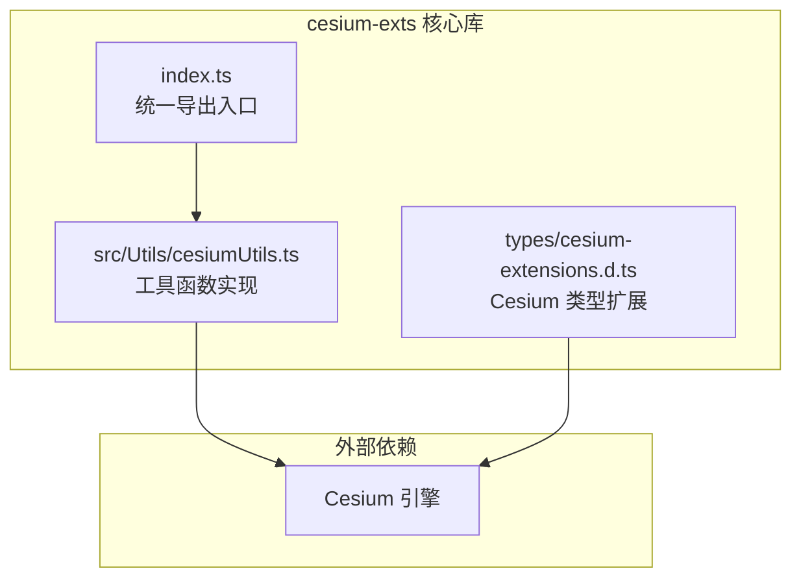
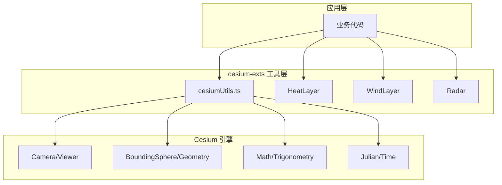
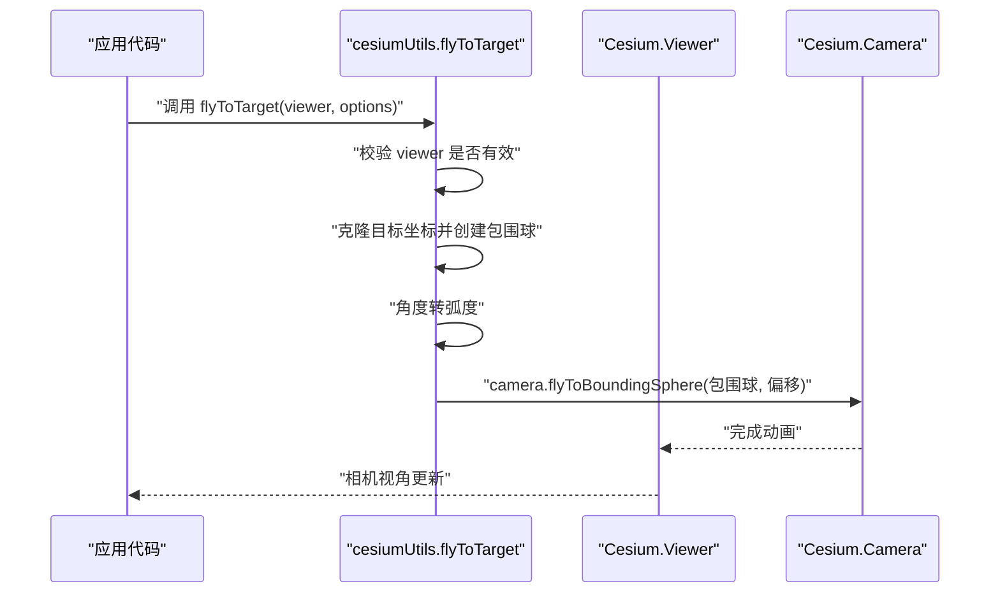
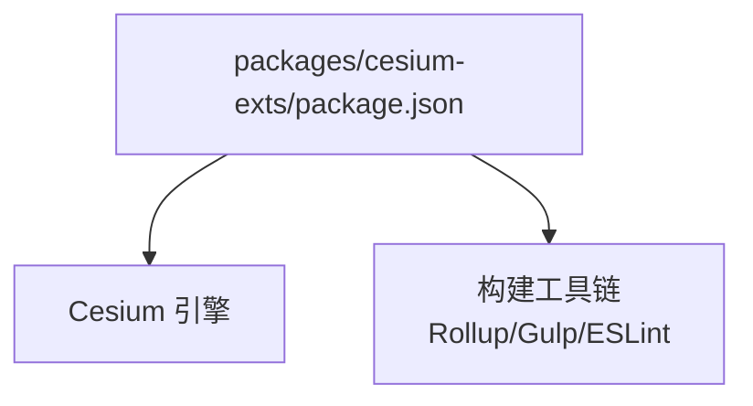

# 工具函数库

<cite>
**本文引用的文件**
- [packages/cesium-exts/package.json](file://packages/cesium-exts/package.json)
- [packages/cesium-exts/index.ts](file://packages/cesium-exts/index.ts)
- [packages/cesium-exts/src/Utils/cesiumUtils.ts](file://packages/cesium-exts/src/Utils/cesiumUtils.ts)
- [packages/cesium-exts/types/cesium-extensions.d.ts](file://packages/cesium-exts/types/cesium-extensions.d.ts)
- [README.md](file://README.md)
</cite>

## 目录

1. [简介](#简介)
2. [项目结构](#项目结构)
3. [核心组件](#核心组件)
4. [架构总览](#架构总览)
5. [详细组件分析](#详细组件分析)
6. [依赖分析](#依赖分析)
7. [性能考虑](#性能考虑)
8. [故障排查指南](#故障排查指南)
9. [结论](#结论)
10. [附录](#附录)

## 简介

本文件面向 Cesium 开发者，系统梳理 cesium-exts 工具函数库提供的实用工具函数，重点覆盖以下方面：

- 坐标与相机视角相关工具：围绕 Cesium Viewer 的相机飞行与目标定位能力
- 数据处理辅助函数：版本查询等基础能力
- Cesium 对象操作工具：对 Cesium 原生对象的封装与便捷调用
- 几何计算函数：围绕几何体、包围球、角度换算等的实用函数

文档将逐项说明每个工具函数的用途、参数与返回值类型，并给出典型使用场景、最佳实践与性能注意事项。同时提供常见工具函数的组合使用方法与扩展开发建议。

## 项目结构

cesium-exts 采用 Monorepo 架构，核心工具函数位于 packages/cesium-exts/src/Utils/cesiumUtils.ts，对外通过 packages/cesium-exts/index.ts 统一导出。类型扩展定义在 types/cesium-extensions.d.ts 中，便于在 TypeScript 项目中获得更完善的类型提示。

图表来源

- [packages/cesium-exts/index.ts:1-4](file://packages/cesium-exts/index.ts#L1-L4)
- [packages/cesium-exts/src/Utils/cesiumUtils.ts:1-106](file://packages/cesium-exts/src/Utils/cesiumUtils.ts#L1-L106)
- [packages/cesium-exts/types/cesium-extensions.d.ts:1-179](file://packages/cesium-exts/types/cesium-extensions.d.ts#L1-L179)

章节来源

- [packages/cesium-exts/package.json:1-48](file://packages/cesium-exts/package.json#L1-L48)
- [packages/cesium-exts/index.ts:1-4](file://packages/cesium-exts/index.ts#L1-L4)
- [README.md:1-170](file://README.md#L1-L170)

## 核心组件

本库当前提供三个主要导出：

- cesiumUtils：Cesium 工具函数集合（版本查询、相机飞行等）
- HeatLayer：热力图可视化组件
- WindLayer：风场可视化组件
- Radar：雷达扫描可视化组件（同级导出）

章节来源

- [packages/cesium-exts/index.ts:1-4](file://packages/cesium-exts/index.ts#L1-L4)
- [README.md:25-30](file://README.md#L25-L30)

## 架构总览

工具函数库与 Cesium 引擎的关系如下：工具函数通过 Cesium 提供的原生 API 实现功能，例如相机控制、几何体与包围球计算、角度换算等；类型扩展文件为 Cesium 的底层渲染 API 提供类型增强，提升开发体验与安全性。

图表来源

- [packages/cesium-exts/src/Utils/cesiumUtils.ts:35-103](file://packages/cesium-exts/src/Utils/cesiumUtils.ts#L35-L103)
- [packages/cesium-exts/index.ts:1-4](file://packages/cesium-exts/index.ts#L1-L4)

## 详细组件分析

### cesiumUtils 工具集

该工具集包含版本查询与相机飞行两大类实用函数，均基于 Cesium 原生能力封装，提供更简洁的调用方式与默认参数。

#### 函数一：cesiumVersion

- 用途：获取当前加载的 Cesium 引擎版本号
- 参数：无
- 返回值：字符串（版本号）
- 使用场景：运行时检测 Cesium 版本，便于兼容性判断与日志记录
- 注意事项：依赖 Cesium 的全局版本常量，若 Cesium 未正确加载将不可用

章节来源

- [packages/cesium-exts/src/Utils/cesiumUtils.ts:5-18](file://packages/cesium-exts/src/Utils/cesiumUtils.ts#L5-L18)

#### 函数二：cesiumExtsVersion

- 用途：获取当前 cesium-exts 库的版本号
- 参数：无
- 返回值：字符串（版本号）
- 使用场景：调试与问题定位时识别工具库版本
- 注意事项：读取自包配置文件，不依赖运行时环境

章节来源

- [packages/cesium-exts/src/Utils/cesiumUtils.ts:20-33](file://packages/cesium-exts/src/Utils/cesiumUtils.ts#L20-L33)

#### 函数三：flyToTarget

- 用途：基于包围球计算平滑飞行到目标位置的相机视角
- 参数：
  - viewer：Cesium Viewer 实例
  - options：
    - targetPosition：目标点的笛卡尔坐标（Cartesian3）
    - radius：包围球半径（米，默认 10）
    - heading：航向角（度，默认 0，正北为 0）
    - pitch：俯仰角（度，默认 -45，负值为向下）
    - range：相机距离目标点的距离（米，默认 15000）
    - duration：动画持续时间（秒，默认 1.5）
- 返回值：无（void）
- 使用场景：快速定位到某区域或地标，配合航向、俯仰与距离控制视角
- 最佳实践：
  - 若仅需瞬时设置视角，可直接使用 Viewer.camera.setView
  - 需要动画过渡时使用 flyToTarget，合理设置 duration 与 range
  - heading/pitch 为角度，内部会转换为弧度
- 性能考虑：
  - flyToBoundingSphere 会触发相机动画，避免频繁调用
  - 大范围飞行（如跨大陆）应适当增加 duration 与 range
- 异常处理：
  - 当 viewer 为空时抛出错误，调用前需确保 Viewer 已初始化

图表来源

- [packages/cesium-exts/src/Utils/cesiumUtils.ts:71-103](file://packages/cesium-exts/src/Utils/cesiumUtils.ts#L71-L103)

章节来源

- [packages/cesium-exts/src/Utils/cesiumUtils.ts:35-103](file://packages/cesium-exts/src/Utils/cesiumUtils.ts#L35-L103)

### 类型扩展：cesium-extensions.d.ts

该文件为 Cesium 提供底层渲染 API 的类型增强，覆盖以下关键领域：

- 全局版本号访问：CESIUM_VERSION
- DOM 元素获取：getElement
- 着色器系统：ShaderSource、Material、VertexFormat 等
- 顶点数组：VertexArray（fromGeometry、destroy）
- 纹理系统：PixelFormat、PixelDatatype、Texture
- 渲染命令：RenderCommand、DrawCommand
- 事件系统：createPropertyDescriptor 等

这些类型定义有助于在 TypeScript 项目中获得更准确的类型提示与编译期检查，减少底层 API 使用风险。

章节来源

- [packages/cesium-exts/types/cesium-extensions.d.ts:1-179](file://packages/cesium-exts/types/cesium-extensions.d.ts#L1-L179)

### 组件导出与组合使用

- 统一入口：index.ts 将 cesiumUtils 与 HeatLayer、WindLayer、Radar 等模块统一导出，便于按需引入
- 组合使用建议：
  - 使用 cesiumUtils.cesiumVersion 与 cesiumExtsVersion 进行版本核对，确保兼容性
  - 在需要快速定位场景时，先用 flyToTarget 设置相机视角，再叠加 HeatLayer/WindLayer/Radar 进行可视化
  - 对于复杂几何体与自定义渲染需求，结合 types/cesium-extensions.d.ts 的类型定义，提升开发效率与稳定性

章节来源

- [packages/cesium-exts/index.ts:1-4](file://packages/cesium-exts/index.ts#L1-L4)
- [README.md:66-88](file://README.md#L66-L88)

## 依赖分析

- peerDependencies：cesium 为必需的对等依赖，版本由包配置管理
- devDependencies：包含构建与质量保障工具链（Rollup、Gulp、ESLint、TypeScript 等）
- 运行时依赖：cesium-utils 依赖 Cesium 的全局版本号与核心 API（Viewer、Camera、BoundingSphere、Math 等）

图表来源

- [packages/cesium-exts/package.json:27-46](file://packages/cesium-exts/package.json#L27-L46)

章节来源

- [packages/cesium-exts/package.json:1-48](file://packages/cesium-exts/package.json#L1-L48)

## 性能考虑

- 相机动画：flyToTarget 使用 flyToBoundingSphere 触发动画，建议控制调用频率，避免频繁重排
- 视角参数：合理设置 heading/pitch/range 与 duration，兼顾视觉效果与性能
- 版本一致性：通过 cesiumVersion 与 cesiumExtsVersion 核对版本，避免因版本差异导致的性能退化或行为异常
- 类型安全：利用类型扩展文件减少运行时错误，降低调试成本

## 故障排查指南

- 相机飞行失败：检查 viewer 是否为有效实例，确保 Viewer 已初始化后再调用 flyToTarget
- 版本号不可用：确认 Cesium 已正确加载，且全局版本常量可用
- 类型报错：确保项目已启用类型扩展文件，或在 tsconfig 中包含 types 目录

章节来源

- [packages/cesium-exts/src/Utils/cesiumUtils.ts:84-86](file://packages/cesium-exts/src/Utils/cesiumUtils.ts#L84-L86)

## 结论

cesium-exts 工具函数库以简洁易用为目标，围绕 Cesium 的相机控制与版本信息提供实用工具，辅以类型扩展提升开发体验。在实际项目中，建议优先使用 cesiumUtils.cesiumVersion 与 cesiumExtsVersion 进行版本核对，结合 flyToTarget 快速定位视角，再叠加 HeatLayer/WindLayer/Radar 等可视化组件，实现高效的地理可视化开发。

## 附录

- 快速开始与示例参考：README.md 中包含安装、开发与使用示例
- 扩展开发建议：
  - 新增工具函数时，遵循现有命名与注释规范，提供默认参数与清晰的参数说明
  - 对涉及 Cesium 原生 API 的函数，补充必要的类型导入与异常处理
  - 在 index.ts 中统一导出，保持对外接口的一致性

章节来源

- [README.md:31-64](file://README.md#L31-L64)
- [README.md:143-158](file://README.md#L143-L158)
