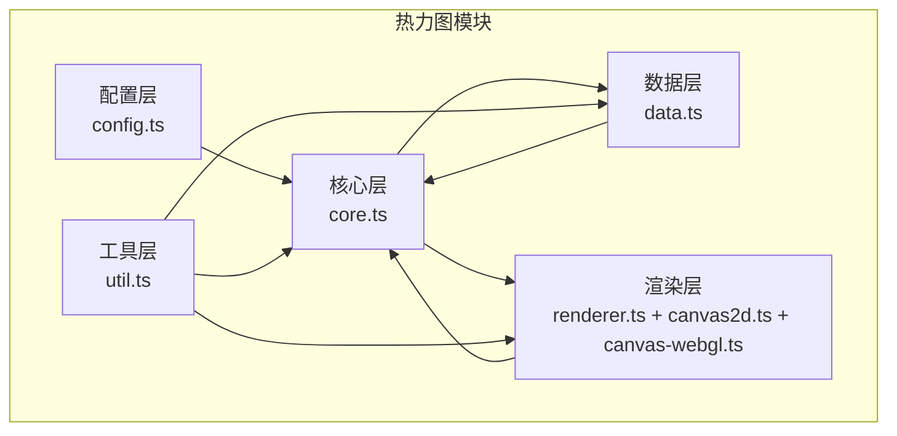
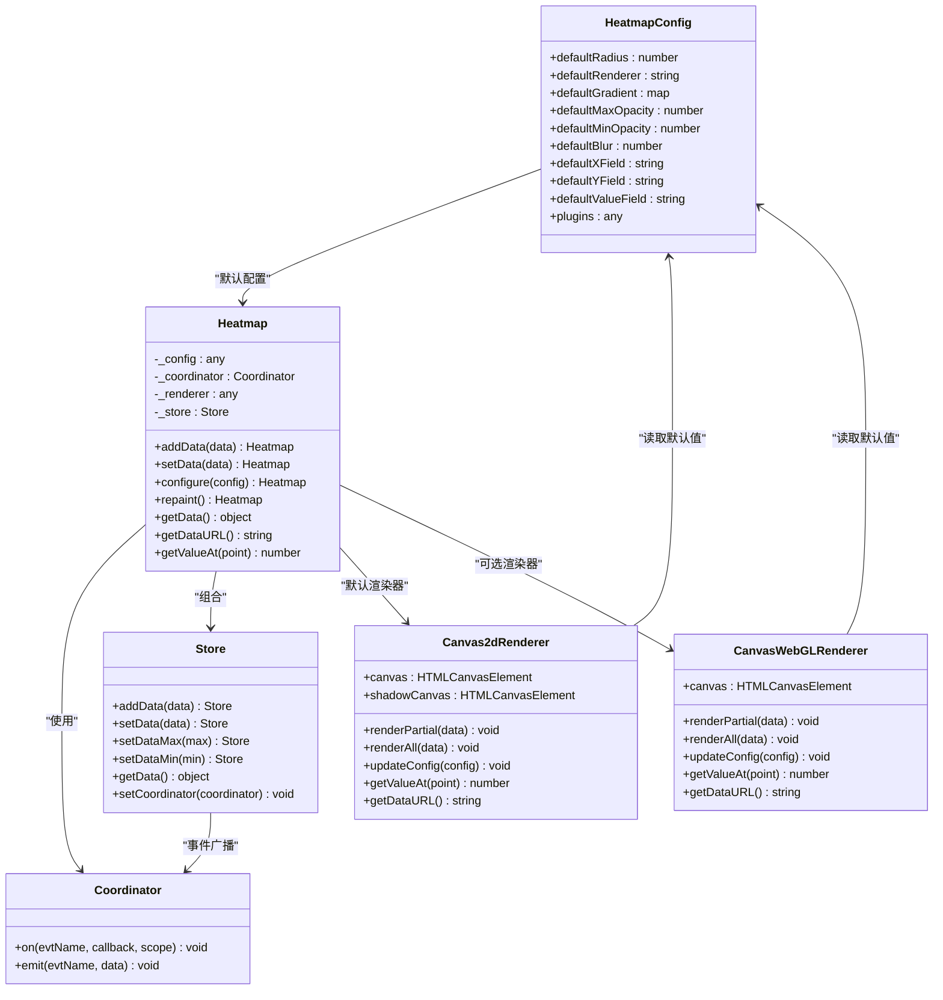
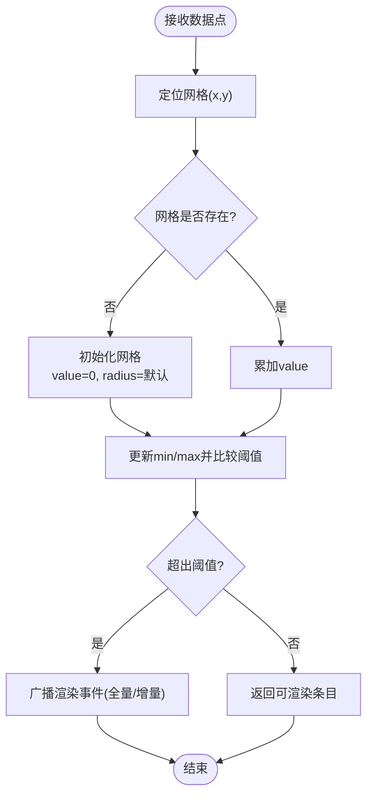
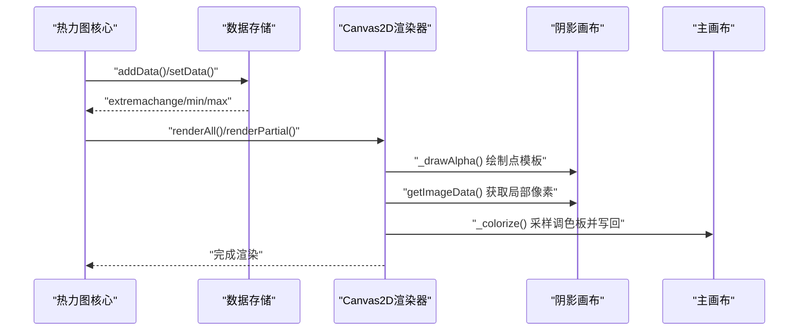
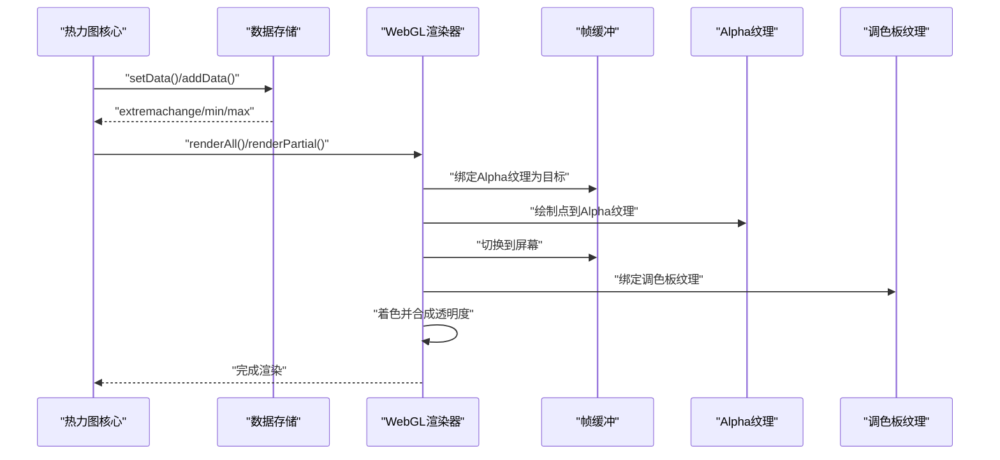
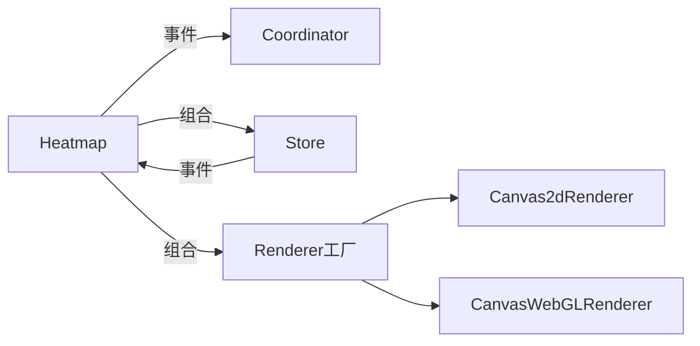

# 热力图模块 (HeatLayer)

<cite>
**本文引用的文件**
- [index.ts](file://packages/cesium-exts/src/modules/HeatLayer/index.ts)
- [config.ts](file://packages/cesium-exts/src/modules/HeatLayer/src/config.ts)
- [core.ts](file://packages/cesium-exts/src/modules/HeatLayer/src/core.ts)
- [data.ts](file://packages/cesium-exts/src/modules/HeatLayer/src/data.ts)
- [renderer.ts](file://packages/cesium-exts/src/modules/HeatLayer/src/renderer.ts)
- [canvas2d.ts](file://packages/cesium-exts/src/modules/HeatLayer/src/renderer/canvas2d.ts)
- [canvas-webgl.ts](file://packages/cesium-exts/src/modules/HeatLayer/src/renderer/canvas-webgl.ts)
- [util.ts](file://packages/cesium-exts/src/modules/HeatLayer/src/util.ts)
- [README.md](file://README.md)
</cite>

## 目录

1. [简介](#简介)
2. [项目结构](#项目结构)
3. [核心组件](#核心组件)
4. [架构总览](#架构总览)
5. [详细组件分析](#详细组件分析)
6. [依赖关系分析](#依赖关系分析)
7. [性能与内存优化](#性能与内存优化)
8. [故障排查指南](#故障排查指南)
9. [结论](#结论)
10. [附录：使用示例与最佳实践](#附录使用示例与最佳实践)

## 简介

本文件系统性解析热力图模块（HeatLayer）的实现原理与算法技术，覆盖数据处理流程、Canvas 与 WebGL 双渲染模式的工作机制、颜色映射与渐变渲染、参数配置、性能优化与内存管理，并提供在 Cesium 场景中的集成方法与渲染优化建议。

## 项目结构

热力图模块位于核心库 packages/cesium-exts 的 src/modules/HeatLayer 目录下，采用清晰的分层设计：

- 配置层：默认配置与常量
- 核心层：热力图主类、事件协调器、工厂与插件注册
- 数据层：数据存储、极值维护与事件广播
- 渲染层：Canvas 2D 与 WebGL 渲染器，以及渲染器工厂
- 工具层：通用合并工具

图表来源

- [config.ts:1-31](file://packages/cesium-exts/src/modules/HeatLayer/src/config.ts#L1-L31)
- [core.ts:1-228](file://packages/cesium-exts/src/modules/HeatLayer/src/core.ts#L1-L228)
- [data.ts:1-257](file://packages/cesium-exts/src/modules/HeatLayer/src/data.ts#L1-L257)
- [renderer.ts:1-15](file://packages/cesium-exts/src/modules/HeatLayer/src/renderer.ts#L1-L15)
- [canvas2d.ts:1-375](file://packages/cesium-exts/src/modules/HeatLayer/src/renderer/canvas2d.ts#L1-L375)
- [canvas-webgl.ts:1-409](file://packages/cesium-exts/src/modules/HeatLayer/src/renderer/canvas-webgl.ts#L1-L409)
- [util.ts:1-22](file://packages/cesium-exts/src/modules/HeatLayer/src/util.ts#L1-L22)

章节来源

- [config.ts:1-31](file://packages/cesium-exts/src/modules/HeatLayer/src/config.ts#L1-L31)
- [core.ts:1-228](file://packages/cesium-exts/src/modules/HeatLayer/src/core.ts#L1-L228)
- [data.ts:1-257](file://packages/cesium-exts/src/modules/HeatLayer/src/data.ts#L1-L257)
- [renderer.ts:1-15](file://packages/cesium-exts/src/modules/HeatLayer/src/renderer.ts#L1-L15)
- [canvas2d.ts:1-375](file://packages/cesium-exts/src/modules/HeatLayer/src/renderer/canvas2d.ts#L1-L375)
- [canvas-webgl.ts:1-409](file://packages/cesium-exts/src/modules/HeatLayer/src/renderer/canvas-webgl.ts#L1-L409)
- [util.ts:1-22](file://packages/cesium-exts/src/modules/HeatLayer/src/util.ts#L1-L22)

## 核心组件

- 配置类：集中定义默认半径、渲染器类型、默认渐变、透明度范围、模糊度、字段名等
- 热力图主类：负责配置合并、组件连接、对外 API（添加/设置数据、重绘、取值、导出）
- 数据存储：按网格聚合数据，维护 min/max 极值，广播渲染事件
- 渲染器工厂：依据配置选择 Canvas2D 或 WebGL 渲染器
- Canvas2D 渲染器：双画布叠加，先绘制 Alpha，再上色；支持模板缓存与边界裁剪
- WebGL 渲染器：双通道管线（点绘制到 Alpha 纹理，再着色到屏幕），使用着色器实现径向模糊与渐变映射

章节来源

- [config.ts:1-31](file://packages/cesium-exts/src/modules/HeatLayer/src/config.ts#L1-L31)
- [core.ts:47-203](file://packages/cesium-exts/src/modules/HeatLayer/src/core.ts#L47-L203)
- [data.ts:30-256](file://packages/cesium-exts/src/modules/HeatLayer/src/data.ts#L30-L256)
- [renderer.ts:8-14](file://packages/cesium-exts/src/modules/HeatLayer/src/renderer.ts#L8-L14)
- [canvas2d.ts:27-375](file://packages/cesium-exts/src/modules/HeatLayer/src/renderer/canvas2d.ts#L27-L375)
- [canvas-webgl.ts:7-409](file://packages/cesium-exts/src/modules/HeatLayer/src/renderer/canvas-webgl.ts#L7-L409)

## 架构总览

热力图采用“配置-核心-数据-渲染”的分层架构，通过事件协调器解耦渲染器与数据存储，支持插件扩展与多渲染器切换。

图表来源

- [config.ts:4-31](file://packages/cesium-exts/src/modules/HeatLayer/src/config.ts#L4-L31)
- [core.ts:9-102](file://packages/cesium-exts/src/modules/HeatLayer/src/core.ts#L9-L102)
- [data.ts:30-234](file://packages/cesium-exts/src/modules/HeatLayer/src/data.ts#L30-L234)
- [canvas2d.ts:27-70](file://packages/cesium-exts/src/modules/HeatLayer/src/renderer/canvas2d.ts#L27-L70)
- [canvas-webgl.ts:7-63](file://packages/cesium-exts/src/modules/HeatLayer/src/renderer/canvas-webgl.ts#L7-L63)

## 详细组件分析

### 数据处理流程与网格聚合

- 输入数据点包含 x、y、value、可选 radius，默认字段名由配置提供
- 存储层按 x/y 网格累加 value，并记录每个网格的半径
- 首次加入或极值变化时，触发 extremachange 事件，通知渲染器更新调色板与范围
- 渲染前将内部网格结构扁平化为可绘制的点集

图表来源

- [data.ts:61-108](file://packages/cesium-exts/src/modules/HeatLayer/src/data.ts#L61-L108)
- [data.ts:151-171](file://packages/cesium-exts/src/modules/HeatLayer/src/data.ts#L151-L171)
- [data.ts:178-195](file://packages/cesium-exts/src/modules/HeatLayer/src/data.ts#L178-L195)
- [data.ts:139-144](file://packages/cesium-exts/src/modules/HeatLayer/src/data.ts#L139-L144)

章节来源

- [data.ts:6-25](file://packages/cesium-exts/src/modules/HeatLayer/src/data.ts#L6-L25)
- [data.ts:30-108](file://packages/cesium-exts/src/modules/HeatLayer/src/data.ts#L30-L108)
- [data.ts:149-195](file://packages/cesium-exts/src/modules/HeatLayer/src/data.ts#L149-L195)

### Canvas 2D 渲染机制

- 双画布策略：主画布用于最终显示，阴影画布用于累积 Alpha
- 点模板缓存：按半径生成圆形或径向渐变模板，减少重复绘制开销
- 边界裁剪：仅对实际绘制区域进行上色，避免全图扫描
- 渐变映射：通过 1D 调色板纹理，按 Alpha 值采样颜色与透明度

图表来源

- [core.ts:80-102](file://packages/cesium-exts/src/modules/HeatLayer/src/core.ts#L80-L102)
- [canvas2d.ts:174-191](file://packages/cesium-exts/src/modules/HeatLayer/src/renderer/canvas2d.ts#L174-L191)
- [canvas2d.ts:256-350](file://packages/cesium-exts/src/modules/HeatLayer/src/renderer/canvas2d.ts#L256-L350)

章节来源

- [canvas2d.ts:27-70](file://packages/cesium-exts/src/modules/HeatLayer/src/renderer/canvas2d.ts#L27-L70)
- [canvas2d.ts:102-123](file://packages/cesium-exts/src/modules/HeatLayer/src/renderer/canvas2d.ts#L102-L123)
- [canvas2d.ts:256-350](file://packages/cesium-exts/src/modules/HeatLayer/src/renderer/canvas2d.ts#L256-L350)

### WebGL 渲染机制与双通道管线

- 双通道管线：
  - 点绘制阶段：将点强度与半径写入 Alpha 纹理（加法混合）
  - 着色阶段：将 Alpha 纹理作为索引采样调色板纹理，按配置合成最终颜色与透明度
- 径向模糊：在片元着色器中以 smoothstep 实现平滑衰减
- 着色器参数：分辨率、模糊系数、透明度范围、是否使用渐变透明度

图表来源

- [core.ts:80-102](file://packages/cesium-exts/src/modules/HeatLayer/src/core.ts#L80-L102)
- [canvas-webgl.ts:197-229](file://packages/cesium-exts/src/modules/HeatLayer/src/renderer/canvas-webgl.ts#L197-L229)
- [canvas-webgl.ts:234-309](file://packages/cesium-exts/src/modules/HeatLayer/src/renderer/canvas-webgl.ts#L234-L309)

章节来源

- [canvas-webgl.ts:7-63](file://packages/cesium-exts/src/modules/HeatLayer/src/renderer/canvas-webgl.ts#L7-L63)
- [canvas-webgl.ts:136-153](file://packages/cesium-exts/src/modules/HeatLayer/src/renderer/canvas-webgl.ts#L136-L153)
- [canvas-webgl.ts:158-176](file://packages/cesium-exts/src/modules/HeatLayer/src/renderer/canvas-webgl.ts#L158-L176)
- [canvas-webgl.ts:234-309](file://packages/cesium-exts/src/modules/HeatLayer/src/renderer/canvas-webgl.ts#L234-L309)

### 颜色映射与渐变渲染

- Canvas 2D：通过 1D 调色板画布生成调色板数据，按 Alpha 采样
- WebGL：将调色板作为 1D 纹理，按 Alpha 采样颜色；支持使用调色板透明度或固定透明度
- 透明度策略：支持固定透明度与基于渐变透明度两种模式

章节来源

- [canvas2d.ts:77-94](file://packages/cesium-exts/src/modules/HeatLayer/src/renderer/canvas2d.ts#L77-L94)
- [canvas-webgl.ts:158-176](file://packages/cesium-exts/src/modules/HeatLayer/src/renderer/canvas-webgl.ts#L158-L176)
- [canvas-webgl.ts:387-407](file://packages/cesium-exts/src/modules/HeatLayer/src/renderer/canvas-webgl.ts#L387-L407)

### 参数配置选项

- 渲染器类型：默认 webgl，可通过配置切换
- 半径：默认半径、单点半径
- 渐变：默认渐变与自定义渐变
- 透明度：全局透明度、最大/最小透明度
- 模糊：模糊系数
- 字段名：x、y、value 字段名
- 背景色：可选背景色
- 尺寸：宽度、高度

章节来源

- [config.ts:4-31](file://packages/cesium-exts/src/modules/HeatLayer/src/config.ts#L4-L31)
- [renderer.ts:8-14](file://packages/cesium-exts/src/modules/HeatLayer/src/renderer.ts#L8-L14)
- [canvas2d.ts:6-22](file://packages/cesium-exts/src/modules/HeatLayer/src/renderer/canvas2d.ts#L6-L22)
- [canvas-webgl.ts:39-63](file://packages/cesium-exts/src/modules/HeatLayer/src/renderer/canvas-webgl.ts#L39-L63)

## 依赖关系分析

- 组件内聚：核心类聚合协调器、渲染器、存储，职责清晰
- 组件耦合：通过事件解耦，渲染器与存储互不直接依赖
- 外部依赖：WebGL 上下文、Canvas 2D 上下文、DOM 容器
- 插件扩展：通过配置注册插件，替换渲染器与存储实现

图表来源

- [core.ts:57-102](file://packages/cesium-exts/src/modules/HeatLayer/src/core.ts#L57-L102)
- [renderer.ts:8-14](file://packages/cesium-exts/src/modules/HeatLayer/src/renderer.ts#L8-L14)

章节来源

- [core.ts:57-102](file://packages/cesium-exts/src/modules/HeatLayer/src/core.ts#L57-L102)
- [renderer.ts:8-14](file://packages/cesium-exts/src/modules/HeatLayer/src/renderer.ts#L8-L14)

## 性能与内存优化

- Canvas 2D
  - 点模板缓存：按半径缓存模板，避免重复绘制
  - 边界裁剪：仅对实际绘制区域上色，降低像素扫描成本
  - 阴影画布：累积 Alpha，主画布仅做最终合成
- WebGL
  - 双通道管线：Alpha 纹理与调色板纹理分离，避免 CPU-GPU 数据往返
  - 加法混合：将多点强度叠加至 Alpha 纹理，提升吞吐
  - 纹理参数：最近过滤、边缘 Clamp，避免采样开销与边界效应
- 通用
  - 配置合并：减少运行时分支判断
  - 事件驱动：按需渲染，避免全量重绘
  - 尺寸管理：动态设置画布尺寸，避免过度绘制

章节来源

- [canvas2d.ts:102-123](file://packages/cesium-exts/src/modules/HeatLayer/src/renderer/canvas2d.ts#L102-L123)
- [canvas2d.ts:256-350](file://packages/cesium-exts/src/modules/HeatLayer/src/renderer/canvas2d.ts#L256-L350)
- [canvas-webgl.ts:83-99](file://packages/cesium-exts/src/modules/HeatLayer/src/renderer/canvas-webgl.ts#L83-L99)
- [canvas-webgl.ts:246-272](file://packages/cesium-exts/src/modules/HeatLayer/src/renderer/canvas-webgl.ts#L246-L272)
- [util.ts:10-20](file://packages/cesium-exts/src/modules/HeatLayer/src/util.ts#L10-L20)

## 故障排查指南

- WebGL 不支持：构造函数检测失败会抛出异常，确认浏览器支持 WebGL
- 渲染空白：检查容器尺寸与画布尺寸是否正确设置
- 渐变不生效：确认传入的 gradient 配置格式正确，或使用默认渐变
- 透明度异常：核对 opacity、maxOpacity、minOpacity 配置范围
- 性能问题：优先使用 WebGL 渲染器；减少数据点数量或增大半径；启用模板缓存

章节来源

- [canvas-webgl.ts:52-54](file://packages/cesium-exts/src/modules/HeatLayer/src/renderer/canvas-webgl.ts#L52-L54)
- [canvas2d.ts:236-250](file://packages/cesium-exts/src/modules/HeatLayer/src/renderer/canvas2d.ts#L236-L250)
- [canvas-webgl.ts:136-153](file://packages/cesium-exts/src/modules/HeatLayer/src/renderer/canvas-webgl.ts#L136-L153)

## 结论

该热力图模块通过清晰的分层设计与事件驱动架构，实现了高性能的热力图渲染。Canvas 2D 提供易用与兼容性，WebGL 提供高吞吐与可扩展性。结合网格聚合、模板缓存、边界裁剪与双通道管线，可在大数据场景下保持流畅渲染。配合合理的参数配置与内存管理策略，可满足复杂地理场景的可视化需求。

## 附录：使用示例与最佳实践

- 基本使用：参考根 README 中的示例，创建热力图实例并添加数据点
- Cesium 集成：将渲染器输出的画布叠加在 Cesium 场景之上，注意坐标系转换与相机同步
- 最佳实践
  - 优先使用 WebGL 渲染器
  - 合理设置半径与模糊度，平衡视觉效果与性能
  - 控制透明度范围，避免低对比度
  - 对高频更新场景，使用增量渲染与边界裁剪
  - 大数据集建议预聚合或降采样

章节来源

- [README.md:66-88](file://README.md#L66-L88)
