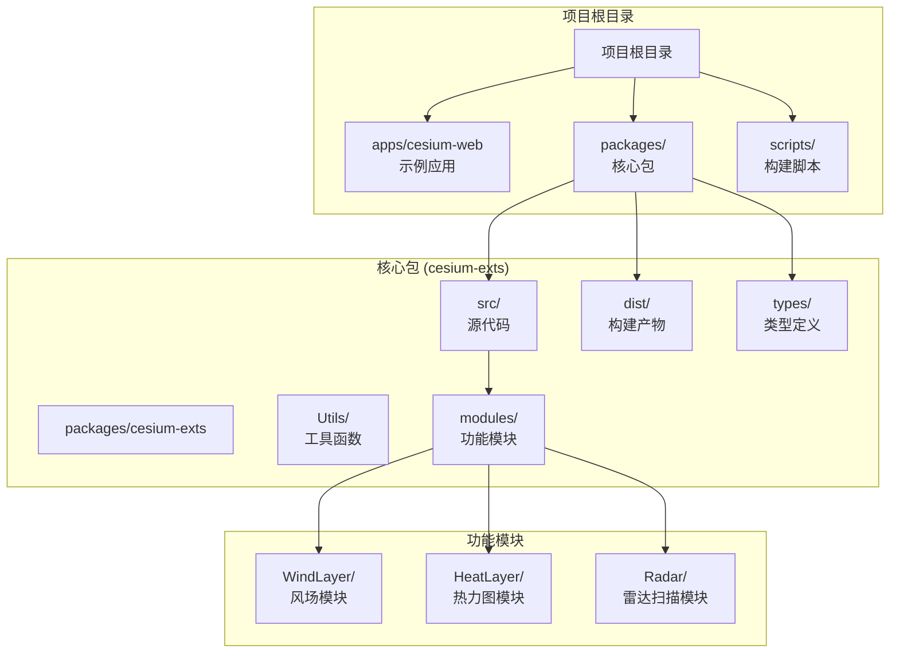
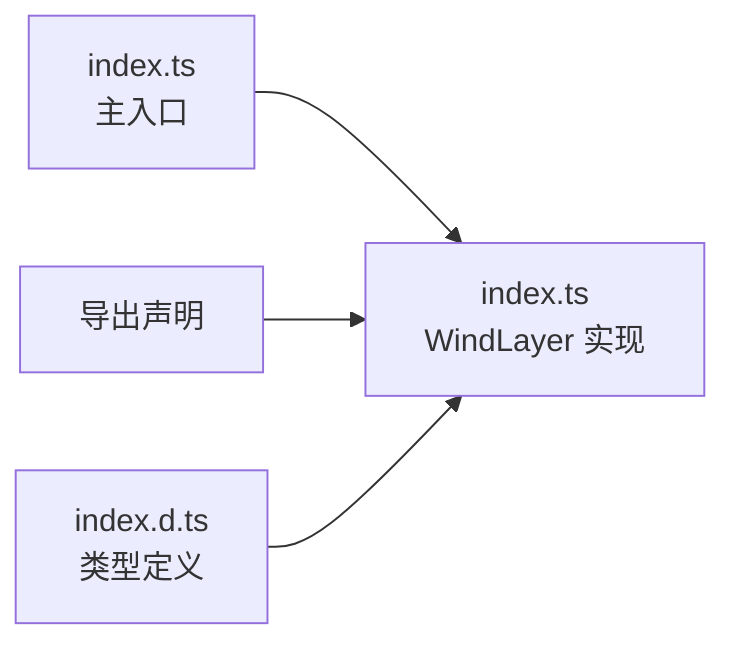
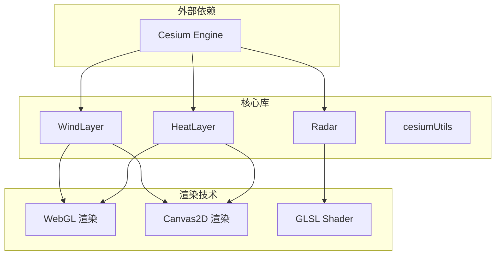
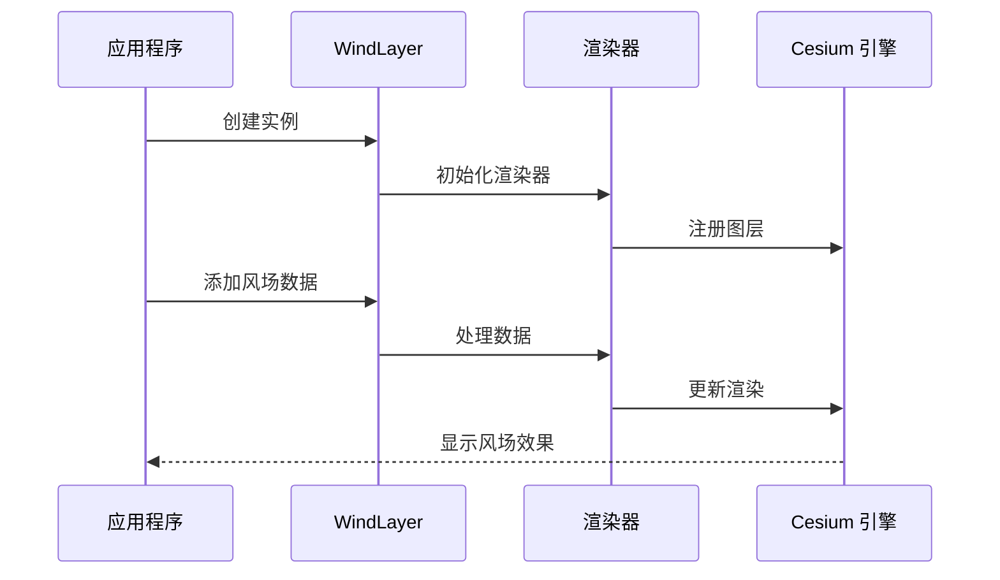
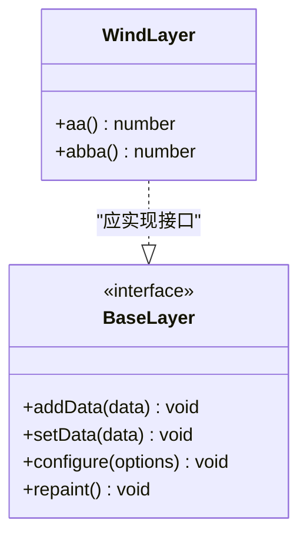
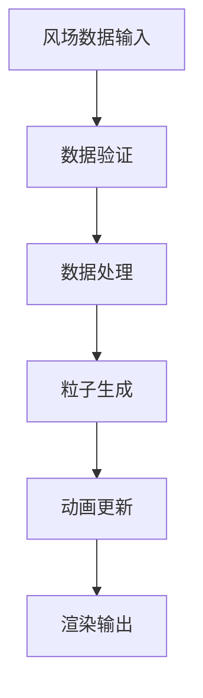
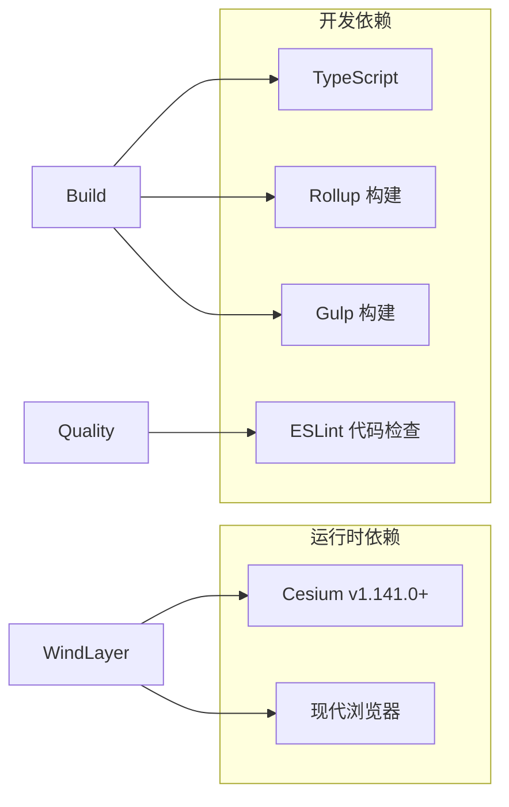
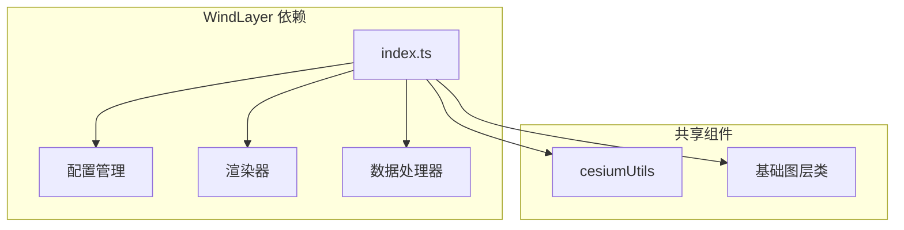
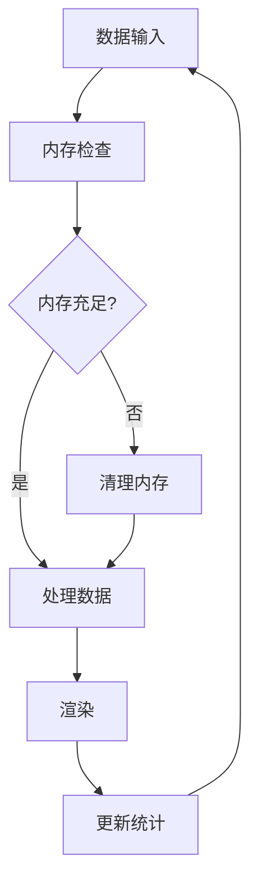

# 风场模块 (WindLayer)

<cite>
**本文档引用的文件**
- [index.ts](file://packages/cesium-exts/src/modules/WindLayer/index.ts)
- [index.ts](file://packages/cesium-exts/index.ts)
- [package.json](file://packages/cesium-exts/package.json)
- [README.md](file://README.md)
- [index.ts](file://packages/cesium-exts/src/modules/HeatLayer/index.ts)
- [index.d.ts](file://packages/cesium-exts/dist/types/index.d.ts)
- [cesium-exts.cjs.js](file://packages/cesium-exts/dist/cesium-exts.cjs.js)
- [cesium-exts.esm.js](file://packages/cesium-exts/dist/cesium-exts.esm.js)
- [cesium-exts.umd.js](file://packages/cesium-exts/dist/cesium-exts.umd.js)
</cite>

## 目录

1. [简介](#简介)
2. [项目结构](#项目结构)
3. [核心组件](#核心组件)
4. [架构概览](#架构概览)
5. [详细组件分析](#详细组件分析)
6. [依赖关系分析](#依赖关系分析)
7. [性能考虑](#性能考虑)
8. [故障排除指南](#故障排除指南)
9. [结论](#结论)
10. [附录](#附录)

## 简介

风场模块 (WindLayer) 是基于 Cesium 的高性能风场可视化组件，为三维地球场景提供风场数据的实时渲染和交互能力。该模块采用现代 Web 技术栈，结合 WebGL 和 Canvas 2D 渲染技术，实现高效的矢量场可视化效果。

根据项目文档，WindLayer 是 cesium-exts 核心扩展库中的重要组成部分，与其他可视化组件如热力图 (HeatLayer)、雷达扫描 (Radar) 等共同构成完整的地理可视化解决方案。

## 项目结构

项目采用 Monorepo 架构，主要包含以下关键目录和文件：



**图表来源**

- [package.json:8-15](file://packages/cesium-exts/package.json#L8-L15)
- [index.ts:1-4](file://packages/cesium-exts/index.ts#L1-L4)

**章节来源**

- [package.json:1-48](file://packages/cesium-exts/package.json#L1-L48)
- [README.md:1-88](file://README.md#L1-L88)

## 核心组件

### WindLayer 类设计

目前的 WindLayer 实现非常基础，仅包含两个测试方法：

```mermaid
classDiagram
class WindLayer {
+aa() number
+abba() number
}
note for WindLayer : "当前仅为占位实现<br/>实际功能待完善"
```

**图表来源**

- [index.ts:1-9](file://packages/cesium-exts/src/modules/WindLayer/index.ts#L1-L9)

### 导出结构

WindLayer 通过主入口文件正确导出：



**图表来源**

- [index.ts](file://packages/cesium-exts/index.ts#L4)
- [index.d.ts:339-344](file://packages/cesium-exts/dist/types/index.d.ts#L339-L344)

**章节来源**

- [index.ts:1-9](file://packages/cesium-exts/src/modules/WindLayer/index.ts#L1-L9)
- [index.ts](file://packages/cesium-exts/index.ts#L4)
- [index.d.ts:339-344](file://packages/cesium-exts/dist/types/index.d.ts#L339-L344)

## 架构概览

### 模块依赖关系



**图表来源**

- [package.json:27-29](file://packages/cesium-exts/package.json#L27-L29)
- [README.md:25-30](file://README.md#L25-L30)

### 数据流架构



**图表来源**

- [cesium-exts.esm.js:1-200](file://packages/cesium-exts/dist/cesium-exts.esm.js#L1-L200)

## 详细组件分析

### WindLayer 当前实现分析

#### 基础类结构

当前的 WindLayer 类极其简单，仅包含两个无实际功能的方法：

| 方法   | 返回值 | 用途                   |
| ------ | ------ | ---------------------- |
| aa()   | number | 测试方法，返回固定值 4 |
| abba() | number | 测试方法，返回固定值 5 |

#### 设计模式

从现有代码可以看出，WindLayer 采用了类似其他可视化组件的设计模式：



**图表来源**

- [index.ts:1-9](file://packages/cesium-exts/src/modules/WindLayer/index.ts#L1-L9)

### 预期的功能架构

基于项目文档和其他可视化组件的实现，WindLayer 应该具备以下功能架构：

#### 数据处理层



#### 渲染技术对比

| 技术        | 优势                     | 劣势                     | 适用场景           |
| ----------- | ------------------------ | ------------------------ | ------------------ |
| WebGL       | 性能优异，支持大规模数据 | 实现复杂，调试困难       | 大型风场，实时渲染 |
| Canvas2D    | 实现简单，兼容性好       | 性能有限，大数据集受影响 | 小型风场，简单效果 |
| GLSL Shader | 精细控制，视觉效果佳     | 学习成本高               | 高质量风场效果     |

**章节来源**

- [index.ts:1-9](file://packages/cesium-exts/src/modules/WindLayer/index.ts#L1-L9)

## 依赖关系分析

### 外部依赖



**图表来源**

- [package.json:27-46](file://packages/cesium-exts/package.json#L27-L46)

### 内部依赖关系



**图表来源**

- [index.ts:1-4](file://packages/cesium-exts/index.ts#L1-L4)

**章节来源**

- [package.json:27-46](file://packages/cesium-exts/package.json#L27-L46)
- [index.ts:1-4](file://packages/cesium-exts/index.ts#L1-L4)

## 性能考虑

### 渲染性能优化

基于热力图组件的实现经验，WindLayer 可以采用以下性能优化策略：

#### 渲染模式选择

- **WebGL 模式**: 适用于大规模风场数据，性能最优
- **Canvas2D 模式**: 适用于小规模数据，实现简单
- **混合模式**: 根据数据量自动切换渲染模式

#### 数据处理优化

- **数据分块**: 大数据集分批处理
- **内存管理**: 及时释放不再使用的粒子对象
- **LOD 技术**: 根据视距调整风场密度

### 内存管理



## 故障排除指南

### 常见问题及解决方案

#### WindLayer 实例化失败

**问题**: 创建 WindLayer 实例时报错
**原因**: 当前实现仅包含测试方法
**解决方案**: 等待完整实现或参考其他组件的实现方式

#### 渲染异常

**问题**: 风场无法正常显示
**可能原因**:

- Cesium 引擎版本不兼容
- WebGL 不支持
- 数据格式不正确

**解决步骤**:

1. 检查 Cesium 版本兼容性
2. 验证 WebGL 支持状态
3. 确认数据格式符合要求

#### 性能问题

**问题**: 风场渲染卡顿
**解决建议**:

- 减少风场粒子数量
- 调整渲染刷新频率
- 使用 Canvas2D 替代 WebGL

**章节来源**

- [cesium-exts.cjs.js:1-200](file://packages/cesium-exts/dist/cesium-exts.cjs.js#L1-L200)

## 结论

WindLayer 作为 cesium-exts 核心库中的重要组件，目前仍处于基础实现阶段。虽然当前版本仅包含简单的测试方法，但从项目的整体架构和设计模式来看，WindLayer 将会是一个功能完善的风场可视化解决方案。

基于现有的热力图和雷达扫描组件的实现经验，WindLayer 预计将具备以下核心能力：

- 高性能的风场数据渲染
- 支持多种渲染模式
- 完善的数据处理和动画系统
- 丰富的配置选项和自定义能力

随着项目的持续发展，WindLayer 将成为三维地球场景中不可或缺的风场可视化工具。

## 附录

### 集成示例

由于当前 WindLayer 实现较为简单，以下示例仅供参考其预期的使用方式：

```typescript
// 预期的 WindLayer 使用示例
import { WindLayer } from "cesium-exts";

// 创建风场图层
const windLayer = new WindLayer(viewer, {
  // 预期的配置选项
  opacity: 0.8,
  particleCount: 1000,
  animationSpeed: 1.0,
  colorScheme: "temperature"
});

// 添加风场数据
windLayer.addData({
  longitude: 116.4074,
  latitude: 39.9042,
  u: 10.5, // 经向风速
  v: 5.2, // 纬向风速
  magnitude: 11.7 // 风速大小
});
```

### 配置选项参考

基于其他组件的实现，WindLayer 可能支持以下配置选项：

| 选项名称       | 类型   | 默认值        | 描述         |
| -------------- | ------ | ------------- | ------------ |
| opacity        | number | 1.0           | 风场透明度   |
| particleCount  | number | 1000          | 粒子数量     |
| animationSpeed | number | 1.0           | 动画播放速度 |
| colorScheme    | string | 'temperature' | 颜色方案     |
| blurRadius     | number | 2.0           | 模糊半径     |
| maxVelocity    | number | 50.0          | 最大风速     |

### 数据格式要求

预期的风场数据格式：

```json
{
  "longitude": 116.4074,
  "latitude": 39.9042,
  "u": 10.5,
  "v": 5.2,
  "magnitude": 11.7,
  "timestamp": "2023-01-01T00:00:00Z"
}
```
