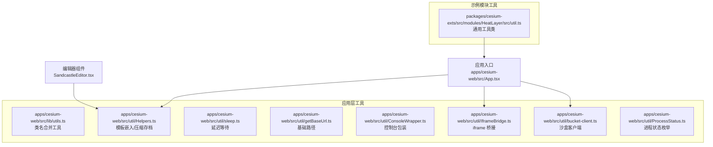
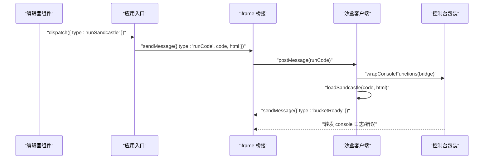
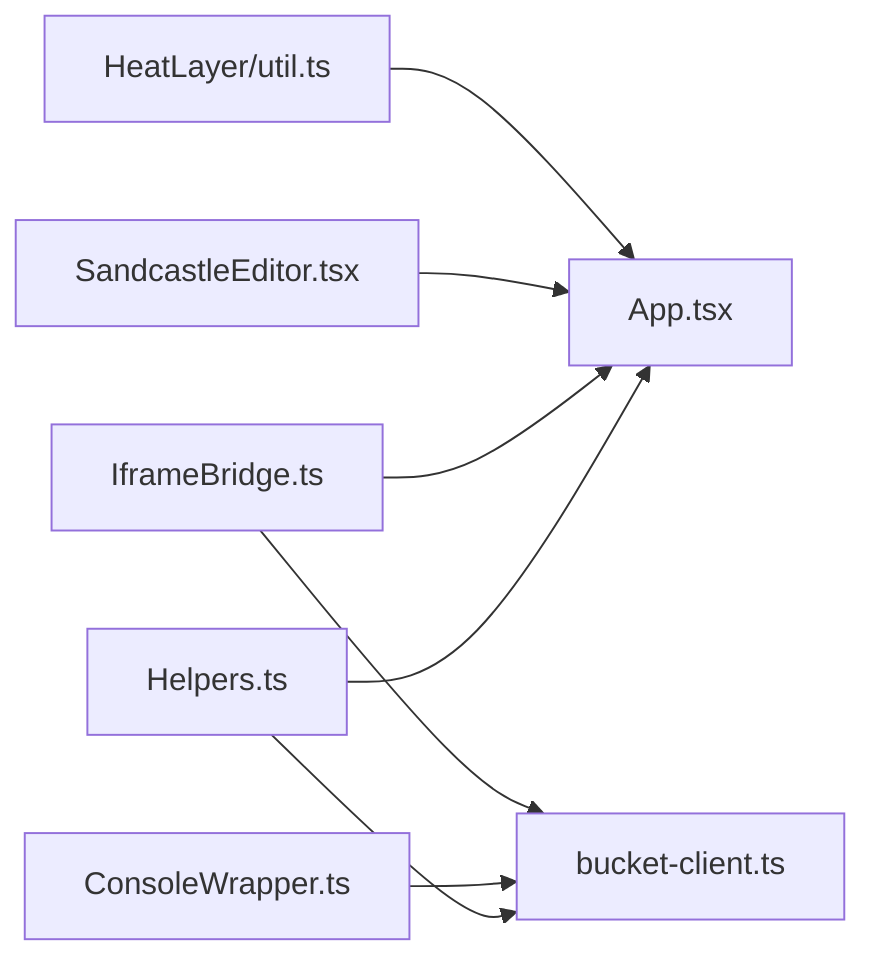

# 工具函数库

<cite>
**本文引用的文件**
- [apps/cesium-web/src/lib/utils.ts](file://apps/cesium-web/src/lib/utils.ts)
- [apps/cesium-web/src/util/Helpers.ts](file://apps/cesium-web/src/util/Helpers.ts)
- [apps/cesium-web/src/util/sleep.ts](file://apps/cesium-web/src/util/sleep.ts)
- [apps/cesium-web/src/util/getBaseUrl.ts](file://apps/cesium-web/src/util/getBaseUrl.ts)
- [apps/cesium-web/src/util/ConsoleWrapper.ts](file://apps/cesium-web/src/util/ConsoleWrapper.ts)
- [apps/cesium-web/src/util/IframeBridge.ts](file://apps/cesium-web/src/util/IframeBridge.ts)
- [apps/cesium-web/src/util/ProcessStatus.ts](file://apps/cesium-web/src/util/ProcessStatus.ts)
- [apps/cesium-web/src/util/bucket-client.ts](file://apps/cesium-web/src/util/bucket-client.ts)
- [apps/cesium-web/src/hooks/useCodeState.ts](file://apps/cesium-web/src/hooks/useCodeState.ts)
- [apps/cesium-web/src/App.tsx](file://apps/cesium-web/src/App.tsx)
- [apps/cesium-web/src/components/SandcastleEditor/SandcastleEditor.tsx](file://apps/cesium-web/src/components/SandcastleEditor/SandcastleEditor.tsx)
- [packages/cesium-exts/src/modules/HeatLayer/src/util.ts](file://packages/cesium-exts/src/modules/HeatLayer/src/util.ts)
</cite>

## 目录

1. [简介](#简介)
2. [项目结构](#项目结构)
3. [核心组件](#核心组件)
4. [架构总览](#架构总览)
5. [详细组件分析](#详细组件分析)
6. [依赖关系分析](#依赖关系分析)
7. [性能考量](#性能考量)
8. [故障排查指南](#故障排查指南)
9. [结论](#结论)
10. [附录](#附录)

## 简介

本文件系统性梳理并说明工具函数库（Utils 模块及相关工具）的功能与使用方式，涵盖以下方面：

- 坐标转换、数据处理、数学计算等核心工具函数的实现原理与使用方法
- 函数的参数规范、返回值格式与异常处理机制
- 性能考量与最佳实践
- 常见使用场景与集成指南

工具函数库主要分布在以下位置：

- UI 工具：轻量级类名合并工具
- 开发与运行时工具：代码模板嵌入、URL 存档压缩/解压、延迟等待、基础路径获取
- 控制台与沙盒通信：控制台包装、iframe 桥接、沙盒客户端
- 状态与流程：进程状态枚举
- 示例模块工具：通用对象合并工具类

## 项目结构

工具函数库位于前端应用与示例模块两处：

- 应用层工具（apps/cesium-web/src/util/\* 与 apps/cesium-web/src/lib/utils.ts）
- 示例模块工具（packages/cesium-exts/src/modules/HeatLayer/src/util.ts）

图表来源

- [apps/cesium-web/src/lib/utils.ts:1-7](file://apps/cesium-web/src/lib/utils.ts#L1-L7)
- [apps/cesium-web/src/util/Helpers.ts:1-137](file://apps/cesium-web/src/util/Helpers.ts#L1-L137)
- [apps/cesium-web/src/util/sleep.ts:1-17](file://apps/cesium-web/src/util/sleep.ts#L1-L17)
- [apps/cesium-web/src/util/getBaseUrl.ts:1-5](file://apps/cesium-web/src/util/getBaseUrl.ts#L1-L5)
- [apps/cesium-web/src/util/ConsoleWrapper.ts:1-296](file://apps/cesium-web/src/util/ConsoleWrapper.ts#L1-L296)
- [apps/cesium-web/src/util/IframeBridge.ts:1-183](file://apps/cesium-web/src/util/IframeBridge.ts#L1-L183)
- [apps/cesium-web/src/util/bucket-client.ts:1-87](file://apps/cesium-web/src/util/bucket-client.ts#L1-L87)
- [apps/cesium-web/src/util/ProcessStatus.ts:1-21](file://apps/cesium-web/src/util/ProcessStatus.ts#L1-L21)
- [apps/cesium-web/src/App.tsx:1-149](file://apps/cesium-web/src/App.tsx#L1-L149)
- [apps/cesium-web/src/components/SandcastleEditor/SandcastleEditor.tsx:1-73](file://apps/cesium-web/src/components/SandcastleEditor/SandcastleEditor.tsx#L1-L73)
- [packages/cesium-exts/src/modules/HeatLayer/src/util.ts:1-21](file://packages/cesium-exts/src/modules/HeatLayer/src/util.ts#L1-L21)

章节来源

- [apps/cesium-web/src/lib/utils.ts:1-7](file://apps/cesium-web/src/lib/utils.ts#L1-L7)
- [apps/cesium-web/src/util/Helpers.ts:1-137](file://apps/cesium-web/src/util/Helpers.ts#L1-L137)
- [apps/cesium-web/src/util/sleep.ts:1-17](file://apps/cesium-web/src/util/sleep.ts#L1-L17)
- [apps/cesium-web/src/util/getBaseUrl.ts:1-5](file://apps/cesium-web/src/util/getBaseUrl.ts#L1-L5)
- [apps/cesium-web/src/util/ConsoleWrapper.ts:1-296](file://apps/cesium-web/src/util/ConsoleWrapper.ts#L1-L296)
- [apps/cesium-web/src/util/IframeBridge.ts:1-183](file://apps/cesium-web/src/util/IframeBridge.ts#L1-L183)
- [apps/cesium-web/src/util/bucket-client.ts:1-87](file://apps/cesium-web/src/util/bucket-client.ts#L1-L87)
- [apps/cesium-web/src/util/ProcessStatus.ts:1-21](file://apps/cesium-web/src/util/ProcessStatus.ts#L1-L21)
- [apps/cesium-web/src/App.tsx:1-149](file://apps/cesium-web/src/App.tsx#L1-L149)
- [apps/cesium-web/src/components/SandcastleEditor/SandcastleEditor.tsx:1-73](file://apps/cesium-web/src/components/SandcastleEditor/SandcastleEditor.tsx#L1-L73)
- [packages/cesium-exts/src/modules/HeatLayer/src/util.ts:1-21](file://packages/cesium-exts/src/modules/HeatLayer/src/util.ts#L1-L21)

## 核心组件

- 类名合并工具（UI 层）
  - 功能：合并多个类名并进行 Tailwind 冲突合并，避免重复与冲突
  - 参数：可变数量的类名输入
  - 返回：合并后的类名字符串
  - 使用场景：组件样式类名动态组合
  - 章节来源
    - [apps/cesium-web/src/lib/utils.ts:4-6](file://apps/cesium-web/src/lib/utils.ts#L4-L6)

- 模板嵌入与压缩存档（开发与运行时）
  - 功能：将用户代码嵌入 Sandcastle 运行模板；序列化/压缩/解压存档数据
  - 参数与返回：详见各函数签名与注释
  - 异常处理：解码时对历史字段发出警告
  - 使用场景：示例分享、URL 持久化、运行时注入
  - 章节来源
    - [apps/cesium-web/src/util/Helpers.ts:18-36](file://apps/cesium-web/src/util/Helpers.ts#L18-L36)
    - [apps/cesium-web/src/util/Helpers.ts:63-79](file://apps/cesium-web/src/util/Helpers.ts#L63-L79)
    - [apps/cesium-web/src/util/Helpers.ts:100-136](file://apps/cesium-web/src/util/Helpers.ts#L100-L136)

- 延迟等待（异步控制）
  - 功能：基于 Promise 的 sleep，便于 async/await 协程式暂停
  - 参数：毫秒数
  - 返回：Promise<void>
  - 使用场景：调试、重试退避、动画节奏控制
  - 章节来源
    - [apps/cesium-web/src/util/sleep.ts:14-16](file://apps/cesium-web/src/util/sleep.ts#L14-L16)

- 基础路径（URL 构建）
  - 功能：获取不含查询与哈希的基础路径
  - 参数：无
  - 返回：字符串
  - 使用场景：构建稳定链接、资源定位
  - 章节来源
    - [apps/cesium-web/src/util/getBaseUrl.ts:1-5](file://apps/cesium-web/src/util/getBaseUrl.ts#L1-L5)

- 控制台包装与错误捕获（调试与桥接）
  - 功能：包装 console 方法，转发消息至父窗口；捕获未处理错误
  - 参数：iframe 桥接实例
  - 返回：无（副作用：拦截并转发日志/错误）
  - 使用场景：沙盒内调试、错误上报
  - 章节来源
    - [apps/cesium-web/src/util/ConsoleWrapper.ts:254-295](file://apps/cesium-web/src/util/ConsoleWrapper.ts#L254-L295)

- iframe 桥接（跨帧通信）
  - 功能：类型安全的 postMessage 桥接，带来源校验与信封封装
  - 参数：remoteOrigin、targetWindow
  - 返回：实例（sendMessage/addEventListener/removeEventListener）
  - 使用场景：父窗口与 iframe 间双向通信
  - 章节来源
    - [apps/cesium-web/src/util/IframeBridge.ts:78-182](file://apps/cesium-web/src/util/IframeBridge.ts#L78-L182)

- 沙盒客户端（Viewer 页面）
  - 功能：初始化桥接、包装控制台、接收运行指令、注入代码与 HTML
  - 参数：无（读取全局常量与桥接实例）
  - 返回：无（副作用：注入脚本、发送就绪消息）
  - 使用场景：Viewer 页面与父应用通信
  - 章节来源
    - [apps/cesium-web/src/util/bucket-client.ts:62-87](file://apps/cesium-web/src/util/bucket-client.ts#L62-L87)

- 进程状态枚举（流程控制）
  - 功能：统一的流程状态标识
  - 成员：NOT_STARTED、IN_PROGRESS、COMPLETE、ERROR
  - 使用场景：任务状态机、UI 状态同步
  - 章节来源
    - [apps/cesium-web/src/util/ProcessStatus.ts:4-21](file://apps/cesium-web/src/util/ProcessStatus.ts#L4-L21)

- 通用工具类（示例模块）
  - 功能：对象合并（浅拷贝）
  - 参数：多个对象
  - 返回：合并后的新对象
  - 使用场景：配置合并、默认值叠加
  - 章节来源
    - [packages/cesium-exts/src/modules/HeatLayer/src/util.ts:10-20](file://packages/cesium-exts/src/modules/HeatLayer/src/util.ts#L10-L20)

## 架构总览

工具函数库围绕“沙盒运行 + 控制台桥接 + 数据存档”的闭环工作流展开。

图表来源

- [apps/cesium-web/src/App.tsx:83-86](file://apps/cesium-web/src/App.tsx#L83-L86)
- [apps/cesium-web/src/util/IframeBridge.ts:122-129](file://apps/cesium-web/src/util/IframeBridge.ts#L122-L129)
- [apps/cesium-web/src/util/bucket-client.ts:70-79](file://apps/cesium-web/src/util/bucket-client.ts#L70-L79)
- [apps/cesium-web/src/util/ConsoleWrapper.ts:254-295](file://apps/cesium-web/src/util/ConsoleWrapper.ts#L254-L295)

## 详细组件分析

### 类名合并工具（UI 层）

- 实现要点
  - 使用第三方库进行类名合并与冲突处理
  - 支持可变参数，返回合并后的字符串
- 复杂度
  - 时间复杂度：O(n)，n 为传入类名数量
  - 空间复杂度：O(n)
- 最佳实践
  - 优先使用该工具进行条件类名拼接，避免手动字符串拼接
- 章节来源
  - [apps/cesium-web/src/lib/utils.ts:4-6](file://apps/cesium-web/src/lib/utils.ts#L4-L6)

### 模板嵌入与压缩存档

- 实现要点
  - 模板嵌入：自动补全缺失的导入与运行时钩子，保证行号一致性
  - 压缩存档：JSON 数组裁剪首尾固定片段，raw DEFLATE 压缩，Base64 编码去填充
  - 解码存档：补全填充、解码、解压、还原数组并兼容历史字段
- 复杂度
  - 压缩/解压：近似 O(n)，n 为 JSON 字符串长度
  - 正则与字符串处理：线性时间
- 异常处理
  - 解码时对历史字段发出警告，不影响解码流程
- 使用场景
  - 示例分享链接生成与解析
  - 运行时模板注入
- 章节来源
  - [apps/cesium-web/src/util/Helpers.ts:18-36](file://apps/cesium-web/src/util/Helpers.ts#L18-L36)
  - [apps/cesium-web/src/util/Helpers.ts:63-79](file://apps/cesium-web/src/util/Helpers.ts#L63-L79)
  - [apps/cesium-web/src/util/Helpers.ts:100-136](file://apps/cesium-web/src/util/Helpers.ts#L100-L136)

### 延迟等待（sleep）

- 实现要点
  - 基于 Promise 的定时器封装
  - 适合与 async/await 协程式暂停
- 复杂度
  - 时间复杂度：O(1)
  - 空间复杂度：O(1)
- 使用场景
  - 调试、重试退避、动画节奏控制
- 章节来源
  - [apps/cesium-web/src/util/sleep.ts:14-16](file://apps/cesium-web/src/util/sleep.ts#L14-L16)

### 基础路径（getBaseUrl）

- 实现要点
  - 获取不含查询与哈希的基础路径
- 复杂度
  - 时间复杂度：O(1)
  - 空间复杂度：O(1)
- 使用场景
  - 构建稳定链接、资源定位
- 章节来源
  - [apps/cesium-web/src/util/getBaseUrl.ts:1-5](file://apps/cesium-web/src/util/getBaseUrl.ts#L1-L5)

### 控制台包装与错误捕获

- 实现要点
  - 包装 console.clear/log/warn/error，转发消息至父窗口
  - 捕获 window.error，提取行号并转发
  - 对复杂对象进行简化打印，避免大对象导致的性能问题
- 复杂度
  - 打印与字符串化：与对象规模相关，但做了简化策略
- 使用场景
  - 沙盒内调试、错误上报
- 章节来源
  - [apps/cesium-web/src/util/ConsoleWrapper.ts:170-171](file://apps/cesium-web/src/util/ConsoleWrapper.ts#L170-L171)
  - [apps/cesium-web/src/util/ConsoleWrapper.ts:205-246](file://apps/cesium-web/src/util/ConsoleWrapper.ts#L205-L246)
  - [apps/cesium-web/src/util/ConsoleWrapper.ts:254-295](file://apps/cesium-web/src/util/ConsoleWrapper.ts#L254-L295)

### iframe 桥接（IframeBridge）

- 实现要点
  - 类型安全的消息封装与来源校验
  - 信封结构：包含固定 id 与业务消息体
  - 三重校验：信封结构、origin、来源窗口
- 复杂度
  - 发送/接收：O(1)
- 使用场景
  - 父窗口与 iframe 间双向通信
- 章节来源
  - [apps/cesium-web/src/util/IframeBridge.ts:56-58](file://apps/cesium-web/src/util/IframeBridge.ts#L56-L58)
  - [apps/cesium-web/src/util/IframeBridge.ts:149-170](file://apps/cesium-web/src/util/IframeBridge.ts#L149-L170)
  - [apps/cesium-web/src/util/IframeBridge.ts:122-129](file://apps/cesium-web/src/util/IframeBridge.ts#L122-L129)

### 沙盒客户端（bucket-client）

- 实现要点
  - 初始化桥接与控制台包装
  - 监听运行指令，注入 HTML 与脚本
  - 发送“已就绪”消息
- 复杂度
  - 注入与 DOM 操作：与 HTML/脚本规模相关
- 使用场景
  - Viewer 页面与父应用通信
- 章节来源
  - [apps/cesium-web/src/util/bucket-client.ts:62-87](file://apps/cesium-web/src/util/bucket-client.ts#L62-L87)

### 进程状态枚举（ProcessStatus）

- 实现要点
  - 统一的流程状态标识
- 使用场景
  - 任务状态机、UI 状态同步
- 章节来源
  - [apps/cesium-web/src/util/ProcessStatus.ts:4-21](file://apps/cesium-web/src/util/ProcessStatus.ts#L4-L21)

### 通用工具类（示例模块）

- 实现要点
  - 对象合并（浅拷贝）
- 复杂度
  - 时间复杂度：O(Σn_i)，n_i 为每个对象的键数
  - 空间复杂度：O(Σn_i)
- 使用场景
  - 配置合并、默认值叠加
- 章节来源
  - [packages/cesium-exts/src/modules/HeatLayer/src/util.ts:10-20](file://packages/cesium-exts/src/modules/HeatLayer/src/util.ts#L10-L20)

## 依赖关系分析

- 组件耦合
  - 沙盒客户端依赖桥接与控制台包装
  - 应用入口通过桥接向沙盒发送运行指令
  - 编辑器组件驱动状态机，触发运行流程
- 外部依赖
  - 类名合并工具依赖第三方库
  - 压缩存档依赖压缩库
  - DOM 注入依赖 DOMPurify
- 循环依赖
  - 未发现循环依赖迹象

图表来源

- [apps/cesium-web/src/util/Helpers.ts:18-36](file://apps/cesium-web/src/util/Helpers.ts#L18-L36)
- [apps/cesium-web/src/util/bucket-client.ts:62-87](file://apps/cesium-web/src/util/bucket-client.ts#L62-L87)
- [apps/cesium-web/src/util/ConsoleWrapper.ts:254-295](file://apps/cesium-web/src/util/ConsoleWrapper.ts#L254-L295)
- [apps/cesium-web/src/util/IframeBridge.ts:78-182](file://apps/cesium-web/src/util/IframeBridge.ts#L78-L182)
- [apps/cesium-web/src/App.tsx:83-86](file://apps/cesium-web/src/App.tsx#L83-L86)
- [apps/cesium-web/src/components/SandcastleEditor/SandcastleEditor.tsx:92-100](file://apps/cesium-web/src/components/SandcastleEditor/SandcastleEditor.tsx#L92-L100)
- [packages/cesium-exts/src/modules/HeatLayer/src/util.ts:10-20](file://packages/cesium-exts/src/modules/HeatLayer/src/util.ts#L10-L20)

## 性能考量

- 类名合并
  - 复杂度低，建议在高频渲染路径中使用
- 压缩存档
  - raw DEFLATE 压缩级别较高，压缩比高但 CPU 开销较大；适合离线或后台处理
- 控制台包装
  - 对大对象进行简化打印，避免长字符串拼接带来的性能问题
- DOM 注入
  - 使用 DOMPurify 清洗 HTML，避免 XSS；注意大规模注入的 DOM 操作成本
- 桥接通信
  - 仅转发必要信息，避免频繁发送大对象

## 故障排查指南

- 沙盒无法接收运行指令
  - 检查桥接的 remoteOrigin 与 targetWindow 配置
  - 确认消息信封结构正确
  - 章节来源
    - [apps/cesium-web/src/util/IframeBridge.ts:149-170](file://apps/cesium-web/src/util/IframeBridge.ts#L149-L170)
    - [apps/cesium-web/src/util/bucket-client.ts:70-79](file://apps/cesium-web/src/util/bucket-client.ts#L70-L79)
- 控制台日志未显示
  - 确认控制台包装已正确初始化
  - 检查转发通道是否建立
  - 章节来源
    - [apps/cesium-web/src/util/ConsoleWrapper.ts:254-295](file://apps/cesium-web/src/util/ConsoleWrapper.ts#L254-L295)
- URL 存档解码失败
  - 检查 Base64 填充是否正确
  - 确认 JSON 数组格式与裁剪逻辑
  - 章节来源
    - [apps/cesium-web/src/util/Helpers.ts:100-136](file://apps/cesium-web/src/util/Helpers.ts#L100-L136)
- 重复运行导致冲突
  - 沙盒客户端检测到已加载时会发出警告并中止
  - 章节来源
    - [apps/cesium-web/src/util/bucket-client.ts:33-36](file://apps/cesium-web/src/util/bucket-client.ts#L33-L36)

## 结论

工具函数库围绕“沙盒运行 + 控制台桥接 + 数据存档”的核心流程，提供了简洁、类型安全且易于复用的工具集。通过合理的参数规范、异常处理与性能优化策略，能够在复杂交互场景下保持稳定与高效。

## 附录

- 常见使用场景与集成指南
  - 在应用入口中通过桥接发送运行指令
    - 章节来源
      - [apps/cesium-web/src/App.tsx:83-86](file://apps/cesium-web/src/App.tsx#L83-L86)
      - [apps/cesium-web/src/util/IframeBridge.ts:122-129](file://apps/cesium-web/src/util/IframeBridge.ts#L122-L129)
  - 在沙盒客户端中注入代码与 HTML 并转发控制台消息
    - 章节来源
      - [apps/cesium-web/src/util/bucket-client.ts:32-56](file://apps/cesium-web/src/util/bucket-client.ts#L32-L56)
      - [apps/cesium-web/src/util/ConsoleWrapper.ts:254-295](file://apps/cesium-web/src/util/ConsoleWrapper.ts#L254-L295)
  - 使用模板嵌入与压缩存档进行示例分享
    - 章节来源
      - [apps/cesium-web/src/util/Helpers.ts:18-36](file://apps/cesium-web/src/util/Helpers.ts#L18-L36)
      - [apps/cesium-web/src/util/Helpers.ts:63-79](file://apps/cesium-web/src/util/Helpers.ts#L63-L79)
  - 在编辑器组件中驱动状态机并触发运行
    - 章节来源
      - [apps/cesium-web/src/components/SandcastleEditor/SandcastleEditor.tsx:92-100](file://apps/cesium-web/src/components/SandcastleEditor/SandcastleEditor.tsx#L92-L100)
      - [apps/cesium-web/src/hooks/useCodeState.ts:63-110](file://apps/cesium-web/src/hooks/useCodeState.ts#L63-L110)
