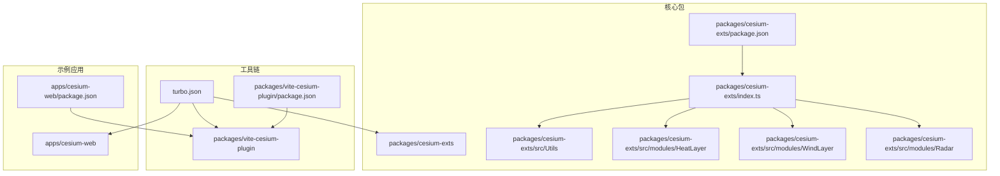
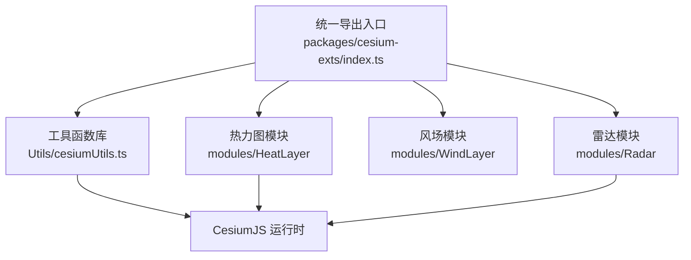
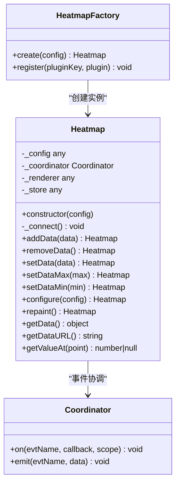
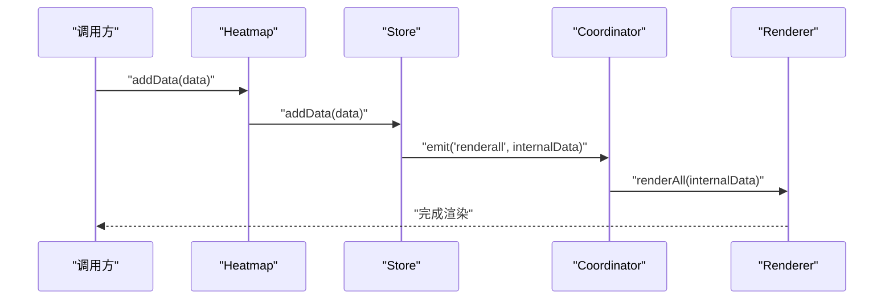
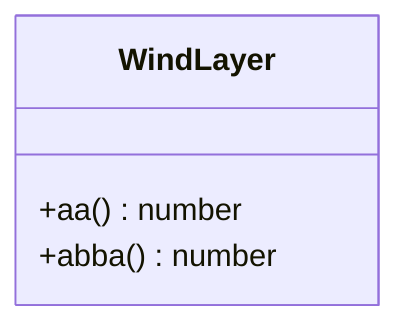
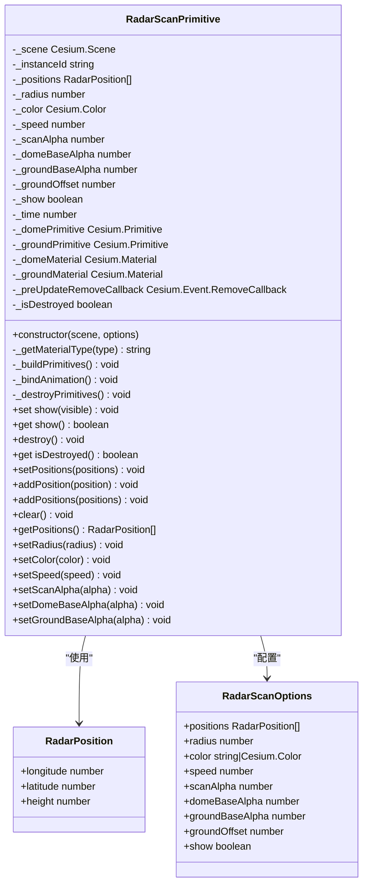
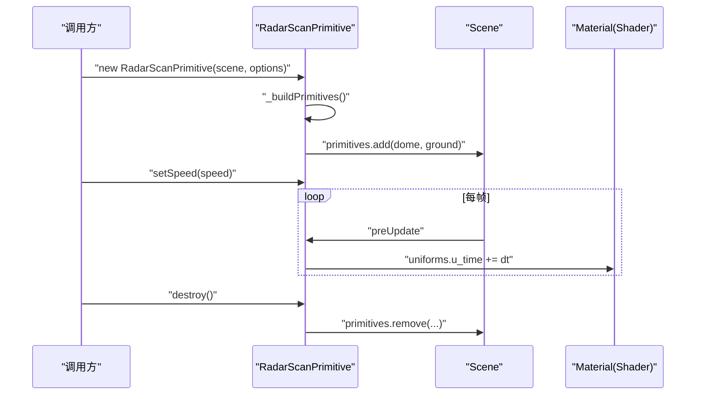
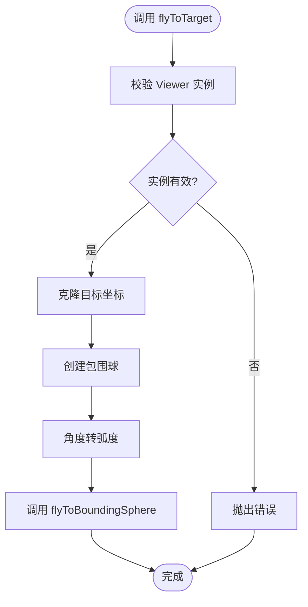
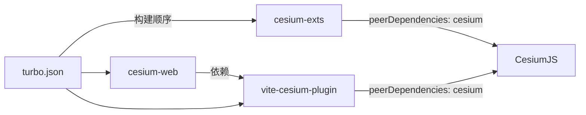

# 核心扩展库架构

<cite>
**本文档引用的文件**
- [packages/cesium-exts/package.json](file://packages/cesium-exts/package.json)
- [packages/cesium-exts/index.ts](file://packages/cesium-exts/index.ts)
- [packages/cesium-exts/src/Utils/cesiumUtils.ts](file://packages/cesium-exts/src/Utils/cesiumUtils.ts)
- [packages/cesium-exts/src/modules/HeatLayer/index.ts](file://packages/cesium-exts/src/modules/HeatLayer/index.ts)
- [packages/cesium-exts/src/modules/HeatLayer/src/core.ts](file://packages/cesium-exts/src/modules/HeatLayer/src/core.ts)
- [packages/cesium-exts/src/modules/WindLayer/index.ts](file://packages/cesium-exts/src/modules/WindLayer/index.ts)
- [packages/cesium-exts/src/modules/Radar/index.ts](file://packages/cesium-exts/src/modules/Radar/index.ts)
- [packages/vite-cesium-plugin/package.json](file://packages/vite-cesium-plugin/package.json)
- [apps/cesium-web/package.json](file://apps/cesium-web/package.json)
- [turbo.json](file://turbo.json)
</cite>

## 目录

1. [引言](#引言)
2. [项目结构](#项目结构)
3. [核心组件](#核心组件)
4. [架构总览](#架构总览)
5. [详细组件分析](#详细组件分析)
6. [依赖分析](#依赖分析)
7. [性能考量](#性能考量)
8. [故障排查指南](#故障排查指南)
9. [结论](#结论)
10. [附录](#附录)

## 引言

本文件面向 cesium-exts 核心扩展库，系统性阐述其模块化组织、设计模式与与 CesiumJS 的集成机制。重点覆盖以下方面：

- 热力图（HeatLayer）与风场（WindLayer）等可视化模块的架构设计与数据流
- 工具函数库（Utils）的组织结构与 API 设计原则
- 类型定义管理与导出接口规范
- 与 CesiumJS 的集成方式与扩展机制
- 模块间依赖关系、数据流向与性能优化策略
- 扩展新功能的开发指南与最佳实践

## 项目结构

仓库采用 monorepo 结构，核心包为 cesium-exts，配套 Vite 插件 vite-cesium-plugin，以及示例应用 cesium-web。

图表来源

- [packages/cesium-exts/package.json:1-48](file://packages/cesium-exts/package.json#L1-L48)
- [packages/cesium-exts/index.ts:1-4](file://packages/cesium-exts/index.ts#L1-L4)
- [packages/vite-cesium-plugin/package.json:1-40](file://packages/vite-cesium-plugin/package.json#L1-L40)
- [apps/cesium-web/package.json:1-51](file://apps/cesium-web/package.json#L1-L51)
- [turbo.json:1-16](file://turbo.json#L1-L16)

章节来源

- [packages/cesium-exts/package.json:1-48](file://packages/cesium-exts/package.json#L1-L48)
- [packages/cesium-exts/index.ts:1-4](file://packages/cesium-exts/index.ts#L1-L4)
- [turbo.json:1-16](file://turbo.json#L1-L16)

## 核心组件

- 导出入口：通过统一入口导出 Utils、HeatLayer、Radar、WindLayer，便于使用者按需引入与 Tree-shaking。
- 工具函数库（Utils）：提供与 Cesium 版本查询、相机平滑飞行等通用能力，封装 Viewer 操作，降低上层复杂度。
- 可视化模块：
  - HeatLayer：基于内部核心模块（core）实现热力图渲染与数据管理，具备插件化扩展能力。
  - WindLayer：当前仅提供占位实现，后续可扩展为基于 Cesium 的风场可视化。
  - Radar：基于 Cesium Scene 的高性能雷达扫描图元，采用自定义 Shader 与批量几何体渲染，支持多实例与动态配置。

章节来源

- [packages/cesium-exts/index.ts:1-4](file://packages/cesium-exts/index.ts#L1-L4)
- [packages/cesium-exts/src/Utils/cesiumUtils.ts:1-106](file://packages/cesium-exts/src/Utils/cesiumUtils.ts#L1-L106)
- [packages/cesium-exts/src/modules/HeatLayer/index.ts:1-13](file://packages/cesium-exts/src/modules/HeatLayer/index.ts#L1-L13)
- [packages/cesium-exts/src/modules/WindLayer/index.ts:1-10](file://packages/cesium-exts/src/modules/WindLayer/index.ts#L1-L10)
- [packages/cesium-exts/src/modules/Radar/index.ts:1-439](file://packages/cesium-exts/src/modules/Radar/index.ts#L1-L439)

## 架构总览

整体架构遵循“统一入口 + 模块化子包”的组织方式，核心库以 Cesium 为 peerDependencies，通过 Vite 插件在构建阶段正确解析 Cesium 依赖，确保运行时可用。

图表来源

- [packages/cesium-exts/index.ts:1-4](file://packages/cesium-exts/index.ts#L1-L4)
- [packages/cesium-exts/src/Utils/cesiumUtils.ts:1-106](file://packages/cesium-exts/src/Utils/cesiumUtils.ts#L1-L106)
- [packages/cesium-exts/src/modules/HeatLayer/index.ts:1-13](file://packages/cesium-exts/src/modules/HeatLayer/index.ts#L1-L13)
- [packages/cesium-exts/src/modules/Radar/index.ts:1-439](file://packages/cesium-exts/src/modules/Radar/index.ts#L1-L439)

## 详细组件分析

### 热力图（HeatLayer）架构

HeatLayer 采用“工厂 + 核心类 + 插件注册”的设计，核心类 Heatmap 负责配置合并、事件协调、存储与渲染器连接；支持插件化扩展，便于替换渲染器与存储实现。

图表来源

- [packages/cesium-exts/src/modules/HeatLayer/src/core.ts:9-227](file://packages/cesium-exts/src/modules/HeatLayer/src/core.ts#L9-L227)

数据流与处理逻辑（HeatLayer）

- 配置合并：构造时将用户配置与默认配置合并，支持插件选择。
- 事件协调：通过 Coordinator 在 Store 与 Renderer 之间传递事件（如渲染、极值变化）。
- 存储与渲染：Store 负责数据管理，Renderer 负责绘制；通过事件驱动重绘。
- 外部接口：提供 addData、setData、configure、repaint 等链式 API。

图表来源

- [packages/cesium-exts/src/modules/HeatLayer/src/core.ts:109-172](file://packages/cesium-exts/src/modules/HeatLayer/src/core.ts#L109-L172)

章节来源

- [packages/cesium-exts/src/modules/HeatLayer/index.ts:1-13](file://packages/cesium-exts/src/modules/HeatLayer/index.ts#L1-L13)
- [packages/cesium-exts/src/modules/HeatLayer/src/core.ts:1-227](file://packages/cesium-exts/src/modules/HeatLayer/src/core.ts#L1-L227)

### 风场（WindLayer）架构

当前实现为占位类，提供简单方法返回固定值。建议后续扩展为基于 Cesium 的粒子系统或纹理动画，结合风场数据源（如气象网格）进行渲染。

图表来源

- [packages/cesium-exts/src/modules/WindLayer/index.ts:1-10](file://packages/cesium-exts/src/modules/WindLayer/index.ts#L1-L10)

章节来源

- [packages/cesium-exts/src/modules/WindLayer/index.ts:1-10](file://packages/cesium-exts/src/modules/WindLayer/index.ts#L1-L10)

### 雷达（Radar）架构

RadarScanPrimitive 是高性能雷达扫描图元，采用 Cesium 的几何体合并与自定义 Shader 技术，支持多实例、独立透明度控制与实时动画。

图表来源

- [packages/cesium-exts/src/modules/Radar/index.ts:6-438](file://packages/cesium-exts/src/modules/Radar/index.ts#L6-L438)

渲染管线与动画流程（Radar）

- 几何体构建：根据半径与位置生成批量 GeometryInstance，并注入自定义 Shader。
- 材质与着色器：分别为“半球罩”和“地面底盘”定义独立 GLSL 着色器，支持扫描动画与边缘发光效果。
- 动画绑定：通过 preUpdate 事件递增时间参数，驱动 Shader uniform 更新。
- 生命周期：支持显示/隐藏、销毁、清空等操作，避免显存泄漏。

图表来源

- [packages/cesium-exts/src/modules/Radar/index.ts:118-263](file://packages/cesium-exts/src/modules/Radar/index.ts#L118-L263)

章节来源

- [packages/cesium-exts/src/modules/Radar/index.ts:1-439](file://packages/cesium-exts/src/modules/Radar/index.ts#L1-L439)

### 工具函数库（Utils）组织与 API 设计

- 版本查询：提供 cesiumVersion 与 cesiumExtsVersion，便于运行时诊断与兼容性检查。
- 相机控制：flyToTarget 封装 flyToBoundingSphere，支持半径、航向、俯仰、距离与动画时长配置，抛出明确错误提示。
- 导出策略：默认导出包含上述函数的对象，便于按需引入或全量导入。

图表来源

- [packages/cesium-exts/src/Utils/cesiumUtils.ts:71-103](file://packages/cesium-exts/src/Utils/cesiumUtils.ts#L71-L103)

章节来源

- [packages/cesium-exts/src/Utils/cesiumUtils.ts:1-106](file://packages/cesium-exts/src/Utils/cesiumUtils.ts#L1-L106)

## 依赖分析

- 依赖关系
  - cesium-exts 以 Cesium 为 peerDependencies，避免重复打包，降低体积。
  - 示例应用 cesium-web 依赖 vite-cesium-plugin，确保在 Vite 中正确解析 Cesium。
  - turbo.json 定义构建任务依赖与输入输出，保证 monorepo 构建顺序。
- 导出与入口
  - 统一入口 index.ts 导出 Utils、HeatLayer、Radar、WindLayer，便于 Tree-shaking 与按需加载。
  - vite-cesium-plugin 提供全局变量映射与静态资源服务，辅助开发与生产环境。

图表来源

- [packages/cesium-exts/package.json:27-29](file://packages/cesium-exts/package.json#L27-L29)
- [apps/cesium-web/package.json:12-28](file://apps/cesium-web/package.json#L12-L28)
- [packages/vite-cesium-plugin/package.json:33-38](file://packages/vite-cesium-plugin/package.json#L33-L38)
- [turbo.json:1-16](file://turbo.json#L1-L16)

章节来源

- [packages/cesium-exts/package.json:27-29](file://packages/cesium-exts/package.json#L27-L29)
- [apps/cesium-web/package.json:12-28](file://apps/cesium-web/package.json#L12-L28)
- [packages/vite-cesium-plugin/package.json:33-38](file://packages/vite-cesium-plugin/package.json#L33-L38)
- [turbo.json:1-16](file://turbo.json#L1-L16)

## 性能考量

- 雷达模块
  - 批量几何体合并：通过 GeometryInstance 合并减少 draw call，提升渲染效率。
  - 自定义 Shader：在 GPU 层面完成扫描动画与发光效果，避免 CPU 端密集计算。
  - 动画节流：仅在可见且非零速度时累加时间，节省性能。
  - 显存管理：提供 destroy 与 clear 方法，及时移除图元与材质，防止泄漏。
- 热力图模块
  - 事件驱动渲染：通过 Coordinator 触发局部/全量重绘，避免不必要的重绘。
  - 插件化：可替换渲染器与存储，按需选择高效实现。
- 工具函数
  - flyToTarget 使用 flyToBoundingSphere，避免手动复杂相机变换带来的性能损耗。

章节来源

- [packages/cesium-exts/src/modules/Radar/index.ts:118-263](file://packages/cesium-exts/src/modules/Radar/index.ts#L118-L263)
- [packages/cesium-exts/src/modules/HeatLayer/src/core.ts:80-102](file://packages/cesium-exts/src/modules/HeatLayer/src/core.ts#L80-L102)
- [packages/cesium-exts/src/Utils/cesiumUtils.ts:71-103](file://packages/cesium-exts/src/Utils/cesiumUtils.ts#L71-L103)

## 故障排查指南

- Cesium 未正确解析
  - 确认示例应用依赖了 vite-cesium-plugin，并在构建配置中启用。
  - 检查 peerDependencies 与实际安装的 Cesium 版本是否匹配。
- 雷达图元不显示或闪烁
  - 检查 show 与 speed 配置，确认未被设为不可见或零速度。
  - 确认 groundOffset 与地形高度一致，避免深度冲突。
  - 调用 destroy 后需重新构建图元，避免复用已销毁实例。
- 热力图渲染异常
  - 确认数据格式与范围配置（min/max），必要时调用 setDataMin/SetDataMax。
  - 使用 repaint 触发重绘，或在数据变更后重新 addData。
- 版本信息获取失败
  - 确保运行时存在 Cesium 全局版本号，或检查打包配置是否暴露全局变量。

章节来源

- [apps/cesium-web/package.json:28-28](file://apps/cesium-web/package.json#L28-L28)
- [packages/vite-cesium-plugin/package.json:33-38](file://packages/vite-cesium-plugin/package.json#L33-L38)
- [packages/cesium-exts/src/modules/Radar/index.ts:285-322](file://packages/cesium-exts/src/modules/Radar/index.ts#L285-L322)
- [packages/cesium-exts/src/modules/HeatLayer/src/core.ts:128-151](file://packages/cesium-exts/src/modules/HeatLayer/src/core.ts#L128-L151)
- [packages/cesium-exts/src/Utils/cesiumUtils.ts:16-33](file://packages/cesium-exts/src/Utils/cesiumUtils.ts#L16-L33)

## 结论

cesium-exts 以统一入口与模块化组织为核心，结合 Cesium 的强大渲染能力，提供了可扩展的可视化组件体系。热力图模块具备插件化扩展潜力，雷达模块实现了高性能的扫描特效，工具函数库则提供了实用的运行时能力。通过 Vite 插件与 monorepo 工作流，项目在开发体验与构建效率上得到保障。

## 附录

### 类型定义与导出规范

- 统一入口导出：index.ts 聚合导出 Utils、HeatLayer、Radar、WindLayer，便于 Tree-shaking。
- 模块内部类型：Radar 模块提供 RadarPosition、RadarScanOptions 等接口，确保参数与行为清晰。
- 版本信息：通过 package.json 与 Cesium 全局变量获取版本，便于诊断与兼容性判断。

章节来源

- [packages/cesium-exts/index.ts:1-4](file://packages/cesium-exts/index.ts#L1-L4)
- [packages/cesium-exts/src/modules/Radar/index.ts:6-37](file://packages/cesium-exts/src/modules/Radar/index.ts#L6-L37)
- [packages/cesium-exts/src/Utils/cesiumUtils.ts:16-33](file://packages/cesium-exts/src/Utils/cesiumUtils.ts#L16-L33)

### 开发指南与最佳实践

- 扩展新模块
  - 在 modules 下新建目录，提供 index.ts 作为导出入口与核心实现。
  - 如需插件化，参考 HeatLayer 的工厂与插件注册机制。
- 与 Cesium 集成
  - 保持 peerDependencies 与示例应用一致，确保运行时可用。
  - 使用 Scene、Primitive、Material、Geometry 等核心对象，遵循生命周期管理（添加/移除）。
- 性能优化
  - 优先使用批量几何体与自定义 Shader。
  - 控制动画频率与可见性，避免无效计算。
  - 及时销毁不再使用的图元与材质，防止内存泄漏。
- 构建与发布
  - 使用 turbo.json 管理构建任务依赖。
  - 通过 vite-cesium-plugin 在 Vite 项目中正确解析 Cesium。

章节来源

- [packages/cesium-exts/src/modules/HeatLayer/src/core.ts:208-227](file://packages/cesium-exts/src/modules/HeatLayer/src/core.ts#L208-L227)
- [packages/cesium-exts/src/modules/Radar/index.ts:305-315](file://packages/cesium-exts/src/modules/Radar/index.ts#L305-L315)
- [turbo.json:1-16](file://turbo.json#L1-L16)
- [packages/vite-cesium-plugin/package.json:1-40](file://packages/vite-cesium-plugin/package.json#L1-L40)
