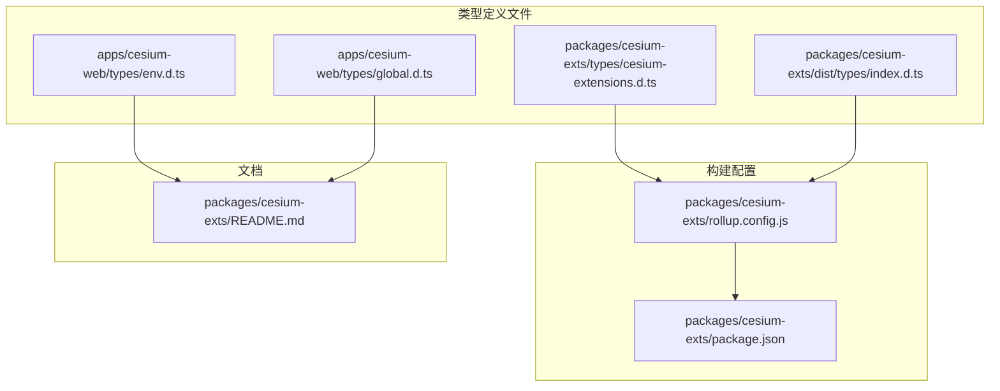
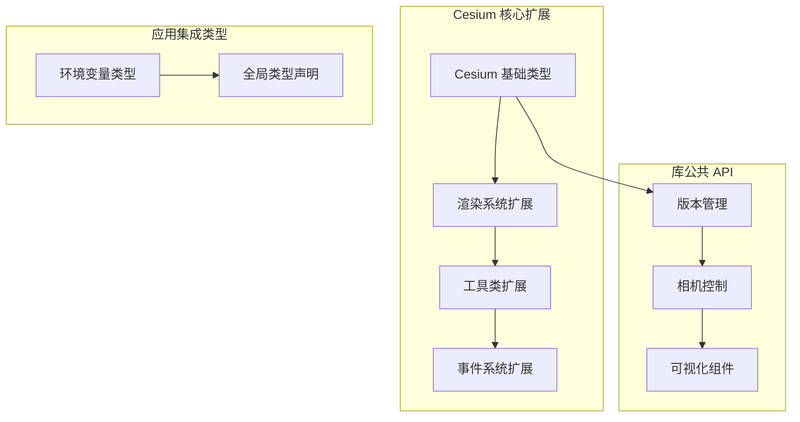
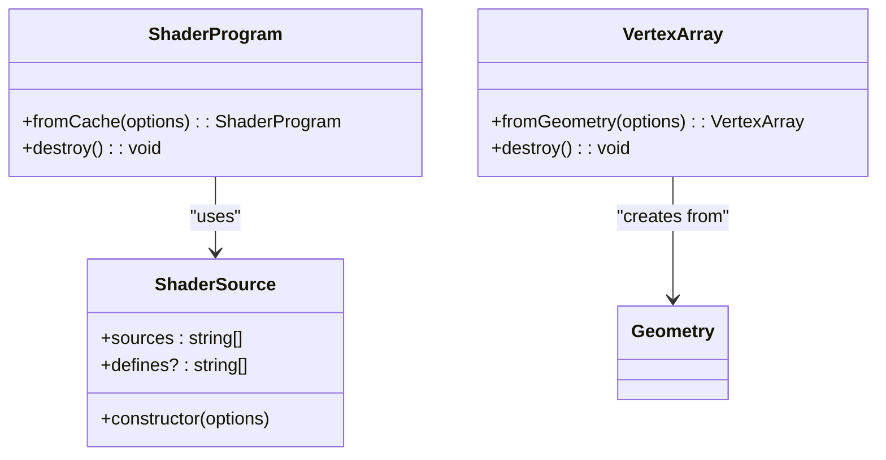
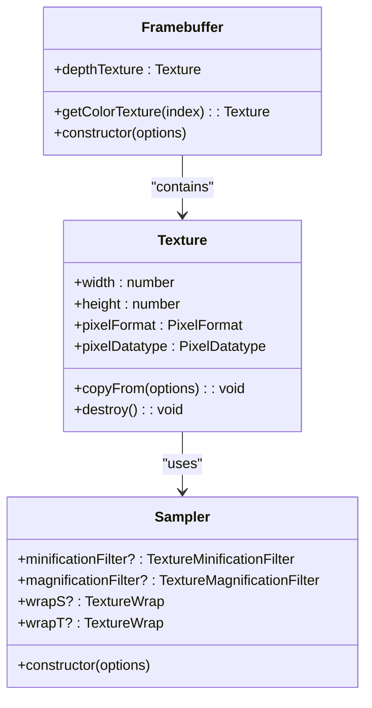
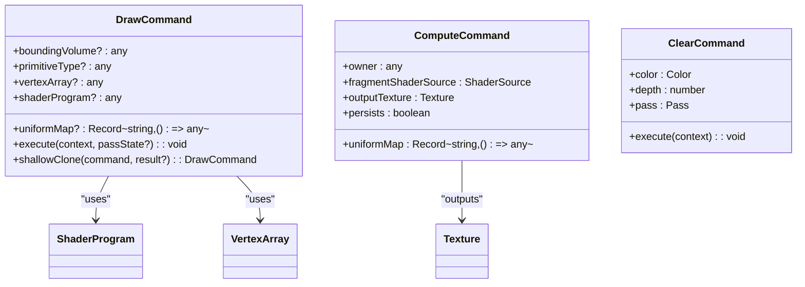
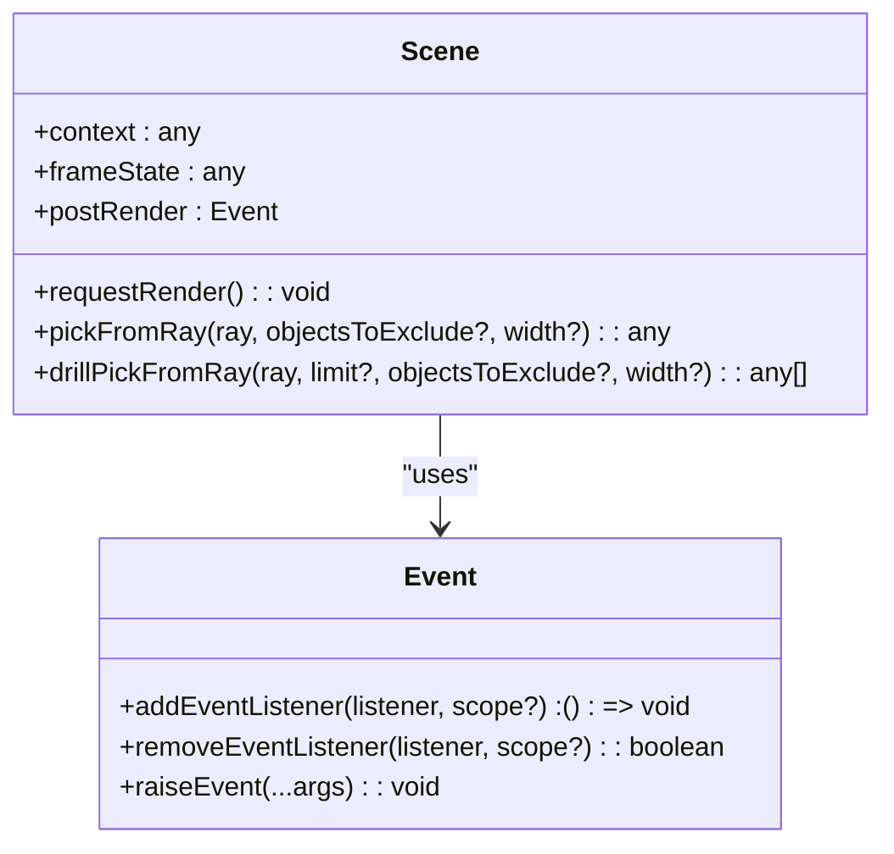
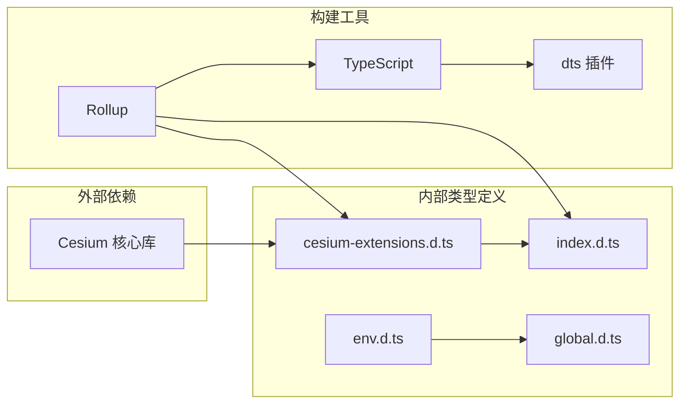
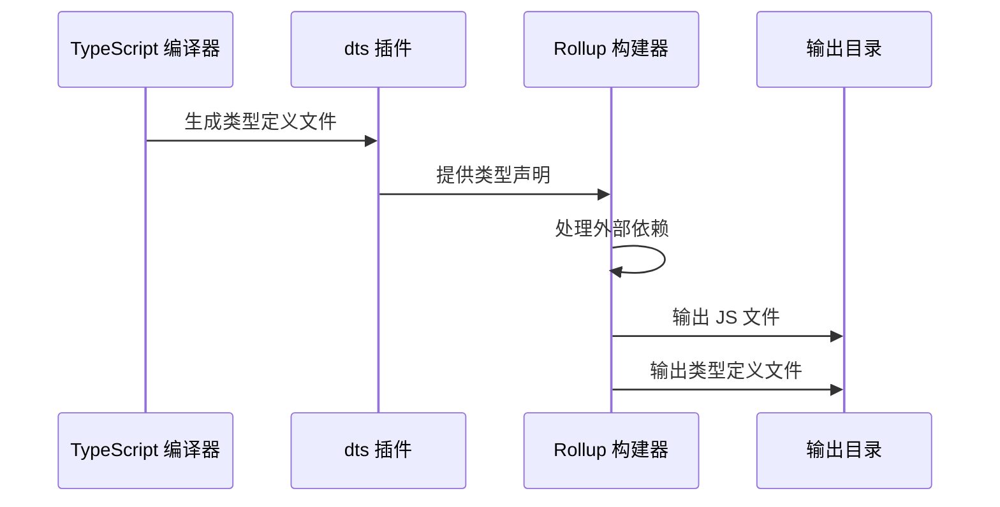

# 类型定义管理

<cite>
**本文档引用的文件**
- [cesium-extensions.d.ts](file://packages/cesium-exts/types/cesium-extensions.d.ts)
- [index.d.ts](file://packages/cesium-exts/dist/types/index.d.ts)
- [package.json](file://packages/cesium-exts/package.json)
- [rollup.config.js](file://packages/cesium-exts/rollup.config.js)
- [env.d.ts](file://apps/cesium-web/types/env.d.ts)
- [global.d.ts](file://apps/cesium-web/types/global.d.ts)
- [README.md](file://packages/cesium-exts/README.md)
</cite>

## 目录

1. [简介](#简介)
2. [项目结构](#项目结构)
3. [核心组件](#核心组件)
4. [架构概览](#架构概览)
5. [详细组件分析](#详细组件分析)
6. [依赖分析](#依赖分析)
7. [性能考虑](#性能考虑)
8. [故障排除指南](#故障排除指南)
9. [结论](#结论)
10. [附录](#附录)

## 简介

cesium-exts 是一个基于 Cesium v1.141.0 开发的扩展引擎核心库，专注于地理可视化组件的 TypeScript 类型定义管理。该项目通过精心设计的类型系统，为开发者提供了完整的类型安全保障，涵盖了底层渲染 API、工具类、数据类型、事件系统等多个方面。

本项目的核心价值在于其完善的类型定义体系，不仅提供了对外的公共 API 类型，还包含了对内部实现细节的精确描述。通过模块化的类型组织方式，开发者可以清晰地区分公共接口和内部实现，确保了良好的 API 设计原则和类型安全性。

## 项目结构

项目采用 monorepo 结构，主要包含以下类型定义相关的关键文件：



**图表来源**

- [cesium-extensions.d.ts:1-869](file://packages/cesium-exts/types/cesium-extensions.d.ts#L1-L869)
- [index.d.ts:1-346](file://packages/cesium-exts/dist/types/index.d.ts#L1-L346)
- [rollup.config.js:1-123](file://packages/cesium-exts/rollup.config.js#L1-L123)

**章节来源**

- [package.json:1-48](file://packages/cesium-exts/package.json#L1-L48)
- [README.md:1-30](file://packages/cesium-exts/README.md#L1-L30)

## 核心组件

### Cesium 扩展类型定义

项目的核心类型定义位于 `cesium-extensions.d.ts` 文件中，该文件通过模块声明的方式扩展了 Cesium 库的类型定义。主要包含以下核心组件：

#### 渲染系统类型

- **着色器管理**：ShaderSource 和 ShaderProgram 类，提供 GLSL 着色器源代码管理和程序生命周期管理
- **缓冲区操作**：VertexArray 类，封装顶点缓冲区和顶点属性绑定关系
- **纹理处理**：Texture、Sampler、Framebuffer 类，支持多种像素格式和纹理操作
- **渲染命令**：DrawCommand、ComputeCommand、ClearCommand 类，实现底层渲染指令

#### 数据类型系统

- **组件数据类型**：ComponentDatatype 枚举，定义顶点属性的数据类型
- **像素格式**：PixelFormat、PixelDatatype 枚举，支持 RGBA 格式和多种数据类型
- **纹理过滤**：TextureWrap、TextureMinificationFilter、TextureMagnificationFilter 枚举

#### 事件系统

- **事件对象**：Event 类，实现观察者模式的事件系统，支持监听器的动态添加和移除

**章节来源**

- [cesium-extensions.d.ts:11-800](file://packages/cesium-exts/types/cesium-extensions.d.ts#L11-L800)

### 库公共 API 类型

在 `dist/types/index.d.ts` 文件中，定义了库的公共 API 类型，主要包括：

#### 版本管理函数

- `cesiumVersion()`：获取 Cesium 库版本号
- `cesiumExtsVersion()`：获取 cesium-exts 库版本号

#### 相机控制函数

- `flyToTarget()`：实现平滑的相机视角飞行到指定目标

#### 可视化组件类型

- **热力图组件**：Heatmap、HeatLayer 类，支持数据点管理和渲染
- **雷达扫描组件**：RadarScanPrimitive 类，实现高性能的立体雷达扫描效果
- **风场组件**：WindLayer 类，提供风场可视化功能

**章节来源**

- [index.d.ts:1-346](file://packages/cesium-exts/dist/types/index.d.ts#L1-L346)

## 架构概览

项目采用分层的类型定义架构，通过模块声明和接口定义实现了清晰的类型层次结构：



**图表来源**

- [cesium-extensions.d.ts:1-869](file://packages/cesium-exts/types/cesium-extensions.d.ts#L1-L869)
- [index.d.ts:1-346](file://packages/cesium-exts/dist/types/index.d.ts#L1-L346)
- [env.d.ts:1-16](file://apps/cesium-web/types/env.d.ts#L1-L16)

### 类型定义组织原则

项目遵循以下类型定义组织原则：

1. **模块化设计**：通过 `declare module "cesium"` 实现对 Cesium 库的扩展
2. **层次化结构**：按照渲染系统、数据类型、事件系统等维度组织类型
3. **公共与私有分离**：明确区分对外公共 API 和内部实现类型
4. **向后兼容性**：保持类型定义的稳定性，避免破坏性变更

## 详细组件分析

### 着色器系统类型分析

着色器系统是渲染管线的核心组件，提供了完整的着色器生命周期管理：



**图表来源**

- [cesium-extensions.d.ts:56-171](file://packages/cesium-exts/types/cesium-extensions.d.ts#L56-L171)

#### 着色器源代码管理

ShaderSource 类提供了模块化的着色器源代码管理能力，支持：

- 多个代码片段的组合
- 预处理器定义的管理
- 灵活的着色器程序构建

#### 着色器程序生命周期

ShaderProgram 类实现了智能缓存机制：

- 自动检测重复的着色器程序
- 避免重复编译，提升性能
- 统一的资源管理

**章节来源**

- [cesium-extensions.d.ts:36-171](file://packages/cesium-exts/types/cesium-extensions.d.ts#L36-L171)

### 纹理系统类型分析

纹理系统提供了完整的 GPU 资源管理能力：



**图表来源**

- [cesium-extensions.d.ts:289-363](file://packages/cesium-exts/types/cesium-extensions.d.ts#L289-L363)

#### 像素格式支持

项目支持多种像素格式和数据类型：

- RGBA 四通道格式
- 8位无符号整数和32位浮点数
- 灵活的纹理尺寸配置

#### 纹理采样器配置

Sampler 类提供了精细的纹理采样控制：

- 缩小和放大的过滤模式
- 多种环绕模式支持
- 可配置的采样参数

**章节来源**

- [cesium-extensions.d.ts:173-327](file://packages/cesium-exts/types/cesium-extensions.d.ts#L173-L327)

### 渲染命令系统类型分析

渲染命令系统是 Cesium 渲染管线的核心数据结构：



**图表来源**

- [cesium-extensions.d.ts:433-648](file://packages/cesium-exts/types/cesium-extensions.d.ts#L433-L648)

#### 图元类型定义

项目定义了多种图元类型：

- 点、线段、三角形等基本图元
- 适用于不同渲染需求的几何体类型
- 支持实例化渲染的优化

#### 渲染通道管理

Pass 枚举提供了渲染顺序控制：

- 不透明物体优先渲染
- 半透明物体的混合处理
- GPGPU 计算通道支持

**章节来源**

- [cesium-extensions.d.ts:365-409](file://packages/cesium-exts/types/cesium-extensions.d.ts#L365-L409)

### 事件系统类型分析

事件系统实现了观察者模式的松耦合消息传递：



**图表来源**

- [cesium-extensions.d.ts:685-795](file://packages/cesium-exts/types/cesium-extensions.d.ts#L685-L795)

#### 事件监听机制

Event 类提供了完整的事件管理：

- 动态添加和移除监听器
- 支持作用域绑定
- 按添加顺序触发事件

#### 场景接口设计

Scene 接口定义了核心渲染能力：

- WebGL 渲染上下文访问
- 帧状态管理和事件
- 射线拾取功能

**章节来源**

- [cesium-extensions.d.ts:661-795](file://packages/cesium-exts/types/cesium-extensions.d.ts#L661-L795)

## 依赖分析

### 类型定义依赖关系

项目类型定义之间的依赖关系体现了清晰的架构层次：



**图表来源**

- [rollup.config.js:1-123](file://packages/cesium-exts/rollup.config.js#L1-L123)
- [package.json:27-46](file://packages/cesium-exts/package.json#L27-L46)

### 构建流程分析

项目采用 Rollup 进行构建，类型定义生成流程如下：



**图表来源**

- [rollup.config.js:96-122](file://packages/cesium-exts/rollup.config.js#L96-L122)

**章节来源**

- [rollup.config.js:1-123](file://packages/cesium-exts/rollup.config.js#L1-L123)
- [package.json:1-48](file://packages/cesium-exts/package.json#L1-L48)

## 性能考虑

### 类型定义性能优化

项目在类型定义层面采用了多项性能优化策略：

1. **类型缓存机制**：通过 `fromCache` 方法实现对象复用
2. **智能资源管理**：统一的销毁方法避免内存泄漏
3. **枚举类型优化**：使用枚举替代字符串常量，提升类型安全
4. **泛型约束**：合理的泛型使用减少类型检查开销

### 运行时性能影响

类型定义对运行时性能的影响最小化：

- 编译时类型检查，运行时无额外开销
- 精确的类型约束避免运行时错误
- 智能的 API 设计减少不必要的类型转换

## 故障排除指南

### 常见类型定义问题

#### 类型不匹配错误

当遇到类型不匹配错误时，检查以下方面：

- 确认使用的 Cesium 版本与类型定义兼容
- 验证导入路径和模块声明
- 检查接口实现是否完整

#### 构建失败问题

构建过程中常见的类型定义问题：

- 缺少必要的类型声明文件
- 模块解析配置错误
- 外部依赖版本不兼容

**章节来源**

- [env.d.ts:1-16](file://apps/cesium-web/types/env.d.ts#L1-L16)
- [global.d.ts:1-8](file://apps/cesium-web/types/global.d.ts#L1-L8)

## 结论

cesium-exts 项目的类型定义管理体系展现了现代 TypeScript 项目的最佳实践。通过模块化的类型组织、清晰的 API 设计和完善的构建流程，项目为开发者提供了可靠的类型安全保障。

### 主要成就

1. **完整的类型覆盖**：从底层渲染 API 到高层应用接口的全面类型定义
2. **优秀的架构设计**：清晰的模块边界和合理的类型层次结构
3. **完善的工具链**：自动化构建和类型生成流程
4. **良好的扩展性**：为未来功能扩展预留了充足的空间

### 未来发展

项目在类型定义管理方面的优势将为其长期发展奠定坚实基础，为地理可视化领域提供更加可靠和易用的开发体验。

## 附录

### 类型使用示例

#### 基础类型使用

```typescript
// 使用着色器源代码管理
const shaderSource = new Cesium.ShaderSource({
  sources: ["precision highp float;", "void main() {}"],
  defines: ["USE_LIGHTING"]
});

// 使用纹理采样器
const sampler = new Cesium.Sampler({
  minificationFilter: Cesium.TextureMinificationFilter.LINEAR,
  wrapS: Cesium.TextureWrap.REPEAT
});
```

#### 高级类型使用

```typescript
// 使用渲染命令
const drawCommand = new Cesium.DrawCommand({
  boundingVolume: boundingSphere,
  primitiveType: Cesium.PrimitiveType.TRIANGLES,
  shaderProgram: shaderProgram,
  uniformMap: {
    u_color: () => Cesium.Color.RED
  }
});

// 使用事件系统
const event = new Cesium.Event();
const removeListener = event.addEventListener((arg1, arg2) => {
  console.log("Event fired:", arg1, arg2);
});
```

### 最佳实践建议

1. **类型优先**：在开发过程中优先考虑类型安全
2. **模块化设计**：遵循模块化的类型组织原则
3. **向后兼容**：在进行类型变更时保持向后兼容性
4. **文档完善**：为复杂的类型定义提供详细的文档说明
