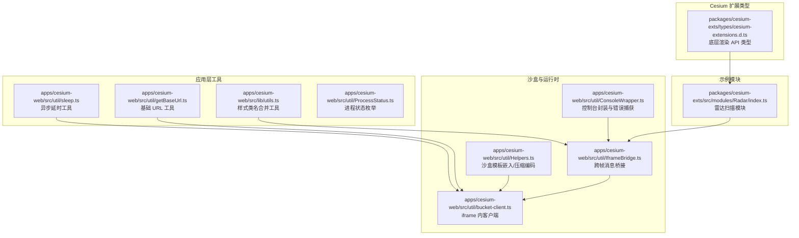
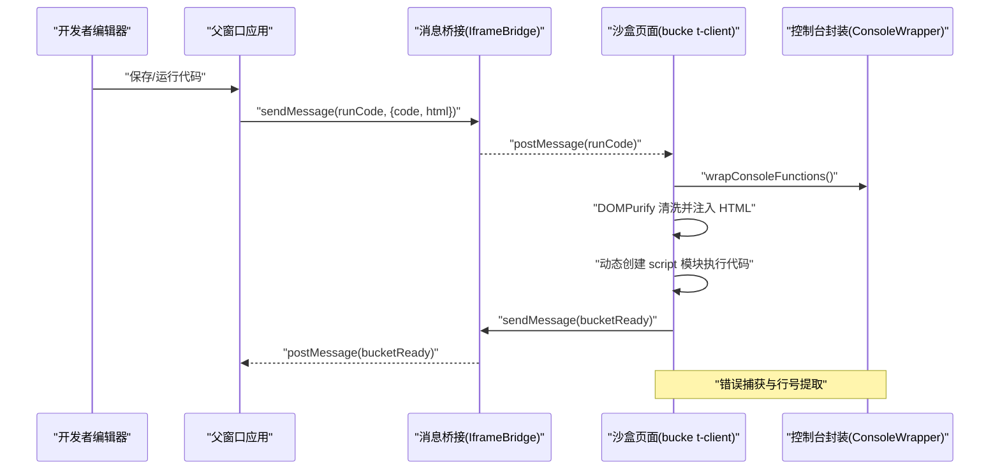
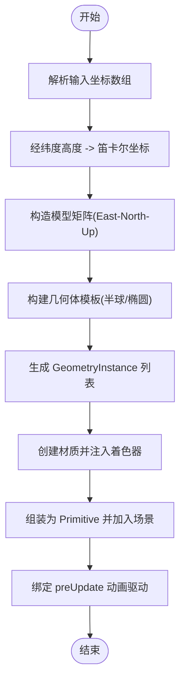
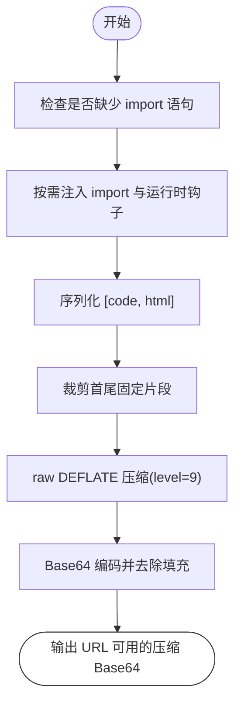
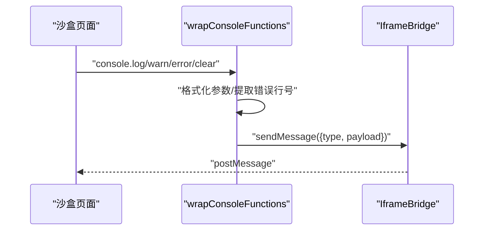
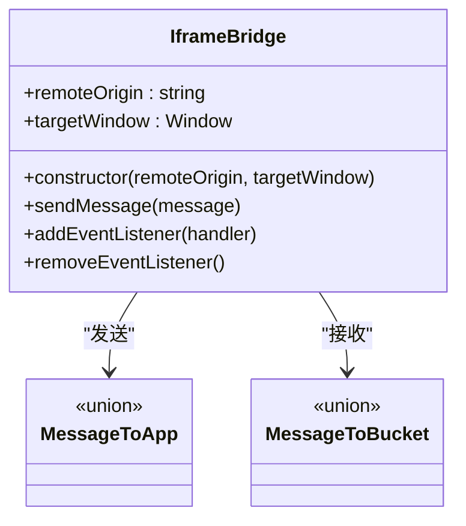
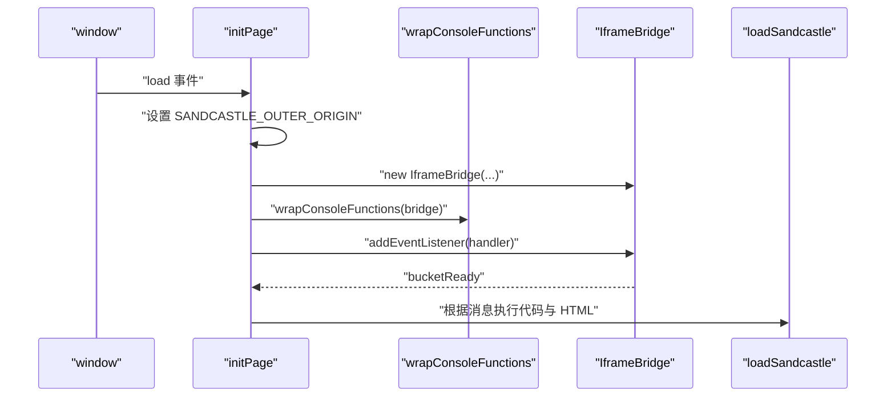
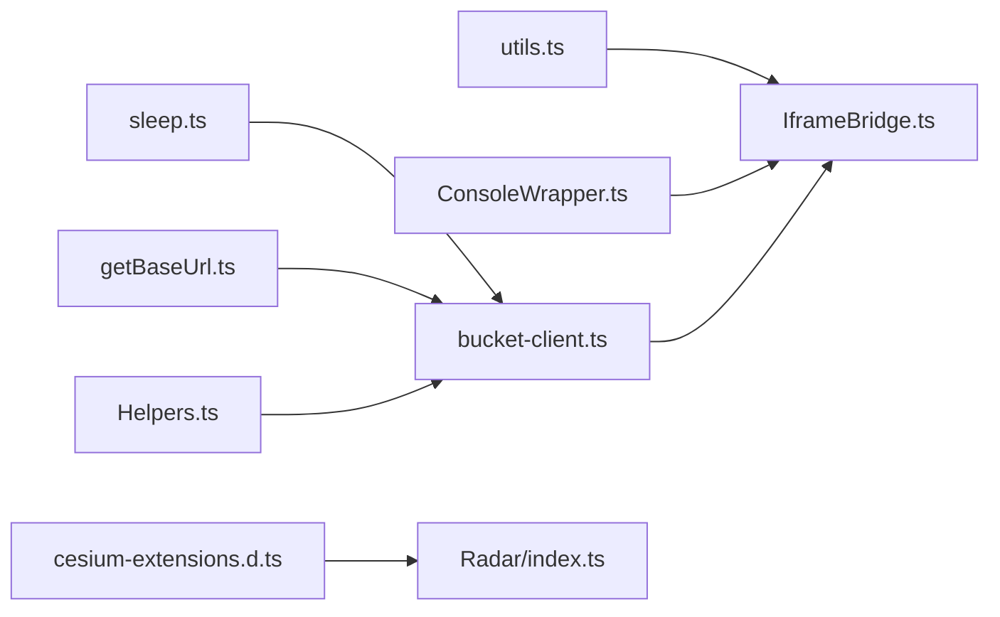

# 工具函数库 (Utils)

<cite>
**本文引用的文件**
- [apps/cesium-web/src/lib/utils.ts](file://apps/cesium-web/src/lib/utils.ts)
- [apps/cesium-web/src/util/Helpers.ts](file://apps/cesium-web/src/util/Helpers.ts)
- [apps/cesium-web/src/util/ConsoleWrapper.ts](file://apps/cesium-web/src/util/ConsoleWrapper.ts)
- [apps/cesium-web/src/util/IframeBridge.ts](file://apps/cesium-web/src/util/IframeBridge.ts)
- [apps/cesium-web/src/util/bucket-client.ts](file://apps/cesium-web/src/util/bucket-client.ts)
- [apps/cesium-web/src/util/sleep.ts](file://apps/cesium-web/src/util/sleep.ts)
- [apps/cesium-web/src/util/getBaseUrl.ts](file://apps/cesium-web/src/util/getBaseUrl.ts)
- [apps/cesium-web/src/util/ProcessStatus.ts](file://apps/cesium-web/src/util/ProcessStatus.ts)
- [apps/cesium-web/src/components/SandcastleEditor/SandcastleEditor.tsx](file://apps/cesium-web/src/components/SandcastleEditor/SandcastleEditor.tsx)
- [apps/cesium-web/src/components/SettingsDialog/SettingsDialog.tsx](file://apps/cesium-web/src/components/SettingsDialog/SettingsDialog.tsx)
- [packages/cesium-exts/src/modules/Radar/index.ts](file://packages/cesium-exts/src/modules/Radar/index.ts)
- [packages/cesium-exts/types/cesium-extensions.d.ts](file://packages/cesium-exts/types/cesium-extensions.d.ts)
</cite>

## 目录

1. [简介](#简介)
2. [项目结构](#项目结构)
3. [核心组件](#核心组件)
4. [架构总览](#架构总览)
5. [详细组件分析](#详细组件分析)
6. [依赖关系分析](#依赖关系分析)
7. [性能考量](#性能考量)
8. [故障排查指南](#故障排查指南)
9. [结论](#结论)
10. [附录](#附录)

## 简介

本文件面向 Cesium 开发者，系统化梳理并文档化工具函数库（Utils）中的辅助能力，涵盖：

- Cesium 工具函数集合与类型扩展
- 坐标转换与几何计算相关工具
- 数据处理与序列化/反序列化工具
- 控制台封装与沙盒（Sandcastle）运行时集成
- 跨帧消息桥接与 iframe 通信
- 常用开发模式与最佳实践
- 函数分类索引与快速查找指南

目标是帮助你在 Cesium 开发中高效使用这些工具，减少重复造轮子的成本，提升开发与调试效率。

## 项目结构

工具函数库主要分布在以下位置：

- 应用层工具：轻量级 UI/样式与通用工具
- 运行时与沙盒工具：控制台封装、消息桥接、沙盒代码打包与运行
- Cesium 扩展类型：底层渲染 API 的类型增强
- 示例模块：雷达扫描模块展示坐标转换、几何构建与着色器动画

**图表来源**

- [apps/cesium-web/src/lib/utils.ts:1-7](file://apps/cesium-web/src/lib/utils.ts#L1-L7)
- [apps/cesium-web/src/util/sleep.ts:1-17](file://apps/cesium-web/src/util/sleep.ts#L1-L17)
- [apps/cesium-web/src/util/getBaseUrl.ts:1-5](file://apps/cesium-web/src/util/getBaseUrl.ts#L1-L5)
- [apps/cesium-web/src/util/ProcessStatus.ts:1-21](file://apps/cesium-web/src/util/ProcessStatus.ts#L1-L21)
- [apps/cesium-web/src/util/Helpers.ts:18-36](file://apps/cesium-web/src/util/Helpers.ts#L18-L36)
- [apps/cesium-web/src/util/ConsoleWrapper.ts:254-296](file://apps/cesium-web/src/util/ConsoleWrapper.ts#L254-L296)
- [apps/cesium-web/src/util/IframeBridge.ts:78-183](file://apps/cesium-web/src/util/IframeBridge.ts#L78-L183)
- [apps/cesium-web/src/util/bucket-client.ts:62-87](file://apps/cesium-web/src/util/bucket-client.ts#L62-L87)
- [packages/cesium-exts/types/cesium-extensions.d.ts:1-622](file://packages/cesium-exts/types/cesium-extensions.d.ts#L1-L622)
- [packages/cesium-exts/src/modules/Radar/index.ts:1-439](file://packages/cesium-exts/src/modules/Radar/index.ts#L1-L439)

**章节来源**

- [apps/cesium-web/src/lib/utils.ts:1-7](file://apps/cesium-web/src/lib/utils.ts#L1-L7)
- [apps/cesium-web/src/util/Helpers.ts:18-36](file://apps/cesium-web/src/util/Helpers.ts#L18-L36)
- [apps/cesium-web/src/util/ConsoleWrapper.ts:254-296](file://apps/cesium-web/src/util/ConsoleWrapper.ts#L254-L296)
- [apps/cesium-web/src/util/IframeBridge.ts:78-183](file://apps/cesium-web/src/util/IframeBridge.ts#L78-L183)
- [apps/cesium-web/src/util/bucket-client.ts:62-87](file://apps/cesium-web/src/util/bucket-client.ts#L62-L87)
- [apps/cesium-web/src/util/sleep.ts:1-17](file://apps/cesium-web/src/util/sleep.ts#L1-L17)
- [apps/cesium-web/src/util/getBaseUrl.ts:1-5](file://apps/cesium-web/src/util/getBaseUrl.ts#L1-L5)
- [apps/cesium-web/src/util/ProcessStatus.ts:1-21](file://apps/cesium-web/src/util/ProcessStatus.ts#L1-L21)
- [packages/cesium-exts/types/cesium-extensions.d.ts:1-622](file://packages/cesium-exts/types/cesium-extensions.d.ts#L1-L622)
- [packages/cesium-exts/src/modules/Radar/index.ts:1-439](file://packages/cesium-exts/src/modules/Radar/index.ts#L1-L439)

## 核心组件

- 样式类名合并工具：提供简洁的类名合并与去重能力，便于在组件中动态拼接 Tailwind/CLSX 类名。
- 异步延时工具：基于 Promise 的 sleep，适合在异步流程中进行可控的暂停。
- 基础 URL 工具：生成不含查询与哈希的基础地址，便于分享或构建稳定链接。
- 进程状态枚举：统一的任务/流程状态表达，便于状态机与 UI 同步。
- 沙盒工具：自动补全 import、注入运行时钩子、压缩/解压沙盒存档数据。
- 控制台封装：统一格式化输出、错误行号提取、跨 iframe 错误上报。
- 跨帧消息桥接：类型安全的 postMessage 桥接，带来源校验与信封包装。
- iframe 客户端：在沙盒页面内建立桥接、包装控制台、接收运行指令并注入代码与 HTML。
- Cesium 类型扩展：底层渲染 API（着色器、顶点数组、绘制命令、计算命令等）的类型增强，便于 IDE 智能提示与类型约束。
- 雷达扫描模块：展示坐标转换、几何构建、材质与着色器动画的综合应用。

**章节来源**

- [apps/cesium-web/src/lib/utils.ts:4-6](file://apps/cesium-web/src/lib/utils.ts#L4-L6)
- [apps/cesium-web/src/util/sleep.ts:14-16](file://apps/cesium-web/src/util/sleep.ts#L14-L16)
- [apps/cesium-web/src/util/getBaseUrl.ts:1-5](file://apps/cesium-web/src/util/getBaseUrl.ts#L1-L5)
- [apps/cesium-web/src/util/ProcessStatus.ts:4-20](file://apps/cesium-web/src/util/ProcessStatus.ts#L4-L20)
- [apps/cesium-web/src/util/Helpers.ts:18-36](file://apps/cesium-web/src/util/Helpers.ts#L18-L36)
- [apps/cesium-web/src/util/ConsoleWrapper.ts:254-296](file://apps/cesium-web/src/util/ConsoleWrapper.ts#L254-L296)
- [apps/cesium-web/src/util/IframeBridge.ts:78-183](file://apps/cesium-web/src/util/IframeBridge.ts#L78-L183)
- [apps/cesium-web/src/util/bucket-client.ts:62-87](file://apps/cesium-web/src/util/bucket-client.ts#L62-L87)
- [packages/cesium-exts/types/cesium-extensions.d.ts:1-622](file://packages/cesium-exts/types/cesium-extensions.d.ts#L1-L622)
- [packages/cesium-exts/src/modules/Radar/index.ts:1-439](file://packages/cesium-exts/src/modules/Radar/index.ts#L1-L439)

## 架构总览

下图展示了沙盒运行与跨帧通信的整体流程，以及工具函数在其中的角色定位。

**图表来源**

- [apps/cesium-web/src/util/bucket-client.ts:62-87](file://apps/cesium-web/src/util/bucket-client.ts#L62-L87)
- [apps/cesium-web/src/util/ConsoleWrapper.ts:254-296](file://apps/cesium-web/src/util/ConsoleWrapper.ts#L254-L296)
- [apps/cesium-web/src/util/IframeBridge.ts:122-129](file://apps/cesium-web/src/util/IframeBridge.ts#L122-L129)

**章节来源**

- [apps/cesium-web/src/util/bucket-client.ts:62-87](file://apps/cesium-web/src/util/bucket-client.ts#L62-L87)
- [apps/cesium-web/src/util/ConsoleWrapper.ts:254-296](file://apps/cesium-web/src/util/ConsoleWrapper.ts#L254-L296)
- [apps/cesium-web/src/util/IframeBridge.ts:122-129](file://apps/cesium-web/src/util/IframeBridge.ts#L122-L129)

## 详细组件分析

### Cesium 工具函数集合与类型扩展

- 类型增强：提供底层渲染 API 的类型声明，包括着色器、顶点数组、绘制命令、计算命令等，便于在 TypeScript 中获得强类型支持与智能提示。
- 使用建议：
  - 在需要直接操作底层渲染管线时，优先使用这些类型增强，降低运行时风险。
  - 与 Cesium 官方 API 结合，构建可复用的渲染工具函数。

**章节来源**

- [packages/cesium-exts/types/cesium-extensions.d.ts:1-622](file://packages/cesium-exts/types/cesium-extensions.d.ts#L1-L622)

### 坐标转换与几何计算工具

- 雷达扫描模块展示了典型坐标转换与几何构建流程：
  - 将经纬度高度转换为笛卡尔坐标
  - 生成模型矩阵（基于东-北-上坐标系）
  - 构建半球与椭圆几何体并批量实例化
  - 通过材质与着色器实现扫描动画
- 关键点：
  - 使用 Cesium.Cartesian3.fromDegrees 进行地理坐标到笛卡尔的转换
  - 使用 Cesium.Transforms.eastNorthUpToFixedFrame 构造模型矩阵
  - 使用 GeometryInstance 批量渲染，减少绘制调用
  - 通过 uniform 参数驱动着色器动画

**图表来源**

- [packages/cesium-exts/src/modules/Radar/index.ts:137-160](file://packages/cesium-exts/src/modules/Radar/index.ts#L137-L160)
- [packages/cesium-exts/src/modules/Radar/index.ts:196-249](file://packages/cesium-exts/src/modules/Radar/index.ts#L196-L249)
- [packages/cesium-exts/src/modules/Radar/index.ts:254-263](file://packages/cesium-exts/src/modules/Radar/index.ts#L254-L263)

**章节来源**

- [packages/cesium-exts/src/modules/Radar/index.ts:137-160](file://packages/cesium-exts/src/modules/Radar/index.ts#L137-L160)
- [packages/cesium-exts/src/modules/Radar/index.ts:196-249](file://packages/cesium-exts/src/modules/Radar/index.ts#L196-L249)
- [packages/cesium-exts/src/modules/Radar/index.ts:254-263](file://packages/cesium-exts/src/modules/Radar/index.ts#L254-L263)

### 数据处理辅助函数

- 沙盒模板嵌入：自动补全 import 语句、注入运行时钩子，保证编辑器行号与执行行号一致。
- 压缩/解压存档：对沙盒代码与 HTML 进行 JSON 序列化、裁剪首尾、DEFLATE 压缩与 Base64 编码，便于 URL 分享与持久化。

**图表来源**

- [apps/cesium-web/src/util/Helpers.ts:18-36](file://apps/cesium-web/src/util/Helpers.ts#L18-L36)
- [apps/cesium-web/src/util/Helpers.ts:63-79](file://apps/cesium-web/src/util/Helpers.ts#L63-L79)
- [apps/cesium-web/src/util/Helpers.ts:100-136](file://apps/cesium-web/src/util/Helpers.ts#L100-L136)

**章节来源**

- [apps/cesium-web/src/util/Helpers.ts:18-36](file://apps/cesium-web/src/util/Helpers.ts#L18-L36)
- [apps/cesium-web/src/util/Helpers.ts:63-79](file://apps/cesium-web/src/util/Helpers.ts#L63-L79)
- [apps/cesium-web/src/util/Helpers.ts:100-136](file://apps/cesium-web/src/util/Helpers.ts#L100-L136)

### 控制台封装与错误捕获

- 统一格式化输出：支持对象、数组、函数、错误等多类型格式化，避免大对象日志膨胀。
- 错误行号提取：从错误堆栈中提取沙盒页面行号，便于定位问题。
- 跨 iframe 错误上报：将错误信息与行号通过桥接发送至父窗口，便于统一处理。

**图表来源**

- [apps/cesium-web/src/util/ConsoleWrapper.ts:254-296](file://apps/cesium-web/src/util/ConsoleWrapper.ts#L254-L296)
- [apps/cesium-web/src/util/IframeBridge.ts:149-169](file://apps/cesium-web/src/util/IframeBridge.ts#L149-L169)

**章节来源**

- [apps/cesium-web/src/util/ConsoleWrapper.ts:170-171](file://apps/cesium-web/src/util/ConsoleWrapper.ts#L170-L171)
- [apps/cesium-web/src/util/ConsoleWrapper.ts:254-296](file://apps/cesium-web/src/util/ConsoleWrapper.ts#L254-L296)
- [apps/cesium-web/src/util/IframeBridge.ts:149-169](file://apps/cesium-web/src/util/IframeBridge.ts#L149-L169)

### 跨帧消息桥接（IframeBridge）

- 类型安全：通过泛型约束消息方向，确保发送与接收类型一致。
- 来源校验：仅接受来自指定 origin 的消息，过滤无关流量。
- 信封包装：统一消息信封结构，避免第三方库干扰。
- 空操作保护：当目标窗口为当前窗口时，静默跳过，防止无限回环。

**图表来源**

- [apps/cesium-web/src/util/IframeBridge.ts:78-183](file://apps/cesium-web/src/util/IframeBridge.ts#L78-L183)

**章节来源**

- [apps/cesium-web/src/util/IframeBridge.ts:78-183](file://apps/cesium-web/src/util/IframeBridge.ts#L78-L183)

### iframe 客户端（bucket-client）

- 初始化：设置外部来源、建立桥接、包装控制台、注册消息监听。
- 代码执行：对 HTML 进行清理并注入，动态创建模块脚本执行用户代码。
- 状态通知：向父窗口发送“已就绪”消息，便于应用侧协调。

**图表来源**

- [apps/cesium-web/src/util/bucket-client.ts:62-87](file://apps/cesium-web/src/util/bucket-client.ts#L62-L87)

**章节来源**

- [apps/cesium-web/src/util/bucket-client.ts:62-87](file://apps/cesium-web/src/util/bucket-client.ts#L62-L87)

### 常用开发模式与最佳实践

- 使用 cn 合并类名：在组件中统一使用类名合并工具，避免重复与冲突。
- 使用 sleep 实现异步暂停：在复杂异步流程中，使用 sleep 进行可控延时。
- 使用 getBaseUrl 构建稳定链接：分享或构建资源地址时，避免查询与哈希干扰。
- 使用 ProcessStatus 管理流程状态：在长任务中统一状态表达，便于 UI 同步与调试。
- 沙盒存档压缩：在分享或持久化时，使用压缩/解压工具减少体积。
- 控制台统一格式化：在沙盒与应用间统一输出格式，便于调试与错误上报。
- 跨帧通信：始终使用 IframeBridge，确保类型安全与来源校验。

**章节来源**

- [apps/cesium-web/src/lib/utils.ts:4-6](file://apps/cesium-web/src/lib/utils.ts#L4-L6)
- [apps/cesium-web/src/util/sleep.ts:14-16](file://apps/cesium-web/src/util/sleep.ts#L14-L16)
- [apps/cesium-web/src/util/getBaseUrl.ts:1-5](file://apps/cesium-web/src/util/getBaseUrl.ts#L1-L5)
- [apps/cesium-web/src/util/ProcessStatus.ts:4-20](file://apps/cesium-web/src/util/ProcessStatus.ts#L4-L20)
- [apps/cesium-web/src/util/Helpers.ts:63-79](file://apps/cesium-web/src/util/Helpers.ts#L63-L79)
- [apps/cesium-web/src/util/ConsoleWrapper.ts:254-296](file://apps/cesium-web/src/util/ConsoleWrapper.ts#L254-L296)
- [apps/cesium-web/src/util/IframeBridge.ts:122-129](file://apps/cesium-web/src/util/IframeBridge.ts#L122-L129)

## 依赖关系分析

- 工具函数之间的耦合度低，职责清晰：
  - 应用层工具（样式、延时、URL、状态）彼此独立
  - 沙盒工具与 iframe 客户端紧密协作，形成闭环
  - Cesium 类型扩展为上层模块提供类型保障
- 潜在循环依赖：
  - 无直接循环依赖；沙盒工具与桥接工具通过消息传递间接交互
- 外部依赖：
  - 沙盒压缩使用 pako
  - DOMPurify 用于 HTML 清洗
  - clsx/tailwind-merge 用于类名合并

**图表来源**

- [apps/cesium-web/src/lib/utils.ts:4-6](file://apps/cesium-web/src/lib/utils.ts#L4-L6)
- [apps/cesium-web/src/util/IframeBridge.ts:78-183](file://apps/cesium-web/src/util/IframeBridge.ts#L78-L183)
- [apps/cesium-web/src/util/bucket-client.ts:62-87](file://apps/cesium-web/src/util/bucket-client.ts#L62-L87)
- [apps/cesium-web/src/util/Helpers.ts:63-79](file://apps/cesium-web/src/util/Helpers.ts#L63-L79)
- [apps/cesium-web/src/util/ConsoleWrapper.ts:254-296](file://apps/cesium-web/src/util/ConsoleWrapper.ts#L254-L296)
- [packages/cesium-exts/types/cesium-extensions.d.ts:1-622](file://packages/cesium-exts/types/cesium-extensions.d.ts#L1-L622)
- [packages/cesium-exts/src/modules/Radar/index.ts:1-439](file://packages/cesium-exts/src/modules/Radar/index.ts#L1-L439)

**章节来源**

- [apps/cesium-web/src/lib/utils.ts:4-6](file://apps/cesium-web/src/lib/utils.ts#L4-L6)
- [apps/cesium-web/src/util/IframeBridge.ts:78-183](file://apps/cesium-web/src/util/IframeBridge.ts#L78-L183)
- [apps/cesium-web/src/util/bucket-client.ts:62-87](file://apps/cesium-web/src/util/bucket-client.ts#L62-L87)
- [apps/cesium-web/src/util/Helpers.ts:63-79](file://apps/cesium-web/src/util/Helpers.ts#L63-L79)
- [apps/cesium-web/src/util/ConsoleWrapper.ts:254-296](file://apps/cesium-web/src/util/ConsoleWrapper.ts#L254-L296)
- [packages/cesium-exts/types/cesium-extensions.d.ts:1-622](file://packages/cesium-exts/types/cesium-extensions.d.ts#L1-L622)
- [packages/cesium-exts/src/modules/Radar/index.ts:1-439](file://packages/cesium-exts/src/modules/Radar/index.ts#L1-L439)

## 性能考量

- 批量渲染：使用 GeometryInstance 合并几何体，减少绘制调用次数。
- 动画驱动：在 preUpdate 中更新材质 uniform，避免每帧重建几何体。
- 压缩存档：使用 DEFLATE 压缩与 Base64 去填充，显著降低 URL 体积。
- 控制台输出：对大对象进行简化输出，避免日志膨胀影响性能。
- 资源注入：对 HTML 进行清洗与必要修复（如样式导入），减少浏览器异常带来的性能损耗。

[本节为通用指导，无需列出章节来源]

## 故障排查指南

- 沙盒页面无法执行：
  - 检查是否正确注入 import 与运行时钩子
  - 确认 URL 哈希中的压缩 Base64 是否完整
- 控制台输出缺失或行号不正确：
  - 确保 wrapConsoleFunctions 已在沙盒页面初始化
  - 检查错误堆栈中是否存在沙盒页面标识
- 跨帧通信无效：
  - 校验 remoteOrigin 与 targetWindow 配置
  - 确认消息信封结构与来源校验通过
- 雷达扫描不显示或闪烁：
  - 检查坐标转换与模型矩阵是否正确
  - 确认材质 uniform 是否更新
  - 避免频繁重建几何体，使用 setter 动态调整参数

**章节来源**

- [apps/cesium-web/src/util/Helpers.ts:18-36](file://apps/cesium-web/src/util/Helpers.ts#L18-L36)
- [apps/cesium-web/src/util/Helpers.ts:100-136](file://apps/cesium-web/src/util/Helpers.ts#L100-L136)
- [apps/cesium-web/src/util/ConsoleWrapper.ts:254-296](file://apps/cesium-web/src/util/ConsoleWrapper.ts#L254-L296)
- [apps/cesium-web/src/util/IframeBridge.ts:149-169](file://apps/cesium-web/src/util/IframeBridge.ts#L149-L169)
- [packages/cesium-exts/src/modules/Radar/index.ts:254-263](file://packages/cesium-exts/src/modules/Radar/index.ts#L254-L263)

## 结论

工具函数库围绕“易用、类型安全、可维护”的目标设计，覆盖了 Cesium 开发中的常见痛点：

- 通过类型增强与模块化工具，降低底层 API 使用成本
- 通过沙盒与桥接工具，实现安全、可控的代码执行与调试
- 通过统一的格式化与状态管理，提升开发体验与协作效率

建议在项目中遵循本文的最佳实践，结合具体模块（如雷达扫描）的学习，逐步扩展与完善工具函数库。

[本节为总结性内容，无需列出章节来源]

## 附录

### 函数分类索引与快速查找指南

- 应用层工具
  - 类名合并：cn(...) → [apps/cesium-web/src/lib/utils.ts:4-6](file://apps/cesium-web/src/lib/utils.ts#L4-L6)
  - 异步延时：sleep(ms) → [apps/cesium-web/src/util/sleep.ts:14-16](file://apps/cesium-web/src/util/sleep.ts#L14-L16)
  - 基础 URL：getBaseUrl() → [apps/cesium-web/src/util/getBaseUrl.ts:1-5](file://apps/cesium-web/src/util/getBaseUrl.ts#L1-L5)
  - 进程状态：ProcessStatus 枚举 → [apps/cesium-web/src/util/ProcessStatus.ts:4-20](file://apps/cesium-web/src/util/ProcessStatus.ts#L4-L20)
- 沙盒与运行时
  - 模板嵌入：embedInSandcastleTemplate(code, addExtraLine) → [apps/cesium-web/src/util/Helpers.ts:18-36](file://apps/cesium-web/src/util/Helpers.ts#L18-L36)
  - 压缩存档：makeCompressedBase64String(data) → [apps/cesium-web/src/util/Helpers.ts:63-79](file://apps/cesium-web/src/util/Helpers.ts#L63-L79)
  - 解压存档：decodeBase64Data(base64String) → [apps/cesium-web/src/util/Helpers.ts:100-136](file://apps/cesium-web/src/util/Helpers.ts#L100-L136)
  - 控制台封装：wrapConsoleFunctions(bridge) → [apps/cesium-web/src/util/ConsoleWrapper.ts:254-296](file://apps/cesium-web/src/util/ConsoleWrapper.ts#L254-L296)
  - 跨帧桥接：IframeBridge<ToApp, ToBucket> → [apps/cesium-web/src/util/IframeBridge.ts:78-183](file://apps/cesium-web/src/util/IframeBridge.ts#L78-L183)
  - iframe 客户端：initPage()/loadSandcastle(code, html) → [apps/cesium-web/src/util/bucket-client.ts:62-87](file://apps/cesium-web/src/util/bucket-client.ts#L62-L87)
- Cesium 类型扩展
  - 渲染 API 类型：VertexArray/DrawCommand/ComputeCommand 等 → [packages/cesium-exts/types/cesium-extensions.d.ts:1-622](file://packages/cesium-exts/types/cesium-extensions.d.ts#L1-L622)
- 示例模块
  - 雷达扫描：RadarScanPrimitive（坐标转换、几何构建、材质与动画）→ [packages/cesium-exts/src/modules/Radar/index.ts:1-439](file://packages/cesium-exts/src/modules/Radar/index.ts#L1-L439)

**章节来源**

- [apps/cesium-web/src/lib/utils.ts:4-6](file://apps/cesium-web/src/lib/utils.ts#L4-L6)
- [apps/cesium-web/src/util/sleep.ts:14-16](file://apps/cesium-web/src/util/sleep.ts#L14-L16)
- [apps/cesium-web/src/util/getBaseUrl.ts:1-5](file://apps/cesium-web/src/util/getBaseUrl.ts#L1-L5)
- [apps/cesium-web/src/util/ProcessStatus.ts:4-20](file://apps/cesium-web/src/util/ProcessStatus.ts#L4-L20)
- [apps/cesium-web/src/util/Helpers.ts:18-36](file://apps/cesium-web/src/util/Helpers.ts#L18-L36)
- [apps/cesium-web/src/util/Helpers.ts:63-79](file://apps/cesium-web/src/util/Helpers.ts#L63-L79)
- [apps/cesium-web/src/util/Helpers.ts:100-136](file://apps/cesium-web/src/util/Helpers.ts#L100-L136)
- [apps/cesium-web/src/util/ConsoleWrapper.ts:254-296](file://apps/cesium-web/src/util/ConsoleWrapper.ts#L254-L296)
- [apps/cesium-web/src/util/IframeBridge.ts:78-183](file://apps/cesium-web/src/util/IframeBridge.ts#L78-L183)
- [apps/cesium-web/src/util/bucket-client.ts:62-87](file://apps/cesium-web/src/util/bucket-client.ts#L62-L87)
- [packages/cesium-exts/types/cesium-extensions.d.ts:1-622](file://packages/cesium-exts/types/cesium-extensions.d.ts#L1-L622)
- [packages/cesium-exts/src/modules/Radar/index.ts:1-439](file://packages/cesium-exts/src/modules/Radar/index.ts#L1-L439)
