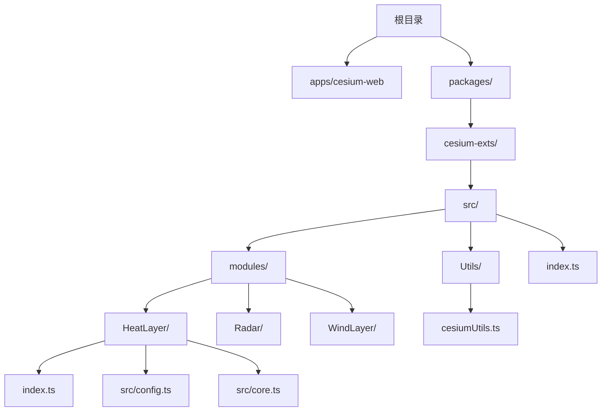
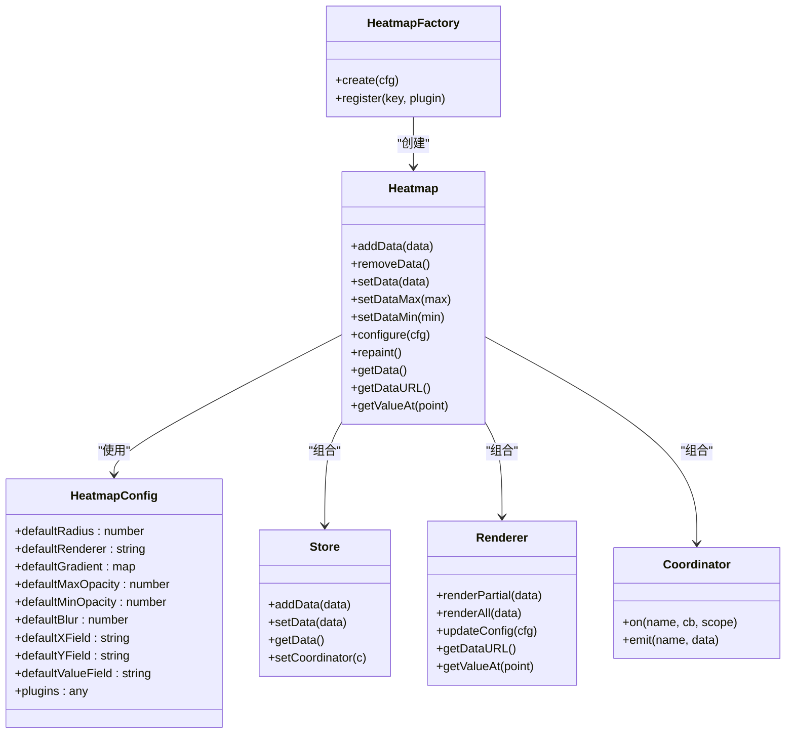
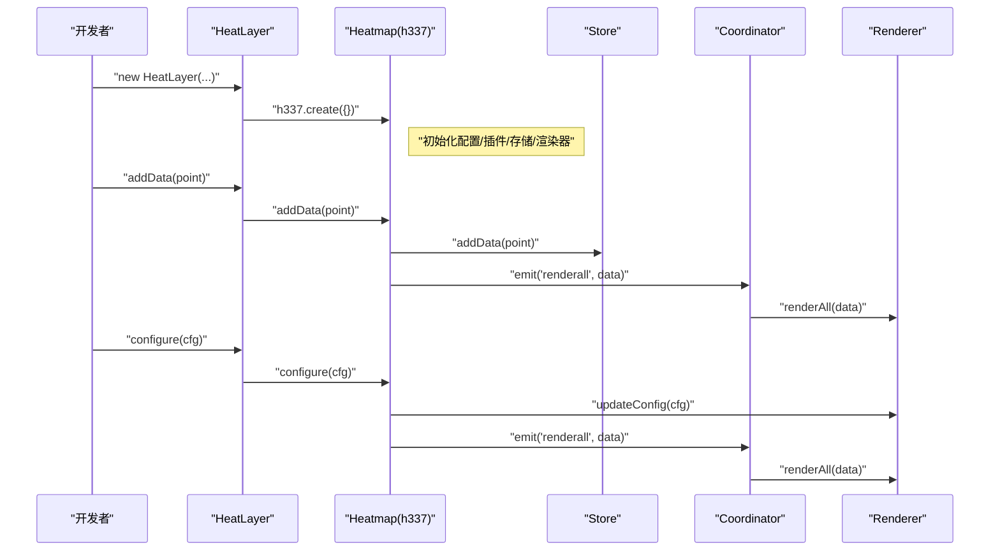
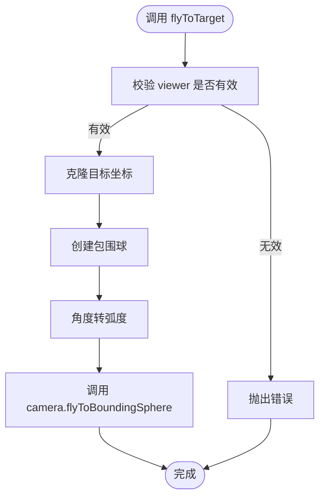
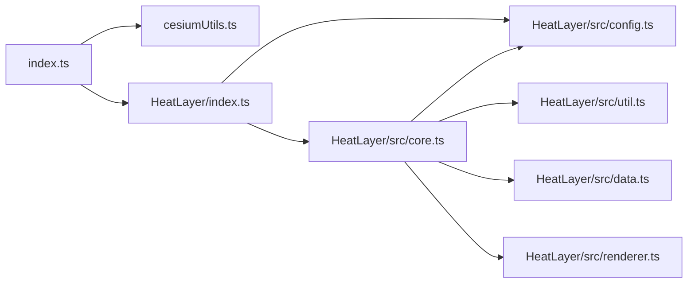

# 核心模块

<cite>
**本文引用的文件**
- [README.md](file://README.md)
- [package.json](file://packages/cesium-exts/package.json)
- [index.ts](file://packages/cesium-exts/index.ts)
- [cesiumUtils.ts](file://packages/cesium-exts/src/Utils/cesiumUtils.ts)
- [HeatLayer/index.ts](file://packages/cesium-exts/src/modules/HeatLayer/index.ts)
- [HeatLayer/config.ts](file://packages/cesium-exts/src/modules/HeatLayer/src/config.ts)
- [HeatLayer/core.ts](file://packages/cesium-exts/src/modules/HeatLayer/src/core.ts)
</cite>

## 目录

1. [简介](#简介)
2. [项目结构](#项目结构)
3. [核心组件](#核心组件)
4. [架构总览](#架构总览)
5. [详细组件分析](#详细组件分析)
6. [依赖分析](#依赖分析)
7. [性能考量](#性能考量)
8. [故障排查指南](#故障排查指南)
9. [结论](#结论)
10. [附录](#附录)

## 简介

本文件面向 cesium-exts 核心库，系统化梳理其提供的可视化组件与工具函数，重点覆盖：

- 热力图（HeatLayer）：渲染模式、配置体系、API 接口与使用方法
- 风场（WindLayer）：当前仓库中未发现实现文件，将在“附录”中说明现状与后续建议
- 工具函数库（Utils）：版本查询、相机视角平滑飞行等实用工具

同时给出模块间依赖关系、协作模式、性能优化建议与最佳实践，帮助开发者在 Cesium 生态中做出模块选择与集成决策。

## 项目结构

cesium-exts 采用 Monorepo 架构，核心库位于 packages/cesium-exts，主要包含：

- src/modules：功能模块目录（HeatLayer、Radar、WindLayer）
- src/Utils：通用工具函数
- index.ts：统一导出入口
- package.json：包元信息与构建配置

图表来源

- [README.md:90-123](file://README.md#L90-L123)
- [package.json:1-48](file://packages/cesium-exts/package.json#L1-L48)
- [index.ts:1-4](file://packages/cesium-exts/index.ts#L1-L4)

章节来源

- [README.md:15-30](file://README.md#L15-L30)
- [README.md:90-123](file://README.md#L90-L123)
- [package.json:1-48](file://packages/cesium-exts/package.json#L1-L48)
- [index.ts:1-4](file://packages/cesium-exts/index.ts#L1-L4)

## 核心组件

- HeatLayer：高性能热力图渲染，支持 Canvas2D 与 WebGL 双渲染模式；通过 h337 引擎封装，提供配置化与插件化能力
- WindLayer：当前仓库未提供实现文件，无法进行 API 文档化与实现细节分析
- Utils：提供 Cesium 版本查询、cesium-exts 版本查询、相机平滑飞行等工具函数

章节来源

- [README.md:25-29](file://README.md#L25-L29)
- [index.ts:1-4](file://packages/cesium-exts/index.ts#L1-L4)
- [cesiumUtils.ts:1-106](file://packages/cesium-exts/src/Utils/cesiumUtils.ts#L1-L106)

## 架构总览

HeatLayer 采用“配置 + 存储 + 渲染 + 协调器”的分层设计，核心类与职责如下：

- HeatmapConfig：集中管理默认配置（半径、渐变、模糊度、字段映射等）
- Store：数据存储与聚合（内部数据结构与极值管理）
- Renderer：渲染器抽象（WebGL/Canvas2D 等），负责最终绘制
- Coordinator：事件协调器，连接 Store 与 Renderer，触发局部/全量重绘与极值变化通知
- Heatmap：对外 API 的门面，提供 addData、setData、configure、repaint、getDataURL 等方法
- 工厂对象 heatmapFactory：create 与 register 插件接口

图表来源

- [HeatLayer/config.ts:1-31](file://packages/cesium-exts/src/modules/HeatLayer/src/config.ts#L1-L31)
- [HeatLayer/core.ts:47-228](file://packages/cesium-exts/src/modules/HeatLayer/src/core.ts#L47-L228)

章节来源

- [HeatLayer/config.ts:1-31](file://packages/cesium-exts/src/modules/HeatLayer/src/config.ts#L1-L31)
- [HeatLayer/core.ts:47-228](file://packages/cesium-exts/src/modules/HeatLayer/src/core.ts#L47-L228)

## 详细组件分析

### 热力图（HeatLayer）

- 组件定位：基于 h337 的热力图渲染封装，提供双渲染模式与插件化扩展能力
- 关键特性
  - 配置驱动：通过 HeatmapConfig 提供默认参数与可覆盖项
  - 数据流：Store 聚合数据，Coordinator 分发事件，Renderer 执行绘制
  - API：addData、setData、configure、repaint、getDataURL、getValueAt 等
- 入口与导出
  - index.ts 导出 HeatLayer 类（默认导出）
  - HeatLayer 构造内部创建 h337 实例

图表来源

- [HeatLayer/index.ts:1-13](file://packages/cesium-exts/src/modules/HeatLayer/index.ts#L1-L13)
- [HeatLayer/core.ts:109-172](file://packages/cesium-exts/src/modules/HeatLayer/src/core.ts#L109-L172)

章节来源

- [HeatLayer/index.ts:1-13](file://packages/cesium-exts/src/modules/HeatLayer/index.ts#L1-L13)
- [HeatLayer/core.ts:47-228](file://packages/cesium-exts/src/modules/HeatLayer/src/core.ts#L47-L228)

#### API 参考（HeatLayer）

- 构造函数
  - 参数：无显式参数签名（内部委托 h337.create）
  - 返回：HeatLayer 实例
  - 说明：内部创建 h337 实例，具体配置由 HeatmapConfig 与传入配置合并决定
- addData(data)
  - 参数：单个数据点或数据点数组
  - 返回：当前实例（链式调用）
  - 说明：写入 Store，触发渲染
- removeData()
  - 返回：当前实例
  - 说明：预留接口，当前实现为空
- setData(data)
  - 参数：包含 min、max、data 的对象
  - 返回：当前实例
- setDataMax(max)/setDataMin(min)
  - 参数：数值
  - 返回：当前实例
- configure(cfg)
  - 参数：配置对象（与默认配置合并）
  - 返回：当前实例
  - 说明：更新渲染配置并全量重绘
- repaint()
  - 返回：当前实例
  - 说明：强制全量重绘
- getData()
  - 返回：包含 min、max、data 的对象
- getDataURL()
  - 返回：渲染结果的 DataURL（base64）
- getValueAt(point)
  - 参数：坐标点 {x, y}
  - 返回：数值或 null

章节来源

- [HeatLayer/core.ts:109-202](file://packages/cesium-exts/src/modules/HeatLayer/src/core.ts#L109-L202)

#### 配置参考（HeatmapConfig）

- 关键配置项（默认值来源于类属性）
  - defaultRadius：默认点半径
  - defaultRenderer：默认渲染器类型
  - defaultGradient：默认渐变色映射
  - defaultMaxOpacity/defaultMinOpacity：最大/最小透明度
  - defaultBlur：模糊度
  - defaultXField/defaultYField/defaultValueField：坐标与数值字段名
  - plugins：插件注册表（用于扩展渲染器/存储器）

章节来源

- [HeatLayer/config.ts:1-31](file://packages/cesium-exts/src/modules/HeatLayer/src/config.ts#L1-L31)

#### 使用示例（HeatLayer）

- 创建热力图并添加数据点
  - 参考路径：[README.md:66-88](file://README.md#L66-L88)
- 配置渐变、半径、模糊度等参数
  - 参考路径：[README.md:72-80](file://README.md#L72-L80)

章节来源

- [README.md:66-88](file://README.md#L66-L88)

### 风场（WindLayer）

- 现状：当前仓库中未发现 WindLayer 的实现文件，无法提供 API 文档与实现细节
- 建议
  - 若需风场可视化，可在 modules/WindLayer 目录下实现渲染管线与数据接入
  - 可参考 HeatLayer 的分层设计（配置、存储、渲染、协调器）进行模块化组织
  - 与 Cesium 的粒子系统或自定义着色器结合，实现风场流动效果

章节来源

- [README.md:25-29](file://README.md#L25-L29)

### 工具函数库（Utils）

- cesiumVersion()
  - 功能：返回当前 Cesium 库版本号
  - 返回：字符串
- cesiumExtsVersion()
  - 功能：返回当前 cesium-exts 库版本号
  - 返回：字符串
- flyToTarget(viewer, options)
  - 功能：基于包围球计算，平滑飞行到目标视角
  - 参数：
    - viewer：Cesium Viewer 实例
    - options.targetPosition：Cartesian3 目标坐标
    - options.radius：包围球半径（米，默认 10）
    - options.heading：航向角（度，默认 0）
    - options.pitch：俯仰角（度，默认 -45）
    - options.range：相机距离（米，默认 15000）
    - options.duration：动画时长（秒，默认 1.5）
  - 返回：void
  - 异常：当 viewer 无效时抛出错误
  - 说明：内部使用 HeadingPitchRange 与 flyToBoundingSphere 实现

图表来源

- [cesiumUtils.ts:71-103](file://packages/cesium-exts/src/Utils/cesiumUtils.ts#L71-L103)

章节来源

- [cesiumUtils.ts:1-106](file://packages/cesium-exts/src/Utils/cesiumUtils.ts#L1-L106)

## 依赖分析

- 外部依赖
  - Cesium：作为 peerDependencies，版本需与核心库兼容
  - h337：HeatLayer 内部使用的热力图引擎（通过 index.ts 引入）
- 内部依赖
  - index.ts 将 Utils 与各模块统一导出，形成单一入口
  - HeatLayer 内部依赖 HeatmapConfig、Store、Renderer、Coordinator 与 h337

图表来源

- [index.ts:1-4](file://packages/cesium-exts/index.ts#L1-L4)
- [HeatLayer/index.ts:1](file://packages/cesium-exts/src/modules/HeatLayer/index.ts#L1)
- [HeatLayer/core.ts:1-5](file://packages/cesium-exts/src/modules/HeatLayer/src/core.ts#L1-L5)

章节来源

- [package.json:27-29](file://packages/cesium-exts/package.json#L27-L29)
- [index.ts:1-4](file://packages/cesium-exts/index.ts#L1-L4)
- [HeatLayer/index.ts:1](file://packages/cesium-exts/src/modules/HeatLayer/index.ts#L1)
- [HeatLayer/core.ts:1-5](file://packages/cesium-exts/src/modules/HeatLayer/src/core.ts#L1-L5)

## 性能考量

- 渲染模式选择
  - Canvas2D：适合中小规模数据，实现简单，调试方便
  - WebGL：适合大规模数据，性能更优，但实现复杂度更高
- 数据规模与采样
  - 对海量点可采用降采样或网格聚合策略，减少每帧绘制点数
- 渐变与模糊
  - 合理设置 defaultBlur 与 defaultRadius，避免过度模糊导致性能下降
- 事件与重绘
  - 避免频繁调用 configure 与 repaint；批量更新数据后再触发重绘
- 相机与视角
  - 使用 flyToTarget 时合理设置 duration 与 range，避免频繁短时间动画造成卡顿

## 故障排查指南

- 相机飞行异常
  - 现象：调用 flyToTarget 抛出“无效 Viewer 实例”
  - 原因：传入的 viewer 为 null 或 undefined
  - 处理：确保在 Viewer 初始化完成后调用
- 热力图渲染空白
  - 现象：getDataURL 为空或无显示
  - 原因：未添加任何数据点或配置不正确
  - 处理：确认已调用 addData，并检查坐标系与字段映射
- 配置冲突
  - 现象：configure 后渲染异常
  - 原因：配置项与渲染器不匹配
  - 处理：核对 defaultRenderer 与插件注册情况

章节来源

- [cesiumUtils.ts:82-86](file://packages/cesium-exts/src/Utils/cesiumUtils.ts#L82-L86)
- [HeatLayer/core.ts:158-163](file://packages/cesium-exts/src/modules/HeatLayer/src/core.ts#L158-L163)

## 结论

- HeatLayer 已具备完善的配置体系与 API 设计，适合作为 Cesium 中热力图的首选方案
- WindLayer 当前缺失实现，建议按 HeatLayer 的分层模式快速补齐
- Utils 提供了版本查询与相机飞行等常用工具，便于工程化集成
- 建议在实际项目中结合数据规模与性能需求选择渲染模式，并遵循批量更新与合理采样的原则

## 附录

- 模块选择与集成建议
  - 热力图：优先选择 HeatLayer，支持 Canvas2D/WebGL 双模式，API 易用
  - 风场：若业务需要，建议参考 HeatLayer 的架构在 WindLayer 中实现
  - 工具函数：优先使用 Utils 中的版本查询与 flyToTarget，提升一致性与可维护性
- WindLayer 实现建议
  - 数据接入：支持经纬度/笛卡尔坐标与时间序列
  - 渲染策略：可采用粒子系统或着色器实现风场流动效果
  - 配置体系：复用 HeatmapConfig 的思想，提供默认参数与可覆盖项
- 构建与发布
  - 保持与 Cesium 的版本兼容性，遵循 peerDependencies 约束
  - 通过统一入口 index.ts 导出模块，保证使用者导入体验一致
