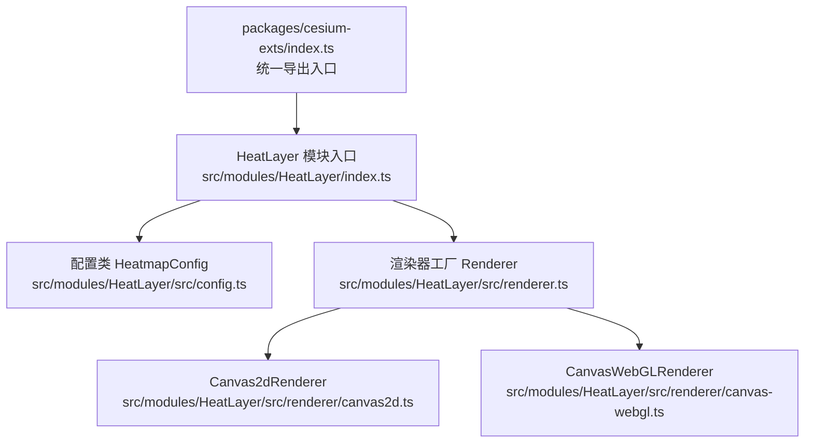
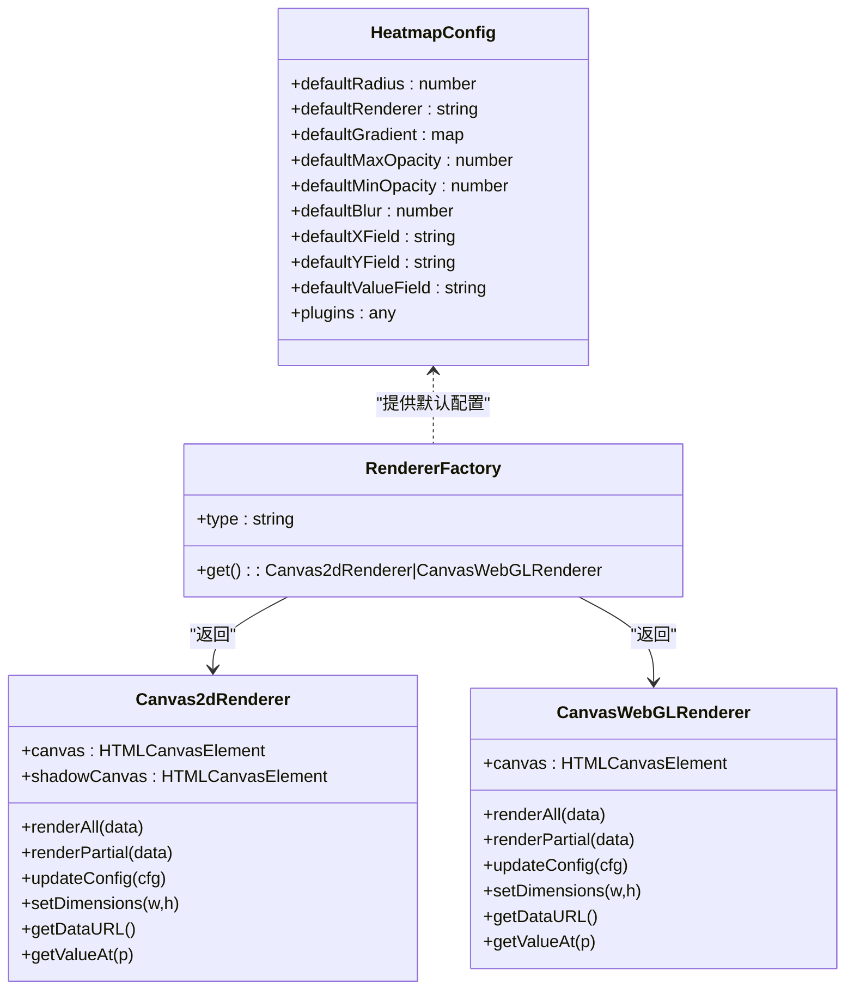
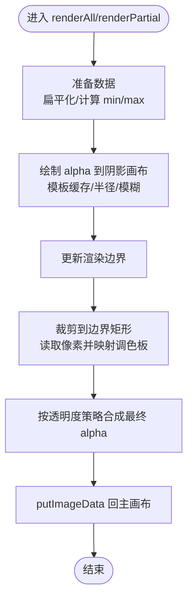
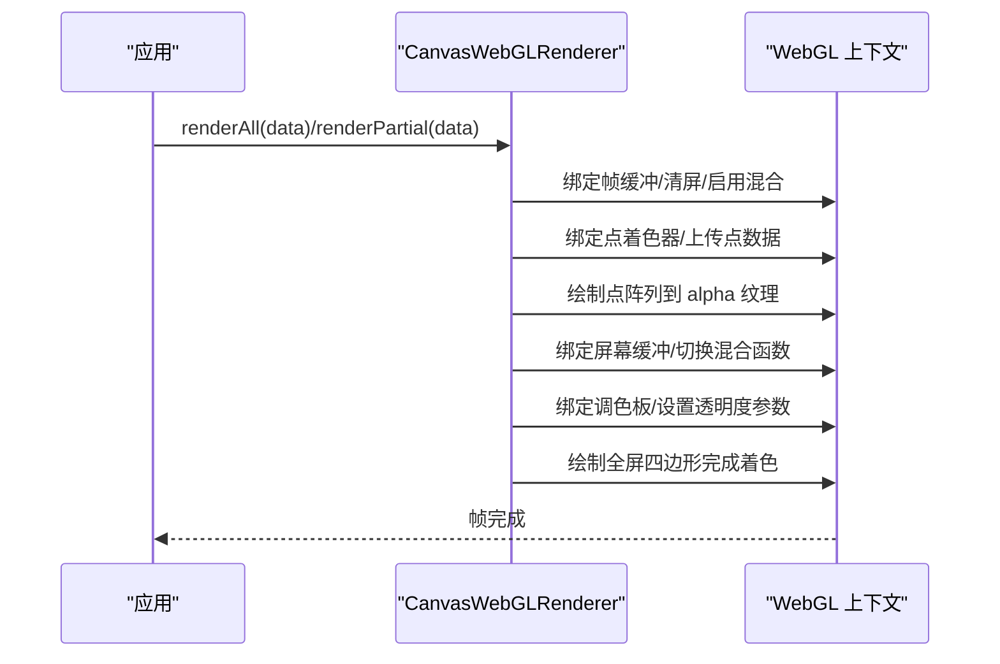
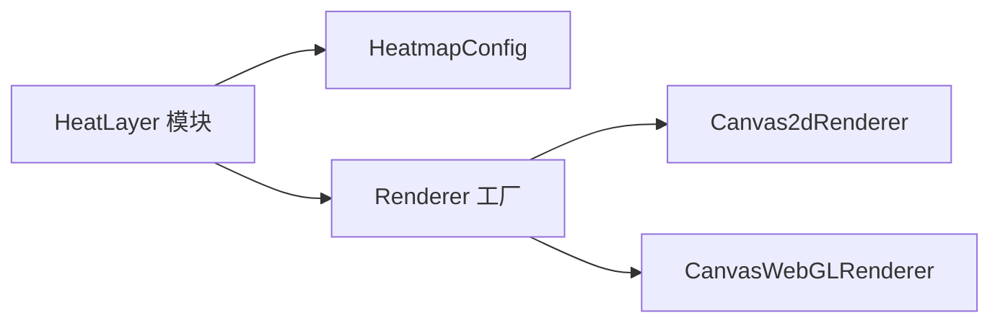

# 热力图可视化 (HeatLayer)

<cite>
**本文引用的文件**
- [packages/cesium-exts/README.md](file://packages/cesium-exts/README.md)
- [packages/cesium-exts/index.ts](file://packages/cesium-exts/index.ts)
- [packages/cesium-exts/src/modules/HeatLayer/index.ts](file://packages/cesium-exts/src/modules/HeatLayer/index.ts)
- [packages/cesium-exts/src/modules/HeatLayer/src/config.ts](file://packages/cesium-exts/src/modules/HeatLayer/src/config.ts)
- [packages/cesium-exts/src/modules/HeatLayer/src/renderer.ts](file://packages/cesium-exts/src/modules/HeatLayer/src/renderer.ts)
- [packages/cesium-exts/src/modules/HeatLayer/src/renderer/canvas2d.ts](file://packages/cesium-exts/src/modules/HeatLayer/src/renderer/canvas2d.ts)
- [packages/cesium-exts/src/modules/HeatLayer/src/renderer/canvas-webgl.ts](file://packages/cesium-exts/src/modules/HeatLayer/src/renderer/canvas-webgl.ts)
</cite>

## 目录

1. [简介](#简介)
2. [项目结构](#项目结构)
3. [核心组件](#核心组件)
4. [架构总览](#架构总览)
5. [组件详解](#组件详解)
6. [依赖关系分析](#依赖关系分析)
7. [性能考量](#性能考量)
8. [故障排查指南](#故障排查指南)
9. [结论](#结论)
10. [附录](#附录)

## 简介

本文件面向“热力图可视化”模块（HeatLayer），系统化阐述其双渲染模式（Canvas 2D 与 WebGL）的实现原理、算法数学基础、数据处理流程、API 设计与使用范式，并给出与 Cesium 场景集成时的坐标转换、缩放适配与性能调优建议。目标读者既包括前端开发者，也包括对地理可视化有需求的业务用户。

## 项目结构

HeatLayer 位于核心库 packages/cesium-exts 中，作为独立模块提供给上层应用使用。对外通过统一入口导出，内部由配置、渲染器工厂与两种渲染器实现组成。

图表来源

- [packages/cesium-exts/index.ts:1-4](file://packages/cesium-exts/index.ts#L1-L4)
- [packages/cesium-exts/src/modules/HeatLayer/index.ts:1-13](file://packages/cesium-exts/src/modules/HeatLayer/index.ts#L1-L13)
- [packages/cesium-exts/src/modules/HeatLayer/src/config.ts:1-31](file://packages/cesium-exts/src/modules/HeatLayer/src/config.ts#L1-L31)
- [packages/cesium-exts/src/modules/HeatLayer/src/renderer.ts:1-14](file://packages/cesium-exts/src/modules/HeatLayer/src/renderer.ts#L1-L14)
- [packages/cesium-exts/src/modules/HeatLayer/src/renderer/canvas2d.ts:1-375](file://packages/cesium-exts/src/modules/HeatLayer/src/renderer/canvas2d.ts#L1-L375)
- [packages/cesium-exts/src/modules/HeatLayer/src/renderer/canvas-webgl.ts:1-409](file://packages/cesium-exts/src/modules/HeatLayer/src/renderer/canvas-webgl.ts#L1-L409)

章节来源

- [packages/cesium-exts/README.md:1-170](file://packages/cesium-exts/README.md#L1-L170)
- [packages/cesium-exts/index.ts:1-4](file://packages/cesium-exts/index.ts#L1-L4)
- [packages/cesium-exts/src/modules/HeatLayer/index.ts:1-13](file://packages/cesium-exts/src/modules/HeatLayer/index.ts#L1-L13)

## 核心组件

- HeatmapConfig：集中管理默认配置，如点半径、默认渲染器类型、默认渐变、透明度范围、模糊度、字段名等。
- Renderer 工厂：依据配置选择渲染器类型，返回 Canvas2dRenderer 或 CanvasWebGLRenderer。
- Canvas2dRenderer：基于 2D 画布的热力图渲染，支持渐变、模糊、透明度控制与增量渲染。
- CanvasWebGLRenderer：基于 WebGL 的高性能渲染，采用“点绘制 -> Alpha 纹理 -> 着色上色”的两阶段管线。

章节来源

- [packages/cesium-exts/src/modules/HeatLayer/src/config.ts:1-31](file://packages/cesium-exts/src/modules/HeatLayer/src/config.ts#L1-L31)
- [packages/cesium-exts/src/modules/HeatLayer/src/renderer.ts:1-14](file://packages/cesium-exts/src/modules/HeatLayer/src/renderer.ts#L1-L14)
- [packages/cesium-exts/src/modules/HeatLayer/src/renderer/canvas2d.ts:1-375](file://packages/cesium-exts/src/modules/HeatLayer/src/renderer/canvas2d.ts#L1-L375)
- [packages/cesium-exts/src/modules/HeatLayer/src/renderer/canvas-webgl.ts:1-409](file://packages/cesium-exts/src/modules/HeatLayer/src/renderer/canvas-webgl.ts#L1-L409)

## 架构总览

HeatLayer 的运行时架构由“配置 -> 渲染器工厂 -> 渲染器 -> 着色器/2D 上下文”构成。渲染器负责接收内部数据格式，按需绘制到画布或纹理，最终呈现为热力图效果。

图表来源

- [packages/cesium-exts/src/modules/HeatLayer/src/config.ts:1-31](file://packages/cesium-exts/src/modules/HeatLayer/src/config.ts#L1-L31)
- [packages/cesium-exts/src/modules/HeatLayer/src/renderer.ts:1-14](file://packages/cesium-exts/src/modules/HeatLayer/src/renderer.ts#L1-L14)
- [packages/cesium-exts/src/modules/HeatLayer/src/renderer/canvas2d.ts:1-375](file://packages/cesium-exts/src/modules/HeatLayer/src/renderer/canvas2d.ts#L1-L375)
- [packages/cesium-exts/src/modules/HeatLayer/src/renderer/canvas-webgl.ts:1-409](file://packages/cesium-exts/src/modules/HeatLayer/src/renderer/canvas-webgl.ts#L1-L409)

## 组件详解

### Canvas2dRenderer 实现要点

- 渲染管线
  - 将内部数据扁平化为点集，按半径生成或复用点模板（圆形或径向渐变），写入阴影画布以累积 alpha。
  - 仅在必要区域裁剪后，读取阴影画布像素，按调色板映射 RGB 并按透明度策略写回主画布。
- 关键能力
  - 渐变调色板生成与缓存（按半径缓存点模板）。
  - 支持增量渲染（renderPartial）与全量渲染（renderAll）。
  - 支持背景色、尺寸、模糊度、透明度范围与渐变透明度开关。
- 性能特征
  - 适合中小规模数据；像素级操作在大分辨率下开销显著。
  - 通过边界裁剪减少 putImageData 范围，提升效率。

图表来源

- [packages/cesium-exts/src/modules/HeatLayer/src/renderer/canvas2d.ts:174-350](file://packages/cesium-exts/src/modules/HeatLayer/src/renderer/canvas2d.ts#L174-L350)

章节来源

- [packages/cesium-exts/src/modules/HeatLayer/src/renderer/canvas2d.ts:1-375](file://packages/cesium-exts/src/modules/HeatLayer/src/renderer/canvas2d.ts#L1-L375)

### CanvasWebGLRenderer 实现要点

- 渲染管线
  - 两阶段：点绘制阶段将点强度与半径写入 alpha 纹理；着色阶段将 alpha 纹理与调色板纹理合成到屏幕。
  - 使用顶点/片段着色器实现点绘制与颜色映射，支持径向模糊与加法混合。
- 关键能力
  - 支持全量与增量渲染（当前实现为简化重绘，真实场景可扩展为局部更新）。
  - 支持调色板纹理、透明度范围、渐变透明度开关与画布尺寸调整。
- 性能特征
  - 大数据量下显著优于 2D；适合大规模点云热力图。

图表来源

- [packages/cesium-exts/src/modules/HeatLayer/src/renderer/canvas-webgl.ts:197-309](file://packages/cesium-exts/src/modules/HeatLayer/src/renderer/canvas-webgl.ts#L197-L309)

章节来源

- [packages/cesium-exts/src/modules/HeatLayer/src/renderer/canvas-webgl.ts:1-409](file://packages/cesium-exts/src/modules/HeatLayer/src/renderer/canvas-webgl.ts#L1-L409)

### 着色器与数学原理

- 点绘制着色器
  - 将屏幕坐标归一化到裁剪空间，设置 gl_PointSize 为点半径；片段着色器基于距离实现径向模糊与平滑衰减。
- 着色阶段着色器
  - 采样 alpha 纹理得到强度，查表获得颜色；按透明度策略合成最终颜色。
- 数学要点
  - 径向模糊通过 smoothstep 在边缘处进行插值，实现柔和过渡。
  - 加法混合用于叠加多个点的贡献，形成密度感。

章节来源

- [packages/cesium-exts/src/modules/HeatLayer/src/renderer/canvas-webgl.ts:337-409](file://packages/cesium-exts/src/modules/HeatLayer/src/renderer/canvas-webgl.ts#L337-L409)

### API 与配置

- 配置类 HeatmapConfig（默认值）
  - 默认点半径、默认渲染器类型、默认渐变、最大/最小透明度、默认模糊度、坐标字段名、数值字段名、插件配置等。
- 渲染器配置 RendererConfig
  - 容器、画布、宽高、渐变、默认渐变、模糊度、透明度、最大/最小透明度、是否使用渐变透明度、背景色等。
- 渲染器工厂 Renderer
  - 根据默认渲染器类型返回 Canvas2dRenderer 或 CanvasWebGLRenderer。
- Canvas2dRenderer 方法
  - renderAll(data)、renderPartial(data)、updateConfig(cfg)、setDimensions(w,h)、getDataURL()、getValueAt(p)。
- CanvasWebGLRenderer 方法
  - renderAll(data)、renderPartial(data)、updateConfig(cfg)、setDimensions(w,h)、getDataURL()、getValueAt(p)。

章节来源

- [packages/cesium-exts/src/modules/HeatLayer/src/config.ts:1-31](file://packages/cesium-exts/src/modules/HeatLayer/src/config.ts#L1-L31)
- [packages/cesium-exts/src/modules/HeatLayer/src/renderer/canvas2d.ts:6-22](file://packages/cesium-exts/src/modules/HeatLayer/src/renderer/canvas2d.ts#L6-L22)
- [packages/cesium-exts/src/modules/HeatLayer/src/renderer.ts:1-14](file://packages/cesium-exts/src/modules/HeatLayer/src/renderer.ts#L1-L14)
- [packages/cesium-exts/src/modules/HeatLayer/src/renderer/canvas2d.ts:174-375](file://packages/cesium-exts/src/modules/HeatLayer/src/renderer/canvas2d.ts#L174-L375)
- [packages/cesium-exts/src/modules/HeatLayer/src/renderer/canvas-webgl.ts:136-333](file://packages/cesium-exts/src/modules/HeatLayer/src/renderer/canvas-webgl.ts#L136-L333)

### 使用示例（步骤说明）

- 引入模块
  - 通过统一入口导入 HeatLayer。
- 创建实例
  - 传入容器与配置（如渐变、点半径、模糊度等）。
- 添加数据
  - 提供包含 x、y、value 字段的对象数组（字段名可通过配置覆盖）。
- 渲染与更新
  - 调用渲染器的 renderAll 或 renderPartial；必要时更新配置（如透明度、模糊度）。
- 导出与查询
  - 可导出 DataURL；可查询某点的数值。

章节来源

- [packages/cesium-exts/README.md:66-88](file://packages/cesium-exts/README.md#L66-L88)
- [packages/cesium-exts/src/modules/HeatLayer/index.ts:1-13](file://packages/cesium-exts/src/modules/HeatLayer/index.ts#L1-L13)

### 与 Cesium 场景集成

- 坐标转换
  - 将经纬度或笛卡尔坐标转换为屏幕像素坐标，再传入渲染器。具体转换逻辑取决于 Cesium 的投影与相机参数。
- 缩放适配
  - 监听 Cesium 相机或视图变化，动态更新渲染器尺寸与模糊度，保证在不同缩放下视觉一致。
- 性能调优
  - 大数据量优先使用 WebGL 渲染器；合理设置点半径与模糊度；按需裁剪渲染边界；避免频繁全量重绘。
- 透明度与层级
  - 结合 Cesium 图层体系，将热力图作为叠加层，控制透明度与可见性，避免遮挡重要地物。

[本节为概念性说明，不直接分析具体文件，故无章节来源]

## 依赖关系分析

- 模块间耦合
  - HeatLayer 模块内部通过 Renderer 工厂解耦渲染器类型；渲染器各自持有画布/上下文，互不直接依赖。
- 外部依赖
  - WebGL 渲染器依赖浏览器 WebGL 能力；Canvas2D 渲染器依赖 2D 画布 API。
- 可能的循环依赖
  - 当前结构清晰，无循环依赖迹象。

图表来源

- [packages/cesium-exts/src/modules/HeatLayer/src/config.ts:1-31](file://packages/cesium-exts/src/modules/HeatLayer/src/config.ts#L1-L31)
- [packages/cesium-exts/src/modules/HeatLayer/src/renderer.ts:1-14](file://packages/cesium-exts/src/modules/HeatLayer/src/renderer.ts#L1-L14)
- [packages/cesium-exts/src/modules/HeatLayer/src/renderer/canvas2d.ts:1-375](file://packages/cesium-exts/src/modules/HeatLayer/src/renderer/canvas2d.ts#L1-L375)
- [packages/cesium-exts/src/modules/HeatLayer/src/renderer/canvas-webgl.ts:1-409](file://packages/cesium-exts/src/modules/HeatLayer/src/renderer/canvas-webgl.ts#L1-L409)

章节来源

- [packages/cesium-exts/src/modules/HeatLayer/src/renderer.ts:1-14](file://packages/cesium-exts/src/modules/HeatLayer/src/renderer.ts#L1-L14)

## 性能考量

- 渲染器选择
  - 数据量小：Canvas2D 渲染器易用且满足需求。
  - 数据量大：优先 WebGL 渲染器，利用 GPU 并行优势。
- 渲染策略
  - 控制点半径与模糊度，避免过大的点导致过度重叠。
  - 使用增量渲染（renderPartial）减少全量重绘成本。
  - 合理设置透明度范围，避免无效像素参与合成。
- 画布与纹理
  - Canvas2D：尽量缩小 putImageData 范围；缓存点模板。
  - WebGL：复用帧缓冲与纹理；避免频繁 resize；使用合适的混合函数。

[本节提供通用建议，不直接分析具体文件，故无章节来源]

## 故障排查指南

- WebGL 不可用
  - 现象：初始化时报错提示不支持 WebGL。
  - 处理：降级为 Canvas2D 渲染器，或检查浏览器与显卡驱动。
- 渲染结果异常
  - 现象：热力图不显示或颜色异常。
  - 处理：确认数据格式与字段名；检查渐变配置与透明度范围；验证尺寸设置。
- 性能问题
  - 现象：页面卡顿或掉帧。
  - 处理：切换到 WebGL 渲染器；降低点半径与模糊度；限制数据量；使用增量渲染。

章节来源

- [packages/cesium-exts/src/modules/HeatLayer/src/renderer/canvas-webgl.ts:48-62](file://packages/cesium-exts/src/modules/HeatLayer/src/renderer/canvas-webgl.ts#L48-L62)
- [packages/cesium-exts/src/modules/HeatLayer/src/renderer/canvas2d.ts:236-250](file://packages/cesium-exts/src/modules/HeatLayer/src/renderer/canvas2d.ts#L236-L250)
- [packages/cesium-exts/src/modules/HeatLayer/src/renderer/canvas-webgl.ts:136-153](file://packages/cesium-exts/src/modules/HeatLayer/src/renderer/canvas-webgl.ts#L136-L153)

## 结论

HeatLayer 通过双渲染模式兼顾易用性与性能，配合清晰的配置与工厂设计，能够灵活适配不同规模与场景的热力图需求。结合 Cesium 的坐标转换与层级体系，可在三维地理场景中实现高质量的热力图可视化。

[本节为总结性内容，不直接分析具体文件，故无章节来源]

## 附录

### API 一览（概要）

- HeatmapConfig
  - 默认半径、默认渲染器、默认渐变、透明度范围、模糊度、字段名、插件配置。
- Renderer 工厂
  - 返回 Canvas2dRenderer 或 CanvasWebGLRenderer。
- Canvas2dRenderer
  - renderAll(data)、renderPartial(data)、updateConfig(cfg)、setDimensions(w,h)、getDataURL()、getValueAt(p)。
- CanvasWebGLRenderer
  - renderAll(data)、renderPartial(data)、updateConfig(cfg)、setDimensions(w,h)、getDataURL()、getValueAt(p)。

章节来源

- [packages/cesium-exts/src/modules/HeatLayer/src/config.ts:1-31](file://packages/cesium-exts/src/modules/HeatLayer/src/config.ts#L1-L31)
- [packages/cesium-exts/src/modules/HeatLayer/src/renderer.ts:1-14](file://packages/cesium-exts/src/modules/HeatLayer/src/renderer.ts#L1-L14)
- [packages/cesium-exts/src/modules/HeatLayer/src/renderer/canvas2d.ts:174-375](file://packages/cesium-exts/src/modules/HeatLayer/src/renderer/canvas2d.ts#L174-L375)
- [packages/cesium-exts/src/modules/HeatLayer/src/renderer/canvas-webgl.ts:197-333](file://packages/cesium-exts/src/modules/HeatLayer/src/renderer/canvas-webgl.ts#L197-L333)
