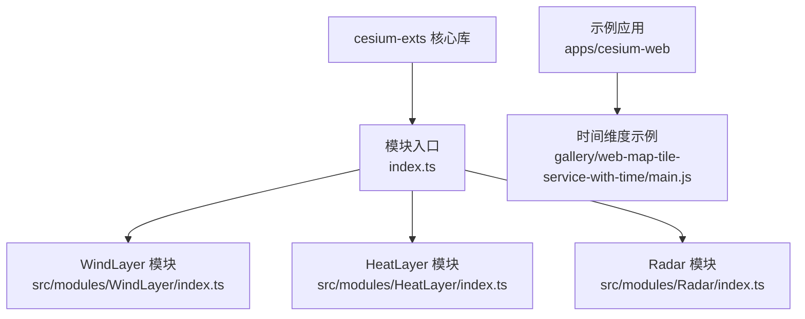
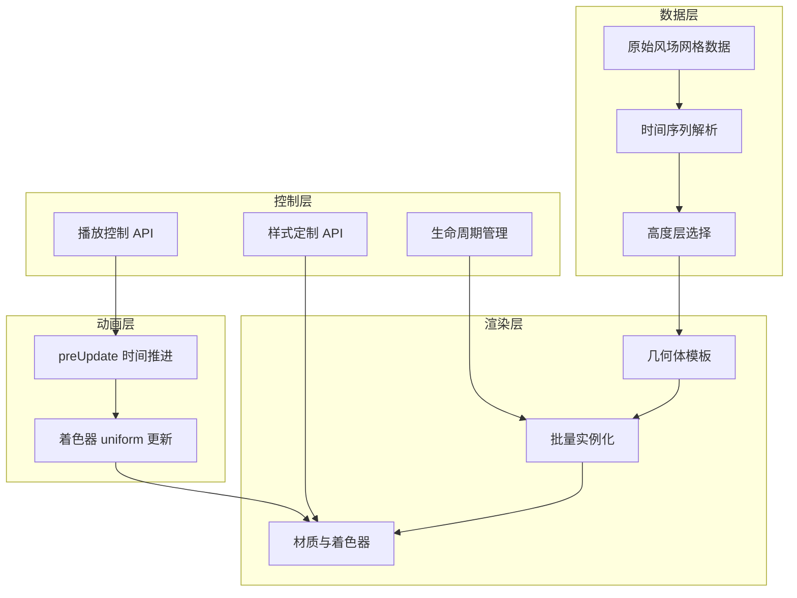
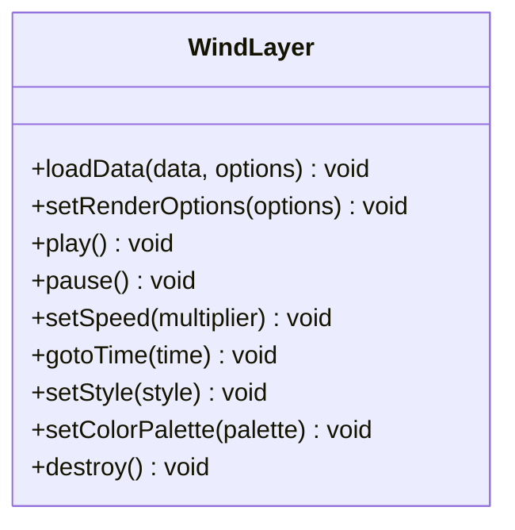
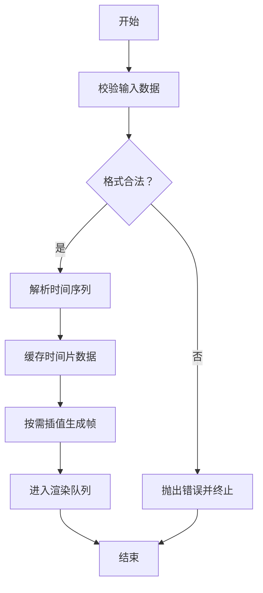
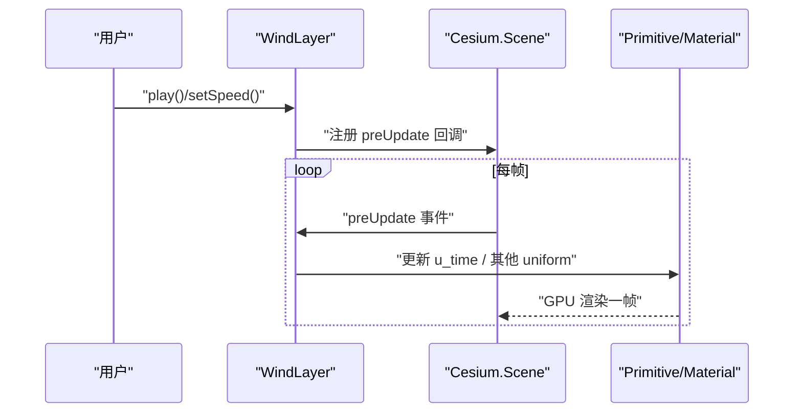
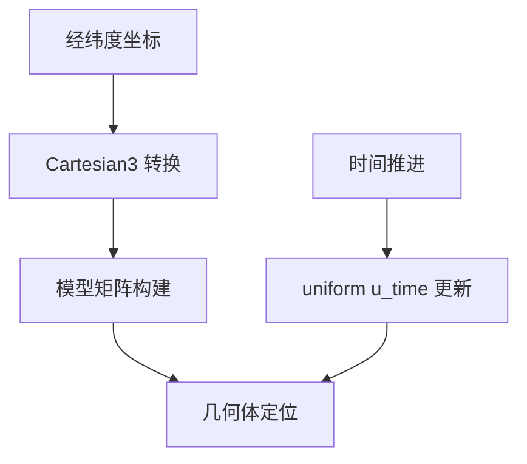
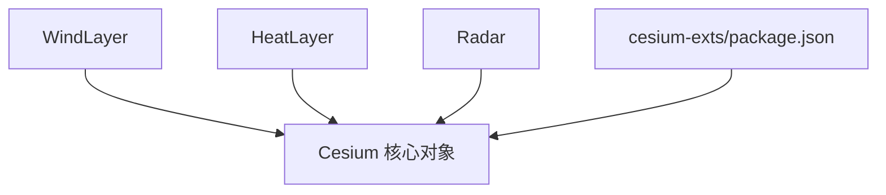

# 风场可视化 (WindLayer)

<cite>
**本文档引用的文件**
- [index.ts](file://packages/cesium-exts/index.ts)
- [index.ts](file://packages/cesium-exts/src/modules/WindLayer/index.ts)
- [package.json](file://packages/cesium-exts/package.json)
- [README.md](file://README.md)
- [index.ts](file://packages/cesium-exts/src/modules/HeatLayer/index.ts)
- [index.ts](file://packages/cesium-exts/src/modules/Radar/index.ts)
- [main.js](file://apps/cesium-web/gallery/web-map-tile-service-with-time/main.js)
</cite>

## 目录

1. [简介](#简介)
2. [项目结构](#项目结构)
3. [核心组件](#核心组件)
4. [架构总览](#架构总览)
5. [详细组件分析](#详细组件分析)
6. [依赖分析](#依赖分析)
7. [性能考虑](#性能考虑)
8. [故障排查指南](#故障排查指南)
9. [结论](#结论)
10. [附录](#附录)

## 简介

本文件面向“风场可视化”模块（WindLayer）的使用者与维护者，提供从架构设计到使用实践的系统化文档。WindLayer 作为 cesium-exts 核心库中的可视化组件之一，目标是实现风场数据的高效渲染与动态播放，覆盖风场数据格式、时间序列管理、动画渲染与样式定制等关键能力。

根据仓库现有信息，WindLayer 已在导出清单中声明，但其具体实现类体尚处于占位状态；同时，HeatLayer 与 Radar 模块提供了成熟的实现范式，可作为 WindLayer 设计与实现的参考模板。

## 项目结构

- 核心库：cesium-exts（monorepo 中的一个包）
- 模块分布：src/modules 下包含 HeatLayer、Radar、WindLayer 等模块入口
- 导出入口：packages/cesium-exts/index.ts 将各模块统一导出
- 示例应用：apps/cesium-web 提供 Cesium Viewer 示例与时间维度演示

**图表来源**

- [index.ts:1-4](file://packages/cesium-exts/index.ts#L1-L4)
- [index.ts:1-10](file://packages/cesium-exts/src/modules/WindLayer/index.ts#L1-L10)
- [index.ts:1-13](file://packages/cesium-exts/src/modules/HeatLayer/index.ts#L1-L13)
- [index.ts:1-439](file://packages/cesium-exts/src/modules/Radar/index.ts#L1-L439)
- [main.js:1-60](file://apps/cesium-web/gallery/web-map-tile-service-with-time/main.js#L1-L60)

**章节来源**

- [index.ts:1-4](file://packages/cesium-exts/index.ts#L1-L4)
- [package.json:1-48](file://packages/cesium-exts/package.json#L1-L48)
- [README.md:1-88](file://README.md#L1-L88)

## 核心组件

- WindLayer：风场可视化模块的对外接口类，负责风场数据接入、渲染参数配置、动画控制与样式定制。
- HeatLayer：热力图模块，提供数据接入与渲染的实现思路，可作为 WindLayer 的数据处理与渲染参考。
- Radar：立体雷达扫描模块，展示了基于 Cesium 的几何体批量合并、GPU 着色器与时间驱动动画的完整实现路径，可借鉴其渲染管线与性能优化策略。

**章节来源**

- [index.ts:1-10](file://packages/cesium-exts/src/modules/WindLayer/index.ts#L1-L10)
- [index.ts:1-13](file://packages/cesium-exts/src/modules/HeatLayer/index.ts#L1-L13)
- [index.ts:1-439](file://packages/cesium-exts/src/modules/Radar/index.ts#L1-L439)

## 架构总览

WindLayer 的整体架构建议遵循以下分层：

- 数据层：接收风场网格数据（经度、纬度、高度层、时间序列），进行预处理与缓存。
- 渲染层：基于 Cesium 的 Primitive/Material/GeometryInstance 架构，实现风场粒子或流线的批量绘制。
- 动画层：通过 Cesium 的 preUpdate 事件驱动时间推进，结合着色器实现风场的动态效果。
- 控制层：提供 API 用于设置播放速度、时间范围、样式参数与生命周期管理。

[本图为概念性架构示意，不直接对应具体源码文件，故不提供图表来源]

## 详细组件分析

### WindLayer 类设计与职责

- 职责边界：封装风场数据接入、渲染参数配置、动画控制与样式定制。
- 关键方法（命名建议）：
  - 数据导入：loadData(data, options)
  - 渲染配置：setRenderOptions(options)
  - 动画控制：play()/pause()/setSpeed()/gotoTime(time)
  - 样式定制：setStyle(style)/setColorPalette(palette)
  - 生命周期：destroy()

[本图为概念性类图示意，不直接对应具体源码文件，故不提供图表来源]

**章节来源**

- [index.ts:1-10](file://packages/cesium-exts/src/modules/WindLayer/index.ts#L1-L10)

### 数据格式与时间序列处理

- 数据格式建议：
  - 网格结构：经纬度网格（lat/lng）、高度层索引（level）、风矢量（u,v）或风速风向（speed/dir）。
  - 时间维：按时间步长组织的数据序列，支持离散时间点与插值。
- 处理流程：
  - 输入校验：经纬度范围、高度层合法性、时间序列连续性。
  - 缓存策略：按时间片缓存网格数据，避免重复解码。
  - 插值策略：时间插值（双线性/三次）与空间插值（邻域平均/反距离权重）。

[本图为概念性流程示意，不直接对应具体源码文件，故不提供图表来源]

### 动画渲染技术与视觉效果

- 渲染基础：基于 Cesium 的 Primitive/Material/GeometryInstance，实现风场粒子或流线的批量绘制。
- 动画驱动：利用 Cesium.Scene.preUpdate 事件，按倍速推进时间，更新着色器 uniform（如 u_time）。
- 视觉效果：
  - 风场粒子：基于纹理的粒子系统，支持长度、透明度、颜色随风速变化。
  - 流线渲染：基于历史轨迹的流线，带拖尾与渐隐效果。
  - 颜色映射：将风速映射到颜色调色板，支持高度层分层着色。

[本图为概念性时序示意，不直接对应具体源码文件，故不提供图表来源]

### API 接口设计（建议）

- 数据导入
  - loadData(data, options): 支持 CSV/JSON/二进制格式，options 包含时间字段、高度层字段、网格分辨率等。
- 渲染参数
  - setRenderOptions({ particleSize, trailLength, speedFactor, colorPalette })
- 动画控制
  - play()/pause()/stop()
  - setSpeed(multiplier)
  - gotoTime(time)
- 样式定制
  - setStyle({ opacity, colorMode, colorPalette })
- 生命周期
  - destroy(): 释放资源、移除事件监听、清理显存。

**章节来源**

- [index.ts:1-10](file://packages/cesium-exts/src/modules/WindLayer/index.ts#L1-L10)

### 与地理坐标的映射关系

- 经纬度转换：将 lat/lng 转换为 Cesium.Cartesian3，结合 eastNorthUpToFixedFrame 构建局部坐标系。
- 高度层处理：支持多高度层（如 850hPa、700hPa、500hPa），不同高度层使用独立渲染参数。
- 时间维度管理：基于 Cesium 的 Clock 与 TimeIntervalCollection，实现循环播放与时间跳转。

[本图为概念性流程示意，不直接对应具体源码文件，故不提供图表来源]

**章节来源**

- [main.js:1-60](file://apps/cesium-web/gallery/web-map-tile-service-with-time/main.js#L1-L60)

### 参考实现模式（HeatLayer 与 Radar）

- HeatLayer：展示了数据接入与渲染的实现思路，可借鉴其数据结构与渲染流程。
- Radar：展示了基于 Cesium 的几何体批量合并、GPU 着色器与时间驱动动画的完整实现路径，可借鉴其渲染管线与性能优化策略。

**章节来源**

- [index.ts:1-13](file://packages/cesium-exts/src/modules/HeatLayer/index.ts#L1-L13)
- [index.ts:1-439](file://packages/cesium-exts/src/modules/Radar/index.ts#L1-L439)

## 依赖分析

- 依赖关系：
  - WindLayer 依赖 Cesium 的 Scene、Primitive、Material、GeometryInstance 等核心对象。
  - 与 HeatLayer、Radar 在渲染架构与性能优化方面存在相似性与可复用性。
- 外部依赖：
  - Cesium 版本要求：参见 package.json 中 peerDependencies。
  - 构建工具链：Rollup + Gulp，TypeScript 类型导出。

**图表来源**

- [package.json:27-29](file://packages/cesium-exts/package.json#L27-L29)
- [index.ts:1-10](file://packages/cesium-exts/src/modules/WindLayer/index.ts#L1-L10)
- [index.ts:1-13](file://packages/cesium-exts/src/modules/HeatLayer/index.ts#L1-L13)
- [index.ts:1-439](file://packages/cesium-exts/src/modules/Radar/index.ts#L1-L439)

**章节来源**

- [package.json:1-48](file://packages/cesium-exts/package.json#L1-L48)

## 性能考虑

- 批量渲染：使用 GeometryInstance 合并与 Material 统一，减少 draw call。
- GPU 着色器：在着色器中完成时间推进与颜色计算，降低 CPU-GPU 数据传输。
- 数据缓存：对时间片与网格数据进行缓存，避免重复解码与计算。
- 动画节流：在 pause 或低倍速时停止时间推进，节省性能。
- 显存管理：在 destroy 时移除 Primitive、清理事件回调，防止内存泄漏。

[本节为通用性能指导，不直接分析具体文件，故不提供章节来源]

## 故障排查指南

- 常见问题
  - 风场数据为空或格式不正确：检查数据导入接口的参数与数据结构。
  - 渲染异常或闪烁：确认材质 uniform 是否正确更新，着色器是否兼容当前 GPU。
  - 内存泄漏：确保在组件销毁时调用 destroy，移除事件监听并清理 Primitive。
- 建议排查步骤
  - 打开浏览器开发者工具，观察帧率与 GPU 使用情况。
  - 检查控制台错误与警告信息。
  - 分阶段验证：先验证数据导入，再验证渲染，最后验证动画。

**章节来源**

- [index.ts:301-315](file://packages/cesium-exts/src/modules/Radar/index.ts#L301-L315)

## 结论

WindLayer 作为 cesium-exts 的重要可视化组件，应围绕“数据接入—渲染管线—动画驱动—样式定制—生命周期管理”的完整链路进行设计与实现。可参考 HeatLayer 与 Radar 的成熟实现，结合 Cesium 的 GPU 渲染能力，构建高性能、可交互、可定制的风场可视化方案。

[本节为总结性内容，不直接分析具体文件，故不提供章节来源]

## 附录

### 使用示例（概念性）

- 加载风场数据：调用 loadData，传入 CSV/JSON/二进制数据与选项。
- 配置渲染效果：设置粒子大小、拖尾长度、颜色调色板。
- 控制播放速度：setSpeed，支持正负倍速与暂停。
- 实现交互：绑定鼠标事件，实现时间轴拖拽与高度层切换。

**章节来源**

- [README.md:66-88](file://README.md#L66-L88)
