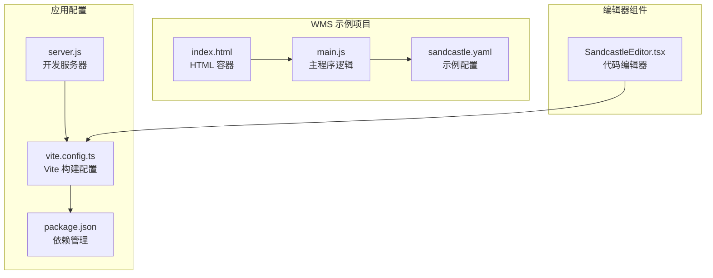
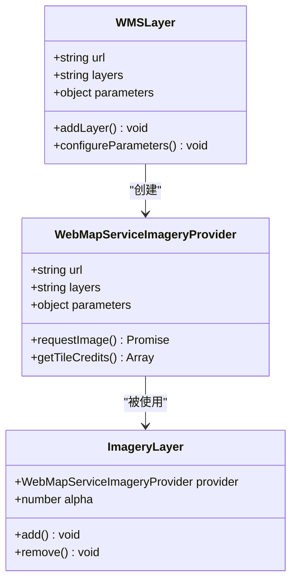
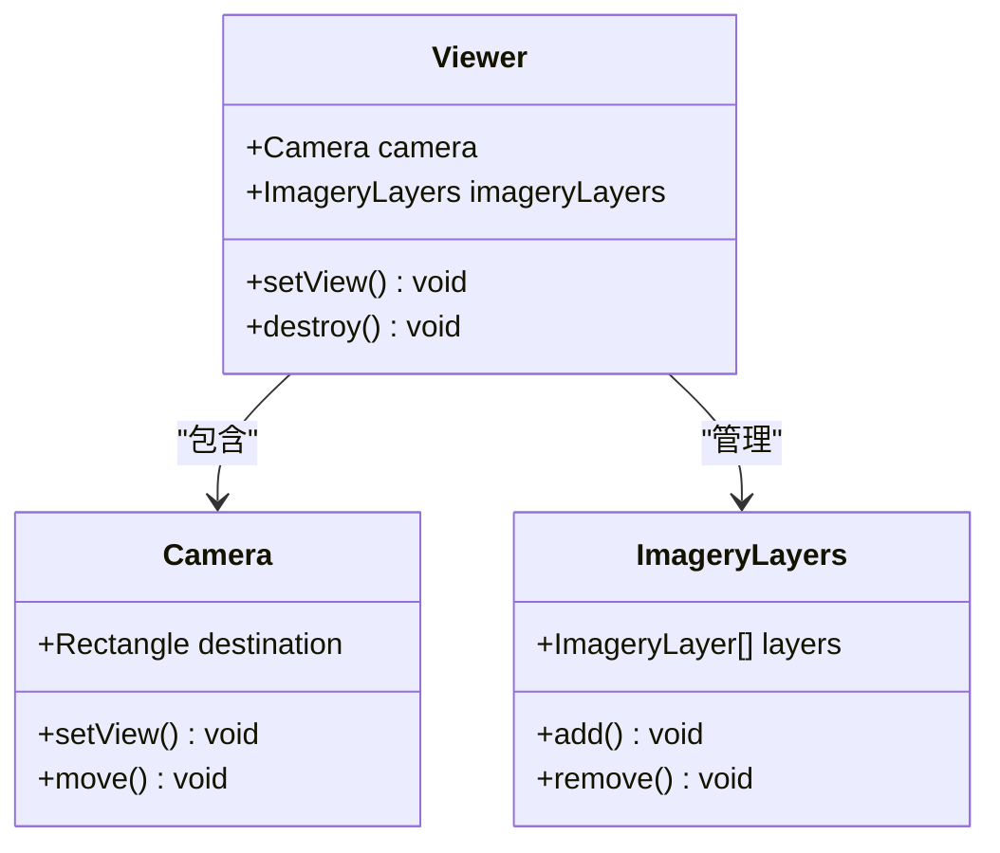
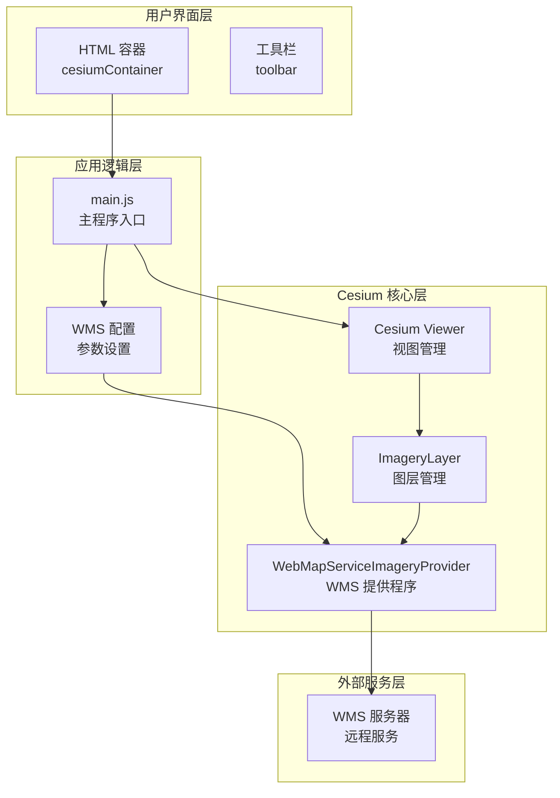
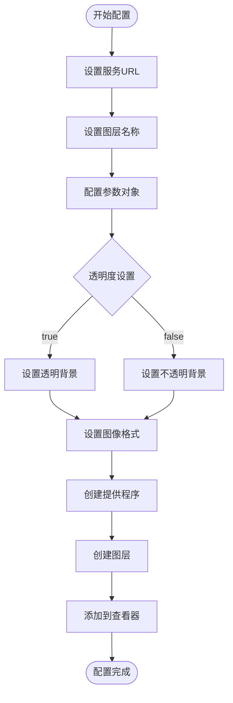
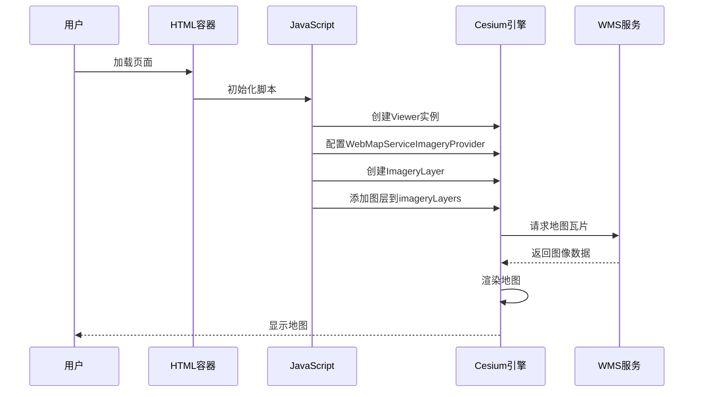
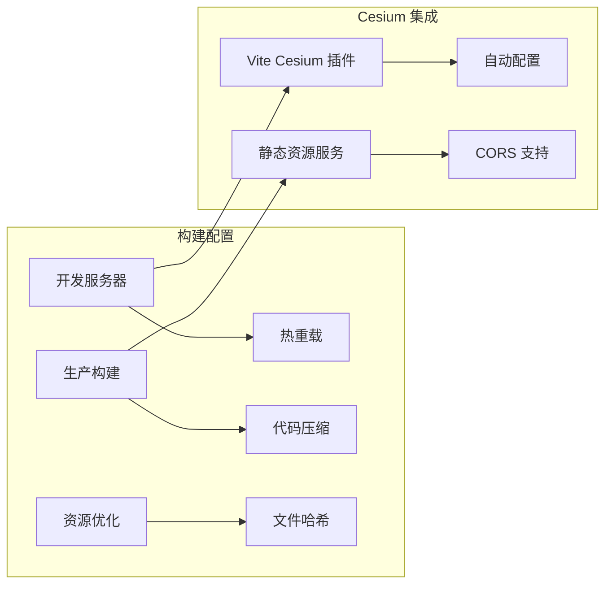
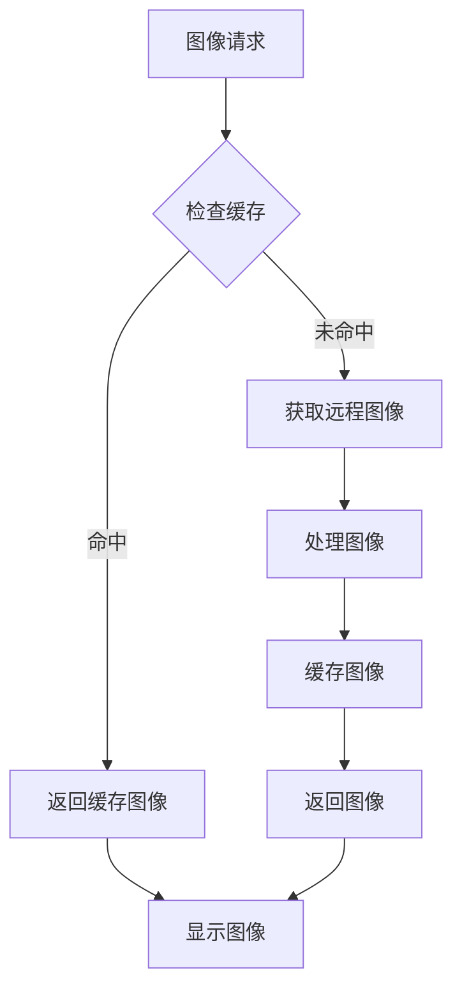

# WMS 网络地图服务示例

<cite>
**本文档引用的文件**
- [index.html](file://apps/cesium-web/gallery/web-map-service-wms/index.html)
- [main.js](file://apps/cesium-web/gallery/web-map-service-wms/main.js)
- [sandcastle.yaml](file://apps/cesium-web/gallery/web-map-service-wms/sandcastle.yaml)
- [package.json](file://apps/cesium-web/package.json)
- [vite.config.ts](file://apps/cesium-web/vite.config.ts)
- [server.js](file://apps/cesium-web/scripts/server.js)
- [SandcastleEditor.tsx](file://apps/cesium-web/src/components/SandcastleEditor/SandcastleEditor.tsx)
- [README.md](file://apps/cesium-web/README.md)
</cite>

## 目录

1. [简介](#简介)
2. [项目结构](#项目结构)
3. [核心组件](#核心组件)
4. [架构概览](#架构概览)
5. [详细组件分析](#详细组件分析)
6. [依赖分析](#依赖分析)
7. [性能考虑](#性能考虑)
8. [故障排除指南](#故障排除指南)
9. [结论](#结论)
10. [附录](#附录)

## 简介

本示例展示了如何在 Cesium 中集成 Web Map Service (WMS) 网络地图服务。WMS 是一个开放地理空间联盟 (OGC) 标准协议，允许客户端请求地理空间图像服务。该示例演示了如何配置 WMS 服务、设置图层参数以及实现动态地图渲染。

本项目使用现代前端技术栈，包括 React、TypeScript 和 Vite，为开发者提供了一个完整的 WMS 集成解决方案模板。

## 项目结构

WMS 示例位于 `apps/cesium-web/gallery/web-map-service-wms/` 目录下，采用标准的前端项目结构：



**图表来源**

- [index.html:1-7](file://apps/cesium-web/gallery/web-map-service-wms/index.html#L1-L7)
- [main.js:1-22](file://apps/cesium-web/gallery/web-map-service-wms/main.js#L1-L22)
- [sandcastle.yaml:1-7](file://apps/cesium-web/gallery/web-map-service-wms/sandcastle.yaml#L1-L7)

**章节来源**

- [index.html:1-7](file://apps/cesium-web/gallery/web-map-service-wms/index.html#L1-L7)
- [main.js:1-22](file://apps/cesium-web/gallery/web-map-service-wms/main.js#L1-L22)
- [sandcastle.yaml:1-7](file://apps/cesium-web/gallery/web-map-service-wms/sandcastle.yaml#L1-L7)

## 核心组件

### WMS 服务配置组件

该组件负责配置和初始化 WMS 图像提供程序：



**图表来源**

- [main.js:6-16](file://apps/cesium-web/gallery/web-map-service-wms/main.js#L6-L16)

### 视图控制器组件

负责管理 Cesium 查看器和相机控制：



**图表来源**

- [main.js:3-21](file://apps/cesium-web/gallery/web-map-service-wms/main.js#L3-L21)

**章节来源**

- [main.js:1-22](file://apps/cesium-web/gallery/web-map-service-wms/main.js#L1-L22)

## 架构概览

WMS 集成采用分层架构设计，确保模块间的清晰分离：



**图表来源**

- [index.html:1-7](file://apps/cesium-web/gallery/web-map-service-wms/index.html#L1-L7)
- [main.js:1-22](file://apps/cesium-web/gallery/web-map-service-wms/main.js#L1-L22)

## 详细组件分析

### WMS 服务配置实现

#### 服务端点配置

示例使用澳大利亚地质局的 WMS 服务作为演示：

| 参数     | 值                                                                                           | 描述                 |
| -------- | -------------------------------------------------------------------------------------------- | -------------------- |
| 服务URL  | `https://services.ga.gov.au/gis/services/NM_Hydrology_and_Marine_Points/MapServer/WMSServer` | 主要的 WMS 服务端点  |
| 图层名称 | `Bores`                                                                                      | 要显示的具体图层     |
| 版本号   | `1.3.0`                                                                                      | WMS 协议版本（默认） |
| 格式参数 | `image/png`                                                                                  | 图像输出格式         |

#### 图层参数设置



**图表来源**

- [main.js:6-16](file://apps/cesium-web/gallery/web-map-service-wms/main.js#L6-L16)

#### 动态地图渲染流程



**图表来源**

- [main.js:3-21](file://apps/cesium-web/gallery/web-map-service-wms/main.js#L3-L21)

**章节来源**

- [main.js:1-22](file://apps/cesium-web/gallery/web-map-service-wms/main.js#L1-L22)

### 示例配置文件分析

#### Sandcastle 配置

示例使用 Sandcastle 平台进行演示，配置文件定义了示例的基本信息：

| 配置项      | 值                                              | 用途           |
| ----------- | ----------------------------------------------- | -------------- |
| legacyId    | `Web Map Service (WMS).html`                    | 传统 ID 标识符 |
| title       | `Web Map Service (WMS)`                         | 示例标题       |
| description | `从 Web Map Service (WMS) 服务器加载影像服务。` | 功能描述       |
| labels      | `Imagery`                                       | 分类标签       |
| thumbnail   | `thumbnail.jpg`                                 | 缩略图文件名   |

**章节来源**

- [sandcastle.yaml:1-7](file://apps/cesium-web/gallery/web-map-service-wms/sandcastle.yaml#L1-L7)

### 构建和部署配置

#### Vite 构建配置

项目使用 Vite 作为构建工具，配置了以下关键特性：



**图表来源**

- [vite.config.ts:1-81](file://apps/cesium-web/vite.config.ts#L1-L81)

**章节来源**

- [vite.config.ts:1-81](file://apps/cesium-web/vite.config.ts#L1-L81)
- [package.json:1-51](file://apps/cesium-web/package.json#L1-L51)

## 依赖分析

### 核心依赖关系

```mermaid
graph TB
subgraph "运行时依赖"
A[cesium@catalog:] --> B[Cesium 核心库]
C[react@^19.2.0] --> D[React 框架]
E[react-dom@^19.2.0] --> F[DOM 操作]
end
subgraph "开发依赖"
G[@vitejs/plugin-react-swc] --> H[Vite React 插件]
I[vite-cesium-plugin] --> J[Cesium 构建插件]
K[@types/react] --> L[类型定义]
end
subgraph "UI 组件"
M[@monaco-editor/react] --> N[代码编辑器]
O[@tailwindcss/vite] --> P[样式框架]
end
A --> C
C --> G
G --> I
M --> O
```

**图表来源**

- [package.json:12-28](file://apps/cesium-web/package.json#L12-L28)

### 外部服务依赖

示例依赖于外部 WMS 服务，主要依赖关系如下：

| 依赖类型 | 服务名称                     | 用途         | 状态 |
| -------- | ---------------------------- | ------------ | ---- |
| WMS 服务 | Australian Geological Survey | 地理数据服务 | 在线 |
| CDN 服务 | GitHub Pages                 | 静态资源托管 | 在线 |
| 包管理   | npm                          | 依赖安装     | 本地 |

**章节来源**

- [package.json:1-51](file://apps/cesium-web/package.json#L1-L51)

## 性能考虑

### 优化策略

#### 图像缓存机制



#### 内存管理

1. **图层生命周期管理**
   - 及时移除不再使用的图层
   - 监控内存使用情况
   - 实现图层复用机制

2. **图像资源优化**
   - 合理设置图像质量参数
   - 使用适当的图像格式
   - 实现渐进式加载

3. **网络请求优化**
   - 实现请求去重
   - 设置合理的超时时间
   - 使用连接池管理

### 最佳实践建议

1. **配置优化**
   - 选择合适的图像格式（PNG vs JPEG）
   - 设置适当的透明度参数
   - 优化图层叠加顺序

2. **错误处理**
   - 实现重试机制
   - 提供降级方案
   - 记录错误日志

3. **用户体验**
   - 显示加载状态
   - 提供进度指示
   - 实现平滑过渡效果

## 故障排除指南

### 常见问题及解决方案

#### CORS 跨域问题

**问题症状**：

- 浏览器控制台出现跨域错误
- WMS 请求被阻止

**解决方案**：

1. 检查 WMS 服务的 CORS 配置
2. 使用代理服务器
3. 联系服务提供商调整配置

#### 图像加载失败

**问题症状**：

- 地图显示为空白
- 控制台出现网络错误

**解决方案**：

1. 验证 WMS 服务 URL 正确性
2. 检查网络连接
3. 确认图层名称有效
4. 验证参数格式正确

#### 性能问题

**问题症状**：

- 页面响应缓慢
- 内存使用过高

**解决方案**：

1. 减少同时加载的图层数量
2. 优化图像分辨率
3. 实现懒加载机制
4. 监控资源使用情况

#### 投影和坐标系统问题

**问题症状**：

- 地图位置不正确
- 图像变形或错位

**解决方案**：

1. 确认坐标系统匹配
2. 检查投影参数设置
3. 验证边界框定义
4. 调整相机视角

### 调试技巧

1. **网络监控**
   - 使用浏览器开发者工具
   - 监控 XHR 请求
   - 检查响应状态码

2. **错误日志**
   - 启用详细日志记录
   - 捕获异常信息
   - 记录参数验证结果

3. **性能分析**
   - 使用性能面板
   - 监控内存使用
   - 分析渲染时间

**章节来源**

- [main.js:1-22](file://apps/cesium-web/gallery/web-map-service-wms/main.js#L1-L22)

## 结论

本 WMS 网络地图服务示例提供了在 Cesium 中集成 WMS 的完整解决方案。通过清晰的架构设计和完善的错误处理机制，开发者可以快速构建高性能的地理信息系统应用。

关键优势包括：

- 简洁的配置接口
- 良好的性能表现
- 完善的错误处理
- 易于扩展的架构

建议开发者根据具体需求调整配置参数，并结合实际应用场景进行优化。

## 附录

### 配置参数参考表

| 参数名称               | 类型    | 必需 | 默认值       | 描述             |
| ---------------------- | ------- | ---- | ------------ | ---------------- |
| url                    | string  | 是   | -            | WMS 服务端点 URL |
| layers                 | string  | 是   | -            | 要请求的图层名称 |
| parameters             | object  | 否   | {}           | WMS 请求参数     |
| parameters.transparent | boolean | 否   | false        | 是否启用透明背景 |
| parameters.format      | string  | 否   | "image/jpeg" | 图像输出格式     |
| parameters.version     | string  | 否   | "1.3.0"      | WMS 协议版本     |
| parameters.crs         | string  | 否   | "EPSG:4326"  | 坐标参考系统     |

### 相关资源

- [Cesium 官方文档](https://cesium.com/docs/)
- [OGC WMS 标准](https://www.ogc.org/standards/wms)
- [澳大利亚地质调查局 WMS 服务](https://services.ga.gov.au/)
