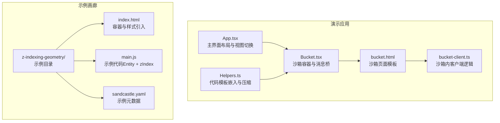
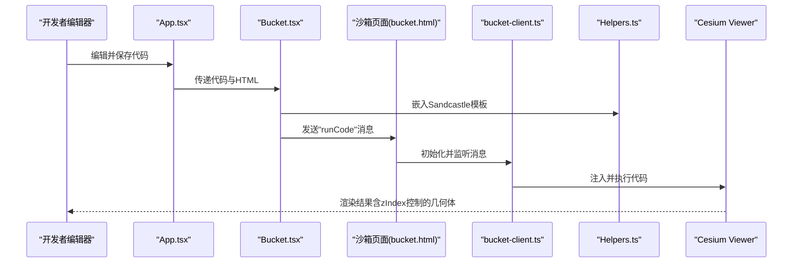
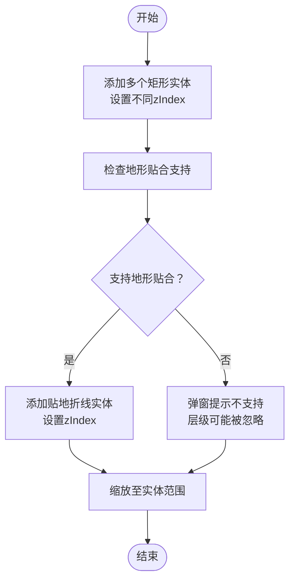
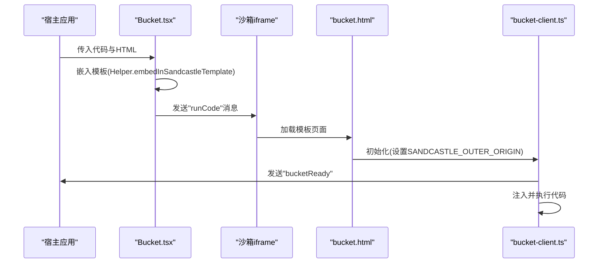
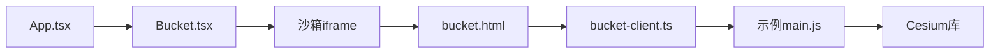

# 几何体层级管理示例

<cite>
**本文引用的文件**
- [main.js](file://apps/cesium-web/gallery/z-indexing-geometry/main.js)
- [index.html](file://apps/cesium-web/gallery/z-indexing-geometry/index.html)
- [sandcastle.yaml](file://apps/cesium-web/gallery/z-indexing-geometry/sandcastle.yaml)
- [App.tsx](file://apps/cesium-web/src/App.tsx)
- [Bucket.tsx](file://apps/cesium-web/src/components/Bucket/Bucket.tsx)
- [bucket.html](file://apps/cesium-web/templates/bucket.html)
- [bucket-client.ts](file://apps/cesium-web/src/util/bucket-client.ts)
- [Helpers.ts](file://apps/cesium-web/src/util/Helpers.ts)
- [package.json](file://apps/cesium-web/package.json)
- [README.md](file://README.md)
- [cesium-extensions.d.ts](file://packages/cesium-exts/types/cesium-extensions.d.ts)
</cite>

## 目录

1. [简介](#简介)
2. [项目结构](#项目结构)
3. [核心组件](#核心组件)
4. [架构总览](#架构总览)
5. [详细组件分析](#详细组件分析)
6. [依赖分析](#依赖分析)
7. [性能考虑](#性能考虑)
8. [故障排查指南](#故障排查指南)
9. [结论](#结论)
10. [附录](#附录)

## 简介

本示例聚焦于 Cesium 中几何体的层级管理与渲染顺序控制，围绕 Entity 的 zIndex 属性展开，演示如何在 3D 场景中对矩形、线（折线）等几何体进行分层叠加与遮挡关系管理。示例同时展示了平台能力检测与降级提示，以及在地形贴合场景下的注意事项。

## 项目结构

示例位于演示应用的画廊目录中，采用沙箱（Sandcastle）运行模式，通过 iframe 隔离执行用户代码，结合编辑器与实时预览面板，形成“编辑-运行-观察”的闭环。

图表来源

- [App.tsx:15-149](file://apps/cesium-web/src/App.tsx#L15-L149)
- [Bucket.tsx:53-135](file://apps/cesium-web/src/components/Bucket/Bucket.tsx#L53-L135)
- [bucket.html:1-84](file://apps/cesium-web/templates/bucket.html#L1-L84)
- [bucket-client.ts:20-87](file://apps/cesium-web/src/util/bucket-client.ts#L20-L87)
- [Helpers.ts:18-36](file://apps/cesium-web/src/util/Helpers.ts#L18-L36)
- [index.html:1-7](file://apps/cesium-web/gallery/z-indexing-geometry/index.html#L1-L7)
- [main.js:1-82](file://apps/cesium-web/gallery/z-indexing-geometry/main.js#L1-L82)
- [sandcastle.yaml:1-7](file://apps/cesium-web/gallery/z-indexing-geometry/sandcastle.yaml#L1-L7)

章节来源

- [App.tsx:15-149](file://apps/cesium-web/src/App.tsx#L15-L149)
- [Bucket.tsx:53-135](file://apps/cesium-web/src/components/Bucket/Bucket.tsx#L53-L135)
- [bucket.html:1-84](file://apps/cesium-web/templates/bucket.html#L1-L84)
- [bucket-client.ts:20-87](file://apps/cesium-web/src/util/bucket-client.ts#L20-L87)
- [Helpers.ts:18-36](file://apps/cesium-web/src/util/Helpers.ts#L18-L36)
- [index.html:1-7](file://apps/cesium-web/gallery/z-indexing-geometry/index.html#L1-L7)
- [main.js:1-82](file://apps/cesium-web/gallery/z-indexing-geometry/main.js#L1-L82)
- [sandcastle.yaml:1-7](file://apps/cesium-web/gallery/z-indexing-geometry/sandcastle.yaml#L1-L7)

## 核心组件

- 示例入口：在示例目录中，通过 Entity API 添加多个矩形与一条贴地折线，并为每项几何体设置 zIndex，从而控制其渲染层级。
- 平台能力检测：在添加几何体前，检查地形贴合与纹理材质的支持情况，必要时给出降级提示。
- 沙箱运行：编辑器中的代码通过模板嵌入与消息桥注入到沙箱页面中执行，实现安全隔离与快速刷新。

章节来源

- [main.js:5-81](file://apps/cesium-web/gallery/z-indexing-geometry/main.js#L5-L81)
- [Helpers.ts:18-36](file://apps/cesium-web/src/util/Helpers.ts#L18-L36)
- [bucket-client.ts:32-79](file://apps/cesium-web/src/util/bucket-client.ts#L32-L79)

## 架构总览

下图展示从编辑器到沙箱执行再到 Cesium 渲染的整体流程：

图表来源

- [App.tsx:74-112](file://apps/cesium-web/src/App.tsx#L74-L112)
- [Bucket.tsx:59-110](file://apps/cesium-web/src/components/Bucket/Bucket.tsx#L59-L110)
- [bucket-client.ts:62-87](file://apps/cesium-web/src/util/bucket-client.ts#L62-L87)
- [Helpers.ts:18-36](file://apps/cesium-web/src/util/Helpers.ts#L18-L36)
- [main.js:3-81](file://apps/cesium-web/gallery/z-indexing-geometry/main.js#L3-L81)

## 详细组件分析

### 示例代码：几何体层级与 z-index 应用

- 矩形几何体：通过 Rectangle 几何体类型与 Material 配置，设置不同的 zIndex，实现前后叠加效果。
- 折线几何体：通过 Polyline 配置贴地绘制与发光材质，同样设置 zIndex，验证线类型在层级系统中的表现。
- 平台能力检测：在添加贴地几何体之前，检查地形贴合与纹理材质支持，避免在不支持的平台上出现层级失效。

图表来源

- [main.js:5-81](file://apps/cesium-web/gallery/z-indexing-geometry/main.js#L5-L81)

章节来源

- [main.js:5-81](file://apps/cesium-web/gallery/z-indexing-geometry/main.js#L5-L81)

### 沙箱运行机制：模板嵌入与消息桥

- 模板嵌入：将用户代码包裹在 Sandcastle 运行模板中，自动补齐缺失的导入与加载完成回调，保证示例可直接运行。
- 消息桥：通过 IframeBridge 在宿主与沙箱之间传递消息，实现“运行”“重载”“控制台日志”等功能。
- 沙箱页面：提供最小化的 Cesium 资源加载与基础样式，确保示例稳定运行。

图表来源

- [Bucket.tsx:59-110](file://apps/cesium-web/src/components/Bucket/Bucket.tsx#L59-L110)
- [bucket-client.ts:62-87](file://apps/cesium-web/src/util/bucket-client.ts#L62-L87)
- [Helpers.ts:18-36](file://apps/cesium-web/src/util/Helpers.ts#L18-L36)
- [bucket.html:1-84](file://apps/cesium-web/templates/bucket.html#L1-L84)

章节来源

- [Bucket.tsx:59-110](file://apps/cesium-web/src/components/Bucket/Bucket.tsx#L59-L110)
- [bucket-client.ts:62-87](file://apps/cesium-web/src/util/bucket-client.ts#L62-L87)
- [Helpers.ts:18-36](file://apps/cesium-web/src/util/Helpers.ts#L18-L36)
- [bucket.html:1-84](file://apps/cesium-web/templates/bucket.html#L1-L84)

### Cesium 扩展类型：渲染与几何体相关能力

- 本项目类型定义文件包含大量 Cesium 底层渲染 API 的类型声明，涵盖着色器、顶点数组、纹理、渲染命令等，为更高级的层级控制与性能优化提供类型支撑。
- 例如，渲染命令与几何体相关字段可用于理解图元在渲染管线中的执行顺序与状态，辅助实现更精细的层级策略。

章节来源

- [cesium-extensions.d.ts:438-536](file://packages/cesium-exts/types/cesium-extensions.d.ts#L438-L536)
- [cesium-extensions.d.ts:825-868](file://packages/cesium-exts/types/cesium-extensions.d.ts#L825-L868)

## 依赖分析

- 应用依赖：React、Cesium、沙箱编辑器与 UI 组件库，通过 Vite 构建与开发服务器提供热更新体验。
- 示例依赖：示例代码直接依赖 Cesium 的 Entity API 与 Viewer，无需额外第三方库。
- 运行时依赖：沙箱页面模板通过 Cesium CDN 资源加载，确保示例在浏览器端可独立运行。

图表来源

- [package.json:12-29](file://apps/cesium-web/package.json#L12-L29)
- [App.tsx:15-149](file://apps/cesium-web/src/App.tsx#L15-L149)
- [Bucket.tsx:53-135](file://apps/cesium-web/src/components/Bucket/Bucket.tsx#L53-L135)
- [bucket.html:1-84](file://apps/cesium-web/templates/bucket.html#L1-L84)
- [bucket-client.ts:20-87](file://apps/cesium-web/src/util/bucket-client.ts#L20-L87)
- [main.js:1-82](file://apps/cesium-web/gallery/z-indexing-geometry/main.js#L1-L82)

章节来源

- [package.json:12-29](file://apps/cesium-web/package.json#L12-L29)
- [App.tsx:15-149](file://apps/cesium-web/src/App.tsx#L15-L149)
- [Bucket.tsx:53-135](file://apps/cesium-web/src/components/Bucket/Bucket.tsx#L53-L135)
- [bucket.html:1-84](file://apps/cesium-web/templates/bucket.html#L1-L84)
- [bucket-client.ts:20-87](file://apps/cesium-web/src/util/bucket-client.ts#L20-L87)
- [main.js:1-82](file://apps/cesium-web/gallery/z-indexing-geometry/main.js#L1-L82)

## 性能考虑

- 层级数量与绘制批次：层级越多，渲染批次与状态切换越频繁，可能影响帧率。建议合并同类几何体、减少透明度与复杂材质的数量。
- 透明度与深度测试：透明材质需要特殊的排序与渲染策略，避免深度冲突导致的视觉错误。优先使用不透明几何体，必要时启用深度写入与混合参数优化。
- 地形贴合与遮挡：贴地几何体在不同平台上支持度不同，不支持时层级可能被忽略。应提前检测并提供降级方案。
- 批量操作与分组：将具有相同层级需求的几何体归组，统一管理其 zIndex 与可见性，减少逐项更新带来的开销。
- 调试与可视化：利用 Cesium 的调试选项（如包围盒、拾取通道等）定位层级问题；在沙箱环境中逐步增加复杂度，观察性能变化。

## 故障排查指南

- 平台不支持地形贴合：当平台不支持贴地几何体时，示例会弹窗提示，此时层级控制可能失效。请在支持的平台上运行或改用非贴地几何体。
- 纹理材质限制：某些平台对地形上的纹理材质支持有限，可能导致材质不生效。可在示例中先移除纹理材质，确认层级控制是否正常。
- 沙箱加载失败：若沙箱页面未正确加载 Cesium 资源，检查模板中的资源路径与网络连接。确认沙箱页面已成功注入并执行示例代码。
- 控制台报错：通过沙箱控制台查看错误信息与行号，定位代码问题并修正。

章节来源

- [main.js:59-65](file://apps/cesium-web/gallery/z-indexing-geometry/main.js#L59-L65)
- [bucket-client.ts:62-87](file://apps/cesium-web/src/util/bucket-client.ts#L62-L87)
- [bucket.html:11-12](file://apps/cesium-web/templates/bucket.html#L11-L12)

## 结论

本示例通过 Entity 的 zIndex 属性直观展示了 3D 场景中几何体的层级管理与渲染顺序控制。结合沙箱运行机制与平台能力检测，开发者可以在不同环境下验证层级效果，并据此制定更稳健的场景组织策略。对于复杂场景，建议采用分组管理、批量操作与动态层级调整相结合的方式，在保证视觉效果的同时兼顾性能与可维护性。

## 附录

- 示例元数据：标题、标签与缩略图等信息由示例元数据文件定义，便于在画廊中展示与检索。
- 项目背景：本仓库为基于 Monorepo 的 Cesium 扩展库集合，提供热力图、风场等可视化组件，示例作为演示与教学用途。

章节来源

- [sandcastle.yaml:1-7](file://apps/cesium-web/gallery/z-indexing-geometry/sandcastle.yaml#L1-L7)
- [README.md:1-170](file://README.md#L1-L170)
