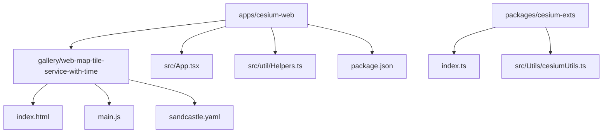
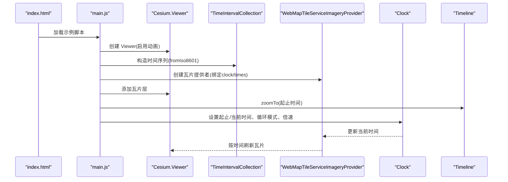
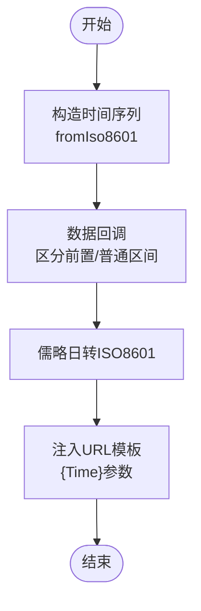
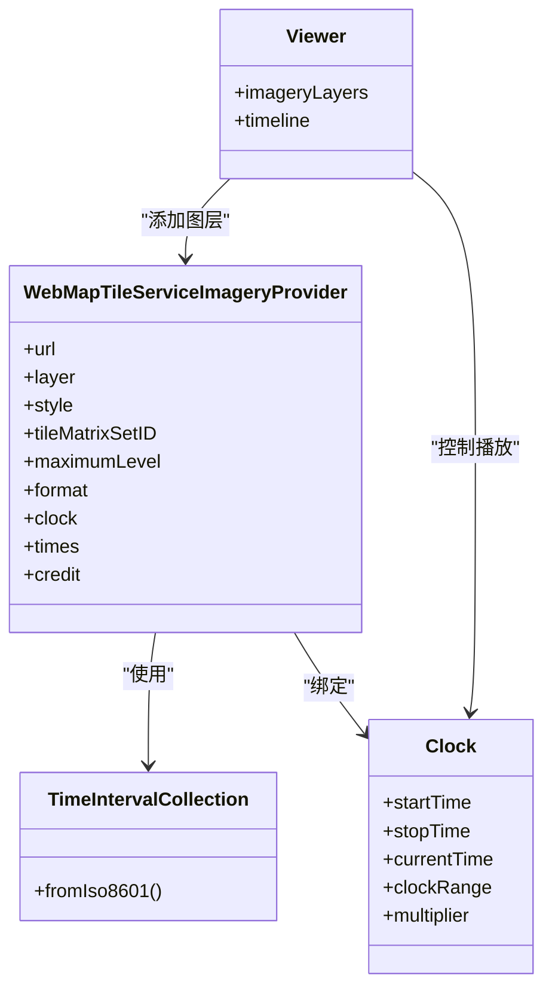
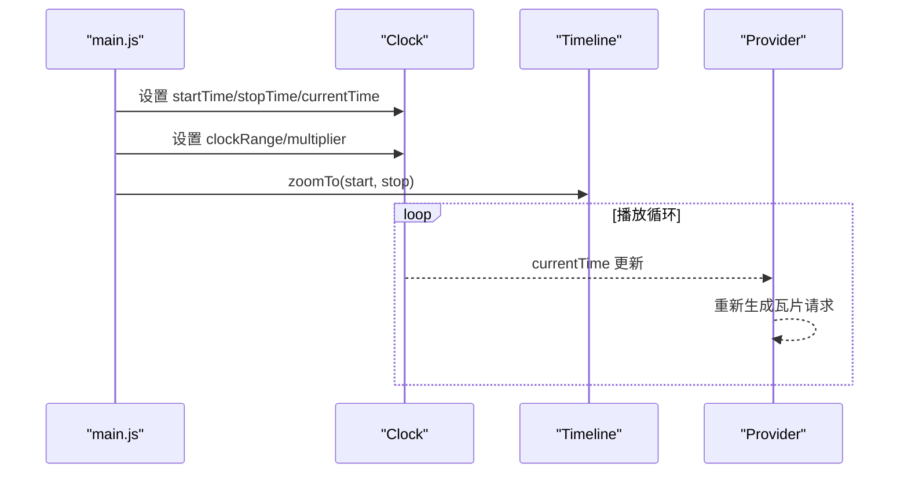
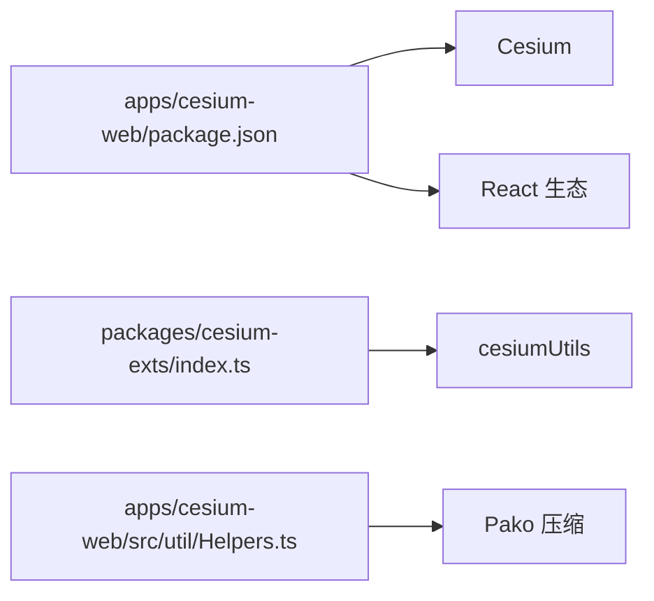

# 时间维度瓦片服务示例

<cite>
**本文引用的文件**
- [apps/cesium-web/gallery/web-map-tile-service-with-time/main.js](file://apps/cesium-web/gallery/web-map-tile-service-with-time/main.js)
- [apps/cesium-web/gallery/web-map-tile-service-with-time/index.html](file://apps/cesium-web/gallery/web-map-tile-service-with-time/index.html)
- [apps/cesium-web/gallery/web-map-tile-service-with-time/sandcastle.yaml](file://apps/cesium-web/gallery/web-map-tile-service-with-time/sandcastle.yaml)
- [apps/cesium-web/src/App.tsx](file://apps/cesium-web/src/App.tsx)
- [apps/cesium-web/src/util/Helpers.ts](file://apps/cesium-web/src/util/Helpers.ts)
- [apps/cesium-web/package.json](file://apps/cesium-web/package.json)
- [packages/cesium-exts/index.ts](file://packages/cesium-exts/index.ts)
- [packages/cesium-exts/src/Utils/cesiumUtils.ts](file://packages/cesium-exts/src/Utils/cesiumUtils.ts)
- [README.md](file://README.md)
</cite>

## 目录

1. [简介](#简介)
2. [项目结构](#项目结构)
3. [核心组件](#核心组件)
4. [架构总览](#架构总览)
5. [详细组件分析](#详细组件分析)
6. [依赖关系分析](#依赖关系分析)
7. [性能考量](#性能考量)
8. [故障排查指南](#故障排查指南)
9. [结论](#结论)
10. [附录](#附录)

## 简介

本示例展示了如何在 Cesium 中基于时间维度动态加载瓦片，实现时间序列影像的播放与交互。示例以 NASA GIBS 的 WMTS 影像服务为基础，结合 Cesium 的时间线与时钟机制，实现从 2015-07-30 到 2017-06-16 的每日 MODIS 卫星影像播放。读者将学习到：

- 时间序列数据在 Cesium 中的可视化原理与实现路径
- 时间轴控制、动态瓦片加载与时间相关数据渲染的关键技术
- 时间范围设置、瓦片服务参数与动画播放控制的完整配置
- 时间戳解析与数据格式转换流程
- 交互式时间控制（播放/暂停、快进/快退、精确时间定位）
- 时间数据的缓存策略与性能优化技巧
- 常见问题的解决方案与调试方法

## 项目结构

该示例位于演示应用的“画廊”目录下，采用最小化的 HTML 容器与独立的 JavaScript 示例文件组织方式。整体结构清晰，便于快速集成与二次开发。

图表来源

- [apps/cesium-web/gallery/web-map-tile-service-with-time/index.html:1-7](file://apps/cesium-web/gallery/web-map-tile-service-with-time/index.html#L1-L7)
- [apps/cesium-web/gallery/web-map-tile-service-with-time/main.js:1-61](file://apps/cesium-web/gallery/web-map-tile-service-with-time/main.js#L1-L61)
- [apps/cesium-web/src/App.tsx:1-149](file://apps/cesium-web/src/App.tsx#L1-L149)
- [apps/cesium-web/src/util/Helpers.ts:1-137](file://apps/cesium-web/src/util/Helpers.ts#L1-L137)
- [apps/cesium-web/package.json:1-51](file://apps/cesium-web/package.json#L1-L51)
- [packages/cesium-exts/index.ts:1-4](file://packages/cesium-exts/index.ts#L1-L4)
- [packages/cesium-exts/src/Utils/cesiumUtils.ts:1-106](file://packages/cesium-exts/src/Utils/cesiumUtils.ts#L1-L106)

章节来源

- [apps/cesium-web/gallery/web-map-tile-service-with-time/index.html:1-7](file://apps/cesium-web/gallery/web-map-tile-service-with-time/index.html#L1-L7)
- [apps/cesium-web/gallery/web-map-tile-service-with-time/main.js:1-61](file://apps/cesium-web/gallery/web-map-tile-service-with-time/main.js#L1-L61)
- [apps/cesium-web/src/App.tsx:1-149](file://apps/cesium-web/src/App.tsx#L1-L149)
- [apps/cesium-web/src/util/Helpers.ts:1-137](file://apps/cesium-web/src/util/Helpers.ts#L1-L137)
- [apps/cesium-web/package.json:1-51](file://apps/cesium-web/package.json#L1-L51)
- [packages/cesium-exts/index.ts:1-4](file://packages/cesium-exts/index.ts#L1-L4)
- [packages/cesium-exts/src/Utils/cesiumUtils.ts:1-106](file://packages/cesium-exts/src/Utils/cesiumUtils.ts#L1-L106)

## 核心组件

- 视图容器与示例入口
  - HTML 容器负责承载 Cesium 渲染视图与加载提示层，示例通过独立的 JavaScript 文件初始化场景。
- 时间序列构建与瓦片提供者
  - 使用时间区间集合构造时间序列，配合瓦片提供者按时间动态替换 URL 中的 Time 参数，实现逐日瓦片加载。
- 时钟与时间线控制
  - 通过时钟设置起止时间、当前时间、循环模式与倍速，配合时间线控件实现播放与缩放。
- 应用外壳与工具
  - 演示应用提供编辑器、画廊视图与控制台，辅助示例的编写、运行与调试；工具模块提供压缩与解压能力，便于分享与保存。

章节来源

- [apps/cesium-web/gallery/web-map-tile-service-with-time/index.html:1-7](file://apps/cesium-web/gallery/web-map-tile-service-with-time/index.html#L1-L7)
- [apps/cesium-web/gallery/web-map-tile-service-with-time/main.js:1-61](file://apps/cesium-web/gallery/web-map-tile-service-with-time/main.js#L1-L61)
- [apps/cesium-web/src/App.tsx:1-149](file://apps/cesium-web/src/App.tsx#L1-L149)
- [apps/cesium-web/src/util/Helpers.ts:1-137](file://apps/cesium-web/src/util/Helpers.ts#L1-L137)

## 架构总览

下图展示了示例从初始化到播放的端到端流程：HTML 容器加载，JavaScript 初始化 Viewer 与时间序列，配置瓦片提供者，设置时钟与时间线，最终驱动瓦片随时间变化而动态刷新。

图表来源

- [apps/cesium-web/gallery/web-map-tile-service-with-time/index.html:1-7](file://apps/cesium-web/gallery/web-map-tile-service-with-time/index.html#L1-L7)
- [apps/cesium-web/gallery/web-map-tile-service-with-time/main.js:1-61](file://apps/cesium-web/gallery/web-map-tile-service-with-time/main.js#L1-L61)

## 详细组件分析

### 时间序列构建与数据回调

- 时间区间集合
  - 使用 ISO 8601 间隔字符串构造时间序列，支持前置与后置区间，以及停止时间是否包含的配置。
  - 通过数据回调函数将时间区间转换为请求参数，回调区分前置与普通区间，分别取区间的起止时间。
- 时间戳解析与格式转换
  - 使用儒略日到 ISO 8601 的转换，确保时间格式与瓦片服务期望一致。
- 瓦片服务参数映射
  - 将 Time 参数注入到瓦片 URL 模板中，实现按天动态加载瓦片。

图表来源

- [apps/cesium-web/gallery/web-map-tile-service-with-time/main.js:7-27](file://apps/cesium-web/gallery/web-map-tile-service-with-time/main.js#L7-L27)

章节来源

- [apps/cesium-web/gallery/web-map-tile-service-with-time/main.js:7-27](file://apps/cesium-web/gallery/web-map-tile-service-with-time/main.js#L7-L27)

### 瓦片提供者与动态加载

- 提供者配置
  - 指定 WMTS URL 模板、层级、格式、样式与层级集 ID，绑定时钟与时间序列。
  - 透明度设置使时间序列影像叠加在底图之上，增强视觉对比。
- 动态加载机制
  - 时钟推进触发当前时间更新，瓦片提供者根据时间参数重新生成瓦片请求，实现逐日切换。

图表来源

- [apps/cesium-web/gallery/web-map-tile-service-with-time/main.js:32-48](file://apps/cesium-web/gallery/web-map-tile-service-with-time/main.js#L32-L48)
- [apps/cesium-web/gallery/web-map-tile-service-with-time/main.js:55-61](file://apps/cesium-web/gallery/web-map-tile-service-with-time/main.js#L55-L61)

章节来源

- [apps/cesium-web/gallery/web-map-tile-service-with-time/main.js:32-48](file://apps/cesium-web/gallery/web-map-tile-service-with-time/main.js#L32-L48)
- [apps/cesium-web/gallery/web-map-tile-service-with-time/main.js:55-61](file://apps/cesium-web/gallery/web-map-tile-service-with-time/main.js#L55-L61)

### 时钟与时间线控制

- 时间范围与播放控制
  - 设置起止时间与当前时间，选择循环播放模式与播放倍速，实现连续播放与可控速度。
- 时间线缩放
  - 使用时间线控件将可视范围缩放到指定起止时间，便于用户直观定位时间窗口。

图表来源

- [apps/cesium-web/gallery/web-map-tile-service-with-time/main.js:50-61](file://apps/cesium-web/gallery/web-map-tile-service-with-time/main.js#L50-L61)

章节来源

- [apps/cesium-web/gallery/web-map-tile-service-with-time/main.js:50-61](file://apps/cesium-web/gallery/web-map-tile-service-with-time/main.js#L50-L61)

### 交互式时间控制实现

- 播放/暂停
  - 通过时钟的倍速控制实现播放与暂停（倍速为 0 时暂停）。
- 快进/快退
  - 调整时钟倍速符号与绝对值实现快进/快退。
- 精确时间定位
  - 直接设置当前时间或通过时间线拖拽定位到特定日期。
- 时间线缩放与平移
  - 使用时间线控件的缩放与平移功能快速浏览时间序列。

章节来源

- [apps/cesium-web/gallery/web-map-tile-service-with-time/main.js:55-61](file://apps/cesium-web/gallery/web-map-tile-service-with-time/main.js#L55-L61)

### 示例元数据与画廊集成

- 示例元数据
  - YAML 文件定义示例标题、标签与缩略图，便于在画廊中展示与检索。
- 画廊与编辑器
  - 应用外壳提供编辑器与画廊视图，示例代码可在沙盒环境中运行与调试。

章节来源

- [apps/cesium-web/gallery/web-map-tile-service-with-time/sandcastle.yaml:1-7](file://apps/cesium-web/gallery/web-map-tile-service-with-time/sandcastle.yaml#L1-L7)
- [apps/cesium-web/src/App.tsx:1-149](file://apps/cesium-web/src/App.tsx#L1-L149)

## 依赖关系分析

- 外部依赖
  - Cesium 为核心渲染与时间管理库，提供 Viewer、时钟、时间区间集合与瓦片提供者等能力。
  - React 生态用于演示应用的界面与交互。
- 内部依赖
  - 扩展库提供工具函数与可视化组件，便于在示例中复用与扩展。
- 构建与运行
  - Vite 作为开发服务器与打包工具，提供热更新与快速预览。

图表来源

- [apps/cesium-web/package.json:12-28](file://apps/cesium-web/package.json#L12-L28)
- [packages/cesium-exts/index.ts:1-4](file://packages/cesium-exts/index.ts#L1-L4)
- [packages/cesium-exts/src/Utils/cesiumUtils.ts:1-106](file://packages/cesium-exts/src/Utils/cesiumUtils.ts#L1-L106)
- [apps/cesium-web/src/util/Helpers.ts:1-137](file://apps/cesium-web/src/util/Helpers.ts#L1-L137)

章节来源

- [apps/cesium-web/package.json:12-28](file://apps/cesium-web/package.json#L12-L28)
- [packages/cesium-exts/index.ts:1-4](file://packages/cesium-exts/index.ts#L1-L4)
- [packages/cesium-exts/src/Utils/cesiumUtils.ts:1-106](file://packages/cesium-exts/src/Utils/cesiumUtils.ts#L1-L106)
- [apps/cesium-web/src/util/Helpers.ts:1-137](file://apps/cesium-web/src/util/Helpers.ts#L1-L137)

## 性能考量

- 瓦片层级与分辨率
  - 合理设置最大层级与瓦片尺寸，避免过高的分辨率导致网络与渲染压力。
- 时间步长与播放速度
  - 选择合适的时间步长（如每日）与播放倍速，平衡流畅度与数据量。
- 缓存策略
  - 利用浏览器与 CDN 缓存机制减少重复请求；对频繁访问的瓦片进行本地缓存。
- 渲染优化
  - 降低透明度叠加层数，减少混合开销；必要时关闭非关键图层。
- 网络与带宽
  - 在弱网环境下适当降低播放速度或减少层级，保证交互流畅。

## 故障排查指南

- 瓦片加载失败
  - 检查时间参数是否正确注入到 URL 模板；确认时间戳格式与服务端期望一致。
- 时间线不可用
  - 确认时间序列构造成功且绑定到时钟；检查起止时间设置是否合理。
- 播放不生效
  - 确认时钟倍速非零；检查循环模式与当前时间是否正确更新。
- 性能卡顿
  - 降低最大层级或播放速度；减少叠加图层数；检查网络状况与缓存命中率。
- 示例无法运行
  - 确认 Cesium 版本与依赖匹配；检查浏览器控制台错误信息并定位具体模块。

章节来源

- [apps/cesium-web/gallery/web-map-tile-service-with-time/main.js:32-48](file://apps/cesium-web/gallery/web-map-tile-service-with-time/main.js#L32-L48)
- [apps/cesium-web/gallery/web-map-tile-service-with-time/main.js:55-61](file://apps/cesium-web/gallery/web-map-tile-service-with-time/main.js#L55-L61)
- [apps/cesium-web/src/util/Helpers.ts:63-79](file://apps/cesium-web/src/util/Helpers.ts#L63-L79)

## 结论

本示例以简洁的方式演示了 Cesium 中时间维度瓦片服务的核心实现：通过时间区间集合与瓦片提供者的联动，结合时钟与时间线控件，实现了从 2015 年到 2017 年的每日卫星影像播放。通过对时间戳解析、URL 注入、播放控制与性能优化的系统化设计，开发者可以在此基础上扩展更多时间序列可视化场景，满足科研、监测与教学等领域的多样化需求。

## 附录

- 快速上手
  - 在演示应用中打开示例文件，点击运行即可看到时间序列播放效果。
- 扩展建议
  - 引入更多瓦片服务与图层叠加，实现多源数据融合；增加交互控件（播放/暂停、倍速、跳转）以提升用户体验。
- 参考资料
  - Cesium 官方文档与时钟/时间线 API 文档
  - NASA GIBS API 文档（WMTS）
