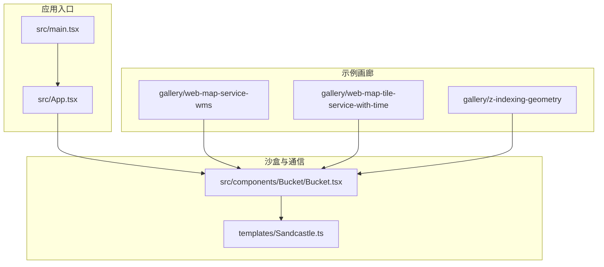
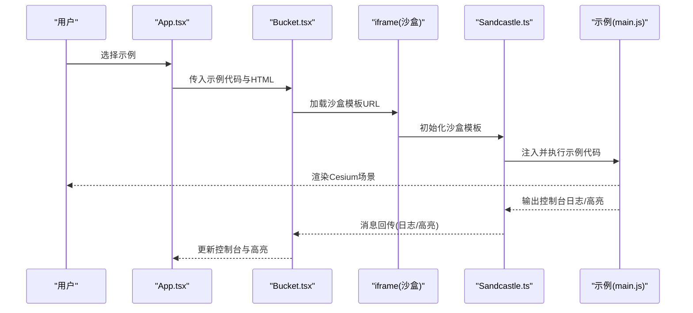
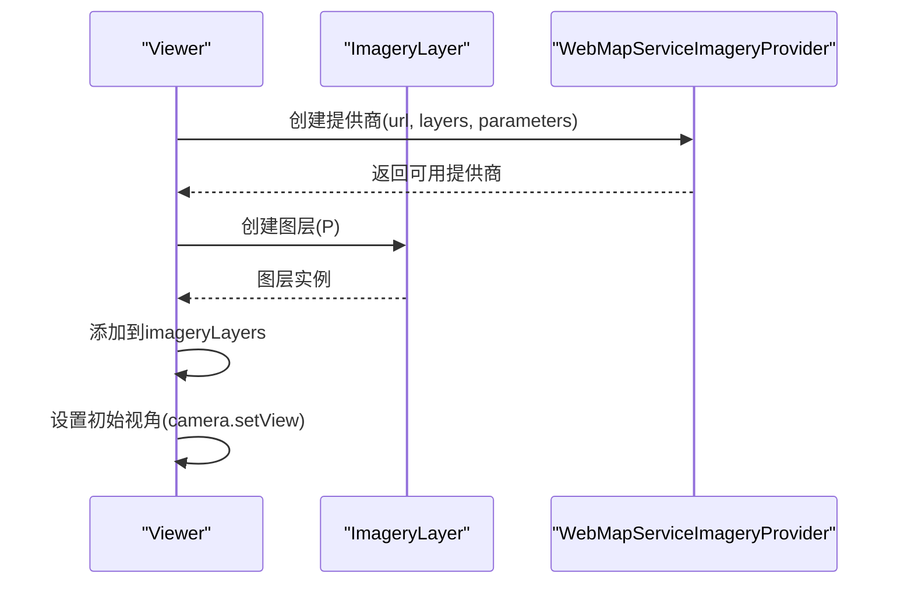
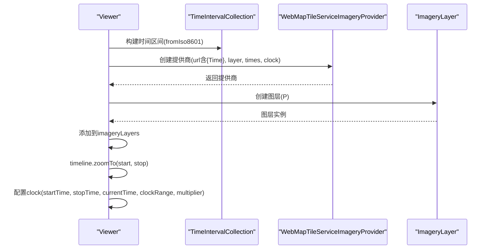
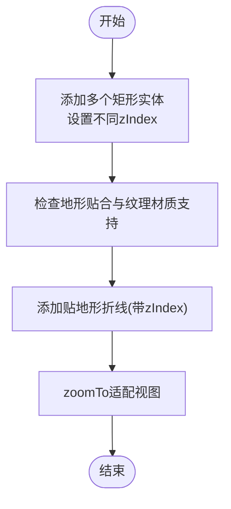
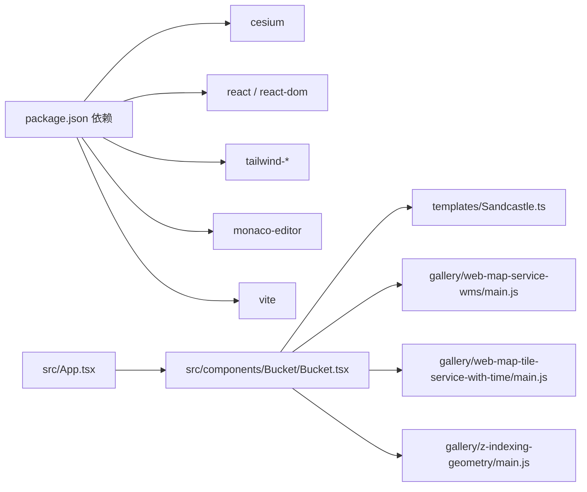

# 示例展示

<cite>
**本文引用的文件**
- [apps/cesium-web/gallery/web-map-service-wms/index.html](file://apps/cesium-web/gallery/web-map-service-wms/index.html)
- [apps/cesium-web/gallery/web-map-service-wms/main.js](file://apps/cesium-web/gallery/web-map-service-wms/main.js)
- [apps/cesium-web/gallery/web-map-service-wms/sandcastle.yaml](file://apps/cesium-web/gallery/web-map-service-wms/sandcastle.yaml)
- [apps/cesium-web/gallery/web-map-tile-service-with-time/index.html](file://apps/cesium-web/gallery/web-map-tile-service-with-time/index.html)
- [apps/cesium-web/gallery/web-map-tile-service-with-time/main.js](file://apps/cesium-web/gallery/web-map-tile-service-with-time/main.js)
- [apps/cesium-web/gallery/web-map-tile-service-with-time/sandcastle.yaml](file://apps/cesium-web/gallery/web-map-tile-service-with-time/sandcastle.yaml)
- [apps/cesium-web/gallery/z-indexing-geometry/index.html](file://apps/cesium-web/gallery/z-indexing-geometry/index.html)
- [apps/cesium-web/gallery/z-indexing-geometry/main.js](file://apps/cesium-web/gallery/z-indexing-geometry/main.js)
- [apps/cesium-web/gallery/z-indexing-geometry/sandcastle.yaml](file://apps/cesium-web/gallery/z-indexing-geometry/sandcastle.yaml)
- [apps/cesium-web/src/App.tsx](file://apps/cesium-web/src/App.tsx)
- [apps/cesium-web/src/main.tsx](file://apps/cesium-web/src/main.tsx)
- [apps/cesium-web/src/components/Bucket/Bucket.tsx](file://apps/cesium-web/src/components/Bucket/Bucket.tsx)
- [apps/cesium-web/templates/Sandcastle.ts](file://apps/cesium-web/templates/Sandcastle.ts)
- [apps/cesium-web/package.json](file://apps/cesium-web/package.json)
- [apps/cesium-web/README.md](file://apps/cesium-web/README.md)
</cite>

## 目录

1. [简介](#简介)
2. [项目结构](#项目结构)
3. [核心组件](#核心组件)
4. [架构总览](#架构总览)
5. [详细组件分析](#详细组件分析)
6. [依赖关系分析](#依赖关系分析)
7. [性能考虑](#性能考虑)
8. [故障排查指南](#故障排查指南)
9. [结论](#结论)
10. [附录](#附录)

## 简介

本文件面向希望快速上手并深入理解 Cesium 在浏览器端可视化应用中的多种典型场景的开发者与学习者。围绕以下三个示例，系统讲解其原理、实现步骤、配置要点、运行效果与扩展方法：

- WMS 网络地图服务集成示例：演示如何通过 WMS 提供商加载影像图层，并设置透明度与初始视角。
- 时间维度瓦片服务示例：演示如何基于时间序列的 WMTS 瓦片服务，结合时间线与播放控制，实现动态影像浏览。
- 几何体层级管理示例：演示如何通过 zIndex 对实体几何体进行叠放控制，并检测平台对地形贴合能力的支持情况。

同时，文档提供性能优化建议与最佳实践，帮助读者在真实项目中高效落地。

## 项目结构

示例应用采用 React + Vite 构建，示例代码以独立目录形式组织在 gallery 中，每个示例包含 HTML 容器、JavaScript 主入口与元数据配置文件。运行时通过沙盒模板与 iframe 桥接机制在隔离环境中执行示例代码。

**图表来源**

- [apps/cesium-web/src/main.tsx:1-19](file://apps/cesium-web/src/main.tsx#L1-L19)
- [apps/cesium-web/src/App.tsx:1-149](file://apps/cesium-web/src/App.tsx#L1-L149)
- [apps/cesium-web/src/components/Bucket/Bucket.tsx:1-135](file://apps/cesium-web/src/components/Bucket/Bucket.tsx#L1-L135)
- [apps/cesium-web/templates/Sandcastle.ts:1-264](file://apps/cesium-web/templates/Sandcastle.ts#L1-L264)

**章节来源**

- [apps/cesium-web/src/main.tsx:1-19](file://apps/cesium-web/src/main.tsx#L1-L19)
- [apps/cesium-web/src/App.tsx:1-149](file://apps/cesium-web/src/App.tsx#L1-L149)
- [apps/cesium-web/package.json:1-51](file://apps/cesium-web/package.json#L1-L51)

## 核心组件

- 应用入口与主题上下文：初始化插件、主题提供者与根组件挂载。
- 主界面布局：左侧导航、中间编辑器/画廊视图、右侧 Cesium 视窗与控制台。
- 沙盒容器（Bucket）：承载 iframe，负责与沙盒模板通信、注入示例 HTML/JS、接收控制台输出与高亮提示。
- 沙盒模板（Sandcastle）：提供工具栏控件、默认动作、高亮与消息桥接等基础设施。

**章节来源**

- [apps/cesium-web/src/main.tsx:1-19](file://apps/cesium-web/src/main.tsx#L1-L19)
- [apps/cesium-web/src/App.tsx:15-146](file://apps/cesium-web/src/App.tsx#L15-L146)
- [apps/cesium-web/src/components/Bucket/Bucket.tsx:53-135](file://apps/cesium-web/src/components/Bucket/Bucket.tsx#L53-L135)
- [apps/cesium-web/templates/Sandcastle.ts:32-261](file://apps/cesium-web/templates/Sandcastle.ts#L32-L261)

## 架构总览

示例运行时流程如下：

- 应用启动后，渲染主界面与沙盒容器。
- 用户选择某个示例，沙盒容器加载沙盒模板页面并在 iframe 中执行示例代码。
- 示例代码创建 Viewer、添加图层或实体，并通过 Cesium API 完成渲染。
- 控制台与高亮功能通过消息桥接在宿主与沙盒之间传递。

**图表来源**

- [apps/cesium-web/src/App.tsx:118-141](file://apps/cesium-web/src/App.tsx#L118-L141)
- [apps/cesium-web/src/components/Bucket/Bucket.tsx:59-110](file://apps/cesium-web/src/components/Bucket/Bucket.tsx#L59-L110)
- [apps/cesium-web/templates/Sandcastle.ts:106-116](file://apps/cesium-web/templates/Sandcastle.ts#L106-L116)
- [apps/cesium-web/gallery/web-map-service-wms/main.js:1-22](file://apps/cesium-web/gallery/web-map-service-wms/main.js#L1-L22)

## 详细组件分析

### WMS 网络地图服务集成示例

- 示例目标：从 WMS 服务加载影像图层，设置透明度与 PNG 格式，并将相机视角定位至澳大利亚区域。
- 关键实现点：
  - 创建 Viewer 实例并挂载到容器。
  - 使用 WebMapServiceImageryProvider 构造 WMS 提供商，指定服务地址、图层名与参数（透明、格式）。
  - 将 ImageryLayer 添加到 imageryLayers。
  - 使用 Rectangle.fromDegrees 与 camera.setView 设置初始视角。
- 元数据与资源：
  - HTML 容器与样式位于示例目录。
  - 示例脚本与配置见对应文件。
- 运行效果：加载指定 WMS 图层，呈现澳大利亚区域影像；支持调整透明度与格式参数。

**图表来源**

- [apps/cesium-web/gallery/web-map-service-wms/main.js:3-21](file://apps/cesium-web/gallery/web-map-service-wms/main.js#L3-L21)

**章节来源**

- [apps/cesium-web/gallery/web-map-service-wms/index.html:1-7](file://apps/cesium-web/gallery/web-map-service-wms/index.html#L1-L7)
- [apps/cesium-web/gallery/web-map-service-wms/main.js:1-22](file://apps/cesium-web/gallery/web-map-service-wms/main.js#L1-L22)
- [apps/cesium-web/gallery/web-map-service-wms/sandcastle.yaml:1-7](file://apps/cesium-web/gallery/web-map-service-wms/sandcastle.yaml#L1-L7)

### 时间维度瓦片服务示例

- 示例目标：基于时间序列的 WMTS 瓦片服务，构建时间区间集合，实现动态播放与时间轴缩放。
- 关键实现点：
  - 创建 Viewer 并启用动画。
  - 使用 TimeIntervalCollection.fromIso8601 构建时间区间集合，包含起止时间、是否包含尾部间隔、数据回调等。
  - 使用 WebMapTileServiceImageryProvider 构造 WMTS 提供商，替换 URL 中的 {Time} 占位符，绑定 clock、times 参数。
  - 设置图层 alpha 为半透明，便于观察地表细节。
  - 配置 viewer.timeline 与 viewer.clock，设置起止时间、当前时间、循环播放与倍速。
- 元数据与资源：
  - HTML 容器与样式位于示例目录。
  - 示例脚本与配置见对应文件。
- 运行效果：加载 NASA GIBS 的 MODIS 真彩影像，按天时间序列播放，时间轴可拖动与缩放。

**图表来源**

- [apps/cesium-web/gallery/web-map-tile-service-with-time/main.js:3-61](file://apps/cesium-web/gallery/web-map-tile-service-with-time/main.js#L3-L61)

**章节来源**

- [apps/cesium-web/gallery/web-map-tile-service-with-time/index.html:1-7](file://apps/cesium-web/gallery/web-map-tile-service-with-time/index.html#L1-L7)
- [apps/cesium-web/gallery/web-map-tile-service-with-time/main.js:1-61](file://apps/cesium-web/gallery/web-map-tile-service-with-time/main.js#L1-L61)
- [apps/cesium-web/gallery/web-map-tile-service-with-time/sandcastle.yaml:1-7](file://apps/cesium-web/gallery/web-map-tile-service-with-time/sandcastle.yaml#L1-L7)

### 几何体层级管理示例

- 示例目标：通过 zIndex 控制实体几何体的叠放顺序，验证平台对地形贴合与纹理材质的支持。
- 关键实现点：
  - 使用 viewer.entities.add 添加多个矩形实体，设置不同的 zIndex 值。
  - 对贴纹理的矩形与贴地形的折线，检查平台支持性并给出提示。
  - 使用 zoomTo(viewer.entities) 自动适配视图。
- 元数据与资源：
  - HTML 容器与样式位于示例目录。
  - 示例脚本与配置见对应文件。
- 运行效果：多层矩形与贴地形折线按 zIndex 叠放，若平台不支持则提示忽略层级。

**图表来源**

- [apps/cesium-web/gallery/z-indexing-geometry/main.js:5-82](file://apps/cesium-web/gallery/z-indexing-geometry/main.js#L5-L82)

**章节来源**

- [apps/cesium-web/gallery/z-indexing-geometry/index.html:1-7](file://apps/cesium-web/gallery/z-indexing-geometry/index.html#L1-L7)
- [apps/cesium-web/gallery/z-indexing-geometry/main.js:1-82](file://apps/cesium-web/gallery/z-indexing-geometry/main.js#L1-L82)
- [apps/cesium-web/gallery/z-indexing-geometry/sandcastle.yaml:1-7](file://apps/cesium-web/gallery/z-indexing-geometry/sandcastle.yaml#L1-L7)

## 依赖关系分析

- 应用依赖：React、Cesium、TailwindCSS、Monaco 编辑器等。
- 插件与构建：Vite、React SWC 插件、ESLint 配置等。
- 示例与沙盒：示例代码通过沙盒模板与 iframe 桥接执行，确保安全与隔离。

**图表来源**

- [apps/cesium-web/package.json:12-28](file://apps/cesium-web/package.json#L12-L28)
- [apps/cesium-web/src/App.tsx:7-10](file://apps/cesium-web/src/App.tsx#L7-L10)
- [apps/cesium-web/src/components/Bucket/Bucket.tsx:4-6](file://apps/cesium-web/src/components/Bucket/Bucket.tsx#L4-L6)

**章节来源**

- [apps/cesium-web/package.json:1-51](file://apps/cesium-web/package.json#L1-L51)
- [apps/cesium-web/README.md:1-74](file://apps/cesium-web/README.md#L1-L74)

## 性能考虑

- 图层透明度与混合：半透明图层会增加合成开销，建议仅在必要时启用（如时间维度示例中的 alpha 调整）。
- 瓦片级别与分辨率：合理设置 maximumLevel 与 tileWidth/tileHeight，避免过度请求高分辨率瓦片导致网络与 GPU 压力。
- 时间序列播放：适当降低倍速与帧率，避免 CPU/GPU 过载；必要时预缓存关键帧。
- 地形贴合与材质：对不支持贴地形折线或纹理材质的平台，应降级处理并提示用户。
- 资源加载策略：优先使用 CDN 与压缩格式，减少首屏加载时间；对大图层采用懒加载与可见性控制。
- 渲染管线优化：减少不必要的实体数量与复杂几何体，合并相似图层，利用 Cesium 的内置优化（如深度测试、剔除）。

## 故障排查指南

- 示例无法加载或报错：
  - 检查沙盒模板 URL 与 iframe 源是否正确，确认跨域与沙箱权限。
  - 查看控制台输出，关注高亮行号与错误信息。
- 地图或瓦片显示异常：
  - 确认 WMS/WMTS 服务地址与图层名正确，参数（format、transparent、Time 占位符）匹配。
  - 检查网络连通性与代理设置，必要时更换镜像源。
- 时间轴不工作：
  - 确认 times 构建与 dataCallback 返回的 Time 字段格式符合 ISO8601。
  - 检查 clock 的 startTime/stopTime/currentTime 与 clockRange/multiplier 设置。
- 几何体层级无效：
  - 若平台不支持贴地形折线或纹理材质，将忽略 zIndex；请在运行前检查支持性并提示用户。
- 性能问题：
  - 降低 maximumLevel 或关闭半透明；减少实体数量与复杂度；启用必要的剔除与缓存。

**章节来源**

- [apps/cesium-web/src/components/Bucket/Bucket.tsx:69-110](file://apps/cesium-web/src/components/Bucket/Bucket.tsx#L69-L110)
- [apps/cesium-web/gallery/z-indexing-geometry/main.js:59-65](file://apps/cesium-web/gallery/z-indexing-geometry/main.js#L59-L65)
- [apps/cesium-web/gallery/web-map-tile-service-with-time/main.js:21-27](file://apps/cesium-web/gallery/web-map-tile-service-with-time/main.js#L21-L27)

## 结论

本示例文档提供了三种典型 Cesium 场景的完整实现路径：WMS 影像接入、时间维度瓦片播放与几何体层级管理。通过沙盒模板与 iframe 桥接机制，示例在隔离环境中安全运行，便于调试与演示。结合性能优化与故障排查建议，开发者可以在此基础上快速扩展更多可视化需求。

## 附录

- 学习路径建议：
  - 第一步：运行并理解 WMS 示例，掌握基础图层添加与相机控制。
  - 第二步：运行时间维度示例，理解时间区间、时钟与播放控制。
  - 第三步：运行几何体层级示例，理解 zIndex 与平台支持性检测。
  - 第四步：尝试修改参数（透明度、分辨率、时间范围、zIndex），观察效果变化。
  - 第五步：结合自身业务，将示例思路迁移到实际项目中，逐步引入更复杂的图层与交互。
- 扩展与定制：
  - WMS：替换服务地址、图层名与参数，适配本地或第三方 WMS。
  - 时间维度：自定义时间序列格式、数据回调与播放策略。
  - 几何体：添加更多实体类型（点、线、面、模型），探索材质与光照效果。
- 最佳实践：
  - 明确数据来源与版权，遵守服务端访问限制。
  - 合理设置缓存与预加载，提升用户体验。
  - 分模块组织代码，便于维护与复用。
  - 使用版本化与灰度发布策略，逐步上线新功能。
